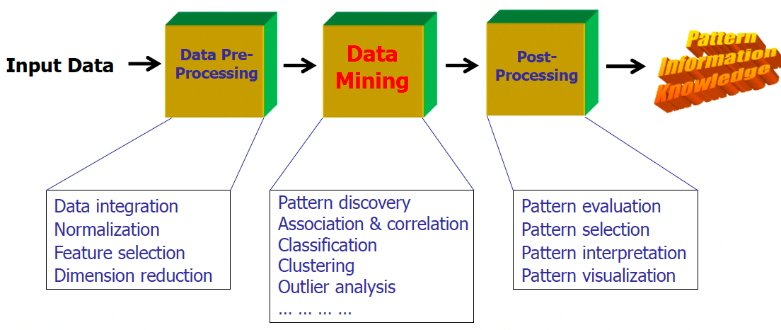

# Data Mining and Machine Learning

We have an explosive growth of data, now we talk about petabytes and a nowadays problem is how to store this data and analyze them.

Most of the algorithms we have today were proposed 40 years ago but today we have a lot of data and the possibility to store and analyze this data, thanks to storage and computational capabilities. This is why today AI is becoming fundamental.

This data comes from different sources and when we analyze them we want to produce value.

# Data Mining and Knowledge Discovery

Data Mining, from a meaning point of view, is the extraction of interesting (non-trivial, implicit, previously unknown and potentially useful) patterns or knowledge from huge amount of data. Alternatives name are knowledge discovery (mining) in databases (KDD), knowledge extraction, data/pattern analysis, data archeology, data dredging, information harvesting, business intelligence, etc.

# Business Intelligence Process

A typical data mining process that can be found in Business Intelligence (analysis in a company) is this one:

We take data from different sources and we preprocess data to remove noise, missing values and we integrate different sources creating the dataset. Results depend on the preprocessing phase.

We do statistical summary, querying and reporting and then start the real data mining process.

We have to visualize the result in a way that are understandable for everyone.

All knowledge extracted are used by management to perform strategical decisions.

# Statistical and Machine Learning Process

From a statistical and machine learning point of view this is the process:

The decision on choosing the right algorithm depend on the specific application, we have to identify the best algorithm for the particular context.

We have to define some metrics to give the possibilities to the designer to identify the best solution. We have to compare the results produced by our data mining algorithms and we need a metric to do that.

When we talk about data we talk about heterogeneous data and we have different types of data that are typically stored in different repositories.

Most of the data mining algorithms are based on the concept of distance. But if objects are described by numerical or nominal attributes is hard to use distance.

# Types of Data and Patterns

We have different kind of knowledge that can be mined, it depends on the specific domain.

What kind of data we can mine? Data stored in databases (relational databases, data warehouse or transactional databases), data streams and sensor data, time series data, temporal data, sequence data, structure data, graphs, social networks, multi linked data, the www, text databases, multimedia databases and so on.

## Patterns that can be mined

We have frequent pattern analysis, for example items frequently purchased together by an high number of customers.
In this case, the dataset to analyze is the transactional dataset, the bill with product's purchases.
The patter in this case is a subset of products.

Once we mine the frequent pattern we can produce association rules, that are used to find correlations between data sets. They are ideally used to explain patterns in data from seemingly independent information repositories.
We observe that an high number of customers bought together Diaper and Beer, this is a frequent pattern and we can investigate the association rule where an item imply another and what's the probability that the second item is purchased buying the first item.
Diaper -> Beer [0.5%, 75%] (support, confidence)
The support is the frequency, express how many transactions support the pattern in all the transactions.
The confidence express how much is the probability that purchasing diaper, the customer will purchase beer.

# Evaluation of results

Between all association rules we need to find the best rules, having some metrics to evaluate the results.
In frequent pattern we want to understand if two items are purchased together.
In frequent sequence we want to understand in different transactions if a sequence is repeated.

# Classification and label prediction

Classification and label prediction is a problem that consists on constructing models based on some training examples, we have to have some samples in which we know the label associated.
Starting from this training set, the classification algorithm learn how to classify other records.
In classification the output is a label, while in prediction the output is a numeric value.

# Unsupervised learning

In unsupervised learning the class label is unknown. In cluster analysis, in particular, we group data to form new categories, cluster houses to find distribution patterns.
Principle: Maximizing intra class similarity & minimizing interclass similarity.

# Outlier analysis

An outlier is a data object that does not comply with the general behavior of the data. Outlier analysis is important to determine outliers.
Useful in fraud detection or rare events analysis.
Sequence, trend and evolution analysis, but also mining data streams are other possible uses.

# Graph Mining and Information network analysis

Graph Mining consists in finding frequent subgraphs, trees or substructures on data.
Information network analysis consists in analyzing social network and web mining consists in analyzing web information networks.

# Post-processing phase

The post-processing phase is used to understand between all knowledge which are relevant for use, not all mined knowledge are interesting.

# Data Mining and multiple disciplines

# High-dimensionality and high-complexity of data

Today we have a tremendous amount of data and we have high-dimensionality data, objects described by a high number of dimensions. With the increase of dimensionality objects appear far from each other.
Most of algorithms are based on the concept of distance.

We can change the algorithm or we can try to reduce the number of dimensions, in high-dimensionality some algorithms do not work properly. We have also high-complexity of data.

# Major issues in data mining

The major issues in data mining are mining methodology, efficiency and scalability, diversity of data types, user interaction and impacts on society.

