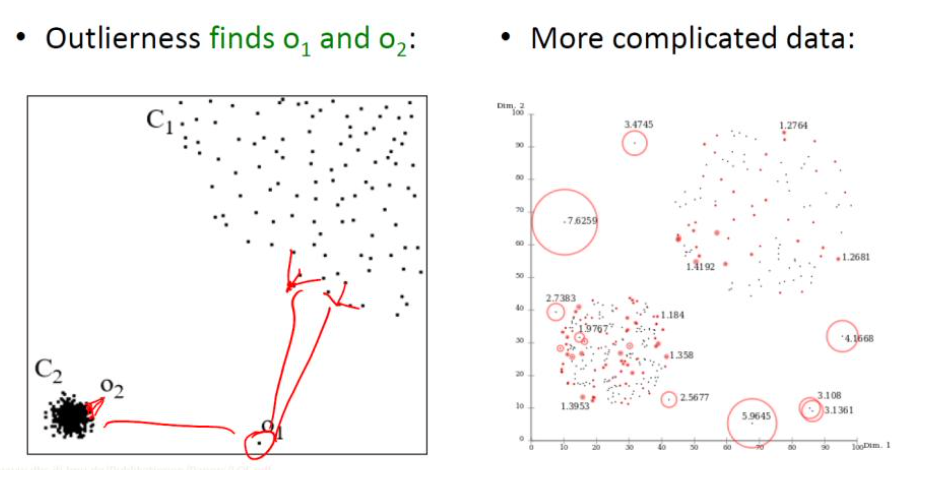
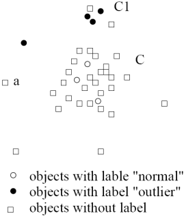
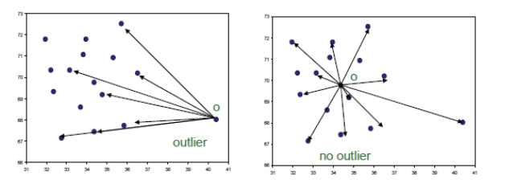
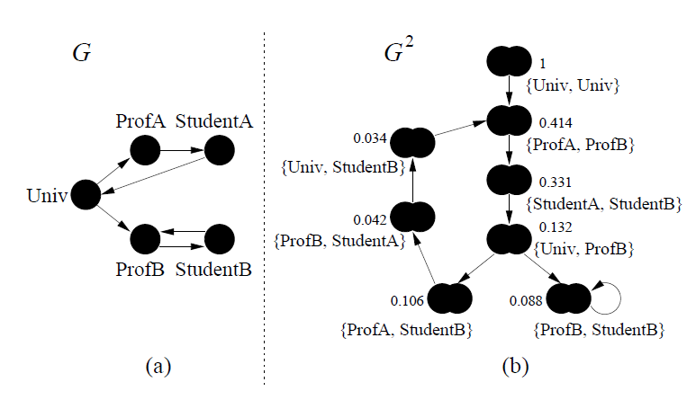

# Clustering Graphs and Network Data

Network is a collection of entities that are interconnected with links.

An example is social network where entities are people and links are friendships.

We cannot truly understand a complex system unless we understand the underlying network.

Everything is connected, studying individual entities gives only a partial view of a system.

Two main themes:

-   What are the structural properties of the network?

-   How do processes happen in the network?

In mathematics, networks are called graphs, the entities are nodes, and the links are edges.Networks of thousands, millions, or billions of nodes are impossible to process visually.

Problems become harder and processes are more complex.

Current problems are:

-   Information/Virus Cascade. How do viruses spread between individuals? How does information propagate in social and information networks?

-   Ranking of nodes on the web. We also need algorithms to compute the importance of nodes in a graph. For instance, the PageRank algorithm in Google.

-   Link prediction, that consists in, given a snapshot of a social network at time t, seek to accurately predict the edges that will be added to the network during the interval from time t to a given future time t\'. Applications: Accelerate the growth of a social network, Identify suspect relationships.

-   Network content. Users on online social networks generate content. Mining the content in conjunction with the network can be useful.

It can be useful for social raccomandations.Do friends post similar content on Facebook? Can we understand a user's interests by looking at those of their friends?

-   Social media. Twitter has become a global "sensor" detecting and reporting everything. Automatically detect events using Twitter like Earthquake news propagation or Sentiment mining.

-   Clustering and Finding Communities, which are cohesive subgroups are subsets of actors among whom there are relatively strong, direct, intense, frequent, or positive ties.

-   Community Evolution. People become similar to those they interact with.

-   Bi-partite graphs, clustering customers buying similar products; introducing similarity metrics.

-   Web search engines, where we analyze click through graphs and Web graphs. In click-through information, an edge links a query to a web page if a user clicks the web page when asking the query. Valuable information can be obtained by cluster analyses on the query--web page bipartite graph. In web graph. each web page is a vertex, and each hyperlink is an edge pointing from a source page to a destination page.

-   Social networks, in which the vertices are individuals or organizations, and the links are interdependencies between the vertices, representing friendship, common interests, or collaborative activities. Customers within a cluster may influence one another regarding purchase decision making.

The basic on networks are:

-   Objects: nodes, vertices N

-   Interactions: links, edges E

-   System: network, graph G(N,E)

Graph is a mathematical representation of a network

How can we build the graph? We have to choose of the proper network representation of a given domain/problem determines our ability to use networks successfully. In some cases there is a unique, unambiguous representation, while in other cases, the representation is by no means unique.

The way you assign links will determine the nature of the question you can study.

We can apply standard clustering algorithms by introducing a specific definition of similarity measures:

-   Geodesic distances

-   Distance based on random walk (SimRank)

Graph clustering methods:

-   Minimum cuts

-   Density-based clustering, for example SCAN

If we are able to define similarity we can exploit clustering algorithms to cluster nodes.

Distance between two vertices in a graph: the shortest path between the vertices.

-   **Geodesic distance** (A, B): number of edges (length) of the shortest path between A and B (if not connected, defined as infinite)

Exploiting it we can define:

-   Eccentricity of v, eccen(v): The largest geodesic distance between v and any other vertex u ∈ V − {v}.

E.g., eccen(a) = eccen(b) = 2; eccen(c) = eccen(d) = eccen(e) =3


-   Radius of graph G: The minimum eccentricity of all vertices, i.e., the distance between the "most central point" and the "farthest border"

r = min v∈V eccen(v)

E.g., radius (g) = 2.

-   Diameter of graph G: The maximum eccentricity of all vertices, i.e., the largest distance between any pair of vertices in G

d = max v∈V eccen(v)

> E.g., diameter (g) = 3
>
> A peripheral vertex is a vertex that achieves the diameter.
>
> E.g., Vertices c, d, and e are peripheral vertices

Let us consider the similarity between two vertices in a customer social network.

How well can geodesic distance measure similarity and closeness in a network?

Suppose that Ada and Bob are two customers in the network

The geodesic distance (i.e., the length of the shortest path between Ada and Bob) is the shortest path that a message can be passed from Ada to Bob and viceversa.

Is this information useful? Typically, the company is not interested in how a message is passed from Ada to Bob but in understand if they're reachable.

It can be un-useful for our aim. We need to define what does similarity mean in a social network 

When we deal with similarity measure, we can consider two different meanings.

-   Structural context-based similarity

```{=html}
<!-- -->
```
-   Two customers are considered similar to one another if they have similar neighbors in the social network.

    Two people receiving recommendations from a good number of common friends often make similar decisions: intuitive!

```{=html}
<!-- -->
```
-   Similarity based on random walk

The company sends promotional information to both Ada and Bob in the social network. Ada and Bob may randomly forward such information to their friends (or neighbors) in the network. The closeness between Ada and Bob can then be measured by the likelihood that other customers simultaneously receive the promotional information that was originally sent to Ada and Bob.

These meanings associated with the concept of similarity help us introduce a similarity measure useful for our work.

The structural-context similarity can express what we want.

**SimRank**: structural-context similarity, and it is based on the similarity of its neighbors.

In a directed graph G = (V,E), we define:

-   individual in-neighborhood of v: I(v) = {u \| (u, v) ∈ E}, the edge is incoming

-   individual out-neighborhood of v: O(v) = {w \| (v, w) ∈ E}, the edge is outgoing

Similarity measured in terms in SimRank between two vertices u and v is defined as:


where C is a constant between 0 and 1.

If a vertex does not have any neighbor, we define s(u,v) = 0.

We define a SimRank between two nodes in terms of SimRank between other nodes.

How can compute SimRank? Iteratively, compute the previous equation until a fixed point is reached.

Let n be the number of nodes in graph G.

For each iteration i we can keep n 2 entries si (\*,\*), where si (u,v) gives the score between u and v on iteration i.

We start with s0(\*,\*) where each s0(u,v) is a lower bound on the actual SimRank score s (u,v):

![Immagine che contiene orologio, antenna, calibro Descrizione generata automaticamente]

To compute si +1(u,v) from si (\*,\*) we use :



We iteratively compute and update this, but we have the termination condition when u = v.

In a number of iterations, we have similarity in terms of SimRank for each pair of vertices.

The values si (\*,\*) are non-decreasing as i increases.

Complexity: 

 where d2 is the average 

of 


K is the number of iterations and typically is equal to 5.

Given this similarity we can apply any clustering algorithms exploiting it.

We consider similar neighbors as context-base similarity.

The definition is recursive, and we identified that for computing the simRank we can exploit a iterative computation.

(\*,\*) represents each possible node in the graph.

We start with i = 0, we assume that it is 0 or 1 based on the previous formula, and then we calculate si+1, iterative process.

They are not decreasing because we start from 0 if u != v and so we cannot decrease more.

This approach converges after k iterations.

But we have to compute n\^2 similarities so the complexity is high.

At the end of the process we can generate the **G\^2 graph**. G2 represents an ordered pair of nodes of G. A node (a,b) of G2 points to a node (c,d) if, in G, a points to c and b points to d.

The example represents the Web pages of two professors ProfA and ProfB, their students StudentA and StudentB, and the home page of their university Univ


University has a link to ProfA which has a link to StudentA and so on.

Applying the simRank to measure the similarity we generate the G\^2 and we will have a connection in front of that condition. We create paths between pairs.

{Univ, Univ} has simRank equal to 1 because we have same nodes.

{ProfA, ProfB} has a similarity equal to 0.414, because both linked from University, and so on.

We exploited similarity based on the structure of the graph, we considered input edges in our nodes.

Now, we see a similarity definition in which we consider the random walk.

Similarity based on random walk: in a strongly connected graph a path exists between every two nodes).

We define the expected distance from u to v:


The sum is computed over all tours t which start at u and end at v, and do not touch v except at the end.

For a tour  the length l(t) of t is

k-1, the number of edges we travel along the tour.

The probability P(t) of travelling t is:


This is the probbaility to walk along the tour. We make this consideration for each node on the walk.

Note that the case where u = v, for which d (u,v) = 0 is a special case of the formula of the distance: only one tour is in the summation and it has length 0, we remain in the same node.

The expected distance from u to v is exactly the expected number of steps a random surfer, who at each step follows a random out-edge, would take before he first reaches v, starting from u.

Expected meeting distance (**EMD**): the expected meeting distance m(u,v) between u and v is the expected number of steps required before two surfers, one starting at u and the other at v, would meet if they walked (randomly) in lock-step.

The EMD is symmetric by definition.

We have two surfers one starting from u and one from v and we measure just the number of steps requires for obtaining the surfers meet each other.


In the first example, if the two surfers start they will move in parallel.

To define EMD formally in G, we use the derived graph G2 of node-pairs.

Each node (u, v) of V 2 can be thought of as the present state of a pair of surfers in V , where an edge from (u, v) to (c, d) in G2 says that in the original graph G, one surfer can move from u to c while the other moves from v to d.

A tour in G2 of length n represents a pair of tours in G also having length n. Formally, the EMD m(u, v) is simply the expected distance in G2 from (u, v) to any singleton node (x, x) ∈ V2 (where u = v), since singleton nodes in G2 represent states where both surfers are at the same node. More precisely,


The sum is taken over all tours t starting from (u,v) which touch a singleton node at the end and only at the end. Unfortunately, G2 may not always be strongly connected (even if G is), and in such cases there may be no tours t for (u,v) in the summation. In this case, m(u,v) = ∞. This definition would cause problems in defining distances for nodes from which some tours lead to singleton nodes while others lead to (u, v).

Solution: **Expected-f Meeting distance**

Map all distances to a finite interval: instead of computing expected length l(t) of a tour, we can compute the expected f(l(t)), for a nonnegative, monotonic function which is bounded on the domain \[0,∞).


Instead of using directly l(t) we use C\^l(t) and it solves the problem because close nodes have a lower score (meeting distances of 0 go to 1 and distances of ∞ go to 0), matching our intuition of similarity. s'(a,b)=0 -\> when l(t) becomes infinity, no tour from (a,b) to any singleton nodes

s'(a,b)=1 -\> when a=bs'(a,b)∈\[0,1\] -\> for all other values of a,b This transformation avoid us to have infinite, when s(u,v) tended to be infinite s'(u,v) tend to be 0.

Some examples of expected-f meeting distance with C=0.8.


It has been proved that the SimRank score, with parameter C, between two nodes is their expected-f meeting distance traveling back-edges, for .

Structure and expected f-meeting distance have similar results.

In other words, s(u,v) = s'(u,v) for any two vertices u and v. That is, SimRank is based on both structural context and random walk, it implements both intuitions.

How should we conduct **clustering in a graph**?

Intuitively, we should cut the graph into pieces, each piece being a cluster, such that the vertices within a cluster are well connected and the vertices in different clusters are connected in a much weaker way.

Inside a graph we are nodes related to each other because strongly interconnected.

Let G = (V,E) be a direct graph.

A cut C(S,T) is a partitioning of the set of vertices V in G, that is, V = S ∪ 𝑇 and S ∩ 𝑇 = ∅. The cut set of a cut is the set of edges {(u, v) ∈ E \| u ∈ S, v ∈ T}

When we cut the graph in subgraphs we cut edges connecting subgraphs, and cut are set of edges we cut for separating the graph.

Size of the cut: number of edges in the cut set. If the edges are weighted, the value of the cut is the sum of weights. We want to cut the minimum number of edges, the minimum cut set, so that subgraphs are not related to each other.

Minimum cut is good for deriving clusters in graphs, and with it the cut's size is not greater than any other cut's size.

We have a polynomial time algorithms to compute minimum cuts of graphs (Edmonds-Karp algorithm)


In this graph we can identify some clusters, but if we apply the minimum cut, that corresponds to find the minimum number of edges to cut.

Doing it we separate l from the rest of the graph.

If we apply the minimum cut, it corresponds to find the minimum cut of edges to cut to separate the graph.

We separate l from the rest of the graph, but we can realize that we have two clusters.

Cut C2 = ({a, b, c, d, e, f , l }, {g, h, i, j, k}) leads to a much better clustering than C1. The edges in the cut set of C2 are those connecting the two "natural clusters" in the graph.

Specifically, for edges (d,h) and (e,k) that are in the cut set, most of the edges connecting d, h, e, and k belong to one cluster.

We can exploit this information to introduce a better measure: Sparsity.

Intuition: choose a cut where, for each vertex u that is involved in an edge in the cut set, most of the edges connecting to u belong to one cluster.

The sparsity of a cut C = (S,T) is defined as:

-   

A cut is sparsest if its sparsity is not greater than that of any other cut.

Favors solutions that are both sparse (few edges crossing the cut) and balanced (close to a bisection). We cut the minimum number of edges but separating graph in subgraphs that approximately have the same size.

The problem is known to be NP-Hard, and the best known algorithm is an O(sqrt(log 𝑛)) approximation.Ex. Cut C2 =({a,b,c,d,e,f,l},{g,h,i,j,k}) is the sparsest cut 

After execution we can measure the quality of the result.

For k clusters, the modularity of a clustering assesses the quality of the clustering:


We have the sum of differences of those two. (module = cluster)

li: number of edges between vertices in the i-th clusterdi: the sum of the degrees of the vertices in the i-th cluster where degree of a vertex u: number of edges connecting to u

The modularity of a clustering of a graph is the difference between the fraction of all edges that fall into individual clusters and the fraction that would do so if the graph vertices were randomly connected.

The optimal clustering of graphs maximizes the modularity.

In this way we can measure the quality we obtain with graph-clustering approach.

The sparsest cut problem has:

-   High computational cost

Many graph cut problems are computationally expensive

-   The sparsest cut problem is NP-hard

-   Need to tradeoff between efficiency/scalability and quality

Sophisticated graphs

-   May involve weights and/or cycles.

High dimensionality

-   A graph can have many vertices. In a similarity matrix, a vertex is represented as a vector (a row in the matrix) whose dimensionality is the number of vertices in the graph. With an high number of vertices we have an high number of features.

Sparsity

-   A large graph is often sparse, meaning each vertex on average connects to only a small number of other vertices

-   A similarity matrix from a large sparse graph can also be sparse

There exist two kinds of methods:

-   Clustering methods for high-dimensional data

-   Clustering methods designed specifically for clustering graphs

Clustering methods for high-dimensional data

-   Extract a similarity matrix from a graph using a similarity measure

-   A clustering algorithm for high-dimensional data is therefore applied

Clustering methods are designed specifically for clustering graphs

-   Exploit the peculiarities of the graph for performing the clustering process

**SCAN: Density-based clustering of Networks**

We don't have to fix k, it follows the density but we have to define the concept of density with vertices and edges.

Individuals in a tight social group, or **clique**, know many of the same people, regardless of the size of the group. A clique is a group with strongly interconnected components, it doesn't depend on the size but just on the interconnection.

Individuals who are **hubs** know many people in different groups but belong to no single group. They act as bridge multiple groups.

Individuals who are **outliers** reside at the margins of society. Hermits, for example, know few people and belong to no group To identify them we exploit the SCAN approach.

We define the Neighborhood of a Vertex:

Define Γ(v) as the immediate neighborhood of a vertex (i.e. the set of people that an individual knows ), vertices connected by the edge.


The desired features tend to be captured by a measure, called Structural Similarity:


Ratio between the cardinality of the intersection of the neighborhood of v and w over the square root of the product of cardinalities.

The neighborhood of u:


We also have u itself.

If we consider v, we have yellow vertices and v itself.

Structural similarity is large for members of a clique and small for hubs and outliers.

This, because in case of cliques the numerator is high because we expect the neighborhood of it and neighbors has a lot of common edges, the cardinality of the two are approximately similar and the value of denominator is like the value of the numerator.

In the case of an outlier, we expect that the numerator is low because its neighborhood is very limited. The connection between an outlier and another graph is limited.

In the denominator, the neighborhood of the outlier is low, but the neighborhood of connected vertices may not be low.

In the case of a hub, for example 6 in the figure, we have that the numerator is not very high and the denominator the neighborhood of 6 is quite high.

![Immagine che contiene luce Descrizione generata automaticamente]

SCAN uses a similarity threshold 𝜀 to define the cluster membership.

For a vertex v ∈ V, the ɛ-Neighborhood of v is defined as:


set of neighbors such that the structure of similarity is higher or equal to epsilon.

A core vertex is a vertex inside of a cluster.

v is a core vertex if and only if:



where 𝜇 is a popularity threshold.

SCAN grows cluster from core vertices (similar to DBSCAN).

If a vertex v is in the ɛ-Neighborhood of a core u, then v is assigned to the same cluster as u.

We start from a core vertex and we grow the cluster.

The growing process continues until no cluster can be further grown.

Formally, a vertex w can be directly reached from a core v if


v is core and w belong to the eps-neighborhood of v.

Structure reachable: transitive closure of direct structure reachability. A vertex v can be reached from a core vertex u if there exist vertices w1, \..., wn such that w1 can be reached from u, wi can be reached from wi-1, for 1\<i\<=n, and v can be reached from wn.

Structure connected: two vertices v and w, which may or may not be cores, are said connected there exists a core u such that v and w can be reached from u.


We must identify u such that v and w can be reached from u with the structure reachability we identified before.

Structure-connected cluster C is characterized by:Connectivity:


Maximality:


Hubs do not belong to any cluster and bridge to many clusters.

Outliers do not belong to any cluster and connect to less clusters.




The result is strongly dependent on the parameters we use.

We identify possible outliers and hub, and we distinguish between them if we have connections between them and clusters.

An example is the following. We want to define clusters, hubs and outliers. We set:


We can start from any vertex; we start from 13.


We compute the structure of similarity to identify if it's a core.

We have to identify to do that the neighborhood of v and w, the neighbors of 13 are 9 and 13.

The neighborhood of 9 has 9, 8, 10, 12, 13.

The cardinality of the neighborhood of 9 is 5, of 13 is 2 and the intersection is composed by 9 and 13.


= 2/sqrt(2\*5) = 0.63.

We have to compare it with epsilon to decide if 13 can be a core and we discover that it is lower, we are sure that 13 is not a core vertex.

The eps-neighborhood of v is empty.

It can be an hub or an outlier.

We extract another vertex to decide if it's a core, repeating the consideration we've seen.

Let's see 8.


We will repeat the computation with 7,9 and 12.

Considering 9, 8 has 4 vertices in the neighborhood, 9 has 5 and the intersection is composed by 8,9 and 12.


= 4/sqrt(20) = 0.67.

In case of 12, we have 6 elements in its neighborhood, 4 vertices in the neighborhood of 8 and the intersection is composed by 4 elements.


= 4/sqrt(24) = 0.82.

The same for 7.


In our case we don't have enough vertices inside the eps-neighborhood.


For 12, the structure similarity is quite high.

We can conclude 12 is a core vertex, we start the cluster and we add the neighbors of 12 in the cluster.

We try to understand if we can include also other points.

We have to compute if 6 is really a core point to include in our cluster.


6 is not a core point and cannot be included in the clusters because it acts as a bridge between the two clusters.


We can continue with 5, and so on.

At the end we will have two clusters, and 13 and 6 non included in the clusters.

But we can elect 6 as hub and 13 as an outlier, because:



Running time = O(\|E\|)For sparse networks = O(\|V\|)

With the increase of the number of vertices the running time is stable.

The results we obtain are still strongly related to the parameters we choose.