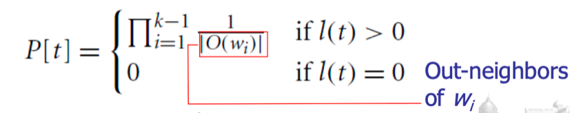
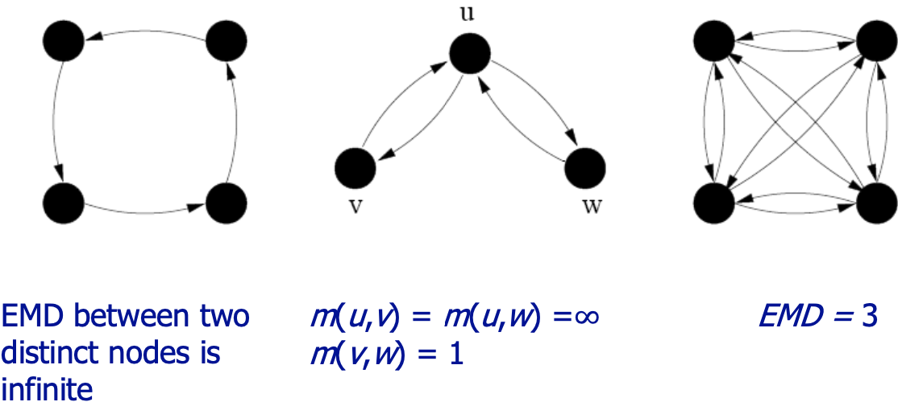
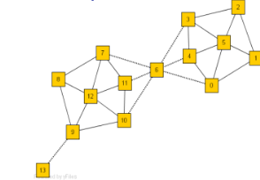
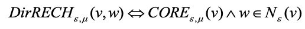
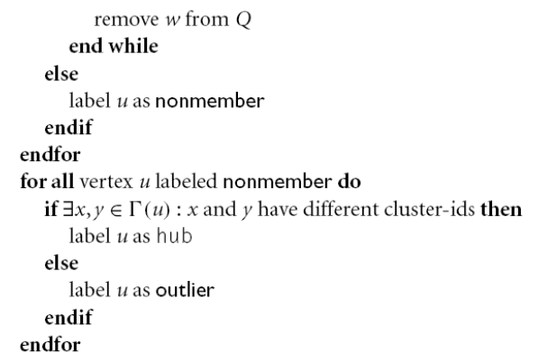
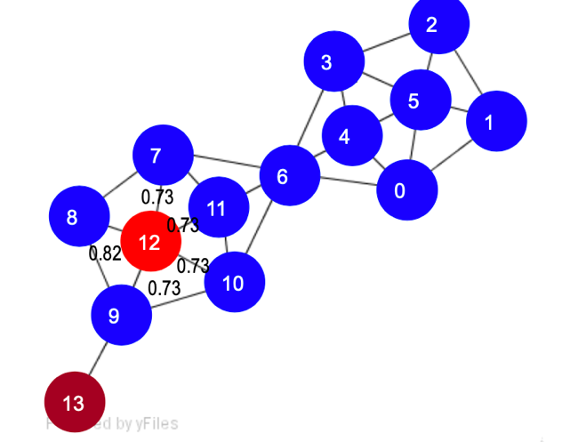
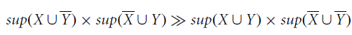
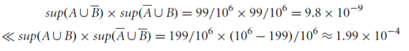

# Advanced Frequent Pattern Analysis

Before applying some ML algorithms it's useful to apply some analysis.

**Mining Multiple-Level Association Rules**

Items often form hierarchies in our application domain, for example we can have milk specialized in different kinds of milk.

Considering the hierarchy, items at the lower level are expected to have lower support; they are derived items and has of course a lower support than parents.

It should be used different minsup's depending on the level we consider.

In higher levels we could use an higher min\_sup.


Flexible min-support thresholds are also useful for other thigs.

For example, considering that some items are **more valuable** but less frequent.

-   Use non-uniform, group-based min-support.

    E.g., {diamond, watch, camera}: 0.05%; {bread, milk}: 5%;

If we want to analyze this valuable pattern we should use a different minsup.

**Redundancy Filtering**: Some rules may be redundant due to "ancestor" relationships between items.

milk -\> wheat bread \[support = 8%, confidence = 70%\]

2% milk -\> wheat bread \[support = 2%, confidence = 72%\]

The first rule is an ancestor of the second rule.

A rule is redundant if its support and confidence are close to the "expected" value, based on the rule's ancestor.

The support of the derived rule is 2%, while for milk -\> wheat bread is 8%, but this is the relation in terms of percentage of these items in these transactions that we have in terms of milk and 2% milk.This support is what we expect just considering the ratio between the transaction in which we have milk and in which we have 2% milk.

We can avoid to consider the most specialized rule because support and confidence can be derived directly from that association.

**Mining Multi-Dimensional Association**

There's another interesting problem.

If we assume that the predicate is the same, we have single-dimensional rules:

buys(X, "milk") -\> buys(X, "bread")

We can have also multi-dimensional rules, that consider \>= 2 dimensions or predicates.

Inter-dimensional association rules (no repeated predicates): age(X,"19-25") & occupation(X,"student") -\> buys(X, "coke")

hybrid-dimensional association rules (repeated predicates): age(X,"19-25") & buys(X, "popcorn") -\> buys(X, "coke")

-   

**Mining Quantitative Association Rules**

There's another interesting problem, which regards quantitative attributes: numeric, implicit ordering among values.

We have to apply some discretization, that can be static discretization (predefined concept hierarchies) or dynamic discretization (binning and clustering).

Techniques to discretize can be categorized by how numerical attributes, such as age or salary are treated:

1.Static discretization based on predefined concept hierarchies(data cube methods)

2.Dynamic discretization based on data distribution

3.Clustering: Distance-based association

4.Deviation: we can express rules working with specific deviation from the standard value.

Sex = female =\> Wage: mean=\$7/hr (overall mean = \$9)

**Static Discretization of Quantitative Attributes**

We try to summarize a number of values using hierarchies,

We can use higher values of the hierarchy as items in frequent pattern analysis.

Discretized prior to mining using concept hierarchy.

Numeric values are replaced by ranges

 In relational database, finding all frequent k-predicate sets will require k table scans.

Data cube is well suited for mining

The cells of an n-dimensional cuboid correspond to the predicate sets

Mining from data cubes can be much faster


**Quantitative Association Rules Based on Statistical Inference Theory**

Finding extraordinary and therefore interesting phenomena, e.g., (Sex = female) =\> Wage: mean=\$7/hr (overall mean = \$9)

LHS: a subset of the population (left part of the rule)

RHS: an extraordinary behavior of this subset (right part)The rule is accepted only if a statistical test confirms the inference with high confidence.

Some subrule can highlights the extraordinary behavior of a subset of the pop. of the super rule

E.g., (Sex = female) \^ (South = yes) =\> mean wage = \$6.3/hr 

Two forms of rules:

-   Categorical=\>quantitative rules

Or

-   Quantitative=\> quantitative rules 

E.g., Education in \[14-18\] (yrs) =\> mean wage = \$11.64/hr 

Open problem is to find efficient methods for LHS containing two or more quantitative attributes.

**Mining Rare Patterns and Negative Patterns**

**Rare patterns** have very low support but interesting.

E.g., buying Rolex watches

We know we have to use a very low minsup.

Mining: Setting individual-based or special group-based support threshold for valuable items

In **negative (correlated) patterns**, since it is unlikely that one buys Ford Expedition (an SUV car) and Toyota Prius (a hybrid car) together, Ford Expedition and Toyota Prius are likely negatively correlated patterns.

Negatively correlated patterns that are infrequent tend to be more interesting than those that are frequent.

We try to define negative correlated patterns.

-   Definition 1 (support-based)

> If itemsets X and Y are both frequent but rarely occur together, i.e., sup(X U Y) \< sup (X) \* sup(Y) then X and Y are negatively correlated.
>
> If the frequency of purchasing together X and Y is lower than the expected frequency (the product, it's like we consider them as independent) we suppose the two items are negatively correlated.
>
> Problem: A store sold two needle 100 packages A and B, only one transaction containing both A and B.
>
> When there are in total 200 transactions, we haves(A U B) = 1/200 = 0.005, s(A) \* s(B) = 100/200 \* 100/200 = 0.25, s(A U B) \< s(A) \* s(B)
>
> When there are 10\^5 transactions, we haves(A U B) = 1/10\^5, s(A) \* s(B) = 100/10\^5 \* 100/10\^5 = 1/10\^3 \* 1/10\^3, s(A U B) \> s(A) \* s(B)
>
> Where is the problem? ---This formula is affected by null transactions, i.e., the support-based definition is not null-invariant! If this number is very high we lose their relation.

-   

```{=html}
<!-- -->
```
-   Definition 2 (negative itemset-based)

> If X and Y are strongly negatively correlated, then
>
> 
>
> Also this definition suffers from the null-variant problem.
>
> Let's consider 200 transactions:
>
> 
>
> Considering 10\^6 transactions:
>
> 

-   Definition 3 (Kulczynski measure-based)

> If itemsets X and Y are frequent, but (P(X\|Y) + P(Y\|X))/2 \< є, where є is a negative pattern threshold, then X and Y are negatively correlated.
>
> Ex. For the same needle package problem, when no matter there are 200 or 105 transactions, if min\_sup = 0.01% and є = 0.02, we have
>
> 
>
> 

**Constraint-Based Frequent Pattern Mining**

Finding all the patterns in a database autonomously is unrealistic!

The patterns could be too many but not focused!

Data mining should be an interactive process. User directs what to be mined using a data mining query language (or a graphical user interface).

In constraint-based mining we provide constraints on what to be mined (user flexibility) and explores such constraints for efficient mining (pptimization).

Note: still find all the answers satisfying constraints, not finding some answers in "heuristic search"

Constraints in data Mining:

-   Knowledge type constraint: classification, association, etc.

-   Data constraint --- using SQL-like queries: find product pairs sold together in stores in Chicago this year

-   Dimension/level constraint - in relevance to region, price, brand, customer category

-   Rule (or pattern) constraint: small sales (price \< \$10) triggers big sales (sum \> \$200)

-   Interestingness constraint: strong rules: min\_support \>= 3%, min\_confidence \>= 60%, what we used with association rules

**Meta-Rule Guided Mining**

In applying constraints we can exploit metarules.

A metarule forms a hypothesis regarding the relationships that the user is interested in probing or confirming.

Meta-rule can be in the rule form with partially instantiated predicates and constants 

P1(X, Y) \^ P2(X, W) =\> buys(X, "iPad")

We are interested in determining which type of customer buys iPad.

The resulting rule derived can be age(X, "15-25") \^ profession(X, "student") =\> buys(X, "iPad")

Fixing the metarule we are looking for association rules with two predicates in the left side and one in the right side with predicate buys and what to buy.

In general, it can be in the form of P1 \^ P2 \^ \... \^ Pl =\> Q1 \^ Q2 \^ \... \^ Qr

Dimension/level constraints and interestingness constraints can be applied after mining to filter out discovered rules, although it is generally more efficient and less expensive to use them during mining to help prune the search space.

We can use them to improve the performance of our analysis.

How can we use rule constraints to prune the search space? More specifically, what kind of rule constraints can be 'pushed' deep into the mining process and still ensure the completeness of the answer returned for a mining query?

We can work in two directions:

-   Pruning pattern search space

The former checks candidate patterns and decides whether a pattern can be pruned using the constraints.

-   Pruning data search space: checks the data set to determine whether the particular data piece will be able to contribute to the subsequent generation of satisfiable patterns (for a particular pattern) in the remaining mining process. We just elaborate data to understand if a data piece contributes to the satisfiable generation.

Pattern space pruning constraints has 4 types:

-   Anti-monotonic: If constraint c is violated, its further mining can be terminated

-   Monotonic: If c is satisfied, no need to check c again

-   Succinct: c must be satisfied, so one can start with the data sets satisfying c

-   Convertible: c is not monotonic nor anti-monotonic, but it can be converted into it if items in the transaction can be properly ordered

Allow us to prune directly eliminate candidate itemset because we are sure that these cannot be satisfied using constraints.

Dataspace pruning constraints:

-   Data succinct: Data space can be pruned at the initial pattern mining process

-   Data anti-monotonic: If a transaction t does not satisfy c, t can be pruned from its further mining

These constraints allow us to reduce the number of transactions.

The idea is to exploit constraints to reduce computational time.

We have constraints on the pattern space and on the data space.

**Pattern Space Pruning with Anti-Monotonicity Constraints**

A constraint C is anti-monotone if the super pattern satisfies C, all of its sub-patterns do so too.

In other words, anti-monotonicity: If an itemset S violates the constraint, so does any of its superset.

Ex. 1. sum(I.price) \<= v is anti-monotone, because adding other elements we cannot reduce the sum

Ex. 2. range(I.profit) \<= 15 is anti-monotone, considering in the itemset items in which the range is higher we cannot reduce the range adding items in the itermset.

Itemset ab violates C, the range is 40 and violates the constraint on the range. So does every superset of ab.

Ex. 3. sum(I.price) \>= v is not anti-monotone, because we can have other items and the sum increases but the constraint is satisfied in any case

Ex. 4. support count is anti-monotone: this is the core property used in Apriori.

Another approach we can adopt, is to use the apriori algorithm to generate all possible frequent patterns and them impose the satisfaction of constraints.

This imply that we need time to generate a very high number of patterns and then reduce this number imposing satisfaction of constraints.

With the reasoning we've seen we avoid to generate patterns not able to satisfy constraints, we reduce the computational time.

**Pattern Space Pruning with Monotonicity Constraints**

A constraint C is monotone if the pattern satisfies C, we do not need to check C in subsequent mining.

Alternatively, monotonicity: If an itemset S satisfies the constraint, so does any of its superset.

If we are sure a constraint is satisfied we cannot avoid to verify the verification for super-itemsets.Ex. 1. sum(I.Price) \<= v is monotone If we add other items I can only increase the sum and not decrease, increasing the number of items we enforce the satisfaction.

 Ex. 2. min(I.Price) \<= v is monotone

If the min is lower a threshold, if we add another element the min can decrease but not increase.

Ex. 3. C: range(I.profit) \>= 15.

Itemset ab satisfies C.

So does every superset of ab.

**Pattern Space Pruning with Succinctness**

 We can enumerate all and only those sets that are guaranteed to satisfy the constraint. That is, if a rule constraint is succinct, we can directly generate precisely the sets that satisfy it, even before support counting begins.

the idea is to have possible constraints that allow us to enumerate only sets that are able to satisfy the constraints.

This avoids the substantial overhead of the generate-and- test paradigm (constraints are precounting prunable).

min(I.Price) \>= v is succinct

sum(I.Price) \>= v is not succinct

because we can explicitly and precisely generate all the itemsets that satisfy the constraint (there exists a precise formula, we do not need check the rule constraint).

We can directly enumerate items with property price that can be used in the itemset. All items lower than v cannot be used to satisfy that constraint.

Given A1, the set of items satisfying a succinctness constraint C, then any set I satisfying C is based on A1 , i.e., I contains a subset belonging to A1.

Idea: Without looking at the transaction database, whether an itemset I satisfies constraint C can be determined based on the selection of items.

Optimization: If C is succinct, C is pre-counting pushable

Example of the Apriori Algorithm:


In front of constraints, we use the Naive Algorithm: Apriori + Constraint:


We have the possibility to verify that for an itemset this is not verified.

We reduce the computational time terminating the execution of Apriori algorithm than usual.

The same using succinct.


We can use convertible constraint.

**Convertible Constraints: Ordering Data in Transactions**

The idea is to convert tough constraints into anti- monotone or monotone by properly ordering items.

Examine C: avg(S.profit) \>= 2

Order items in value-descending order \<a, f, g, d, b, h, c, e\>

If an itemset afb violates C, so does also afbh, afb\*.

In this case we can transform that constraint into an anti-monotone or anti-monotone constraint.

In our case, it becomes anti-monotone!

If afb violates the constraint we can add other items in the lower position and what we can obtain is that this average decreases more, so this constraint is not anti-monotone in origin but if we order items in respect to the property we are testing we can transform it in an anti-monotone constraint.

avg(X) \>= 25 is convertible anti-monotone w.r.t. item value descending order R: \<a, f, g, d, b, h, c, e\>

If an itemset af violates a constraint C, so does every itemset with af as prefix, such as afd.

When we add items, the average decreases because we sorted items in decreasing order with respect to the problem we are testing.

avg(X) \>= 25 is convertible monotone w.r.t. item value ascending order R\^-1: \<e, c, h, b, d, g, f, a\>

If an itemset d satisfies a constraint C, so does itemsets df and dfa, which having d as a prefix. We are using values ascending so values increase. Higher values allow us to satisfy more the constraint we have. Thus, avg(X) \>= 25 is strongly convertible.

Can Apriori Handle Convertible Constraints?

A convertible, not monotone nor anti-monotone nor succinct constraint cannot be pushed deep into the an Apriori mining algorithm.

Within the level wise framework, no direct pruning based on the constraint can be made.

Itemset df violates constraint C: avg(X) \>= 25

Since adf satisfies C, Apriori needs df to assemble adf, df cannot be pruned

But it can be pushed into frequent-pattern growth framework!



C: avg(X) \>= 25, min\_sup=2 are the constraints we want to satisfy.

We list items in every transaction in value descending order R: \<a, f, g, d, b, h, c, e\>

C is convertible anti-monotone w.r.t. R

We scan TDB once, remove infrequent items.

Item h is dropped.

Itemsets a and f are good, because they are frequent.

Projection-based mining:

We project our dataset and imposing an appropriate order on item projection

Many tough constraints can be converted into (anti)-monotone 

Different constraints may require different or even conflicting item-ordering

If there exists an order R s.t. both C1 and C2 are convertible w.r.t. R, then there is no conflict between the two convertible constraints

If there exists conflict on order of items, we try to satisfy one constraint first and then using the order for the other constraint try to mine frequent itemsets in the corresponding projected database.

What Constraints Are Convertible?


If one constraint is convertible anti-monotone and monotone, it is defined as strongly convertible.

**Data Space Pruning with Data Anti-monotonicity**

A constraint c is data anti-monotone if for a pattern p which cannot be satisfied by a transaction t under c, p's superset cannot be satisfied by t under c either.

This means that we can avoid to consider t for verifying the pattern, the superset of p.

The key for data anti-motone is recursive data reduction.


Ex. 1 sum(I.Price) \>= v is data anti-monotone

Ex. 2. min(I.Price) \<= v is data anti-monotone

Ex. 3. C: range(I.profit) \>= 25 is data anti-monotone

If we have Itemset {b, c}'s projected DB,

If we have transactionT10': {d, f, h}, when we project along along {b,c}, the other part of the transaction we have available {d, f, h}.

If we consider the constraint C it cannot be satisgfied by T10'.

The profit for d is -15, for f is -10 and for h is -5.

But the range of b and c is already 20.

If I include d,f and h, this range cannot be increases.

Since C cannot be satisfied by T10', T10' can be pruned.

T20': {d, f, g, h}, T30': {d, f, g}

...

This means that I can just prune T10' because cannot let us to satisfy constraints.

We reduce the transactions I have just to analyze for verifying if the items can be frequent.

We reduce the number of transactions we observe for verifying the frequency in the itemset.

We determine it considering if the transaction can help us to satisfy constrains.



I cannot perform data space pruning at the beginning, but we have to perform during the execution of apriori algorithm. We can eliminate items because not frequent.

This is a list of constraint-based mining:


A classification of constraints:


**Mining High-Dimensional Data and Colossal Patterns**

We have many algorithms, but can we mine large (i.e., colossal) patterns? ― such as just size around 50 to 100? Unfortunately, not!

Why not? ― the curse of "downward closure" of frequent patterns is the problem.

1.  The "downward closure" property is the following:

    Any sub-pattern of a frequent pattern is frequent.

    We have to generate all possible subpatterns to generate the colossal pattern.

Example. If (a1, a2, \..., a100) is frequent, then a1, a2, \..., a100, (a1, a2), (a1, a3), \..., (a1, a100), (a1, a2, a3), \... must all be frequent! There are about 2\^100 such frequent itemsets!

No matter using breadth-first search (e.g., Apriori) or depth-first search (FPgrowth), we have to examine so many patterns.

Thus, the downward closure property leads to explosion!


Closed/maximal patterns may partially alleviate the problem but not really solve it: We often need to mine scattered large patterns!

Let the minimum support threshold σ= 20


If we want only to represent the output in any case, we have an explotion of possible output, all possible combination are frequent pattern.

Also, if we have a limited number of transactions, if we have an high number of items and they can generate a lot of frequent itemsets if we provide only closed patterns we have in any case an explotion of closed patterns.

It is often the case that only a small number of patterns are colossal, i.e., of large size.

Colossal patterns are usually attached with greater importance than those of small pattern sizes.



We have no hope for completeness.

If the mining of mid-sized patterns is explosive in size, there is no hope to find colossal patterns efficiently by insisting "complete set" mining philosophy,

It's almost impossible to generate all possible pattern to arrive to generate a colossal pattern.

Jumping out of the swamp of the mid-sized results

What we may develop is a philosophy that may jump out of the swamp of mid-sized results that are explosive in size and jump to reach colossal patterns directly.

We can try to avoid the overall generation of min-size patterns and combine them to jump forward the colossal pattern.

Striving for mining almost complete colossal patterns

The key is to develop a mechanism that may quickly reach colossal patterns and discover most of them.

The risk is that we cannot find them all, we must find a trade-off between computation and optimal results.


Let the min-support threshold σ= 20. Then there are  closed/maximal frequent patterns of size 20

However, there is only one with size greater than 20, (it is the colossal): It is α= {41,42,\...,79} of size 39.

The existing fastest mining algorithms (e.g., FPClose, LCM) fail to complete running, they have to generate all possible pattern to generate the colossal one.

The algorithm we analyze now outputs this colossal pattern in seconds, but this does not guarantee to generate all possible colossal patterns, but we will have a good subset.

**Pattern-Fusion Strategy**

It cannot guarantee to mine them all but can guarantee an approximation with reasonable time.

Pattern-Fusion traverses the tree in a bounded-breadth way.

Always pushes down a frontier of a bounded-size candidate pool.

Only a fixed number of patterns in the current candidate pool will be used as the starting nodes to go down in the pattern tree ― thus avoids the exponential search space. We traverse the tree in such a way to generate only pattern with high elements that allow us to go towards colossal patterns.

Pattern-Fusion identifies "shortcuts" whenever possible.

Pattern growth is not performed by single-item addition but by leaps and bounded: agglomeration of multiple patterns in the pool.

We don't add one item each item, but we combine itemsets using shortcuts to produce the colossal itemsets.

These shortcuts will direct the search down the tree much more rapidly towards the colossal patterns.


We have to understand how to combine them correctly to go towards colossal patterns.



When we eliminate items in the colossal pattern we can assume the support of the subitemset we created is very close to the support of the colossal pattern.

Subpatterns α1 to αk cluster tightly around the colossal pattern α by sharing a similar support. We call such subpatterns core patterns of α.

We go towards the subpatterns of the colossal pattern with support similar to the colossal pattern.

**Core Patterns**

Intuitively, for a frequent pattern α, a subpattern β is a τ-core pattern of α if β shares a similar support set with α, i.e.,


where \|Dα\| is the number of patterns containing α and τ is called the core ratio

alpha is a superpattern of beta.

The number of pattern containing beta is higher than the one containing alpha, because alpha is a superpattern of beta.

We have to fix tau to define them.

**Robustness of Colossal Patterns**

A colossal pattern is robust in the sense that it tends to have much more core patterns than small patterns.

**(d,τ)-robustness**

A pattern α is (d, τ)-robust if d is the maximum number of items that can be removed from α for the resulting pattern to remain a τ-core pattern of α.

For a (d,τ)-robust pattern α, it has

(2\^d) core patterns

Colossal patterns tend to have a large number of core patterns

Pattern distance: For patterns α and β, the pattern distance of α and β is defined to be


 If two patterns α and β are both core patterns of a same pattern, they would be bounded by a "ball" of a radius specified by their core ratio τ


The distance between alpha and beta will be lower than that.

Once we identify one core pattern, we will be able to find all the other core patterns by a bounding ball of radius r(τ).


The last thing is quite natural because to achieve these patterns we have to achieve an high number of core patterns.

A colossal pattern has far more core patterns than a small-sized pattern.

A colossal pattern has far more core descendants of a smaller size c.

A random draw from a complete set of pattern of size c would more likely to pick a core descendant of a colossal pattern

A colossal pattern can be generated by merging a set of core patterns 

Due to their robustness, colossal patterns correspond to dense balls

A random draw in the pattern space will hit somewhere in the ball with high probability


In the previous example, the probability of drawing a descendant of abcef is 0.9.

We have an high number of possible sub-items of the larger itemset,

The idea of Pattern-Fusion Algorithm is the following.

-   Generate a complete set of frequent patterns up to a small size, and from this apply an algorithm like apriori.

-   Randomly pick a pattern β, and β has a high probability to be a core-descendant of some colossal pattern α

-   Identify all α's descendants in this complete set, and merge all of them ― This would generate a much larger core-descendant of α

-   In the same fashion, we select K patterns. This set of larger core-descendants will be the candidate pool for the next iteration 

Initialization (Initial pool): Use an existing algorithm to mine all frequent patterns up to a small size, e.g., 3 (for example with the apriori algorithm)

Then, perform a certain number of iterations (Iterative Pattern Fusion):

-   At each iteration, K seed patterns are randomly picked from the current pattern pool

-   For each seed pattern thus picked, we find all the patterns within a bounding ball centered at the seed pattern

-   All these patterns found are fused together to generate a set of super-patterns. All the super-patterns thus generated form a new pool for the next iteration

Termination: when the current pool contains no more than K patterns at the beginning of an iteration


We start with the set of patterns empty.



We aggregate in (9) what we found in the core list.

When the number of such beta exceeds a threshold, which is determined by the system, we resort to a sampling technique to decide the set of beta to retain, reducing computational effort.

This is a bounded-breadth pattern tree traversal.

It avoids explosion in mining mid-sized ones, because randomness comes to help to stay on the right path.

We provide the ability to identify "short-cuts" and take "leaps".

We fuse small patterns together in one step to generate new patterns of significant sizes We reach efficient solution but no one guarantee we will find all possible colossal patterns.

The larger the pattern, the greater the chance it will be generated, because very large pattern have a very large number of subitemsets, so we have an high probability to pickup them.

The more distinct the pattern, the greater the chance it will be generated.

We have to identify how much we are close to the real solution and if we can save time.

With the increase of the size of the metric, the Pattern Fusion approach maintain approximately the same computational time.  

The approximation error of Pattern-Fusion is rather close to uniform sampling (which randomly picks K patterns from the complete answer set).

It can discover almost all real colossal patterns and the computational time is almost constant with the increasing of the minimum support threshold.Of course, it produces an approximation but it's a really good one.

**Mining Compressed or Approximate Patterns**

When we return patterns we can reduce closed patterns but sometimes they are very high.

We can compress patterns.

We introduce the pattern distance measure:


δ-clustering is used to do that. We have that for each pattern P, find all patterns S which can be expressed by(that is, O(S) ⊂ O(P)) and their distance to P are within δ (δ-cover).

All patterns in the cluster can be represented by P



Returning closed frequent pattern, we have to report P1, P2, P3, P4, P5 because support is different. This definition has no kind of compression.

Max-pattern, returns P3 but we have info loss. We lose information about the support of subpatterns.

A desirable output is P2, P3, P4 because if we consider P2 and P1, P2 is a super-itemset and the support is comparable,

The distance we saw is very low.

We decided to compress the output by giving in output just itemsets that contains other itemsets and approximately have similar supports.

Mining the top-k most frequent patterns is a strategy for reducing the number of patterns returned during mining.

However, in many cases, frequent patterns are not mutually independent but often clustered in small regions.

This is somewhat like finding 20 population centers in the world, which may result in cities clustered in a small number of countries rather than evenly distributed across the globe.

Why this observation? Why redundancy-aware top-k patterns?

Desired patterns must be characterized by high significance & low redundancy.

We propose to exploit the MMS (Maximal Marginal Significance) for measuring the combined significance of a pattern set.


The significance of (a) is represented by white-black colors.

Not considering redundancy and just significancy we just pick-up itemsets with highest significancy.

A significance measure S is a function mapping a pattern p ∈ P to a real value such that S(p) is the degree of interestingness (or usefulness) of the pattern p.

Objective measures depend only on the structure of the given pattern and the underlying data used in the discovery process.

Subjective measures are based on user beliefs in the data.

They therefore depend on the users who examine the patterns.

Redundancy R between two patterns p and q is defined as

R(p,q) = S(p)+S(q)-S(p,q)

The ideal redundancy measure R(p,q) is usually hard to obtain. However, we can approximate redundancy using distance between patterns.

The problem of finding redundancy-aware top-k patterns can thus be transformed into finding a k-pattern set that maximizes the marginal significance, which is a well studied problem in information retrieval.

A document has high marginal relevance if it is both relevant to the query and contains minimal marginal similarity to previously selected documents, where the marginal similarity is computed by choosing the most relevant selected document.

We want to select significant itemsets but not redundant with other itemsets we are giving in output.
