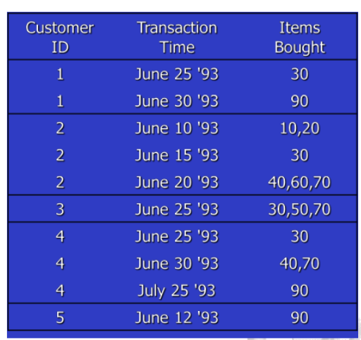
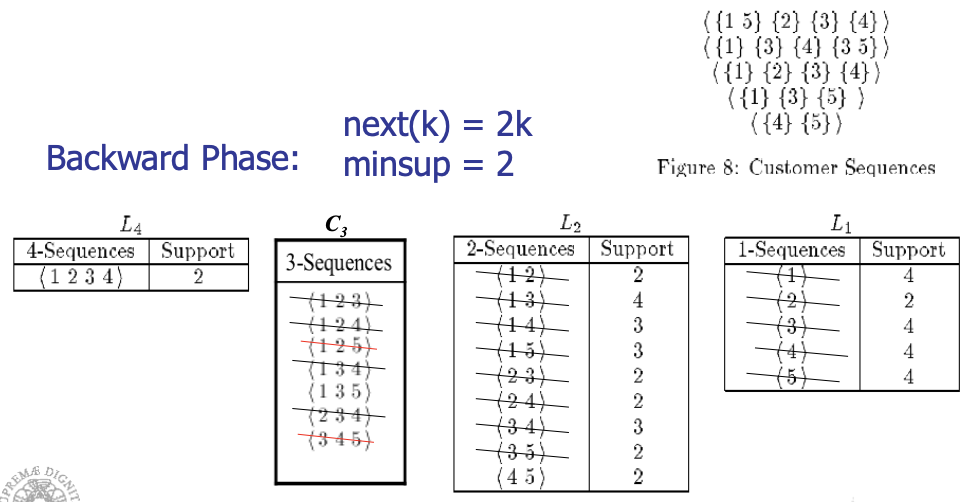
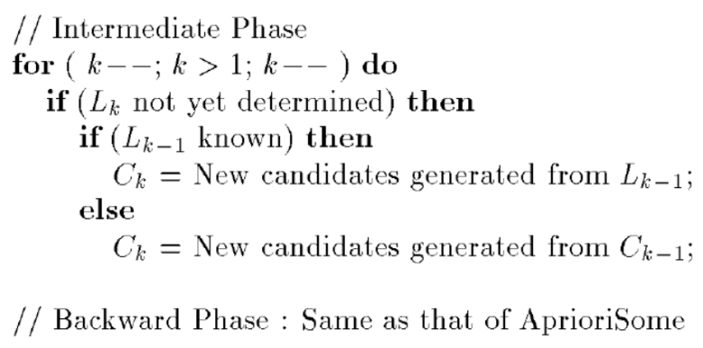
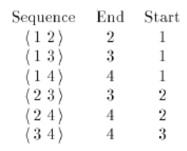
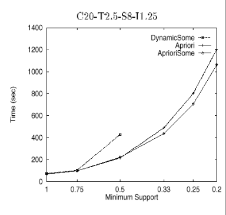
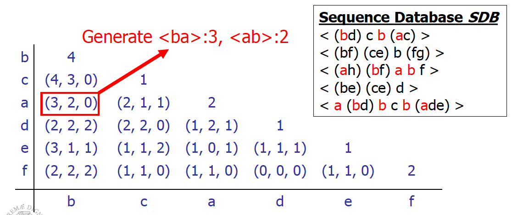
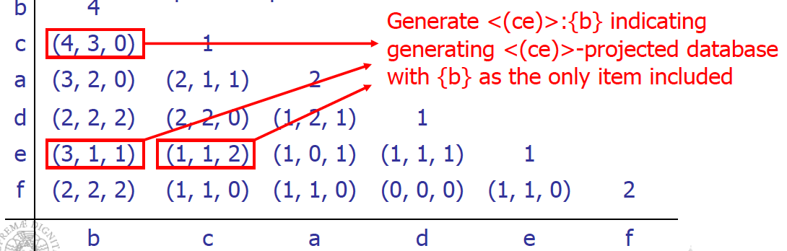
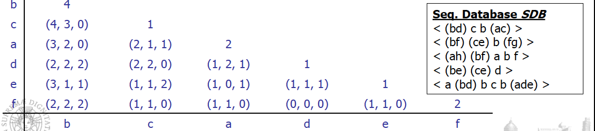

# Sequential Pattern Mining

Frequent pattern mining use itemsets and we don't have any order in items. We would like to investigate now sequences.

__Sequential pattern mining__ discovers frequent subsequences as patterns in a sequence database.

A sequence database stores a number of records, where __all records are sequences of ordered events__, with or without concrete notions of time.

An example sequence database is retail customer transactions or purchase sequences in a grocery store showing, for each customer, the collection of store items they purchased every week for one month but not in the single time, where the order of items bought at once is not useful.

Records are stored as follows:

\[Transaction/Customer ID, \<Ordered Sequence Events\>\]

Examples:

\[T1, \<(bread, milk), (bread, milk, sugar), (milk), (tea, sugar)\>\];

\[T2, \<(bread), (sugar, tea)\>\] Each element in a sequence is an itemset.

__Web Usage Mining__ is an application of sequential pattern mining.

Finding user navigational patterns on the world wide web by extracting knowledge from web logs.

Ordered sequences of events are composed of single items and not sets of items, with the assumption that a web user can physically access only one web page at any given point in time.

Our sequence is a sequence of visits in the single page.

Given a set of events E = {a, b, c, d, e, f}, a web access sequence database for four users may have four records:

\[T1, \<abdac\>\]; 

\[T2, \<eaebcac\>\]; 

\[T3, \<babfaec\>\]; 

\[T4, \<abfac\>\].

A web log pattern mining can find a frequent sequence, abac, indicating that over 90% of users who visit product a's web page also immediately visit product b's web page.

## Web Usage Mining

How can we collect this web log? On the __server-side__, __client-side__ or on a __proxy server__?

-   __Server-side__: reflects the access of a web site by multiple users, is good for mining multiple users' behavior and web recommender systems. But as cons, server logs may not be entirely reliable due to caching, as cached page views are not recorded in a server log. In fact, we have the local cache and the cache on proxy before reaching the server.

-   __Client-side__: requires that a remote agent be implemented or a modified browser be used to collect single-user data in the client, thus eliminating caching and session identification problems, and is useful for web content personalization applications. This cannot be easy and some users can avoid to have this agent.

-   __Proxy server__: reveal the actual HTTP requests from multiple clients to multiple web servers, thus characterizing the browsing behavior of a group of anonymous users sharing a common server.

Data Format of the Log:

137.207.76.120 - \[30/Aug/2009:12:03:24 -0500\] "GET /jdk1.3/docs/relnotes/deprecatedlist.html HTTP/1.0" 200 2781.

Other techniques such as __cookie and sniffer__ may be needed to have a complete analysis.

In most cases, researchers assume that user web visit information is completely recorded in the web server log, which is preprocessed to obtain the transaction database to be mined for sequences.

Let's see it now from a formal point of view.

## Sequential Pattern Mining

An __itemset__ is a set drawn from items in I, and denoted ($i_1$, $i_2$, ... , $i_k$), where $i_j$ is an item or event.

### Problem definition:

__Given__

-   A set of sequential records (called __sequences__) representing a sequential database D

-   A minimum support threshold called __min\_sup__

-   A set of k unique items or events __I={$i_1$,$i_2$, ... , $i_k$}__

We aim to __find__ the set of all frequent sequences S in the given sequence database D of items I at the given min\_sup.

### __Lexicographic Order__ 

A __sequence S__ is denoted as a sequence of elements \<$e_1$,$e_2$,$e_3$, ... , $e_q$\>, where the sequence element $e_j$ is an itemset (e.g., (be) in \<a(be)c(ad)\>, but also (aec) can be, just because it's a part of unique transaction) that __might contain only one item__ (which is also referred to as 1-itemset).

A sequence element is a lexicographically ordered list of items.

Assume an itemset t of distinct items $t = \{i_1, i_2, ... , i_k\}$, and another itemset of distinct items also $t' = \{ j_1, j_2, ... , j_l\}$, where $i_1 \le i_2 \le ··· \le i_k$ and $j_1 \le j_2 \le ··· \le j_l$, such that $\le$ indicates "occurs before" relationship.

Then, for itemsets, $t < t'$ (t is lexicographically less than $t$) if and only if either of the following is true:

1.  for some integer $h$, $0 \le h \le \min\{k, l\}$, we have $i_r = j_r$ for $r < h$, and $i_h < j_h$, or

2. $k < l$, and $i_1 = j_1$, $i_2 = j_2, ... , i_k = j_k$.

Example (1): (abc) \< (abec), because c preceds e, and (af) \< (bf), because a preceds b

Example (2): (ab) \< (abc), because the itemset is longer

#### __Sequences__

A sequence with k elements is called a k-sequence. An item can occur only once in an itemset, but it can occur several times in different itemsets of a sequence.

A sequence $\alpha = < e_{i_1},e_{i_2},e_{i_3}, ... , e_{i_m} >$ is a __subsequence of another sequence__ $\beta = < e_{i_1},e_{i_2},e_{i_3}, ... , e_{i_n} >$, denoted $\alpha \preceq \beta$, if there exist integers $i_1 < i_2 < ... < i_m$ and all events $e_{i_j} \in \alpha$ and $e_i \in \beta$ and $i_1 \ge 1$ and $i_m \le n$, such that $e_{i_j} \subseteq e_i$.

This definition of inclusion is the one we saw for itemsets.

A sequential pattern is maximal if it is not a subsequence of any other sequential pattern.

Example of sequence:

In the sequence database we have 5 sequences, we can interpret them in a way that items in pharentesis are items in itemsets.

If we search for (ae) in the sequence, we need to find an element with a and e inside, together.

The support threshold is the number of sequence in which the subsequence is present.

The problem is complex, we need to use specific algorithms to reduce the computational effort.

#### __Sequence lexicographical ordering__

Assume a lexicographical order $\le$ of items I in the sequential access database, denoted $\le I$.

If an item $i$ occurs before an item $j$, it is denoted $i \le I j$; this order is also extended to sequences and subsequences by defining $S_a \le S_b$ if $S_a$ is a subsequence of $S_b$.

Consider all sequences arranged in a sequence tree T (referred to as a Lexicographical Tree).

-   __The root of the tree is labeled as an empty set {}__.

-   Recursively, if $n$ is a node in the tree T, then $n$'s children are all nodes $n'$ such that $n \le n'$ and $\forall m \in T: n' \le m$ if n ≤ m. Each sequence in the tree can be extended by adding a 1-sequence to its (sequence-extended sequence) end or adding an itemset to its end (itemset-extended sequence), which is not applicable to the case of web log mining.

We start with the root, and starting from the lexicographic order of items we can generate all possible lexicographic ordered sequences.

We should generate all possible sequences, and this is hard to manage.

We have just to impose some threshold for frequency or support of a sequence.

#### __Support of a Sequence__

The __frequency__ or __support__ of a sequence (or subsequence) S, denoted $\sigma(S)$ is the total number of sequences of which S is a subsequence divided by the total number of sequences in the database D, whereas the absolute support (or support count) of a sequence (or subsequence) S is the total number of sequences in D of which S is a subsequence.

A sequence is called __frequent__ if its frequency is not less than a __user-specified threshold__, called __minimum support__ denoted min sup or the greek letter $\xi$. 

A frequent sequence $S_\alpha$ is called a __frequent closed sequence__ if there exists no proper supersequence of $S_\alpha$ with the same support, that is, $S_\beta$ such that $S_\alpha \preceq S_\beta$ and $\sigma(S_\alpha) = \sigma(S_\beta)$ (same support); otherwise it is said that sequence $S_\alpha$ is absorbed by $S_\beta$.

In math language this is the definition: $S_\alpha$ is a frequent closed sequence if
$$
    \nexists S_\beta: S_\alpha \preceq S_\beta \land \sigma(S_\alpha) = \sigma(S_\beta)
$$

Assume the frequent sequence $S_\beta = < beadc >$ is the only superset of the frequent sequence $S_\alpha = < bea >$, if $\sigma(S_\alpha) = \sigma(S_\beta)$, then $S_\alpha$ is not a frequent closed sequence; on the other hand, if $\sigma(S_\alpha) > \sigma(S_\beta)$, then $S_\alpha$ is a frequent closed sequence. Notice that $\sigma(S_\beta)$ cannot be greater than $\sigma(S_\alpha)$, because $S_\alpha \preceq S_\beta$ (is a subsequence of).

Let's see an example.

Let's assume that we have this supermarket, and we want to investigate if we have frequent subsequences.

Note: Use Minsup of 25%

{{30}, {90}} is a frequent sequence because present in 1 and 4. It's also maximal because we don't have supersequences of these sequences. We need to verify if exists supersequences also with lower support.

{(10 20) (30)} does not have minsup (because is only supported by Customer 2)

{(30)}, {(70)}, {(30) (40)} ... are frequent sequences but not maximal.

For {{30}} we have both {{30}{90}} and {{30}{40 70}} as supersequences.

## __The Algorithms__

The problem of frequent sequences mining is approached using algorithms that typically exploits these phases:

-   __Sort Phase__

-   __Litemset Phase__

-   __Transformation Phase__

-   __Sequence Phase__

-   __Maximal Phase__

### __Sort Phase__

We __sort the database__ using the customer ID as the major key. We do it in respect of the time, so using transaction-Time as the minor key.

__Converts the original transaction database into a database of customer sequences__

We need this form to produce the sequence corresponding to the customer.

### __Litemset (Large Itemset) Phase__

We count how many itemsets are large, supported by fraction of customers larger than minsup.

If we don't have frequent itemsets we can't have frequent sequences, so we start from frequent itemsets.

We determine the large itemsets where large means __support $\ge$ minsup__.

__Recall__: each itemset in a large sequence has to be a large itemset

__Support counting__ measures the fraction of customers purchasing items in the itemset.

Each large itemset is then mapped to a set of __contiguous integers__

Transformation used to compare large itemsets in constant time and reduce the time required to check if a sequence is contained in a customer sequence.

This is a mapping to speed-up the computation.

We can realize that some itemsets are not frequent in our example database.

{30} is frequent because appears in different sequences, same for {90}. {10} is not because appears only in that sequence.

In any case it depends on the threshold we choose.

Only considering the large itemsets we reduce the complexity of our problem.

We replace itemsets and we can have one-itemsets but also sets with more items.

We replace them with an integer number, to reduce the time to check if a sequence is contained in a customer sequence.

We have to __eliminate non-large itemsets__ and __replace them with integer numbers__.

### __Transformation Phase__

Need to repeatedly determine __which of a given set of large sequences are contained in a customer sequence__. To make this fast:

-   Replace each transaction with all litemsets contained in the transaction.

-   Transactions with no litemsets are dropped. (still considered for support counts).

The original customer sequence is transformed in the costumer sequence in the second column (eliminating not frequent items and transforming), and after mapping on the sequence on the third column.

Note: (10 20) dropped because of lack of support.

While (40 60 70) is replaced with set of litemsets {(40),(70),(40 70)} (60 does not have min-sup). We can just pickup one of these items and each can be part of the subsequence.

We extracted the database of sequences and we preprocessed it to eliminate not frequent itemsets and cannot generate frequent sequences. We performed those mapping to speed-up the computation.

### __Sequence Phase__

Now, we use the set of large itemsets to __find the desired sequences__.The algorithms we exploit has a similar structure to __Apriori algorithms__ used to find large itemsets.

-   Use seed set to generate candidate sequences.

-   Count support for each candidate.

-   Eliminate candidate sequences which are not large.

#### __Two families__ of algorithms:

-   __Count-all__: count all large sequences including non-maximal sequences (it is careful with respect to the minimum support). This algorithm is _AprioriAll_.

-   __Count-some__: try to avoid counting non-maximal sequences by counting longer sequences first (it is careful with respect to maximality). These algorithms are _AprioriSome_ and _DynamicSome_.

### __Maximal Phase__

Independently of the algorithm we use, to __find maximal sequences__ among large sequences.

Given:

-   __k-sequence__: sequence of length

-   __S__ set of all large sequences

> for ($k=n$; $k>1$; $k--$) do
>
>> foreach k-sequence $s_k$ do
>>
>>> delete from S all subsequences of $s_k$

__We remove all subsequences of a maximal sequence__.

This phase is performed to find maximal sequences.

Data-structures and an algorithm exist to do this efficiently. (_hash trees_)

## __AprioriAll__ (Count-All)

This is based on the same idea of the one saw in frequent pattern analysis.

We start from the large itemsets determined in previous phases.

Similiar to apriori algorithm but here we talk about sequences.

The generation of candidates $C_k$ is performed as follows:

-   __Step 1__: Join two sequences in $L_{k-1}$ to generate $C_k$

    For each two sequences in $L_{k-1}$ that have the same from the 1st to k-2th itemsets, select the 1 to k-1 itemset from the first sequence, and join with the last itemset from another sequence.

    Example 
    
    $L_3$ = {123}{234}{124}{134}{135}
    
    $C_4$ = {1 2 3 4} {1 3 4 5}{1 3 5 4} {1 2 4 3} (we also have to add the viceversa because the order here is important)

-   __Step 2__: Delete all sequences in $C_k$ if some of their sub-sequences are not in $L_{k-1}

    Example: $C_4$ = {1 2 3 4} $\rightarrow$ 1 2 3 is present, 2 3 4 is present, 1 3 4 is present so we don't eliminate this sequence.

    {1 3 4 5} $\rightarrow$ 1 3 5 is present but 1 4 5 is not present so we are sure that this sequence is not frequent for the apriori property. __We can remove this sequence__.

    {1 3 5 4} $\rightarrow$ can be remove because 3 5 4 is not present

    

We have all possible sequences minable from the customer sequences using the three phases seen before.

We start from transactions, build the customer sequences using the customer index and then verify how many large itemsets we have.

If we set minsup = 2, they are all frequent.

Then we test $L_2$. The candidates are <1 2> but also <2 1>, and so on.

Then we apply the join between all posssible pairs to generate all possible $L_3$.

Then we use them to generate $L_4$, and we check if they're frequent.

We obtain that the ony $L_4$ frequent sequence is <1 2 3 4>.

But we are interested in all maximum sequences, we start from <1 2 3 4> and we delete all $L_3$ sequences contained in <1 2 3 4>.

We don't delete <1 3 5> because not contained in it.

Now we verify the $L_2$ and so on.

Applying the 3rd phase of the 5 phases, this is our answer.

Answer: __<1 2 3 4>, <1 3 5>, <4 5>__

The problem of this algorithm is similar to the one of the Apriori algorithm, the generation of a very high number of candidates, and then we remove them using the Apriori property or counting the support.

## __AprioriSome__

We have an high number of non maximum sequences generated, that prevents us to count the support scanning the dataset.

We have __AprioriSome__ that tries to avoid counting non-maximal sequences by counting longer sequences first.

__2 phases__:

-   __Forward Phase__ $\rightarrow$ find all large sequences of certain lengths.

-   __Backward Phase__ $\rightarrow$ find all remaining large sequences. For example, we might count sequences of length 1, 2, 4 and 6 in the forward phase and count sequences of length 3 and 5 in the backward phase, we jump sequences 3 and 45

We jump from a __k__-sequence to a __k+n__-sequence.

During the backward phase in fact we just find all remaining large sequences.

We determine which lengths to count using __next()__ function. next() takes in as a parameter the length of the sequence counted in the last pass.

_next(k) = k + 1_ (Same as AprioriAll)

We can improve increasing the value to add, not 1 but an higher one.

__Balances tradeoff__ between:

-   Counting non-maximal sequences

-   Counting extensions of small candidate sequences 

$$
    hit_k = \dfrac{|Lk|}{|Ck|}
$$

Intuition: As $hit_k$ increases, the time wasted by counting extensions of small candidates decreases.

If $hit_k$ is high, most of the candidates we generated are frequent, so we jump in the increase of the number of itemsets in the sequence.

We have an high probability that this candidate sequences are frequents, we jump and just apply the backward.

### __Forward Phase__

$L_{K-1}$ known means that we generated and tested the frequent sequences at the level k-1. We use the apriori algorithm, we use directly the frequent sequences.

In the candidate generation, if the large sequence set $L_{k-1}$ is not available, we use the candidate set $C_{k-1}$ to generate $C_k$.

If k is equal to the output of the function we test.

In the forward phase we generate all k candidates, but some using k-1 frequent sequences, others by k-1 candidate sequences.

Correctness is maintained because $L_{k-1} \subseteq C_{k-1}$ .

### __Backward Phase__

We want to avoid to verify in the sequence database some candidate sequences and since we are interested in the maximum sequences, we generate them, we verify if they are frequent and delete all subsequences of these frequent sequences.

For all lengths which we skipped:

- __Delete sequences__ in candidate set which are __contained in some large sequence__.

- __Count remaining candidates__ and find all sequences with min. support.

- Also __delete large sequences__ found in forward phase __which are non-maximal__.

We perform the increment for the candidates remained after the deletion phase.

We are interested in maximum sequences, so we delete all subsequences.

In the forward phase we generated all candidate sequences, sometimes using frequent sequences and sometimes using candidate ones.

In any case we verify if the candidate sequences are frequent.

We start from $L_1$, generate $L_2$ and test if they are frequent.

We generate $C_3$ using $L_2$ and then we generate candidate 4 sequences using $C_3$ and checking if they're frequent.

We start the backward phase.

We start from the maximum-sequence <1 2 3 4> and delete all subsequences contained in it. We are sure they are not maximal.

Other sequences are tested checking if they are frequent.

We remove <1 2 5> and <3 4 5> because they are not frequent scanning the dataset, and we remove all 2-subsequences.

We preserve <4 5> because maximal and frequent.

We eliminate sequences to test in the database, but it doesn't help a lot because it doesn't affect very much the computational effort, even if we have to increase the counter scanning the dataset.

But the cons is that we generate more candidate sequences in any case because sometimes we exploit $C_{k-1}$ instead of $L_{k-1}$.

## __AprioriDynamicSome__

 Like AprioriSome, skip counting candidate sequences of certain lengths in the forward phase.

The candidate sequences that are counted is determined by the variable step.

### __Initialization phase__
All the candidate sequences of length up to and including step are counted.

### __Forward phase__
All sequences whose lengths are multiples of step are counted.

For example, if step = 3, we will count sequences of lengths 1, 2, and 3 in the initialization phase, and 6, 9, 12, ... in the forward phase.

__We can generate sequences of length 6 by joining sequences of length 3__. We can generate sequences of length 9 by joining sequences of length 6 with sequences of length 3, etc. However, to generate the sequences of length 3, we need sequences of lengths 1 and 2, and hence the initialization phase.

We just adopt a step = 3.

### __Backward phase__
Count sequences for the lengths we skipped over during the forward phase. However, unlike in AprioriSome, __these candidate sequences were not generated in the forward phase__.

We use the __intermediate phase__ to generate them.

For example, assume that we count $L_3$ and $L_6$, and $L_9$ turns out to be empty in the forward phase, so we have to stop there. We generate $C_7$ and $C_8$ (intermediate phase), and then count $C_8$ followed by $C_7$ after deleting non-maximal sequences (backward phase). This process is then repeated for $C_4$ and $C_5$.

We don't generate all candidates but just jump.

For each customer sequence we count the support.

We generate sequence sand verify if they are frequent.

We start from the last $k$ and generate $C_k$ after decreasing $k$ from $L_{k-1}$ if exists, otherwise from $C_{k-1} and then we apply the backward phase.

The generation from $L_k$ and Lstep for the $C_{k+step}$, we have:

If we have these sequences:

We compute the end and the start for each sequence.

We join $X_k$ with $X_j$ if $X_k.end < X_j.start$.

The result of the join with the join condition $X_2.end < X_2.start$ (where $X_2$ denotes the set of sequences of length 2) is the single sequence <1 2 3 4> .

We generate the k+step candidate sequences in this way.

### Why do we need otf-generate?

-   The _apriori-generate_ procedure used for AprioriSome __could generate more candidates__ (it however needs to be generalized to generate $C_{k+j}$ from $L_k$. Essentially, the join condition has to be changed to require equality of the first $k-j$ terms, and the concatenation of the remaining terms).

-   In addition, if the size of $|L_k| + |L_{step}|$ is less than the size of $C_{k+step}$ generated by AprioriSome, __it may be faster to find all members of $L_k$ and $L_{step}$ contained in c__ than to find all members of $C_{k+step}$ contained in c.

-   The intuition behind this generation procedure is that if $s_k \in L_k$ and $s_j \in L_j$ are both contained in c, and they don't overlap in c, then $s_k.s_j$ is a candidate $(k + j)$-sequence. 

### Execution of AprioriDynamicSome

In the __forward phase__ we directly generate $C_4$ starting from $L_2$ with step = 2. We check if they're frequent then. We start from $L_4$ to generate $C_6$ which is empty.

In the __intermediate phase__ we generate $C_3$ using $L_2$. We don't have $C_5$.

In the __backward phase__ we verify if $C_3$ is frequent, but we need only to verify the candidate sequences in $C_3$ that we don't delete considering $L_4$. We generate a lower number of candidates and reduce the check of candidate sequences.

## __Performance Comparison__

We use some datasets to evaluate performance.

We consider performances in terms of computational time, not in terms of result because they give the same maximum-sequences.

We plot what happens in terms of time using different minsup.

_DynamicSome_ generates too many candidates, therefore we cannot manage a big production of candidates.

_AprioriSome_ does a little better than _AprioriAll_, it avoids counting many non-maximal sequences, but the difference is not relevant.

Advantage of _AprioriSome_ is reduced for 2 reasons:

1. AprioriSome generates more candidates.

2. Candidates remain memory resident even if skipped over.

This is what happens with the relative time:

We have stability using the number of transaction per customers.

The solution proposed to reduce the number of candidates do not perform very well, we have some advantages but not that relevant.

### __Bottlenecks of Apriori-like methods__

- A huge set of candidates could be generated

- Many scans of database in mining

- Encounter difficulty when mining long sequential patterns. We have an exponential number of short candidates. A length-100 sequential pattern needs $\dfrac{|D_\alpha|}{|D_\beta|} \ge \tau$ candidates.

## __FreeSpan: FP-growth for sequential pattern mining__

The solution is to use a solution similar to __FPGrowth__.

We had a limitation of scan to the database to 2 with FPGrowth and similar here but we have to adapt it to sequences.

__Can we extend FP-growth to sequential pattern mining?__

-   A straightforward construction of sequential-pattern tree does not work well.

-   A level-by-level project does not achieve high performance either

-   An interesting method is to explore __alternative-level projection__ 

### Alternative-level Projection

The idea is to map the sequence database into projected sequence database.

We find frequent items from database and produce the list of frequent items in support descending order, and is called __f_list__.

All sequential patterns can be divided into several subsets __without overlap__.

We produce the f_list and sort the list in descending order and project the sequence database.

In particular, all sequential patterns will be divided into the 6 subsets indicated.

The complete set of sequential patterns containing item $i$ but no items following $i$ in f_list can be found in the $i$-projected database.

We project the database considering items in f-list and all sequential pattern containing this specific item $i$ can be mined from the projection of the database along the item we consider.

A sequence $s$ is projected as $s_i$ to the $i$-projected database if there is at least an item $i$ in $s$

$s_i$ is a copy of $s$ by removing from $s$ all the infrequent items and any frequent item $j$ following $i$ in f_list

Example: <(ah)(bf)abf> is projected to $f$-projected database as <a(bf)abf> because h is not frequent so is removed and the projection contains only frequent items.

And then to $a$-projected database as \<abab\>, because in the f-list we remove items with the support lowest of $a$ and $b$. And then to $b$-projected database as \<bb\>, because in the f-list we remove items with the support lowest of $b$.

When we project, we can work with parallel or partition projection.

#### __Parallel Projection__

In __parallel projection__ we scan the database once, form all projected dbs at a time. May derive many and rather large projected dbs if sequence on average contains many frequent items.

I can produce an high numer of projected ddatabases that can be crowdebd

Let each transaction contain on average $l$ frequent items. A transaction is then projected to $(l−1)$-projected database. The total size of the projected data from this transaction is $1+2+···+(l−1) = l\dfrac{(l−1)}{2}$. This implies that the total size of the single item-projected databases is about $\dfrac{(l−1)}{2}$ times of that of the original database. We have an __high memory occupation__.

We must store them because we have to work with them.

To avoid such an overhead, partition projection method is proposed.

#### __Partition Projection__

In __partition projection__ we project a sequence to the projected database of the last frequent item in it.

When scanning the database to be projected, a transaction T is projected to the $a_i$-projected database only if $a_i$ is a frequent item in T and there is no any other item after $a_i$ in the list of frequent items appearing in the transaction.

Since a transaction is projected to only one projected database at the database scan, after the scan, the database is partitioned by projection into a set of projected databases, and hence it is called partition projection.

### __Example of Database Projection__

In parallel projection we scan the sequence database and produce the projection along $f,e,d,a$ just scanning the database. When we project along $e$ we consider all sequences where $e$ is present and not $f$, in $d$ where $d$ is present and $e$ and $f$ are not.

But we replicate sequences in several databases.

In partition projection approaches, we scan the database and create this projection, storing the sequence only in the projected database in which we have the frequent item $a_i$ with any item after $a_i$.

When we discover $f$ is present, we insert the sequence into the $f$-projection database but not in others.

We add this sequence also in another database, if scanning the $f$-projected database we find for example $e$ but we store if without $f$.

In this way we can save memory because we don't save all the dataset but we build the projection dynamically.

We have all same sequences of the one we have using the parallel projection.

We save memory in this way.

Each time when a projected database is being processed, to ensure the remaining projected databases obtain the complete information, each transaction in it is projected to the $a_j$-projected database, where $a_j$ is the item in the transaction such that there is no any other item after $a_j$ in the list of frequent items appearing in the transaction.

It's like to "propagate" sequences on-the-fly.

Then we can work with the projected database, and we don't need to scan all the database.

When projecting the $f$-projected DB, we find local freq. items other than $f$ and have sequential pattern of multiple $f$'s.

We scan $f$-projected db once and find sequential pattern containing {$f, b$}, because these are the frequent items that we have in the projection of the database, including multiple $f$'s.

Then we count multiple $b$'s, we perform one more scan finds sequential patterns containing two $b$'s and one $f$.

The only two sequences containing $f$ will be in the $f$-projected database.

The only frequent items we have are $b$ and $f$ and possible sequence we can generate are the ones with $b$ and $f$. We consider $b$, $f$ and their duplication.

We generate frequent sequences containing frequent items for the $f$-projected database.

The advantage is that we perform scans only on the projected databases.

### Mining by __Level by Level__ Projected Databases

#### __Algorithm__:

-   Scan database once, find frequent items and get f\_list

-   Recursively do database projection level by level

__Benefits__: __only need to find frequent items__ in each projected database, instead of exploring candidate sequence generation. We have that the number of combinations is much less than their possible combinations. __Works well in sparse databases__.

__Cost__: partition and projection of databases.

The idea is similar to FPGrowth and we can exploit two kinds of projections.

We use two $b$ because it is the frequency on the $f$-projection.

We repeat this process and at the end we have the maximum frequent patterns.

In parallel projection we use just one scan of the database, but we increase the size of memory occupation.

In partition projection we generate only the projection with the last item<!-- , we have the complete $v$-projection but not the $e$-projection, $e$-projection and so on but we have them when we exploit the sequences in the $f$-projection-->. 

We do not increase the memory occupation in respect to the original database, but we generate these projections when we analyze the previous projections.

At the end we have all the projections with all the sequences inside.

### Mining by __Alternative Level__ Projected Databases

We can improve what we are doing with the projection database because we can work suggesting, for each projected database, the possible sequences.

We can speed-up the process of the identification of candidate sequence, exploiting some heuristic.

#### __Algorithm__

We generate __frequent item matrix__ $\rightarrow$ a triangular matrix $F[j, k]$, where $1 \le j \le m$ and $1 \le k \le j$, $m$ is the number of frequent items.

$F[j, j]$ has only one counter, recording the appearance of sequence \< jj \>

he generic element $F[ j,k ]$ has 3 counters (A, B, C), where:

__A__: number of occurrences that $k$ occurs after $j$ which is \< jk \>

__B__: number of occurrences that $k$ occurs before $j$ which is \< kj \>

__C__: number of occurrences that $j$ occurs concurrently with $k$ \<( jk)\>

This matrix is produced scanning the projection we have, so the first sequence \< bd ) c b (ac) \> increases the first two counters of matrix $F[ b,c ]$ by 1 (because we have just that bc) since two cases , \<b c\> and \<c b\>, but not \<( bc )\> occur here. How can we produce this matrix?

If we have this SDB:

bcdaef in columns and rows that are our items and they're sorted in decreasing order with respect to the frequence. It is a symmetric matrix.

Along the diagonal we have the number of sequences in which we have repetition of the same item, so in this case when we consider the value in diagonal we have to consider if we have two times that sequence. In the sequence database we can see that in the first three and last sequence we have the repetition of b.

We have 4 in the diagonal because 4 sequences out of 5 have this repetition.

For c we have 1 because we just have one sequence with the repetition of c.

For each other item we have a tuple where, for example for (b,c), the items consider the sequences in which we just have b and c, the sequences in which we have c and b and the sequences containing \<bc\>.

This matrix is useful to make considerations for the generation of possible sequences.

Then __the frequent item matrix is used to generate the length 2 sequential patterns__ and a set of projected databases, which are then used to generate length 3 and longer sequential patterns.

We produce a __set of annotations__ to make this work, that indicates which set of items or sequences should be examined in the projection and later mining of level 3 databases.

We have two types of annotations:

-   Annotations of __item repeating patterns__

-   Annotations of __projected databases__

They avoid considering candidate sequences we are sure they are not frequent, and they tell us which to consider with a high probability they are frequent.

To __generate Length-2 Sequential Patterns__, we have the indication of the two-sequential pattern directly but also the indication of the sequence.

We can directly analyze if they are frequent.

For each counter, if the value in the counter is no less than min\_sup, output the corresponding sequential pattern.

We can generate all frequent 2-sequences based on the minsup we fixed.

__Generating Annotations on Item repeating Patterns__

These are annotation in which each item in the pairs can be really repeated.

We want to understand if the item in the 2-sequence can be repeated.

If we can have repetition of items in the pattern, this means we should have $F[j,j]$, we are considering the repetition of $j$ in a sequence.

If $F[j,j] \ge minsup$, then we have the possibility to generate sequences with the repetition of $j$. We have repetition of $j$ that are frequent.

We can consider the repetition of $j$ and we have to analyze the possibility to have repetition of $j$ with other items as possible frequent sequence in our db.

We have to remember that the information on the diagonal is the number of sequences in which we have repetition of the item we are considering.

__i+__ means that we could have sequence \<ij\> but we can also have the repetition of i, we can have \<iij\> or \<iji\>.

If $F[j,j] \ge min\_sup$ succeds we have to generate __j+__ for the same reason.

We have sequence \<bf\> in two sequences in the sequence database, we have \<fb\> in two sequences in the sequence database and \<bf\> as itemset in two sequences in the sequence database.

If I consider b, I discover that b is present in 4 sequences, but it is in 4 sequences as \<bb\>. This means that the sequence \<bb\> is frequent.

In conclusion, I have the possibility that for \<bf\> I can have the repetition of b, for example \<bbf\>.

About \<fb\> it appears two times but ff is present in form of repetition two times in the sequences, so I have that \<fb\> is present and also f can be repeated.

For this consideration \<bf\> and \<fb\> are present and frequent, and both b and f can be repeated.

I can generate \<bbf\> or \<bff\>, both are possible because I have this consideration thanks to the matrix.

Also, bf can be repeated because both b and f are frequent in terms of repetition, for example bfbf.

This is why we have __{b+f+}__.

\<be\> separately is frequent because it is present in three sequences, eb is not and e is not frequent.

We can exploit sequences with the repetition of b but not with the repetition of e, we can explore bbe or bbbe but not beee, because e is not frequent, we have \<b\*e\>.

The difference between the two annotations __\<b\*e\>__ and __{b+f+}__, is that in \<b\*e\> we consider __only the sequence be__ while in the {b+f+}, we can consider bf, fb but __also the possible repetition of bf__.

With these annotations we can generate possible candidate sequences that can be frequent.

__Generating Annotations on Projected Databases__

For row $j$

-   For each $i < j$, if $F[ i , j], F[k, j]$ and $F[ i , k]( k < i )$ may form a pattern generating triple (i.e., all the corresponding pairs are frequent), $k$ should be added to $i$'s projected column set

-   If there is a choice between sequence or set, __sequence is preferred__

If we consider \<(ce)\>we have two, so it is frequent as itemset.

be and bc are frequent, so we can have that ce can be combined with b because be and bc are both frequent.

We can generate just this \<(ce)\>:{b} that indicates we can generate a projection along ce and b can form a frequent sequence with ce.

We generate possible projections of the sequence database along specific items.

At the end we have this table:

|Item|Length-2 seq pat.| Ann. on rep. Items|Ann. on proj. DBs|
|----|-----------------|-------------------|-----------------|
|f|\<bf\>:2, \<fb\>:2, \<(bf)\>:2|\<b+f+\>|None|
|e|\<be\>:3, \<(ce)\>:2|\<b+e\>|\<(ce)\>:{b}|
|d|\<bd\>:2, \<db\>:2, \<(bd)\>:2, \<cd\>:2, \<dc\>:2, \<da\>:2|{b+d}, \<da+\>|\<da\>:{b,c}, {cd}:{b}|
|a|\<ba\>:3, \<ab\>:2, \<ca\>:2, \<aa\>:2|\<aa+\>, {a+b+}, \<ca+\>|\<ca\>:{b}|
|c|\<bc\>:4, \<cb\>:3|{b+c}|None|
|b|\<bb\>:4|\<bb+\>|None|

We have the length-2 sequential patterns, annotations on repeated items and annotations on projected databases.

Starting from this we can generate candidate sequences we can explore.

Based on the annotations for item repeating patterns and projected databases, S is scanned one more time

The set item repeating patterns generated is {\< bbf \>:2,\< fbf \>: 2, \<(bf)b\>:2 , \<(bf)f\>:2, \<(bf)bf\>:2,\<( bd )b\>:2, \<bba \>:2, \<aba\>:2, \<abb \>:2, \<bcb \>:3, \<bbc \>:

There are four projected databases: \<( ce )\>:{b}, \< b,c\> }, {cd}:{b} and \<ca \>:{b}.

For a projected database whose annotation contains exactly three items, its associated sequential patterns can be obtained by a simple scan of the projected database.

For a projected database whose annotation contains more than three items, one can construct frequent item matrix for this projected database and recursively mine its sequential patterns by the alternative level projection technique.

This allows us to reduce the complexity of the problem just guiding the search for frequent sequences.

In fact, we reduce the candidate sequences to test.

We use some datasets and some comparison algorithms.

The _FreeSpan_ with annotations is really faster and decreasing minsup the run-time is almost constant.

The advantages on _FreeSpan_ in respect to the Apriori-like methods is that:

- we project a large sequence database recursively into a set of small projected sequence databases based on the currently mined frequent sets

- the alternatively-level projection in FreeSpan __reduces the cost of scanning multiple projected databases__ and __takes advantages of Apriori-like 3-way candidate filtering__

We can reduce the number of candidate sequences and using annotations we can help to investigate the space.