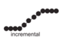
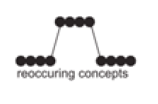
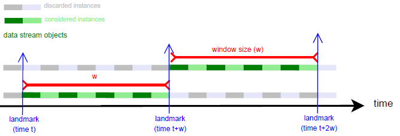
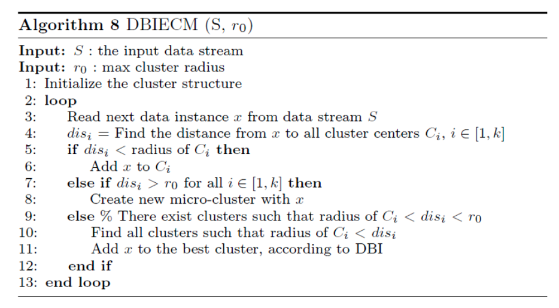
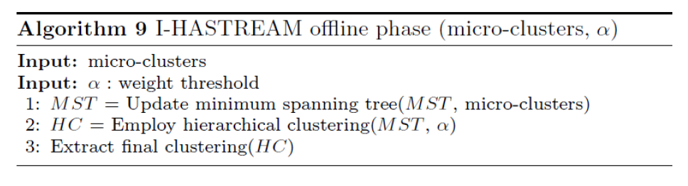
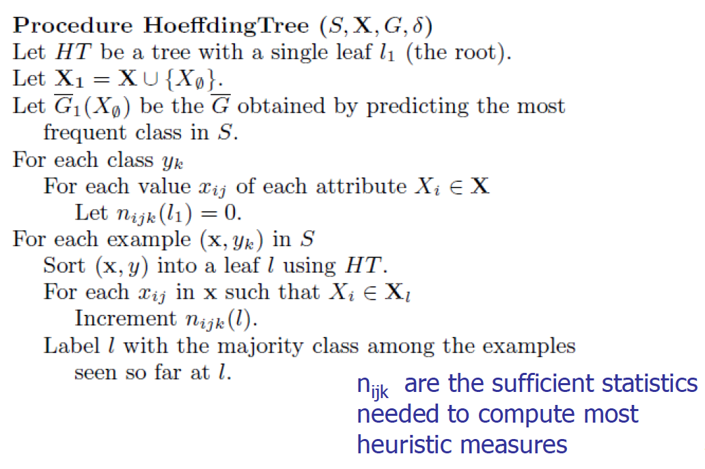
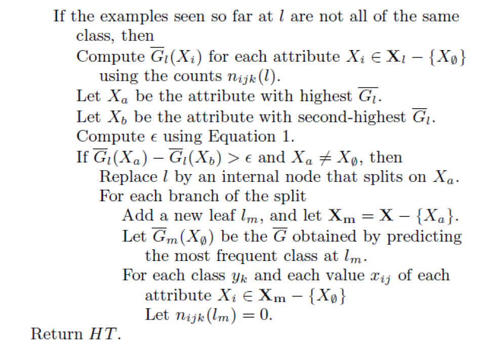

# Data Stream Analysis

We have to analyze data in streaming.

Data stream a potentially unbounded , ordered sequence of instances . A data stream $S$ may be shown as $S = \{ x_1 , x_2 , x_3 , ... , x_N \}$, where $x_i$ is $i$-th data instance, which is a $d$-dimensional feature vector and $N$ goes to infinity.

We theoretically have an infinite quantity of data. We have a time order.

The input is a data stream, we should have a stream processing engine to elaborate then and we want to produce knowledge in output.

In a classification problem we assumed to have a bounded training set. We train the classifier using it and it must be available, here we assume it arrives in streaming.

We have to produce a classifier or a cluster when we start to receive data, we don't have to wait them all.

With new instances we will improve the classifier.

We have to approach this problem providing a new algorithm.

We have to tune the clusters or the classification model,

Traditional Data Mining techniques usually require

-   __Entire dataset to be present__

-   __Multiple scans of the overall dataset__

-   __Random access to instances__

-   __Computationally heavy learning phases__, except in lazy learners

## Challenges of stream mining

-   __Impractical__ (and impossible) to __store the whole dataset__

-   __Impractical__ (and impossible) to __perform multiple scans of the overall dataset__, we have an high number of instances and we receive them in streaming

-   __Random access is expensive__

-   __Simple calculation per data__ due to time and space constraints

## Motivation

A growing number of applications generate streams of data

-   Performance measurements in network monitoring and traffic management

-   Log records generated by Web Servers

-   Tweets on Twitter

-   Transactions in retail chains, ATM operations in banks

-   Sensor network data

Application characteristics

-   Massive volumes of data

-   Records arrive at a rapid rate

## Computational Model

The __SPE__ elaborate the data stream and produce an approximated answer.

### Stream processing requirements

-   __Single pass__: Each record is examined at most once, we don't have time to perform iterations on these instanced

-   __Bounded storage__: Limited Memory (M) for storing synopsis and these are representation of the data streams

-   __Real time__: Per record processing time (to maintain synopsis) must be low

## __Algorithms__

Generally, algorithms __compute approximate answers__, we have to balance time and precision, it's difficult to compute answers accurately with limited memory.

-   Approximate answers - __Deterministic bound__

    Algorithms only compute an approximate answer but bounds on error. These algorithms can provide approximate answers but also guarantee that this approximation provides bounds on error, promising that the error is bounded.

-   Approximate answers - __Probabilistic bound__

    Algorithms compute an approximate answer with high probability

    With probability at least $1-\delta$, the computed answer is within a factor $\varepsilon$ of the actual answer

    We have a limited error with respect to the ideal answer.

These are single pass algorithms for processing streams __also applicable to (massive) terabyte databases__!

### __Concept Drift__
For efficiency problems we just need to perform the single pass.

One of the problems we have is the problem of the __concept drift__ which is the unforeseen change in statistical properties of data stream instances over time.

If new instances have the same statistical property the classifier works properly, nothing is changing, otherwise the model we are implementing do not work well.

It affects the model we generated, the classifier/cluster we generate can't be valide anymore.

We have to adapt the model to the condition we have.

There are __four types__ of concept drift: sudden, gradual, incremental and recurring.

-   __Sudden concept drift__ : Between two consecutive instances, the change occurs at once , and after this time only instances of the new class are received

    

-   __Gradual concept drift__ : The number of instances belonging to the previous class decreases gradually while the number of instances belonging to the new class increases over time. During a gradual concept drift, instances of both previous and new classes are visible. We have a period in which we have __instances of both classes__.

    

-   __Incremental concept drift__ : Data instances belonging to the previous class evolves to a new class step by step. After the concept drift is completed, the previous class disappears. The instances that arrive during the concept drift are of transitional forms and they do not have to belong to either of the classes.

    

-   __Recurring concept drift__ : The data instances change between two or more statistical characteristics several times. Neither of the classes disappears permanently but both of them arrive in turns.

    

    We have an oscillation between the two classes.

We have to model the concept drift.

### __Data Structures__

It is not possible to store and manage the whole input data, only a synopsis of the input stream is stored: special data structures enable to incrementally summarize the input stream.

Four commonly used data structures:

1. __Feature vectors__: summary of the data instances, we had these for example in _BIRCH_

2. __Prototype arrays__: keep only a number of representative instances that exemplify the data

3. __Core set trees__: keep the summary in a tree structure

4. __Grids__: keep the data density in the feature space, we use a grid and we update the density of cells in the grid

They are used to summarize the data.

The ML algorithm will work on this data structure. We receive the data, update the data structure and apply ML algorithms using the data structure, the summarization of instances.

The update should be fast, because when we receive an instance and update the data structure, we have to analyze the instances. With a high rate of receiving instances we need a fast way to update data structure.

### __The Window Model__

Sometimes it is more efficient to process recent data instead of the whole data and sometimes also more robust, we can have the concept drift and we must update our model but forcing more on the recent instances.

We need to give __more importance to the recent instances__.

To exploit this concept, we can use window models.

#### __Damped Window Model__

In __damped window model__ recent data have more weight than the older data: the importance of the instances decreases by time; they will have an higher weight.

We can decide the slope of the red line just to assign more importance to recent instances.

Usually implemented using __decay functions__ which scale down the weight of the instances, depending on the time passed since the instance is received

$$
    \large{f(t) = 2^{-\lambda t}}
$$

For example, we can use this exponential function where lambda is the decay rate. Higher decay rate in the function means a more rapid decrease in the value

We have to use data structure that allow us to store information we need, to generate for example clustering without losing information or losing few of them.

We typically focus on specific windows at the time to generate updates of the structures.

If we create the model at the beginning, if the distribution of data changes we need to change the model, and here is the problem of concept drift.

One possible approach is to retrain periodically the model to tune it on changes on the distribution of data.

In the damped window model, __old data weights almost zero__, they disappear with the increase of the time.

#### __Landmark window model__

The whole data between two landmarks are included in the processing and all of the instances have equal weight.

We work focusing on a window between two landmarks and work on it.

Consecutive windows do not intersect and the new window just begins from the point the previous window ends.

Let $w$ be the window length. Then, data instances belonging to the $m$-th window are calculated using:

$$
    \Large{W_m = [x_{m * w}, ... ,x_{(m+1)*w-1}]} \hspace{1cm}
    m = \left\lfloor \dfrac{i}{w} \right\rfloor
$$

#### __Sliding window model__

__The window swaps one instance at each step__: the older instance moves out of the window, and the most recent instance moves in to the window by FIFO style.

All instances in the window have equal weight and consecutive windows mostly overlap

Let $w$ be the window length.

Then, data instances belonging to the $m$-th window are calculated using

$$
    \Large{W_m = [x_m, ..., x_{(m+w-1)}]}
$$

These are data structure model to preprocess the data.

## __Data Stream Clustering__

Several algorithms were proposed to manage data space.

_BIRCH_ is an example of algorithm that can be used to manage data streams.

It has a data structure to summarize information relative to the data.

We have these 5 kinds of approaches.

In classification we need the label with data and it's not typically common.

In prediction it's different because after some time we can have the ground-truth.

__In most cases, true class labels are not available for stream instances__ and there is no prior knowledge about the number of classes.

Therefore, clustering, being unsupervised is __one of the most suitable data mining and data analysis methods for data streams__.

### __Adaptive Streaming k-Means__

We need to update clusters when we receive data in streaming.

We just use a number of instances at the beginning for initialization, and this is the parameter $l$.

We select the cluster with highest silhouette.

We obtain candidate centroids from that function.

Until we don't have any change we exploit the first centroids computed, while if we have some change we re-inizialize again centroids.

#### __Initialization phase__

The function _determineCentroids()_ finds $k$ and determines candidate centroids.

It estimates the __probability density function__ (PDF) of the data for each feature and determine the directional changes of the PDF curves: each change identifies a new region. The region can be defined as the area between two consecutive directional changes of the PDF curve.

We use this function and we just determine the variation between two different regions in the PDF function.

Number of regions is considered as a candidate $k$ and centers of these regions are considered as candidate initial centroids

We perform this work feature by feature, so we will have a different $k$ for each feature.

Different features generally show different distributions and different centroids, so we have that $k$ can vary:

$$
    \large{k \in [k_{min}, k_{min}+k_{max}]}
$$

The loop 2-5 is executed for these values of $k$ and for candidate centroids, the computations of using the kmeans of clusters.

Clustering results of different $k$ values are __compared according to silhouette coefficient__ and __best $k$ is selected__ with its corresponding centroids.

During the initialization phase we try to do this optimization.

#### __Continuous clustering phase__

We start to receive new instances and can locate them considering the centroids.

function _changeDetected()_:

We compute the standard deviation($\sigma$) and mean($\mu$) of the input data and are stored during the execution

The algorithm tracks how these two values change over time and predicts a concept drift according to the change. We monitor if $\sigma$ and $\mu$ changes along the time, in that case we have concept drift. When a concept drift is predicted, current cluster centroids are no longer valid (we have a change in distribution of data). In such a case the concept drift is realized at line 9 and a re-initialization is triggered at line 10, by using $l$ instances to update the clusters we should have.

We have to perform it feature by feature, and we have to decide the threshold to use.

#### __Complexity Analysis__

Let $l$ be the length of the initial data sequence, and $d$ be the data dimension.

The complexity of estimating $k$ for a single dimension is $O(l)$

Since this estimation is __performed for all dimensions__, total $k$ estimation complexity becomes $O(d \cdot l)$.

After determining initial centroids running k-means takes $O(d \cdot k \cdot cs )$, since no iterations of the algorithm are needed, where $cs$ is the number of different centroid sets.

Assigning a newly received data instance to the nearest cluster during the online phase is $O(k)$, we have to compute the distance of the new instance and $k$ centroids. As a result, __total worst case complexity of the algorithm__ is $O(k) + O(d \cdot l) + O(d \cdot k \cdot cs ) = O(d \cdot l) + O(d \cdot k \cdot cs )$.

We have to spend time in inizialization phase, but __computing the cluster for the new instance is easy__, we just to compute the distance, but it works until the distribution remains the same.

### __MuDi Stream__

MuDi Stream is a __hybrid algorithm__ based on both __density based__ and __grid based__ approaches

Input data instances are clustered in a density based approach and outliers are detected using grids (to reduce the computational time to work with the cell instead of the single instance).

For __Data synopsis, core mini clusters are used__: they are __specialized feature vectors__ which keep __weight, center, radius and the maximum distance__ from an instance to the mean. In the __online phase__ core mini clusters are created and kept up to date for each new data instance, we update the data structure and periodically we have an __offline phase__ to compute clusters. In the offline phase final clustering is executed over the core mini clusters. The online phase should perform very fast because we work at the arrival of the data.

#### __Online Phase__:

Parameters affect the final result.

$cmc$ = core mini cluster

Instances are located in specific cells while arriving, at the beginning not dense and while receiving instances, subcells become dense.

#### __Offline Phase__:

It is similar to _DBSCAN_ working on dense core mini-clusters.

Some $cmc_p$ can be detected as outlier because isolated and not used to create the cluster.

It's hybrid because __we use grids but we exploit density__.

In the offline phase we use DBSCAN but __with core mini-clusters__ and not instances.

Inside a loop, an unvisited core mini-cluster is randomly chosen at line 3 and marked as visited at line 4. If this core mini-cluster has no neighbors, it is marked as noise at line 16.

If it has neighbors, a new final cluster is created with this core mini-cluster and its neighbors, at lines 6-8. After that, each unvisited core mini-cluster in the new created final cluster is marked as visited and its neighbors are added to the same final cluster, at lines 9-14.

This loop continues until all core mini-clusters are marked as visited.

MUDI-stream is __not suitable for high dimensional data__, which makes the processing time longer, because of the grid structure (we would have an high number of cells).

Clustering quality of MuDi-Stream __strongly depends on input parameters density threshold__, decay rate for damped window model and grid granularity.

These parameters require an expert knowledge about the data.

The windows is present because we have a decrease of the weight of the instances in the cells and that's why we can periodically remove low weighted grids and $cmc\textnormal{s}$.

#### __Complexity Analysis__

Complexity of this linear search on core mini-clusters for each new data instance is $O(c)$ where $c$ is the number of core mini clusters

Let $G$ be total density grids for all dimensions, which is exponential to the number of dimensions. Space complexity of the grid is $O(log G)$ because the scattered grid are pruned during the execution.

Moreover, time complexity of mapping a data instance to the grid is $O(log log G)$ because the list of the grids is maintained as a tree During the pruning, all core mini clusters and grids are examined.

This makes time complexity of pruning $O(c)$ for core mini clusters and $O(log G)$ for grids.

As a result, the overall time complexity of MuDi Stream is $O(c) + O(log log G) + O(c) + O(log G) = O(c) + O(log G )$.

### __CEDAS__

Clustering of evolving data streams into __arbitrarily shaped clusters__

_CEDAS_ is a __fully online__ data stream clustering algorithm.

Density based algorithm designed for clustering data streams with concept drifts

__Damped window model__ is employed with a __linear decay function__ instead of an exponential one

Reducing by lambda is the decay which in fact is linear.

Energy decreases from 1 with the time.

#### __Complexity Analysis__

For each new data instance, _CEDAS_ performs a __linear search__ on the micro-clusters.

Complexity of this linear search is $O(c)$ where $c$ is the number of micro-clusters.

After that, energy of each micro-cluster is reduced, which also requires an $O(c)$ complexity.

The last step, which updates the graph structure, is executed only when a new micro-cluster is created or removed. In the worst case, all micro-clusters are visited, so worst case time complexity of this step is again $O(c)$.

Therefore, the overall time complexity of CEDAS is $O(c)$, the number of micro-clusters.

### __Improved Data Stream Clustering Algorithm__

Improved clustering algorithm based on high speed network data stream.

Online phase composed of two main sub phases: __Initialization phase__ and __continuous clustering phase__.

Major micro clusters and critical micro clusters are used

Major microclusters have __high densities__ and will be included in the final clustering process

Critical micro clusters have __low densities__ and treated as __potential outliers__

__Damped window model__ is used and low weighted major and critical micro clusters are removed periodically.

We exploit the decay rate again.

Threshold values of major and critical micro clusters are global parameters in the algorithm, instead of being specific to each micro cluster. However, they are dynamic parameters and continuously updated during the execution.

#### __Online phase__

In initialization we can work with any kind of algorithm, because we work with static data instances.

The OR depends on if $x$ is closer to a major or critical micro-cluster, or far away from both.

The pruning period depending on the decay rate

#### __Offline phase__

At the end we create clusters starting from the major micro-cluster and adding other micro-clusters.

If the distance between a micro-cluster and another major micro-cluster is less than or equal to the sum of their radii, then they are directly density reachable.

If any adjacent two clusters in a set of micro-clusters are directly density reachable, then the set of micro-clusters is density reachable, so we can add them.

#### __Complexity Analysis__

Let $l$ be the length of the initial data sequence. Complexity of the initialization equals to complexity of _DBSCAN_, which is $O(l \cdot log l)$ in average and $O(l^2)$ in worst case.

In the continuous clustering phase, a linear search is performed on micro-clusters for each new data instance. Complexity of this linear search is $O(c)$ where $c$ is the number of micro-clusters.

When it is pruning period, pruning task is executed for each microcluster one by one and this also requires a complexity of $O(c)$.

Therefore, the total worst-case complexity is $O(c) + O(c) = O(c)$.

### __DBIECM__

DBIECM is an __online, distance-based, evolving__ data stream clustering algorithm

Exploits the __Davies Bouldin Index__ (DBI) which is used as the evaluation criterion, that uses dispersion and separation.

$$
    \large{V_{DB} = \dfrac{1}{k}\sum_{i = 1}^{k}{R_i}}
$$
where $R_i = \max_{i \ne j}{R_{ij}} \hspace{1cm}R_{ij} = \dfrac{S_i + S_j}{D_{ij}}$

$$
    \large{S_i = \left(\dfrac{1}{|C_i|} \sum_{x \in C_i}{D^p}(x,v_i) \right)^{\dfrac{1}{p}}, p > 0 \hspace{1cm}D_{ij} = \left(\sum_{l = 1}^{d}{|v_{il}-v_{jl}|^t} \right)^{\dfrac{1}{d}}, t > 1}
$$
Where:

- $S_i \rightarrow$ Dispersion

- $C_i \rightarrow$ Number of objects in cluster $C_i$

- $v_i \rightarrow$ Centroid of cluster $C_i$

- $D_{ij} \rightarrow$ Separation 

We take again in consideration __compactness and separation__.

We exploit DBI to determine the best cluster to add these instances.

DBIECM requires the __maximum cluster radius as a parameter__, this parameter directly affects the final cluster count and consequently the clustering quality.

Maximum cluster radius strongly depends on the input data and __requires an expert knowledge about the data__. Being distance based, DBIECM can detect __only hyperspherical clusters__.

DBIECM __does not employ any time window model__, thus no input data instance out dates, all input data exist in the final clustering Moreover, no outlier detection mechanism is implemented. However, it is possible to specify an outlier threshold value and mark the clusters with low cardinality as outliers.

We don't use a decay approach.

#### __Complexity Analysis__

When a new data instance is received, a linear search is performed on clusters. Complexity of this linear search is $O(k)$.

Pairwise distances between all clusters are used for DBI calculation, thus DBI calculation requires a complexity proportional to $O(k^2)$.

When there exist more than one candidate cluster for the new data instance, the instance is added to all of them one by one and DBI is calculated accordingly. This requires a complexity proportional to $O(k^3)$.

Therefore, although the average complexity of DBIECM depends on the input data, the __total worst-case complexity__ is $O(k) + O(k^3) = O(k^3)$

__If $k$ is big this complexity can be relevant__.

### __I-HASTREAM__ (IN MY NOTES MARCELLONI SAID THAT WE OVERLOOKED IT)

__Two phases, adaptive, density based, hierarchical__, data stream clustering algorithm.

In the __online phase__, synopsis of the data is created as microclusters.

In the __offline phase__, micro-clusters are maintained in a graph structure as a minimum spanning tree and hierarchical clustering is employed for the final clustering

Main contributions of I-HASTREAM are to perform the final clustering on a minimum spanning tree and to incrementally update the minimum spanning tree according to the changes in the microclusters, instead of generating it from scratch. Both contributions are related to the offline phase.

Because no algorithmic details are specified about the online phase, the __analysis of the complexity of _I-HASTREAM_ was not possible__.

### __Comparison__

Most of them use a damped window method, so with a decay.

Some exploits only online phase, others exploit both.

They can adapt to concept drift.

In online phase we update data structures and in offline phase we generate periodically clusters, exploiting k-means, DBSCAN or some other algorithm.

It's interesting to understand how clusters modify over time, considering the evolution of clusters, easier with k-means because we have centroids even if simpler information but not with DBSCAN where we consider shape, location and other things.

## __Classification__

### __VFDT__ (Very Fast Decision Tree)

With classification we have to assume to receive streams of labeled data.

The problem here is to learn a classifier with data arriving in streaming, our training set is provided in streaming.

__Classic decision tree learners__ assume all training data can be simultaneously stored in main memory

__Disk based decision tree learners__ repeatedly read training data from disk sequentially

Prohibitively expensive when learning complex trees

We use a modification of decision trees, we learn decision tree while instances arrive assuming they can be infinite.

__Goal__: design decision tree learners that __read each example at most once__, and __use a small constant time to process it__.

In order to find the best attribute at a node, it may be sufficient to consider only a small subset of the training examples that pass through that node.

We want to be sure that the splitting is reliable.

We want to understand if we can approximate the decision with a limited number of instances, being sure that we don't have a high error in taking this decision.

Given a stream of examples, we use the __first ones to choose the root attribute__.

Once the root attribute is chosen, the __successive examples are passed down to the corresponding leaves__, and used to choose the attribute there, and so on recursively.

We have to decide __when to split a leaf to create a new subtree__.

We use the __Hoeffding bound__ to decide how many examples are enough at each node to take a decision.

Warning: the approach analyzed in the subsequent phases has some theoretical problem, but you can find it implemented in several tools which manage data streams.

It works but have a wrong assumption(kek).

#### __Hoeffding Bound__

Let $X$ a random variable varying in a range $R$

Let us assume that we have $n$ observations of $X$

Let $x'$ be the average value of the $n$ observation

The Hoeffding bound states that with probability $1-\sigma$ , the mean $X'$ of $X$ is at least $x' - \varepsilon$ where:

$$
    \large{\varepsilon = \sqrt{\dfrac{R^2ln1/\delta}{2n}}}
$$

It guarantees the error is limited after a number of instances we are able to collect.

We can set $\varepsilon$, determine $n$, the number of observations to be collected to be sure that the error we have is $\varepsilon$ when we approximate the average $x$ computed with the $n$ observation the mean of $X$ with that probability.

If we set the probability and $\varepsilon$, we have the number of instances to collect.

__How do we use the Hoeffding Bound?__

Let $G(X_i)$ be the heuristic measure used to choose test attributes (e.g.

Information Gain, Gini Index)

$X_A$: the attribute with the highest attribute evaluation value after seeing $n$ examples.

$X_B$: the attribute with the second highest split evaluation function value after seeing n examples.

Given a desired $\delta$: if $\Delta\bar{G} = \bar{G}(X_A) - \bar{G}(X_B) > \varepsilon$, with $\varepsilon = \sqrt{\dfrac{R^2ln1/\delta}{2n}}$

and R=lnc, where c is the number of classes, after seeing n examples at a node,

the Hoeffding bound guarantees the true $\Delta G \ge \Delta \bar{G} - \varepsilon > 0$ with probability $1-\delta$

This node can be split using $X_A$ and the succeeding examples will be passed to the new leaves

We can express the number of instances we need to have the possibility to split the node because we can decide that the attribute $X_A$ is the one we can choose for splitting the node.

We can start with the root, collect instances, decide to split the root.

When $\Delta G$, the $G$ computed without splitting and with an attribute, is higher than $\varepsilon$ we are sure, for the Hoeffding Bound of the original paper, that __the approximation is very close to the decision tree__ that we will have collecting all instances.

#### __Problem__:

__Split measures__, like information gain and Gini index, __cannot be expressed as a sum $S$ of elements $Y_i$.__

We have this as a problem because the Hoeffding Bound is defined for this kind of variable so we just expressed in terms of sum of elements, but __the information of gain is not a sum of elements__.

When we just add instances, we don't have that $G$ is a sum of these instances.

This is why the formula we saw is __not correct theoretically__.

Actually, the correct formula is:

$$
    \large{\epsilon = C_{Gain}(K,N)\sqrt{\dfrac{ln(1/\delta)}{2N}}}
$$

where

$$
    C_{Gain}(K,N) = 6(Klog_2eN + log_22N) + 2log_2K
$$

that __changes the number of instances to collect that approximate the decision tree we would have having all instances__.

__Two considerations__:

-   Pre-pruning is carried out by considering at each node a "null" attribute $X_A$ that consists of not splitting the node. Thus __a split will be performed if__, with confidence $1- \delta$, __the best split found is better (according to $G$) than not splitting__

-   The most significant part of the time cost per example is __recomputing $G$.__

It is __inefficient to recompute $G$ for every new example__, because it is unlikely that the decision to split will be made at that specific point, we have to accumulate some points before appreciating the modification. Thus, VFDT (Very Fast Decision Tree) learner __allows the user to specify a minimum number of new examples__ $n_{min}$ that must be accumulated at a leaf before $G$ is recomputed. We recompute $G$ after accumulating that minimum number of instances.

#### __Algorithm__

Calculate the information gain for the attributes and determines the best two attributes

__Pre pruning__: consider a "null" attribute that consists of not splitting the node

At each node, check for the condition:

$$
    \large{\Delta \bar{G} = \bar{G}(X_A) - \bar{G}(X_B) > \varepsilon}
$$

If condition is satisfied, __create child nodes based on the test at the node__

If not, stream in more examples and perform calculations till condition is satisfied

We accumulate instances in the leaf and we have to decide if they can classify correctly instances or we need to split them, to decide if we have to split we have to decide when we accumulate a sufficient number of instances to consider that a reliable decision.

The Hoeffding Bound tells us when we accumulate a sufficient number of instances to take that decision.

We update the decision tree using each instance and just update the label of the leaves.

We select $X_a$ as the attribute to split.

We set to 0 because we start again to recompute statistics.

#### __Performance Analysis__

$p$ : probability that an example passed through DT to level $i$ will fall into a leaf at that point

The expected disagreement between the tree produced by Hoeffding tree algorithm and that produced using infinite examples at each node is __no greater than__ $\delta/p$, for the Hoeffding bound.

__Required memory__: $O(leaves * attributes * values * classes)$

### __CVFDT__ (Concept adapting Very Fast Decision Tree learner)

It __extends VFDT but maintain VFDT's speed and accuracy also dealing with the concept drift__, not managed by VFDT because we decide to split a node if the number of instances guarantees that the decision we are taking is a good approximation of the one using all instances but nothing talks about concept drift, which is managed but alternative subtrees created when we receive instances.

It __detects and responds to changes__ in the example generating process

#### __Observations__

-   With a __time changing concept__, the current splitting attribute of some nodes __may not be the best anymore__.

-   An outdated subtree __may still be better than the best single leaf__, particularly if it is near the root.

    -   Grow an alternative subtree with the new best attribute at its root, when the old attribute seems out of date.

-   Periodically __use a bunch of samples to evaluate qualities of trees__.

    -   Replace the old subtree when the alternate one becomes more accurate.
