# MapReduce and Hadoop

With large datasets we need to store data in different servers.

We have these frameworks that can help us to do it.

## MapReduce

_MapReduce_ is a programming model Google has used to process big data.

There's the problem to distribute the filesystem and to perform distributed computations.

In this paradigm:

-   __Users specify the computation__ in terms of a __map__ and a __reduce__ function, mappers and reducers are executed __in parallel__.

-   __Underlying runtime system__ automatically __parallelizes the computation__ across large-scale clusters of machines, and

-   Underlying system also __handles machine failures__, __efficient communications__, and __performance issues__.

Consider a large data collection:

{web, weed, green, sun, moon, land, part, web, green,...}

Problem: Count the occurrences of the different words in the collection.

The _parse()_ analyzes the collection and the _count()_ counts the occurrences of words in the collection.

||||
|-|-|-|
|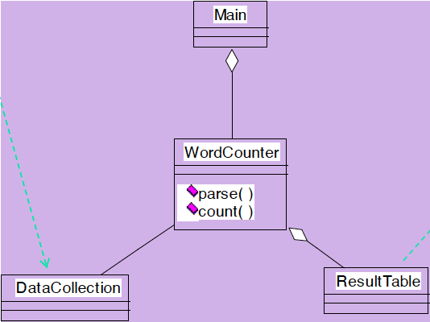|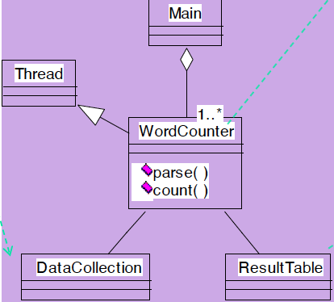|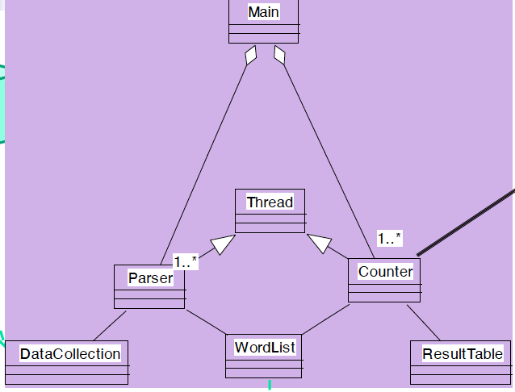|

We can think they work in sequence, but we can speed-up the process with a __multi-thread solution__.

If we just maintain a unique result table, we can write only in a lock state.

To solve this, we can create __multiple parser and counters__, each one having a __private table__. We don't have need for lock and at the end we will __merge the tables__.

If we have a very large data collection, we have that this data cannot be maintained in one single machine and we cannot exploit multi-threading. To solve this problem, each machine will elaborate its own data collection private to the single machie.

The file system has to be fault-tolerant, Hard disks can fail.

We exploit as solution the replication on several servers and using __checksum__.

If we have a "fire" in close servers, we may lose the data if replicas are all in that "building". So it's important that the replicas are in different places.

This introduces other problems: __using replicas in different locations brings us to deal with synchronization__, but data transfer bandwidth is critical (location of data).

__Critical aspects__: fault tolerance + replication + load balancing, monitoring

We have to take care of load balancing because we have also computation on different servers but we need a balance on this computations, considering fast/slow tasks in fast/slow servers.

We want to __exploit parallelism__ afforded by spitting parsing and counting.

__We need an automatic solution__.

In every server we will have a data collection, a parser and a counter.

Each server manages the private data collection, and we have to synchronize the tables to produce the final result.

The real advantage is that data are characterized with the __Write Once Read Many__ (_WORM_) characteristics.

This is the case, because we receive data collections, and we just have to read them.

Data with WORM characteristics __yields to parallel processing__.

__Write-once-read-many__: a file once created, written and closed need not be changed --this assumption simplifies coherency

If we change the content of the file, we need to handle the consistency updating replicas.

This file system works very well if we have one write and multiple reads.

Data without dependencies __yields to out of order processing__ because we can think to process concurrently and to have only in some phases some synchronization.

### Divide and Conquer

Parse and count can work in parallel.

Our __parse__ is a mapping operation:

__MAP__: input $\rightarrow$ \<key, value\> pairs with value equal to 1

Our __count__ is a reduce operation:

__REDUCE__ receives as input \<key, value\> pairs and __reduce it increasing the counter for a key__ producing in output \<key,value\> cumulative.

Runtime adds distribution + fault tolerance + replication + monitoring + load balancing to your base application

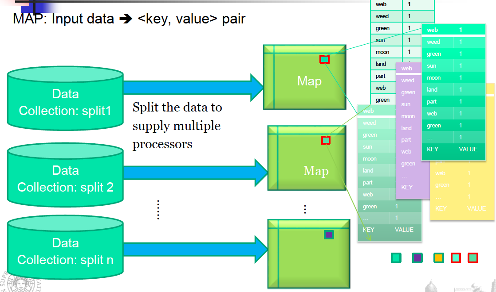

In MAP we __split the data to supply multiple processors__, each map __reads the split of the data collection__ and __analyzes if the word is present__ and output \<word, 1\>.

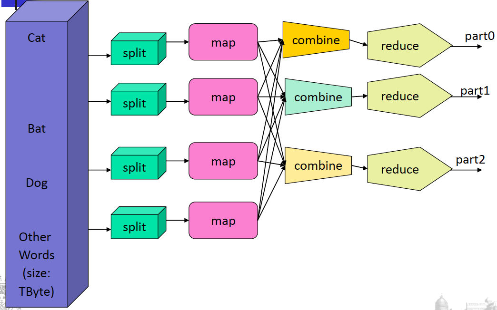

It goes in input to the reducers that increase the counter.

_combine_ combines results of executions in the same server

### __Programming Model__

Considering the MapReduce Programming Model, we have to:

-   __determine if the problem is parallelizable__ and solvable using MapReduce (ex: Is the data WORM?, large data set).

-   __design and implement solutions__ as Mapper classes and Reducer class.

-   __compile__ the source code with Hadoopcore.

-   __package__ the code as jar executable.

-   __configure the application__ (job) to the number of mappers and reducers (tasks), input and output streams

-   __load the data__ (or use it on previously available data)

Mappers can be executed in parallel, reducers can be executed in parallel and __the only synchronization is between mappers and reducers__.

Map and Reduce are the main operations: __simple code__.

There are other supporting operations such as combine and partition.

All the maps should be completed before the reduce operations start.

Operations are computed where we have the data.

We have special distributed file system.

For example: HadoopDistributed File System and HadoopRuntime.

__Hadoop is the framework and MapReduce is the paradigm__.

It is __scalable__, __flexible__ in accepting all data formats, __efficient__ for fault-tolerance and __can use commodity inexpensive hardware__.

Automatic parallelization & distribution and fault-tolerance & automatic recovery are hidden from the end user that just provides two functions.

## __Hadoop__

__Hadoop__ is a software framework for distributed processing of large datasetsacross large clusters of computers.

-   Large datasets $\rightarrow$ Terabytes or petabytes of data

-   Large clusters $\rightarrow$ Hundreds or thousands of nodes

Hadoop is open-source implementation for Google MapReduce.

Hadoop is based on a simple programming model called MapReduce.

Hadoop is based on a simple data model, any data will fit.

### __Hadoop Distributed File System__

It has a __master-slave shared-nothing architecture__, used for the distributed file systems and distributed processing.

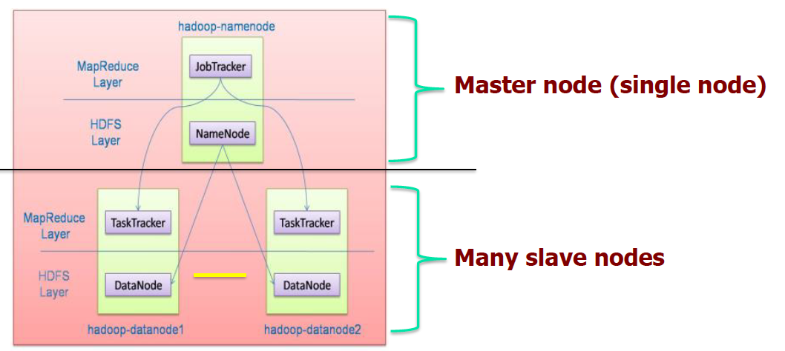

In the __Master__ we have the __filesystem__ and, in the __slaves__, we have the __actual storage of data__.

In the slaves we have the __allocation for tasks__, the real executions of tasks.

The master has a __jobTracker__ and acts as a sort of synchronizer.
It works well if slaves do not need to share anything.

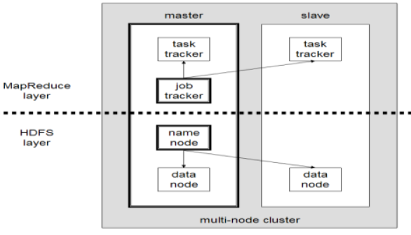
Hadoop framework consists of two main layers

-   __Distributed File System__ (HDFS)

-   __Execution engine__ (MapReduce), for the execution of tasks

The environment is the following:

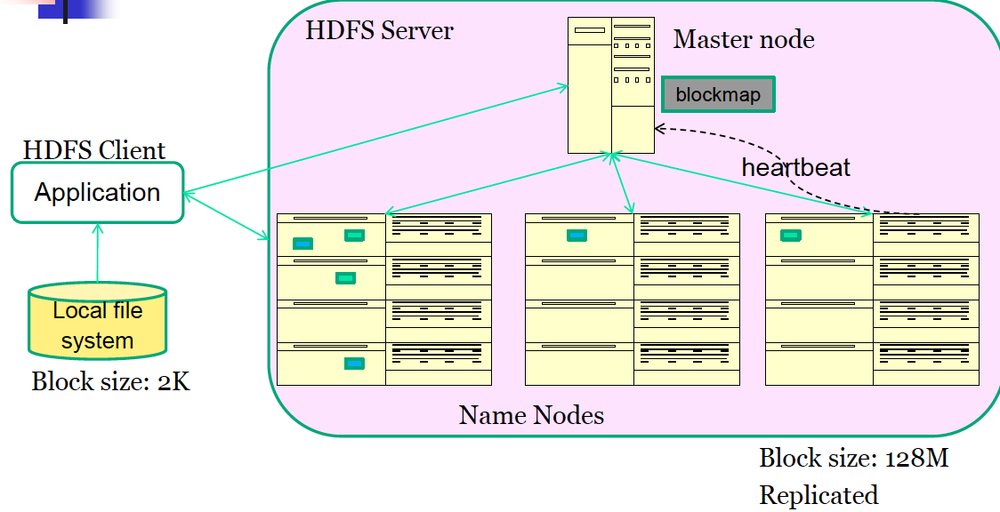

While in local file systems we manage blocks of 2K size, in HDFS we manage 128M blocks.

This allows us to have a __limited blockmap__, we reduce the number of blocks to manage in the master node that contains mapping of each block with the place in which it is stored.

Each block is stored in different slaves.

HDFS is a distributed file system __optimized for high throughput__.

It leverages unusually large (for a file system) block sizes and use data locality optimizations to reduce network input/output (I/O).

Works very well when reading and writing large files (gigabytes and larger), because we mode large blocks.

It is __scalable__ and __reliable__.

It replicates files for a configured number of times, it is tolerant of both software and hardware failures and it automatically re-replicates data blocks on nodes that have failed.

__Failure is the norm rather than exception__.

A HDFS instance may consist of thousands of server machines, each storing part of the file system's data.

Since we have huge number of components and that each component has non-trivial probability of failure means that __there is always some component that is non-functional__.

__Detection of faults__ and __quick, automatic recovery__ from them is a core architectural goal of HDFS.

#### __Master/slave architecture__

HDFS cluster consists of a __single Namenode__ (master), a master server that __manages the file system namespace__ and __regulates access to files by clients__.

There are __multiple DataNodes__ (slaves) usually __one per node__ in a cluster.
The DataNodes __manage storage__ attached to the nodes that they run on.

HDFS exposes a file system namespace and allows user data to be stored in files.

A file is __split into one or more blocks__ and __set of blocks are stored in DataNodes__.

DataNodes: __serves read__, __write requests__, __performs block creation, deletion, and replication__ upon instruction from Namenode. Real operations are done in DataNodes but __commands come from Namenodes__.

#### __HDFS Architecture__

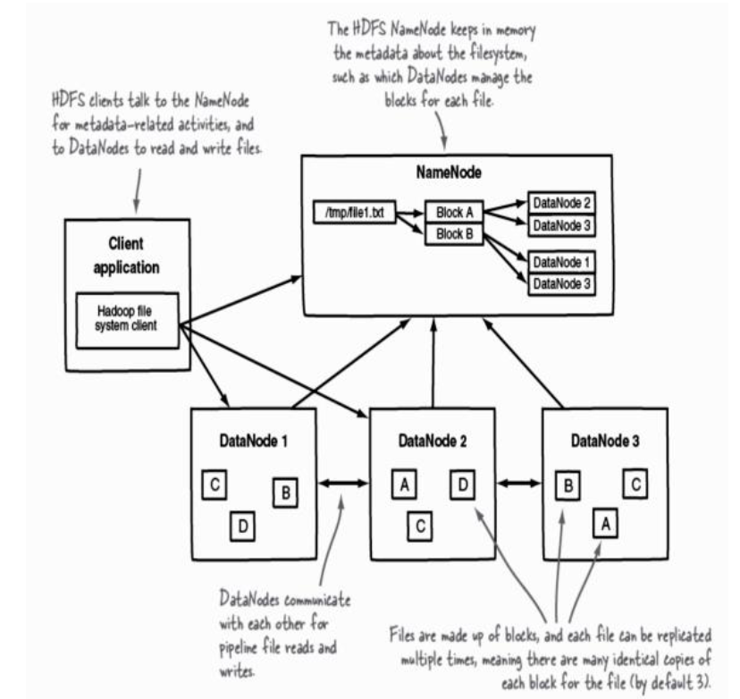

For each file, we have the __list of blocks__ and where they are stored.

The client __interacts directly with the NameNode__, receives where blocks are present and interacts with DataNodes to retrieve the block.

When we manage the transfer from DataNodes we don't need the interaction with the NameNode.

By default, the number of identical copies of each block is 3 but we can increment it if we want to increase the fault tolerance.

We have an __hierarchical file system__ with directories and files.

The Namenode __maintains the file system__.

Any meta information changes to the file system recorded by the Namenode.

An application __can specify the number of replicas of the file needed__: replication factor of the file. This information is stored in the Namenode.

HDFS is designed to store very large files across machines in a large cluster.

Each file is a __sequence of blocks__.
All blocks in the file except the last (depending on the size of the file) are of the __same size__.
Blocks are replicated for fault tolerance.
Block size and replicas are __configurable per file__.

The Namenode receives a __Heartbeat__ and a __BlockReport__ from each DataNode in the cluster.
BlockReport contains __all the blocks on a DataNode__.

The __placement of the replicas__ is __critical__ to HDFS reliability and performance.
If a node fails, we will have to find the replica from another node and give it to another new node.
__Optimizing replica placement__ distinguishes HDFS from other distributed file systems.

__Rack-aware replica placement__:

The goal is to improve reliability, availability and network bandwidth utilization.

Where to store replicas?

Having them in one server is easy and fast to maintain, but we have a __Single Point Of Failure__.
Typically we have replicas in __different servers in the same rack__ and other replicas in other locations.
We also have many racks, communication between racks is __through switches__.

If something happens in the same location we lose a lot of replicas.

Network bandwidth between machines on the same rack is greater than those in different racks.

The Namenode determines the rack id for each DataNode.

Replicas are typically placed on unique racks.
This is __simple but non-optimal__: writes are expensive and replication factor is 3.

Replicas are placed: __one__ on a node in a __local rack__, __one__ on a __different node in the local rack__ and __one__ on a node in a __different rack__ (possibly in a different location).
1/3 of the replica on a node, 2/3 on a rack and 1/3 distributed evenly across remaining racks.

__Replica selection for READ operation__: HDFS tries to minimize the bandwidth consumption and latency. When we perform a read operation, we exploit the closer block. We execute the code in the server which has the __closest block__, we don't need to move data.
If there is a replica on the Reader node then that is preferred.

HDFS cluster may __span multiple data centers__: replica in the local data center is preferred over the remote one.

#### __NameNode__

The HDFS namespace is stored by Namenode.

Namenode uses a __transaction log__ called the __EditLog__ to record every change that occurs to the filesystem meta data. EditLog is __stored in the Namenode's local filesystem__.

Furthermore, the entire filesystem namespace including mapping of blocks to files and file system properties is stored in a file __FsImage__ (File System Image), stored in Namenode's local filesystem.

The Namenode __keeps the image of the entire file system namespace__ and __file Blockmap in memory__. 4GB of local RAM is sufficient to support the above data structures that represent the huge number of files and directories.

We use large blocksize to reduce the occupation in the main memory for the NameNode.

When the Namenode starts up it __gets the FsImage and Editlog__ from its local file system, __update FsImage with EditLog Information__ and then stores a copy of the FsImage on the filesystem as a __checkpoint__.

Periodic checkpointing is done, so that the system can recover back to the last checkpointed state in case of a crash. Periodically __FsImage is updated__ using the EditLog.

Primary objective of HDFS is to store data reliably in the presence of failures.

#### __Failures__

Three common failures are: __Namenode failure__, __Datanode failure__ and __network partition__.

A __network partition__ can cause a subset of Datanodes to lose connectivity with the Namenode. Namenode detects this condition by the __absence of a Heartbeat message__, sent from slaves to the master. 

Namenode marks Datanodes without Hearbeat and __does not send any I/O requests to them__. Any data registered to the failed Datanode is not available to the HDFS. Also, the death of a Datanode may cause replication factor of some of the blocks to __fall below their specified value__.

__Metadata Disk Failure__

FsImage and EditLog are central data structures of HDFS. A corruption of these files can cause a HDFS instance to be non-functional.

For this reason, a Namenode can be configured to __maintain multiple copies of the FsImage and EditLog__. Multiple copies of the FsImage and EditLog files are __updated synchronously__.

__Meta-data is not data-intensive__. The Namenode could be single point failure: automatic failover is NOT supported!

HDFS support write-once-read-many with reads at streaming speeds.

A typical block size is 64MB, a file is chopped into 64MB chunks and stored. We move from datanodes to client and to namenode, blocks of 64MB.

#### __Staging__

A client request to create a file __does not reach Namenode immediately__. 

HDFS client caches the data into a temporary file. When the data reached a HDFS block size the client contacts the Namenode.

Namenode __inserts the filename into its hierarchy__ and __allocates a data block for it__.

The Namenode responds to the client with __the identity of the Datanode__ and the __destination of the replicas__ (Datanodes) for the block.

Then the client flushes it __from its local memory directly to the Datanode__.

The client sends a message that the file is closed.

Namenode proceeds to __commit the file__ for creation operation into the persistent store.

If the Namenode dies before file is closed, __the file is lost__, we don't have this information in the EditLog.

This client side caching is required to avoid network congestion, because it's useless just to open the communication and send few bytes, we use the caching and when we receive the size of a block we start to send it.

#### __Replication Pipelining__

When the client receives response from Namenode, it flushes its block in small pieces (4K) to the first replica, that in turn copies it to the next replica and so on.

Thus data is pipelined from DataNode to the next.

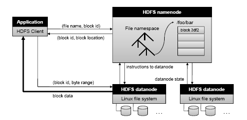

The client communicates with the namenode for the creation of the file.

The namenode allocate the file and block names and return the datanode in which it will be stored.

#### __Application Programming Interface__ (API)

HDFS provides Java API for application to use, and a http browser can be used to browse the files of a HDFS instance.

#### __FS Shell, Admin and Browser Interface__

HDFS organizes its data in files and directories.

It provides a command line interface called the __FS shell__ that lets the user interact with data in the HDFS.

The __syntax__ of the commands is __similar to bash and csh__.

>Example: to create a directory /foodir
>
>/bin/hadoop dfs --mkdir /foodir

There is also __DFSAdmin interface__ available

#### __Space Reclamation__

When a file is deleted by a client, HDFS renames file to a file in be the /trash directory for a configurable amount of time.

A client __can request for an undelete in this allowed time__.

After the specified time the file is deleted and the space reclaimed.

When the replication factor is reduced, the Namenode selects excess replicas that can be deleted.

Next heartbeat(?) transfers this information to the Datanode that clears the blocks for use.

### __Core Hadoop Components: MapReduce__

In MapReduce we have mappers and reducers, and they work very well when we have a batch-based, distributed computing framework.

It allows to parallelize work over a large amount of raw data.

Simplifies parallel processing by abstracting away the complexities involved in working with distributed systems (computational parallelization, work distribution, unreliable software, and hardware, etc.)

It decomposes work submitted by a client into small, parallelized map and reduce workers.

It uses a __shared-nothing model__: remove any parallel execution interdependencies that could add unwanted synchronization points or state sharing. They could limit our parallel execution.

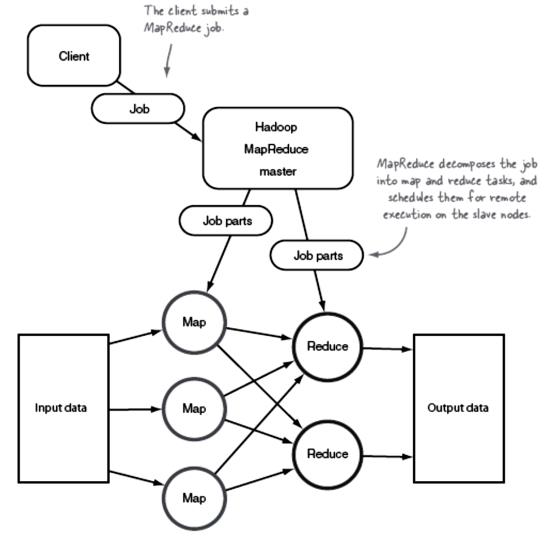

The MapReduce master __divides the job in parts__, some for mappers and some for reducers. They schedule them for remote execution on the slave node.

The role of the programmer is to __define map__ and __reduce__ functions.

__Map functions__: output key/value tuples

__Reduce functions__: process the key/value tuples to produce the final output

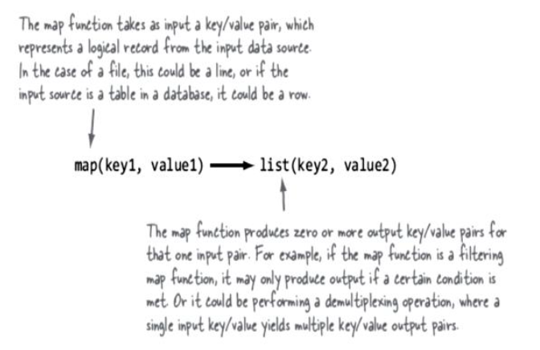

It __elaborates the original file/table__ and __process key/value pairs__.

The reducer __elaborates this list of key/value pairs__ and __produces a list of other key/value pairs__.

The power of MapReduce occurs in __between the map output and the reduce input__, in the __shuffle and sort phases__.

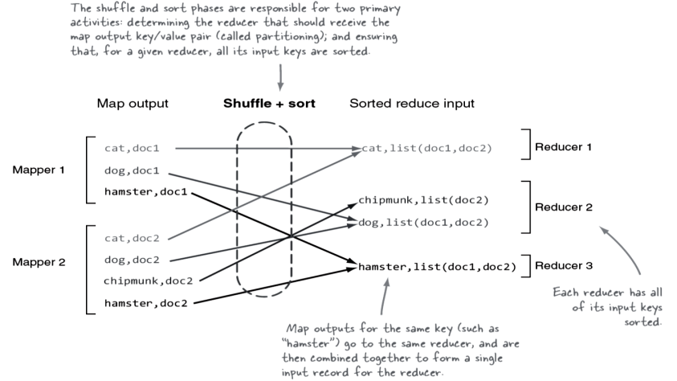

The __shuffle+sort__ is managed using the map/reduce support and have the primary duties specified, determine the reducer for the output of the mappers and ensure that for a given reducer the input keys are sorted.

The shuffle knows that the keyword cat is elaborated by _Reducer 1_ and so all outputs are organized to provide this keyword as input to _Reducer 1_, also merging possible values for the specific key(sort phase).

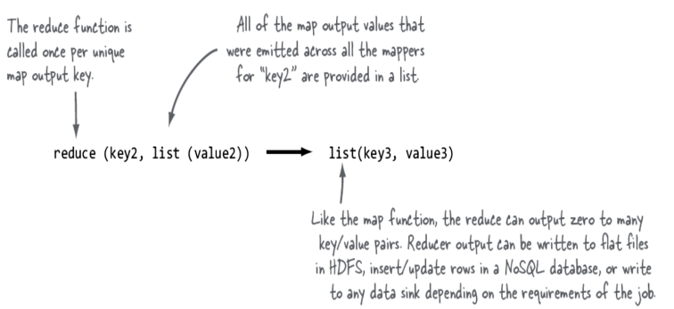

Shuffle and sort in MapReduce:

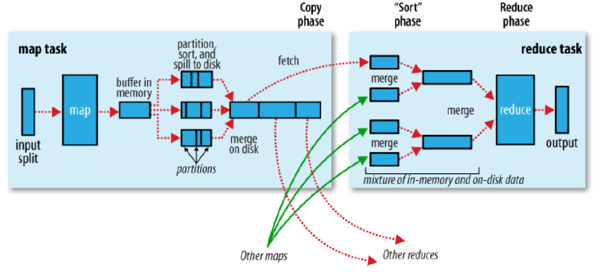

Map tasks and reducers tasks are __typically executed in different servers__.

We need to have __similar mapper executions__, otherwise we have to wait for the longest one.

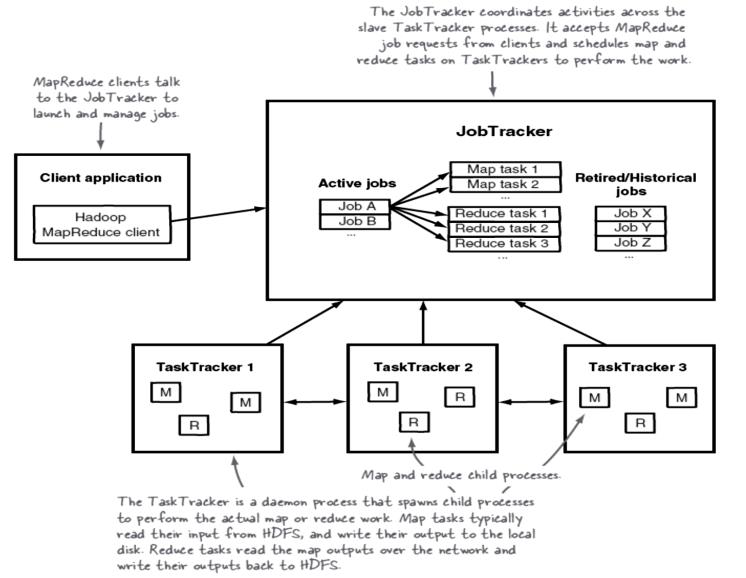

### __Physical Architecture__

__RAID is discouraged on the DataNodes__ because HDFS has already replication, but it is __strongly recommended on the NameNode__.

From a network topology perspective with regards to switches and firewalls, __all of the master and slave nodes must be able to open connections to each other__.

For __small clusters__, all the hosts would run 1 GB network cards connected to a single, good-quality switch.

For __larger clusters__ look at 10 GB top-of-rack switches that have at least multiple 1 GB uplinks to dual-central switches.

We can use __commodity hardware__ but __fast communication network__.

### __Hadoop Limitations__

#### __HDFS__

Lack of high availability (High Availability requires shared storage for NameNode metadata, which may require expensive HA storage), inefficient handling of small files and lack of transparent compression.

#### __MapReduce__

Batch-based architecture --does not lend itself to use cases that need real-time data access

#### __Security__

Hadoop offers a security model, but by default it is disabled. Hadoop can be configured to run with _Kerberos_ (a network authentication protocol, which requires Hadoop daemons to authenticate clients)

### __MapReduce execution__

We need to have mappers and reducers working in parallel or we lose all our advantages we can have.

__One or more chunks__ from a distributed file systems are given to a Map task.

Map tasks turn the chunk into a __sequence of key-value pairs__ (the way is determined by the code of the Map function).

The key-value pairs from each Map task are __collected by a master controller and sorted by key__.

The keys are __divided among all the Reduce tasks__: all key-value pairs with the __same key__ wind up at the __same Reduce task__.

The Reduce tasks work on __one key at a time__ and combine all the values associated with that key in the way defined by the code written in the Reduce function.

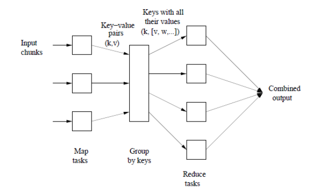

#### __Map Tasks__

The input files for a Map task consists of __elements__ (a tuple or a document) __gathered in chunks__. No element is stored across two chunks.

The map function takes an input element as its argument and produces zero or more key-value pairs.

__Keys do not have to be unique__: rather Map task can produce several key-value pairs with the same key.

Let's see the map task.

Example: counting the number of occurrences for each word in a collection of documents

Input file: repository of documents and each document is an element

Key: strings

Value: integer

The Map Task reads the document and breaks it into its sequence of words $w_1, w_2, ..., w_n$.

The output of the Map task is:

$$
    \large{(w_1, 1), (w_2, 1), ..., (w_n, 1)}
$$

We will have a pair __(word, 1)__.

Note that a __single Map__ task will typically __process many documents__ --all the documents in one or more chunks. Thus, its output will be more than the sequence for the one document suggested above.

The key-value pairs are __grouped by key__ and the values associated with each key are formed into a list of values.

Master controller process knows how many reduce tasks there will be (say $r$), picks a hash function that applies to keys and produces a bucket number from $0$ to $r-1$.

Each key-value pair output from a Map task is put in one of the $r$ local files. Each file is destined for one of the Reduce tasks.

Merges the files from each Map task and feeds the merged file to that process as a sequence of key-list-of-value pairs $(k, [v_1, v_2, ..., v_n])$

where $(k, v_1), (k, v_2), ..., (k, v_n)$ are all the key-value pairs with key $k$ coming from all the Map tasks.

We have as output the key and the set of values corresponding to that key.

#### __Reduce Task__

Considering the Reduce task, we have:

__Input__: key and its list of associated values

__Output__: sequence of zero or more key-value pairs

The Reduce task elaborates the keys and their lists of associated values generated by the grouping process

Example word count: The Reduce function __simply adds up all the values__.

The __output__ of a reducer consists of the __word and the sum__.

The output of all the Reduce tasks is a sequence of $(w,m)$ pairs, where $w$ is a word that appears at least once among all those documents and $m$ is the total number of occurrences of $w$ among all those documents.

We have a stage of combiners in which we merge the output of the single words to count how many occurrences we have.

#### __Combiners__

Sometimes, a Reduce function is __associative and commutative__.

The reduce function can be applied within the Map tasks.

Instead of producing $(w,1) (w,1) ...$ the Map task could produce $(w,m)$

Anyway, it is __still necessary to do grouping and aggregation and to pass the result to the Reduce tasks__

We have different chunks of the document for each mapper, we produce in output the words with the counter, we combine values considering the same word and with the partitioner and shuffle & sort, the single key is in input to the single reducer.

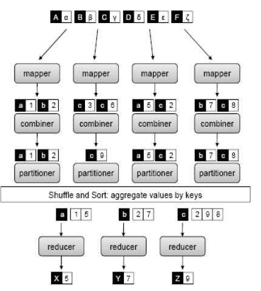

The combiner helps us to __reduce the communication__, we combine output with the same key to count the number of occurrences so we can transmit to the reducer the key but already with a combination of values.

The communication happens when we deal with reducers.

When we implement this application we want the maximum parallelism, we have to reduce each possible interaction between reducer and mappers.

Reduce task to execute each reducer, i.e., a single key and its associated value list.

Reduce task at a different compute node.

__Problems__:

-   __Overhead__ with each task we create

-   __More keys than__ there are __compute nodes available__

-   We can have __significant variation in the lengths of the value lists__ for different keys (skew --a significant difference in the amount of time each takes)

We should be careful to balance the workload for each node, otherwise we have to synchronize and wait for the longest execution of the task.

### __Parallel K-Means__

#### __Standard K-Means__
1. The algorithm arbitrarily selects k points as the initial cluster centers ("means").

2. Each point in the dataset is assigned to the closed cluster, based upon the Euclidean distance between each point and each cluster center.

3. Each cluster center is recomputed as the average of the points in that cluster.

4. Steps __2__ and __3__ repeat until the clusters converge.

Convergence may be defined differently depending upon the implementation, but it normally means that either no observations change clusters when steps 2 and 3 are repeated or that the changes do not make a material difference in the definition of the clusters.

Each node will have a chunk and we have to think at the execution in terms of map/reduce function being careful to the parallelism.

The most intensive calculation to occur is the calculation of distances. In each iteration, it would require a total of $(nk)$ distance computations where $n$ is the number of objects and $k$ is the number of clusters being created. Distance computations between different objects with centers can be concurrently executed. We work in the chunk, computing the distance in parallel, but we need the centers in the previous iteration.

__Map function__: performs the procedure of assigning each sample to the closest center

__Reduce function__: the reduce function performs the procedure of updating the new centers, exploiting what it knows from the Map function

#### __Map function__

__Input dataset__: sequence file of \<key, value\> pairs, each of which represents a record in the dataset.

The __key__ is the __offset in bytes of this record to the start point of the data file__, and the value is a string of the content of this record (features of the object).

The dataset is __split and globally broadcast to all mappers__. Consequently, the distance computations are concurrently executed.

For each map task, _PKMeans_ constructs a global variant centers which is an array containing the information about centers of the clusters.

Given the information, a mapper can __compute the closest center point for each sample__.

The intermediate values are then composed of two parts: the __index__ of the closest center point and the __sample information__.

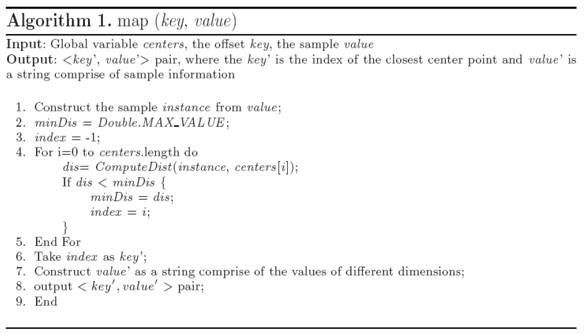

The global variable centers, offset key and sample value are given in input.

In output we have \<cluster, information relating to the single object belonging to this cluster\>.

$key' =$ __index of ther closest cluster__

$value' =$ __list of values corresponding to each feature of the object__.

#### __Combine function__

After each map task, we apply a combiner to combine the intermediate data of the same map task.

The function combines the intermediate data stored in local disk of the host.

The update of the center is obtained __averaging the points of a cluster__.

We __sum the values__ of the points assigned to the same cluster and __their number__.

It takes the output of the map function and make this aggregation for all values belonging to the same cluster, before sending that information to the reducer.

The procedure __does not require any communication__.

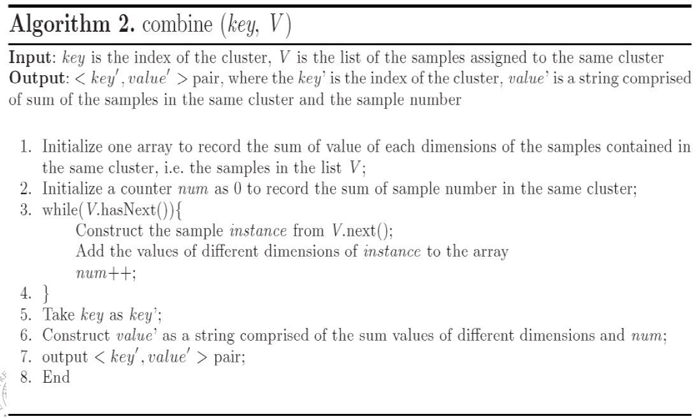

Feature by feature we sum all values of objs belonging to the same cluster and we transmit also the number of objects we consider.

In the reducer we aggregate this information summing all $V_i$ of the same cluster and dividing for the \#objs.

#### __Reduce Function__

The input of the reduce function is the data obtained from the combine function of each host.

The data includes partial sum of the samples in the same cluster and the sample number.

The reduce function:

-   __sums all the samples__ and __computes the total number of samples assigned to the same cluster__

-   __computes the new centers__ which are used for the next iteration, dividing for the number of objects in the cluster

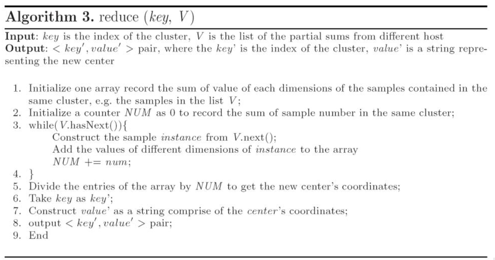

The output is the __list of centers of the clusters__.

#### __Performance Evaluation__

All mappers can be executed in parallel because we just compute the distance of the objects in the chunks and centers.

We can execute combiners in parallel, after waiting for the end of the mappers.

Reducers can be executed in parallel because related to different clusters.

The __real effort is in the computation of the distance of objs and centers__, mappers spend a lot of time while reducers are very fast.

We have the __same results as a sequential k-means__.

But we have __advantages__ in terms of __computational time__.

__Speedup__: measures how much a parallel algorithm is faster than a corresponding sequential algorithm.

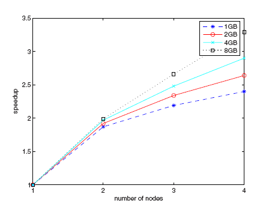

With the increase of the number of nodes we are able to increase the speed-up, obtaining a __faster execution__ than the sequential one.

We expect theoretically to have a linear increase, but we have __overhead due to the transmission of data, activation of mappers/reducers, reallocation of data structures__.

But we can appreciate to be close to the optimal solution, with 8GB of datasets especially.

When coping with large datasets we have a good improvement.

If the dataset is small the overhead weights more in terms of speed-up, because we need a short time to process the dataset and the overhead affects a lot the performance.

Another metric is the __Scaleup__: holds the number of computers in the system constant and grows the size of the datasets by the factor $m$. Sizeup measures __how much longer it takes on a given system, when the dataset size is $m$-times larger than the original dataset__.

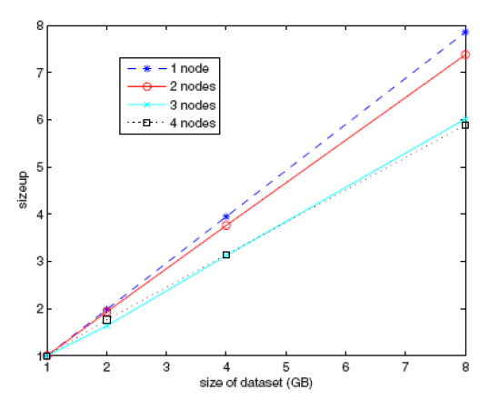

We have a reduction in time when we increase the size of the dataset, and we have available a higher number of nodes.

### __Parallel FP-Growth__ (PFP)

It shards a large-scale mining task into independent, parallel tasks. PFP then __uses MapReduce to take advantage of its recovery model__. Empirical study shows that PFP achieves __near-linear speedup__.

FP-Growth first __computes a list of frequent items sorted by frequency in descending order__ (__F-List__) during its first database scan.

In its second scan, the database is __compressed into a FP-tree__. Then FP-Growth starts to __mine the FP-tree for each item whose support is larger than minsup__ by recursively building its conditional FP-tree.

The algorithm performs __mining recursively on FP-tree__.

The problem of finding frequent itemsets is converted to __constructing and searching trees recursively__.

We use map/reduce tasks in several steps.

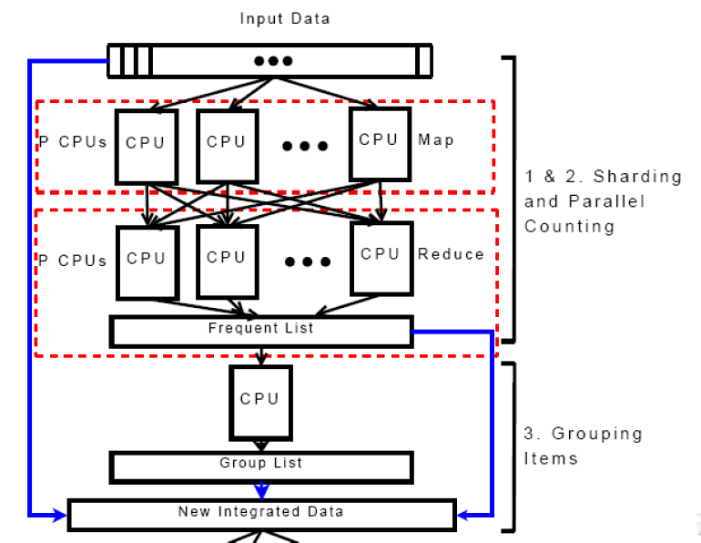

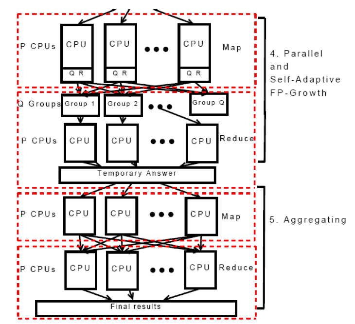

#### __Parrallel Counting__
1. __Sharding__:

    Dividing DB into successive parts and storing the parts on P 
different computers. Each part is called a shard.
2. __Parallel Counting__:
    
    Doing a MapReduce pass to count the support values of all items 
that appear in DB. Each mapper inputs one shard of DB. This step 
implicitly discovers the items’ vocabulary I, which is usually 
unknown for a huge DB. 

    The result is stored in F-list.

    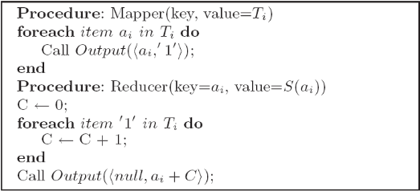

3. __Grouping Items__:

    Dividing all the |I| items on F-list into Q groups. The list of groups is called group list (G-list), where each group is given a unique group-id (gid). As F-list and G-list are both small and the time complexity is $O(|I|)$, this step can complete on a single computer in few seconds.
4. __Parallel FP-Growth__:

    - __Mapper__ – Generating group-dependent transactions: Each mapper instance is fed with a shard of DB generated in Step 1. Before it processes transactions in the shard one by one, it reads the G-list. 
    
        With the mapper algorithm, it outputs one or more key-value pairs, where each key is a group-id and its corresponding value is a generated group-dependent transaction.
    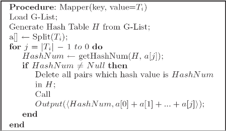
    - __Reducer__ – FP-Growth on group-dependent shards: When all mapper instances have finished their work, for each group-id, the MapReduce infrastructure automatically groups all corresponding group-dependent transactions into a shard of group-dependent transactions. 
    
        Each reducer instance is assigned to process one or more group-dependent shard one by one. For each shard, the reducer instance builds a local FP-tree and growth its conditional FP-trees recursively. During the recursive process, it may output discovered patterns.
    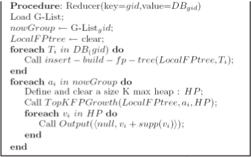

5. __Aggregating__
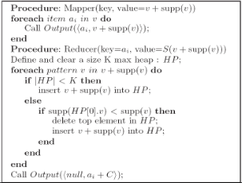
