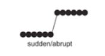
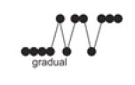
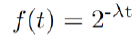
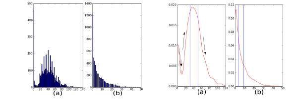
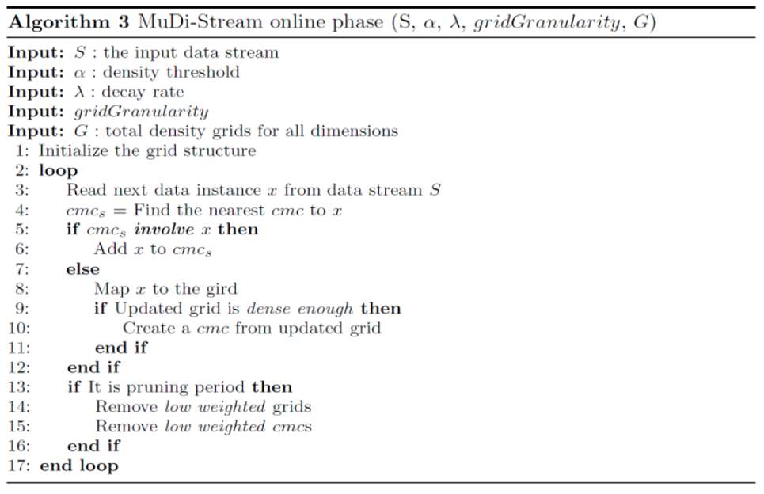

# MapReduce and Hadoop

With large datasets we need to store data in different servers.

We have these frameworks that can help us to do it.

MapReduce is a programming model Google has used to process big data.

There's the problem to distribute the filesystem and to perform distributed computations.

In this paradigm:

-   Users specify the computation in terms of a map and a reduce function, mappers and reducers are executed in parallel.

-   Underlying runtime system automatically parallelizes the computation across large-scale clusters of machines, and

-   Underlying system also handles machine failures, efficient communications, and performance issues.

Consider a large data collection:

{web, weed, green, sun, moon, land, part, web, green,...}

Problem: Count the occurrences of the different words in the collection.

The parse() analyze the collection and the count will count the occurrences of words in the collection.

We can think they work in sequence, but we can speed-up the process with a multi-thread solution.

If we just maintain a unique result table, we can write only in a lock state.

To solve this, we can create multiple parser and counters, each one having a private table. We don't have need for lock and at the end we will merge the tables.

If we have a very large data collection, we have that this data cannot be maintained in one single machine and we cannot exploit multi-threading.

Each machine will elaborate its own data collection private to the single machie.

Single machine cannot serve all the data: you need a distributed special (file) system.

File system has to be fault-tolerant, Hard disks can fail.

We exploit as solution the replication on several servers and using checksum.

If we have a fire in close servers, we may lose the data if replicas are all in that building.

Using replicas in different locations we have to deal with synchronization, but data transfer bandwidth is critical (location of data).

Critical aspects: fault tolerance + replication + load balancing, monitoring

We have to take care of load balancing because we have also computation on different servers but we need a balance on this computations, considering fast/slow tasks in fast/slow servers.

We want to exploit parallelism afforded by spitting parsing and counting.

We need an automatic solution.

In every server we will have a data collection, a parser and a counter.

Each server manages the private data collection, and we have to synchronize the tables to produce the final result.

The real advantage is that data are characterized with the Write Once Read Many (WORM) characteristics.

This is the case, because we receive data collections, and we just have to read them.

Data with WORM characteristics: yields to parallel processing;

Write-once-read-many: a file once created, written and closed need not be changed --this assumption simplifies coherency

If we change the content of the file, we need to handle the consistency updating replicas.

This file system works very well if we have one write and multiple reads.

Data without dependencies: yields to out of order processing because we can think to process concurrently and to have only in some phases some synchronization.

Parse and count can work in parallel.

Our parse is a mapping operation:

MAP: input -\> \<key, value\> pairs with value equal to 1

Our count is a reduce operation:

REDUCE receives as input \<key, value\> pairs and reduce it increasing the counter for a key producing in output \<key,value\> cumulative.

Runtime adds distribution + fault tolerance + replication + monitoring + load balancing to your base application

 

In MAP we split the data to supply multiple processors, each map read the split of the data collection and analyze if the word is present and output \<word, 1\>.

It goes in input to the reducers that increase the counter.

'combine' combine results of executions in the same server

Considering the MapReduce Programming Model, we have to:

-   determine if the problem is parallelizable and solvable using MapReduce (ex: Is the data WORM?, large data set).

-   design and implement solution as Mapper classes and Reducer class.

-   compile the source code with Hadoopcore.

-   package the code as jar executable.

-   configure the application (job) to the number of mappers and reducers (tasks), input and output streams

-   load the data (or use it on previously available data)

Mappers can be executed in parallel, reducers can be executed in parallel and the only synchronization is between mappers and reducers.

Map and Reduce are the main operations: simple code.

There are other supporting operations such as combine and partition.

All the maps should be completed before the reduce operations start.

Operations are computed where we have the data.

We have special distributed file system.

For example: HadoopDistributed File System and HadoopRuntime.

Hadoop is the framework and MapReduce is the paradigm.

It is scalable, flexible in accepting all data formats, efficient for fault-tolerance and can use commodity inexpensive hardware.

Automatic parallelization & distribution and fault-tolerance & automatic recovery are hidden from the end user that just provides two functions.

**Hadoop** is a software framework for distributed processing of large datasetsacross large clusters of computers.

-   Large datasets →Terabytes or petabytes of data

-   Large clusters →hundreds or thousands of nodes

Hadoop is open-source implementation for Google MapReduce.

Hadoop is based on a simple programming model called MapReduce.

Hadoop is based on a simple data model, any data will fit.

It has a master-slave shared-nothing architecture, used for the distributed file systems and distributed processing.

In the Master we have the filesystem and, in the slaves, we have the actual storage of data.

In the slaves we have the allocation for tasks, the real executions of tasks.

The master has a jobTracker and acts as a sort of synchronizer.

It works well if slaves do not need to share anything.

Hadoop framework consists of two main layers

-   Distributed File System (HDFS)

-   Execution engine (MapReduce), for the execution of tasks

The environment is the following:

While in local file systems we manage blocks of 2K size, in HDFS we manage 128M blocks.

This allows us to have a limited blockmap, we reduce the number of blocks to manage in the master node that contains mapping of each block with the place in which it is stored.

Each block is stored in different slaves.

HDFS is a distributed file system optimized for high throughput.

It leverages unusually large (for a file system) block sizes and use data locality optimizations to reduce network input/output (I/O).

Works very well when reading and writing large files (gigabytes and larger), because we mode large blocks.

It is scalable and reliable.

It replicates files for a configured number of times, it is tolerant of both software and hardware failures and it automatically re-replicates data blocks on nodes that have failed.

**Failure** is the norm rather than exception.

A HDFS instance may consist of thousands of server machines, each storing part of the file system's data.

Since we have huge number of components and that each component has non-trivial probability of failure means that there is always some component that is non-functional.

Detection of faults and quick, automatic recovery from them is a core architectural goal of HDFS.

**Master/slave architecture**

HDFS cluster consists of a single Namenode (master), a master server that manages the file system namespace and regulates access to files by clients.

There are a number of DataNodes (slaves) usually one per node in a cluster.

The DataNodes manage storage attached to the nodes that they run on.

HDFS exposes a file system namespace and allows user data to be stored in files.

A file is split into one or more blocks and set of blocks are stored in DataNodes.

DataNodes: serves read, write requests, performs block creation, deletion, and replication upon instruction from Namenode. Real operations are done in DataNodes but the command come from Namenodes.

**HDFS Architecture**

For each file, we have the list of blocks and where they are stored.

The client interacts directly with the NameNode, receive where blocks are present and interacts with DataNodes to retrieve the block.

When we manage the transfer from DataNodes we don't need the interaction with the NameNode.

By default, is 3 but we can increment it if we want to increase the fault tolerance.

We have an **hierarchical file system** with directories and files.

Namenode maintains the file system.

Any meta information changes to the file system recorded by the Namenode.

An application can specify the number of replicas of the file needed: replication factor of the file. This information is stored in the Namenode

HDFS is designed to store very large files across machines in a large cluster.

Each file is a sequence of blocks.

All blocks in the file except the last (depending on the size of the file) are of the same size,

Blocks are replicated for fault tolerance.

Block size and replicas are configurable per file.

The Namenode receives a Heartbeat and a BlockReport from each DataNode in the cluster.

BlockReport contains all the blocks on a Datanode.

The placement of the replicas is critical to HDFS reliability and performance.

If a node fails, we will have to find the replica from another node and give it to another new node.

Optimizing replica placement distinguishes HDFS from other distributed file systems.

Rack-aware replica placement:

Goal: improve reliability, availability and network bandwidth utilization.

Where to store replicas?

Having them in one server is easy and fast to maintain, but we have a SPOF.

Typically we have replicas in different servers in the same rack and other replicas in other locations.

Many racks, communication between racks is through switches.

If something happens in the same location we lose a lot of replicas.

Network bandwidth between machines on the same rack is greater than those in different racks.

Namenode determines the rack id for each DataNode.

Replicas are typically placed on unique racks.

This is simple but non-optimal.

Writes are expensive and replication factor is 3.

Replicas are placed: one on a node in a local rack, one on a different node in the local rack and one on a node in a different rack (possibly in a different location).

1/3 of the replica on a node, 2/3 on a rack and 1/3 distributed evenly across remaining racks.

Replica selection for READ operation: HDFS tries to minimize the bandwidth consumption and latency.

When we perform a read operation, we exploit the closer block.

We execute the code in the server which has the closest block, we don't need to move data.

If there is a replica on the Reader node then that is preferred.

HDFS cluster may span multiple data centers: replica in the local data center is preferred over the remote one.

The HDFS namespace is stored by Namenode.

Namenode uses a transaction log called the EditLog to record every change that occurs to the filesystem meta data.

EditLogis stored in the Namenode's local filesystem

Entire filesystem namespace including mapping of blocks to files and file system properties is stored in a file FsImage, stored in Namenode's local filesystem.

The Namenode keeps image of entire file system namespace and file Blockmap in memory.

4GB of local RAM is sufficient to support the above data structures that represent the huge number of files and directories.

We use large blcoksize to reduce the occupation in the main memory for the NameNode.

When the Namenode starts up it gets the FsImage and Editlog from its local file system, update FsImage with EditLog Information and then stores a copy of the FsImage on the filesystem as a checkpoint.

Periodic checkpointing is done, so that the system can recover back to the last checkpointed state in case of a crash.

Periodically FsImage is updated using the EditLog.

Primary objective of HDFS is to store data reliably in the presence of failures.

Three common failures are: Namenode failure, Datanode failure and network partition.

A **network partition** can cause a subset of Datanodes to lose connectivity with the Namenode.

Namenode detects this condition by the absence of a Heartbeat message, sent from slaves to the master.

Namenode marks Datanodes without Hearbeat and does not send any I/O requests to them.

Any data registered to the failed Datanode is not available to the HDFS.

Also, the death of a Datanode may cause replication factor of some of the blocks to fall below their specified value.

FsImage and EditLog are central data structures of HDFS.

A corruption of these files can cause a HDFS instance to be non-functional.

For this reason, a Namenode can be configured to maintain multiple copies of the FsImage and EditLog.

Multiple copies of the FsImage and EditLog files are updated synchronously.

Meta-data is not data-intensive.

The Namenode could be single point failure: automatic failover is NOT supported!

HDFS support write-once-read-many with reads at streaming speeds.

A typical block size is 64MB, a file is chopped into 64MB chunks and stored.

We move from datanodes to client and to namenode, blocks of 64MB.

**Staging**

A client request to create a file does not reach Namenode immediately.

HDFS client caches the data into a temporary file. When the data reached a HDFS block size the client contacts the Namenode.

Namenode inserts the filename into its hierarchy and allocates a data block for it.

The Namenode responds to the client with the identity of the Datanode and the destination of the replicas (Datanodes) for the block.

Then the client flushes it from its local memory directly to the Datanode.

The client sends a message that the file is closed.

Namenode proceeds to commit the file for creation operation into the persistent store.

If the Namenode dies before file is closed, the file is lost, we don't have this information in the EditLog.

This client side caching is required to avoid network congestion, because it's useless just to open the communication and send few bytes, we use the caching and when we receive the size of a block we start to send it.

**Replication Pipelining**

When the client receives response from Namenode, it flushes its block in small pieces (4K) to the first replica, that in turn copies it to the next replica and so on.

Thus data is pipelined from Datanodeto the next.

The client communicates with the namenode for the creation of the file.

The namenode allocate the file and block names and return the datanode in which it will be stored.

HDFS provides Java API for application to use, and a http browser can be used to browse the files of a HDFS instance.

HDFS organizes its data in files and directories.

It provides a command line interface called the FS shell that lets the user interact with data in the HDFS.

The syntax of the commands is similar to bash and csh.

Example: to create a directory /foodir

/bin/hadoopdfs--mkdir/foodir

There is also DFSAdmin interface available

When a file is deleted by a client, HDFS renames file to a file in be the /trash directory for a configurable amount of time.

A client can request for an undelete in this allowed time.

After the specified time the file is deleted and the space reclaimed.

When the replication factor is reduced, the Namenode selects excess replicas that can be deleted.

Next heartbeat(?) transfers this information to the Datanode that clears the blocks for use.

**Core Hadoop Components: MapReduce**

In MapReduce we have mappers and reducers, and they work very well when we have a batch-based, distributed computing framework.

It allows to parallelize work over a large amount of raw data.

Simplifies parallel processing by abstracting away the complexities involved in working with distributed systems (computational parallelization, work distribution, unreliable software, and hardware, etc.)

It decomposes work submitted by a client into small, parallelized map and reduce workers.

It uses a shared-nothing model: remove any parallel execution interdependencies that could add unwanted synchronization points or state sharing. They could limit our parallel execution.

The MapReduce master divide the job in parts, some for mappers and some for reducers.

They schedule them for remote execution on the slave node.

The role of the programmer is to define map and reduce functions.

Map functions: output key/value tuples

Reduce functions: process the key/value tuples to produce the final output

It elaborates the original file/table and process key/value pairs.

The reducer elaborates this list of key/value pairs and produces a list of other key/value pairs.

The power of MapReduce occurs in between the map output and the reduce input, in the shuffle and sort phases.

The shuffle+sort is managed using the map/reduce support and have the primary duties specified, determine the reducer for the output of the mappers and ensure that for a given reducer the input keys are sorted.

The shuffle knows that the keyword cat is elaborate by reducer 1 and so all outputs are organized to provide this keyword as input to Reducer 1, also merging possible values for the specific key(sort phase).

Shuffle and sort in MapReduce:

Map tasks and reducers tasks are typically executed in different servers.

We need to have similar mapper executions, otherwise we have to wait for the longest one.

**Physical Architecture**

RAID is discouraged on the DataNodes because HDFS has already replication, but it is strongly recommended on the NameNode.

From a network topology perspective with regards to switches and firewalls, all of the master and slave nodes must be able to open connections to each other.

For small clusters, all the hosts would run 1 GB network cards connected to a single, good-quality switch.

For larger clusters look at 10 GB top-of-rack switches that have at least multiple 1 GB uplinks to dual-central switches.

We can use commodity hardware but fast communication network.

**Hadoop Limitations**

-   **HDFS**

Lack of high availability (HA requires shared storage for NameNodemetadata, which may require expensive HA storage), inefficient handling of small files and lack of transparent compression.

-   **MapReduce**

Batch-based architecture --does not lend itself to use cases that need real-time data access

-   **Security**

Hadoop offers a security model, but by default it is disabled. Hadoop can be configured to run with Kerberos (a network authentication protocol, which requires Hadoop daemons to authenticate clients)

We need to have mappers and reducers working in parallel or we lose all our advantages we can have.

One or more chunks from a distributed file systems are given to a Map task.

Map tasks turn the chunk into a sequence of key-value pairs (the way is determined by the code of the Map function).

The key-value pairs from each Map task are collected by a master controller and sorted by key.

The keys are divided among all the Reduce tasks: all key-value pairs with the same key wind up at the same Reduce task.

The Reduce tasks work on one key at a time and combine all the values associated with that key in the way defined by the code written in the Reduce function.

The input files for a Map task consists of elements (a tuple or a document) gathered in chunks. No element is stored across two chunks.

Map function: takes an input element as its argument and produces zero or more key-value pairs.

Keys do not have to be unique: rather Map task can produce several key-value pairs with the same key.

Let's see the map task.

Example: counting the number of occurrences for each word in a collection of documents

Input file: repository of documents and each document is an element

Key: strings

Value: integer

The Map Task reads the document and breaks it into its sequence of words w1, w2, .., wn.

The output of the Map task:

We will have a pair (word, 1).

Note that a single Map task will typically process many documents --all the documents in one or more chunks. Thus, its output will be more than the sequence for the one document suggested above.

The key-value pairs are grouped by key and the values associated with each key are formed into a list of values.

Master controller process knows how many reduce tasks there will be (say r), picks a hash function that applies to keys and produces a bucket number from 0 to r-1.

Each key-value pair output from a Map task is put in one of the rlocal files. Each file is destined for one of the Reduce tasks.

Merges the files from each Map task and feeds the merged file to that process as a sequence of key-list-of-value pairs

where are all the key-value pairs with key k coming from all the Map tasks.

We have as output the key and the set of values corresponding to that key.

Considering the Reduce task, we have:

Input: key and its list of associated values

Output: sequence of zero or more key-value pairs

The Reduce task elaborates the keys and their lists of associated values generated by the grouping process

Example word count: The Reduce function simply adds up all the values.

The output of a reducer consists of the word and the sum

The output of all the Reduce tasks is a sequence of (w,m) pairs, where wis a word that appears at least once among all those documents and m is the total number of occurrences of w among all those documents.

We have a stage of combiners in which we merge the output of the single words to count how many occurrences we have.

Sometimes, a Reduce function is associative and commutative.

The reduce function can be applied within the Map tasks.

Instead of producing (w,1) (w,1) ... the Map task could produce (w,m)

Anyway, it is still necessary to do grouping and aggregation and to pass the result to the Reduce tasks

We have different chunks of the document for each mapper, we produce in output the words with the counter, we combine values considering the same word and with the partitioner and shuffle & sort, the single key is in input to the single reducer.

The combiner helps us to reduce the communication, we combine output with the same key to count the number of occurrences so we can transmit to the reducer the key but already with a combination of values.

The communication happens when we deal with reducers.

When we implement this application we want the maximum parallelism, we have to r educe each possible interaction between reducer and mappers.

Reduce task to execute each reducer, i.e., a single key and its associated value list.

Reduce task at a different compute node.

Problems:

-   Overhead with each task we create

-   More keys than there are compute nodes available

-   We can have significant variation in the lengths of the value lists for different keys (skew --a significant difference in the amount of time each takes)

We should be careful to balance the workload for each node, otherwise we have to synchronize and wait for the longest execution of the task.

**Parallel K-Means**

1.The algorithm arbitrarily selects k points as the initial cluster centers ("means").

2.Each point in the dataset is assigned to the closed cluster, based upon the Euclidean distance between each point and each cluster center.

3.Each cluster center is recomputed as the average of the points in that cluster.

4.Steps 2 and 3 repeat until the clusters converge.

Convergence may be defined differently depending upon the implementation, but it normally means that either no observations change clusters when steps 2 and 3 are repeated or that the changes do not make a material difference in the definition of the clusters.

Each node will have a chunk and we have to think at the execution in terms of map/reduce function being careful to the parallelism.

The most intensive calculation to occur is the calculation of distances. In each iteration, it would require a total of (nk) distance computations where n is the number of objects and k is the number of clusters being created. Distance computations between different objects with centers can be concurrently executed. We work in the chunk, computing the distance in parallel, but we need the centers in the previous iteration.

Map function: performs the procedure of assigning each sample to the closest center

Reduce function: the reduce function performs the procedure of updating the new centers, exploiting what it knows from the Map function

**Map function**

Input dataset: sequence file of \<key, value\> pairs, each of which represents a record in the dataset.

The key is the offset in bytes of this record to the start point of the data file, and the value is a string of the content of this record (features of the object).

The dataset is split and globally broadcast to all mappers. Consequently, the distance computations are concurrently executed.

For each map task, PKMeans constructs a global variant centers which is an array containing the information about centers of the clusters.

Given the information, a mapper can compute the closest center point for each sample.

The intermediate values are then composed of two parts: the index of the closest center point and the sample information.

The global variable centers, offset key and sample value are given in input.

In output we have \<cluster, information relating to the single object belonging to this cluster\>.

key' = index of the cluster closest

value' = list of values corresponding to each feature of the object.

**Combine function**

After each map task, we apply a combiner to combine the intermediate data of the same map task.

The function combines the intermediate data stored in local disk of the host.

The update of the center is obtained averaging the points of a cluster.

We sum the values of the points assigned to the same cluster and their number.

It takes the output of the map function and make this aggregation for all values belonging to the same cluster, before sending that information to the reducer.

The procedure does not require communications.

Feature by feature we sum all values of objs belonging to the same cluster and we transmit also the number of objects we consider.

In the reducer we aggregate this information summing all Vi of the same cluster and dividing for the \#objs.

**Reduce Function**

The input of the reduce function is the data obtained from the combine function of each host.

The data includes partial sum of the samples in the same cluster and the sample number.

The reduce function:

-   sum all the samples and compute the total number of samples assigned to the same cluster

-   compute the new centers which are used for the next iteration, dividing for the number of objects in the cluster

The output is the list of centers of the clusters.

All mappers can be executed in parallel because we just compute the distance of the objects in the chunks and centers.

We can execute combiners in parallel, after waiting for the end of the mappers.

Reducers can be executed in parallel because related to different clusters.

The real effort is in the computation of the distance of objs and centers, mappers spend a lot of time while reducers are very fast.

We have the same results as a sequential k-means.

But we have advantages in terms of computational time.

Speedup: measures how much a parallel algorithm is faster than a corresponding sequential algorithm.

With the increase of the number of nodes we are able to increase the speed-up, obtaining a faster execution than the sequential one.

We expect theoretically to have a linear increase, but we have overhead due to the transmission of data, activation of mappers/reducers, reallocation of data structures.

But we can appreciate to be close to the optimal solution, with 8GB of datasets especially.

When coping with large datasets we have a good improvement.

If the dataset is small the overhead weights more in terms of speed-up, because we need a short time to process the dataset and the overhead affects a lot the performance.

Another metric is the Scaleup: holds the number of computers in the system constant and grows the size of the datasets by the factor m. Sizeup measures how much longer it takes on a given system, when the dataset size is m-times larger than the original dataset.

We have a reduction in time when we increase the size of the dataset, and we have available a higher number of nodes.

**Parallel FP-Growth (PFP)**

It shards a large-scale mining task into independent, parallel tasks. PPF then uses MapReduce to take advantage of its recovery model. Empirical study shows that PFP achieves near-linear speedup.

FP-Growth first computes a list of frequent items sorted by frequency in descending order (F-List) during its first database scan.

In its second scan, the database is compressed into a FP-tree. Then FP-Growth starts to mine the FP-tree for each item whose support is larger than minsup by recursively building its conditional FP-tree.

The algorithm performs mining recursively on FP-tree.

The problem of finding frequent itemsets is converted to constructing and searching trees recursively.

We here have several steps in which we use map/reduce functions.

We use map/reduce tasks in several steps.

