# Data

We have different types of data sets: relational records, data matrix, numerical matrix, crosstabs (that displays the frequency distribution of the variables), document data (a term-frequency vector that displays the frequency of occurrence of terms in the document) transaction data, graph and networks, video data, temporal data, sequential data, spatial data (maps) and image data.

## Important Characteristics of Structured Data:

-   Dimensionality

-   Sparsity

-   Resolution

-   Distribution

A data object represents an entity. Data objects are described by attributes.

An attribute (feature, dimension, variable) is a data field, representing a characteristic or feature of a data object.

##  Types of attributes

Attributes can be of different types:

- __Nominal or categorical__ attributes, can have as possible values a finite number of labels.

    ```
    Hair_color = {auburn, black, blond, brown, grey, red, white}
    ```

- __Binary attributes__, which are nominal attributes with only two states and can be:

    - __symmetric binary__; both outcomes equally important (ex. Gender)

    - __asymmetric binary__: outcomes not equally important (ex. Medical test, positive can have a more important outcome, we assign 1 to it for convention)

- __Ordinal attributes__ are categorical values that have a meaningful order but magnitude between successive values is not known.

    ```
    Size = { small, medium, large }
    ```

    > In computing the distance in ordinal attributes it is possible to create a graduation, different than nominal attributes.

- Quantity, integer or real-valued, that can be:

    -   Interval, measured on a scale of equal-size units. Values have order. There's no zero point and that implies that division makes no sense. e.g. temperature in C° or F°, calendar dates.

    -   Ratio, they have a zero point and it is possible to perform division.

Another difference is in:

- __discrete attributes__, that have only a finite or countably infinite set of values.

- __continuous attributes__, that has real numbers as attribute values.

## Basic Statistical Descriptions of Data

We can describe in a statistical way our data and visualize the distribution of data to better understand the data, and see if we have some central tendency, some variation and spread.

If we can see similar attributes we can eliminate one of them because it's not relevant in the data mining process.

We have different data dispersion characteristics: median, max, min, quantiles, outliers, variance, etc.

In a summarized way we can see the statistics with the box plot or quantile analysis.

## Measuring the central tendency

- To measure the central tendency we usually use the __mean__, which algebraic definition is:

    $$ 
        \bar{x} = \frac{1}{N} \sum_{i=1}^{N}x_i 
    $$

    where $N$ is sample size.

    This is the mean along a singole attribute.

- the __weighted arithmetic mean__ where we associate a weight to a specific value:

    $$
        \bar{x} = \frac{\sum_{i=1}^{N}w_ix_i}{\sum_{i=1}^{N}w_i}
    $$

- we also have the **trimmed mean**, obtained by chopping out extreme values (for instance the top and bottom 2% before computing the mean, they're outliers).

### median

Another statistic value is the **median**, which is the middle value if odd number of values, or average of the middle two values otherwise.

> It is an holistic measure: it must be computed on the entire dataset as a whole.

It can be heavy from a computational point of view, so sometimes it is estimated by interpolation (for grouped data).

The estimation can be computed in this way:

$$
    median = L_1 + \left(\frac{\frac{N}{2}-\sum{freq_i}}{freq_{median}}\right) width
$$

- $L_1 :=$ lower boundary of the median interval, that is the interval where we expect to have the median value.

- $freq_{median}:=$ is the frequency of the median interval

- $N$ the number of values in each interval on the x-axis.

#### procedure

We first identify the interval in which the median value is located by subtracting the total number of values before this interval from N/2.

Then, we divide this result by the frequency of values in the median interval.

This estimation is based on the assumption that the values within the median interval are uniformly distributed.

### mode

Another statistical value to measure the central tendency is the **mode**, the value that occurs most frequently in the data. It can be unimodal, bimodal or trimodal.

The empirical formula is :

$$
    mean - mode = 3 \times (mean - median)
$$

### usage

Using mean, median and mode we can see something about the distribution of data, we can say if it is symmetric or positively/negative skewed.

Watching their order we can see if their distribution is symmetric or skewed.

|positively skewed|symmetric|negatively skewed|
|-|-|-|
|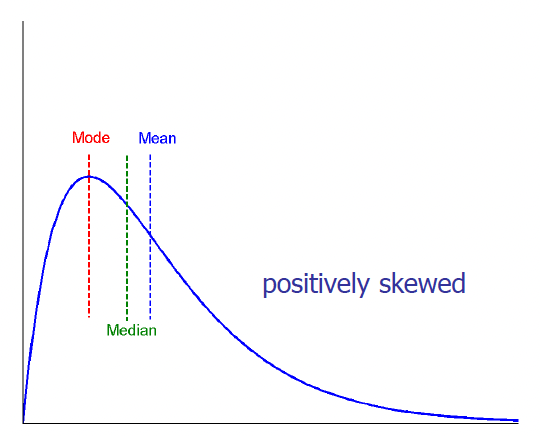|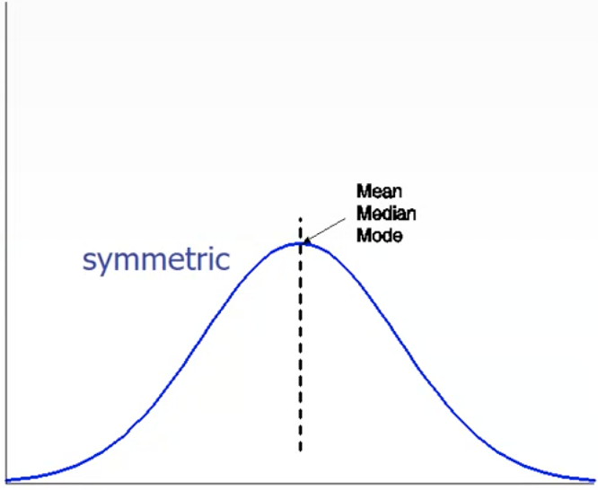||

## Measuring the Dispersion of Data

### Quartiles

Quantiles are a way to measure the dispersion of data. 

The k-th percentile, such as:

- the 25th percentile (Q1) 

- 75th percentile (Q3) 

- 50th percentile (median) 

are used to divide a set of data into equal groups. 

The Interquartile Range (IQR) is calculated as the difference between the third and first quartile (Q3 - Q1) and represents the range in which 50% of the data falls.

### Boxplot analysis

These quartiles are useful because they allow us to represents the distribution of data with boxplots.

They are a visual representation of the distribution of data and in this we exploit the five number summary of a distribution: Minimum, Q1, Median, Q3, Maximum.

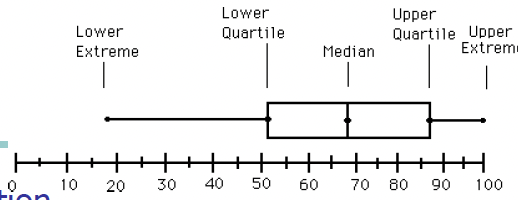

- $IQR:=$ height

- $Whiskers:=$ (the two lines) are the minimun and the maximum

#### outliers

We sometimes have marked points in the representation which are __outliers__, points beyond a specified outlier threshold, plotted individually (usually, a value higher/lower than 1.5 x IQR).

#### Boxplots allow us to compare distributions.


- The second distribution is very concentrated, we can imagine it with a peak.

- The third is more sparse.

- The median value of the third box plot is higher than the second's.


### standard deviation

To measure the dispersion of data we can also use variance and standard deviation.

$$
    Standard deviation := \sigma 
$$

$$
    Variance := \sigma^2 := \frac{1}{N}\sum{x_i -\bar{x}}^2 
$$

## Graphic displays of basic statistical descriptions

We have different graphic displays of basic statistical descriptions:

- __Boxplot__ : graphic display of five number summary

- __Histogram__ : x axis are values, y axis represents frequencies os that values

- __Quantile plot__ : each value xi is paired with fi indicating that approximately 100 fi % of data are lower than or equal to xi (\<= xi)

-   __Quantile quantile (q-q) plot__ : graphs the quantiles of one univariant distribution against the corresponding quantiles of another

-   __Scatter plot__ : each pair of values is a pair of coordinates and plotted as points in the plane

### Histogram Analysis

The Histogram is a graph display of tabulated frequencies, shown as bars.

x axis are values, y axis represents frequencies os that values.

It shows what proportion of cases fall into each of several categories.

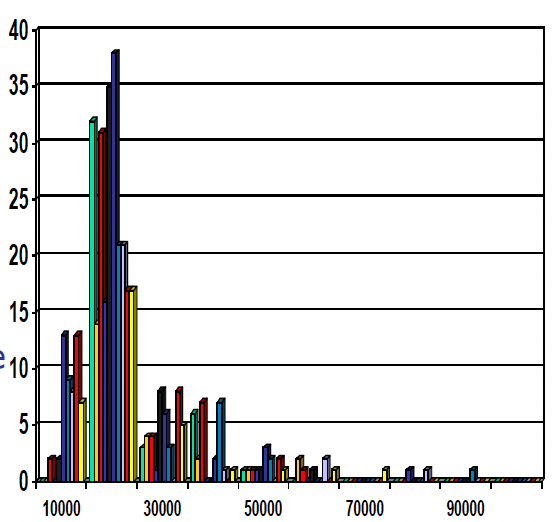

Differs from a bar chart in that it is the area of the bar that denotes the value, the frequency corresponding to that interval, not the height as in bar charts, a crucial distinction when the categories are not of uniform width.

If we use the same width, the height corresponds to the value.

The categories are usually specified as non overlapping intervals of some variable. The categories (bars)must be adjacent.

Two distributions may have the same boxplot representation, because they have same values for: min, Q1, median, Q3, max, but they have rather different data distributions.

Histograms often tell more than boxplots.

### Quantile plot

A quantile plot is a graph that shows the distribution of a dataset by plotting quantiles against an axis. 

The x-axis typically represents the quantiles of the data, while the y-axis represents the corresponding observations.


### Quantile-Quantile (Q-Q) Plot

A Quantile-Quantile (Q-Q) plot is a type of quantile plot that compares two probability distributions by plotting their quantiles against each other. It is used to check for similarity between two datasets. It is also known as a probability plot.

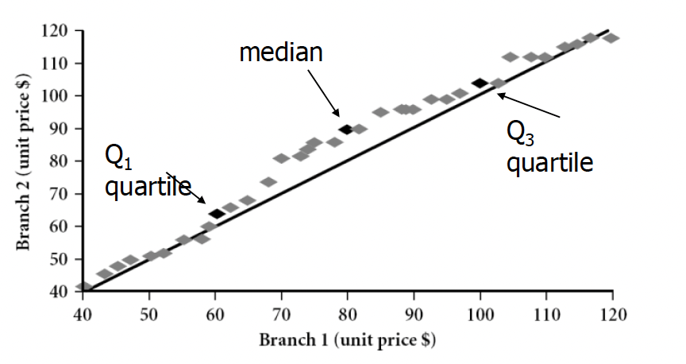

### Scatter Plot

The scatter plot provides a first look at bivariate data to see clusters of points, outliers, etc. The point will be displayed with two features. Each pair of values is treated as a pair of coordinates and plotted as points in the plane.

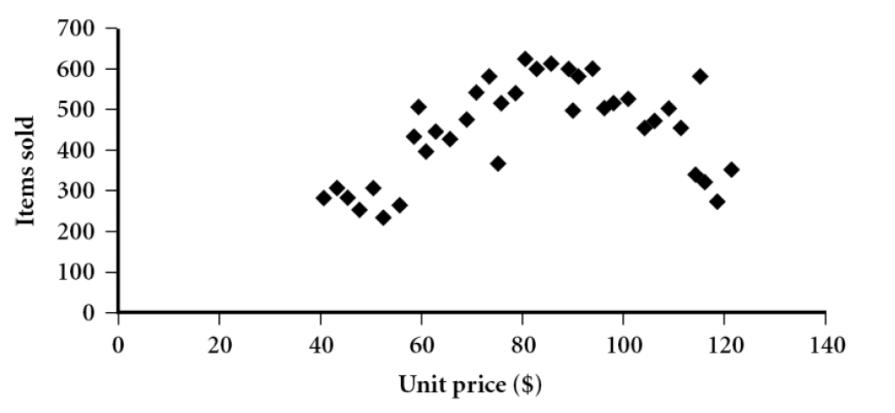

We can deduce some conclusion about the scatter plot, the two variables are positively correlated if we can see scatters like this,

|positively correlated|negatively correlated
|-|-|
|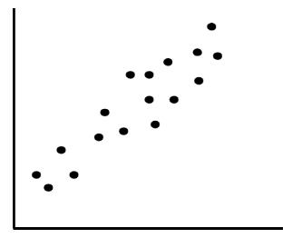|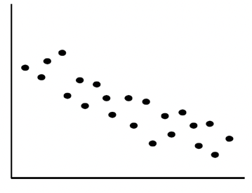|

|non-linear|uncorrelated|
|-|-|
|| |

## Data Visualization

It's important to show in a proper way the results we obtain to:

- gain insight into an information space

- provide qualitative overview of large data sets

- search for patterns, trends, structure, irregularities, relationships among data, 

- help find interesting regions and suitable parameters for further quantitative analysis

- provide a visual proof of computer representations derived from data

If we have only 2 or 3 dimensions is easy to visualize the data but if we have more than 3 dimensions it's really complex.

### Categorization of visualization methods:

- [Pixel oriented](#pixel-oriented-visualization-techniques)

- Geometric projection

- Icon based

- Hierarchical

- Visualizing complex data and relations

### Pixel-Oriented Visualization Techniques

For a data set of $m$ dimensions, create $m$ windows on the screen, one for each dimension. The m dimension values of a record are mapped to m pixels at the corresponding positions in the windows.

Each pixel corresponds to an object and on each window we see the value for each attribute.

The colors of the pixels reflect the corresponding values; if the color corresponds to white the value is lower, otherwise it's greater.

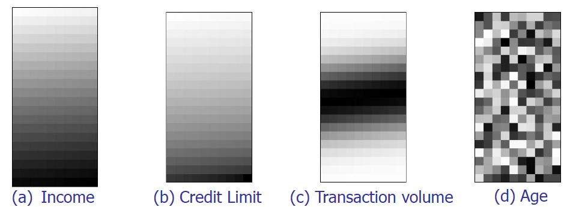

Income and age are not correlated, while income and credit limit have a strong correlation.

### Geometric Projection Visualization Techniques

These are visualization of geometric transformations and projections of the data.

### Scatterplot and scatterplot matrices

We generate a matrix where we consider one attribute in the row of the matrix and we compare it with all others that correspond with the columns of the matrix.

The matrix is symmetric and in the diagonal we're comparing the same attributed so we have lines.

With an high number of attributes this matrix is really complex to analyze.


## Parallel Coordinates

In Parallel Coordinates we have $n$ equidistant axes which are parallel to one of the screen axes and correspond to the attributes.

Every data item corresponds to a polygonal line which intersects each of the axes at the point which corresponds to the value for the attribute.

The axes are scaled to the $[minimum, maximum]$: range of the corresponding attribute.


Depending on the dispersion of these polygonal lines we can understand a lot.

### Icon-based Visualization Techniques

Typical visualization methods are Chernoff Faces and Stick Figures.

General techniques are:

- __Shape coding__ : Use shape to represent certain information encoding

- __Color icons__ : Use color icons to encode more information

- __Tile bars__ : Use small icons to represent the relevant feature vectors in document retrieval

#### Chernoff Faces

It's a way to display variables on a two-dimensional surface, e.g., let x be eyebrow slant, y be eye size, z be nose length, etc.


#### Stick Figure

It's a very simple type of drawing made of lines and dots, often of the human form or other animals. 

Two attributes of the data are mapped to the display axes and the remaining attributes are mapped to the angle and/or length of the limbs and texture patterns in the visualization how certain data characteristics.


#### Tile Bar

uses rectangles corresponding to documents.

The query is specified in terms of k topics, one topic per line, called term sets.

Columns in rectangles correspond to document segments.

A square corresponds to a specific term set in a specific text segment.

The darkness of a square indicates the frequency of terms in the segment from the corresponding TermSet. If the color is white the frequency is zero, while, if it's dark we have an high frequency.


### Hierarchical Visualization Techniques

Visualization of the data using a hierarchical partitioning into subspaces. We have different methods.

#### Dimensional Stacking

Partitioning of the n-dimensional attribute space in 2-D subspaces, which are 'stacked' into each other.

Partitioning of the attribute value ranges into classes. The important attributes should be used on the outer levels.

Adequate for data with ordinal attributes of low cardinality, but difficult to display more than nine dimensions.

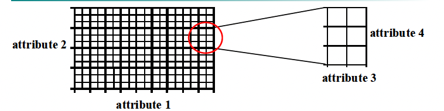

The idea is to start with the most important attribute and just split the attribute value ranges, identified by bold lines, and inside bold rectangles and doing the same with attribute 2 we have two more attributes inside. The same with the ones inside.

For example the circled one has the highest value for attribute 1, almost the middle value for attribute 2 and then we can go inside and continue the stack.


This is an example of visualization with longitude and latitude mapped to the outer x-, y-axes and ore grade and depth mapped to the inner x-, y-axes.

#### Tree-Map

This is another hierarchical approach and uses a hierarchical partitioning of the screen into regions depending on the attribute values.

The x and y dimension of the screen are partitioned alternately according to the attribute values classes.

The area represents the portion we have. Example: an overview of the organization of file and directory


#### InfoCube

This is a 3D visualization technique where hierarchical information is displayed as nested semi-transparent cubes.

The outermost cubes correspond to the top level data, while the sub-nodes or the lower level data are represented as smaller cubes inside the outermost cubes, and so on.

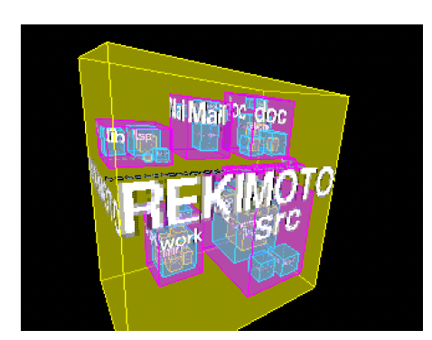

#### Tag Cloud

With non-numerical data, for example text and social networks, we usually use tag cloud.

Depending on the size and color of this tag we can express the frequency of the tag in the document.


## Measuring Data Similarity and Dissimilarity

- __Similarity__ is a numerical measure of how alike two data objects are.

    Value is higher when objects are more alike and often falls in the range \[0,1\].

- __Dissimilarity__ (e.g., distance) is a numerical measure of how different two data objects are.

    The value is lower when objects are more alike.

    Minimum dissimilarity is often 0, while upper limit varies. Distance has like un unlimited maximum value.

- __Proximity__ refers to a similarity or dissimilarity.

    Data could be represented with objects with several features.

### From the data matrix...

The matrix is called **data matrix** and it is composed by n data points with p dimensions.

| <!-- -->  | <!-- -->      |<!-- -->       |<!-- -->   |<!-- -->   |
|-          |-              |-              |-          |-          |
|$x_{11}$   |               |$\dots$        |           |$x_{1p}$   |
|$\vdots$   |               |$\ddots$       |           |$\vdots$   |
|$x_{n1}$   |               |$\dots$        |           |$x_{np}$   |

### ...to the dissimilarity matrix

In a dissimilarity matrix, each cell in the matrix represents the dissimilarity between the two objects corresponding to the row and column of that cell. 

The matrix is symmetric. Additionally, the diagonal of the matrix is filled with 0s as the dissimilarity between an object and itself is always 0.

| <!-- -->  | <!-- -->  |<!-- -->   |<!-- -->   |<!-- -->   |
|-          |-          |-          |-          |-          |
|0          |           |           |           |           |
|$d(2,1)$   |0          |           |           |           |
|$\vdots$   |$\vdots$   |0          |           |           |
|$d(n,1)$   |$d(n,2)$   |$\dots$    |$\dots$    |0          |

It's easy to compute distance with objects represented by numerical attributes.

We also have to be able to measure proximity for nominal attributes.

### dissimilarity matrix for nominal attributes

Nominal attributes can take 2 or more states, without any order.

- __simple matching__

    > Let’s suppose that $p$ is the total number of attributes and $m$ is the number of matches
    $$
        d(i,j) = \frac{p-m}{p}
    $$

    If we don't have matches the distance is always 1, when we have all matches is 0.

- A second method is to __use many binary attributes__ instead of nominal attributes. The number used will be the number of levels of the nominal attributes.

    ```py
    # object described by eye color and hair color

    eyeColor = {"black", "green", "blue"}
    hairColor = {"auburn", "black", ...}

    i = {"eyeBlack", "eyeGreen", "eyeBlue", "hairAuburn", "hairBlack" ...}
    ```

    Then we apply the distance between objects represented by binary attributes.

- You can __use integers__, but you have to be use to not use the integer distance, because it doesn't mean 0 is close to 1 if you assign integers randomly.

    But now we must define how to compute the distance between objects with binary attributes.

    When we have to do with binary attributes, we usually use a **contingency table**, we have two objects, I and j, described with p binary attributes.

    |               ||$object \ j$  |       |       |
    |          -    |-      |-      |-      | -     |
    |               |       |1      |0      |sum    |
    |               |1      |q      |r      |q+r    |
    |$object \ i$   |0      |s      |t      |s+t    |
    |               |sum    |q+s    |r+t    |p      |
    
    Label q is the number of attributes in which we have 1 in the object I and the object j. It is the number of matches of value 1. R represents the number of attributes in which I has value 1 and j has value 0.

    S represents the number of attributes in which I has value 0 and j has value 1.

    T represents the number of attributes in which I and j has value 0.

    If objects are equal the matrix has to be diagonal.

### Distance measure for symmetric binary variables

$$
    d(i,j) = \frac{r+s}{q+r+s+t}
$$

A binary variable is symmetric if both of its states are equally valuable and carry the same weight, if 0s and 1s are frequently equal, the probability to have them is the same.

The numerator of this ratio contains the number of attributes in which we have different values for binary attributes. It is higher more the two objects are distant.

### Distance measure for asymmetric binary variables:

$$
    d(i,j) = \frac{r+s}{q+r+s}
$$

In this case we have that a value is more probably than another value.

T represents the number of attributes in which we have in I and j value 0, but this is the most probably value, so the probability of t is very high.

In case of asymmetric binary value is very high I respect of q, r and s.

The distance could be very small if we use t and we avoid this phenomenon not considering t.

### Jaccard coefficient

a meause for symmetric binary variables

$$
    sim_{Jaccard}(i,j) = \frac{q}{q+r+s}
$$

This is the same as __coherence__, that can be calculated in this way.

The support on I and j is the number of attributes in I and j in which we have value 1, and the same for other supports.

$$
    coherence(i,j) = \frac{sup(i,j)}{sup(i)+sup(j)-sup(i,j)} = \frac{q}{(q+r)+(q+s)-q}
$$

For example:

|Name   |Gender |Fever  |Cough  |Test-1 |Test-2 |Test-3 |Test-4 |
|-      |-      |-      |-      |-      |-      |-      |-      |
|Jack   |M      |Y      |N      |P      |N      |N      |N      |
|Mary   |F      |Y      |N      |P      |N      |P      |N      |
|Jim    |M      |Y      |P      |N      |N      |N      |N      |

Gender is a symmetric attribute, and the remaining attributes are asymmetric binary. Let the values Y and P be 1, and the value N be 0 (use only asymmetric values). We don't consider t.

$$
    D(Jack, Mary) = \frac{0+1}{2+0+1} = 0.33
$$

$$
    D(Jack, Jim) = \frac{1+1}{1+1+1} = 0.67
$$

$$
    D(Jack, Mary) = \frac{1+2}{1+1+2} = 0.75     
$$

## Standardizing Numeric Data

Before computing dissimilarity between numerical data we sometimes try to normalize data. We would like the attributes to vary between similar intervals.

### Euclidean distance (L2 norm) is defined like:

$$
    d(i,j) = \sqrt{(x_{i1}-x_{j1})^2 + \dots (x_{iN}-x_{jN})^2}
$$

It can be applied only on numerical data.

If one feature is in a large interval it will dominate others in the computation of the Euclidian distance.

### The z-score

$$
    z = \frac{x-\mu}{\sigma}
$$

- $x:=$ raw score to be standardized

- $\mu:=$ mean of the population

- $\sigma:=$ standard deviation

We subtract the mean value and we divide by the standard deviation, so that if data is dispersed the standard deviation is large.

It is negative when the raw score is below the mean, "+" when above

### mean absolute deviation

$$
    s_f = \frac{1}{N}(|x_{1f} - m_f| + |x_{2f} - m_f| + \dots + |x_{Nf} - m_f|) 
$$

$$
    m_f = \frac{1}{N} (x_{1f} + \dots + x_{Nf})    
$$

And in that case we calculate the standardized measure (z-score):


$$
    z_f = \frac{x_{if}-m_f}{s_f}
$$

> Using mean absolute deviation is more robust to outliers than using standard deviation.

### Minkowski distance

$$
    d(i,j) = \sqrt[h]{(x_{i1}-x_{j1})^h + \dots (x_{iN}-x_{jN})^h}
$$

Properties:

- $d(i,j) \gt 0$ if $i \neq j$, and $d(i,i) = 0$ (Positive definiteness)

- $d(i,j) = d(j,i)$ (Simmetry)

- $d(i,j) \geq d(i, k) + d(k, j)$ (Triangle Inequality)

A distance that satisfies these properties is a metric from a mathematical point of view.

From it we can derive the 

- __Manhattan distance__ with $h = 1$ (L1 norm):

- __Euclidean distance__ with $h = 2$ (L2 norm):

- __Supremum distance__ with $h \to \infty$ (Lmax norm):


Taking the following example we can see that values change but the relations remain similar.


### Ordinal variables

An __ordinal variable__ is similar to a categorical variable. The difference between the two is that there is a clear ordering of the variables.

```
    { small, medium, large } = { 1 , 2 , 3 }
```

It can be treated like interval scaled.

-  we replace each value $x_{if}$ with their rank

-  map the range of each variable onto $[0, 1]$ by replacing $i-th$ object in the $f-th$ variable by

$$
    z_{if} = \frac{r_{if}-1}{M_f-1}
$$

where $M_f$ is the maximum number of rank levels.

```
{ small, medium, large } = { 0 , 0.5 , 1 }
```

And now we can compute the dissimilarity using methods for interval scaled variable. 

### Attributes of Mixed Type

We discussed how to compute the dissimilarity between objects described by attributes of the same type, where these types may be either *nominal*, *sym- metric binary, asymmetric binary*, *numeric*, or *ordinal*. However, in many real databases, objects are described by a *mixture* of attribute types.

One approach to compute the dissimilarity between objects of mixed attribute types is to group each type of attribute together, performing separate data mining.

However, in real applications, it is unlikely that a separate analysis per attribute type will generate compatible results.

A more preferable approach is to process all attribute types together, performing a single analysis. 

Bringing all of the meaningful attributes onto a common scale of the interval $[0.0, 1.0]$.

- Suppose that the data set contains $N$ attributes of mixed type. 

- The dissimilarity $d(i,j)$ between objects is defined as:

$$
    d(i,j) = \frac{\sum_{f=1}^N \delta_{ij}{(f)} \delta_{ij}{(f)}}{\sum_{f=1}^N \delta_{ij}{(f)}}
$$

where the indicator $\delta_{ij}^{(N)} = 0$ if:

- $x_{if}$ or $x_{jf}$ is missing or

- $x_{if} = x_{jf} = 0$ and attribute $f$ is asymmetric binary

otherwise $\delta_{ij}^{(N)} = 1$


### Cosine similarity

$$
    cos(d_1, d_2) = \frac{d_1 \cdot d_2}{||d_1|| \ ||d_2||} 
$$

ex:

```js

d1 = [5,0,3,0,2,0,0,2,0,0]
d2 = [3,0,2,0,1,1,0,1,0,1]

d1 * d2 = 25
||d1|| = 6.481 
||d2|| = 4.12

cos(d1, d2) = 0.94

```
