# Preprocessing

Measures for __data quality__: A multidimensional view

1.   Accuracy: correct or wrong, accurate or not

2.  Completeness: not recorded, unavailable, \...

3.   Consistency: some modified but some not, dangling, ....

-   Timeliness: timely update?

-   Believability: how trustable the data are correct?

-   Interpretability: how easily the data can be understood? 

Major Tasks in __Data Preprocessing__ are:

-   __Data cleaning__: fill in missing values, smooth noisy data, identify or remove outliers, and resolve inconsistencies

-   __Data integration__: integration of multiple sources of data to create a unique dataset.

-   __Data reduction__: reduce the size of data set and the number of dimensions without jeopardizing the data mining results?

    -   __Dimensionality reduction__: data encoding schemes are applied to obtain a compressed representation of the original data. It can be done with different techniques, like Compression techniques, Attribute subset selection or Attribute construction.

    -   __Numerosity reduction__: smaller representations using parametric models (regression models) or nonparametric models (cluster, sampling, ecc.) Reducing the number of objects helps us to reduce the complexity of the problem and speed-up the execution.

-   __Data transformation and data discretization__: Data transformation includes normalization to make attributes value vary on the same interval.Discretizion is needed to transform a numerical value into a nominal value for applying some algorithms proposed in the lecterature. e.g. Age

## Data Cleaning

Data in real world is dirty.

- __Incompleteness__: some values are missing. If we compute a distance with a missing value, the calculation is not reliable, we have a random value.

- __Noise__: containing noise, errors, outlier. For example signals generated by sensor affected by noise. We get a signal with a ripple.

- __Inconsistency__: In some datasets we can have inconsistency, for example we can have an age attribute that is not consistent with the birthday value.

- __Intentional__: we can also have intentional missing data.

### Missing data

For handling __missing data__ we can:

- __ignore the tuple__. This solution is possible only if the % of missing values per attributes is low.

- __fill the missing values manually__, but not possible if you have a big amount of data.

- __fill in it automatically__ with:

    - a global constant, e.g. unknown
    - the attribute mean of all samples
    - the attribute mean for all samples belonging to the same class used when we have to work with classification.
    - the most probable value: to get this, one approach is to infers the missing value.

> But in any case, we need to handle the missing value.

### Noise

Another problem is __noise__: random error or variance in a measured variable. The noise affects the result we can produce with our model, so we have to work with it.

We need to be careful to not remove information when applying techniques.

### Smoothing filters

It performs a smoothing action to the signal. With smoothing the data points of a signal are modified so that individual points that are higher than the immediately adjacent points (presumably because of noise) are reduced, and points that are lower than the adjacent points are increased.

The most popular smoothing algorithm is the __rectangular or unweighted sliding-average smooth__.

We replace each point in the signal with the average of $m$ adjacent points, where $m$ is a positive integer called the smooth width. 

ex:

$$
    S_j = \frac{Y_{j-1}+Y_{j}Y_{j+1}}{3}
$$

We can use another value and the value of the width affects the result. If I consider a very high width, we have a big smooth but the signal becomes flatter, we may change the information in the signal even if we eliminate the noise.

|original|11 points moving| 51 points|
|-|-|-|
||||

#### considerations

- With 11 we consider 5 points in the left and 5 on the right and the function is smoothed. A first consideration is that we are considering that the signal's frequency is lower of the noise.

- we have to be careful to the width of the rectangular filter.

- if the underlying function is a constant, or is changing linearly with time (increasing or decreasing), then no bias is introduced into the result. A bias is introduced, however, if the underlying function has a nonzero second derivative. At a local maximum, for example, moving window averaging always reduces the function value.

### Savitzky-Golay Smoothing Filter

That is a generalization of the rectangular filter. Instead of using a constant as we made with the rectangular filter we use coefficients.

In general, the simplest type of digital filter (the non-recursive or finite impulse response filter) replaces each data value $Y_j$ by a linear combination $S_j$ of itself and some number of nearby neighbors

$$
    S_j = \sum_{n=-n_L}^{n_R}{c_n Y_{j+n}}
$$

where $_L$ is the number of points used "to the left" of a data point i, i.e., earlier than it, while $n_R$ is the number used to the right, i.e., later.

We compute this weighted sum where n is negative or positive depending on the samples we are considering.

We consider some samples of the right and some on the right and compute this linear combination.If you replace every coefficient with the following, we get exactly the rectangular filter.

$$
    c_n = \frac{1}{n_L + n_R + 1}
$$

where $n_L$ is the number of points used "to the left" of a data point i, i.e., earlier than it, while $n_R$ is the number used to the right, i.e., later.

Using a generic $c_n$ gives us more flexibility.

##### Diffences between Savitzky-Golay and rectangular filters

With the rectangular filter samples inside the window are approximated using a line parallel to the horizontal line.

With the Savitzky-Golay approach we don't use a line but a polynomial function. Inside the window we consider a more complex function.

The idea of Savitzky-Golay filtering is to find filter coefficients cn to approximate the underlying function within the moving window not by a constant (whose estimate is the average), but by a polynomial of higher order, typically quadratic or quartic.

#### How can we estimate $c_n$ considering the function we selected?

A typical approach is to apply a __least-square method__, in which we define the function that approximates better the points inside the window.

It's computational heavy to compute for each sample the least-square to find the approximation function.

We have to work in real-time because we receive samples and we have to apply it. We don't have much time to apply the smoothing filters.

But Savitzky-Golay demonstrated that __there's no need to compute the least-square for each sample__ but __coefficients can be computed offline__.

For each point $Y_i$, we least-squares fit a polynomial to all $n_L +n_R + 1$ points in the moving window, and then set $S_i$ to be the value of that polynomial at position $i$.

In the original paper we can find this table:


In this table we see that once fixed $M$ (the degree of the polynomial) $n_L$ and $n_R$, we have the coefficients to be used in the formula.

We just pick up coefficients and apply the filter.


##### results

- this filter reduces the height of the peak.

- the width we use in the window is lower than the width in peak in the first case. In the second case the width of the window is approximately the same as the width of the peak.

- we need to decide the width of the window dependently on the width of the peak.

In the second sample the height is not reduced because we don't use an approximation with a line like in the first example, but we use polynomial and that means we can approximate more the samples inside.

But we have more ripple inside the signal.

The larger the smooth width, the greater the noise reduction, but also the greater the possibility that the signal will be distorted by the smoothing operation.

The optimum choice of smooth width depends upon the width and shape of the signal and the digitization interval.

##### smoothing ratio

For peak-type signals, the critical factor is the *smoothing ratio*, the ratio between the smooth width and the number of points in the half-width of the peak. In general, increasing the smoothing ratio improves the signal-to-noise ratio but causes a reduction in amplitude and an increase in the bandwidth of the peak.

- ex:

    

    We can apply the smoothing filter with a width of 7, where we have a reduction of the noise but the height of the peak is reduced and it is larger.

    We can see that if the ratio increases the amplitude of the peak decreases and the width of the peak increase.

    In general, if the objective of the measurement is to measure the true peak height and width, then smooth ratios below 0.2 should be used.

    While, if the objective of the measurement is to measure the peak position (x-axis value of the peak), much larger smoothing ratios can be employed if desired, because smoothing has no effect at all on the peak position (unless the increase in peak width is so much that it causes adjacent peaks to overlap).

    The position of the peak does not change in fact.

#### When should you smooth a signal?

1. for cosmetic reasons, to prepare a nicer-looking graphic of a signal for visual inspection or publication.

2. if the signal will be subsequently processed by an algorithm that would be adversely affected by the presence of too much high-frequency noise in the signal

    > We need to be careful when we have some peaks.

3. In outlier detection it can be used to remove outliers and let them become normal points.

#### When should NOT you smooth a signal?

1. Smoothing will not significantly improve the accuracy of parameter measurement by least-squares measurements between separate independent signal samples

2. All smoothing algorithms are at least slightly _lossy_, entailing some change in signal shape and amplitude

3. It is harder to evaluate the fit by inspecting the residuals if the data are smoothed, because smoothed noise may be mistaken for an actual signal

4. Smoothing the signal will seriously underestimate the parameters errors predicted by propagation-of-error calculations and the bootstrap method.

#### Binning

Another way to handle noisy data is to use another technique which is __binning__.

It consists in smooth a sorted data value by consulting its neighborhood.

We have to first sort data eand partition into (equal-frequency) bins, intervals with the same number of values, then one can smooth by bin means, smooth by bin median, smooth by bin boundaries, etc.

```py

Sorted_data_for_price = [4,8,15,21,21,24,25,28,34]

## Partition into (equal frequency) bins:
bin_1: [4,8,15]
bin_2: [21,21,24]
bin_3: [25,28,34]

## Smoothing by bin means:
bin_1: [9,9,9]
bin_1: [22,22,22]
bin_1: [29,29,29]

## Smoothing by bin boundaries:
bin_1: [4,4,15]
bin_2: [21,21,24]
bin_3: [25,25,34]
```

By using bin boundaries, we approximate values to the closest boundary.

The effect we obtain is like the effect of smoothing.

### Other smoothing techniques

- __Regression__: smooth by fitting the data into regression functions. Re replace the original values with values along the line that approximate these values.
    -   Linear regression (two attributes)
    -   Multiple linear regression (multiple attributes)
- __Clustering__, but we need to first detect and remove outliers because if they get inside clusters they can change dramatically the result. We need to apply clustering imposing constraints.


Today most of the data are collected with sensors and it's important to approach the noise reduction. 

We assume that our signal is characterized by a low frequency and our noise by a high frequency and that's why we can use smoothing filters.

## Data cleaning as a process

Tipically we have different sources of data and some of them are real databases.

We have to clean data otherwise using machine learning techniques we find ourself in trouble, otherwise we have strange results and we don't know the reason.

#### Detect discrepancies in the data 

- __metadata__, that describe the domain, the range, the dependency and the distribution of the data. We can associate at the value of the attribute these information, in this way we can analyze if we have some values that do not correspond to the domain, for example.

- __check field overloading__, performed by using one of the bits in the representation to get information about other bits. It typically results when developers squeeze new attribute definitions into unused portions of already defined attributes.

- __check__ some rules:
    - *uniqueness rules*, where each value of a given attribute must be different from all other values for that attribute
    - *consecutive rules*, where there can be no missing values between the lowest and the highest values
    - *null rule,* that specifies the use of blanks, question mark, and so on.

We typically have commercial tools:

- Data scrubbing: use simple domain knowledge (e.g., postal code, spell-check) to detect errors and make corrections

- Data auditing: by analyzing data to discover rules and relationship to detect violators (e.g., correlation and clustering to find outliers)

### Data migration and integration

When we have to integrate different sources of data to create a data warehouse, that try to describe the data is organized in such a way to perform operations efficiently in data.


To create this data warehouse we typically use __ETL__ (Extraction/Transformation/Loading) tools, that allow users to specify transformations through a graphical user interface.

- __Extraction__: data is extracted from the source system into the staging area. Transformations if any are done in staging area so that performance of source system in not degraded. We have the need to extract data from the DB when the it is still functional, we can not stop it.

- __Transformation__: Data extracted from source server is raw and not usable in its original form. Therefore it needs to be cleansed, mapped and transformed.

    An example of possible data integration is the following:

    

    __Data integrations problems__

    We can have same data with different names, different data with same name, data only found in a place and different keys for data.

    Some possible data integrity problems

    1. Different spelling of the same person like Jon, John, etc.

    2. There are multiple ways to denote company name like Google, Google Inc.

    3. Use of different names like Cleaveland, Cleveland.

    4. There may be a case that different account numbers are generated by various applications for the same customer.

    5. In some data required files remains blank

    6. Invalid product collected at POS as manual entry can lead to mistakes.

    Validations are performed during this stage: 
    - __filtering__ (select only certain columns to load), character set conversion, conversion of units of measurements (some can be expressed with the english systems while in others you can use inch), data threshold validation check, required fields not blank, and so on.

- __Loading__: We typically have huge volume of data needs to be loaded in a relatively short period. Load process has to be optimized.

    __Types of loading__ :
    
    1. Initial load - where we populate all the Data Warehouse tables

    2. Incremental load - applying ongoing changes as when needed periodically

    3. Full refresh - Sometimes we have it, erasing the contents of one or more tables and reloading with fresh data

    After loading we have to perform *load verification*, verifying that key field data is neither missing nor null, data checks in dimension table as well as history table, and so on.

    We have different several commercial softwares to perform ETL and all the check we need in the process.

## Data Integration

When we perform data integration we can find ourself in __redundancy__.

Redundant data occur often when integration of multiple databases.

- *Object identification*: The same attribute or object may have different names in different databases

- *Derivable data:* One attribute may be a "derived" attribute in another table, e.g., annual revenue

Redundant attributes may be detected by correlation analysis and covariance analysis.

### Correlation Analysis

The first analysis of correlation we see is __$Χ^2$ (chi-square) test__ and can be applied to nominal data.

#### $Χ^2$ (chi-square) test

The chi-square independence test is a procedure for testing if two categorical variables A and B are related in some population.

If they are not independent, we assume there must be a correlation.

Suppose we have:

$$
    A = \{a_1 ..., a_c\}
$$

$$
    B = \{b_1 ..., b_r\}
$$

The data tuples can be represented by a contingency table, that express the frequencies of occurrences in pair of values. The cell corresponds to the number of instances in which we have for a value ai and for b value bj.

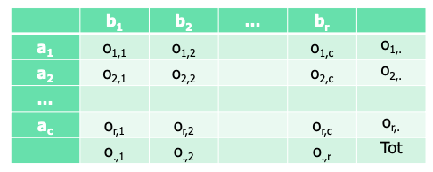

If we just consider the last column, we find the sum of instances where we have value $a_i$. The last row allows us to find the number of instances in which we have the value $b_j$.

In the last column and last row, we have the number of all instances we have in our database.

The idea is to start from this table to understand if $a$ and $b$ are independent.

We have to compute `chi-square`, obtained in this way:

$$
    X^2 = \sum{\frac{(Observed-Expected)^2}{Expected}}
$$

- We subtract from the observed value the expected value and we divide the square for the expected value.

- The observed value is what we find in the contingency table, is the number of couple in which we have the pair of two values.

- The expected value is the frequency we expect for that combination value with the assumption that the two variables a and b are independent.

$$
    X^2 = \sum_{i=1}^c\sum_{j=1}^r{\frac{(o_{ij}-e_{ij})^2}{e_{ij}}} 
$$

$$
    e_{ij} = \frac{count(A=a_i) \times count(B=b_j)}{n}
$$

- Counting $A = a_i$ and divided by $n$ is the probability to have $a_i$

- count $B = b_j$ divided by $n$ is the probability to have $b_j$. 

The product corresponds the product of probability to have $a_i$ and $b_j$. We multiply them with the supposing that they are independent.

If I have that $o_{ij}$ is approximately equal to $e_{ij}$, I can deduce that $a$ and $b$ are independent. This imply that the value of $X^2$ is closed to $0$ 

> Lower the value higher our confidence in deducing that the two variables are independent.

##### example

Let's suppose to have a database and we want to understand if there's correlation between reading and playing chess.

|                       |Play chess     |Not play chess |Sum    |
|-                      |-              |-              |-      |
|Likes science          | 250(90)       | 200(360)      | 450   |
|Doesn't like science   | 50(210)       | 1000(840)     | 1050  |
|Sum                    | 300           | 1200          | 1500  |

Values not in parenthesis are observed values, while numbers in parenthesis are expected counts calculated based on the data distribution in the two categories.

To compute the expected value we have, for example, to count the number of instances in which we have people who like science fiction, multiply for the number of instances that play chess and divide by the total number of instances.

$$
    e_{ij} = \frac{count(A=a_i) \times count(B=b_j)}{n}
$$

$$
    x_2 = 300 \cdot 450 / 1500 = 90.
$$

Then we use chi-square formula:

$$
    X^2 = \frac{(250-90)^2}{90} + \frac{(50-210)^2}{210} + \frac{(200-360)^2}{360} +\frac{(1000-840)^2}{840} = 507.93
$$

> Is this value high or low? What kind of information provide us?

When we have to work with statistical test we have two possibilities:

- __Parametric test__: hypothesis test based on the assumption that observed data are distributed according to some distributions of well- known form (normal, Bernoulli, and so on) up to some unknown parameter on which we want to make inference (say the mean, or the success probability). We know the shape but we need to determine the parametric, for example in normal distribution we need to compute the mean and the variance.

- __Nonparametric test__: hypothesis test where it is not necessary (or not possible) to specify the parametric form of the distribution(s) of the underlying population(s).

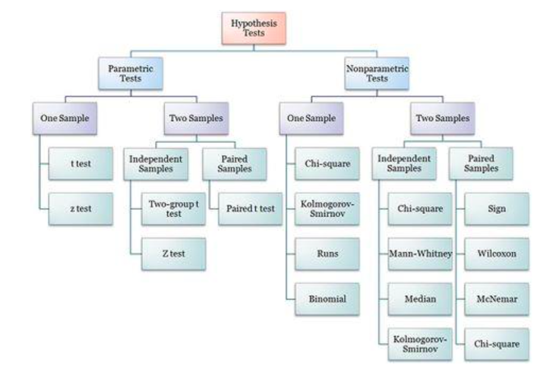

#### We want to verify if two variables are independent.

- We start from the __Null Hypothesis__ (H0), that states that no association exists between the two cross-tabulated variables in the population and therefore the variables are statistically independent.

- If we reject the null hypothesis we have to assume that the two variables are correlated, we have the __Alternative Hypothesis__ (H1) that proposes that the two variables are related in the population.

    > We need to be careful that correlation does not imply casualty.

- The __degrees of Freedom__ are the number of cells in the two-way table of the categorical variables that can vary, given the constraints of the row and column marginal totals. So each \"observation\" in this case is a frequency in a cell.

    - $d_f := 1$ because if I fix the value in $?$, I have also fix automatically the other values.

        |           |Cat    |A      |Total  |
        |-          |-      |-      |-      |
        |__Cat__    |?      |       |6      |
        |__B__      |       |       |15     |
        |__Total__  |10     |11     |21     |
    

    - $d_f = 2$

        |           |Cat    |A      |       |Total  |
        |-          |-      |-      |-      |-      |
        |__Cat__    |?      |       |       |15     |
        |__B__      |       |       |       |15     |
        |__Total__  |10     |11     | 9     |30     |


##### General rule to determine the degree of freedom.

The number of degrees of freedom df is equal to:

$$ 
    d_f = (r-1) (c-1)
$$

where $r$ is the number of rows and $c$ is the number of columns.

> We determine the degree of freedom because we have different chi-square distributions of our problem depending on the degree of freedom.


Probability distributions provide the probability of every possible value that may occur. When we have the value the probability of this value is given of area under the curve starting from the value to the end of the curve.


The $Χ^2$ distribution is a type of probability distribution.

We can determinate the probability calculating the area starting from the chi-square value until the end. To find the probability of a particular value, we find the area under the curve from the value, and it is called the p-value.

This probability indicates also the probability of the null hypothesis.

The shape is always skewed right.

> Many statistical analyses involve using the p-value. However, calculating a portion of the area under the curve can be difficult.

Alternatively, we can use another __curve__, where we have the $X^2$ on an axis and the p-value in another.


If we compute and set the degree of freedom, it picks the curve we must use.

Then we can compute the $X^2$ and we can find the point in the $Χ^2$ table corresponding to our $d_f$ and we can determine the value of $p$.

The probability of the null hypothesis in the example is $0.3$.

#### $X^2$ table

In this table, each row represents a different degree of freedom along with several $X^2$ values. The corresponding p-values are listed at the top of each column


The __null hypothesis__ is rejected when the probability of a larger value of $X^2$ is lower than the significance level $\alpha$. 

##### Steps

- compute $X^2$ and with this value we go to this table

- select our degree of freedom

- check the value we obtained for $X^2$ corresponding to the probability we want to have to accept/reject the null hypothesis. 

If $X^2$ is higher than the value in the table, then we know that the probability to have a true __null hypothesis__ is lower than the probability we read in that column.

If the probability of the null hypothesis is low then the probability of two variables being correlated to each other is high.

- ex:

    A scientist wants to know if education level and marital status are related for all people in some country. He collects data on a simple random sample of n = 300 people. He produced this contingency table.

    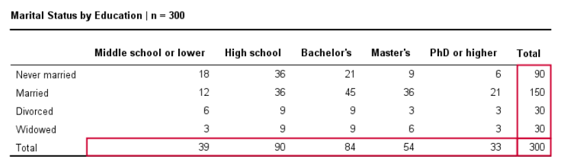

    We compute the expected frequencies, and we obtain this contingency table with expected value:

    

    Now we compute the `chi-square`:

    $$
        X^2 = \frac{(18-11.7)^2}{11.7} + \frac{(36-27)^2}{27} + \dots + \frac{(6-5.4)^2}{6-5.4} = 23.57  
    $$

    Now we have to compute the probability that we obtain this specific value, or we fix the probability, and we see if the null hypothesis can be rejected.

    To compute the probability, we compute the df, which in this case is 12.

    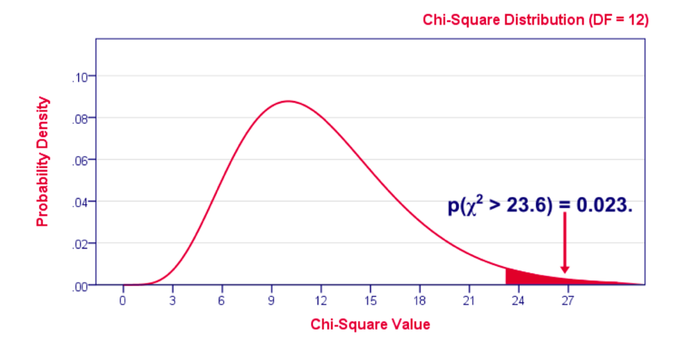

    We find the probability is $0.023$, it is very low and we can conclude that marital status and education are related in our population. We could find the same conclusion using the table we saw.

We need statistical tests to assume if that the value of `chi-square` is relevant or not.

A limitation is that the `chi-square` is applicable only on nominal attributes, because it is complicated to compute the contingency table and the probability.

### Correlation coefficient

For numeric data we can compute correlation using __correlation coefficient__ or Pearson's product moment coefficient.

$$
    r_{A,B} = \frac{\sum_{i=1}^{n}{(a_i-\bar{A})(b_i -\bar{B})}}{n\sigma_A\sigma_B}
$$

- $r_{A,B} \gt 0$: A and B are positively correlated (A's values increase as B's). The higher, the stronger correlation.

- $r_{A,B} \gt 0$: independent

- $r_{A,B} \lt 0$: negatively correlated

#### implications

- If the correlation coefficient is $>>>$ or $<<< 0$, an high value in magnitude, the correlation is strong, and higher the value in magnitude the stronger the correlation.

> We must be careful, if the correlation is equal to 0 it doesn't imply that the two variables are independent, and that's because the Pearson's product moment coefficient only detects linear relationships.

- If variables are independent the correlation will be equal to 0.

    

- We can visually evaluate correlation with the scatter plot.

    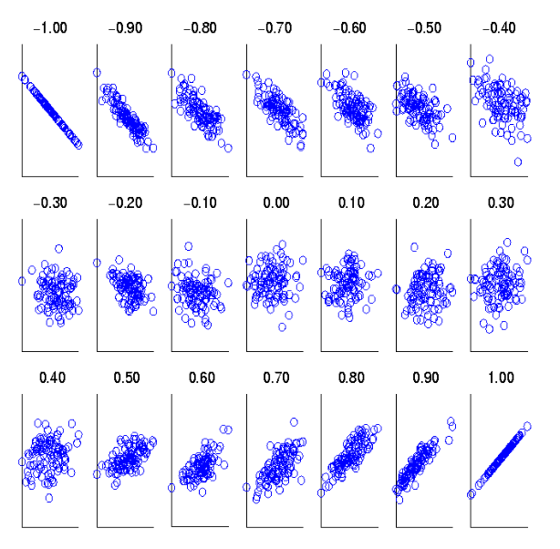

#### Correlation 

it measures the linear relationship between objects.

To compute correlation, we standardize data objects, A and B, and then take their dot product:

$$
    a_k^{'} = (a_k-mean(A)) / \sigma_A
$$

$$
    b_k^{'} = (b_k-mean(B)) / \sigma_B
$$

$$
    correlation(A,B) = A^{'} \cdot B^{'}
$$

#### Covariance 

is similar to correlation:

$$
    Cov(A,B) = E((A-\bar{A})(B-\bar{B})) = \frac{\sum_{i=1}^{n}(a_i-\bar{A})(b_i-\bar{B})}{n}
$$

They relation is given by this, the correlation coefficient:

$$
    r_{A,B} = \frac{Cov(A,B)}{\sigma_A\sigma_B}
$$

- __Positive covariance__: If $Cov(A,B) > 0$, then $A$ and $B$ both tend to be larger than their expected values.

- __Negative covariance__: If $Cov(A,B) < 0$ then if A is larger than its expected value, B is likely to be smaller than its expected value.

- __Independence__ : $Cov(A,B) = 0$ but the converse is not true


The covariance can be simplified in this way:

$$
    Cov(A,B) = E(A\cdot B) - \bar{A}\bar{B}
$$

## Data Reduction

Data reduction consists in obtaining a reduced representation of the data set that is much smaller in volume but yet produces the same (or almost the same) analytical results.

Data reduction strategies:

- __Dimensionality reduction__, e.g., remove unimportant attributes: Wavelet transforms, Principal Components Analysis (PCA), feature subset selection and feature creation

- __Numerosity reduction__ (some simply call it: Data Reduction): Regression and Log-Linear Models, Histograms, clustering, sampling and data cube aggregation

-   __Data compression__

### Dimensionality Reduction

When dimensionality increases, data becomes increasingly sparse.

Density and distance between points, which is critical to clustering, outlier analysis, becomes less meaningful and this obstacle the application of different algorithms.

##### problems

- The possible combinations of subspaces will grow exponentially.

- We will avoid the curse of dimensionality, help eliminate irrelevant features and reduce noise and reduce time and space required in data mining.

- Dimensionality reduction also allow easier visualization.


##### Dimensionality reduction techniques are:

- Wavelet transforms

- Principal Component Analysis

- Supervised and non-linear techniques (e.g. feature selection)

### Principal Component Analysis (PCA)

PCA transforms the original space in a transformed space, find a projection that capture the largest amount of variation in data. We find this transformed space such that the variation of the projection of the data in the transformed axis is higher than what we obtain in the original axis.

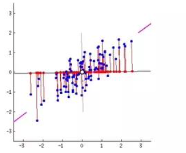

Newly projected red points are more widely spread out than in the original dataset, i.e. more variance.

PCA tries to find axes such that the variation is higher.

If I have features in which data vary very much, probably these features contain a lot of information, this is the idea.

If I apply PCA I find that the transformed space has the same number of dimensions of the original space.

Actually, we can select the dimensions in the transformed space because we can have some idea of how much exists variation along transformed dimension. 

#### Eigenvectors

To exploit this we use eigenvector of the covariance matrix and we can reduce the size of the transformed space because we can eliminate eigenvectors associated with low eigenvalues.

The original data are projected into a much smaller space, resulting in dimensionality reduction. We find the eigenvectors of the covariance matrix, and these eigenvectors define the new space.

##### steps

Given $N$ data vectors from $f$ dimensions, find $k \leq f$ orthogonal vectors that can be best used to represent data. 

> This work for numeric data only.

1. Normalize input data: Each attribute falls within the same range

2. Compute k orthonormal (unit) vectors, i.e., principal components.

3. Each input data (vector) is a linear combination of the k principal component vectors

The principal components are sorted in order of decreasing "significance" or strength

Since the components are sorted, the size of the data can be reduced by eliminating the weak components (those with low variance).

Given $N$ data vectors from $f$-dimensions, find $k\leq f$ orthogonal vectors (principal components) that can be best used to represent data.

#### PCA process

We start from these data vectors, in the row we present the dimension and in the column we represents the samples. We subtract the mean values features by features, because we want to compute the covariance matrix from our dataset.


1. Calculate adjusted_data_set by removing the mean from each feature

    ```py
    # A := adjusted_data_set 
    for f in data.features:
        A[f] = data_set[f] - np.mean(data_set[f])
    ```

2. Calculate the co-variance matrix ($X,Y$ are just two aliases for $A$)

    in theory $C = Cov(X,Y)$ is equal to: 
    
    $$
        Cov(X,Y) = \frac{\sum_{i=1}^{n}(x_i-\bar{X})(y_i-\bar{Y})}{N-1}
    $$

    but since the adjusted_data_set has mean equal to $0$

    $$
        Cov(X,Y) = \frac{(AA^{T})}{N-1}
    $$

    ```py
    # C := coverage_matrix 

    C = np.cov(A, rowvar=False)
    ```

3. Calculate the eigenvectors

    this is done with some `witchcraft` that finds some $f$ `eigenvectors` where $f \leq N$ and $N$ is the number of original features

    ```py
    eigenvalues, eigenvectors = np.linalg.eig(C)
    ```
    
    For each `eigenvectors` there is an `eigenvalues`, we can remove `eigenvectors` with a low `eigenvalue`, by doing this we create a mtrix `E` that contain a subset of eigenvectors.

    We then use the matrix E to transform our data contained in the matrix A.

4. Transform data_set to the new basis

    $$
        F = E^{T} A
    $$

    ```py
    # F := new_data_set 
    F = np.dot(data_set, eigenvectors)
    ```

    The F matrix contain the transformed dataset where each object is defined on the transformed space but using only the dimensions fixed by the eigenvectors we selected.

    We project the data along new axis where we have a high variance of data and we eliminate dimensions where we have few variation.

##### conclusions

the dimensions of $F$ are less than the original dataset, to recover $A$ from $F$

$$
    (E^T)F = (E^T)^{-1}E^TA
$$

$$
    (E^T)^TF = A
$$

$$
    EF = A
$$

> In the PCA we use the distribution of data, therefore the PCA is unsupervised.

##### usage

In any type of data mining process this can be used for dimensional reduction, and it is independent of any kind of application.

The reduction of the number of dimensions is performed in the transformed space. 

The transformed space and the new axes are obtained as linear combination of old axes, it's not easy to understand the impact in original features.

## Attribute subset selection

The discussion is different if I use attribute subset selection.

I can work on the original space applying some heuristics.

I can discover to have:

- __Redundant attributes__: like duplicate much or all of the information contained in one or more other attributes

- __Irrelevant attributes__: contain no information that is useful for the data mining task at hand

It's not simple to perform attribute selection because the number possible combination of attributes grows exponentially.

We need to perform this analysis using a greedy approach: 

make what looks to be the best choice at the time. When we apply this algorithm noone can guarantee that the subset we will select is a global optimum, but it's close to the optimum.

#### Typical heuristic attribute selection methods:

- __Best single attribute__ under the attribute independence assumption: choose by significance tests

- __Best stepwise feature selection__: The best single-attribute is picked first, then next best attribute condition to the first

- __Step-wise attribute elimination__: Repeatedly eliminate the worst attribute

- __Best combined attribute selection and elimination__

- __Optimal branch and bound__: use attribute elimination and backtracking

    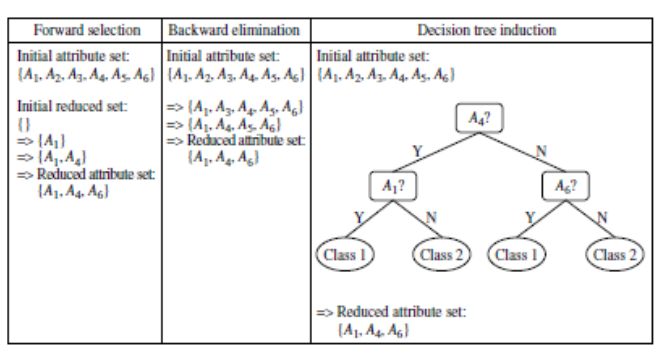

    In the forward selection the attribute is the best when we select it, but at the end no one can guarantee that.

    In the backward elimination we can make similar considerations.

    A typical problem is the _stopping condition_, sometimes in most approaches we fix the number of dimensions we want to obtain, otherwise we can use specific metrics for selecting the attributes and different metrics as termination condition.

    In the slide we have another approach, the decision tree induction. We use decision tree learning algorithm to perform feature selection.

##### Example of heuristic approach

This approach assumes that we know the classes of the instances, this is a supervised approach, and it works on the original space.

We can eliminate features in the original space.

We're dealing with a classification problem; we have a set of objects described by features and we want a system that can associate classes to these objects.

Correlation here means that if we have a value in an attribute, we tend to have some certain classes.

We want to select features that are strongly correlated with the class.

### Mutual information

If two attributes are equal and strongly correlated with the class, we select both attributes, but this is not a good idea to proceed.

We should also avoid selecting attributes strongly correlated with each other.

We need to transmit these intuitions into formula.

Let's consider two discrete variables X and Y, with alphabets XX and YY, respectively.

The __mutual information__ (I) between $X$ and $Y$ with a joint probability mass function $p(x,y)$ and marginal probabilities $p(x)$ and $p(y)$ is defined as follows:

$$
    I(X,Y) = \sum_{x \in XX} \sum_{y \in YY} p(x,y) \cdot \log{\frac{p(x,y)}{p(x)p(y)}}
$$

This is the sum between the product of the joint probability and the logarithm of the ratio of the joint probability and the product of marginal probabilities, for all values of x and y.

Alphabets XX and YY contain the possible values for X and Y, respectively.

##### considerations

- If $x$ and $y$ are independent the joint probability is the product of marginal probabilities, the ratio is equal to $1$ and the logarithm of one is $0$.

    The mutual information will be 0.

- If we are far from the case of independence the joint probability is higher than the product and the mutual information increases.

##### properties

- The capacity of measuring any kind of relationship between variables

- Its invariance under space transformations (translations, rotations and any transformation that preserve the order of the original elements of the variables)

> Feature selection based on MI is extremely sensitive to the estimation of the pdfs.

If I want to measure if attribute $X$ is correlated with another attribute and not the output $Y$, I can still exploit this formula.

Given an initial set $F$ with $n$ features, find subset $S ⊂ F$ with $k$ features that maximizes the $MI I(C;S)$ between the class variable $C$, and the subset of selected features $S$.

### $NI$ := Normalized MI between $f_i$ and $f_s$:

$$
    NI(f_i, f_s) = \frac{I(f_i;f_s)}{min\{H(f_i), H(f_s)\}}
$$

- We divide by the minimum of the entropy of the two values, to reduce the effect of variables with an high number of values.

- it to varies between 0 and 1.

The selection criterion used in NMIFS consists in selecting the feature that maximizes the measure G.

$$
    G = I(C,f_i)-\frac{1}{S}\sum_{f_s \in S}{NI(f_i;f_s)}
$$

$$
    \text{where } I(C,f_i) = \sum_{c \in CC}\sum_{f_i \in FF} p(c, f_i) \cdot \log{\frac{p(c,f_i)}{p(c)p(f_i)}}
$$

- We want high mutual information between feature and output but also low mutual information between the feature and the already selected feature.

- $f_i$ is the features we are analyzing, and fs is a feature we already selected.

##### algorithm

So, we want to maximize $G$, it implements the intuitions we talked about before. This is the algorithm we can use:

1. Initialization: Set $F = \{f_i \text{with} i = 1,...,N \}$ initial set of $N$ features, and $S = \{\emptyset\}$, empty set of selected features.

2. Calculate the $MI$ with respect to the classes: calculate $I(f_i ;C)$, for each $f_i \in F$, each feature and the output.

3. Select the first feature: Find $i | f_i = \max_{i=1,...,N}{I(f_i; C)}$, maximum $MI$ between the feature and the output. 

    move $f_i$ from $F$ to $S$

4. Greedy Selection: Repeat until $\#S = k$, a prefixed value before the algorithm starts.

    - Calculate the $MI$ between features: Calculate $I(f_i ;f_s )$ for all pairs $(f_i ; f_s)$, with $f_i \in F$ and $f_s \in S$

    - Select next feature: Select feature $f_i \in F$ that maximizes $G$. 

        move $f_i$ from $F$ to $S$

5. Output the set $S$ containing the selected features. 

We don't have metrics to determine the termination condition but we fix the number of features at the beginning.


#### Why do we use $NI$ that is $\frac{MI}{entropy}$ ?

Suppose we want to encode and transmit a long sequence of symbols from the set `{a, c, e, g}` using the __least number of bits__, drawn randomly according to the following probability distribution D:

|Symbol     |a  |c  |e  |g  |
|-          |-  |-  |-  |-  |
|__Prob__   |1/8|1/8|1/4|1/2|

Since there are 4 symbols, one possibility is to use 2 bits per symbol:

|Symbol |Encoding   |
|-      |-          |
|a      |00         |
|c      |01         |
|e      |10         |
|g      |11         |

Because it's possible to use 1.75 bit on average

|Symbol |Encoding   |
|-      |-          |
|a      |000        |
|c      |001        |
|e      |01         |
|g      |1          |

> We must select the shorting encoding for high probably symbols.

$$

    \text{Average\_number\_of\_bits\_per\_symbol} = \frac{1}{8} \cdot 3 + \frac{1}{8} \cdot 3 + \frac{1}{4} \cdot 2 + \frac{1}{2} \cdot 1 = 1.75

$$

### Information entropy

In the information theory they introduced the concept that __optimal length code__ assigns $\log_{2}{1/p} = -\log_2{p}$ bits to a message having probability $p$.

Given a distribution $D$ over a finite set, where $<p_1, p_2, \dots, p_n>$ are the corresponding probabilities, define the __information entropy__, or information, of D by:

$$
    H(D) = -\sum_{i=1}^{n}{p_i \log_2{p_i}}
$$

- For example 

    the entropy of the distribution we just examined, $<1\frac{1}{8},\frac{1}{8}, \frac{1}{4}, \frac{1}{2}>$, is 1.75 (bits)

    If all symbols have the same probability to be transmitted, the number of bits we must use in average is 2, our initial solution.

> The maximum value of entropy can be achieved when we assume all the symbols are equally probable.

#### considerations

- We have the lowest value of entropy when just one symbol is characterized by probability 1 and all others are characterized by probability 0.
    
    This corresponds, though, to the assumption that we transmit only one symbol and in that case, entropy is 0, we don't actually transmit anything.

- If we have 5 symbols and the first has probability 1 and all the others 0, the first symbol contributes 0 for the logarithm and all others contributes 0 for the probability.

- If we have a group of objects that belong to the same class, if we want to analyze the entropy of this object referring to the class, we can compute the probability of having the classes inside the group of objects.

    In this case the entropy of the group of objects in term of probability of classes is equal to 0.

    The probability of one class is 1 and others are 0.

### Attribute creation (feature generation)

We can consider the creation of new attributes (features) that can capture the important information in a data set more effectively than the original ones.

There are three general methodologies:
- __Attribute extraction__ that can be domain-specific. Feature selection can be automated, thing that can't be done with feature extraction.

- __Mapping data to new space__ (see: data reduction), for example with Fourier transformation, wavelet transformation, manifold approaches (not covered).

- __Attribute construction__: combining features and data discretization.

### Numerosity Reduction

It helps us to reduce complexity. The problem is not about computational power but it's about storage.

- __Parametric__ methods (e.g., regression): in which we assume the data fits some model, estimate model parameters, we store only the parameters and discard the data (except possible outliers)

- __Non-parametric__ method, in which we do not assume models and try to summarize data using an approach. For instance, histograms, clustering, sampling.

#### Regression and log-linear models

- __Linear regression__: in which data is modeled to fit a straight line and it often uses the least-square method to fit the line

- __Multiple regression__: it allows a response variable Y to be modeled as a linear function of multidimensional feature vector

- __Log-linear model:__ in which we approximates discrete multidimensional probability distributions

Used to estimate the probability of each point in a multi- dimensional space for a set of discretized attributes, based on a smaller subset of dimensional combinations.

### Regression analysis

A collective name for techniques for the modeling and analysis of numerical data consisting of values of a dependent variable and of one or more independent variables.

We compute the parameters of the straight line in such a way the distance between the points and the line is minimum.

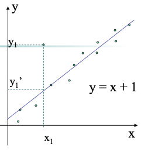

#### Linear regression

Two regression coefficients, $w_1$ and $w_0$, specify the line and are to be estimated by using the data at hand.

We can use the least squares criterion to the known values of $<y_1, y_2, \dots>, <x1, x2, \dots>$


$$
    w_i = \frac{\sum_{i=1}^{\#D}{(x_i-\bar{x})(y_i-\bar{y})}}{\sum_{i=1}^{\#D}{(x_i-\bar{x})^2}}
$$

where $\#D$ is the size of the dataset

- ex: the $x_i$ column shows scores on the aptitude test. Similarly, the $y_i$ column shows statistics grades.

    |<!--  -->|<!--  -->|<!--  -->|
    |-|-|-|
    ||||

    We want to find a straight line to approximate these values.

    - Computation of $w_1$: `w1 = 470 / 730 = 0.644`

    - Computation of $w_0$ : `w0 = 77 - 0.644 * 78 = 26.768`

    - Linear regression equation: `y = 0.644 x + 26.768`

#### Multiple linear regression

$$
    y = w_0 + w_1 x_1 + w_2 x_2
$$

Many nonlinear functions can be transformed into the above

$$
    W = (X^T X)^{-1}\  X^T \ Y
$$

#### Polynomial regression

$$
    y = w_0 + w_1 x + w_2 x^2 + w_3 x^3
$$

To convert this equation to a linear regression problem, we apply the following transformation:

- $x_1=x$

- $x_2=x^2$

- $x_3=x^3$ 

create a variable for each polynomial degree

#### Log-linear models

Mathematical models that take the form of functions whose logarithm is a first-degree polynomial function of the parameters of the model.

Estimate the probability of each point (tuple) in a multi-dimensional space for a set of discretized attributes, based on a smaller subset of dimensional combinations.

Useful for dimensionality reduction and data smoothing.

$$
    exp(c+ \sum_{i}{w_if_i(X)})
$$


### Histogram analysis

In non-parametric case we use other analysis, for example __histograms__.

We divide data into buckets and store average (sum) for each bucket.

We can have different partitioning rules:

-   Equal-width: equal bucket range

-   Equal-frequency (or equal-depth)

__histogran__
```py
## the following data are a list of AllEletronics prices for commonly sold items (sorted)

prrices = [1, 1, 5, 5, 5, 5, 5, 8, 8, 10, 10, 10, 12, 14, 14, 14, 15, 15, 15, 15, 15, 18, 18, 18, 18, 18, 18, 18, 18, 20, 20, 20, 20, 20, 20, 20, 21, 21, 21, 21, 25, 25, 25, 25, 25, 28, 28, 30, 30, 30]
```


- The first histogram is obtained using single buckets.

- In the second case we have equal-width histogram for price. We discretize the domain of the prize.

### Clustering

Another way is __clustering__, in which we partition data set into clusters based on similarity, and store cluster representation (e.g., centroid and diameter) only.

We can have __hierarchical clustering__ and be stored in multi-dimensional index tree structures.

### Sampling

Obtaining a small samples to represent the whole data set.

We want to choose a representative subset of the data. It allows a mining algorithm to run in complexity that is potentially sub-linear to the size of the data.

Key principle: Choose a representative subset of the data.

Sampling techniques can be devided into:

-   __Simple random sampling__: there is an equal probability of selecting any particular item

    - __Sampling without replacement__: once an object is selected, it is removed from the population. We put the object in the selected set and we eliminate the object from the original repository. In this case we change the probability, each time I extract an object and eliminate it from the repository I change the probability in the original repository.

    - __Sampling with replacement__: a selected object is not removed from the population. We can see that like making a copy of the object. 
    
        Each time that we perform sampling we extract an instance with equal probability, we con't change the probability of extracting objects. This has the advantage that in my repository 

-   __Stratified sampling__: partition the data set, and draw samples from each partition.

    Used in conjunction with skewed data (also the smaller group of items will be sure to be represented) I generate this stratification and extract data from each partition I have.

    If I have some skew, I'll dedicate a partition for the skew and be sure that I have representative for the skew.


    In stratified sampling we don't have the risk to have only data from a majority class, if we have majority and minority class. We can be sure that also instances from the minority class will be selected.


When we sample with replacement, the two sample values are independent. 

What we get on the first one doesn't affect what we get on the second. The covariance between the two is zero.

In sampling without replacement, the two sample values aren't independent. What we got on for the first one affects what we can get for the second one. 

The covariance between the two, from a population with variance $\sigma^2$, is:

$$
    \frac{-\sigma^2}{N-1}
$$

In case of SRSWOR we extract three items and we have just the probability to extract the same objects, we don't eliminate the same objects, so we have the probability to extract the same objects.


In stratifies sampling we can partition someway the raw data and we are sure that we extract data from each partition.


In SRSWOR all records are different, in SRSWR in the subset we can have two records equal because we don't eliminate records from the repository.

In stratified sample we have an organization in partition, and we guarantee that we extract an item, at least, from each partition. We try to preserve the distribution that we have for the partition.

### Data Cube Aggregation

A typical representation we have in a data warehouse, useful to perform analysis, is __data cube__.

In a cube of data we can represents different attributes with different granularity.


Instead of representing data in terms of months or weeks or days we can represent them in form of year, to have a summarized version of data.

It's like we have an hierarchy, we can have multiple levels of aggregation in data cubes.

## Data Compression

We can consider them in two groups:

- __lossless__ data compression, we compress data but when we uncompress we obtain the perfect original copy

- __lossy__ data compression, when we uncompress the data we don't recover the same data.


> If we have lossless algorithms, why don't we use always them?
>> When we use lossy compression, we achieve an higher compression ratio, we compress more the data.

## Data Transformation and Data Discretization

__Data transformation__ is a function that maps the entire set of values of a given attribute to a new set of replacement values such that each old value can be identified with one of the new values.

There are different methods:

- __Smoothing__: Remove noise from data

- __Attribute/feature construction__

- __Aggregation__: Summarization, data cube construction

- __Normalization__: Scaled to fall within a smaller, specified range (min-max normalization, z-score normalization, normalization by decimal scaling)

- __Discretization__: Concept hierarchy climbing

### Min-max normalization

We transform all data in a way that they will vary from $[new\_minA, new\_maxA]$.

$v^{'}$ is the new data.

$$
    v^{'} = \frac{v-min_A}{max_A-min_A} (new\_max_A -new\_min_A) + new\_min_A
$$

This normalization suffers for a type of problem. 

> If we have an outlier which is a minimum and it is far away from the others, all points will be mapped in a narrow zone between 0 and 1.

To avoid this problem, we typically exploit another normalization.

### Z-score normalization

We don't use minimum and maximum, but we use μ (mean) and σ (standard deviation).

$$
    v^{'}= \frac{v-\mu}{\sigma_A}
$$

In this normalization values will not vary in a fixed range, but they will vary in similar ranges, thanks to the denominator, which is the std and depends how much data are spread in the original domain.

The `min/max normalization` guarantee us that all features vary in the same range but suffers for the problem of outliers, while `z-score` normalization does not suffer from this problem.

### Normalization by decimal scaling

The new value is obtained by the ratio of the old value and this power of $j$:

$$
    v^{'} = \frac{v}{10^j}
$$

where $j$ is the smallest integer such that $max(|v^{'}|) < 1$.


### Discretization

We apply discretization when we have a continuous value, and we want to discretize it. It consists in dividing the range of a continuous attribute into intervals.

Some `ML` techniques are applicable only on nominal data and not on continuous data. Interval labels can then be used to replace actual data values.

> Finding correct intervals is important and we need to have approaches to discretize in such a way to guarantee good results in term of application of ML techniques.

We also reduce data size by discretization.

#### discretization techniques

- __Supervised__, uses information on the class. We try to divide them in such a way that points belonging to the same class are in the same interval.

- __Unsupervised__

It can also be:

-  __Split (top-down)__, we start from a interval and then we split

- __Merge (bottom-up)__, where we try to merge intervals

Discretization can be performed recursively on an attribute.

> Discretization can be applied recursevly

Typical methods (All the methods can be applied recursively):

-  __Binning__: top-down split, unsupervised

-  __Histogram analysis__: top-down split, unsupervised

-  __Clustering analysis__: unsupervised, top-down split or bottom-up merge

-  __Decision-tree analysis__: supervised, top-down split

- __Correlation analysis__: unsupervised, bottom-up merge

#### Binning

We have two types of binning:

-   __Equal-width (distance)__ partitioning
    
    We divide the range into $N$ intervals of equal size: uniform grid.

    If $A$ and $B$ are the lowest and highest values of the attribute, the width of intervals will be:

    $$
        W = \frac{(B - A)}{N}. 
    $$

    The most straightforward, but outliers may dominate presentation. Skewed data is not handled well because we have intervals of the same size.

-   __Equal-depth (frequency)__ partitioning

    We divide the range into $N$ intervals, each containing approximately same number of samples.
    
    Good data scaling is possible.
    
    Managing categorical attributes can be tricky because we can just put more label together if we consider the same frequency.

##### Example

```py
## sorted data for price ($)

prices = [4, 8, 9, 15, 21, 21, 24, 25, 26, 26, 29, 34]

eqy_depth_bins = [
    [4, 8, 9, 15]
    [21, 21, 24, 25]
    [26, 18, 29, 34]
]

## smoothing by bin means we obtain
bin_means_smoothed_bins = [
    [9, 9, 9, 9]
    [23, 23, 23, 23]
    [29, 29, 29, 29]
]

## smoothing by bin boundaries we obtain
bin_means_smoothed_bins = [
    [4, 4, 4, 15]
    [21, 21, 25, 25]
    [26, 26, 26, 34]
]
```

Let's see a comparison between different approaches of discretization.


##### conclusions

- With equal width binning we just split the domain in equal-width intervals.

- Points belonging to the same class may be split in different intervals.

- In the case of equal frequency, the situation is similar, we split points belonging to the same class in different intervals.

This situation can improve if we exploit cluster algorithms, that try to include in the same cluster similar points and the similarity is measured considering the distance between points exploiting the fact they're close in the space.

#### We can have discretization performed in a supervised way:

- __Classification__

    - Using entropy to determine split point (discretization point)
    - Top-down, recursive split
    - Details to be covered in the following

- __Correlation analysis__ (e.g., Chi-merge: χ2-based discretization)

    - Bottom-up merge: find the best neighboring intervals (those having similar distributions of classes, i.e., low χ2 values) to merge

    - Merge performed recursively, until a predefined stopping condition

### ChiMerge Discretization

It is a statistical approach to data discretization.

We want to create intervals in which we have points belonging to the same class.

It applies the `Chi Square` method to determine the probability of similarity of data between two intervals. Let's suppose we have different features $F$ and two classes $K$.

|<!--  -->|<!--  -->|
|-|-|
|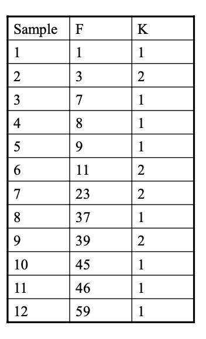||

We start to sort and order the attributes that we want to group (in this example attribute $F$).

We start with having every unique value in the attribute in its own interval.

This is a bottom-up approach in fact.

The upper boundary is the point in the middle between a value and the next.

We begin calculating the Chi Square test on every interval and see if we can merge close intervals. We compute the chi-square considering merging two intervals.


The values we have in the cell are observed values.


The expected value is obtained by considering the frequency of the sample and the frequency of the class.

We get 0 and 2 for the chi-square. Having 0 means that samples and classes are independent, the value of samples change but the class remain the same.

In the first class we have correlation, if samples change the class change.

We consider a threshold $0.1$ with $d_f = 1$ from `Chi-square` distribution chart and we merge if $X^2 \lt 2.7024$.

We calculate chi-values for all intervals and merge all intervals with the smallest chi-values because we are that we have independence between the classes and the samples.

|<!--  -->|<!--  -->|
|-|-|
|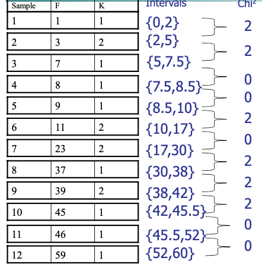||

Now we repeat the computation and we get:


|<!--  -->|<!--  -->|
|-|-|
|||

And we go on until there's no interval to satisfy the chi-square test.

In most intervals almost all samples belong to the same class.

We merge points inside one interval in a way we have a predominant class of membership of these points. This approach is heavy if we have a large dataset.

### Concept Hierarchy Generation

Concept hierarchy organizes concepts hierarchically and is usually associated with each dimension in a data warehouse.

The concept hierarchies can be used to transform the data into multiple levels of granulaity.

Concept hierarchy formation: Recursively reduce the data by collecting and replacing low level concepts by higher level concepts grouping low level concepts.

Concept hierarchy can be automatically formed for both numeric and nominal data. For numeric data, use discretization methods shown.

We study four methods for the generation of concept hierarchies for nominal data, as follows.

-  __specification of a partial/total ordering__ of attributes explicitly at the schema level by users or experts. A hierarchy can be defined by specifying the total ordering among attributes at the schema level such as:

    street < city < state < country

    > Country is the highest level of hierarchy, that contains the state, that contains the city, that contains the street.

- __specification of a hierarchy__ for a set of values by explicit data grouping. In a large database, it is unrealistic to define an entire concept hierarchy by explicit value enumera- tion. On the contrary, we can easily specify explicit groupings for a small portion of intermediate-level data.

    {Urbana, Champaign, Chicago} \< Illinois

- __specification of only a partial set of attributes__. Sometimes a user can be careless when defining a hierarchy or have only a vague idea about what should be included in a hierarchy. Consequently, the user may have included only a small subset of the relevant attributes in the hierarchy specification.

    ex: only street < city, not others

-   __automatic generation of hierarchies__ (or attribute levels) by the analysis of the number of distinct values, considering the numerosity for each of the values we are considering.

    ex: for a set of attributes: {street, city, state, country}

### Automatic Concept Hierarchy Generation

Some hierarchies can be automatically generated based on the analysis of the number of distinct values per attribute in the data set.

The attribute with the most distinct values is placed at the lowest level of the hierarchy.

Exceptions, e.g., weekday, month, quarter, year

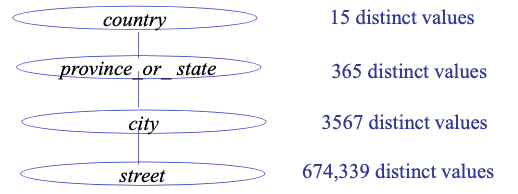

Depending on specific application domain you need to use the best techniques for preprocessing.

