# Association Rule

## Mining Frequent Patterns

A pattern is a set of items (milk and bread which appear together in a transaction data set).A subsequence (buy first a PC, then a digital camera and then a memory card) is also a pattern but with a difference, the order is relevant.A substructure is a pattern that refers to different structural forms (subgraphs, subtrees).

A pattern is frequent if it occurs frequently in a data set.

Finding such frequent patterns plays an essential role in mining associations, correlations and other interesting relationships and we talk about frequent pattern analysis.

### Basic concepts

We define:

-   __Itemset I__: A set of one or more items {I1, I2, \..., Im}.

-   __k-itemset X__ = {x1, x2, \..., xk}, set of k items.

-   __(absolute) support__, or, __support count of X__: the frequency or occurrence of an itemset X in the database of transactions, number of transactions in which the itemset appears.

-   __(relative) support s__: fraction of transactions that contains X (i.e., the probability that a transaction contains X).

    

    The 1-itemset (one element) beer appear 3/5, the absolute support of this set is 3. The relative support is 3/5. The absolute support of Beer, Diaper is 3. The relative support is 3/5.

    The absolute support for Milk is 2. The relative support is 2/5.

- An itemset X is __frequent__ if X's support is no less than a __minsup threshold__.

    To fix the minsup we need to consider that we are not interested in 1-itemset, we will choose a good number.

### Purpose of Frequent Pattern Analysis
The aim of frequent pattern analysis is to mine itemset. Larger is the cardinality of the itemset and more interesting is what we can discover.

The complexity is exponential, we need specific techniques to reduce complexity.

After fixing the minsup these techniques will give us all frequent patterns.

## Frequent Pattern Matching

When we have a set of many items working on all possible combinations is hard.

We must mine all the possible frequent patterns.

### Transactions
A transaction T is a set of items such that: 

$$
    T \subseteq I
$$

### Association Rule
An association rule is an implication of the form X $\Rightarrow$ Y, where
- $X \subset I$
- $Y \subset I$
- $X \cap Y = \emptyset$

The association rule means that there's an high probability that X will imply Y.

#### Definitions
__The relative support of X $\Rightarrow$ Y in the transaction database D__: percentage of transactions in D that contain $X \cup Y$ (i.e., the union of sets X and Y) 

__Support:__ $Supp (X \Rightarrow Y) = P(X \cup Y) \rightarrow$ probability that a transaction contains $X \cup Y$

__Confidence:__ $Conf (X \Rightarrow Y) = P(Y | X) = \frac{Supp(X \cup Y)}{Supp(X)} \rightarrow$ conditional probability that a transaction having X also contains Y and it is given by this ratio. 

This ratio belongs to the interval \[0,1\], in fact it is a probability, and that's because:
$$
    supp(X \cup Y) \Leftarrow supp(X)
$$
If $Conf(X \Rightarrow Y) = 1$, every time I have X I also have Y.

__All the rules with confidence 1 are optimal for us.__

But a special case there is when Y is always present in the transaction it is not that optimal, it doesn't mean that when we have X we also have Y, it's because Y is always present.

This is the reason why confidence is important, but we need to consider also the probability of Y.

### Implementation
Each item has a boolean variable representing the presence or absence of that item.

Each basket can be represented by a Boolean vector of values assigned to these variables.

We can represent each transaction as boolean vector which is our basket.

Boolean vectors analyzed for buying patterns that reflect items that are frequently associated or purchased together.

Computer $\Rightarrow$ antivirus\_software \[Support=2%,Confidence =60%\] 

__Support reflects the usefulness__ (in the 2% of all transactions, purchased together). __Confidence reflects certainty__ (60% of the customers who purchased a computer also bought the software).

A typical problem we have to solve is that given a database of transactions.

We need to find all the rules X $\Rightarrow$ U with minimum support and confidence, fixed the minimum values.

Let's come back to the previous example.

Let __minsup__ = 50%, __minconf__ = 50%

Freq. itemsets: Beer:3, Nuts:3, Diaper:4, Eggs:3, {Beer, Diaper}:3

They're frequent because we fixed minsup to 50% (3/5 and 4/5 \> 0.5).

Beer is a 1-itemset frequent, {Beer, Diaper} is a 2-itemset frequent, and so on.

We can extract now association rules:

Beer $\Rightarrow$ Diaper (60%, 100%)

Diaper $\Rightarrow$ Beer (60%, 75%)

The __support__ is the same because it is defined as the number of transactions in which we have the two items together.

The __confidence__ is different because obtained by dividing the support for the support of the antecedent.

#### Process
In general, association rule mining can be viewed as a two-step process:

-   __Find all frequent itemsets__: By definition, each of these itemsets will occur at least as frequently as a predetermined minimum support count, minsup, once fixed minsup.

-   __Generate strong association rules from the frequent itemsets__: By definition, these rules must satisfy minimum support (automatically satisfied because we start from frequent itemsets) and minimum confidence.

A long itemset contains a combinatorial number of sub-itemsets, e.g., we have 100 itemsets {a1, \..., a100}. The number of sub-itemset is:

We need to find a solution to show all frequent patterns we can mine to users by summarizing.

The way to summarize the frequent patterns is showing a subset of frequent pattern we mined.

#### New problem

A long itemset contains a huge number of sub\-items.

__Solution__: Mine closed itemsets and max-itemsets instead

-   An itemset X is __closed__ in a dataset D if X is frequent and there exists no super-itemset $Y \supset X$, with the same support as X $\rightarrow$ this means that we can give the customer only 1 itemset specifying that it is closed.

-   An itemset X is a __max-itemset__ in a dataset D if X is frequent and there exists no frequent super-itemset $Y \supset X$, but we do not specify nothing about support.

If we have the max-itemset we have all the information we need.

Closed itemset is a lossless compression of freq. patterns, it allow us to reduce the number of patterns and rules

For example, we have two subsets one containing 100 items and the other 50 items.

DB = {\<$a_1$, \..., $a_{100}$\>, \< $a_1$, \..., $a_{50}$\>}

Min\_sup = 1.

- What is the set of closed itemset?

    \<$a_1$, \..., $a_{100}$\> closed with support 1

    \< $a_1$, \..., $a_{50}$\> closed with support 2

- What is the set of max-itemset?

    \<$a_1$, \..., $a_{100}$\>: 1

Giving only the max-itemset we lose information, we cannot know that there exists the other itemset with support 2.

The set of closed frequent itemsets contains, instead, complete information regarding the frequent itemsets.

For instance, from the set of closed frequent itemset, we can derive {$a_2$, $a_{45}$ : 2};

From the data set, we can only infer that {$a_2$, $a_{45}$ : 1}

#### Worst-case scenario

Let C be the set of closed frequent itemsets for a data set D satisfying a minimum support threshold, min\_sup.

Let M be the set of maximal frequent itemsets for D satisfying min\_sup.

Suppose that we have the support count of each itemset in C and M. Notice that C and its count information can be used to derive the whole set of frequent itemsets. Thus, we say that C contains complete information regarding its corresponding frequent itemsets.

For the computational complexity it's impossible to generate all possible combinations.

How many itemsets are potentially to be generated in the worst case?

The number of frequent itemsets to be generated is sensitive to the minsup threshold.

When minsup is low, there exist potentially an exponential number of frequent itemsets.The worst case: MN where M is the number of distinct items, and N is the max length of transactions.

Let's see the worst case complexity vs. the expected probability .

Ex. Suppose Walmart has 104 kinds of products.The chance to pick up one product is 10-4.The chance to pick up a particular set of 10 products is \~10-40 because we consider independent products.

We can see that with the increase of M in the transaction the probability to have this itemset frequent decreases.

This is the basis of the most popular algorithm used for frequent pattern mining.

## Apriori Algorithm

__Apriori algorithm__ is an approach in which we have candidate generation-and-test.

The _downward closure property_ of frequent patterns tells us that any nonempty subset of a frequent itemset must also be frequent. (Apriori property) It tells us that if we have that {beer, diaper, nuts} is frequent, so is {beer, diaper} i.e., every transaction having {beer, diaper, nuts} also contains {beer, diaper} .

If we add another item to a frequent itemset we at most have the same support but cannot increase it.This property belongs to a special category of properties called _antimonotonicity_ in the sense that if a set cannot pass a test, all of its supersets will fail the same test as well. Antimonotonicity because the property is monotonic in the context of failing a test.

If a 2-itemset is not frequent it's useless to test a 3-itemset containing the 2-itemset.The reason is the apriori property.

### Apriori Pruning Principle

__Apriori pruning principle__: If there is any itemset which is infrequent, its superset should not be generated/tested!

In fact, we are sure that this super-test is not frequent.

Method:

-   Initially, scan DB once to get frequent 1-itemset, in this way for the apriori property if we discover than 1 item is not frequent, we can remove the item for the generation of the higher order itemset.

-   __Generate__ length (k+1) __candidate__ itemsets from length k __frequent__ itemsets.

At the beginning we generate the two itemset by combining the 1-itemset.

-   __Test__ the candidates against DB, we check if they're frequent

-   Terminate when no frequent or candidate set can be generated

We stop certainly because with the increasing of number of items in the itemset, the support decreases.

At the end we will have a value lower than minsup.

The minsup affects a lot this process, if we choose an high minsup the process will terminate fastly, while if it is small we'll generate a lot of itemsets and we have to check a lot of times that they're frequent.

With an high-value the complexity decreases but we may not get what we want.

It has to be chosen not depending on the complexity.

When we start the method the minsup is fixed.

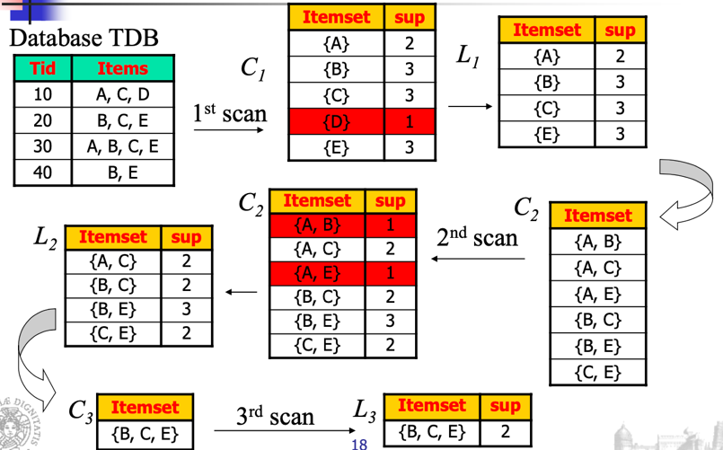

We start from our db that may contain some transactions.

We count the occurrence of the single item to establish if it is frequent or not.

If we assume minsup = 2, D is not a frequent pattern so we can eliminate if from the 1-itemsets frequent. We denote with Lk the frequent k-itemset.

With Ck we denotate the candidate k-itemset.

Now we generate all possible candidate 2-itemset and we consider, for the apriori property, all the 1-itemset frequent.

We consider {A, B} and not {B, A} because we are not interested in the order but only on occurrences.

We scan the DB to realize if these 2-itemsets are frequent.

We continue to discover super-items frequent of the 2-itemset, generating the 3 candidate itemsets, combining the two frequent itemset.

From the first two frequent 2-itemset we can generate {A, B, C} but the support of one subset is equal to 1, and for the apriori property if one of subsets is not frequent also the super-itemset is not frequent. For {A, B, E} and {A, C, E} we can do the same considerations.

The only combination that we are not able to discard is {B, C, E}, it has 2 as support.

### Pseudo Code

$C_k$: Candidate itemset of size k

$L_k$ : frequent itemset of size k

$L_1$ = {frequent items};

for (k = 1; Lk != $\emptyset$; k++) do begin

> $C_{k+1}$ = candidates generated from Lk;

> for each transaction t in database do increment the count of all candidates in $C_{k+1}$ that are contained in t

>$L_{k+1}$ = candidates in Ck+1 with min\_support

end

return $\cup_k L_k$;

This is a summarization of what we analyzed, starting from the set of frequent 1-itemset and generating candidate k-itemset until we have an empty set.

But how can we generate this candidate $C_{k+1}$ itemset?

### How is the Apriori property used in the algorithm?

Let us look at how $L_{k-1} is used to find $L_k$ for k $\geq$ 2. A two-step process, consisting of join and prune actions.

#### __The join step__:
in order to find $L_k$, a set of candidate k- itemsets, denoted $C_k$, is generated by joining $L_{k-1}$ with itself.

-   The notation $l_i$\[j\] refers to the jth item in $l_i$ ($l_1$\[k-2\] refers to the second to the last item in $l$).

-   For efficient implementation, Apriori assumes that items within a transaction or itemset are sorted in lexicographic order.

-   For the (k-1)-itemset, $l_i$ , this means that the items are sorted such that $l_i$\[1\] $<$ $l_i$\[2\] $<$ \... $<$ $l_i$\[k-1\].

We assume that in the transaction dataset the order is this lexicographic order that we impose. We generate the candidate items in this way from this order.

With this order we generate the candidate itemset.

The join, $L_{k-1} \bowtie L_{k-1}$, is performed, where members of $L_{k-1} are joinable if their first (k-2) items are in common:

The resulting itemset formed by the joining is:

We have the k-2 items of $l_1$ and $l_2$\[k-1\] as the k-th item in the k-itemset.

This join allow us to generate automatically all the possible candidate k-itemsets.

#### __The prune step__:
any (k-1)-itemset that is not frequent cannot be a subset of a frequent k-itemset, for the apriori property. Hence, if any (k-1)-subset of a candidate k-itemset is not in $L_{k-1}$, then the candidate cannot be frequent either and so can be removed from $C_k$.

If we discover that one subset itemset is not frequent we can remove directly the candidate itemset generated, like we did before.

For example we can suppose the minsup is 2.

We assume that the items are in lexicographic order, useful for us to check.

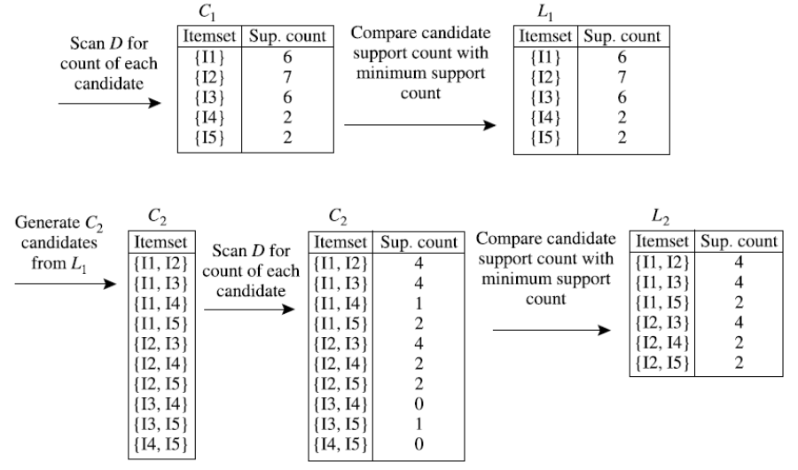

First we check if the 1-itemsets are frequent. We generate $C_2$ candidates, we don't apply directly the join because we don't have any k-1 equal items, we directly apply combinations. We could apply the join but the first part is empty.

We only consider $l_1$\[k-1\] $<$ $l_2$\[k-1\] and combine $l_1$\[k-1\] and $l_2$\[k-1\] in the 2-itemset.

We check if they're frequent and now we have to generate the candidate 3-itemsets.

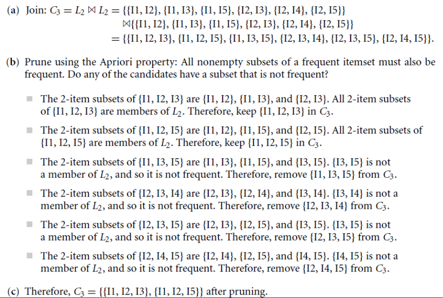

{I1 , I2} and {I1, I3} can be combined, the first element is in common, I2 is lower than I3 and from these two itemsets we generate the 3-itemset {I1, I2, I3}.

{I1, I2} and {I2, I3} cannot join, and so on.

Now we have to perform pruning checking if any of these 3-itemsets contain inside subsets not frequent, if this occur, we can remove the itemset without checking the frequency in the transactional database.

If both 2-itemsets are members of L2 we keep them.

Then we have to check if they are frequent.

$L_1$, $L_2$, $L_3$ are the itemset frequents I can generate.

If we want to return the closed itemsets to the user we should return {I1, I2}, the 2-itemset with support 2, or also {I1} and {I2}, the 1-itemsets with their support.

For the definition of closed itemsets we have to return all them, otherwise we lose information.

### Summary

The last procedure is the pruning step applied after the generation of the candidate itemset; it allows us to remove itemsets without checking if they're frequent.

With a low minsup we have a long process, we stop at a very high value of k.

We generate several k itemsets and we scan several times the database. The complexity can become larger.

Each time we must check if an itemset is frequent we must scan the db.

If the minsup is too high, we have the reduction of generation of candidate itemsets and reduce the number of scans in the db.

Once we have all the frequent itemsets we need to __generate association rules__.

Association rules can be generated by combining all the possible combination of items in the frequent itemsets in the antecedent and the consequent part.

The only constraint is that the itemset in the antecedent and the itemset in the consequent have empty intersection, they don't have items in common.

For each frequent itemset l, we generate all nonempty subsets of l. For every nonempty subset s of l, output the rule "s $\Rightarrow$ (l - s) if $\frac{support\_count(l)}{support\_count(s)} \geq min\_conf$, where min\_conf is the minimum confidence threshold.

$$
    Confidence(A \Rightarrow B) = P(B|A) = \frac{Support\_count(A \cup B)}{Support\_count(A)}
$$

The support of the rule is always higher than minsup because generating using the frequent patterns.

The confidence of an association rule is defined as the ratio of the support of the frequent pattern and the support of A.

We're looking for an high value of confidence because it tells us that when we have the antecedent we have a high probability to have the consequent.

But if the consequent is always present in our transactions, of course the confidence is high, but it doesn't mean A imply B really, that is there because it's always in the transactions.

We don't have a strong real correlation. If we have an high value of confidence, if it doesn't occur, the imply is real.

The choice of minsup can be very important: if we choose a high minsup we cannot discover rare item in the transaction.

The disadvantage of the __support__ is the __rare item problem__.

Items that occur infrequently in the data set are pruned although they would still produce interesting and potentially valuable rules. The rare item problem is important for transaction data which usually have a uneven distribution of support for the individual items.

We must find a value of minsup to extract the rare items.A problem with __confidence__ is that it is __sensitive__ to the frequency of the consequent in the database. Caused by the way confidence is calculated, consequents with higher support will automatically produce higher confidence values even if there exists no association between the items.

### Improving the efficiency of Apriori

The apriori algorithm is quite old, but have some limitations in term of computational effort.

Any itemset that is potentially frequent in DB must be frequent in at least one of the partitions of DB

Scan 1: partition database and find local frequent patterns

Scan 2: consolidate global frequent patterns

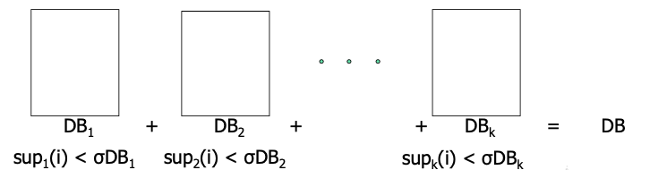

We divide the DB in n partitions (with empty intersection) and find frequent itemsets in local partitions.

We combine all local frequent itemsets and then find global frequent itemsets.

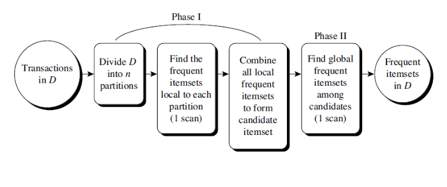

The idea is to apply the apriori algorithm in all partition to discover frequent itemsets.

If an itemset is not frequent in any database, the itemset can not be frequent in general.

This is a way to reduce the number of itemsets we need to check.

#### __DHP: Reduce the number of candidates__

Another approach to increase the efficiency of the algorithm is to use an hash table for the itemset.

When scanning each transaction in the database to generate the frequent 1-itemsets, $L_1$, we can generate all the 2-itemsets $C_k$, for each transaction, hash (i.e., map) them into the different buckets of a hash table structure, and increase the corresponding bucket counts.

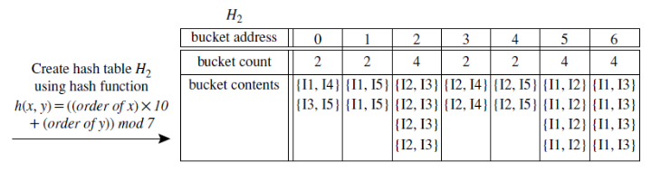

If a bucket count is lower than minsup we can say that all the contents of the bucket are not frequent. This is a way to reduce the 2-itemsets to consider in the next step.

In this example, {I1, I4} = 1 \* 10 + 4 = 14 mod 7 = 0.

A k-itemset whose corresponding hashing bucket count is below the threshold cannot be frequent

-   __Candidates__: I1, I2, I3, I4, I5, I6

-   __Hash entries__ : {I1I4, I3I5} , {I1I5} ,...

I1I4 is not a candidate 2-itemset if the sum of count of {I1I4, I3I5} is below support threshold

#### __Sampling for Frequent Patterns__

-   Select a sample of the original database

-   Mine frequent patterns within sample using Apriori

    -   Possibly use a lower support threshold

-   Scan database once to verify frequent itemsets found in sample, only borders of closure of frequent patterns are checked

    Example: check abcd instead of ab, ac, \..., etc.

-   Scan database again to find missed frequent patterns using the concept of negative border. The negative border contains the "closest" itemsets that could be frequent. Given a collection S in P(R) of sets, closed with respect to the set inclusion relation, the negative border of S consists of the minimal itemsets X in R not in S.

#### __DIC: Reduce Number of Scans__

The Database is partitioned into blocks.

Once both A and D are determined frequent, the counting of AD begins (start point)

Once all length-2 subsets of BCD are determined frequent, the counting of BCD begins

The idea is to anticipate the scanning of the DB for checking if we have 2-itemsets frequent. During the scan of the database we see that A and D are frequent and we also start to scan also the 2-itemset AD.

<!--  -->

-------------------------------------------------------------

We can try to improve performances but we always have some __bottlenecks of the apriori algorithm__.

Apriori uses a generate-and-test approach $\rightarrow$ generates candidate itemsets and tests if they are frequent (Breadth-first (i.e., level-wise) search.

Generation of candidate itemsets is expensive (in both space and time)

If there are 104 frequent 1-itemsets, the Apriori algorithm will need to generate more than 107 candidate 2-itemsets and it also has to check them all.

To discover a frequent pattern of size 100, it has to generate at least 2100 -1 candidates in total.

We need to avoid to generate this large amount of candidate itemsets.

Support counting is expensive

-   Subset checking (computationally expensive)

-   Multiple Database scans (I/O)

-   Breadth-first (i.e., level-wise) search: may need to generate a huge number of candidate sets

## FPGrowth Approach: Mining Frequent Patterns Without Candidate Generation

The FPGrowth Approach allows frequent itemset discovery without candidate itemset generation. It is a two step approach:

-   __Step 1__: Build a compact data structure called the FP-tree. It is built using only 2 scans over the data-set and it will be a summarization of the DB.

-   __Step 2__: Extracts frequent itemsets directly from the FP-tree. We do not need to access the DB. If it is compact and can be stored in main memory we save a lot of effort.

It is a depth-first search algorithm.

The major philosophy is to grow long patterns from short ones using local frequent items only .

If "abc" is a frequent pattern, we get all transactions having "abc", i.e., project DB on abc: DB\|abc. With this projection we can discover others frequent itemsets.

If "d" is a local frequent item in DB\|abc $\rightarrow$ abcd is a frequent pattern.

We work with projections of the DB.

### FP-Tree Approach

-   First, it compresses the database representing frequent items into a frequent pattern tree, or FP-tree, which retains the itemset association information. It summarized the DB but without losing information.

-   Then divides the compressed database into a set of conditional databases (a special kind of projected database), each associated with one frequent item or "pattern fragment," and mines each database separately. We split the problem in these databases starting from frequent items.

-   For each "pattern fragment," only its associated data sets need to be examined. Therefore, this approach may substantially reduce the size of the data sets to be searched, along with the "growth" of patterns being examined.

#### __FP-Tree Construction__

We need to represent the DB with a FP-Tree, which is constructed using 2 passes over the data-set:

__Pass 1__:

-   Scan data and find support for each item.

-   Discard infrequent items.

-   Sort frequent items in decreasing order based on their support.

We use this order when building the FP-Tree, so common prefixes can be shared.

__Pass 2__:

We generate the FP-Tree. Nodes correspond to items and have a counter.

-   FP-Growth reads 1 transaction at a time and maps it to a path in the FP-Tree.

-   Fixed order is used, so paths can overlap when transactions share items (when they have the same prefix ). In this case, when we add shared paths the counters are incremented

-   Pointers are maintained between nodes containing the same item, creating singly linked lists (dotted lines). The more paths that overlap, the higher the compression. FP- tree may fit in memory. It is fundamental because it avoids to have swapping.

-   Frequent itemsets are extracted from the FP-Tree.

#### __Step 1: FP-Tree Construction__

Suppose we have this transaction dataset. We generate the FP-Tree using this database.

We start with the first transaction {a,b}.

When we build FP-Tree the root node is null, just a starting point. The first path consists in a and b and we reproduce this transaction as a path of FP-Tree, that has in sequence the most frequent items of the transaction.

The second transaction starts with a different item respect to the first transaction, we need to create another path. The dashed line with the arrow is the link that connects nodes with the same item. We cannot use one single node, we use this link to count how many occurencies of the same item we have in the FP-Tree.

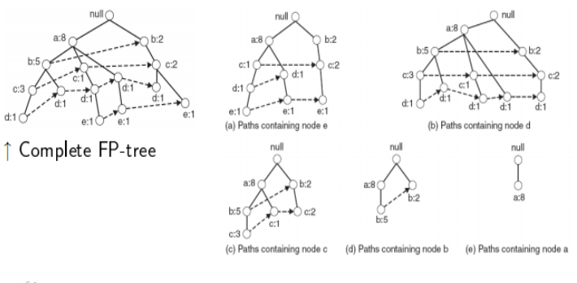

In the third transaction we see that the first item is consistent with the first of the first transaction, we already have a path and we can exploit it.

We generate a path starting from 'a', without duplicating it but simply increasing the counter.

If we navigate the FP-tree we can discover all transactions we have in the original DB.

If we have transactions with different items we have the problem to reproduce the path without any common nodes, we increase the size of the tree and considering we have to create paths and arrows, the occupation of memory is high.

Thanks to the fact that a lot of paths share same nodes we get a more compact representation than the DB.

The FP-Tree usually has a smaller size than the uncompressed data - typically many transactions share items (and hence prefixes).

-   Best case scenario: all transactions contain the same set of items: 1 path in the FP-tree

-   Worst case scenario: every transaction has a unique set of items (no items in common) In this case the size of the FP-tree is at least as large as the original data. The storage requirements for the FP-tree are higher - need to store the pointers between the nodes and the counters.

The size of the FP-tree depends on how the items are ordered. Ordering by decreasing support, in this way we have most frequent items close to the root, is typically used but it does not always lead to the smallest tree (it\'s a heuristic).

We also are using a parameter, we are talking about frequent patterns, so we are fixing the minsup. If we fix an high minsup we have a compressed tree.

If the value is low we expect that the FP-tree will be larger.

#### __Step 2: Frequent Itemset Generation__

The FP-Growth algorithm extracts frequent itemsets from the FP-tree, doesn't work on the DB.

We need to scan the DB only twice, once to scan frequent items and one to generate the FP-Tree.

It is a bottom-up algorithm, from the leaves towards the root.

It uses a divide and conquer approach: first look for frequent itemsets ending in one item and then itemsets consisting of that item and another, first e, we focus on all FP-Trees including e then de, etc. . . then d, then cd, etc. . .

We first extract prefix path subtress ending in item and then we work directly to discover all frequent patterns including that item locally with the subtree. (use the linked lists)

Suppose we have extracted this FP-Tree:

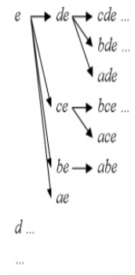

We start from the item with the lowest frequency and we want to extract all itemsets including e. We extract subtrees with e in the leaves. That is the subtree with prefix 'e'.

We can then extract with prefix d with the same considerations. That will be the subtree for prefix 'd', and so on.

Each prefix path sub-tree is processed recursively to extract the frequent itemsets. Solutions are then merged.

We look for e and we ensure that all itemsets including e are inside in this subtree.

If we want to discover all itemsets including e we can focus only on the subtree.

E.g. we consider first the prefix path sub-tree for e and it will be used to extract frequent itemsets ending in e, then in de, ce, be and ae, then in cde, bde, cde, etc.

We use a divide and conquer approach. We start with the tree including e, we focus then on de and so on.

When we select the sub-tree 'de' it refers all transactions in which we have the pair (d,e).

### Conditional FP-Tree

The __Conditional FP-Tree__ is the FP-Tree that would be built if we only consider transactions containing a particular itemset (and then removing that itemset from all transactions).

Example: FP-Tree conditional on e.

We consider only transactions in which e appears without seeing that in the tree.To extract a FP-Tree conditional to a specific item consists in extracting the part of FP-Tree corresponding to the transactions in the DB in which the prefix is included.

Let minSup = 2 and extract all frequent itemsets containing e.

We want to obtain the prefix path sub-tree for e:

We use the overall complete FP-Tree and we analyze paths ending in 'e'.

1.  Check if e is a frequent item by adding the counts along the linked list (dotted line). If so, extract it. We have to check if e is a frequent item by adding the counters in the link list (with arrow). Yes, count =3 so {e} is extracted as a frequent itemset.

2.  As e is frequent, find frequent itemsets ending in e. i.e. de, ce, be and ae.

3.  Use the conditional FP-tree for e to find frequent itemsets ending in de, ce and ae. Note that be is not considered as b is not in the conditional FP-tree for e. We have that the path bce is only one transaction even if b has two as value of the counter, because e has 1 as value of the counter. be is not frequent.

For each of them (e.g. de), find the prefix paths from the conditional tree for e, extract frequent itemsets, generate conditional FP-tree, etc\... (recursive)

Example: e $\rightarrow$ de $\rightarrow$ ade ({d,e}, {a,d,e} are found to be frequent)

We generate the conditional FP-Tree for de and then for ade. We eliminate c because it cannot generate frequent itemsets with d and e.

We generate conditional FP-Tree only for frequent itemsets.

Example: e $\rightarrow$ ce ({c,e} is found to be frequent)

We can stop there because we don't have a conditional FP-tree for ce.

Frequent itemsets found (ordered by suffix and order in which they are found):

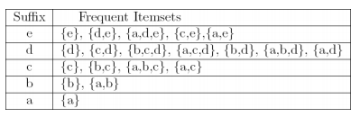

### __Advantages__ of FP-Growth:

-   only 2 passes over data-set, independently on the value of the minsup

-   "compresses" data-set

-   no candidate generation

-   much faster than Apriori

### __Disadvantages__ of FP-Growth:

-   FP-Tree may not fit in memory, we are obligated to swap-in/swap-out, reducing also the advantage of compression

-   FP-Tree is expensive to build

Let\'s see another example.

We have a DB of transactions, we generate this FP-tree and in the structure we also have this table with all items in descending order and from the table we have a link to the first node of the tree, which have links to other nodes with the same item.

We focus on i5 and analyze if we have conditional FP-trees and frequent patterns to generate.

We can generate the conditional FP-tree for i5.

We discard i3 because it is included in only one path in which we have i5.

Then we can generate frequent patterns.

In I4 conditional FP-Tree we discard I1 because we have only one possible path which include I4.

We have I2 with support 4 because we have 2 paths with support 2.

### Algorithm

This is a description of the __algorithm__.

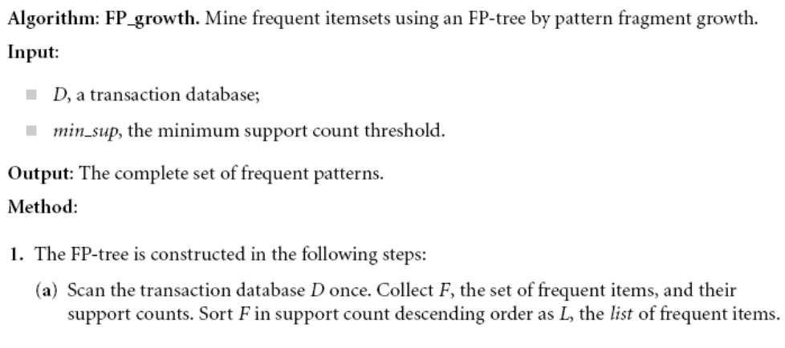

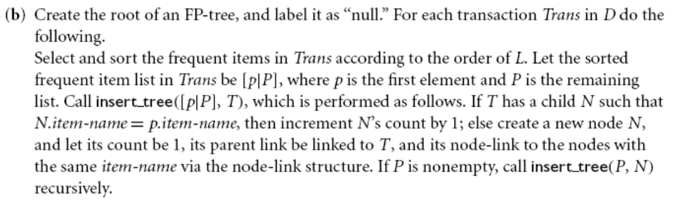

### __Benefits__ for the FP-Tree Structure:

-   Completeness. It preserves complete information for frequent pattern mining. It never breaks a long pattern of any transaction.

-   Compactness. It reduces irrelevant info---infrequent items are gone. We have items in frequency descending order: the more frequently occurring, the more likely to be shared.It can never be larger than the original database (not count node-links and the count field)

## __The Frequent Pattern Growth Mining Method__

When the database is large, it is sometimes unrealistic to construct a main memory-based FP-tree.

We have an alternative.

-   first partition the database into a set of projected databases,

-   then construct an FP-tree and mine it in each projected database

-   This process can be recursively applied to any projected database if its FP-tree still cannot fit in main memory.

A study of the FP-growth method performance shows that it is efficient and scalable for mining both long and short frequent patterns, and is about an order of magnitude faster than the Apriori algorithm.

### Comparison

This is the comparison of performance in large datasets:

In x we have the value of the support, and when it increases the run time decreases.

If it is high, the run-time value is comparable, also the number of scans performed by apriori is in fact low. Iterations stop really soon.

The apriori algorithm run time with a low value of support is not manageble.

We have this increase because some items were not really frequent with low values of minsup, we have an increase of items becoming frequent.

### Divide-and-conquer:

-   Decompose both the mining task and DB according to the frequent patterns obtained so far

-   Lead to focused search of smaller databases

Other factors:

-   No candidate generation, no candidate test

-   Compressed database: FP-tree structure

-   No repeated scan of entire database

-   Basic ops: counting local freq items and building sub FP-tree, no pattern search and matching

A good open-source implementation and refinement of FPGrowth is FPGrowth+.

We also have further improvements of FPGrowth.

## ECLAT: Frequent Pattern Mining with Vertical Data Format

With the previous algorithms you can find all frequent patterns.

The last approach work with the vertical format.

For now we worked with horizontal format, for each transaction we had the item involved.

In this format for each itemset we store the list of transaction in which we can find the itemset.

We can use the standard apriori approach, consider 1 itemset, compute the set of transaction with the itemset and compute the 2-itemset.

If the 2-itemset is frequent, here we don't have to scan the dataset, we have to compute the cardinality of the intersection between the set of transactions corresponding to the item involved in this itemset and the other, and if is higher than the minsup, the itemset is frequent.

At the end we have the set of transaction supporting the itemset.

When we want to compute the support of {I1, I2} we compute the intersection and discover that it's supported by those transactions.

The cardinality of the itemset decreases with the increase of items in the itemset.

We have to store a lot of data as disadvantage, we need to explore all transaction, but an advantage is that there is no need to scan the overall dataset.

Independently of the algorithm we obtain the same result.

Fixed the minsup we obtain the same frequent patterns.

## Pattern Evaluation Methods

Let's suppose we have 10000 customer transactions analyzed and we realize that:

-   6000 include computer games

-   7500 include videos

-   4000 include computer games and video

$$
    buys(X, "computer\ games") \Rightarrow buys(X, "videos")
$$

$$
    [support = 40\%, confidence = 66\%]
$$

The support is quite high, a lot of transactions support this rule.

This value of confidence says that this rule proves that exists correlation between them.

The rule is misleading because the probability of purchasing videos is 75%, which is even larger than 66%. Computer games and videos are negatively associated because the purchase of one of these items actually decreases the likelihood of purchasing the other.

By purchasing together the product we reduce the probability to reduce the single product separately. They are negatively associated, one purchase of one of these items decrease the purchase of the other.

When the consequent is highly probable, the confidence present an high value but it doesn't mean a correlation between the antecedent and the consequent.

To reduce this problem another metric was introduced, the __lift__.

### __Lift__

$$
    lift(A\rightarrow B) = lift(B\rightarrow A) = \frac{Conf(A\rightarrow B)}{supp(B)} = \frac{Conf(B\rightarrow A)}{supp(A)} = \frac{P(A \cup B)}{(P(A)P(B))}
$$

Lift of A $\rightarrow$ B (A imply B) is defined as the ratio between the confidence of A $\rightarrow$ B (A imply B) and the support of B.

It can be interpreted with that ratio of probabilities.

Lift measures how many times more often X and Y occur together than expected if they were statistically independent.

If we consider the definition in terms of probabilities, we have the joint probabilities between A and B divided by the product of probabilities.

If they are not correlated the lift tend to be 1.

If I'm far from 1, I can assume there's a correlation.

If it's higher than 1 we have a positive correlation, if lower I'm decreasing the probability.

Lift is not down-ward closed and does not suffer from the rare item problem.

Rare itemsets with low counts (low probability) which per chance occur a few times (or only once) together can produce enormous lift values. It is a measure that gives us the possibility to investigate correlation between rare itemsets.

Let's see this example:

||Basketball|Not basketball|Sum (row)|
|-|-|-|-|
|Cereal|2000|1750|3750|
|Not cereal|1000|250|1250|
|Sum (col.)|3000|2000|5000|

Play basketball $\Rightarrow$ Eat cereal \[40%, 66.7%\] is misleading

The overall % of students eating cereal is 75% \> 66.7%. The probability decreases. Play basketball $\Rightarrow$ Not eat cereal \[20%, 33.3%\] is more accurate, although with lower support and confidence.

$$
    lift = \frac{P(A \cup B)}{P(A)P(B)}
$$

The two lifts are close to 1, but the second is more far away than the first.

These two values tell us that there's no strong correlation between the 2 because lift is close to 1.

We can also use another metric, the chi-square metric.

We have a negative correlation because $x^2$ is quite high, negative because we can plot this value and understand that there's a negative correlation.

These metrics suffer from a generic problem: support and confidence 
are not good to indicate correlations.

## Measures used for comparison

Over 20 interestingness measures have been proposed. The best metrics are:

-   __All\_confidence \[0,1\]__:

$$
    All\_conf(A,B) = \frac{sup(A \cup B)}{max\{sup(A), sup(B)\}} = min\{P(A|B),P(B|A)\}
$$

-   Max\_confidence \[0,1\]:

$$
    Max\_conf(A,B) = max \{P(A|B),P(B|A)\}
$$

-   Kulczynski \[0,1\]:

$$
    Kulc(A,B) = \frac{1}{2}(P(A|B)+P(B|A))
$$

-   Cosine \[0,1\]:

$$
    cosine(A,B) = \frac{P(A \cup B)}{\sqrt{P(A) \times P(B)}} = \frac{sup(A \cup B)}{\sqrt{sup(A) \times sup(B)}} = \sqrt{P(A|B) \times P(B|A)}
$$

Let's see an example with a contingency table:

Let's take the D1 dataset, $x^2$ is high (strong correlation), lift is high (strong correlation) and the 4 metrics have high value (strong correlation, they vary from 0 and 1). But if we see the transactions with mc, we have 10.000 transactions with milk and coffee of 11.000 with milk. There is a strong correlation.

In $D_2$ we don't change mc, $\overline{m}c$ , $m\overline{c}$ but we change $\overline{mc}$, transactions in which milk and coffee do not appear.

$x^2$ tells us they are independent; life tells us that they are independent but those values tell us we have a strong correlation.

The problem is in $\overline{mc}$, null-transactions as they are called, they affect $x^2$ and lift because they are metrics that are known as null-variant while the others are null-invariant, independently of null transactions the result is the same.

Looking at Kulczynski, in the definition we are computing P(B|A) which is the probability of transaction in which we have AB divided by the total number of transactions of A, plus P(B!A) which is the probability of transaction in which we have AB divided by the total number of transactions of B. If you consider this probability, the total number of transactions, n, is expressed in the numerator and denominator so you can cancel it. This is the reason why the average is not affected on the total number of transactions but only on the transactions in which we have A, in which we have B and in which we have A and B together.

## Is __Lift__ a good measure for correlation?

In the lift we have:

$P(A) = \frac{nA}{n}$, $P(B) = \frac{nB}{n}$, $P(AB) = \frac{nAB}{n}$. When we compute the lift, in the denominator we have $2*n$, this means we cannot simplify it and we have the dependency on n in the lift. This is the reason why the lift is not null-invariant, we have the dependency on the overall number of transactions.

If we want to analyze the correlation between milk and coffee, we should use null-invariant metrics because not affected by null transactions.

But in D3, we analyze form $x^2$ and lift a strong correlation but from the other 4 values we see a value close to 0.

Coffee is present in 1100 transactions but only in 100 transactions they appear together. The correct metrics are the last four.

$x^2$ and lift are not good metrics for understanding the correlation.

These 4 metrics are similar, or we have a more reliable metric?

In D4 we have that a strong correlation for $x^2$ and lift, while we have 0.5 for those metrics. Analyzing the dataset, we can deduce 0.5, we in fact have $\frac{1000}{2000}$.

In D5 we have that those 4 metrics disagree, $Max\_conf$ tells us strong correlation, $All\_conf$ that tells us not correlation, Kulc tells in the middle and cosine low correlation.

If we analyze the data, coffee is present in 1100 and milk in 10100 and milk and coffee together are present in 1000. From the coffee point of view, we see a strong correlation, while form the milk point of view we can see a low correlation.

From the definition of metrics, we have different values. The more reliable index is the Kulc. because give me the information that I cannot decide for correlation.

If we consider D6, again Kulc. is in an intermediate situation. In fact, milk and coffee are in balance. Just one of 2 variables have an high number of transaction in respect to the other.

The last 4 metrics offer us a more reliable conclusion, they are __null-invariant__.

But considering, the last 4 metrics we have just to make consideration when our dataset is imbalanced.

### Imbalance Ratio (IR)

We need to compute the IR (Imbalance Ratio), that measures the imbalance of two itemsets A and B in rule implications:

$$
    IR(A,B) = \frac{|sup(A) - sup(B)|}{sup(A) + sup(B) - sup(A \cup B)}
$$

If IR is high, the reliability of the metrics cannot be guaranteed.

If IR is low and Kulc. indicates 0.5 we really have an intermediate situation, while if IR is high, we cannot really have a reliable conclusion. The IR brings us to not make reliable conclusions.

|Data|$mc$|$\overline{m}c$|$m\overline{c}$|$\overline{mc}$|$All\_conf$|$Max\_conf$|$Kulc$|$cosine$|$IR$|
|-|-|-|-|-|-|-|-|-|-|
|$D_1$|10.000|1.000|1.000|100.000|0.91|0.91|0.91|0.91|0.0|
|$D_2$|10.000|1.000|1.000|100|0.91|0.91|0.91|0.91|0.0|
|$D_3$|100|1.000|1.000|100.000|0.09|0.09|0.09|0.09|0.0|
|$D_4$|1.000|1.000|1.000|100.000|0.5|0.5|0.5|0.5|0.0|
|$D_5$|1.000|100|10.000|100.000|0.09|0.91|0.5|0.29|0.89|
|$D_6$|1.000|10|100.000|100.000|0.01|0.99|0.5|0.10|0.89|

Kulczynski and Imbalance Ratio (IR) together present a clear picture for all the three datasets D4 through D6

-   $D_4$ is balanced & neutral

-   $D_5$ is imbalanced & neutral

-   $D_6$ is very imbalanced & neutral

We can see in fact that when we have an imbalance ratio in Kulczynski we have that one probability tend to be equal to 1 and the other very low and the average is close to 0.5.
