# Classification

Classification is a technique in which we predict categorical class labels (discrete or nominal) and the aim is to generate a model that classifies labeled data (constructs a model) based on the training set (set of object with an associated class) and the values (class labels) in a classifying attribute and uses it in classifying new data, unlabeled objects. We learn the model (learning phase) and then we use the model to classify unlabeled data live (classification phase).

Typical applications:

- Spam/non spam emails: based on the number of occurrencies of each word classify if it's spam or not spam

- Credit/loan approval: if a loan applicant is safe or risky

- Medical diagnosis: if a tumor is cancerous or benign

- Fraud detection: if a transaction is fraudulent

- Web page categorization: which category it is

Numeric Prediction models continuous-valued functions, i.e., predicts unknown or missing values.

Classification is a two-step process.

The first step is model construction (learning step or training phase), where a classifier is built describing a set of predetermined classes or concepts by exploiting a set of tuples/samples.

A tuple is represented by an n-dimensional attribute vector (or feature vector) X = (x1, x2, \..., xn).

Each tuple/sample is assumed to belong to a predefined class, as determined by the class label attribute. The set of tuples used for model construction is denoted as training set. The model is represented as classification rules, decision trees, or mathematical formulae.

The second step consists in model usage for classifying future or unknown objects.

We estimate the accuracy of the model, to be sure that it works properly,The known label of test sample is compared with the classified result from the model.

Accuracy rate is the percentage of test set samples that are correctly classified by the model (valid if the dataset is not imbalanced). It's important to know about the distribution of the classes. If we have a strong majority class and a classifier that answers always the majority class, in this way we have a high accuracy but it's not high. We must be able to understand the ability to discriminate between classes. If the dataset is balanced the accuracy, is a good metric. We need to compare the classifiers in an affidable way.

Test set is independent of the training set. We need it to measure the accuracy and find the best model to use, we known the label even for the test set.

We need to see if the classifier can generalize.If the accuracy is acceptable, we can use the model to classify data tuples whose class labels are not known.

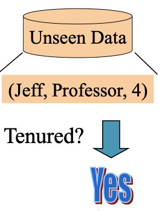

In this example the classifier is a rule, which has the characteristic to be interpretable.

Explainable AI is important, people want to understand how the system produces the output. People can believe in AI this way. It's also important for legal aspects, we must understand for a legal point of view if an accident is a choice or a chance.

Tenured is the class we want to predict. We use a trainset of 6 objects, described by 3 attributes.

Typically, the name is not relevant for the classification.

We can generate the rule we see in the right.

This is an easy rule because the number of instances is low and so is the number of classes.

In the classification step we analyze objects consisting of the same description of the training set, but we didn't use them to train the model.

Known the test set, we can compare classes in the test set with classes predicted by our model.

We have different models we can use; we have to test them.

The classification time is fundamental, a user want to have answers in a very short time.

It's preferable to spend shorter time in the second phase rather than the first, in which engineers set parameters.

## Difference Between Classification and Clustering

- __Supervised learning__ (classification)

> In these approaches we exploit the supervision, which is the training data (observations, measurements, etc.), accompanied by labels indicating the class of the observations

New data is classified based on the training set

- __Unsupervised learning__ (clustering)

The class labels of training data is unknown.

> Given a set of measurements, observations, etc. the aim is to establish the existence of classes or clusters in the data. We just exploit some characteristics of these data.

- We also have semi-supervised learning in which we approach characteristic of both approaches.

## Preliminary Step: Preprocessing

Before making use of classification, we need to __prepare data__.

- Data cleaning: preprocessing of data for removing or reducing noise and treating missing values

- Relevance Analysis: many of the attributes may be irrelevant for the classification problem, without losing information, without changing our classification problem.

    - Correlation Analysis

    - Attribute subset selection (or feature subset selection)

> Ideally, the time spent on relevance analysis should be less than the time that would have been spent on learning from the original set of attributes

- Data Transformation and Reduction

    - Normalization: scaling the values for a given attribute so that they fall within a small, specified range

    - Reduction

- Generalization to higher level concepts. For instance, numeric values for attribute income can be generalized as low, medium, and high

    - several methods (wavelet transform, principle component analysis, discretization techniques such as binning, histogram analysis and clustering)

    - Discretization: exploit ground truth for determining an optimal discretization of continuous-valued attributes

- Some learning algorithms proposed in the literature are applicable only to categorical attributed

- Especially when dealing with big data, performing discretization concurrently with learning can be very computationally expensive

- Typically use of heuristic approaches based on specific metrics

> We need to discretize the variables in a way that allow us to improve as much as possible our classification performance.

### Discretization Technique

For discretization we can use the __Fayyad and Irani approach__ (1992).

- Objective: to find an optimal partition for each continuous-valued attribute A. Partitions are determined by a set of cut points.

This approach is supervised, we exploit the knowledge of classes.

- Observation: in the original paper the authors prove that the optimal cut points for the metrics used by them lie always between two examples of different classes in the sequence of sorted values of attribute A.

> 

Along this continuous variable we have several values associated to a specific class.

The optimal cut is in the middle of instances between different classes.

Definition: the potential cut point T is a boundary point b if in the sequence of examples sorted by the value A, there exist two examples, e1 and e2, having different classes, such that A(e1) \< T \< A(e2) and there exists no other example e' such that A(e1) \< A(e') \< A(e2). Let us assume that b is the midpoint value between A(e1) and A(e2).

This potential cut point is in the middle of two points belonging to two different classes.

Let BA be the set of all candidate boundary points for attribute A.

#### __Entropy for the best cutpoint__

The algorithm exploits the entropy as quality measure to find the best boundary cutpoint.

Let S be the set of examples. Let there be k classes C1, \..., Ck.

Let P(Ci,S) be the proportion of examples in S that have the class Ci.

The class entropy of a subset S is defined as:

P(Ci, S) = Probability of having Ci.

If in S we have only one class, k = 1, the Entropy is 0.

For the only class we have the log equals to 0, and for the other the probability is 0.

The worst case is in equal-probability classes, this is the higher level of confusion.

If I select an interval and the probability of having classes is the same for all classes, this interval doesn't allow me to discriminate classes.

We should reach intervals with low value of entropy.

The idea is to split the continuous variable in such a way that each interval is characterized with low entropy, I'm going forward my optimal solution, where I have intervals in which I have only one class, in that case we talk of pure partitions.

Let T a cut points in BA. Set S is partitioned in the subsets S1 and S2, where S1 contains the subset of examples in S with A-values not exceeding T and S2 = S- S1. The class information entropy of the partition induced by T, denoted as EP(A, T; S), is defined as:

The cut point TA for which EP(A, TA; S) is minimal amongst al the candidate cut points is taken as the best cut point

We look for the cutpoint for which the entropy is minimal among all possible cutpoints.

This cutpoint is obtained like in the formula.

When I cut S with TA, S1 is the set in the left of the cutpoint and S2 is the set in the right.

The ratio we have in the formula is given by the cardinality of S1 over the number of points, it gives us the probability of having values inside the set S1, and these two probabilities weight the entropy of S1 and S2.

The algorithm first partition S, find the optimal cutpoint and then repeat the process in S=S1 and S=S2.

The we split again until a stopping condition is met.

The stopping condition is defined as:

(Not important to remember)

This approach has the advantage to have a stopping condition, we don't have to fix anything.

At the end of the approach, we have intervals that discretize our continuous variable, which become an ordinal variable.

Each value in each sub-partition will be replaced with a specific label.

We try to find best intervals thinking about what we want to reach at the end, it is a supervised approach.

# Comparing Classification Methods

- Accuracy: to understand how many records are being classified correctly.

- Speed:

    - time to construct the model (training time)

    - time to use the model (classification/prediction time)

- Robustness: handling noise and missing values. Machine learning models are under attack, if you use specific training sets you can let the classifier to learn wrong models

- Scalability: efficiency in disk-resident databases. Expecially in the learning phase it's important if we have many instances, swapping can be very consuming.

- Interpretability: understanding and insight provided by the model, to convince people.

- Other measures, e.g., goodness of rules, such as decision tree size or compactness of classification rules. Measures specific to specific types of classifiers.

We will analyze in detail accuracy and interpretability.

## Decision Tree

The decision tree: learning of decision trees from class-labeled training tuples

The Decision Tree is a flowchart-like tree structure, where:

- each internal node (non-leaf node) denotes a test on an attribute,

- each branch represents an outcome of the test

- each leaf node (terminal node) holds a class label.

 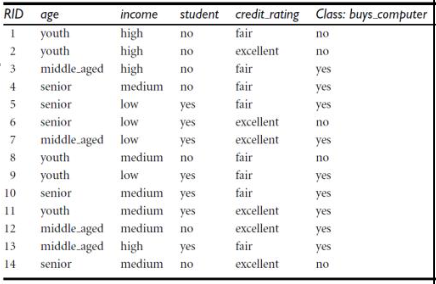

During the classification phase, depending on the specific value, we follow one of the branches of the built decision tree.

How decision tree are used for classification? Given a tuple, the attribute values of the tuple are tested

against the decision tree.

### Decision Tree Classifier Advantages

- No domain knowledge, we don't need to know about the specific application

- No parameter setting

- Can manage high-dimensional data. Some attributes are not used in the decision tree if not useful. During the building we also perform attribute selection.

- Representation intuitive and easy to assimilate

### How does Decision Tree Work?

We need to understand why we use a specific attribute on the root and some of the others after.

The choice of these attributes affect the final result and the size of the decision tree.

We need to select the optimal attribute for each deicision node.

The basic algorithm is a __greedy__ algorithm - follows the problem solving heuristic of making the locally optimal choice at each stage with the hope of finding the global optimum. It's not sure that we achieve it but we may achieve a close solution in short time.

- Tree is constructed in a __top-down__ recursive divide-and- conquer manner

- At start, all the training examples are at the root

- __Attributes are categorical__ (if continuous-valued, they are discretized in advance, actually in some approaches It happens on the applying)

- Examples are partitioned recursively based on selected attributes

- Test attributes are selected on the basis of a heuristic or statistical measure (e.g., information gain)

Let's see the __conditions for stopping partitioning:__

- All samples for a given node belong to the same class, we already solved our problem. We do not need to exploit more.

- There are no remaining attributes for further partitioning -- majority voting is employed for classifying the leaf. We explored all attributes, we transform this node in a leaf and we associate the majority class.

- There are no samples left, we classified all samples in the training set

The strategy for selecting the attributes is to select the attributes that guarantee to create partitions at each branch as pure as possible.

A partition is pure whether all the tuples in it belong to the same class.

Let's see the attribute selection measure.

Let D be a training set of class-labeled tuples.

Suppose that the class label attribute has m distinct values defining m distinct classes, Ci (for i=1,..,m).

- Select the attribute with the highest information gain. To define it we need to define the probability (pi) that an arbitrary tuple in D belongs to class Ci, estimated by \|Ci, D\|/\| D \|

#### __Info Gain__

The info gain is based on the computation of the information entropy.

Expected __information__ (__entropy__) needed to classify a tuple in D:

> \
> Observe: pi is the probability of class i in D
>
> When a probability of a class is 1, info(D) is 0. If the entropy is 0 it means that in D we have only instances belonging to the same class.

This is the plot in a two classes problem of the probability from 0 to 1 of one class, the other is just opposite of course.

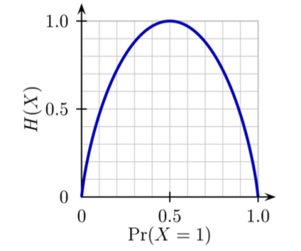

When the probability of one class is 0 the entropy is 0, the same for 1.

When the probability is 0.5 we have a lot of confusion and the entropy is maximum.

All the training set at the beginning is in the root. We first compute the entropy of the overall training set, if it is equal 0 all the instances in the training set belongs to just one class and the problem is solved.

We have to decide the attribute to put in the root, we should choose it in such a way that we go towards pure partitions.

If we discover that we created only pure partitions we need only this attribute to classify the dataset.

Suppose that we split D into v partitions {D1, \..., Dv} and we choose the attribute A having v distinct values {a1,\...,av}. Information needed (after using A to split D into v partitions) to classify D:

We compute the entropy of Dj where Dj contains all the tuples in D with value aj for A.

\|Dj\| is the cardinality of the set of objects in D with value for A equal to aj.

We compute the entropy of this instances and we weight each Dj with this probability, comuted as number of object in Dj over number of object in D, probability to have value aj for the attribute A.

If A is the optimum attribute, it must be able to split the training set in pure sets, each set contains only instances belonging to the same class.

This situation is reached when Info(Dj) = 0, we have then a pure partition.

We want to select the attribute that split the training set in subsets pure.

We need to weight it because Info(Dj) can be different than 0, and we can have a pure partition with only 1 instance and all others with a lot of instances.

If I just adopt the average without weight, the pure partition have only one instance and we get confused.

We need to test all attributes and we choose the attribute with the highest level of __information gain__:

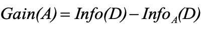

If Gain(A) = Info(D) we are in the best situation.

#### __Example of Info Gain with Decision Tree__

Let's suppose to have a db of 14 samples and we want to understand if the customer will buy or not the computer.

We need to compute of the overall training set, all the objects inside.

The probability of having class yes is the number of instances in which we have yes, and the probability is 9/14.

We compute the entropy of the overall dataset.

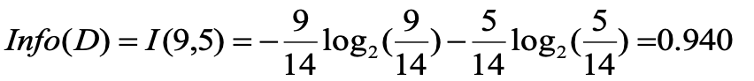

We get a high value of entropy.

We decide to select one attribute to improve this situation. We must test all 4 attributes to decide which is the best.

We analyze the attribute age, that can have 3 different values.

We compute:

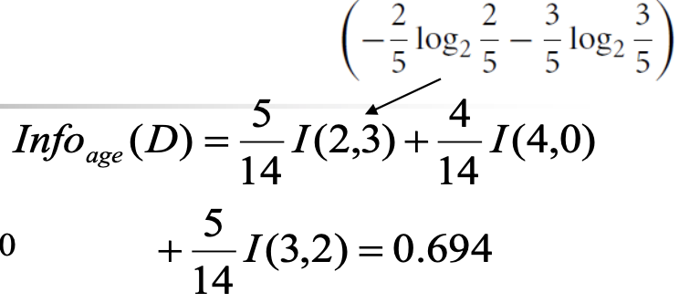

We consider the probability for that value \* the information related to the subset identified by value of age = youth.

We have 3 instances with value age = youth with class no and 2 instances with class yes.

The info related to the subset identified corresponds to this application of the entropy:

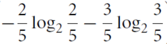

We apply the same for age = medium and old, and we get the info for this attribute.

We select the attribute with the highest value of gain:

Similarly:

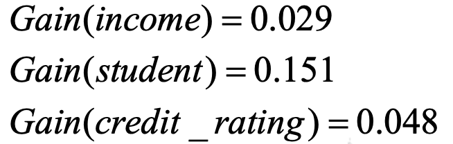

So, we select age as attribute to use in the root.

Age is the best attribute for the root node.

It splits the training set in 3 subsets characterized by the three values of age: youth, middle\_age, and senior.

We can't stop here because if we see the distribution of classes, we don't have pure partitions, we have more than one class.

We have a pure partition for middle\_aged, I have the same class and that's a termination condition, that subset mustn't be split more.

If I discover that value for age, I can conclude that the age is yes.

We will repeat the process for the others with other attributes, stopping conditions aren't satisfied.

We will assume now that D is Dage=youth in the left, we will have a smaller training set.

We will consider only the remaining attributes.

We will follow the decision tree following the values of the attributes.

If we don't have remaining attributes but more classes, we will transform the subset in a leaf associating it the majority class.

### Decision Tree Algorithm

This is the scheme to learn the decision tree:

We do not use any parameters, just like we see in the inputs.

There is also the possibility to apply binary splitting, independently on the values of the attribute we just split two subsets, we may join different attributes.

We can change the splitting criterio, we may have multiple splits, but this is a generic approach.

#### __Computing Information-Gain for Continuous-Valued Attributes__

We have to use categorical attributes but in many cases we have numerical attributes.

The normal approach consists in applying discretization, we saw two supervised approaches, but it was proposed another approach in which we perform discretization during the generation of the tree.

Let attribute A be a continuous-valued attribute.

We must determine the best split point for A.

- we sort the value A in increasing order, the values in the instance on the training set.

- Typically, the midpoint between each pair of adjacent values is considered as a possible split point: (ai+ai+1)/2 is the midpoint between the values of ai and ai+1, this is a possible optimal split point for the attributes.

- The point with the minimum expected information requirement for A is selected as the split-point for A, calculating the info gain.

It works better than discretizing at the beginning but it's time consuming.

> This is why we usually perform the discretization before applying the decision tree approach.
>
> If we perform the discretization in this way, it's like we have discretization thinking about tuning the generation of the decision tree.

In this way we have the best performance, but with a lot of data is not pratical.

Split: D1 is the set of tuples in D satisfying A ≤ split-point, and D2 is the set of tuples in D satisfying A \> split-point.

The info gain we discussed before, suffer of a problem.

Information gain measure is biased towards attributes with a large number of values

For instance, attributes that act as unique identifier, we have only one instance in Dj, the partition Dj is characterized by only one instance, so we have one class and Info(Dj) is equal to 0.

So Infoproduct\_ID(D)=0 and we have a maximum value for Gain(A), so we have a pure partition. But it's not useful for identifying the class, and also when I receive a new object we will have a new value for the id.

The info gain is not reliable if we have an attribute characterized of an high number of possible values.

The C4.5 algorithm do not use the info gain but uses a __gain ratio__ to overcome the problem.

It adopts a normalization to information gain using a "split information":

- 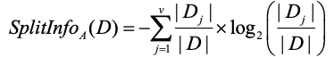

The value represents the potential information generated by splitting the training data set, D, into v partitions, corresponding to the v outcomes of a test on attribute A.

The cardinality of Dj will be low in case of few instances, the log2 will be negative and high in module, that's why we have the minus.

And at the end we will have:

$GainRatio(A) = \frac{Gain(A)}{SplitInfo(A)}$

Lower the number of instances, higher is the splitInfo and lower is the GainRatio.

In our specific case:

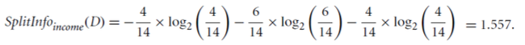

GainRatio(income) = 0.029/1.557 = 0.019

<ins>The attribute with the maximum gain ratio is selected as the splitting attribute.</ins>

### Gini Index

Another metric we can use is the __gini index__.

If a data set D contains examples from m classes, the Gini index, gini(D), is defined as:

where pi is the relative frequency of class i in D

The Gini index considers a binary split for each attribute, and not a multi-way split.

From one decision node we have only two branches.

If A is a discrete variable withv distinct values {a1,\...,av}, all possible subsets that can be formed from A are examined to determine the optimal binary split.

For example, considering three possible values {low, medium, high}, the possible subsets are: {low, medium}, {low, high}, {medium, high}, {low}, {medium} {high}. 

We test all possible combinations and we test the value of the gini index.

If we have just one class in a dataset D, one probability is 1 and others are 0, and the gini value is 0.

For a 2-class problem:

When classes are equally probable, we have the situation with the biggest confusion.

The trend is similar to the entropy, but the value is different.

We can also use a misclassification error as index.

If a dataset D is split on A into two subsets D1 and D2, the gini index giniA(D) is defined as:

For a discrete attribute, each of the possible binary splits is considered.

For a continuous attribute, each possible split-point must be considered.

The Reduction of Impurity is computed similarly:

The attribute that maximizes the reduction of impurity (or equivalently has the minimum Gini index) is selected as the splitting attribute.

For example, D has 9 tuples in buys\_computer = "yes" and 5 in "no"

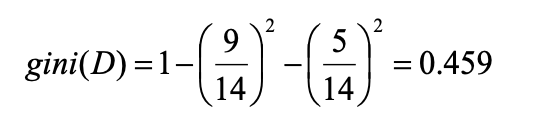

Let's start with the attribute income and consider each of the possible splitting subsets. Consider the subset {low, medium}. This would result in 10 tuples in D1 and 4 in D2

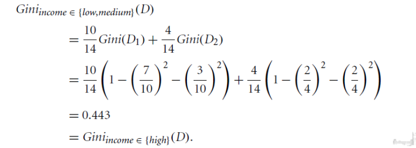

The Gini values for splits on the remaining subsets are:

Gini{low, high} = Gini{medium} 0.458; Gini{medium, high} = Gini{low} = 0.450. Thus, split on the {low, medium} (and {high}) since it has the lowest Gini index.

We select the combination with the lowest gini index.

The Gini index may need other tools, e.g., clustering, to get the possible split values.

## Comparing Attribute Selection Measures

The three measures, in general, return good results but

- __Information gain__: biased towards multivalued attributes

- __Gain ratio__: tends to prefer unbalanced splits in which one partition is much smaller than the others

- __Gini index__: biased to multivalued attributes, has difficulty when the number of classes is large and tends to favor tests that result in equal-sized partitions and purity in both partitions.

They all suffer from at least one problem, there's no optimal measure.

Typically, we exploit the gain ratio.

There are other attribute selection measures: CHAID, C-SEP, G-statistic, MDL, and CART.

Which attribute selection measure is the best?

Most give good results; none is significantly superior to others. All measures have some bias. However, time complexity of decision tree induction increases exponentially with the tree height, we must test a lot of possible splits. Thus, measures which tend to produce shallower trees may be preferred.On the other hand, shallow trees tend to have many leaves and higher error rates.

Most of times we generate the decision tree, and we work to reduce the overfitting and reducing the size also for interpretability.

# Overfitting and Tree Pruning

We have the problem of overfitting/overtraining that appears when we have too many branches, some may reflect anomalies due to noise or outliers.

In some specific branches we just classify noise or outliers, we overfit.

We achieve high accuracy for the training set, but we get poor accuracy for unseen samples.

The reason is that the decision tree is strongly specialized in the training set and not able to generalize.

Instead of identifying area characterized by specific classes, we try to isolate single or few points, and this is particularly true when we just go towards the deepness of our tree.

The last branches are very specialized on the specific instances.

If we have some point in a red zone but we specialize too much, the noise just determines a decision area in which we associate a wrong class for the area containing the instance.

How can we realize that the tree is affected by overfitting?

1.  Learn the decision model by using the training set

2.  Compute the accuracy (ATraining) of the model by classifying the training set, re-using it.

3.  Compute the accuracy (ATest) of the model by classifying the test set

We expect that the decision tree will perform better in the training set, but if ATest \<\< ATraining, then we have overtraining.

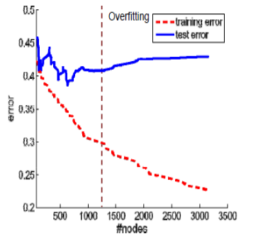

Increasing the number of nodes our decision tree get more specialized in the training set and the difference in performance starts to be relevant.

Our aim at the end is to use the decision tree to generalize.

We generate a high number of nodes, so we have that the decision area is very small. We isolate the decision area in few instances.

The intuition to solve the problem is to prune the tree. The problem is close to the leaves, not at the root, it's there that we have a specialization of the tree.

The idea is to prune but at the bottom and not at the top.

We define:

- Re-substitution errors: error on training set (eTR), when we pick up it again to verify the performance.

- Generalization errors: error on test set (eTS), we use an unused unlabeled dataset.

### Estimating the Error

We can also have some methods for __estimating generalization errors__.

> With an optimistic approach we consider eTS = eTR

With a pessimistic approach:

- For each leaf node eTS = eTR + 0.5, we add a penalization

- Total errors: eTS = eTR + 0.5 x N (N: Number of leaf nodes)

For a tree with 30 leaf nodes and 10 errors on training

> eTR = 10/1000 = 1%
>
> eTS = (10 + 30x0.5)/1000 = 2.5%

To consider that often the performance are worse than the training set.

Another approach is using a reduced error pruning (REP) for estimating it.

We use a pruning data set to estimate generalization error.

We get a part of the training set as a test set. We train by using this part of the training set and we test using the pruning set, we test to understand if we can prune the tree.

Once we pruned the tree, we assess the performance of the tree on the test set.

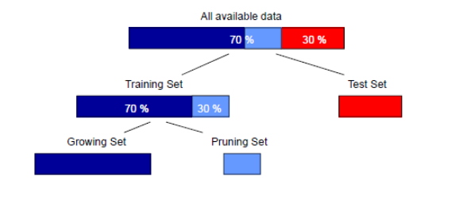

<ins>We use that part to test if we can reduce the size of the tree.</ins>

Given two models of similar generalization errors, one should prefer the simpler model over the more complex.

For complex models, there is a greater chance that it was fitted accidentally by errors in data.

Therefore, one should include model complexity when evaluating a model, taking in count the generalization.

We select the smaller model with accuracy comparable to the bigger models.

__This rule is called Occam's Razor.__

## Overfitting Prevention

We have two approaches to reduce overfitting, both about pruning the decision tree.

- __Prepruning__: During the learning phase we stop without specializing too much.

Halt tree construction early.

Typical stopping conditions for a node:

- Stop if all the instances belong to the same class

- Stop if all the attribute values are the same

More restrictive conditions:

- Stop if the number of instances is less than some user-specified threshold. We do not split one node if it contains less than several instances.

- ‎Stop if class distribution of instances is independent of the available features (e.g., using Chi-square test).

- Stop if expanding the current node does not improve impurity measures (e.g., information gain or Gini index).

> The problem is that we must choose appropriate thresholds, for example on the number of instances.
>
> The risk is that the threshold is very low we have the problem of outliers and noise, if it's too high we do not split some nodes that we should split.

It is sometimes used when we have to deal with big data but we must fix the threshold.

- __Postpruning__: In the postpruning we generate the decision tree fully grown.

> We then remove branches from a "fully grown" tree --- get a sequence of progressively pruned trees.
>
> So we remove subtrees from a "fully grown" tree. A subtree at a given node is pruned by removing its branches and replacing it with a leaf. The leaf is labeled with the most frequent class among the subtree being replaced.
>
> We can use a set of data different from the training data to decide which is the "best pruned tree". This is why we can use the pruning dataset discussed before.

For example:

If we prune in A5 we replace it with a leaf with the majority class.

We must understand when we can stop in the postpruning phase. We must balance the classification error and the complexity. Increasing the complexity, we typically increase the classification error.

### Reduced Error Pruning

We can use __Reduced Error Pruning (REP)__ where we use pruning set to estimate accuracy of sub-trees and accuracy of individual nodes.

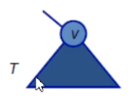

Let T be a sub-tree rooted at node v. The gain from pruning at v can be defined as:

$Gain from pruning = misclassification_T - misclassification_v$

__Repeat:__ prune at node with the largest gain until only negative gain nodes remain

We have a "Bottom/up restriction": T can only be pruned if it does not contain a sub-tree with lower error than T. To perform this approach, we must have a pruning set.

#### __Example:__

We must decide if I maintain the subtree rooted by v2, or prune and replace v2 with a leaf. To decide it we use a pruning set, set not used for learning but part of the training set.

In V4 we have 2 instances belonging to c1 and 2 in c2 in our pruning set.

We associate with a leaf the majority class, considering most of the instances we have in the leaves we will prune.

We have that v4 is labeled as c1 because it is most instances, we have 4 instances belonging to c1 and 2 instances belonging to C2.

When we must classify the pruning set two instances are correctly classified but one doesn't, I have one misclassification.

We then compute the gain from pruning.

We want to understand the error we have when we consider the overall subtree and the error when we consider the pruning.

In case we maintain the subtree, in v4 2 instances are correctly classified while we have 1 misclassification.

In v5 I have 2 misclassifications because I have two instances belonging to c1 but the majority class is c2.

With the tree in this way we have 3 misclassifications.

When we use the pruning, we use a leaf with label c1 because the number of instances is greater than c2 (7 \> 4).

With the postpruning we have 2 misclassifications, while without pruning we have 3 misclassifications.

We accept the prune because we have a gain in misclassification.

We use the same for the right node.

We have 1 misclassification in v7, and 0 in v6.

If we prune the majority class is c2 but it corresponds to have 3 misclassifications which is higher than 1 and the solution in this case is to not prune, we don't have advantages.

This approach works because we use a pruning set, if we use the training set it doesn't work.

### Cost Complexity Method and Postpruning

Another approach, used in CART, without the pruning set is to __balance the resubstitution error and the complexity__ of the tree.

It exploits the cost complexity function, that compares the number of leaves in the tree and the resubstitution error of the tree. The aim is to find a trade-off between them.

$Cost complexity = Resubstitution Error + ß · Number of leaf nodes$

where the Resubstitution error is the misclassification rate computed on the training set and ß is a penalty per additional terminal nodes

Search for the right-sized tree:

- prune or collapse some of the branches of the largest tree from the bottom up, using the cost complexity parameter, and cross-validation or an independent test sample to measure the predictive accuracy of the pruned tree.

- use the resubstitution cost for ranking the subtrees and generating a tree sequence table ordered from the most complex tree at the top to a less complex tree at the bottom

- Identify the minimum-cost tree and pick an optimal tree as the tree within one standard error of the minimum cost tree. An optimal tree should be the one with the smallest terminal nodes among those that lie within one standard error of the minimum-cost tree.

The idea is to use a decision tree with the minimum number of nodes that allow us to achieve reasonable performance in resubstitution error or cross validation error.

We just generate several decision trees by pruning the tree and we compute the resubstitution relative cost.

We order the tree by increasing resubstitution relative cost. Also, in term of number of nodes we have a decreasing order because when we increase the resubstitution cost we increase the number of nodes.

We just pick up a tree that guarantee us the lowest cross-validation and pickup a tree with a cost very close to the lowest cost we have with cross-validation, that guarantee us to have the minimum number of nodes.

This is an approach that tries to select a tree with the lowest number of nodes considering the resubstitution error and the cross-validation error.

Pessimistic pruning is similar to the cost complexity pruning but does not use a pruning set.

It adjusts the error rates obtained by the training set by adding a penalty, computed by adopting a heuristic approach based on statistical theory. If the error rate in the node is lower than the error rate in the subtree originated from the node, then the subtree is pruned. 

In postpruning, pruned trees tend to be more compact than their unpruned counterparts, but can still suffer from two problems.

- __Repetition__ - where an attribute is repeatedly tested along a given branch; this can happen when we have a continuous variable and we split it in two parts. We test the attribute with a threshold lower than 60 and we have two branches because we have binary splitting. We can also have another part of the tree with the same attribute with another split. We can have the same attribute repeated in another part of the tree.

- __Replication__ - duplicate subtrees exist within the tree. We could use the attributes in different part of the tree and this can produce the same subtree.

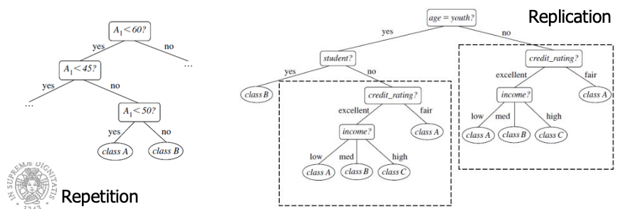

We can have them because we prune part of the tree.

Repetition and Replication can impede the accuracy and comprehensibility of a decision tree.

The use of multivariate splits (splits based on a combination of attributes) can prevent these problems. Another approach is to use a different form of knowledge representation, such as rules, instead of decision trees.

Indeed rule-based classifier can be constructed by extracting IF-THEN rules from a decision tree.

# Enhancements to Decision Tree and Challanges

We have a few problems:

- __The allow for continuous-valued attributes__ - Dynamically define new discrete-valued attributes that partition the continuous attribute value into a discrete set of intervals, but this is very computational expensive so we discretize before.

- __Handle missing attribute values__ - Typical solutions are assign the most common value of the attribute or assign probability to each of the possible values

- __Attribute construction__ - Where we create new attributes based on existing ones that are sparsely represented. This reduces fragmentation, repetition, and replication.

Classification in large databases has a problem:

- Scalability: Classifying data sets with millions of examples and hundreds of attributes with reasonable speed

<ins>Decision Tree can be executed distributedly.</ins>

Why is decision tree induction popular?

- relatively faster learning speed (than other classification methods)

- convertible to simple and easy to understand classification rules

- can use SQL queries for accessing databases

- comparable classification accuracy with other methods

We may have advantages in interpretability then other classifiers.

It is also one of the first classifiers.

Note: if the training set does not fit in memory, decision tree construction becomes inefficient due to swapping of the training tuples in and out

## RainForest

To make scalable the learning process of the decision trees we can use __RainForest__.

It adapts to the amount of main memory available and applies to any decision tree induction algorithm.

The idea is to use an AVC-set (of an attribute X ), where AVC stands for (Attribute, Value, Class\_label.

We have the projection of training dataset onto the attribute X and class label where counts of individual class label are aggregated.

We have for each value of attributes the distribution on classes.

The method maintains an AVC-set for each attribute at each tree node, describing the training tuples at node.

Dimension of an AVC-set depends on number of distinct values of A and the number of classes.

We will have all information to compute the info gain, we summarize the information to do that.

We scan the DB but after that we can directly work on it.

## BOAT (Bootstrapped Optimistic Algorithm for Tree Construction

Another approach is to use statistical technique called bootstrapping to create several smaller samples (subsets), each fits in memory.

Each subset is used to create a tree, resulting in several trees. These trees are examined and used to construct a new tree T'. It turns out that T' is very close to the tree that would be generated using the whole data set together

Advantages:

- Requires only two scans of DB. Makes one scan over the training database while collecting a small subset of the training database in-memory.

- Compute the final splitting criteria in only one scan over the training database. An incremental algorithm: can be used for incremental updates.

# Bayes Classification

The Bayes classifier is a statistical classifier: performs probabilistic prediction, i.e., predicts class membership probabilities. The foundation is based on Bayes' Theorem.

It predict class and also give us the probability of the prediction. We will have a list with classes and also probabilities to have that class,

Performance: A simple Bayesian classifier, naïve Bayesian classifier, has comparable performance with decision tree and selected neural network classifiers

We have incremental work, each training example can incrementally increase/decrease the probability that a hypothesis is correct --- prior knowledge can be combined with observed data

Standard Naive Classifier, even when Bayesian methods are computationally intractable, they can provide a standard of optimal decision making against which other methods can be measured

Let X be a data tuple ("evidence"): class label is unknown. Let H be a hypothesis that X belongs to class C.

The classification consists of determining P(H\|__X__) (posteriori probability): the probability that the hypothesis holds given the observed data sample X.

We can compute all probabilities for the different classes and use the class with the highest probability.

X is in bold because it represents an instance characterized by a number of attributes. X is a combination of possible values for the attributes. We have to compute an high number of probabilities. We compute for all possible combination of inputs.

Let us suppose that H is the hypothesis that a customer will buy a computer and a customer is characterized by age and income. Then, P(H\|X) is the probability that X will buy a computer given his age and income.

We have to compute probabilities for all possible combination of these three values.

For instance, X is a 35-year-old customer with an income of \$40,000.P(H) is the prior probability of H, and it is the the initial probability. It is the probability that a generic customer will buy a computer, regardless of age, income, \... It is the probability of having a specific class independently of the values.

P(X) is the prior probability of X), it is the probability that sample data is observed

e.g. Probability that a customer is 35 years old and earns \$40,000.

P(X\|H) is the posteriori probability of X conditioned on H, likelyhood. It is the probability of observing the sample X, given that the hypothesis holds.

Given that X will buy computer, the prob. that X is 31..40, and medium income.

Note: P(H), P(X) and P(X\|H) can be estimated from the given data.

P(H\|X) can be computed by the __Bayes' theorem__. Given a training data X:

Informally, this can be written asposteriori = likelihood x prior/evidence

It predicts X belongs to Ci if and only if the probability P(Ci\|X) is the highest among all the P(Ck\|X) for all the k classes. If we have P(H\|X) we compute it for each class and in output we give the class corresponding to the highest probability.

Practical difficulty: requires initial knowledge of many probabilities, significant computational cost

We go towards Naive Bayesian Classifier to solve this problem.

Let D be a training set of tuples and their associated class labels, and each tuple is represented by an n- dimensional attribute vector X = (x1, x2, \..., xn). Suppose there are m classes C1, C2, \..., Cm.Classification objective: to determine the class having the highest posterior probability, i.e., the maximal P(Ci\|X). This can be derived from Bayes' theorem:

Since P(X) is constant for all classes, only:

needs to be maximized.

P(Ci) is easy to be estimated by \|Ci,D\| / \|D\|.

The real problem is to compute P(X\|Ci), we have to compute it for each possible combination of each value of all attributes.

We can do it with this assumption: attributes are conditionally independent (i.e., no dependence relation between attributes). In that case:

This greatly reduces the computation cost. Only counts the class distribution.

We just compute the probability of each value of each attribute given the class.

We don't have any more combination of values.

Ex. P(age = old \| C1) and so on.

This reduces the computational time but we need to have that assumption.

If Ak is categorical, P(xk\|Ci) is the number of tuples in Ci having value xk for Ak divided by \|Ci, D\| (number of tuples of Ci in D).

If Ak is continous-valued, P(xk\|Ci) is usually computed based on Gaussian distribution with a mean μ and standard deviation σ:

and:

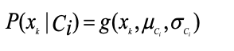

where μCi and σCi are the mean value and the standard deviation, respectively, of the values of attribute Ak for training tuples of class Ci.

This is true if we can assume that the distribution is gaussian.

#### __Example:__

Let's use the Naive Bayesian Classifier.

Classes:

C1:buys\_computer = 'yes'

C2:buys\_computer = 'no'

Data sample:

X = (age =youth, Income = medium, Student = yes Credit\_rating = Fair)

First of all we have to compute the probability of classes, we just need to count the number of instances in which we have a class and divide by the number of instances.

$P(Ci): P(buys\_computer = "yes") = 9/14 = 0.643$

$P(buys\_computer = "no") = 5/14= 0.357$

Then we compute $P(X|Ci)$ for each class, this corresponds to compute it for each possible value for each attribute and each class. $P(age = "youth" \| buys\_computer = "yes") = 2/9 = 0.222$

$P(age = "youth" \| buys\_computer = "no") = 3/5 = 0.6P(income = "medium" \| buys\_computer = "yes") = 4/9 = 0.444$

$P(income = "medium" \| buys\_computer = "no") = 2/5 = 0.4$

$P(student = "yes" \| buys\_computer = "yes) = 6/9 = 0.667$

$P(student = "yes" \| buys\_computer = "no") = 1/5 = 0.2$

$P(credit\_rating = "fair" \| buys\_computer = "yes") = 6/9 = 0.667$

$P(credit\_rating = "fair" \| buys\_computer = "no") = 2/5 = 0.4$

We limit the computations for simplyfing the computation. We focus on the instance in which we have that class and we count the number of instance in which we have that value for that attribute.

We obtain all probabilities we need to compute the probability of our customer given a specific class.

X = (age = youth, income = medium, student = yes, credit\_rating = fair)

P(X\|Ci) :

P(X\|buys\_computer = "yes") = 0.222 x 0.444 x 0.667 x 0.667 = 0.044

P(X\|buys\_computer = "no") = 0.6 x 0.4 x 0.2 x 0.4 = 0.019

P(X\|Ci)\*P(Ci) :

P(X\|buys\_computer = "yes") \* P(buys\_computer = "yes") = 0.028

P(X\|buys\_computer = "no") \* P(buys\_computer = "no") = 0.007

Therefore, X belongs to class ("buys\_computer = yes") because this class is characterized by the highest probability.

It's normal to have the low magnitude because we use different products between number less than 1.

## Avoiding the Zero-Probability Problem

Naïve Bayesian prediction requires each conditional probability be non-zero. Otherwise, the predicted probability will be zero:

Ex. Suppose a dataset with 1000 tuples, income=low (0), income= medium (990), and income = high (10)

If we just apply this probability, for low we have 0.

TO avoid it we can use __Laplacian correction__ (or Laplacian estimator) that consists in adding 1 to each case.

Prob(income = low) = 1/1003=0.001

Prob(income = medium) = 991/1003=0.988

Prob(income = high) = 11/1003=0.011

It doesn't affect a lot the second two.

The "corrected" probability estimates are close to their "uncorrected" counterparts.

Advantages:

- Easy to implement

- Good results obtained in most of the cases

Disadvantages

- Assumption: class conditional independence, therefore loss of accuracy because of this assumption

- Practically, dependencies exist among variables E.g., hospitals: patients: Profile: age, family history, etc. Symptoms: fever, cough etc., Disease: lung cancer, diabetes, etc. We have a relation between attributes in this case.

- Dependencies among these cannot be modeled by Naïve Bayesian Classifier If we have dependency in attributes we can't expect to have high performance.

We can deal with these dependencies using __Bayesian Belief Networks__. They are also known as Bayesian networks, probabilistic networks and they allow the representation of dependencies among subsets of attributes (both discrete- and continuous-valued). They are defined by two components: a directed acyclic graph and a set of conditional probability tables. A directed acyclic graphical model of casual relationship represents dependencies among variables, gives a specification of joint probability distribution.

Nodes: random variables

Links: dependency

X and Y are the parents of Z, and Y is the parent of P

No dependency between Z and P

Has no loops/cycles

Nodes may correspond to actual attributes given in the data or to "hidden conditional probability tables variables" believed to form a relationship (e.g., in the case of medical data, a hidden variable may indicate a syndrome, representing a number of symptoms that, together, characterize a specific disease).

__CPT__: Conditional Probability Table for variable LungCancer:

It shows the conditional probability for each possible combination of the values of its parents

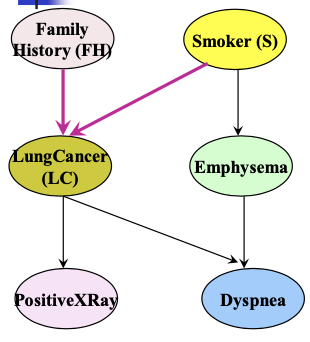

If we have LC, we know that it depends on S and fH and the CPT gives us the probability given possible values for the parents, the probability to have LC or not LC

If we have cancer in family history and the patient is smoker we have a probability of 0.8, and so on.

We can use these networks in several scenarios.

## Training a Bayesian Network

Let X=(x1,..,xn) be a data tuple described by the variables or attributes Y1, \..., Yn, respectively.

Note that each variable is conditionally independent of its nondescendants in the network graph, given its parents.

A complete representation of the existing joint probability distribution can be obtained by the following equation:

Just an example. Suppose that we have five variables A, B, C, D and E.

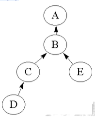

If we do not specify the dependencies explicitly, then all the variables are assumed to be dependent on each other.

It means that:

p(A,B,C,D,E) = p(A\|B,C,D,E)\*p(B\|C,D,E)\*p(C\|D,E)\*p(D\|E)\*P(E) 

If the dependencies are explicitly modeled, we can reduce the computation:

p(A,B,C,D,E) = p(A\|B)\*p(B\|C,E)\*p(C\|D)\*p(D)\*p(E)

This is possible because we modeled explicitly the dependencies.

A node within the network can be selected as an "output" node, representing a class label attribute.

There may be more than one output node.

Rather than returning a single class label, the classification process can return a probability distribution that gives the probability of each class.

Belief networks can be used to answer probability of evidence queries (e.g., what is the probability that an individual will have LungCancer, given that they have both PositiveXRay and Dyspnea) and most probable explanation queries (e.g., which group of the population is most likely to have both PositiveXRay and Dyspnea).

__We have 4 possible scenarios for Bayesian Networks:__

__Scenario 1__: Given both the network structure and all variables observable: compute only the CPT entries.

__Scenario 2__: Network structure known, some variables are hidden; gradient descent (greedy hill-climbing) method, i.e., search for a solution along the steepest descent of a criterion function. Some nodes correspond to actual variables, others do not. We must compute the CPT for all nodes and to perform this we don't have evidence for all variables. We just need to exploit a method.

- Weights (CPT entries) are initialized to random probability values

- At each iteration, it moves towards what appears to be the best solution now, without backtracking

- Weights are updated at each iteration and converge to local optimum

__Scenario 3__: Network structure unknown, all variables observable: search through the model space to reconstruct network topology, because we have all information.

__Scenario 4__: Unknown structure, all hidden variables: No good algorithms known for this purpose.

We focus on the 2nd scenario.

Let wijk be a CPT entry for the variable Yi=yij having the parents: Ui=uik, where wijk=P(Yi=yij\|Ui=uik).

If wijk is the upper leftmost CPT entry in the previous example, then Yi is LungCancer, yij is its value "yes", Ui lists the parent nodes of Yi, namely {FamilyHistory, Smoker} and uik list the values of the parent nodes, namely {"yes", "yes"}.

A gradient descent strategy is used to search for the wijk values that best model the data, based on the assumption that each possible setting of wijk is equally likely.

It searches for a solution along the negative of the gradient of a criterion function.

This function is that we maximize the probability assigned by the network to the observed data when the CPT parameters are set to w. We try to maximize this probability:

This can be done by following the gradient of Pw(D).

The algorithm proceeds as follows:

- Compute the gradients (for each training tuple Xd)

- Take a small step in the direction of the gradient (where l is the learning rate). If l is very low the climb is slow, if large we climb the ill very fast but we may pass-over the peak so we should rule this learning rate so that we approach the peak fast but without passing the peak itself.

- Renormalize the weights (all the weights have to be between 0 and 1 being probabilities and  must equal 1 for all i,k.).

# Rule-based Classification

We have classifiers based on rules.

The knowledge is represented in the form of IF-THEN rules

e.g. IF age = youth AND student = yes THEN buys\_computer = yes

When we receive an unlabeled object we just try if the rule can be fired, we see if the antecedent condition is satisfied and in case the consequent is triggered.

Assessment of a rule: coverage and accuracy

The coverage represents how many instances the rule cover.

ncovers = number of instances covered by rule R

ncorrect = number of instances correctly classified by rule R

coverage(R) = ncovers /\|D\|, where D is the training data set 

accuracy(R) = ncorrect / ncovers

We want to achieve ncorrect = ncovers.

If more than one rule is triggered, we need conflict resolution.

It happens when one instance fire more than ore rule and the consequent is different.

Possible conflict resolution strategies can be achieved fixing orders.

- Size ordering: we assign the highest priority to the triggering rules that has the "toughest" requirement (i.e., with the most attribute tests (rule antecedent size)). We see this rule as very specialized and so trustable.

- Class-based ordering: decreasing order of prevalence (rules for the most frequent class come first) or misclassification cost per class (rules for the class with the highest cost come first)

- Rule-based ordering (decision list): rules are organized into one long priority list, according to some measure of rule quality (accuracy, coverage or size) or based on advice from domain experts.

> Of course, each rule in a decision list implies the negation of the rules that come before it in the list (difficult to interpret). If I'm at the 3rd, the two before weren't fired.

How can we mine rules?

1\. Rule extraction from a decision tree

We can extract rules from a decision tree. We travel each path from the root to the leaves and for each path we generate a rule.

- Rules are easier to understand than large trees

- One rule is created for each path from the root to a leaf

- Each attribute-value pair along a path forms a conjunction: the leaf holds the class prediction

- Rules are mutually exclusive (no rule conflict) and exhaustive (one rule for each possible attribute-value)

Note: one rule per leaf! With decision trees which suffer from repetition and replication, the extracted rule base can be difficult to interpret

For example:

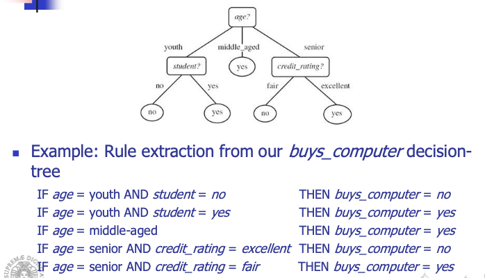

We have 5 leaves so we will have 5 rules. If we have only one branch, we will have only one condition in the antecedent.

## Rule Extraction from a Decision Tree: Pruning the Rules

Let's see how we can prune the rule set.

Each condition which does not improve the estimated accuracy of the rule can be pruned.

C4.5 uses a pessimistic approach for counteracting the bias generated by using the training set. 

We try to generalize the rules. Further, any rule which does not contribute to the overall accuracy is pruned.

After pruning, the rules will no longer be mutually exclusive and exhaustive. 

C4.5 adopts a class-based ordering scheme: groups the rules per class and then determines a ranking of these class rule sets to minimize the number of false-positive errors (the rule predicts a class C, but the actual class is not C). The class rule set with the least number of false positives is examined first.

We also have a default class, the class which contains the highest number of tuples not covered by any rule (the majority class will likely have many rules for its tuples).

If we do not prune, we have mutually exclusiveness and exhaustiveness, if we apply pruning, we lose these characteristic.

Rule Induction: Sequential Covering
Method 

2\. __Heuristic approaches__

They work in a sequential way.

They extract rules directly from training data, using some heuristics.

### Sequential Covering Algorithm

A typical sequential covering algorithm is __FOIL__.

Rules are learned sequentially, each for a given class Ci will cover many tuples of Ci but, ideally, none (or few) of the tuples of other classes 

Steps:

- Rules are learned one at a time

- Each time a rule is learned, the tuples covered by the rules are removed, because we want to focus on the generation of the next rule on other instances.

- The process repeats on the remaining tuples unless termination condition, e.g., when no more training examples or when the quality of a rule returned is below a user-specified threshold. This is a sequential approach, so we need to fix a stopping condition.

In terms of performance, it is similar to decision tree induction but in this case we learn rule by rule.

When we use a decision-tree we learn a set of rules simultaneously.

This is the difference, but in terms of performance we have approximately the same performance.

It is important to think in terms of interpretability.

The sequential covering algorithm works this way:

*while (enough target tuples left)*

*generate a rule*

*remove positive target tuples satisfying this rule*

positive means covered by the rule in the same class.

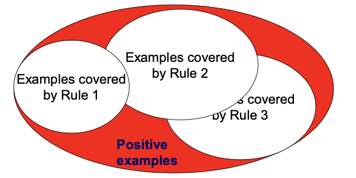

Formally we have this algorithm:

We start with an empty rule set and for each class and we repeat the three statements until terminating condition.

How is possible to learn one rule?

To generate a rule:

*while(true)*

*find the best predicate p*

*if foil-gain(p) \> threshold then*

*add p to current rule*

*else break*

If this metric is higher than a threashold we add b to the current rule.

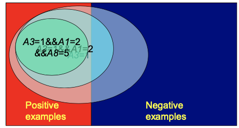

We select one attribute with a specific value, this is our condition. If we use just one condition, we cover a number of instances.

Positive examples are example covered by the rule and belong to the same class we used in the consequent.

All other examples belonging to other classes are negative examples.

Using one condition we expect a cover of a lot of instances but there is a higher confusion.

We can then add another condition in the antecedent part, it's like we start from a large subspace, and we reduce it.

Each condition introduces other constraints, we add conditions with the aim of reducing the number of negative examples.

But we reduce also positive examples, because we reduce the instances in which rule is fired.

This is a greedy depth-first strategy, we try to decide the optimal condition step by step. We cannot guarantee the global optimum but adding a condition in the antecedent we are performing an optimization.

- Start with the most general rule possible:

> condition (antecedent part) = empty
>
> This rule is always fired and cover all instances.
>
> Suppose our training set, D, consists of loan application data. Attributes regarding each applicant include their age, income, education level, residence, credit rating, and the term of the loan. 
>
> We start with the rule:
>
> 
>
> Then, we consider each possible attribute that may be added to the rule.
>
> We must use some metric to decide which is the best attribute to add in the rule.

We must choose the metric. The best one should take in consideration accuracy.

We must select the condition that allow us to achieve the highest accuracy, which is the number of positive examples over all examples covered by the rule.

But we could have this situation:

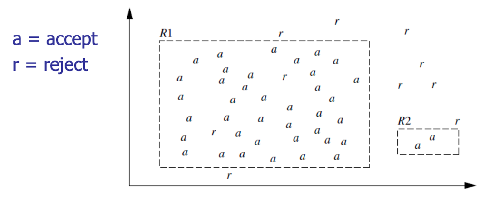

R1 = 95% accuracy

R2 = 100% accuracy

R1 in terms of accuracy is lower but R2 has a very small coverage.

We would like to use accuracy but also, we have to take in consideration the number of instances.

If we have few instances, we also can reach overtraining. If we select rules that cover a limited number of instances, we have the risk to produce a classifier with overtraining.

We must take in consideration accuracy and coverage.

We use a rule-quality measure that is __Foil-gain__, that assesses info\_gain by extending condition (FOIL = First Order Inductive Learner).

where $pos$ $(pos')$ and $neg$ $(neg')$ are the numbers of positive and negative tuples covered by current rule R (new rule R', rule obtained adding one condition).

We compare the rule we are producing adding one condition at the rule we have before the step.

We decide if adding or not using this gain.

Foil-gain favors rules that have high accuracy and cover many positive tuples.

In fact, pos' express the coverage of positive tuples, and in the parenthesis we take in consideration the accuracy we have,

In the algorithm we use it and we stop when we can't add other conditions.

We also have __rule pruning__.

We expect that when we remove instances from training set we expect to create rules very specialized.

This is the reason why we typically have rule pruning.

Learn\_One\_Rule does not employ a test set when evaluating rules. Thus, the evaluation is optimistic. Rule pruning based on an independent set of test tuples.

Pruning is carried out by removing a conjunct, we remove a condition at each step, and we test if we had some gain.

Removing a rule, we enlarge the subspace covered by the rule. By convention, this approach, RIPPER, starts with the most recently added conjunct when considering pruning.

FOIL uses a simple yet effective method:

- 

If FOIL\_Prune is higher for the pruned version of R, prune R.

Conjuncts are pruned one at a time if this results in an improvement.

We are working with a pruning set, not using for the training.

If we would work with the training set, we would not have any advantage.

# Classification by Using Frequent Patterns

At the end of the execution of the algorithms we saw we had frequent patterns, from which we could extract association rules.

We can use frequent patterns for extracting association rules.

In the classification problem, association rules have a specific format, in the consequent part we have the class.

We mine data to find strong associations between frequent patterns (conjunctions of attribute-value pairs) and class labels:

Association rules are generated in the form of:

p1 \^ p2 \... \^ pl =\> "A class = C" (conf, sup)

In this analysis we exploit transactions.

The consequent part is one of the possible classes.

In frequent pattern analysis we exploit transactions. When we talk about classification, we don't have them, but we have instances.

Each item corresponds to a possible value of our attribute.

From this perception we can apply the same algorithms we have

The objects we have in the training set are our transactions, a set of items and the last item is the class.

When we apply this approach, we can generate a high number of rules.

This type of classifiers is very effective because:

- They explore highly confident associations among multiple attributes and may overcome some constraints introduced by decision-tree induction, which considers only one attribute at a time. In this way we explore all conjunctions and we expect higher performances.

- Associative classification has been found to be often more accurate than some traditional classification methods, such as C4.5 (used to learn decision trees).

__CBA (Classification Based on Associations)__ is an approach of classification with association rules.

This approach mine possible association rules in the form of: $cond-set$ (a set of attribute-value pairs) =\> class label

Build the classifier with an heuristic method, where the rules are organized according to decreasing precedence based on confidence and then support

If a set of rules has the same antecedent, then the rule with the highest confidence is selected to represent the set.

Classify a new tuple:

- the first rule satisfying the tuple is used to classify it

- The classifier also contains a default rule, having the lowest precedence

__CMAR (Classification based on Multiple Association)__ is another approach.

Build the classifier: adopts a variant of the FP-growth algorithm to find the complete set of rules satisfying the minimum confidence and minimum support thresholds.

Rule pruning whenever a rule is inserted into the rule base:

- Given two rules, R1 and R2, if the antecedent of R1 is more general than that of R2 and conf(R1) \>= conf(R2), then R2 is pruned

- Prunes rules for which the rule antecedent and class are not positively correlated, based on a χ2 test of statistical significance

When we have to classify a new tuple:

- If the rules matching the new object are not consistent in class label, the tuple we are considering fire rules with different consequent, then statistical analysis on multiple rules are performed.

    - Rules are divided into groups according to class labels

    - Uses a weighted χ2 measure to find the strongest group of rules, based on statistical correlation of rules.

    - The new tuple is assigned to the class label of the strongest group.

CMAR has slightly higher average accuracy and more efficient use of memory than CBA.

__CPAR (Classification based on Predictive Association Rules)__

- Build the classifier: Generation of predictive rules based on a rule generation algorithm (FOIL-like analysis) rather than frequent itemset mining. In FOIL, each time a rule is generated, the positive samples it satisfies are removed. In CPAR, the covered tuples remain under consideration, but reducing their weight.

When we classify a new tuple:

- Rules are divided into groups according to class labels

- The best k rules, based on expected accuracy, of each group are used to predict the class label

High efficiency, accuracy like CMAR.

We can generate standard metrics for generating association rules, like FP\_Growth.

But we have to solve the conflict problem, we have high probability that an unlabeled tuple can fire rules with different consequent.

The strategy we use is to determine how much compact are the group of rules related to the same class activated by the instance.

They tried to use different heuristic to select rules.

They all exploit techniques from rule-based classifiers (FOIL) or frequent pattern analysis but have a different strategy to perform conflict resolution.

There is no best strategy, we have to choose the best for our application.

# Lazy Learners

Lazy vs. eager learning:

- __Lazy learning__ (e.g., instance-based learning): Simply stores training data (or only minor processing), they don't learn a model. They just wait until it is given a test tuple.

- __Eager learning__ (the so far discussed methods): Given a set of training tuples, constructs a classification model before receiving new (e.g., test) data to classify

Lazy learners spend less time in training but more time in predicting. For some sets we spend a lot of time in classification.

We can save learning time, but we spend more in the classification phase.

In terms of accuracy, lazy methods effectively use a richer hypothesis space since it uses many local linear functions to form an implicit global approximation to the target function.

We may have a risk of overtraining.

Eager: must commit to a single hypothesis that covers the entire instance space 

They are Instance-based learning: Store training examples and delay the processing ("lazy evaluation") until a new instance must be classified.

Typical approaches are:

- __k-nearest neighbor__ approach, where instances represented as points in a Euclidean space. We assume that our instances are represented by numerical attributes.

- __Locally weighted regression__: constructs local approximation. We exploit locally the instances in the training set.

- __Case-based reasoning__: uses symbolic representations and knowledge-based inference. We have to understand one case similar to our case.

## K-Nearest Neighbor Algorithm

All instances correspond to points in the n-D space.

The nearest neighbor are defined in terms of Euclidean distance, $dist(X_1, X_2)$.

Target function could be discrete- or real-valued, we can use them for classification or prediction.

For discrete-valued, k-NN returns the most common value among the k training examples nearest to $x_q$, the unlabeled target.

We consider the majority class for these neighbors.

We receive the unlabeled data, we compute the distance between the point and all instances in the training set to determine the K-Nearest Neighbors.

Then, we sort the distances in an increasing order and pickup the first k points.

The complexity is linear with the number of instances in the data set, we have O(n\*f), where f is the number of attributes.

The complexity for the sorting algorithm is O(n\*logn) for some algorithms.

If we fix k at the beginning we can speed-up the computation actually.

The optimal value of k is hard to choose.

How is possible to determine a good value for k?

If we select k = 1, we consider the closest point to the unlabeled point.

But we may have as nearest point one point of another class and classify the point to a wrong class.

We can mitigate the problem using a higher value for k.

Experimentally, we could use increasing values of k and chooses k with the maximum accuracy, using a validation set.

Generally, the larger the number training instances, the larger the value of k. It depends on the distribution of classes; we have to text experimentally.

How can the distance be computed for non-numeric attributes (categorical attributes)?Compare the corresponding values of the attributes: if they are identical, the difference is 0; otherwise, is 1.

What about missing values?

If a value of a given attribute is missing in one of the two tuples, then assume the maximum possible difference.

This difference is 1 for nominal attributes and for numeric attributes when the value is missing in both the tuples.

Choice of the distance: different distances can be used for incorporating attribute weighting and the pruning of noisy data tuples.

Computational efficiency: 1-NN requires O(\|D\|) comparisons.

- By sorting and arranging the tuples into search trees, the number of comparisons can be reduced to O(log(\|D\|))

- Parallel implementations, maybe splitting dataset into subsets, compute in each subset and merge in some way

- Partial distance: use only a subset of the n attributes; if the distance is higher than a threshold, then computation of distance is stopped

- Editing methods: remove training tuples that prove to be useless.

For reducing complexity, we have to reduce the number of instances in the training set and we have to select them in a correct way.

### Editing Methods

__Wilson editing__

Wilson editing cleans interclass overlap regions, thereby leading to smoother boundaries between classes.

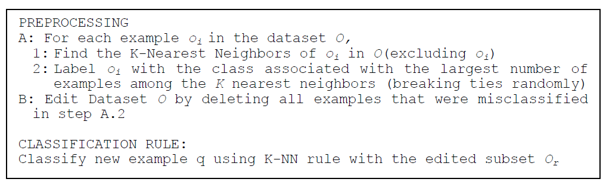

breaking ties randomly if we have the same number of neighbors for each class.

This corresponds on eliminating an object that it is in a zone in which most neighbors belong to other classes. We must perform this reduction one time.

We remove objects in zones in where we have objects of other classes and consider them as noise.

It depends on the value of k, in the first case we use k = 1 so we eliminate also the black one.

With this approach we remove instances that may cause misclassifications.

__Multi-Edit__

We have to edit in such a way to maintain the performance of our classifier.

Multi-edit repeatedly applies Wilson editing to N random subsets of the original dataset until no more examples are removed.

We use one of the subsets for training and others for test and we apply all these combinations.

__Citation Editing__

We exploit an analogy here, which is that if a paper cites another article, the paper is related to that article. Similarly, if a paper is cited by an article, the paper is also related to that article. Thus both the citers and references are considered to be related to a given paper.

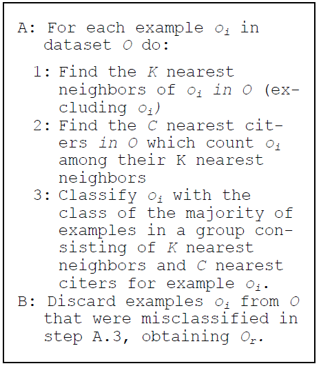

We use KNN for oi but also the citers, that are objects in o which count oi among its KNN. We use Wilson editing exploiting the views of citers and cited.

__Supervised Clustering__

In this approach we exploit clustering, grouping objects related to each other.

The idea is to use one representative for the cluster, which has to be label, and use it instead of elements in the cluster.

O is replaced by subset Or which consists of cluster representatives that have been selected by the supervised clustering algorithm.

We have the objective to preserve accuracy but reducing the number of instances.

We have to see if these methods reach our aim.

Let's compare the different approaches by using a dataset.

We use two types of datasets.

In the first column we use the overall training set, in the second Wilson editing, and so on.

The Wilson, Citation and SC Editing allow us to improve performances.

The second row give us:

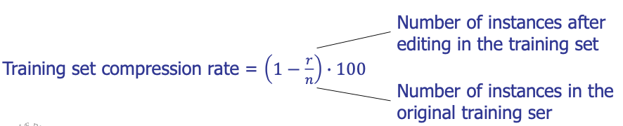

which is the percentage of the dataset we can reduce.

SC Editing guarantee us the highest compression rate, in fact we use representatives.

In the other dataset SC Editing do not guarantee a similar performance but the compression rate is huge. During the classification phase this guarantee us to be very fast.

We can conclude that the first three can typically increase the accuracy but are not able to reduce a lot the instances, while SC editing summarize a lot the instances but we may have loss in terms of accuracy.

Visualization of the application of editing methods on Complex9\_RN323 dataset:

With Citation and Wilson editing we delete points but not so many. With SC Editing we have just few selected points.

### K-Nearest Neighbours for Prediction

k-NN for *real-valued prediction* for a given unknown tuple returns the mean values of the k nearest neighbors.

We can also use distance-weighted nearest neighbor algorithm.In this case it weights the contribution of each of the k neighbors according to their distance to the query xq. We can give greater weight to closer neighbors:

We weight more the points close to Xq.

KNN is quite robust to noisy data by averaging k-nearest neighbors, especially when we increment k.We have a curse of dimensionality because we use distance between neighbors, and it could be dominated by irrelevant attributes.

To overcome it, we can use axes stretch or elimination of the least relevant attributes.

## Case-Based Reasoning (CBR)

Case-based reasoning (CBR) is the process of solving new problems based on the solutions of equal or similar past problems.

The core assumption is that similar problems have similar solutions.

If I found a good solution to that case, I can apply this solution here too.

This is hard to implement because we have to compare cases for their similarity.

We use a database of problem solutions to solve new problems

We store symbolic description (tuples or cases) and not points in a Euclidean space.

Everyday examples of CBR:

- A lawyer who advocates a particular outcome in a trial based on legal precedents or a judge who creates case law.

- An engineer copying working elements of nature (practicing biomimicry) is treating nature as a database of solutions to problems. 

Methodology:

Cases are represented by rich symbolic descriptions (e.g., function graphs).

We search for similar cases, multiple retrieved cases may be combined.

When a new (successful) solution to the new problem is found, a new experience is made, which can be stored in the case-base to increase its competence, thus implementing a learning behavior.

I retrieve old cases, adopt my solution and store my solution with the case.

I increase the possibility to use this solution for other cases.

Tight coupling between case retrieval, knowledge-based reasoning, and problem solving.

The CBR cycle consists of 4 sequential steps:

We receive a new case, we retrieve similar cases, we analyze them, and we reuse the solutions we adopted in those cases, we revise this solution and we test this solution.

Then we save it for the future.

- Retrieve

One or several cases from the case base are selected, based on the modeled similarity. The retrieval task is defined as finding a small number of cases from the case-base with the highest similarity to the query, that can be described in a complex way. We must compare them considering this complexity. This is a k-nearest-neighbor retrieval task considering a specific similarity function. When the case base grows, the efficiency of retrieval decreases. We need to apply methods that improve retrieval efficiency, e.g. specific index structures such as kd-trees, case-retrieval nets, or discrimination networks. 

- Reuse

Reusing a retrieved solution can be quite simple if the solution is returned unchanged as the proposed solution for the new problem.

Otherwise, we have to adapt it to a specific case (if required, e.g. for synthetic tasks). 

We have Several techniques for adaptation in CBR: Transformational adaptation, we transform the solution; Generative adaptation, we generate a specific solution

Most practical CBR applications today try to avoid extensive adaptation for pragmatic reasons. 

- Revise

In this phase, feedback related to the solution constructed so far is obtained. 

This feedback can be given in the form of a correctness rating of the result or in the form of a manually corrected revised case. 

The revised case or any other form of feedback enters the CBR system for its use in the subsequent retain phase. 

- Retain

The retain phase is the learning phase of a CBR system (adding a revised case to the case base).

We add the case with the solution for new specific cases. Explicit competence models have been developed that enable the selective retention of cases (because of the continuous increase of the case-base).

This is a lazy learner because we do not generate a model, but we exploit what we have in the learning set.

Let's take this example:

The first thing to do is to understand if we have similar cases to adopt the solution inside those cases. We search similar cases, and we discover that something is present in our case base but it's not the same problem.

When two cases are similar? We must establish it.

The solution may change depending on the model of the car, we must take care of the complexity of this situation.

If we find a solution, we can adapt it with the symptoms we have in the query.

We have the front light and not the break light, but we can exploit similar solutions.

If we apply the change and it works this is the solution we wanted.

Then we can store the solution in our use-case.

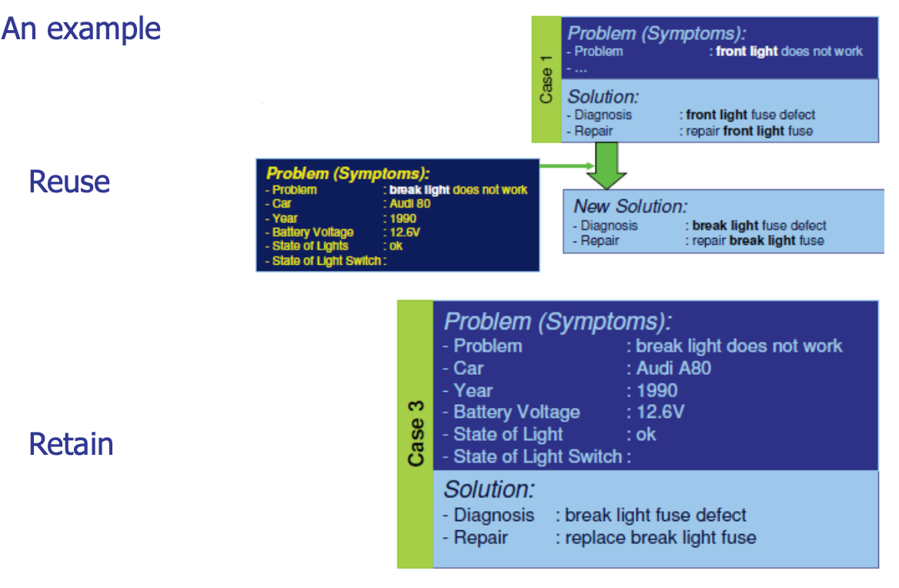

It's difficult to compute similarity.

Challenges with this application are:

Find a good similarity metric

Indexing based on syntactic similarity measure, and when failure, backtracking, and adapting to additional cases

It is a lazy learner because we use the training set without creating a model.

# Model Evaluation and Selection

How can we measure accuracy? Are there other metrics to consider?

We use a test set of class-labeled tuples instead of training set when assessing accuracy.

__Methods for estimating a classifier's accuracy:__

- Holdout method, random subsampling

- Cross-validation

- Bootstrap 

__Comparing classifiers:__

- Confidence intervals

- Cost-benefit analysis and ROC Curves 

A complete information is given by the __confusion matrix__.

## Confusion Matrix

We consider a two-class problem but it can be generalized with more classes.

Given m classes, an entry, $CM_{i,j}$ in a confusion matrix indicates the number of tuples in class i that were labeled by the classifier as class j.

It may have extra rows/columns to provide totals.

True positives are instances belonging to class C1 and classified as class C1, and so on.

The confusion matrix gives us all information to decide if a classifier is working well and give us information about confusion between classes. The best situation is when it is diagonal.

Example of Confusion Matrix:

### Classifier Evaluation Metrics: Accuracy, Error Rate, Sensitivity and Specificity

We can compare classifier in terms of TN or TP, taking in difference the two cases.

By exploiting it we can define some metrics that summarize the confusion matrix:

- __Classifier Accuracy__, or recognition rate: percentage of test set tuples that are correctly classified:

Accuracy = (TP + TN)/All

- __Error rate__: 1 - accuracy, or

Error rate = (FP + FN)/All

Accuracy is a good metric but if a value is good, depends on the distribution of the data in classes.

If we have a class with 95% of data and the other class with only 5% we can have a stupid classifier that always choose the first class and reach a 95% of accuracy.

This is called the __Class Imbalance Problem__.

If I have a high value of TP but low in TN, the classifier is not that useful.

One class may be rare, e.g. fraud, or HIV-positive.

In case of imbalanced problem, we cannot use only the accuracy, we use pair of values.

- __Sensitivity__: True Positive recognition rate

Sensitivity = TP/P

- __Specificity__: True Negative recognition rate

Specificity = TN/N

I should have for 1 in the best case.

Higher their value and better is my classifier.

### Classifier Evaluation Metrics: Precision and Recall, and F-measures

We also have other metrics:

- __Precision__: exactness - what % of tuples the classifier labeled as positive are actually positive.

It expresses the precision of the classifier.

- __Recall__: completeness - what % of positive tuples the classifier labeled as positive

Considering all real positive tuples how many are classifies positive.

We have a perfect precision score of 1.0 when every tuple that the classifier labeled as belonging to class C does indeed belong to class C. However, it does not tell us anything about the number of class C tuples that the classifier mislabeled.

The precision only is not enough to give us all the information we need.

We have a perfect recall score of 1.0 when every item from class C was labeled as such, but it does not tell us how many other tuples were incorrectly labeled as belonging to class C.

Again, it gives us a partial view of the result.

We must use both, especially for imbalanced dataset.

There is an inverse relationship between precision and recall.

A medical classifier may achieve high precision by labeling all cancer tuples that present a certain way as cancer but may have low recall if it mislabels many other instances of cancer tuples.

This means that if we analyze some positive with cancer, they are not classified as positive. If we have a low precision, instead, we should have a high value of FP, which means that we have healthy patients classified as positives.

Which value has to be high depends on the application, if they're not both high.

If we must select the best between different classifier, if the dataset is not imbalanced, we have to use these two values.

We can have a classifier that perform better in recall and the other that perform better in precision.

Precision and recall are combined into a single measure.

- __F measure__ (F1 or F-score): harmonic mean of precision and recall

- __Fß__: weighted measure of precision and recall assigns ß times as much weight to recall as to precision:

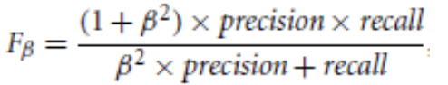

Commonly used Fß measures are F2 (weights recall more than precision) and F0.5 (weights precision more than recall).

Let's take this example.

This confusion matrix is given:

Precision = 90/230 = 39.13%

Recall = 90/300 = 30.00%

Let's suppose we don't consider that this is an unbalanced dataset, and we just use accuracy, which is (90+9560)/10000 = 96.4%, which gives us a high value.

But we misclassified a lot of ill patients.

This is an imbalanced dataset in fact, accuracy is not a good metric.

Sensitivity is 30% and specificity is 98.56%. We find out that sensitivity is very low.

For this application this is not good.

Both precision and recall are low, and for unbalanced dataset these are very important values.

When we evaluate the classifier, we can use accuracy if the dataset is balanced, we have approximately the same number of instances for all classes.

We must work with the pairs we saw. If we have different classifiers we use the f-measure.

## Holdout & Cross-Validation Methods

A unique execution of different classifiers cannot allow concluding that one classifier is better than another.

In one trial, by chance one classifier could have an accuracy higher than the other We need to perform different trials. But how? We have only a labelled dataset. 

__Holdout method__

Given data is randomly partitioned into two independent sets:

- Training set (e.g., 2/3) for model construction

- Test set (e.g., 1/3) for accuracy estimation

We perform random sampling: a variation of holdout.

We repeat holdout k times, accuracy = avg. of the accuracies obtained.

For each time we use the left part as training set and the right part as test set.

Only if distribution are independent I can conclude that one classifier is better than another. If two distributions are equal, classifiers are equal in terms of performance.

__Cross-validation__

Is it also called k-fold, where k = 10 is the most popular choice.

We randomly partition the data into k mutually exclusive subsets, folds, each approximately equal size. At i-th iteration, use Di as test set and others as training set.

I repeat until all folds are used as test sets.

With only one dataset we created different trials.

Some variations:

- Leave-one-out: k folds where k = number of tuples, that is, only a sample is left out at a time for the test set. Suitable for small sized data. 

- Stratified cross-validation: folds are stratified so that class dist. in each fold is approx. the same as that in the initial data

## Bootstrap

Bootstrap samples the given training tuples uniformly with replacement.

i.e., each time a tuple is selected, it is equally likely to be selected again and re-added to the training set. It works well with small data sets.

We have several bootstrap methods, and a commonly used is .*632 bootstrap*.

A data set with d tuples is sampled d times, with replacement, resulting in a training set of d samples. The data tuples that did not make it into the training set end up forming the test set. About 63.2% of the original data end up in the bootstrap, and the remaining 36.8% form the test set (since the probability of not being chosen is $(1 - 1/d)^d$ , when d is large results to be ≈ e-1 = 0.368).

Therefore the method has this name.

We repeat the sampling procedure k times. The overall accuracy of the model is obtained as:

## Estimating Confidence Intervals

Suppose we have 2 classifiers, M1 and M2, which one is better than the other?

We use the same dataset and 10-fold cross-validation and use the 10 accuracies to obtain err(M1) and err(M2). These mean error rates are just estimates of error on the true population of future data cases.

What if the difference between the 2 error rates is just attributed to chance?

We also must analyze how accuracies values are distributed.

I could have that the distribution of accuracy are completely distinct.

If we compare the average accuracy, we cannot conclude if one classifier is better than another.

The average value is different, but distributions are almost overlapping.

Considering the average values of accuracy is not sufficient.

We must use a test of statistical significance that allow me to understand if the two distributions are statistically different, if it occurs, we can conclude that the distribution with the higher value of accuracy is better than the other.

We must be sure that the distribution of accuracy is different.

We use 10 because it is a good number to make a reliable statistic.

We fix some confidence that we want to have in the statistical test and we apply it to verify if the hypothesis we are testing is true or not.

Obtain confidence limits for our error estimates. For instance "One model is better than the other by a margin of error of 4%."

### Parametric Statistical Test: t-test

Assumptions: the samples (for instance, classification accuracy) are normally distributed within each group (output of each classifier) and the variances of the two populations are not reliably different.

If we have this assumptions we can apply a popular statistical test, the t-test (or Student's t-test).

We talk about distributions of values of accuracy (or f-measures values) and not of samples anymore when we talk about statistical test.We want to evaluate the __null hypothesis__. Null Hypothesis: the two distributions of accuracy for M1 and M2 are the same If we want to apply this test we need to be sure that the distribution is normal and the variances are not reliably different.

If we can reject null hypothesis, then we conclude that the difference between M1 and M2 is statistically significant.

We will choose the model with lowest error rate. If we used accuracy, the highest value of accuracy.

Let's see how apply the t-test to decide if distributions of accuracy/errors are different.

- We use the same test set used for M1 and M2: pairwise comparison.

- For the ith round of 10-fold cross-validation, we use the same cross partitioning is used to obtain err(M1)i and err(M2)i. We use the same training and test set at each iteration for both classifiers.

- We calculate the average over 10 rounds to get err(M1) and err(M2) and then, t-test computes t-statistic with k-1 degrees of freedom:

If two test sets are available we can use non-paired t-test:

where k1 & k2 are the number of cross-validation samples used for M1 & M2, resp.

We have to decide if M1 and M2 are significantly different.

- Compute t with the before formula and we select a significance level (typically sig = 5%)

- Consult table for t-distribution: Find t value corresponding to k-1 degrees of freedom (in our case, the degree of freedom is 9). Since we have 10 possible values and we know average values we have just 9 degree of freedom because if we fix 9 values the last value can be computed because we have the average. If we don't have two we can't.

- t-distribution is symmetric: typically upper % points of the distribution is shown → look up value for confidence limit z=sig/2 (here, 0.025), ust because we consider half of the t distribution.

- We interpret what we find in the table like follow.

- If t \> z or t \< -z, then t value lies in rejection region, this means that we can reject the null hypothesis that means error rates of M1 and M2 are same. We can conclude that there's statistically significant difference between M1 and M2, and one classifier is better than another.

Otherwise, we conclude that any difference is chance.

In non-paired version, the number of degrees of freedom used is taken as the minimum number of degrees of the two models.

In this example we have different rows depending on the degree of freedom. IN our case we have to focus on df = 9 and we look for the confidence value proposed in the first row and corresponding on the confidence value we have we search for the t-value, the threshold.

If we compute t, and it is t \> threshold, we can reject the null hypothesis.

With the decrease of alpha, the value of t increases, but the decreasing of alpha corresponds to have the higher confidence in the rejection of the hypothesis.

If we have a low value of alpha we have a high probability of differences for classifiers, I'm decreasing the confidence in rejecting the null hypothesis. If we want to be sure we have to choose a high value of alpha. alpha corresponds to the probability of the null hypothesis.

If we search for a high value of confidence, the probability of the null hypothesis is very low.

We compute t, the df = k-1, we arrive at the table and find the value of t to reject the null hypothesis corresponding to the df and the confidence value we want.

To apply the t-test we have to be sure that the distribution is normal and there isn't difference reliable of variances of the two populations.

Typically, errors have a normal distribution.

There are some tests to verify if the distribution is normal.

### Non Parametric Statistical Tests: Wilcoxon Signed Rank Sum Test

We have another statistical approach without having these assumptions.

The Wilcoxon signed rank sum test is an example of non-parametric (we don't assume the distribution is normal) or distribution free test.

The null hypothesis for this test is that the medians of two samples are equal (in other words, we test whether two populations have the same distribution with the same median).

It is generally used:

- As a non-parametric alternative to the one-sample t test or paired t test.

- For ordered (ranked) categorical variables without a numerical scale.

Assumptions we must do are (as in t-test, except for normal distribution):

1.  The two samples are independent of one another

2.  The two populations have equal variance or spread 

__Wilcoxon test for Paired data__

1.  Calculate each paired difference, di = xi - yi, where xi, yi are the pairs of observations. We compute the accuracy for each fold in the first model and we substract the accuracy achieved in the second model with the same test.

2.  We rank the difference di ignoring the signs (i.e. assign rank 1 to the smallest \|di\|, rank 2 to the next one, etc.

3.  We label each rank with its sign, according to the sign of di

4.  We calculate W+, the sum of ranks of the positive differences di and W- the sum of the ranks of the negative differences di. (As a check if they're computed correctly, the total W+ + W- should be equal to n(n+1)/ 2, where n is the number of pairs of observations in the sample).

Under the null hypothesis, we would expect the distribution of the differences to be approximately symmetric around zero and the distribution of positives and negatives to be distributed at random among the ranks. Under this assumption, it is possible to work out the exact probability of every possible outcome for W as follows:

5.  Choose W=min(W+, W-)

6.  Use tables of critical values for the Wilcoxon signed rank sum test to find the probability of observing a value of W or more extreme. Most tables give both one-sided and two-sided p-values. If not, double the one-sided p-value to obtain the two-sided p-value.

If we assume that the number of observations/pairs is such that n(n+1)/2 is large enough (\>20), a normal approximation can be used where the mean value of W and the standard deviation of W:

Dealing with ties:

Observations in the sample may be exactly equal to the median value M (i.e. 0 in the case of paired differences). Ignore such observations and adjust n accordingly. Two or more observations/differences may be equal. If so, average the ranks across the tied observations and reduce the variance by 
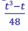 for each group of t tied ranks.

Let's see an example where we use a 12-fold cross-validation.

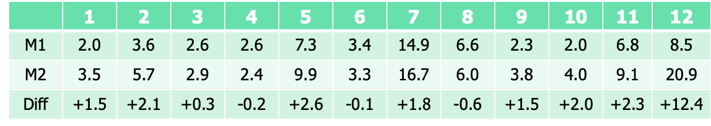

For the two classifiers we have these errors. We compute the differences that can be positive or negative. Then we rank differences without taking in consideration signs, we just store them:

Calculating W+ and W- gives:

$W^-=1+2+4=7$, summing ranks of negative differences $W^+=3+5.5+5.5+7+8+9+10+11+12=71$, summing ranks of positive differences.

Therefore:

It is greater than 20, so we can adopt the normal approximation and we must consider:

Since we can use a normal approximation. We have one group of 2 tied ranks, so we must reduce the variance by (8-2)/48 = 0.125

We can compute the z-score defined as:

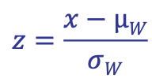

A z-score is a measure of how many standard deviations below or above the population mean a raw score is.

> 

Looking up this score in the z-table\*, we get an area of 0.9880, equal to a two-tailed p-value of 0.012. This is a tiny p-value, a strong indication that the medians are significantly different so we can reject the null hypothesis.

The z-table here is to the right of the mean, so I had to double the actual result I found (.4940). 

We can also work in a different way, fixing apriori a value of p, compute z and see if we have a value of probability higher/lower of this way.

We must refer to the table to decide if this value allow us to reject the null hypotesis with the confidence we fixed.

In this way we can assume statistical independence and assume that one classifier is better than another.

If we have more than two classifiers the solution to choose the best classifier we can compute them in pairs, but it would be better to use some specific statistical test for this aim.

We must use same training and test sets for both classifiers in k-fold cross-validation and store values, then we apply one of the tests we analyzed.

Only if we can reject the null hypothesis, we conclude that a classifier is better or not.

Typically, a confidence of 0.05 is used, we have to take care of this value.

### Statistical Significance

We applied the statistical tests to the accuracy (just one value).

How can we compare two classifiers whether the dataset is imbalanced using statistical tests?

In these cases, we cannot use accuracy but two metrics.

You recall in this case we have the pairs (Recall-Precision) or (sensitivity-specificity).

But the test we analyzed before are test used with accuracy.

Possible solutions are:

- F-measure (combination between recall and precision)

- AUC - Area Under the ROC curve, we can use also this area.

Using this area is another way when we work with imbalanced datasets.

## ROC Curve

The __ROC__ (Receiver Operating Characteristics) curves method is used for visual comparison of classification models.It is originated from signal detection theory.

It shows the trade-off between the true positive rate and the false positive rate.

Vertical axis represents the true positive rate.

Horizontal axis rep. the false positive rate.

The plot also shows a diagonal line.

We can change parameters of a classifier to have different TPR and FPR:

- TPR= TP/P

- FPR= FP/N

TPR and FPR are computed considering the classifier we have trained in the test set.

The optimal classifier in the ROC curve should be located on the (0,1) point.

A model with perfect accuracy will have an area of 1.0.

Each classifier close to this point is a good classifier.

Let's assume that we can vary the parameters of classifiers and obtain the M2 curve and M1 curve.

The area under the ROC curve (AUC) is a measure of the accuracy of the model.

A larger area means the classifier is closer to the optimal classifier, the (0,1) point.

If we have only one possible combination of parameters, we can connect the point (FPR,TPR) corresponding to the classifier to point (0,1) and to point (1,1) and compute the area under the curve.

We pass from having two values for measuring the performance of the two classifiers to have one value, the area under the curve that takes in consideration TPR and FPR.

Instead of f-measure we can use the area under the curve computed in this way.

For each fold we can compute TPR, FPR, the area under the curve and we will have a distribution of 10 values and apply statistical tests.

This is a way to use one value instead of a pair.

The closer to the diagonal line (i.e., the closer the area is to 0.5), the less accurate is the model.

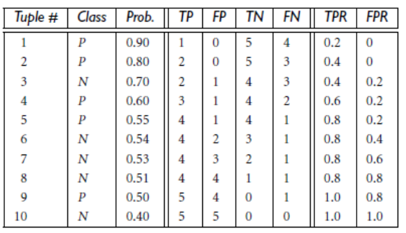

In this eample we use a classifier based on the probability.

We classify an instance as a positive instance if the probability is higher than the threshold we have in the column probability, all others are negative.

If we consider the distribution of the first instances, one is considered positive because probability is higher than 0.9 and all others as negative.

Decreasing the probability threshold, we increase the probability to classify tuples as positive,

Changing the parameters, we can have the curve we discussed, that is represented by the dashed line, obtained decreasing the probability threshold.

Once did this, we can obtain the convex hull, which is the minimal convex set containing the points of the ROC curve. This hull allows us to make the following consideration.

### Model Selection: Cost of a Classifier

We can evaluate the cost of a classifier represented by the point (FPR, TPR).

A positive misclassified for a negative typically has a higher cost tan a negative misclassified for a positive.

Let's assume that we can establish a cost for misclassification.

We can express the cost of the classifier as following.

P(n) and P(p) are the a-priori probabilities of a negative example and a positive example.

C(Y,n) (cost to misclassify a negative for a positive) and C(N,p) (cost to misclassify a positive for a negative) are the false positive cost and false negative cost.

Once fixed the values of P(n), c(Y,n), P(p) and C(N,p), we can obtain a family of parallel lines (called iso-cost lines) with slope:

We fixed the slope and obtained these lines that allow us to minimize the classification cost, which is the tangent point between the ROC curve and the family of parallel lines.

Because this classifier is the one closer to the optimal, we have the lowest value of FPR and FNR.

The points belonging to the same line have the same cost, and the cost decreases as we move to parallel lines closer to the point (0,1), i.e., more north-west.

Once fixed the cost and the probability this allow us to find the best classifier for the specific application.

We can change the parameters to obtain different TPR and FPR, in this way we can compute the slope for iso-cost lines, find the tangent and determine the optimal classifier for this specific application.

We are choosing here:

because the cost of misclassification a positive for a negative is typically higher.

### Comparing Different Classifiers with AUC (case imbalanced datasets)

If we can draw the ROC curve, we can compute the convex hull and determine the best classifier.

The tangent point is in the convex hull; therefore we compute the convex hull.

The ROC curve is the method we use when we deal with imbalanced datasets.

When we have the cost, we can choose if we prefer FP or FN.

If we are able to determine the cost, we can find the correct balance between FP and FN.

# Techniques to Improve Classification Accuracy: Ensemble Methods

One idea is to use a combination of models to increase accuracy.

We combine a series of k learned models $M_1, M_2, ..., M_k$ with the aim of creating an improved model $M^*$.

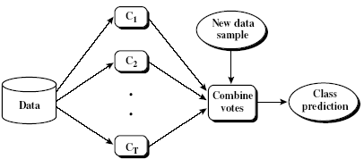

We aggregate their results to improve accuracy.

Popular ensemble methods are:

- __Bagging__: averaging the prediction over a collection of classifiers

- __Boosting__: we give a weighted vote with a collection of classifiers

- __Ensemble__: combining a set of heterogeneous classifiers 

## Bagging (Bootstrap Aggregation)

Analogy: Diagnosis are based on multiple doctors' majority vote

Training:

- Given a set $D$ of $d$ tuples, at each iteration $i$, a training set $D_i$ of $d$ tuples is sampled with replacement from $D$ (i.e., bootstrap).

- A classifier model $M_i$ is learned for each training set $D_i$

We generated a different dataset with $d$ tuples for each model we generated.

Classification: classify an unknown sample $X$

- Each classifier $M_i$ returns its class prediction

- The bagged classifier $M^*$ counts the votes and assigns the class with the most votes to $X$

In this way we generate different models, and we change the training set, this is why we expect to improve accuracy.

It's possible to use it for the prediction of continuous values by taking the average value of each prediction for a given test tuple.

Accuracy of bagging is often significantly better than a single classifier derived from $D$. For noise data: not considerably worse, and typically more robust.

We typically have a proved improved accuracy in prediction.

To help illustrate the power of an ensemble, consider a simple two-class problem described by two attributes, $x_1$ and $x_2$. The problem has a linear decision boundary.

Figure (a) shows the decision boundary of a decision tree classifier on the problem.

Figure (b) shows the decision boundary of an ensemble of decision tree classifiers on the same problem. We combine different boundaries and we obtain a different form, more adapted.

## Boosting

Analogy: Consult several doctors, based on a combination of weighted diagnoses; the weight is assigned based on the previous diagnosis accuracy.

How boosting works?

- Weights are assigned to each training tuple

- A series of $k$ classifiers is iteratively learned

- After a classifier $M_i$ is learned, the weights associated with each tuple are updated to allow the subsequent classifier, $M_{i+1}$, to pay more attention to the training tuples that were misclassified by $M_i$.

- The final $M^*$ combines the votes of each individual classifier, where the weight of each classifier\'s vote is a function of its accuracy.

A classifier with a higher accuracy is considered more reliable.

Each classifier has its own weight too.

Boosting algorithm can be extended for numeric prediction. Comparing with bagging, Boosting tends to have greater accuracy, but it also risks overfitting the model to misclassified data. 

We start to assign the same weights to all instances.

The approach just generates $k$ classifiers but at each round tuples from $D$ are sampled with replacements to form a training set, but the chance to select a tuple is based on its weight.

Higher the weight and higher is the probability of selection.

At the beginning all instances have the same probability, we generate the training set for the first classifier and let's assume it classifies correctly the instances not circled. We increase the weight for he circled instances because the next classifier must focus on them.

For the subsequent classifier we will have other instances misclassified and so on.

At the end we have a set of classifiers, each able to focus on specific instances and specific zones of the space.

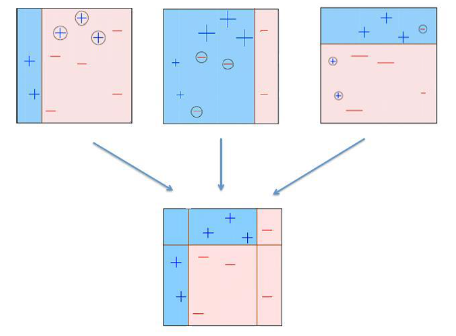

When we put them together we expect higher performances.

### Adaboost Algorithm

Given a set of $d$ class-labeled tuples, $(X_1, y_1), ..., (X_d, y_d)$.

Initially, all the weights of tuples are set to the same $1/d$.

Generate $k$ classifiers in $k$ rounds.

At round $i$,

- Tuples from $D$ are sampled (with replacement) to form a training set $D_i$ of the same size

- Each tuple's chance of being selected is based on its weight

- A classification model $M_i$ is derived from $D_i$

- Its error rate is calculated using $D_i$ as a test set

- Classifier $M_i$ error rate is the sum of the weights of the misclassified tuples: 

where $err(X_j)$ is the misclassification error of tuple $X_j$.

- If a tuple $(X_j, y_j)$, is correctly classified, then the weight is updated as follows:

We decrease the weight of correct classifier's instances.

- Once the weights are updated, the weights for all the tuples (both correctly and incorrectly classified) are normalised so that their sum remains the same it was before. If we normalize and decrease the weight for correctly classified instances it's like we increase it for misclassified instances.

- ‎The normalization is performed by multiplying the weight by the sum of the old weights and dividing it by the sum of the new weights (the weights of misclassified tuples are increased!)

Once the boosting is complete, how is the ensemble of classifiers used to predict the class label of a tuple?

Boosting assigns a weight to each classifier's vote, based on how well the classifier performed.

The lower a classifier's error rate, the more accurate it is and therefore the higher its weight for voting should be

The weight of classifier $M_i$'s vote is:

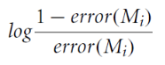

For each class $c$ we sum the weights of each classifier that assigned class $c$ to $X$. The class with the highest sum is the "winner" and is returned as the class prediction for tuple $X$.

This is the Adaboost algorithm:

Boosting vs Bagging:

## Random Forest

The idea is to have a large ensemble of decision trees. Each classifier is a decision tree classifier and is generated using a random selection of attributes at each node to determine the split.

Each tree votes and the most popular class is returned.

If I have a training set and I learn a lot of trees we obtain always the same decision tree. We have to consider another approach to learn decision trees.

__Classical Algorithm:__

Let $N$ and $M$ be the number of training instances and attributes, respectively. Let $m$ be the number of attributes to be used for choosing the decision attribute at any node.

1. Choose a training set by randomly extracting $N$ samples with replacement from all available training instances (i.e. take a bootstrap sample), for each decision tree (the number of samples will be still the same). Use the rest of the instances to estimate the error of the tree.

2. For each node of the tree, randomly choose $m$ attributes on which to base the decision at that node, then we determine the optimal attribute between the set of selected attributes. Calculate the best split based on these $m$ variables in the training set.

3. Each tree is fully grown and not pruned (as may be done in constructing a normal tree classifier). We don't need a pruning phase because with the second step when we use randomly some attributes, we just create a variation to the classical approach and when we combine different trees we take the peculiarity of each tree and this avoid overtraining.

Classification: Each tree assigns a class to the unlabeled instance. The most popular class is returned.

__Advantages:__

- RF is one of the most accurate learning algorithms available. For many data sets, it produces a highly accurate classifier.

- RF runs efficiently on large databases.

- RF can handle thousands of input variables without variable deletion.

- RF gives estimates of what variables are important in the classification.

- RF generates an internal unbiased estimate of the generalization error as the forest building progresses.

- RF has an effective method for estimating missing data and maintains accuracy when a large proportion of the data are missing.

__Disadvantages:__

- RFs have been observed to overfit for some datasets with noisy classification/regression tasks. We still have problems of overtraining.

- For data including categorical variables with different number of levels, RFs are biased in favor of those attributes with more levels. Therefore, the variable importance scores from random forest are not reliable for this type of data.

- Another disadvantage is that the interpretability of random forest is lower than decision trees. Each decision tree has a rule activated and at the end we just exploit the majority, combining information from different trees.

# Classification of Class-Imbalanced Data Sets

When we work with imbalanced datasets we can't work with accuracy.

When we work with imbalanced datasets, we have problems in terms of learning. In classifiers where we reduce the error between the prediction and the ground-truth, misclassification of majority classes weight more and that's why they tend to learn more about majority classes, they tend to reduce the misclassifications of those classes.

In decision tree learning we don't minimize the error but increasing the info\_gain, that's why it works quite good with imbalanced datasets.

But in learning classifiers which minimize misclassification errors, we have to try to rebalance the training set.

Class-imbalance problem: Rare positive example but numerous negative ones, e.g., medical diagnosis, fraud, oil-spill, fault, etc.

Traditional methods assume a balanced distribution of classes and equal error costs: not suitable for class-imbalanced data

Typical methods for imbalance data in 2-class classification:

- Oversampling: re-sampling of data from positive class, we assume the positive class is the minority class

- Under-sampling: randomly eliminate tuples from negative class (majority class)

- Threshold-moving: moves the decision threshold, t, so that the rare class tuples are easier to classify, and hence, less chance of costly false negative errors

- Ensemble techniques: We use ensemble multiple classifiers introduced above and in this way we reduce this problem.

Still difficult for class imbalance problem on multiclass tasks, in that case this is more complex.

When we want to rebalance a dataset, we apply it only for the training set. In reality, in fact, we don't have the test set is available.

__SMOTE: Synthetic Minority Over-sampling Technique__

It is an example of oversampling in which the minority class is over-sampled by creating "synthetic" examples rather than by over-sampling with replacement.

In the ROC curve we want to have TPR close to 1 and FRP close to 0, with oversampling or under sampling our aim is learn a classifier quite close to the ideal point.

The minority class is over-sampled by taking each minority class sample and introducing synthetic examples along the line segments joining any/all of the k minority class nearest neighbors.

We randomly exploit a point along the line.

Depending upon the amount of over-sampling required, neighbors from the k nearest neighbors are randomly chosen.

For instance, if the amount of over-sampling needed is 200%, only two neighbors from the five nearest neighbors are chosen and one sample is generated in the direction of each.

Synthetic samples are generated in the following way:

- Take the difference between the feature vector (sample) under consideration and its nearest neighbor.

- Multiply this difference by a random number between 0 and 1, and add it to the feature vector under consideration.

- ‎This causes the selection of a random point along the line segment between two specific features. This approach effectively forces the decision region of the minority class to become more general.

In case of imbalanced dataset, we must rebalance the training set.

When we apply 10-cross validation, first we select 9 folds and then rebalance this training set, learn the classifier and measure the performance on the remaining.