# Cluster Analysis

A cluster is a collection of data objects characterized by similarity.

We have to achieve similar (or related) objects belonging to the same group and dissimilar (or unrelated) to the objects in other groups.

Cluster analysis consists on finding similarities between data according to the characteristics found in the data and grouping similar data objects into clusters.

This is an __unsupervised learning approach__: no predefined classes

## Typical applications:

- As a stand-alone tool to get insight into data distribution

- As a preprocessing step for other algorithms, like k-nearest neighbors

### Possible applications are:

- Biology: taxonomy of living things: kingdom, phylum, class, order, family, genus and species

-  Information retrieval: document clustering

-  Land use: Identification of areas of similar land use in an earth observation database

- Marketing: Help marketers discover distinct groups in their customer bases, and then use this knowledge to develop targeted marketing programs

- City-planning: Identifying groups of houses according to their house type, value, and geographical location  

- Earth-quake studies: Observed earth quake epicenters should be clustered along continent faults

- Climate: understanding earth climate, find patterns of atmospheric and ocean

- Economic Science: market research

### We can use clustering as a preprocessing tool:

- Summarization: Preprocessing for regression, PCA, classification, and association analysis

- Compression: Image processing: vector quantization

- Finding K-nearest Neighbor: Localizing search to one or a small number of clusters

- Outlier detection: Outliers are often viewed as those "far away" from any cluster

### Clustering evalutation

A good clustering method will produce high quality clusters, which means:

- high intra-class similarity: cohesive within clusters

- low inter-class similarity: distinctive between clusters

The quality of a clustering method depends on

- the similarity measure used by the method

- its implementation, and

- its ability to discover some or all of the hidden patterns

__Similarity__ is expressed in terms of a distance function, typically metric: d(i, j).

The definitions of __distance__ functions are usually rather different for interval-scaled, boolean, categorical, ordinal ratio, and vector variables.

### Considerations for Cluster Analysis

- Partitioning criteria

    - It can be __single level__, we just group objects in cluster

    - __hierarchical partitioning__, where we create an hierarchy of clusters

- Separation of clusters
    
    - It can be __exclusive__ (e.g. one customer belongs to only one 
    - __non-exclusive__ (e.g., one document may belong to more than one class with different membership degree)

- Similarity measure.

    Most of them are distance-based (e.g., Euclidian, road network, vector), while others are connectivity-based (e.g., density or contiguity).

- Clustering space.

    We can cluster considering: Full space (often when low dimensional) vs. subspaces (often in high-dimensional clustering)

- Scalability

    Clustering all the data instead of only on samples. When we have a high number of samples we can reduce the number of data in which we apply clustering.

- Ability to deal with different types of attributes, which can be numerical, binary, categorical, ordinal, linked, and mixture of these.

- Constraint-based clusteringUser may give inputs on constraintsUse domain knowledge to determine input parameters

- Interpretability and usability

- Others

    - Discovery of clusters with arbitrary shape

    - Ability to deal with noisy data

    - Incremental clustering and insensitivity to input order. Most of algorithms are not updatable if we receive other instances, while in incremental clustering approaches it is possible.

    - When we have high dimensionality we have the curse of dimensionality, instances appear far from each other. We have to use suitable distances, for example the cosine similarity.

## Major clustering approaches are:

- __Partitioning approach__
    
    Construct various partitions and then evaluate them by some criterion, ex:

    - minimizing the sum of square errors
    - optimizing a cost function.

    <br>    

    A typical approach given the number $k$ of partitions to construct, the partitioning method uses an iterative relocation technique that attempts to improve the partitioning by moving objects from one group to another (`k-means`, `k-medoids`, `CLARANS`)

- __Hierarchical approach__

    Create a hierarchical decomposition of the set of data (or objects) using some criterion. We have two approaches: Agglomerative and Divisive approaches.

    They suffer from the fact that once a step (merge or split) is done, it can never be undone.

    Typical methods: `Diana`, `Agnes`, `BIRCH`, `CHAMELEON`

- __Density-based approach__
    
    Based on connectivity and density functions. The idea is to create clusters following dense regions. Typical methods: DBSCAN, OPTICS, DenClue

- __Grid-based approach__
    
    based on a multiple-level granularity structure.

    All the clustering operations are performed on the grid structure. It has fast processing time.

    Typical methods: `STING`, `WaveCluster`, `CLIQUE`

### Recap

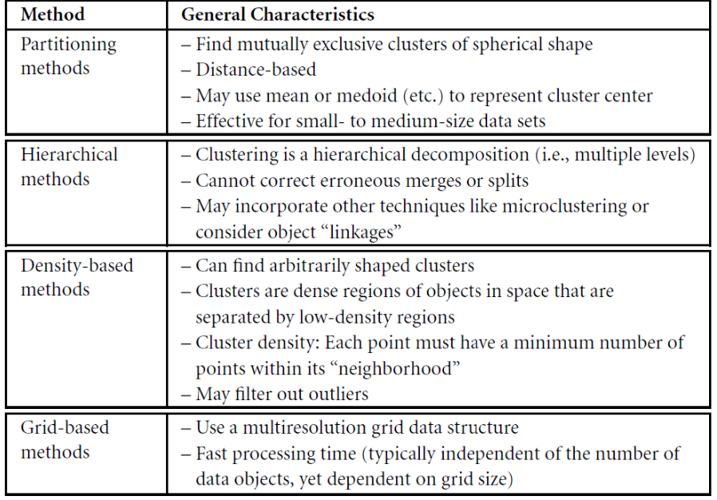

- Partitioning methods have prefix shape of clusters beacuse they have to fix a distance to use. In k-means it is spherical because we use euclidian distance.

- Hierarchical methods are a sort of pre-clustering.

- Density methods follow dense regions, that gives them the ability to use an arbitrary shape. The problem is to define a concept of dense, that consists on a number of points for considering it dense.

    Outliers depend on how we define dense.

### We have other approaches:

- __Model-based__: A model is hypothesized for each of the clusters and tries to find the best fit of that model to each other.

- __Frequent pattern-based__: Based on the analysis of frequent patterns.

- __User-guided or constraint-based__: Clustering by considering user-specified or application-specific constraints.

- __Link-based clustering__: Objects are often linked together in various ways. Massive links can be used to cluster objects: SimRank, LinkClus 

## Assessing Clustering Tendency

Given a dataset, we must consider if it has some clustering tendency.

Applying a clustering algorithm, we obtain cluster, but we can't be sure if they're natural clusters.

Before applying any clustering method on your data, it's important to evaluate whether the data sets contain meaningful clusters or not.

If we apply k-means to the left example, we produce two clusters also if natural clusters are not present.

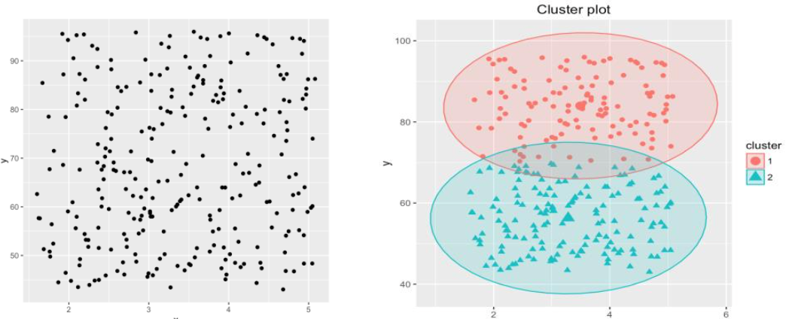

Clustering tendency assessment determines whether a given data set has a non-random structure, which may lead to meaningful clusters.


## Hopkins statistic

The intuition is to understand if our dataset is uniformly distributed in a data space. In this case clusters we discover are clusters without any meaning.

__Hopkins statistic__ tests the spatial randomness of a variable as distributed in a space. It is used to assess the clustering tendency of a data set by measuring the probability that a given data set is generated by a uniform data distribution. In the example seen before we don't have tendency in clusters.

> In other words, it tests the spatial randomness of the data.

### Algorithm

Given a dataset $D$ which is regarded as a sample of a random variable $X$, we want to determine how far away $X$ is from being uniformly distributed in the data space.

It works in this way:

1. Sample $n<<N$ points $<p_1, \dots, p_n>$, uniformly from $D$. 

    For each point $p_i$, we find its nearest neighbor in $D$. 
    
    Let $x_i$ the distance between $p_i$ and its nearest neighbor in $D$.
    
    We find the minimum of the distance of $p_i$ and the nearest neighbor:

    $$
        x_i = \min_{V\in D}{\{dist(p_i, V)\}}
    $$

    > the minimum distance, between $n$ random points and their nearest neighbor

<br>

2. Generate a simulated data set ($random_D$) drawn from a random uniform distribution with $n$ points $<q1, \dots, qn>$ and the same variation as the original dataset $D$. 

    For each point $q_i$, find the nearest neighbor of $q_i$ in $D$.
    
    Let $y_i$ the distance between $q_i$ and its nearest neighbor in $D$

    $$
        y_i = \min_{V\in D, V \neq Q}{\{dist(q_i, V)\}}
    $$

    ex:

    

    In the first case we compute the distance between the points we selected and the points in $D$, in the second case the fictitious point and the closest point in $D$.

3. Calculate the Hopkins Statistic


    $$
        H = \frac{\sum_{i=1}^{n}{y_i}}{\sum_{i=1}^{n}{x_i} + \sum_{i=1}^{n}{y_i}}
    $$

    If $D$ were uniformly distributed, then the two terms at the denominator would be close to each other and therefore H would be about $0.5$.

    Picking up samples from the distribution of data and the space approximately gives similar points.

### Considerations

In presence of clustering tendency, then the first term at the denominator would be smaller than the second and then $H$ will increase.

The sum of $x_i$ is lower than the sum of $y_i$.

The minimum value of $0.5$ in case of uniform distributed point, while $H$ tends to be equal to $1$ when we have a tendency to have a cluster.

The null and alternative hypotheses are defined as follows:

- __Null hypothesis__: the data set D is uniformly distributed (i.e., no meaningful clusters)

- __Alternative hypothesis__: the data set D is not uniformly distributed (i.e., contains meaningful clusters)

The Hopkins statistic is computed for several random selection of points and the average of all results for $H$ is used for a decision: 

- we can heuristically conclude that if $H$ is larger than $0.75$, it indicates a clustering tendency at the $90%$ confidence level.

> Before applying clustering algorithms, we should understand if exists clustering tendency or we could find non-natural clusters.

## Partitioning Methods

First group of clustering algorithms are partitioning algorithms.

A partitioning method consists in partitioning a database $D$ of $n$ objects into a set of $k$ clusters, such that the sum of squared distances is minimized (where $c_i$ is the centroid or medoid of cluster $C_i$).

The cost function we minimize if the following:

$$
    E = \sum_{i=1}^{k}{\sum_{p\in C_i}{(p-C_i)^2}}
$$

We have the difference between each point belonging to a cluster and the representative of the cluster.

We tend to minimize this difference for all point belonging to the different clusters.

### Fixed $k$

Given $k$ find a partition of $k$ clusters that optimizes the chosen partitioning criterion.

This method forces us to fix the number of clusters we want to obtain before the execution of the algorithm. This constraint is strong because we don't know very much of our dataset and how many clusters we can find there. We have to fix $k$ arbitrarly.

This approach try to optimize clusters minimizing the cost function.

One solution to do that is to try all possible partitions but this solution is not possible, with an high number of objects we have an high number of combinations.

Global optimal: exhaustively enumerate all partitions!

We have to find heuristic methods to find an optimum of this cost function.

Heuristic methods are `k-means` and `k-medoids` algorithms.

- __k-means__: Each cluster is represented by the center of the cluster, $c_i$ is the center of the cluster (we average feature be feature all points belonging to the cluster). This means that k-means can be applied if we have all objects described by numerical features.

- __k-medoids or PAM__ (Partition around medoids) : Each cluster is represented by one of the objects in the cluster. In this approach we can have different types of features.

### K-means clustering method

The centroid is defined as the mean value of the points within the cluster.

#### pseudocode

```py

def kmeans(data, k):
    
    # initialize k centroids randomly from data points
    centroids = randomly_initialize_centroids(data, k)

    while True:
        
        # assign each data point to the most similar to the centroid
        clusters = assign_data_to_clusters(data, centroids)

        # calculate new centroids
        new_centroids = mean(clusters)

        # check for convergence
        if centroids_have_converged(new_centroids, centroids):
            return clusters
        
        centroids = new_centroids
```

> We will converge to have optimal clusters because we move objects in clusters and recompute means.


#### Example


- Let's suppose K = 2, we re-assing each object to clusters by computing distance between each object and the center of the cluster and re-assing each object and then update cluster centroids.

- We can also have other termination conditions, for example if the center moves from one iteration to another and so on.

#### Consideations

- This approach, as we can see, is really sensitive to the initialization phase. We have the risk to fall in a local minimum instead of a maximum.

- These clusters are clusters with spherical shape. The reason is that in k-means we assess the similarity between each point and the center of the cluster using the euclidian distance.

##### Strengths

- __Efficient__: $O(tkn)$ where
 
    - $n$ is the number of objects 
    - $k$ is the number of clusters
    - $t$ is the number of iterations. 

    Normally, $k, t << n$. We don't need a lot of iterations typically and this is why we could fall into a local minimum.

    Comparing: 
        - PAM: $O(k(n-k)2)$
        - CLARA: $O(ks2 + k(n-k))$ ($s$ is the size of the data sample)

Comment: Often terminates at a local optimal.

In fact, we can use k-means several times using different initializations and use the result of the execution that achieve the minimum value of the cost function.

##### Weakness

- Applicable only to objects in a __continuous n-dimensional space__. 

    This is not because we determine the distance, but because we have to __compute the center of the clusters__, obtained averaging features' values. 

    We can also use the k-modes method for categorical data.

    The modes are the most probable values, and we don't need to compute the average. In comparison, `k-modes` in k-medoids can be applied to a wide range of data, but we have problems of complexity.

- __Need to specify $k$__, the number of clusters, in advance. 
    
    But there are ways to automatically determine the best $k$. 
    
    We could think to execute k-means a number of times by increasing the value of k and use the value of k that guarantees us to have the minimum value of the cost function. 
    
    The minimum value is achieved when $k = n$, we only have one point in the cluster and $p - c_i = 0$, with the increasing of the number of clusters we have the decreasing of $E$. 
    
    This is why this approach is not correct. I cannot use the minimum value of the cost function to determine the value of $k$. But we will se an approach to do that.

- __Sensitive to noisy data and outliers__. 

    If we have an outlier, for how the algorithm works, the outlier has to be located in one cluster. 
    
    The effect that we have is attracting the center of the cluster, moving it form the natural position. 
    
    `k-means` is sensitive to outliers because each object has to be place in one cluster. 
    
    > The sensitivity to noise can be defeated with `k-memoids`, in which we use as representative directly one point on the cluster. Instead of computing the mean, we choose some point in the cluster, limiting the effect.

- __Not suitable for discovering clusters with non-convex shapes__ 

    it derives from the use of euclidian distance but also with other types of distances. We can determine only convex shapes, in particular with the euclidian we have a spheric shape.

#### k-means variants

Most of the variants of the k-means differ in:

- Selection of the initial k means

- Dissimilarity calculations

- Strategies to calculate cluster means

If we want to handle categorical data, we can use __k-medoids__, replacing means of clusters with modes.

We will use new dissimilarity measures to deal with categorical objects and a frequency-based method to update modes of clusters.

We can also use a mixture of categorical and numerical data, the `k-prototype method`.

#### What Is the Problem of the K-Means method ?

> The k-means method is sensitive to outliers!

the k-medoids solve this problem by choosing the most centrally located object in a cluster. Ex:

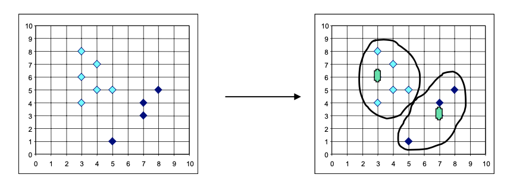

### K-medoids

#### The idea

- Initial representatives are chosen randomly

- The iterative process of replacing representative objects by no representative objects continues as long as the quality of the clustering is improved
    - For each representative `Object O` (medoid) and `object R` non-representative swap `O` and `R`

    - Choose the configuration with the lowest cost
    
    - Cost function is the difference in absolute error-value if a current representative object is replaced by a non-representative object

> The cost function is the difference in absolute error-value if a current representative object is replaced by a non- representative object

#### PAM (typical K-Medoids Algorithm)


We assume we want to determine $k = 2$ clusters, choose arbitrarily k-object as medoids, and assign each remaining object to the nearest medoid.

We select a non-medoid object and compute the total cost of swapping, if it improves the quality of the cluster (reduce the cost function) we will accept swapping, otherwise we will select another non-medoid object.

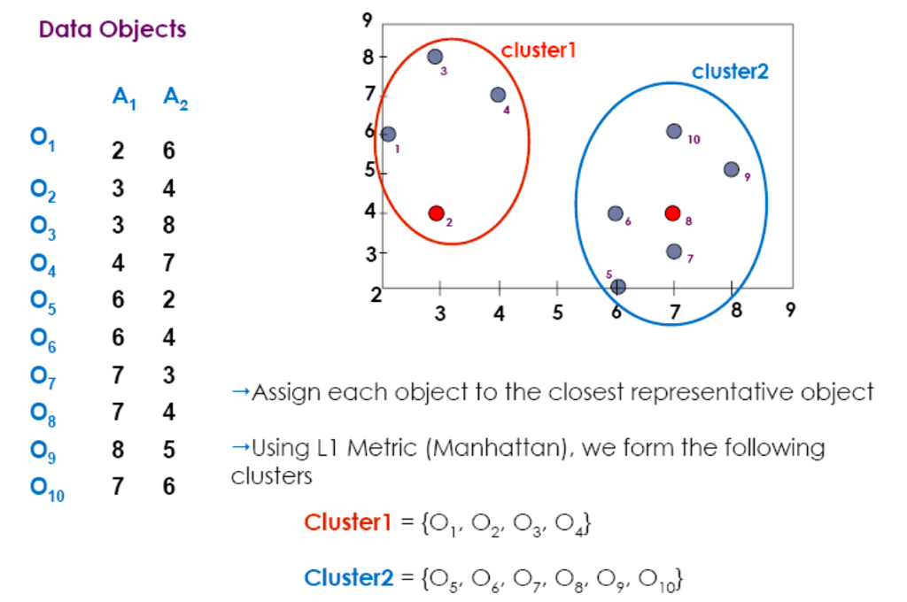

We ask if we can replace the medoid $8$ with another medoid to decrease the cost function.

First, we compute the cost function for the current situation we have, for medoids $2$ and $8$. We find out that the cost is $20$.


$$
    E = \sum_{i=1}^{k}{\sum_{p\in C_i}{|p-o_i|}} =  |o_1-o_2| + |o_3-o_2| + |o_4-o_2|
$$
$$
    + \ |o_5-o_8| + |o_6-o_8| + |o_7-o_8| + |o_9-o_8| + |o_{10}-o_8| =
$$
$$
    = (3+4+4) + (3+1+1+2+2) = 20
$$

We extract randomly the object 7 to replace object 8.

We must be sure that this gives benefits.

$$
    S = newE - E = 22 - 20 = 2
$$

$$

    S > 0 \implies \text{no replacement} 
$$

### 4 different cases


Let's assume we have the two classes at the beginning.

If we change the representative for the cluster 2, from that B to the other, the situation do not change.

In the second case, B is replaced from another B and the cluster changes, and P that initially was in cluster 2, will belong to cluster 1, just because is closer to medoid A than medoid 2.


In this other case we have just a change in B but P remains.

In the fourth, P is reassigned to B instead of A.

The cluster can change because the point can be attracted by another cluster.

Partitioning Around Medoids (PAM) approach has this pseudo-code:

#### Current PAM pseudocde

```py

def PAM(data, k):

    medoids = randomly_initialize_medoids(data, k)

    while True:

        # assign each data point to the closest medoid
        clusters = assign_data_to_clusters(data, medoids)

        # calculate the total cost of the current medoids
        current_cost = calculate_total_cost(clusters, medoids)

        # initialize variables to track new medoids and lowest cost
        new_medoids = []
        lowest_cost = current_cost

        for i in range(k):

            # select a random medoid for each current medoid 
            temp_medoids[i] = random.sample(data, k)

            # assign data points to clusters with new medoids
            temp_clusters = assign_data_to_clusters(data, temp_medoids)

            # calculate the total cost of the new medoids
            temp_cost = calculate_total_cost(temp_clusters, temp_medoids)

            # if new medoids result in lower cost, update new medoids and lowest cost
            if temp_cost < lowest_cost:
                new_medoids = temp_medoids
                lowest_cost = temp_cost

        # check for convergence by comparing new and old medoids
        if medoids_have_converged(medoids, new_medoids):
            return clusters

        medoids = new_medoidss
```

#### Original PAM pseudocde


This version constructs the initial medoid $m_1$ as the minimum of the distance of each object on the dataset and the medoid we are considering.

The complexity is high just for the initial construction.

In second step we use pairs where $i$ are the k-medoids and $j$ are the other objects, We have to consider all other objects to decrease the objective cost.

When the number of objects is high, this algorithm is not applicable.

The original PAM is computationally very heavy.

#### PAM vs K-means

- Pam is more robust than k-means in the presence of noise and outliers because a medoid is less influenced by outliers or other extreme values than a mean.

- Pam works efficiently for small data sets but does not scale well for large data sets. The complexity is $O(k(n-k)^2)$ for each iterationwhere n is the number of data and k is the number of clusters.

In the literature were proposed approaches to have efficiency improvement on PAM.


### CLARA

__CLARA__ draw a sample of the dataset and applies PAM on the sample to find the medoids.

We reduce computational effort reducing number of objects, using sampling.

If the sample is representative the medoids of the sample should approximate the medoids of the entire dataset.

Medoids are chosen from the sample.

Note that the algorithm cannot find the best solution if one of the best k‐medoids is not among the selected sample.

We can have a good approximation anyway.

To improve the approximation, multiple samples are drawn and the best clustering is returned as the output.The clustering accuracy is measured by the average dissimilarity of all objects in the entire dataset. 

We start from the overall dataset, generate samples and apply PAM on each sample and then we just the best clustering we have from the different outputs

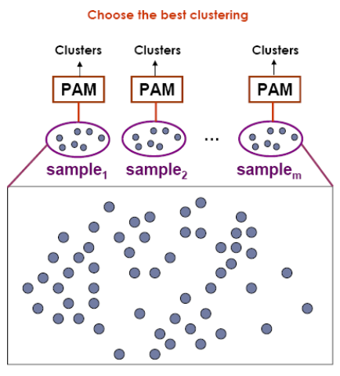

#### Idea

For $i$ from 1 to $R$, repeat the following steps

1. Draw a sample of objects randomly from the entire data set and call the algorithm PAM to find k medoids of the sample.

2. For each object in the entire data set, determine which of the k medoids is the most like it.

3. Calculate the average dissimilarity ON THE ENTIRE DATASET of the clustering obtained in the previous step. If this value is less than the current minimum, use this value as the current minimum, and retain the k medoids found in Step (b) as the best set of medoids obtained so far.

#### Strength:

- deals with larger data sets than PAM, the complexity is squared but with the size of the sample and linear with the total number of objects. It is $O(ks^2 + k(n-k))$, where s is the size of the sample, k the number of clusters and n the number of objects.

#### Weakness:

- Efficiency depends on the sample size

- A good clustering based on samples will not necessarily represent a good clustering of the whole data set if the sample is biased

### CLARANS

To improve its quality was proposed `CLARANS` (A Clustering Algorithm based on Randomized Search).

The clustering process can be presented as searching a graph where every node is a potential solution, that is, a set of k medoids.

Two nodes are neighbors if their sets differ by only one medoid.

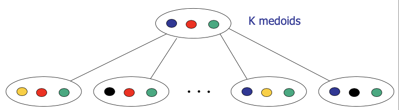

Each node is associated with a cost that is defined to be the total dissimilarity between every object and the medoid of its cluster.

The problem corresponds to search for a minimum on the graph.

At each step, all neighbors of `current_node` are searched; the neighbor who corresponds to the deepest descent in cost is chosen as the next solution.

We start from a node that consists of a set of medoid and we investigate changing of one medoid if we can improve the cost function. In that case we move to the node that improves the cost function and we investigate all directly connected nodes with one medoid different.

For large values of $n$ and $k$, examining $k(n‐k)$ neighbors is time consuming. 

At each step, `CLARANS` draws sample of neighbors to examine. 

We initialize a sample of neighbors instead of all possible.

Note that `CLARA` draws a sample of nodes at the beginning of search; therefore, `CLARANS` has the benefit of not confining the search to a restricted area. 

If the local optimum is found, `CLARANS` starts with a new randomly selected node in search for a new local optimum. The number of local optimums to search for is a parameter.


It is more efficient and scalable than both PAM and CLARA; returns higher quality clusters.

Complexity is $O(n)$


We must fix numlocal and maxneighbor.

Each node in $G_{n,k}$ is represented by a set of k objects

Two nodes are neighbors if their sets differ by only one object. More formally, two nodes $S_1=\{O_{m1}, \dots, O_{mk}\}$ and $S_2 = \{O_{w1},\dots, O_{wk}\}$ are neighbors if and only if the cardinality of the intersection of $S_1, S_2$ is $k-1$.

### Differences between `CLARA` and `CLARANS`


In CLARA we draw a sample of nodes at the beginning of the source, neighbors are from chosen sample and we are confining this way the area.


Here we work with all original dataset.

In conclusion, the clustering process can be presented as searching a graph where every node is a potential solution, that is, a set of k medoids. Two nodes are neighbors in the graph if their sets differ by only one object.

### Conclusions on K-medois methods

- `PAM` examines all the neighbors of the current node in its search for a minimum cost

- `CLARA` draws a sample of nodes at the beginning of a search and apply PAM to the subsets

- `CLARANS` dynamically draws a random sample of neighbors in each step of a search. We explore neighbors of nodes to investigate if we can reduce the cost function.

> At the end we have the partition with `k-medoids`.

> `k` must be fixed and only convex shapes can be found.

## Hierarchical methods

In these approaches we determine a hierarchy of clusters. Some clusters are included in clusters at higher level.

They use distance matrix as clustering criteria. These methods do not require the number of clusters $k$ as an input, but needs a termination condition.

We have two approaches to generate hierarchies:

- __agglomerative approach__ that starts from one cluster for each object, and creates the hierarchy joining clusters.

- __divisive approach__ that starts with all objects in one cluster and tries to split clusters in sub-clusters. At each level it splits clusters creating this hierarchy.


We don't have the view we have before, we have a tridimensional view, at each level we have different partitions.

We will cut the hierarchy at some level and exploit the partition I have at some specific level.

In some applications we can exploit the relation between a cluster and its descendent. We use the hierarchy because the cluster is a generalization of what I can have at the lower levels.

#### Strategies for joining/dividing clusters


In `Diana` if we realize that we realize that some objects are far away from others, we probably must split.

##### Connectivity matrix

Hierarchical clustering frequently deals with the matrix of distances (dissimilarities) or similarities between training samples, and not with the matrix of objects.

It can speed-up the computation. We can compute it from the matrix of objects.

It is sometimes called connectivity matrix.

To merge or split subsets of points rather than individual points, the distance between individual points must be generalized to the distance between subsets.


##### Linkage metrics

I cannot reason on distance between objects, but we have to generalize the concept of distance defining distance between clusters.

Such derived proximity measure is called a __linkage metric__.

Linkage metrics are constructed from elements of the connectivity matrix. The type of the linkage metric used significantly affects hierarchical algorithms, since it reflects the concept of closeness and connectivity.

If we change the linkage metric, we use the results change.

These are metrics to measure distances between sets, major inter-cluster linkage metrics include __single link__, __average link__, and __complete link__.

We exploit the dissimilarity matrix to compute them.

> The underlying dissimilarity measure (usually, distance) is computed for every pair of points with one point in the first set and another point in the second set. A specific operation such as minimum (single link), average (average link), or maximum (complete link) is applied to pair-wise dissimilarity measures:

$$  
    
    d = \underset{x \in C_i, y \in C_2}{operation}(d(x,y))
$$

- __Single__ link (nearest neighbor). The distance between two clusters is determined by the distance of the two closest objects (nearest neighbors) in the different clusters.

    This rule will, in a sense, string objects together to form clusters, and the resulting clusters tend to represent long chains.

    

    I must compute the distance between each object of the first and second cluster and select the minimum distance. It corresponds to the distance of nearest neighbors.

- __Complete link__ (furthest neighbor). The distance between two clusters is determined by the greatest distance between any two objects (furthest neighbors) in the different clusters.

    This method usually performs quite well in cases when the objects form naturally distinct \"clumps.\" If the clusters tend to be somehow elongated or of a \"chain\" type nature, then this method is inappropriate.

    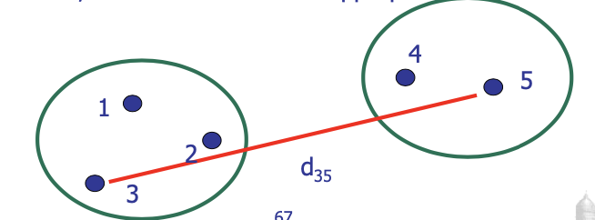

    I must compute the distance between each object of the first and second cluster and select the largest distance.

- __Pair-group average__. The distance between two clusters is calculated as the average distance between all pairs of objects in the two different clusters. This method is also very efficient when the objects form natural distinct \"clumps,\" however, it performs equally well with elongated, \"chain\" type.

    


#### Considerations

These metrics correspond to this type of scenario.


- In case of single link, we just put these two clusters together.

- In case of complete link, we connect the two clusters in the picture, the distance between the two horizontal clusters is higher than verticals.

If we change linkage metrics, we change results we have in case of hierarchies.

#### Represent the output

To represent the output, we use a tree structure.

A tree structure called a dendogram is commonly used to represent the process of hierarchical clustering

It represents at each level the merging of clusters.

A clustering of the data objects is obtained by cutting the dendogram at the desired level, then each connected component forms a cluster


If we cut the dendogram at level 2 the partition we obtain:

```py   
clusters = [
    [a, b],
    [c],
    [d,e],
] 
```

It allows us to have this relation from course clusters and fine clusters in the hierarchy.

#### Measures for distance between clusters 

- __minimum distance__

    $$
        dist_{min}(C_i, C_j) = \min_{p \in C, p' \in C_J}{|p-p'|}
    $$

- __maximum distance__

    $$
        dist_{min}(C_i, C_j) = \max{p \in C, p' \in C_J}{|p-p'|}
    $$
    
- __mean distance__

    $$
        dist_{min}(C_i, C_j) = |m_i-m_j|
    $$
    
- __average distance__

    $$
        dist_{min}(C_i, C_j) = \frac{1}{n_i n_j} \sum_{p \in C, p' \in C_J}{|p-p'|}
    $$

### Algorithms

- __Nearest-neighbor clustering algorithm__ 
    
    the minimum distance to measure the distance between clusters. 
    
- __Single-linkage algorithm__ 
    
    The clustering process is terminated when the minimum distance between the nearest clusters exceeds a user-defined threshold.

    If we view the data points as nodes of a graph, with edges forming a path between the nodes in a cluster, then the merging of two clusters, Ci and Cj, corresponds to adding an edge between the nearest pair of nodes in Ci and Cj. We just connect the closest points.The resulting graph will generate a tree.Agglomerative hierarchical clustering algorithm that uses the minimum distance measure is also called minimal spanning tree algorithm.

- __Farthest-neighbor clustering algorithm__

    when an algorithm uses the maximum distance to measure the distance between clusters

- __Complete-linkage algorithm__, the clustering process is terminated when the maximum distance between nearest clusters exceeds a user-defined threshold.

    By viewing data points as nodes of a graph, with edges linking nodes, we can think of each cluster as a complete subgraph, that is, with edges connecting all the nodes in the clusters. It tends to minimize the increase in diameter of the clusters at each iteration.High quality in case of clusters compact and of approximately equal size.

#### Considearations

When we use single link we don't care about the diameter of clusters (maximum distance between objects), we just merge them considering the nearest neighbors.

In case of complete link we take the diameter in consideration.

This is the real difference between the two approaches.

If we use different types of linkage metrics, we will have different dendograms.

#### Example

We want to apply a hierarchical clustering approach using two different linkage metrics: single-linkage (b), complete-linkage(c)


1. __Single linkage__ 

    - At the beginning, we have one cluster for each object and we start to merge them.

    - We have to find the minimum distance between clusters, at the beginning corresponds to compute distance between points, we have a point in each cluster.

    - We merge A,B then C,D then F,G then H,J.

    - At the second level of the dendrogram we have to decide which cluster have to be merged.

    - If we analyze distances between clusters, for example the distance between F,G and H,J is the distance between G and H.

    - We choose to merge E with F,G we assume E is closer to F than D and we create a cluster with three elements.

    - At the next level we merge clusters closest considering the single-linkage and so on. Cluster E,F,G is close to C,D.

    - A,B is closer to C,D,E,F,G rather than H,J.

    - In the last level we just merge the two remaining clusters.

    - I can cut at some level the dendrogram and obtain a flat partition.

2. __complete-linkage__ 

    - we have no differences at the first level, because when we consider each point in each clusters we compute the distance between points.

    - From the second level we consider the maximum distance between objects belonging to each class.

    - We are considering the maximum distance between clusters and we select the minimum between these maximum distances,

    - The maximum distance between E and F,G is the distance between E and G.

    - There are differences between the two dendrograms, due to the different kind of linkage metrics we are using. The process is the same.

### AGNES (Agglomerative Nesting)

In this strategy we start from one point for each cluster and we agglomerate.

We use the single-link method and the dissimilarity matrix, not directly the objects.

Initially, each object is placed into a cluster. Clusters are merged according to some criteria.

For instance, if the distance between two objects belonging to two different clusters is the minimum distance between any two objects from different clusters (single-linkage approach).

The cluster merging process repeats until all of the objects are eventually merged to form one cluster.

We can enforce a stopping condition, for example the maximum number of objects inside a cluster

__Single-linkage approach__: each cluster is represented by all of the objects in the cluster, and the similarity between two clusters is measured by the similarity of the closest pair of data points belonging to different clusters.

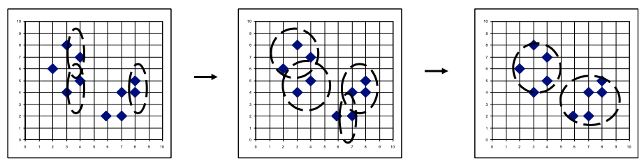

#### Example using single-linkage approach

Let's consider $5$ objects and in particular the dissimilarity metric.

##### steps

Each value represents the distance between the object in the row and in the column.

We start from one object for each cluster, so if we have to merge clusters we have to merge objects. We don't consider the diagonal, of course.

- __d = 1__
    
    given the distance matrix

    |       |A      |B      |C      |D      |E      |
    |-      |-      |-      |-      |-      |-      |
    |__A__  |0      |1      |2      |2      |3      |
    |__B__  |1      |0      |2      |4      |3      |
    |__D__  |2      |2      |0      |1      |3      |
    |__C__  |2      |4      |1      |0      |3      |
    |__E__  |3      |3      |5      |3      |0      |

    we merge

    $$
        A \cup B    \\
        C \cup D    
    $$


- __d = 2__ 

    We create two clusters and recompute the distance matrix.

    |       |AB     |CD     |E      |
    |-      |-      |-      |-      |
    |__AB__ |0      |2      |3      |
    |__CD__ |2      |0      |3      |
    |__E__  |3      |3      |0      |

    the minimum is 2 and so we merge

    $$
        (AB) \cup (CD)    
    $$

- __d = 3__

    given the distance matrix
    
    |           |ABCD   |E      |
    |-          |-      |-      |
    |__ABCD__   |0      |3      |
    |__E__      |3      |0      |

    we merge

    $$
        (ABCD) \cup (E)    
    $$


### DIANA (Divisive Analysis)

`DIANA` uses the inverse order of `AGNES`. We start from all objects inside the cluster and we terminate when we have one object for each cluster.


- The algorithm constructs a hierarchy of clusters, starting with one large cluster containing all $n$ samples. Clusters are divided until each cluster contains only a single sample.

- At each stage, the cluster with the largest dissimilarity between any two of its samples is selected.

- To divide the selected cluster, the algorithm first looks for its most disparate sample. 

    This observation initiates the `splinter group`. 
    
    In subsequent steps, the algorithm reassigns observations that are closer to the `splinter group` than to the `old party`. 
    
    When we split clusters we start from the most different point and verify if the points in the old cluster belongs to the new cluster or have to remain in the old cluster. 
    
    We have to compute the distance between this new cluster and the cluster we had before and we move points to the new cluster if the distance is smaller with it then the old cluster. The result is a division of the selected cluster into two new clusters.

#### The algorithm

1. We start from objects in one single cluster. Find the object, which has the highest average dissimilarity to all other objects. 
    
    This object initiates a new cluster a sort of a splinter group.

2. For each object $i$ outside the splinter group compute 
    
    $$
        D_i = [ average d(i,j),  j \notin R_{splinter group} ]  \\ 
        - [ average d(i,j), j \in R_{splinter group} ]
    $$

3. Find an object $h$ for which the difference $D_h$ is the largest. 
    
    If $D_h$ is positive, then $h$ is, on the average close to the splinter group.

4. Repeat Steps 2 and 3 until all differences $D_h$ are negative. The data set is then split into two clusters.

5. Select the cluster with the largest diameter. The diameter of a cluster is the largest dissimilarity between any two of its objects. 
    
    Then divide this cluster, following steps 1-4.

6. Repeat Step 5 until all clusters contain only a single object.

#### Considerations

- When we split the initial cluster, we have to decide which is the cluster to which we have to work to generate the splinter group. 
We select one cluster among all available, and it will be the cluster with the largest diameter.

- The diameter is the largest dissimilarity between any two objects belonging to the cluster.

#### Example

Let's suppose to have $8$ data objects and that each object is described by only one attribute.


We generate. starting from the dataset, the dissimilarity matrix.

We compute the distance between pairs of objects.

Let's assume all objects are contained in the same cluster.

We want to decide how to split this cluster.


The mean for each row is the mean of distances between the object in the row and all others.

If it's very high, this is quite different from the other objects.

We compute this mean from all objects and we start the splinter group with objects with the highest mean dissimilarity.


All other points remain in the old cluster.

Now we have to decide if objects belonging to the old cluster have to remain there or pass to the new cluster, established by the dissimilarity between each point and the other points in the cluster and the points in the new cluster we found.


We obtain that the maximum mean distance for A1 is obtained by X2, so we compute how much is dissimilar from A1 and B1.

The mean dissimilarity between X2 and B1 is lower, so we can decide that X2 is closer to the new cluster than the old one.

Now we consider the most dissimilar in A2, X3, and compute the distance between it and the new cluster.


Again, we conclude that X3 has to be moved to the new cluster.


X5 remains in the old cluster.

We have two clusters now, to choose which cluster to divide:


We have to choose the cluster by considering the diameter, the maximum distance between objects belonging to the same cluster.

Diam B4\>diam A4, thus we are going to divide the cluster B4

The most dissimilar point is X4 and so we start a new splinter group with it.

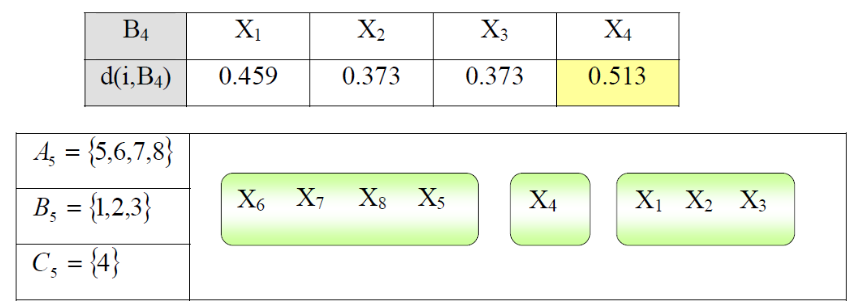

We need to consider if other points can belong to the splinter group.

In B5 the most dissimilar point is X3, we compute the mean dissimilarity.


We repeat until we get one cluster for each object.

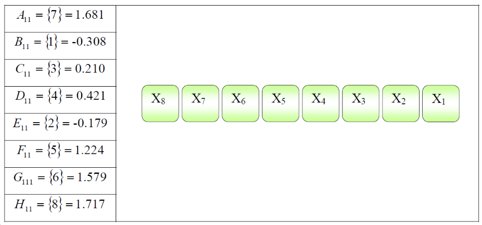

If we store at each step the partition, we generate we get the dendogram.

#### weaknessesof hierarchical clustering

- Can never undo what was done previously

- Do not scale well: time complexity of at least $O(n^2)$, where $n$ is the number of total objects, each time we split we have to reconsider if we have to move objects between clusters.

#### Major strengths

- It's nice that you get a hierarchy instead of an amorphous collection of groups

- Don't need to specify k, because at each level we have a different k.If you want k groups, just cut the (k‐1) longest links. We just must decide the cutting condition and implicitly we fix it implicitly. But we do not use parameters.

- In general, give better quality clusters than k‐means' like methods. The shape of clusters is convex

#### Conslusions

To manage the complexity of this algorithm, several approaches to reduce it have been proposed.

- `BIRCH` (1996): uses CF-tree and incrementally adjusts the quality of sub-clusters

- `CHAMELEON` (1999): hierarchical clustering using dynamic modeling


### BIRCH: Balanced Iterative Reducing and Clustering Using Hierarchies

This is an agglomerative clustering designed for clustering a large amount of numerical data. 

#### What does BIRCH algorithm try to solve?

- Most of the existing algorithms DO NOT consider the case that datasets can be too large to fit in main memory, we try to work with a description of the dataset in the main memory

- They DO NOT concentrate on minimizing the number of scans of the dataset

- I/O costs are very high, it tries to reduce it

The complexity of `BIRCH` is $O(n)$ where $n$ is the number of objects to be clustered.

__BIRCH works with sequence of objects.__

#### Idea

At the beginning we are at the first object; we receive the second and if the cluster of the first is too large adding the object 2 we split the cluster.

Being too large means fixing the diameter of the cluster, and if it is larger, we split the cluster into two clusters.

This decision of splitting or not is taken by considering the diameter of the cluster obtained by adding the new object.

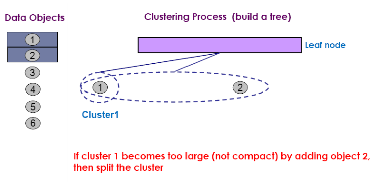

In our data structure we have a data structure where an entry identifies the first cluster and another identify the second,


When we analyze the third object, we must decide if it has to be included in the first or second cluster.

It is closer to object 1 than 2, we try to add it to cluster 1, if it becomes too large by adding it we split the cluster.


We add another entry that identify the new cluster we added.


Analyzing the fourth we discover it is closest to the entry 3.


For entry 3 we have a cluster with two elements, the cluster 2 remains compact when adding it.


Cluster 3 becomes too larger, and we split it.

We have a limit to the number of entries a node can have; we do not split only the cluster but also the node.

We create two leaf-node, one for cluster 1 and 3 and the other with cluster 2 and 4. And we create another node, a non-leaf node that contains links to the leaf nodes.

Entry 1 will contain links to entry 1.1 and entry 1.2 and entry 2 will have links to entry 2.1 and entry 2.2.


When we receive object 6, it is closest to entry 1.2 and we verify that the diameter of cluster 3 can be acceptable.


We generate clusters but also a tree that helps us to store all information we need to manage clusters. Each node contains a description named Clustering Feature that consists of three numbers, ($CF = (N,LS,SS)$).They store the summary of the statistics for a given cluster: the 0-th, 1st and 2nd moments of the cluster from the statistical point of view.

They are used to compute centroids of clusters and measure the compactness and distance of clusters.

The three values we store are:

- N: number of data points

- LS: linear sum of N points

    $$
        LS = \sum_{i=1}^{n}{x_i}
    $$

- SS: square sum of N points

    $$
        SS = \sum_{i=1}^{n}{x_i^2}
    $$


#### Example


Cluster 1 is characterized by CF1, 3 because 3 are the points contained on each cluster, the linear sum of the first feature of points, and the second features' sum.

Then we have for the third value the sum of squared valued for first and second feature.

The CF of cluster 3 can be obtained by the sum of the clustering feature of the two inner clusters. When we update CF1 and CF2 we also update CFs of levels toward the root.

CF entry is a summary of statistics of the cluster and has sufficient information to calculate the centroid, radius, diameter and many other measures:

- __Centroid__: is obtained as:

    $$
        x_0 = \frac{\sum_{i=1}^{n}{x_i}}{n} = \frac{LS}{n}
    $$

- __Radius__: square root of average distance from any point of the cluster to its centroid:

    $$
        R = \sqrt{\frac{\sum_{i=1}^{n}{(x_i-x_0)^2}}{n}} = \sqrt{\frac{\sum_{i=1}^{n}{nSS -  2LS^2 + nLS^2}}{n^2}}
    $$

- __Diameter__: square root of average mean squared distance between all pairs of points in the cluster:

    $$
        R = \sqrt{\frac{\sum_{i=1}^{n}\sum_{k=1}^{n}{(x_i-x_j)^2}}{n(n-1)}} = \sqrt{\frac{2nSS -2LS^2}{n(n-1)}}
    $$

By using three values we can determine parameters to define our cluster.

In this approach we can produce these metrics receiving data in streaming, we process each object each time and update $CFs$.

> We don't need to store data but each time we receive an object, we update CFs, and discard objects.

The data structure we use is the CF-Tree, which is an height-balance tree (exploiting parameters we preserve the balance of the tree).

We use two parameters:

- __Number of entries in each node__, we fix this number of entries and when the number of entries is higher of the one we fix we have to split the node, and this is why we create a balanced tree.

- The __diameter of all entries in a leaf node__, we put in the same cluster objects which the length of the diameter is lower than a prefixed threshold.

We need to fix parameters.

Leaf nodes are connected via prev and next pointers just to create this data structure.

A CF-tree is a height-balanced tree that stores the clustering features CFs for a hierarchical clustering,


At each level we have the description of cluster including the clusters at the subsequent level, and that's why it's hierarchical. $Cf1$ is a description of a cluster that contains all clusters identified by the CF you have in the descendants.

Parameters:

- `B` = Branching factor specifies the maximum number of children per nonleaf node.

- `T` = Threshold parameter specifies the maximum diameter of subclusters stored at the leaf nodes of the tree.

Sometimes we can also use:

- `L` = Max. number of entries in a leaf

We deal with non-leaf nodes and leaf nodes in different ways.

CF entry in parent corresponds to the sum of CF entries of a child of that entry. This is useful because we have all the information that we need to define this super cluster exploiting the CF without accessing to the raw data in the disc.

Splitting and splitting we have that the clusters in the same leaf-node are close to each other.


A Leaf node represents a cluster.

A sub‐cluster in a leaf node must have a diameter no greater than a given threshold `T`.

A point is inserted into the leaf node (cluster) to which is closer.

When one item is inserted into a cluster at the leaf node, the restriction `T` must be satisfied. The corresponding `CF` must be updated and we have to update `CFs` in the chain from the leaf to the root. If there is no space on the node the node is split. 

The `BIRCH` algorithm incrementally construct a `CF tree`, a hierarchical data structure for multiphase clustering.

#### Steps

- __Phase 1__: scan DB to build an initial in‐memory CF tree

    We pickup an object each time and travel the tree to identify if we can add this point to a cluster or we have to split the cluster and recompute CFs from the leaves to the root.

    Check if threshold condition is violated:
    
    - If there is room to insert $\to$ Insert point as a single cluster
    
    - If not

        - Leaf node split: take two farthest CFs and create two leaf nodes, put the remaining CFs (including the new one) into the closest node

        - Update CF for non‐leafs. Insert new non‐leaf entry into parent node.

        - We may have to split the parent as well. Spilt the root increases tree height by one. If not we insert point into the closest cluster

- __Phase 2__: use an arbitrary clustering algorithm to cluster the leaf nodes of the CF‐tree,

    The cluster we have in the leaf-node can be used as cluster or we can use another clustering algorithm, exploiting the clusters we have in the leaf node just to create some cluster with a number of clusters in the leaf node.

    We repeat the partition starting form clusters in the leaf-node.

These 2 phases are the main one, but if we analyze more the `BIRCH` algorithm we have phases to manage trees not included in the main memory.

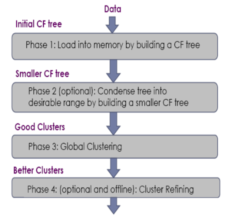

#### Summary

- __Phase 1__: Choose an initial value for threshold, start inserting the data points one by one into the tree as per the insertion algorithm.If, in the middle of the above step, the size of the CF tree exceeds the size of the available memory, increase the value of threshold.Convert the partially built tree into a new tree.

    - The rebuild process is performed by building a new tree from the leaf nodes of the old tree.

    - But there's no need of rereading all the objects, we have all information in CFs.Repeat the above steps until the entire dataset is scanned and a full tree is built.

    We can also have Outlier Handling, because we fix the diameter and we manage them because we will have one outlier in one single clusters. This outlier will not be added to other clusters because the diameter will become too large.

    Depending on how we set the parameters we will handle this.

    If we set a big diameter this may not be true.

- __Phase 2__: A bridge between phases 1 and 3.

    Builds a smaller CF tree by increasing the threshold.

- __Phase 3__: Apply global clustering algorithm to the sub-clusters given by leaf entries of the CF tree.

    This improves clustering quality.

- __Phase 4__: Scan the entire dataset to label the data points and we can do outlier handling.

#### Strengths

- finds a good clustering with a single scan and improves the quality with a few additional scans

- Complexity is $O(n)$

#### Weakness

- Handles only numeric data, and sensitive to the order of the data record. because we must calculate sum and mean.

- Sensitive to insertion order of data points, if I change the order of data the tree can change because the construction of the tree depends on this order.

- Since we fix the size of leaf nodes, so clusters may not be so natural

- Clusters tend to be spherical given the radius and diameter measures. Again, we can discover convex clusters, this is a limitation.

### CHAMELEON

This clustering algorithm takes in consideration different zones in the space in which we have different densities, by building this sparse graph, obtained by data objects.

For each data object $p$ another data object $q$ is connected to $p$ if $q$ is among the top $k$ closest neighbors of $p$.


We generate this graph taking in consideration the `k nearest neighbors` of each object.

`CHAMELEON` build this graph by using this definition then apply a partition of the graph by generating the subgraph, and then, as final step, this subgraphs are merged to generate the final clusters.

The merging phase is performed by exploiting the concept of relative interconnectivity and relative closeness.

In terms of relative interconnectivity, two clusters $c_1$ and $c_2$ are merged if we have that the relative interconnectivity of each other is almost the same of the interconnectivity we have inside $c_1$ and $c_2$.

In terms of relative closeness, the closeness of $c_1$ and $c_2$ is considered over the internal closeness. We put them together if the clusters we are able to generate is characterized by a closeness similar to the closeness we have inside $c_1$ and $c_2$.

> We're looking for natural clusters and this is the approach we follow.

The value of $k$ is used to generate the initial graph and we exploit $k$ because we connect two objects if one of them is among the $k$ closest neighbors.

We connect two objects if we have a node among the $k$ nearest neighbors in fact.


- With $k = 1$ we have a sparse graph.

- With the increase of $k$ this graph is less sparse, we are considering more objects that can be connected and so we are increasing the possibility of interconnectivity.

> Each time we have to apply this algorithm we need to fix this parameter and the results will strongly depend on this parameter.

The ``k-nearest`` neighbor captures the concept of neighborhood dynamically. The density of the region is recorded as __the weight of the edges__: the edges of a dense region tend to weigh more than those of a sparse region.

I compute the k nearest neighbors but this __connection__ between $p$ and $q$ is __characterized by a weight__, that will be higher if the distance is lower.

> When we partition the graph we have to take in consideration dense and sparse regions, we cut graphs in such a way to isolate dense regions so to preserve these natural clusters.

> The weight of each edge represents the closeness between two samples, that is, an edge will weigh more whether the two data samples are closer to each other. This allow us to generate natural clusters and they are more natural clusters than `DBSCAN`.

#### Graph-partitioning algorithm

- A cluster $C$ is partitioned into subclusters $C_i$ and $C_j$ so as to minimize the sum of the weight of the edges that would be cut should $C$ be bisected into $C_i$ and $C_j$. 
    
    We partition the graph cutting where we have a lowest edge, that means we are separating obejcts far to each other.

- Each one of these sub-clusters contains at least 25% of the nodes in $C$. This is a constraint we enforce, we want to cut in a way we have subclusters.

- Edge cut $EC_{\{C_i,C_j\}}$ assesses the absolute interconnectivity between subclusters $C_i$ and $C_j \ $:
     
    the sum of the weight of the edges that connect vertices in $C_i$ to vertices in $C_j$. 
    
    > We want to cut in such a way to limit this sum. 
    
    Each edge is characterized by a weight that measures the closeness and we want to avoid to cut several edges and edge characterized by a high weight.

`CHAMELEON` obtains the initial set of sub-clusters as follows.

- Starts with all the points belonging to the same cluster.

- Then repeatedly selects the largest sub-cluster among the current set of sub-clusters and uses the graph-partitioning algorithm to bisect it.

- This process terminates when the larger sub-cluster contains fewer than a specified number of vertices (typically 1% to 5% of the overall number of data). In other words we start from the overall graph and we repeteatedly partition the graph to arrive at the termination condition we mentioned.Then we perform the agglomerative hierarchical clustering algorithm merges subclusters based on their similarity.

The similarity is determined according to their __relative interconnectivity__, $RI(C_i,C_j)$ and their relative closeness, $RC(C_i, C_j)$. Relative interconnectivity is defined as:

$$
    RI(C_i. C_j) = \frac{|EC_{\{C_i,C_j\}}|}{\frac{1}{2}(|EC_{C_i}| + |EC_{C_j}|}
$$

- $EC_{C_i}$ is the internal inter-connectivity of a cluster $C_i$ 

- We have $C_i$ and if we assume to cut it by partitioning $C_i$ into roughly equal parts and compute the minimal sum of weights this corresponds to this interconnectivity.

If we have that the relative interconnectivity is greater than a specified threshold, that means that if the interconnectivity is comparable of the interconnectivity inside $C_i$ and inside $C_j$, we can consider that they can be merged.

We want to consider also the __relative closeness__ $RC(C_i, C_j)$ is defined as:

$$
    RC(C_i, C_j) = \frac{\bar{S}_{EC_{\{C_i,C_j\}}}}{\frac{|C_i|}{|C_i| + |C_j|} \bar{S}_{EC_{C_i}} + \frac{|C_j|}{|C_i| + |C_j|} \bar{S}_{EC_{C_j}}}
$$

- $\bar{S}_{EC_{\{C_i,C_j\}}}$ is the average weight of the edges that connect vertices in $C_i$ to vertices in $C_j$

- $\bar{S}_{EC_{C_i}}$  is the average weight of the edges that belong to the min-cut bisector of cluster $C_i$. 

Also in this case we are considering if the connection between nodes when we put together $C_i$ and $C_j$ is comparable to the connection we have inside $C_i$ and inside $C_j$.

> The agglomerative hierarchical clustering merges only those pairs of clusters whose relative inter-connectivity and relative closeness are both above some user specified threshold $T_{RI}$ and $T_{RC}$, respectively.

`CHAMELEON` visits each cluster $C_i$, and checks to see if any one of its adjacent clusters $C_j$ satisfy the following two conditions:

If more than one of the adjacent clusters satisfy the conditions, then `CHAMELEON` selects to merge $C_i$ with the cluster that it is most connected to; i.e., it selects the cluster $C_j$ such that the absolute inter-connectivity between these two clusters is the highest.

$$
    RI(C_i, C_j) \geq T_{RI} \quad \land \quad RC(C_i, C_j) \geq T_{RC}
$$

#### Conclusions

`CHAMELEON` works well because it takes in consideration different density region, but it depends on k and the two thresholds.

It also has a complexity $O(n^2)$ (in the worst case) where $n$ is the number of objects.

We can produce clusters with different shapes. It has the power at discovering arbitrarily shaped clusters of high quality, because we take in consideration different density zones.


They are not modellable form partitioning algorithms because they can just find convex clusters.

It takes in consideration different zones with different densities, but the approach is quite complex.

## Density-based methods

Approaches analyzed so far are based on the concept of distance, `CHAMELEON` too because it computes the k-nearest neighbors.

These clustering methods are based on density, such as density-connected points, to decide if instances belong to the same cluster.

We will have different clusters when we met low dense regions, sparse regions.

#### Major features:

- Discover clusters of arbitrary shape, the reason is because we identify the cluster identifying dense regions connected.

- Handle noise

- They determine clusters just using one scan of the dataset

- But they need density parameters as termination condition. In these methods we do not need to fix the number of clusters we want to achieve but we need to set our definition of density, we have to define what's dense for us and this will implicitly determine the number of clusters.

We have to give as input our definition of dense regions. This is given by using two parameters:

- __Eps__: Maximum radius of the neighborhood. Given one object we fix a radius that determine the neighborhood we are considering around one object.

- __MinPts__: Minimum number of points in an Eps-neighborhood of that point.

> Density is the number of points we have in a volume. By specifying Eps and MinPts we are implying the density.

If the Eps-neighborhood (neighborhood within radius Eps - NEps) of an object contains at least a minimum number, MinPts, of objects then the object is called core object.

#### Examples

- ex 1
 
    

    Eps = 1 cm, MinPts=3

    We have that $m$ and $p$ are core objects, $q$ is not because in the neighborhood we don't have 3 objects.

    We define an object p as __directly density-reachable__ from an object $1$ (respect to `Eps`, `MinPts`) if $p$ belongs to $N_{Eps}(q)$ (Neighborhood of q), $q$ is a core object, that is:

    $$
        N_{Eps}(q)| \geq MinPts
    $$

    (cardinality of neighborhood of q is greater or equal than minPts).


- ex 2 
 
    
    
    $q$ is directly density-reachable from $m$, because $m$ is a core point and $q$ belongs to the neighborhood of $m$. 
    
    The viceversa is not true because $q$ is not a core object. $m$ is directly density-reachable from $p$ and vice versa.

    An object $p$ is __density-reachable__ from an object $q$, with respect to $Eps$, $MinPts$, if there is a chain of objects $p_1, \dots, p_n$, such that $p_1 = q, p_n = p$ such that $p_i+1$ is directly density-reachable from $p_i$.

    

- ex 3:
    
    q is density-reachable from p because q is directly density-reachable from m and m is directly density-reachable from p.

    p is not density-reachable from q because q is not a core object. 

    An object p is __density-connected__ to an object q w.r.t. Eps, MinPts if there is an object o such that both p and q are density-reachable from o (w.r.t. Eps and MinPts).

    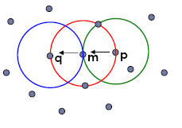

- ex 4:

    p, q and m are all density-connected, because we have m for which q is density reachable and also p is density reachable.

    We want to determine cluster characterized by having objects inside density-connected.

    Object q is (indirectly) density-reachable from p because q is directly density reachable from m and m is directly density-reachable from p. However, p is not density reachable from q because q is not a core object. Similarly, r and s are density-reachable from o and o is density- reachable from r. Thus, o, r, and s are all density-connected.

    

### DBSCAN

__Density-Based Spatial Clustering of Applications with Noise__ relies on a density-based notion of cluster: A cluster is defined as a maximal set of density-connected points.

We determine the cluster once we fix Eps and MinPts using this definition.

The final cluster is just to have clusters of density connected points.

This algorithm is able to discover clusters of arbitrary shape in spatial databases with noise.


They can determine outliers, objects that do not belong to any cluster.

We have objects classified in

- core objects

- outliers

- border objects (objects that belong to a cluster but aren't core objects).

We have them when they belong to a neighborhood of a core object without being a core object. It determines the border of the cluster we are determining.

It searches for clusters by checking the `Eps-neighborhood` of each object in the database.

If the `Eps-neighborhood` of an object $p$ contains more than $MinPts$, a new cluster with a core object is created.

`DBSCAN` iteratively directly collects density reachable objects from these core objects: this may involve the merge of a few density-reachable clusters.

The process terminated when no new point can be added to any cluster.

`DBSCAN` adopts the closure of density-connectedness to find connected dense regions as clusters. Each closed set is a density-based cluster.

A subset $C$ in $D$ is a cluster if

- For any two objects $o_1, o_2$ in $C$, $o_1$ and $o_2$ are density-connected,

- There does not exist an object $o_i$ in $C$ and another object $o_j$ in $(D-C)$ such that $o_i$ and $o_j$ are density-connected

The complexity is $O(n^2)$.

#### Algoritm


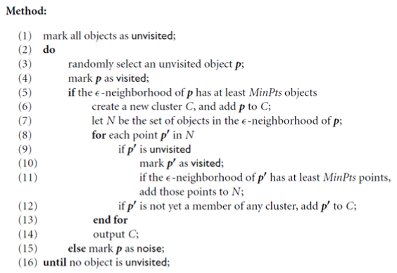

We have to fix those two parameters because we are proposing our definition of dense region and depending on them, we can identify an object as outlier or not.

If `Eps` is smaller, more points will be considered as outliers.

> The problem is to find the optimal value for `Eps` and `minPts`.

> If it doesn't contain at least MinPts objects we mark it as outlier, but it can become a border object of an object. The fact that we denote it as noise do not mean it is an outlier surely.

#### CLARANS vs DBSCAN


Since the shape is spherical, for how this algorithm works we obtain those clusters, the clusters found are not really natural because when we fix the number of clusters, we cannot tell the algorithm that one is big and others small. If we fix 4 we obtain those results because clusters are spherical. The distance fix the shape of the clusters.

In the third case outliers are also included.

With DBSCAN we follow dense regions, and if we fix the right Eps and minPts we can identify correctly these clusters. Here the density is important.

We are also able to find outliers in the last example.

It works well here because we have that density of clusters are similar to each other.

If we have clusters of different densities, we are not able to find them, because if we set Eps and minPts they may be good for a particular density.

It works very well if clusters have same densities.

#### CLUSTER WITH DIFFERENT DENSITIES

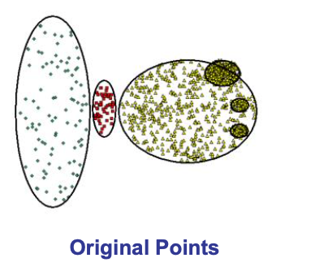

When we use `DBSCAN`, if we set minPts and we vary Eps:


Using large values, we determine clusters characterized by low level of density, we consider very dense small clusters as part of the big cluster.

If Eps is small we are able to identify dense clusters but in clusters with sparse densities we have all outliers now.

If we have similar densities, it is also difficult to find the exact pair of values.

> The algorithm is really sensitive on how we set the parameters.

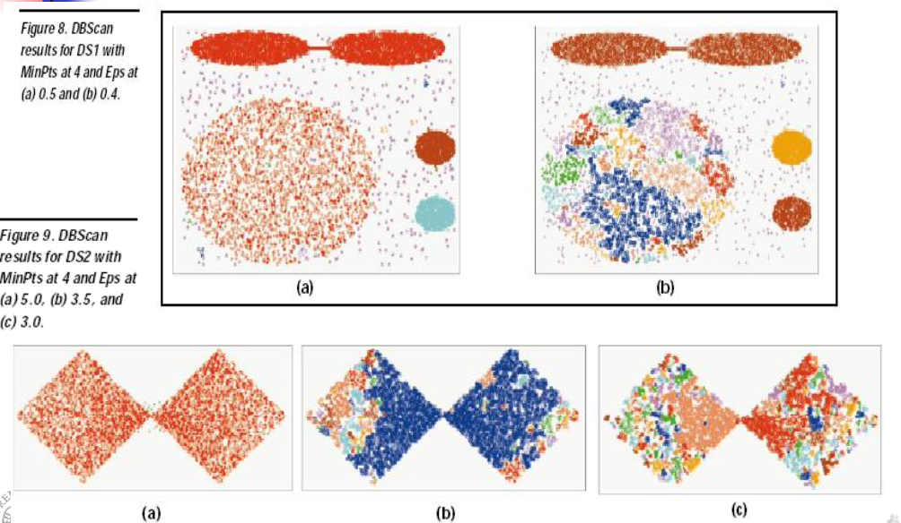

In general cases, when we have high-dimensional data, we have no visual feedback, we have to experiment.

Using Eps=0.5 and Eps=0.4 we have a big difference.

By decreasing Eps of 0.1 we have that big clusters, characterized by not very dense regions, allow us to find a lot of clusters instead of just one.

In the second example we have just one cluster but depending on the value of parameters we can have different situations.

In the first case we determine one cluster because the connection between the two square is considered as dense region and the points there are considered density connected.

A cluster is separated later because we are reducing minPts.

We have to try to set them using an heuristic approach or with an input of the internal domain if we have a lot of dimensions.

#### heuristic approach to set `Eps` and `minPts`

For a given $k$ (that corresponds to minPts) we define a function k-dist, mapping each point to the distance from its k-th nearest neighbor.


If we set $k = 4$, the k-distance corresponds to the distance between the point we are considering and the fourth nearest neighbor. Lower this distance, higher the probability that the points will belong to a dense region.

We sort the points in descending order of their k-dist values: the graph of this function gives some hints concerning the density distribution.


If I set the distance of the kth nearest neighbor to `Eps` I obtain that this point is a core point, we have $k$ minPts inside the `Eps` neighborhood.

The points in the top have a high 4-dist, which means that they have the 4th nearest neighbors quite far and they're probably not in a dense region.

Outliers, in fact, probably have a large k-dist.

We have also a large number of points belonging to dense regions (the k-nearest neighbors are quite close).

If we choose an arbitrary point p, set the parameter Eps to k-dist(p) and set the parameter MinPts to k, all points with an equal or smaller k-dist value will be core points.

If we choose the value indicated by the arrow and we are sure all points in the right will be core points, while other in the left can be outliers or borders.

If we set k-dist to that point all points in the right will be core point.

If we choose a certain Eps, we will have few outliers in the left, not all of them.

The threshold point is the first point in the first "valley" of the sorted k-dist graph.

This is heuristic but it is a way to set Eps and minPts.

Changing very few Eps we can have completely different results in terms of clusters.

> We have the problem that the intrinsic cluster structure cannot be characterized by global density parameters. It affects DBSCAN but also all density-based algorithms.

#### Alternatives for determine the cluster structures


- The first alternative we can use is to use a __hierarchical clustering algorithm__, for instance the single-link method.

    Drawbacks:

    - single-link effect, i.e. clusters which are connected by a line of few points having a small inter-object distance are not separated. We can put together clusters linked by this line.

    - the results, i.e. the dendrograms, are hard to understand for more than a few hundred objects. With an high number of objects is hard to understand the final result.

- The second alternative is to use a __density-based partitioning algorithm with different parameter settings__.

    Drawbacks:

    - there are an infinite number of possible parameter values.

    - Even if we use a very large number of different values - which requires a lot of secondary memory to store the different cluster memberships for each point - it is not obvious how to analyze the results (we don't have groung-truth) and we may still miss the interesting clustering levels.

The __solution__ is to run __an algorithm which produces a special order of the database__ with respect to its density-based clustering structure containing the information about every clustering level of the data set.

If we are able to produce this ordering, we can apply DBSCAN with different densities with specific parts of the space.

The idea is to adopt an ordering algorithm that orders object respect to their density area.

Determining the parameters of DBSCAN is quite hard. If we have a lot of dimensions we don't have a visual feedback.

When we set two parameters, also, we set them for all the space. We enforce the same definition of density for all the space, but in some parts we can have dense regions and in others we don't.

If we choose the pair in such a way to choose dense regions, points in which we don't have dense zones are considered outliers.

If we set them to identify not dense clusters, all points will belong to the same class at the end.

We saw an approach to plot the k-dist on the values,

###  OPTICS: Ordering Points To Identify the Clustering Structure

It will give us __an idea to work with different regions__ with __different densities__ and allow us to set parameters to investigate this specific zone.

We won't have clusters after the execution, we will have an ordering of points that allow us to know the combination of values to obtain good clusters.

This cluster-ordering contains info equivalent to the density-based clustering corresponding to a broad range of parameter settings. 

It is good for both automatic and interactive cluster analysis, including finding intrinsic.

The result can be represented graphically or using visualization techniques.

We start with this observation: density-based clusters are monotonic with respect to the neighborhood threshold.

__DBSCAN__: for a constant `MinPts` value, density-based clusters with respect to a higher density are completely contained in density-connected sets obtained with respect to a lower density.

##### Example

$C_1$ and $C_2$ are density-based clusters with respect to $Eps_2 \leq eps_1$ and $C$ is a density-based cluster with respect to $Eps_1$ completely containing the sets $C_1$ and $C_2$.


$Eps_1 \leq Eps_2$ and that means that when we find $C_1$ and $C_2$ we are imposing the higher density. It tells us that clusters with lower density contains clusters with higher density. $C$ contains $C_1$ and $C_2$.

The idea for `OPTICS` is to process a set of distance parameter values at the same time. In practice, to use `DBSCAN` for an infinite number of distance parameters $Eps_i$ which are smaller than a "generating distance $Eps$".

Unlike `DBSCAN`, `OPTICS` does not assign cluster memberships. 

Instead, it stores the order in which the objects are processed and the information which would be used by an extended `DBSCAN` algorithm to assign cluster memberships. This information consists of only two values for each object: 
    - the core-distance
    - a reachability-distance. 

We don't obtain at the end a partition but an ordering.

#### Definitions

- __Core-distance of an object p__ is the smallest `Eps` value that makes $p$ a core object. If $p$ is not a core object, the core-distance is undefined.

- __Reachability-distance of an object q from p__ is the minimum radius value that makes $q$ directly density-reachable from $p$.

> $p$ has to be a core object and $q$ must be in the neighborhood of $p$. Therefore, the reachability-distance from $p$ to $q$ is max (core distance(p), dist(p, q)). 

> If $p$ is not a core object, the reachability-distance is undefined.

##### Example

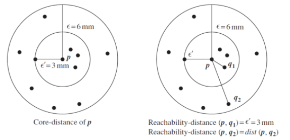

Here, the core distance of $p$ is the distance for which we include in the neighborhood the minPts that we need for the execution of DBSCAN.

- The reachability-distance $(p,q_1)$ is $\varepsilon^{'}$, because $q_1$ is lower than the core distance.

- The reachability-distance $(p,q_1)$ is really the distance because the core distance is lower.

We use the second definition for the ordering.

To construct the different partitions simultaneously, the objects have to be processed in a specific order:

- `OPTICS` begins with an arbitrary object from the input database as the current object, $p$. It retrieves the $Eps-neighborhood$ of $p$, determines the core-distance, and sets the reachability-distance to undefined.

- If $p$ is not a core object, `OPTICS` simply moves on to the next object in the `OrderSeeds` list.

- If $p$ is a core object, then for each object $q$ in the `Eps-neighborhood` of $p$, `OPTICS` updates its reachability-distance from $p$ and inserts $q$ into `OrderSeeds` if q has not yet been processed.

his `Eps-neighborhood` is not the `Eps` we use in the `DBSCAN`, but it's just the larger distance that leads the search for points from the `OPTICS`.

The objects contained in `OrderSeeds` are sorted by their reachability-distance to the closest core object from which they have been directly density reachable. In each step of the WHILE- loop, an object currentObject having the smallest reachability-distance in the seed-list is selected by the method `OrderSeeds:next()`.

- The Eps-neighborhood of this object and its core-distance are determined. Then, the object is simply written to the file OrderedFile with its core distance and its current reachability- distance.

- The iteration continues until the input is fully consumed and `OrderSeeds` is empty. 

#### Conclusions

At the end of the execution of `OPTICS`, we have the list of objects in the order in which the objects themselves are processed. 

We have an ordering based on the reachability distance. These objects are processed considering the smallest reachability distance from the point we are considering and the next point.

Complexity: in the worst case, $O(n^2)$, where $n$ is the number of objects to be clustered.

We have an ordered list, and we have an order of the points and we can plot the reachability distance. The Eps we see there is the Eps we use in `OPTICS` and limits the number of points we have to consider.


After the execution of `OPTICS` I have this profile:

- Objects in the x-axis selected in such a way that close object are really close in terms of reachability distance, because when we select the next object we select the one with the smallest reachability distance with respect to t he current object. Considering two consecutive points they're the closest in terms of reachability distance.

- If I consider two consecutive points, we are considering closest points in terms of reachability distance.

- The valley corresponds to the number of points really close to each other, because characterized by having the smallest reachability distance respect to all other points.

#### Usage

This plot can be useful to select `Eps` and `minPts` for `DBSCAN` or other density-based algorithms.

Here `minPts` is fixed, when we defined the reachability distance, we start from the definition of core distance and to do that we have to fix `minPts`.

This profile tells us what the reachability distance is. If we fix $\varepsilon^{'}$ and use it for the `DBSCAN` we can see that with this, we can identify the clusters corresponding to valleys.

The reachability distance for points in the valley are lower than the threshold $\varepsilon^{'}$.

##### Examples of usage

- ex 1

    

    `OPTICS` produces the type of plot for that dataset. The deepest valley corresponds to very dense regions in our dataset.

    With that plot we can also decide different values for Eps and minPts depending on specific parts of the space.

- ex 2
    
    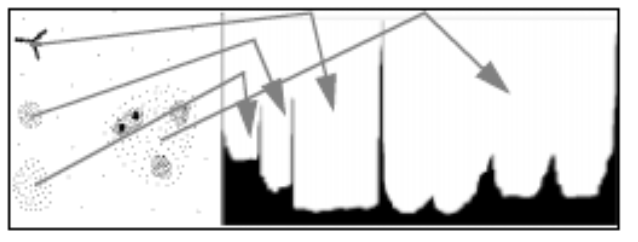

    By analyzing the graph, we can understand if we have natural clusters in the dataset and their level of density.

    In very dense region like the cluster on the top, the valley is really deep. In the bottom we have not very dense cluster, we have a valley with the bottom level higher than other valleys.


#### Example

On a 2 dimensional database with 16 points, starting with:

$$
    \varepsilon = 44, \quad MinPts = 3
$$)

|<!--  -->|<!--  -->|
|-|-|
|||

1. OPTICS tells us to select one object randomly, let's select `A`.

    It has three points and in the seed list we add points in the neighborhood.
    
    |<!--  -->|<!--  -->|
    |-|-|
    ||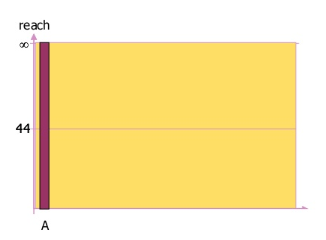|

    

2. Now we consider `B`, and for `B` in its core distance we just have `C` with reachability distance $40$.

    |<!--  -->|<!--  -->|
    |-|-|
    ||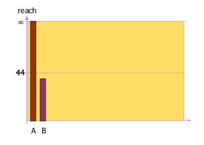|

    

    We include `I` because we just select the points with the minimum reachability distance respect to the current object, `B`, and we just choose `I`.

3. We consider `I` as current object and we determine all objects in the neighborhood.
   
    |<!--  -->|<!--  -->|
    |-|-|
    |||

    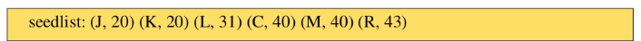

    When we consider as current object `I` we add in the seed-list these objects.

4. We consider the object in the seed List with the minimum reachability distance, J, which becomes current.

    |<!-- -->|<!-- -->|
    |-|-|
    |||

    

5. We then select L.

    

6. At the end we have this situation:

    

#### Conclusion

If we analyze this profile, we can realize that some points are in a valley.


If we cut choosing $Eps=44$ we obtain two clusters.

If we choose it higher we obtain just one cluster.

### DENCLUE: Using Statistical Density Functions

This is another density-based algorithm quite different from the others.

The problem of DBSCAN and OPTICS is that __density__ is calculated by __counting the number of objects__ in a neighborhood defined by `Eps`. Such density estimates can be highly sensitive to the radius value used.

A clustering method based on a set of density distribution functions is the solution provided by DENCLUE.

Each observed object is treated as an indicator of high-probability density in the surrounding region. The probability density at a point depends on the distances from this point to the observed objects.

If we have this dataset:


`DENCLUE` propose to assign to each object a function, typically a gaussian one, with center of the gaussian corresponding to the point.

If we have points close to each other, each gaussian start to be overlapped. The sum of overlapping gaussians we obtain produces mountains. Higher the mountains and higher the probability to have dense regions.

In far points we use the gaussian profile, while in dense regions the sum of these accumulates gaussians.

|<!--  -->|<!--  -->|
|-|-|
|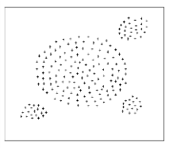||

We have to decide:

- how to cut hills to determine clusters, we need to set a parameter.

- how much the gaussian function is wide.

#### Example

Let $<x_1, \dots, x_n$ be an independent and identically distributed sample of a random variable $f$. The kernel density approximation of the probability density function is:

$$
    \hat{f_h} = \frac{1}{nh}\sum_{i=1}^n{K\frac{(x-x_i)}{h}}
$$

Kernel K() is a non-negative real-valued integrable function that should satisfy two requirements for all values of $u$:

$$
    \int_{-\infty}^{+\infty} K(u) du = 1 \text{ and } K(-u) = K(u)
$$

We have different types of kernel function, an example of kernel function is the gaussian function:

$$
    K(\frac{x-x_i}{h}) = \frac{1}{\sqrt{2\pi}} e^{-\frac{(x-x_i)^2}{2h^2}}
$$

$h$ is the standard deviation and $x_i$ is the point we are considering where we are putting the kernel function.

These are two examples of kernel functions:


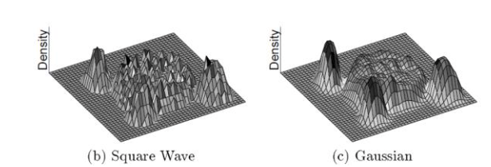

If we use squares, hills are not smoothing but dolomites,

Clusters can be determined mathematically by identifying density attractors. We have to find the peaks of the mountains and are attractor for all points around the peak.

To avoid trivial local maximum points, `DENCLUE` uses a noise threshold $\xi$ and only considers those density attractors $x^*$ such that:

$$
    \hat{f}(x^*) \geq \xi
$$

We introduce it because we select as attractor also the peak of a gaussian for example, and if we don't want it as local maxima we can exploit it.

These attractors are the centers of clusters.

Objects are assigned to clusters through density attractors using a step-wise hill-climbing procedure.

If we consider a profile, we can realize that we have to perform an hill-climbing.

#### Algorithm

- Until there exist samples in the data set,

- Select a sample $x$. The density attractor for $x$ is computed by using the hill-climbing procedure.

    $$
        x^0 = x \qquad x^{j+1} = x^j + \delta \frac{\nabla \hat{f}(x^j)}{|\nabla \hat{f}(x^j)|}
    $$

- We add to $x_i$ a delta multiplicated by the gradient, 

    - where $\delta$ is a parameter to control the speed of convergence and $\delta$ rules the speed for which we climb the speed. If it is too large, we have the risk to not identify the peak, jumping over it. If it is too small we need to spend a lot of time to identify the hill.

    - and the gradient is

        $$
            \nabla \hat{f}(x) = \frac{1}{h^{d+2}\sum_{i=1}^n{K\frac{x-x_i}{h}(x-x_i)}}
        $$    

        where $d$=space dimension and $K$ is a Gaussian.

- The hill-climbing procedure stops at step $k>0$ if $\hat{f}(x^{k+1}) < \hat{f}(x^{k}$ and assigns $x$ to the density attractor
    
    $$
        x^* = x^k
    $$

Each time we calculate $x$ we will have a higher of function higher than the previous value, because we are climbing the hill. We stop when we find a lower value.

We have to find all possible attractors; we could start for each point in the dataset and try to apply the hill-climbing of procedure.

But some groups of objects are attracted by the same attractor. If we start from any of those points, we find the same attractors.

Instead of repeating the algorithm for each object, for efficiency reasons, the algorithm stores all points $x^{'}$ with $d(x_j, x^{'}) \leq = h/2$ for any step $0 < j < k$ during the hill-climbing procedure and attaches these points to the cluster of $x^*$ as well.

We select $x$ and we consider if around we have other points, if we have them we consider those attracted by the attractor we are finding.

Using these heuristics, all points which are located close to the path from $x$ to its density-attractor can be classified without applying the hill-climbing procedure to them.

#### Outliers

DANCLUE is also able to determine outliers.

An object x is an outlier or noise if it converges in the hill- climbing procedure to a local maximum $x^*$ with

$$
    \hat{f}(x^*) < \xi
$$

Probably single points will be considered outliers because the value of $f$ may be lower than $\xi$.

#### Example 

Density attractors in a one-dimensional space

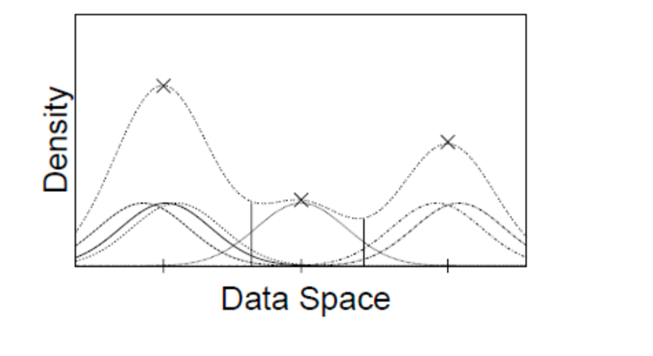

When we sum we have these kinds of profile. We have some hills.

Given attractors, that will be center of clusters, we must understand if we can merge clusters belonging to different attractors. 

We determined the attractors and to determine cluster we merge density attractors that are connected through paths of high density ($> threshold$). 

An arbitrary-shape cluster (with respect to two constants h and $\xi$) for the set of density attractors $X$ is a subset $C \subseteq D$, where:
$$
    \forall x \in C \ \exists \ x^* \in X \ | \ \hat{f}(x^*) \geq \xi
    
$$

$$
    \forall x_1^*, x_2^* \in X \ \exists \text{ a path } P \in F^d \text{ from } x_1^* \text{ to } x_2^* \text{ with }  \hat{f}(p) \geq \xi \ \forall p \in P  
$$

We pickup two attractors and follow $f$ in such a value we have always the value of $f$ higher than $\xi$.

#### Parameters

We have $h$ and $\xi$ as parameters: 

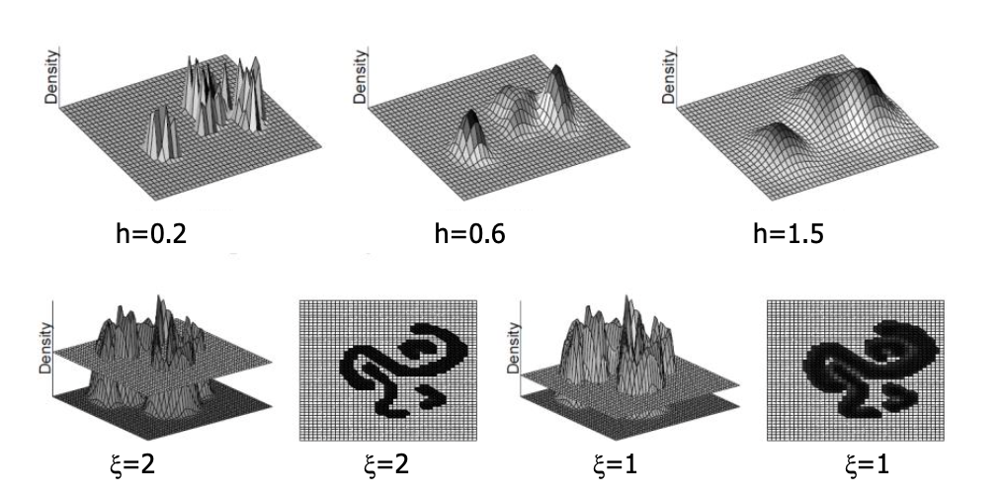

- $h$ is the standar deviation of the gaussian function and depending on it the gaussian will be wide or narrow.


    The wideness of the gaussian impact the number of points that we include when we apply the hill-climbing in determining the attractors.

    h = 0.2 means a narrow kernel function, we have a number of peaks because we can't attract points in wide regions. With the increase of h this phenomenon decreases, we attract an higher number of points.

- $\xi$ fix the cut point of our hills, and depending on it we can have different clusters because if we select a high $\xi$ we select only points close to the peak.
    
    When we select lower value of $\xi$, we just consider higher number of points included in clusters.
    
    Increasing the value of $\xi$ we cannot easily connect different attractors.

We have a strong dependence in the two parameters in any case.

> Fixing these two values we determine the number of clusters we obtain and the possible outliers.

#### Major features

- Solid mathematical foundation

- Good for data sets with large amounts of noise

- Allows a compact mathematical description of arbitrarily shaped clusters in high-dimensional data sets

- Significant faster than existing algorithm (e.g., faster than DBSCAN by a factor of up to 45)

- Complexity (with some optimization) $O(N \log(N))$

But needs an accurate choice of the parameters h and $\xi$.

- $h$ determines the influence of a point in its neighborhood and implicitly how many points relate to a specific attractor

- $\xi$ describes whether a density-attractor is significant, allowing a reduction of the number of density-attractors and helping to improve how the parameters should be chosen to obtain good results

#### How to find the parameters

To determine the value of $h$ we consider different $h$ and determine the largest interval between hmax and hmin where the number of density attractors $m(h)$ remains constant.

We use increasing value of $h$ and we select $h$ that is in the interval where the number of density attractors remain constant. This is the suggested choice for $h$.


Suggested choice for $\xi$: if the database is noise free, all density attractors of $D$ are significant and $\xi$ should be chosen in

$$
    0 \leq \xi \leq \min_{x^* \in X}{\{f^{D_C}(x^*)\}}
$$

If the database has noise as attractors we identify single objects.

We have a possible optimization to speed-up the execution.

#### DENCLUE implementation

Two steps:

1. Step 

    Initial pre-clustering based on a grid to speed up the calculation of the density function

    - We introduce the minimal bounding (hyper-)rectangle of the data set, and we divide it into d-dimensional hypercubes, with an edge length of 2h. We create a grid in our dataset.

    - Only hypercubes which actually contain data points are determined. We reduce the exploration of the space focusing in hypercubes containing objects.

    - The hypercubes are numbered depending on their relative position from a given origin. The keys of the populated cubes can be efficiently stored in a randomized search-tree or a B+ tree.

    

    Instead of considering all hypercubes we focus on the ones in which we have objects.

    - For each populated cube c, in addition to the key, the number of points (Nc) which belong to c, pointers to those points, and the linear sum $\sum_{x \in C} x$ are stored.

    - This information is used in the clustering step for a fast calculation of the mean of a cube ($mean(c)$). Since clusters can spread over more than one cube, neighboring cubes which are also populated have to be accessed.

    - To speed up this access, we connect neighboring populated cubes. 
        
        More formally, two cubes $c_1, c_2 \in C_p$ are connected if $d(mean(c_1), mean(c_2)) < 4 \sigma$ (we use a Gaussian kernel function and therefore $h=\sigma$).

2. Step : the actual clustering step

    - We consider only the highly populated cubes $C_{sp}$ and cubes which are connected to a highly populated cube are considered in determining clusters. We speed-up the process limiting our search to cubes highly populated and cubes connected to them

    With this implementation the computational time in terms of CPU is lower than the one of standard DENCLUE and DBSCAN.

    

    It is almost constant with the size of the database. We can find clusters of different shapes in a reasonable time.

#### Attention

- All the density based clustering methods are not fully effective when clustering high dimensional data, for the curse of dimensionality and objects appear far to each other.

- Methods that rely on near or nearest neighbor information do not work well on high dimensional spaces.

- In high dimensional data sets, it is very unlikely that data points are nearer to each other than the average distance between data points because of sparsely filled space. As a result, as the dimensionality of the space increases, the difference between the distance to the nearest and the farthest neighbors of a data object goes to zero. The solution is to apply attribute selection before using these algorithms or use different algorithms.

- We have to set parameters and if we choose in a bad way we are in trouble, we have a lot of differences with small changes. This is true independently on the density-based method. But we don't have to choose the number of clusters we want to obtain, even if the pairs of parameters implicitly choose this number.

## Grid-Based Clustering Method

These methods use multi-resolution grid data structure.

there are several interesting methods, with the characteristic of low computational cost, even if the results we obtain are less performing than other algorithms.

We will analyze:

- `STING` (a STatistical INformation Grid approach)

- `CLIQUE`: which is both grid-based and subspace clustering

### STING

The spatial area is divided into rectangular cells.

There are several levels of cells corresponding to different levels of resolution.


Each cell at a high level is partitioned into a number of smaller cells in the next lower level.

Statistical info of each cell is calculated and stored beforehand and is used to answer queries

Parameters of higher-level cells can be easily calculated from parameters of lower level cell

Parameters include:

- count, mean, standard deviation, min, max

- type of distribution---normal, uniform, exponential or none (if the distribution is unknown) -- obtained by the user or by hypothesis tests

Use a top-down approach to answer spatial data queries. We have an hierarchical structure with higher level with all information corresponding to the lower level.


Statistical information regarding the attributes in each grid cell, for each layer are pre-computed and stored beforehand.

#### Idea

The statistical parameters for the cells in the lowest layer is computed directly from the values that are present in the table, when data are loaded into the database.

The statistical parameters for the cells in all the other levels are computed from their respective children's cells that are in the lower level. We start with the lowest level corresponding to the value we have and we split it in cells, we compute the statistics for each cell and when we just go to the next level we have a mapping from the cell in higher level with respect to the cell in the lower level, so that we compute statistics for cell at higher levels.

Query types:

- SQL like language used to describe queries

- Two types of common queries found: one is to find region specifying certain constraints and other take in a region and return some attribute of the region

We use a top-down approach to answer spatial data queries starting from a pre-selected layer-typically with a small number of cells.

The pre-selected layer does not have to be the top most layer.

For each cell in the current layer compute the confidence interval reflecting the cell's relevance to the given query. The confidence interval is calculated by using the statistical parameters of each cell.

From the interval calculated we label the cells as relevant or irrelevant for this query We remove the irrelevant cells from further consideration.

When finished with the current layer, proceed to the next lower level.

Processing of the next lower layer examines only the remaining relevant cells.

Repeat this process until the bottom layer is reached.

At this time if query specifications are met, the regions of relevant cells that satisfy the query are returned.

Otherwise, the data that fall into the relevant cells are retrieved and further processed until they meet the requirement of the query.

We speed-up the query processing so that we can concentrate on the data relevant to the specific query. This corresponds to have clusters inside specific grids.

A typical query is the following:

```sql
-- Select the maximal regions that have at least 100 houses per unit area and at least 70% of the house prices are abobe $400k and with total area at least 100 units with 90% confidence

SELECT region
FROM house-map
WHERE density IN (100, ∞)
    AND price RANGE (400000, ∞)
        WITH percent (0.7,1)
    AND area (100, ∞)
    AND WITH confidence = 0.9
```

We can apply the query exploiting the previous approach that allow us to consider only cells relevant to each level.

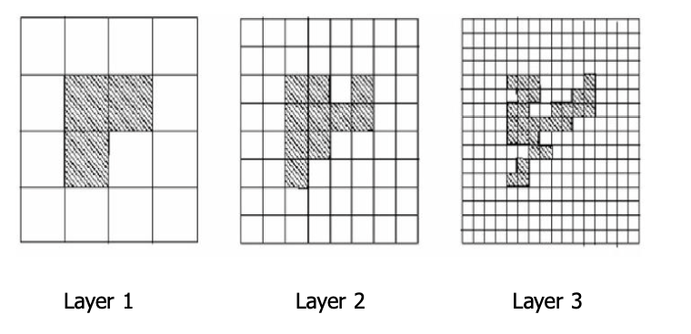

At the beginning we isolate some area, then we redefine are at the second level and then at the third level.

From a region we explore the subsequent level and so on.

At the end it's like we determined a cluster putting together cells close to each other, and so it's considered a clustering method.

#### Advantages

- Query-independent, easy to parallelize, incremental update

- Generation of the clusters complexity $O(n)$

- Query processing time $O(g)$, where $g$ is the number of grid cells at the lowest level

#### Disadvantages

- All the cluster boundaries are either horizontal or vertical, and no diagonal boundary is detected, because we build our hierarchy in this way

#### Considerations

The regions returned by `STING` are an approximation of the result by `DBSCAN`. As the granularity approaches zero, the regions returned by `STING` approach the result of `DBSCAN`


### CLIQUE (Clustering In QUEst)

`CLIQUE` automatically identify subspaces of a high dimensional data space that allow better clustering than original space. 

`CLIQUE` can be considered as both density-based and grid-based.

It is density based because we try to identify clusters basing on idea of density but density based too because we work with grid.

It partitions each dimension into the same number of equal length intervals.

Then it partitions an m-dimensional data space into non-overlapping rectangular units.

A unit is dense if the fraction of total data points contained in the unit exceeds the input model parameter.

#### Idea

We generate a number of cells and consider they're dense computing the number of data points we have inside the unit.


The parameter we have here is present and allow us to determine density.

A cluster is a maximal set of connected dense units within a subspace.


We look for connection between dense units and generate clusters considering the maximum set of connected dense units.

Partition the data space and find the number of points that lie inside each cell of the partition, is performed in this way:

- Identify the subspaces that contain clusters using the __Apriori principle__ 

    In particular, if a k-dimensional unit is dense, then so are its projections in $(k-1)$ dimensional space. 
    
    If a square is dense if we project it on $x$ and $y$ axis, the intervals we get are dense. Therefore, the candidate dense units in the k-th dimensional space are generated by the dense units found in $(k-1)$ dimensional space

- To identify clusters we determine dense units in all subspaces of interest and determine connected dense units in all subspaces of interests.

- Generate minimal description for the clusters. We determine maximal regions that cover a cluster of connected dense units for each cluster.In this way we determine the minimal cover for each cluster.

#### Clustering steps


1. Step 

    partitions the $d-dimensional$ data space into non-overlapping rectangular units, identifying the dense units among these.

    In particular, `CLIQUE` partitions every dimension into intervals, and identifies intervals containing at least $l$ points, where $l$ is the density threshold.

    `CLIQUE` then iteratively joins two $k-dimensional$ dense cells, $c_1$ and $c_2$, in subspaces $(D_{i1} , \dots , D_{ik})$ and $(D_{j1} , \dots , D_{jk})$. 
    
    If $D_{i1} = D_{j1} , \dots , D_{ik} = D_{jk}$, and $c_1$ and $c_2$ share the same intervals in those dimensions. The join operation generates a new $(k+1)-dimensional$ candidate cell $c$ in space $(D_{i1}, \dots, D_{ik} ,D_{jk})$.

    `CLIQUE` checks whether the number of points in $c$ passes the density threshold. The iteration terminates when no candidates can be generated, or no candidate cells are dense.

    When we reach the join operation, we are sure that units we are joining are dense but the result is not sure to be dense, we have to count the number of instances we have in the $(k+1)$ cell we have generated.

2. Step
    
    `CLIQUE` uses the dense cells in each subspace to assemble clusters, which can be of arbitrary shape. 
    
    Each cluster can have an arbitrary shape beacause we follow the density referring to dense units. The only limitation we have is that the boundary of the cluster is rectangular because follow the shape of the unit.

    __Minimum Description Length (`MDL`) principle__: use the maximal regions to cover connected dense cells, where a maximal region is a hyper-rectangle where every cell falling into this region is dense, and the region cannot be extended further in any dimension in the subspace.

    This is the idea we exploited in the `DBSCAN`, here we put together dense cells.

    Finding the best description of a cluster in general is NP-Hard, we should combine all possible cells. Thus, __CLIQUE adopts a simple greedy approach__. It starts with an arbitrary dense cell, finds a maximal region covering the cell, and then works on the remaining dense cells that have not yet been covered.

    The greedy method terminates when all dense cells are covered.

#### Example


The CLIQUE algorithm is used to cluster a set of records that have three attributes: salary, vacation, and age. 


__steps__:

- The first step is to split each attribute into intervals of equal length, creating a 3-dimensional grid on the space. 

> The goal is to find the dense 3-dimensional rectangular units within this grid. 

- To do this, the algorithm looks at:

    |salary-age plane|Vacation-age plane|
    |-|-|
    |the salary-age plane and finds all the 2-dimensional rectangular units that are dense.|It also finds the dense 2-dimensional units for the vacation-age plane.|

    

- The next step is to find the dense units in the salary-vacation plane

- Now, we perform an intersection of the candidate search space with the extension of the dense units of the salary-vacation plane, in order to get all the 3-d dense units

    

After finding the dense units, it is very easy to find clusters

#### Strength

- automatically finds subspaces of the highest dimensionality such that high density clusters exist in those subspaces

- insensitive to the order of records in input and does not presume some canonical data distribution

- scales linearly with the size of input and has good scalability as the number of dimensions in the data increases. The reason is that we work using a grid and it scales good when the number of dimensions increase.

#### Weakness

- Obtaining a meaningful clustering is dependent on proper tuning of the grid size and the density threshold. It also depends on the size, the granularity we use in the grid, if we use small intervals we have precise clusters but we need more time

- The accuracy of the clustering result may be degraded at the expense of simplicity of the method

#### Conclusions

The main advantage is the computational effort, typically we execute in reasonable time, but this is a trade-off between precision and speed. If we are interested in a curse clustering we can use a curse grid, intervals quite large, but we have curse boundaries.

In many applications we may not be interested in precise clusters.

## Evaluation of Clustering

We can evaluate our clustering result focusing on:

- __Determining the number of clusters in a dataset__, when we apply partition method

- __Measuring clustering quality__: measures to assess how well the clusters fit the dataset. We want measures that score clustering and thus can compare two sets of clustering results on the same dataset.

- __Assessing clustering tendency__: clustering analysis on a data set is meaningful only when there is a nonrandom structure in the data. It was the process we followed when we talked about measuring the tendency of clustering on the dataset. We need to evaluate if data has really some natural tendencies to clusters.

Here we don't have the ground-truth so it's hard to introduce metrics.

### Determining the number of clusters

Determining the number of clusters is important, we need to set them before executing the algorithm.

We don't know how many natural clusters we have in the dataset typically, so we typically set a generic value for $k$ and find $k$ clusters.

If we consider the cost function of `k-means` we can't exploit the cost function to determine $k$, because the minimum of the cost function is $0$ when we have $k = $ number of points.

#### Elbow method

We can use the __Elbow method__ which says that increasing the number of clusters can help to reduce the sum of within-cluster variance of each cluster. The marginal effect of reducing the sum of within-cluster variances may drop if too many clusters are formed, because splitting a cohesive cluster into two gives only a small reduction.

- If I increase $k$ until I don't find natural clusters I have considerable decrease in the cost of function

- if I find a value for $k$ for which we have natural clusters I won't have a strong reduction. 

- If I split a natural cluster in two I don't have a lot of advantages, because the distribution in the points in the cluster is the same that we have in the two clusters separated.

We use the turning point in the curve of sum of within cluster variance with respect to the the number of clusters.

I plot the cost function with the increasing of $k$ and I determine the biggest variation for which we have the turning point that give us the optimal value of $k$.


This method can work if I have separated clusters, if I don't have separated and well-identifiable clusters the cost function decreases and I can't identify the turning point, I don't have natural clusters.

##### Steps

given a number $k > 0$

- Form $k$ clusters on the data set in question using a clustering algorithm like `k-means`, and

- Calculate the sum of within-cluster variances, $var(k)$, but we can use also the cost function.

- Plot the curve of $var$ with respect to $k$.

- Choose $k$ as the first or most significant turning point of the curve.

#### Cross-validation method

It divides a given data set into $m$ parts and use $m - 1$ parts to obtain a clustering model.

We then use the remaining part to test the quality of the clustering.

##### Example

- For each point in the test set, we find the closest centroid, and use the sum of squared distance between all points in the test set and the closest centroids to measure how well the model fits the test set.

- For any $k > 0$, repeat it $m$ times, compare the overall quality measure different $k$'s, and find the number of clusters that fits the data the best.

### Measuring Clustering Quality

This is not easy because we don't have the ground-truth, and also with a lot of dimensions it's not possible to do it graphically.

We have two types of methods we can use: extrinsic vs. intrinsic.

- __Extrinsic__ are supervised, i.e., the ground truth is available.   
    
    They are useful when we want to compare a clustering against the ground truth, using certain clustering quality measure. We can show that our algorithm works properly.

    Ex. BCubed precision and recall metric.

- __Intrinsic__ are unsupervised, i.e., the ground truth is unavailable. 
    
    It evaluates the goodness of a clustering by considering how well the clusters are separated, and how compact the clusters are.
    
     The evaluation of the result is based on clusters' characteristics, compactness and separation.

    Ex. Silhouette coefficient

#### Extrinsic Methods

Let's consider a clustering quality measure $Q(C, Cg)$, for a clustering $C$ given the ground truth $Cg$. 

$Q$ is good if it satisfies the following 4 essential criteria:

- __Cluster homogeneity__: the purer, the better. We can consider purity because we know the ground truth, the idea is to have clusters that group instances belonging to the same class.

- __Cluster completeness__: should assign objects belong to the same category in the ground truth to the same cluster.

- __Rag bag__: putting a heterogeneous object into a pure cluster should be penalized more than putting it into a rag bag (i.e., "miscellaneous" or "other" category). The idea is that it's better to have objects in miscellaneous cluster rather than others.

- __Small cluster preservation__: splitting a small category into pieces is more harmful than splitting a large category into pieces.


##### Bcubed precision and recall 

It is an extrinsic method that evaluates the precision and recall for every object in a clustering on a given data set according to ground truth. The precision of an object indicates how many other objects in the same cluster belong to the same category as the object. 

Ideally we want clusters containing only objects belonging to the same class. The recall of an object reflects how many objects of the same category are assigned to the same cluster.

They're defined because we would like to have each cluster corresponding to one class, this is the ideal situation.


$L$ identify the class of $o_i$. If the two objects belong to the same class and cluster the correctness is equal to $1$.


If we put in the same cluster all objects belonging to the same class our precision and recall will assume the highest value, being close to 1. 

The algorithm with highest precision and recall is considered as the best. 

#### Intrinsic Methods

Intrinsic methods evaluate a clustering by examining how well the clusters are separated and how compact the clusters are, we exploit the definition of good clusters; we have no other possibility.

##### Silhouette coefficient

For each object $o$ in $D$, we compute $a(o)$ as the average distance between $o$ and all the other objects in the cluster to which $o$ belongs to.

$$
    a(o) = \frac{\sum_{o^{'}\in C_i, o \neq o^{'}}{dist(o,o^{'})}}{|C_i| - 1}
$$

It measures compactness of the cluster in which $o$ is located. Low value is preferable, in that case the compactness is higher.

Compute $b(o)$ as the minimum average distance from o to all clusters to which o does not belong to.

$$
    b(o) = \min_{c_j | 1 \leq j \leq k, j\neq i}{\{\frac{\sum_{o^{'}\in C_j}{dist(o, o^{'})}}{|C_j|}\}}
$$

We would like to have $b$ high, because it is a measure of the separation between clusters.

The __silhouette coefficient__ of $o$ will be:

$$
    s(o) = \frac{b(o)-a(o)}{\max{\{a(o), b(o)\}}}
$$

The value of the silhouette coefficient is between $-1$ and $1$. The smaller the value of $a(o)$, the more compact the cluster.

##### Conclusions

- When $s(o)$ approaches $1$, the cluster containing $o$ is compact and $o$ is far away from other clusters, which is the preferable case. 

    $a(o)$ will be low and $b(o)$ will be high, $\max{\{a(o), b(o)\}} = b(o)$ and then the coefficient will be close to 1.

- When the silhouette coefficient value is negative $ b(o) < a(o)$, this means that, in expectation, $o$ is closer to the objects in another cluster than to the objects in the same cluster as $o$. 
    
    This is a bad situation and should be avoided. 

    > The worst situation is $-1$.
    
To measure a cluster's fitness within a clustering, we can compute the average silhouette coefficient value of all objects in the cluster. 
    
To measure the quality of a clustering, we can use the average  silhouette coefficient value of all objects in the data set.

With this value we can evaluate if this is a good clustering in terms of compactness and separation.

This coefficient was defined for partitioning clustering and works very well if our clusters are convex.

In the situation below it doesn't work very well, these clusters are closer than the average distance we have in the cluster.


It cannot be applied for measuring the quality of density-based algorithms.
