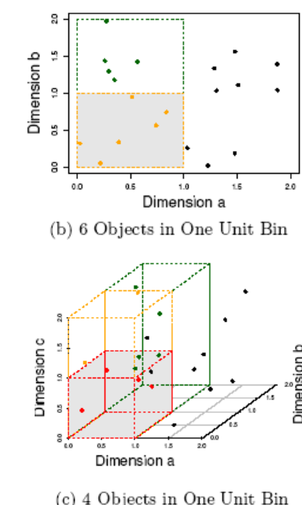
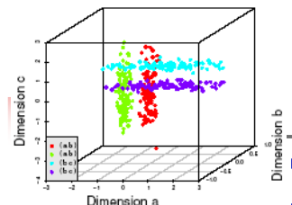
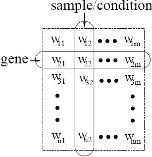
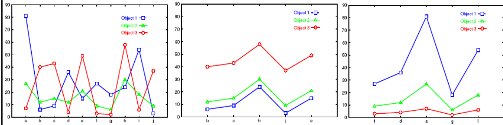
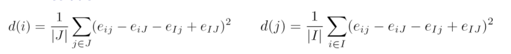
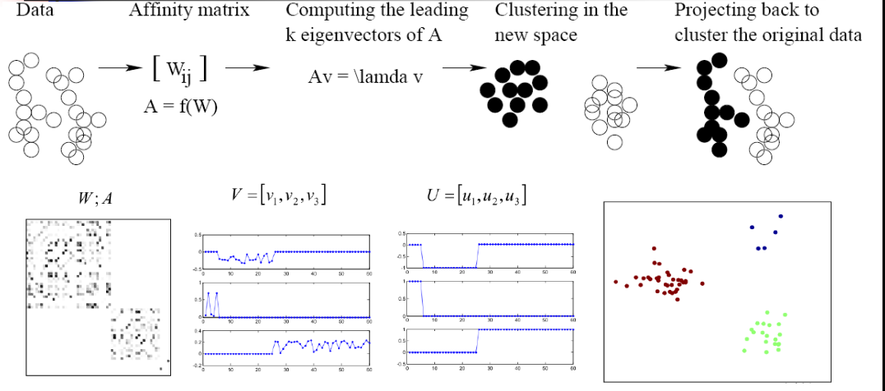
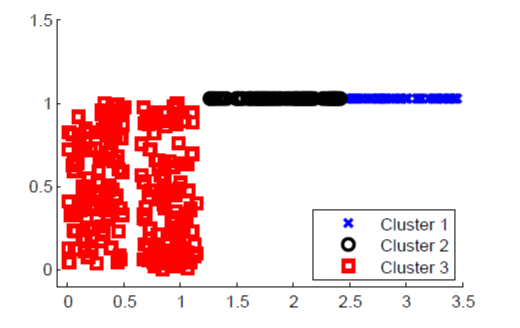

# Clustering of high-dimensional data

The traditional distance measures which are frequently used in low-dimensional cluster analysis aren't also effective on high-dimensional data. We have the problem of curse of dimensionality, objects appear very sparse.

If we consider a problem of customers and products purchased:

|Customer   |$P_1$|$P_2$|$P_3$|$P_4$|$P_5$|$P_6$|$P_7$|$P_8$|$P_9$|$P_{10}$ |
|-          |-    |-    |-    |-    |-    |-    |-    |-    |-    |-        |
|Ada        |1    |0    |0    |0    |0    |0    |0    |0    |0    |0        |
|Bob        |0    |0    |0    |0    |0    |0    |0    |0    |0    |1        |
|Cathy      |1    |0    |0    |0    |1    |0    |0    |0    |0    |1        |

We can represent each customer with a vector of 1 if he purchased the corresponding product, 0 otherwise. 

If we compute the euclidian distance, we realize that distances are all the same.

Most of the clustering algorithms are based on the concept of distance or density, but these have problems with an high number of features, they suffer for the curse of dimensionality problem. Also densities because we consider in it closeness of objects. We have to find a way to apply clustering dealing with curse of dimensionality.

Major challenges:

- Many irrelevant dimensions may mask clusters

- Distance measure becomes meaningless---due to equi-distance, they may appear at the same distance

- Clusters may exist only in some subspaces

Two major __kinds of methods__ to deal with high-dimensional clustering:

- _Subspace-clustering_: Search for clusters existing in subspaces of the given high dimensional data space. We don't consider all dimensions but we identify clusters in subspaces.

- _Dimensionality reduction approaches_: Construct a much lower dimensional space and search for clusters there (may construct new dimensions by combining some dimensions in the original data). We have to create them in a reasonable way.

## The curse of dimensionality

Data in only one dimension is relatively packed. Adding a dimension "stretch" the points across that dimension, making them further apart. Adding more dimensions will make the points further apart---high dimensional data is extremely sparse.

Distance measure becomes meaningless due to equi-distance.

|<!--  -->|<!--  -->|
|-|-|
|||

### Subspace Clustering

Clusters may exist only in some subspaces. Subspace-clustering consists in finding clusters in all the subspaces. Some dimensions can act as noise, but we may have some projection of subspaces in which we identify natural clusters.

In 3 dimensions it's not easy to identify clusters:

If I project data objects along dimensions:

We have that projecting on dimension b two clusters are merged.

If we project along two dimensions, we can isolate some clusters, in the first case red and green, in the second violet and blue, and so on. When we have an high number of dimensions we shouldn't try to discover clusters with the original space but it's more suited to consider subspaces. We have subspace search methods that search various subspaces to find clusters.

## Subspace Clustering Methods
They can be Bottom-up approaches or Top-down approaches. An approach is correlation-based clustering methods (E.g., PCA based approaches). Another approach are Bi-clustering methods, they perform subspace selection and clustering concurrently. We have two types of approaches:

- _Optimization-based methods_

- _Enumeration methods_

### Subspace Search Methods

Search various subspaces to find clusters:

-  __Bottom-up approaches__
    
    Start from low-D subspaces and search higher-D subspaces only when there may be clusters in such subspaces.
    
    Various pruning techniques to reduce the number of higher-D subspaces to be searched.
    
    Ex. CLIQUE

- __Top-down approaches__ 

    Start from full space and search smaller subspaces recursively Effective only if the locality assumption holds: restricts that the subspace of a cluster can be determined by the local neighborhood.
    
    Ex. PROCLUS: a k-medoid-like method

### Correlation-Based Methods

Subspace search method can be __similarity based on distance or density__. Correlation-based method are based on __advanced correlation models__.

Ex. PCA based approach: We apply PCA (for Principal Component Analysis) to derive a set of new, uncorrelated dimensions, then mine clusters in the new space or its subspaces. We can do it using eigenvectors associated with high eigenvalues.

### Bi-Clustering Methods
__Bi-clustering__ approaches cluster both objects and attributes simultaneously (we treat objects and attributes in symmetric way). We have clusters of attributes and clusters of objects.

We want to obtain a cluster of objects in a cluster of attributes. At the end we will have clusters of objects described by a subset of attributes.

Four requirements:

- Only a small set of objects participate in a cluster

- A cluster only involves a small number of attributes

- An object may participate in multiple clusters, or does not participate in any cluster at all. This because one object can belong to different clusters in different subspaces.

- An attribute may be involved in multiple clusters, or is not involved in any cluster at all

#### Types of Bi-clusters

We have to define the type of bi-cluster when we apply it.

Ex 1. Gene expression or microarray data: a gene sample/condition matrix.

Each element in the matrix, a real number, records the expression level of a gene under a specific condition
Let $A = {a_1, \dots, a_n}$ be a set of genes, $B = {b_1, \dots, b_n}$ a set of conditions. Let $E=[e_{ij}]$ be a gene expression data matrix.

A bi-cluster is a submatrix where genes and conditions follow some consistent patterns, a __submatrix where objects and attributes follow consistent patterns__.

|         |$\dots$    |$b_6$  |$\dots$|$b_{12}$|$\dots$|$b_{36}$ |
|-        |-          |-      |-      |-       |-      |-        |   
|$a_1$    |$\dots$    |60     |$\dots$|60      |$\dots$|60       |    
|$\dots$  |$\dots$    |$\dots$|$\dots$|$\dots$ |$\dots$|$\dots$  |  
|$a_{33}$ |$\dots$    |60     |$\dots$|60      |$\dots$|60       |   
|$\dots$  |$\dots$    |$\dots$|$\dots$|$\dots$ |$\dots$|$\dots$  |   
|$a_{86}$ |$\dots$    |60     |$\dots$|60      |$\dots$|60       |   

We have 4 types of bi-clusters patterns (ideal cases):

- __Bi-clusters with constant values__:

    for any $i$ in $I$ and $j$ in $J$, $e_{ij} = c$

    We have a subset of objects and a subset of dimensions for which we have a constant value.

    We have to find a set of objects and attributes for which we have the same value.

- __Bi-clusters with constant values on rows:__

    We have constant values along the single row. This means that:

    $$
        e_{ij}=c + \alpha_i
    $$
    
    where αi is the adjustment for row i. Also, it can be constant values on columns

    We start with a constant value and for each row we have just a difference due to this ai.

    |<!--  -->|<!--  -->|<!--  -->|<!--  -->|<!--  -->|
    |-        |-        |-        |-        |-        |
    |10       |10       |10       |10       |10       |
    |20       |20       |20       |20       |20       |
    |50       |50       |50       |50       |50       |

    We could have also constant values on columns.

- __Bi-clusters with coherent values__ (aka. pattern-based clusters). 

    Rows change in a synchronized way with respect to the columns and vice versa

    $e_{ij} = c + \alpha_i + \Beta j$

    We have an adjustment for the row and an adjustment for the column. $A $I \times J$$ is a bi-cluster with coherent values if and only if for any:

    $$
        i_1, i_2 \in I \text{ and } j_1, j_2 \in J \text{, then } e_{i_1 j_1} - e_{i_2 j_2} = e_{i_2 j_1} e_{i_1 j_2}  
    $$

    |<!--  -->|<!--  -->|<!--  -->|<!--  -->|<!--  -->|
    |-        |-        |-        |-        |-        |
    |10       |50       |30       |70       |20       |
    |20       |60       |40       |80       |30       |
    |50       |90       |70       |110      |60       |
    |0        |40       |20       |60       |10       |
    
    with $I$ a set of rows and $J$ a set of attributes.

    For any pairs of rows and columns we have that those differences are equal, difference between elements in the same row and different coumn must be equal to the difference between different row but same column.

    We have the same variation for each attribute we consider in the cluster, as we can see in the example.

- __Bi-clusters with coherent evolutions on rows__ i.e., only interested in the up- or down- regulated changes across genes or conditions without constraining on the exact values. We want to observe the tendency and not precise values.

    |<!--  -->|<!--  -->|<!--  -->|<!--  -->|<!--  -->|
    |-        |-        |-        |-        |-        |
    |10       |50       |30       |70       |20       |
    |20       |100      |50       |1000     |30       |
    |50       |100      |90       |120      |80       |
    |0        |80       |20       |100      |10       |
    
    The tendency is the same but the values are different.

    $$
        \forall \ i_1, i_2 \in I \text{ and } j_1, j_2 \in J \text{, then } (e_{i_1 j_1} - e_{i_2 j_2}) (e_{i_2 j_1} e_{i_1 j_2}) \geq 0  
    $$

    Pairs of rows and columns we have that the difference between elements with same column multiplied for the difference between elements in the same row, is positive.
    
    The tendency is always the same, if the differences are both positive/negative the product will be positive.

## Bi-Clustering Methods

These are ideal definitions of bi-clusters, but real-world data is noisy. We try to find approximate bi-clusters.

We have two types of Methods: _Optimization-based methods_ vs. _enumeration methods_.

- __Optimization-based methods__

    Try to find a submatrix at a time that achieves the best significance as a bi-cluster. Due to the cost in computation, greedy search is employed to find local optimal bi-clusters.

    One example is the $\delta$-Cluster Algorithm.

- __Enumeration methods__ 

    Use a tolerance threshold to specify the degree of noise allowed in the bi-clusters to be mined, then try to enumerate all submatrices as bi-clusters that satisfy the requirements.

    We start from attributes 2 by 2 submatrix and we try increase this submatrix.

    Ex. $\delta$-pCluster Algorithm.

### Bi-Clustering for Micro-Array Data Analysis

Let's consider the three objects in the left characterized by three features. Left figure: Micro-array "raw" data shows 3 genes and their values in a multi-D space: It's difficult to find their patterns. I conclude that I don't have any pattern. The reason is that we have some attributes acting as noise.

If we focus on some attributes and consider their subspace (second plot), we find out that these three objects in that subspace are in a bi-cluster with coherent values, because the difference between corresponding values in the attributes are the same.

If I analyze my objects in the overall space I cannot realize it but focusing on a subspace I realize a pattern for the three objects. In the third subspace I'm considering f,d,a,g,i and we can discover I have a bi-cluster with coherent evolution on rows, for each object we have the same tendency in the attributes of the bi-cluster.

#### $\delta$-Bi-Cluster

We work using an optimization method.

If we are in the case of coherent values, H tends to be very small.

A submatrix $I \times J$ is __$\delta$-bi-cluster__ if $H(I \times J) \leq \delta$ where $\delta \geq 0$ is a threshold fixed by the user.

When $\delta = 0$, $I \times J$ is a perfect bi-cluster with coherent values. By setting $\delta > 0$, a user can specify the tolerance of average noise per element against a perfect bi-cluster. 

$$
    residue(e_{ij}) = e_{ij} − e_{iJ} − e_{Ij} + e_{IJ} 16
$$

When we increase the size of $I$ and the size of $J$ we want to obtain on average a bi-cluster with this H value, lower than or equal to delta. This delta is a tolerance that each bi-cluster we generate on average.

#### The $\delta$-Cluster Algorithm

Maximal $\delta$-bi-cluster is a $\delta$-bi-cluster $I \times J$ such that there does not exist another $\delta$-bi-cluster $I^{'} \times J^{'}$ which contains $I \times J$.

Two phase computation: _deletion phase_ and _additional phase_.

- __Deletion phase:__ 

    Start from the whole matrix, iteratively remove rows and columns while the mean squared residue of the matrix is over $\delta$. At each iteration, for each row/column, compute the mean squared residue: 
    
    

	and we remove the row or column of the largest mean squared residue, it is the residual that impact more on the computation.

- __Addition phase:__

    Expand iteratively the $\delta$-bi-cluster $I \times J$ obtained in the deletion phase as long as the $\delta$-bi-cluster requirement is maintained. Consider all the rows/columns not involved in the current bi-cluster Ix J by calculating their mean squared residues. A row/column of the smallest mean squared residue is added into the current $\delta$-bi-cluster. 
    This approach finds only one $\delta$-bi-cluster, thus needs to run multiple times: replacing the elements in the output bi-cluster by random numbers.
    We can have different clusters of objects in different subspaces, so we need to apply this approach multiple times, but if we execute the approach without changing anything we find the same cluster.
    This technique allows us to find a number of bi-clusters. That approach doesn't guarantee to find the local optimum.

#### $\delta$-pCluster

It consists in enumerating all bi-clusters ($\delta$-pClusters). Since a submatrix $I \times J$ is a bi-cluster with (perfect) coherent values if $e_{i_1 j_1} − e_{i_2 j_1} = e_{i_1 j_2} − e_{i_2 j_2}$.

For any 2 x 2 submatrix of $I \times J$, define _p-score_:

It's the difference between the pairs between two rows in the first column and the pairs between two rows in the second column. When we have perfect coherent values this p-score is equal to 0.

A submatrix $I \times J$ is a __$\delta$-pCluster__ (pattern-based cluster) if the p-score of every 2 x 2 submatrix of $I \times J$ is at most $\delta$, where $\delta$ ≥ 0 is a threshold specifying a user\'s tolerance of noise against a perfect bi-cluster. We fix delta and compute the p-score.

The p-score controls the noise on every element in a bi-cluster, while the mean squared residue captures the average noise.

For the __monotonicity__: If $I \times J$ is a $\delta$-pClusters, every x x y (x,y ≥ 2) submatrix of $I \times J$ is also a $\delta$-pClusters. 
A $\delta$-pCluster is __maximal__ if no more row or column can be added into the cluster and retain $\delta$-pCluster: We only need to compute all maximal $\delta$-pClusters. We increase the 2x2 submatrix adding one row or column verifying the p-score is under the threshold we fixed.

__MaPle: Efficient Enumeration of $\delta$-pClusters__

For each condition combination $J$, find the maximal subsets of genes $I$ such that $I \times J$ is a $\delta$-pClusters.

If $I \times J$ is not a submatrix of another $\delta$- pClusters then $I \times J$ is a maximal $\delta$-pCluster. The algorithm is very similar to mining frequent closed itemsets.

We are determining bi-clusters with approximatively coherent values, approximate for the tollerance we have.

### Dimensionality-Reduction Methods

Another approach we have tries to reduce the dimensions. We construct a new space of the original space and try to identify clusters in the new space.

Dimensionality reduction: __In some situations, it is more effective to construct a new space instead of using some subspaces of the original data.__

Ex. To cluster the points in the figure, any subspace of the original one, X and Y, cannot help, since all the three clusters will be projected into the overlapping areas in X and Y axes.

If we construct a new dimension as the dashed one, if we project along this new dimension we can identify the cluster very easily, the three clusters become apparent when the points projected into the new dimension.

We have different __dimensionality reduction methods__:

- _Feature selection and extraction_: But may not focus on clustering structure finding. When we transform the space with PCA we find a dimension for which we have high variability, while for clustering it's useful to use the spectrum of the similarity matrix of the data.

- _Spectral clustering_: Combining feature extraction and clustering (i.e., use the spectrum of the similarity matrix of the data to perform dimensionality reduction for clustering in fewer dimensions)

#### Spectral Clustering(The Ng-Jordan-Weiss (`NJW`) Algorithm)

We generate the affinity matrix that takes in consideration the affinity between objects.

Given a set of objects $o_1, \dots, o_n$, and the distance between each pair of objects, $dist(o_i, o_j)$, find the desired number $k$ of clusters Calculate an affinity matrix $W$, where $\sigma$ is a scaling parameter that controls how fast the affinity $W_{ij}$ decreases as $dist(o_i, o_j)$ increases.

Each element $i,j$ in this matrix corresponds to:

$$
    W_{ij} = e^{-\frac{dist(o_i, o_j)}{\sigma^2}}
$$

It takes in consideration the affinity, the closeness between objects.

In `NJW`, set $W_{ii} = 0$.

Then we derive a matrix $A = f(W)$, generated as following.

`NJW` defines a matrix, $D$, as a diagonal matrix such that $D_{ii}$ is the sum of the i-th row of $W$, that is:

$$
    D_{ii} = \sum_{j=1}^n{W_{ij}}
$$

Then, $A$ is set to:

$$
    A = D^{-\frac{1}{2}}W D^{-\frac{1}{2}}
$$

The we find the $k$ leading eigenvectors of $A$ and we project the original data into the new space defined by these k eigen-vectors.

A vector $v$ is an eigenvector of matrix $A$ if $Av = \lambda v$, where $\lambda$ is the corresponding eigen-value  Using the k leading eigenvectors, project the original data into the new space defined by the k leading eigenvectors, and run a clustering algorithm, such as k-means, to find k clusters on the transformed space formed by the k-leading eigenvectors.Assign the original data points to clusters according to how the transformed points are assigned in the clusters obtained.

We reduce the dimensions, apply the clustering in the new space and project back to cluster the original data.

#### Example

An example of application: 200 data in each half moon.

- If I apply the classical k-means we don't obtain this type of clusters.

    The similarity is:

    

    K = 2

- Spectral embedding given by the first two eigenvectors:

    

- We can determine clusters in this way.

    Partition obtained by NJW:

    

    There are examples where Spectral Clustering result is really different from the optimal one.

    

- The solution given by NJW with three classes, its normalized cut is 0.16.

    We find a higher number of clusters, if we change the parameters of cutting we find in any case different results than the original.
