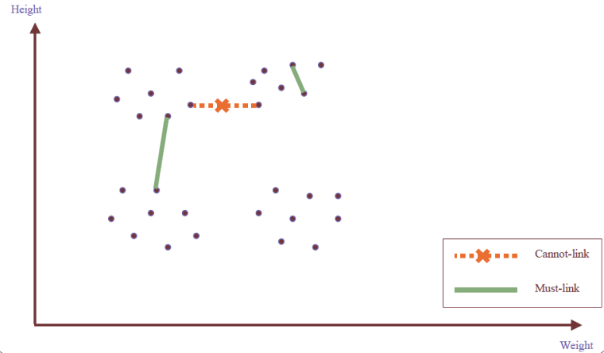
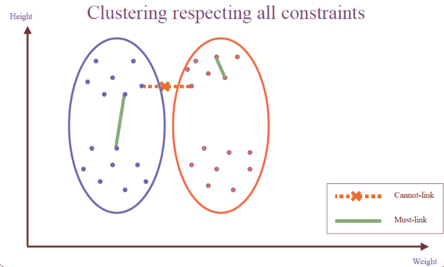
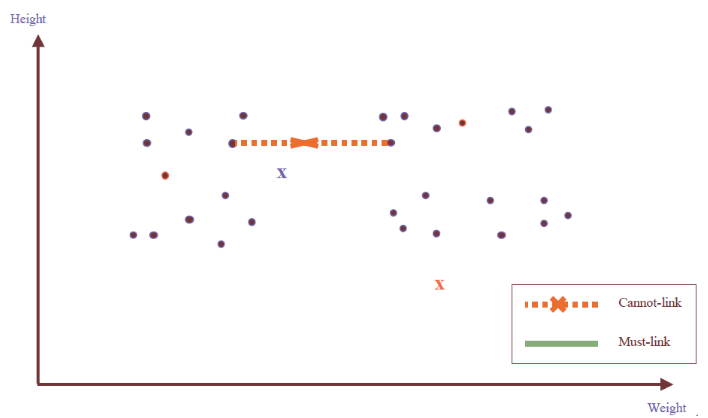
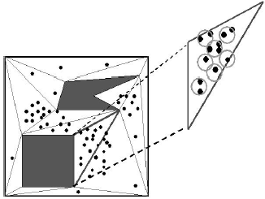
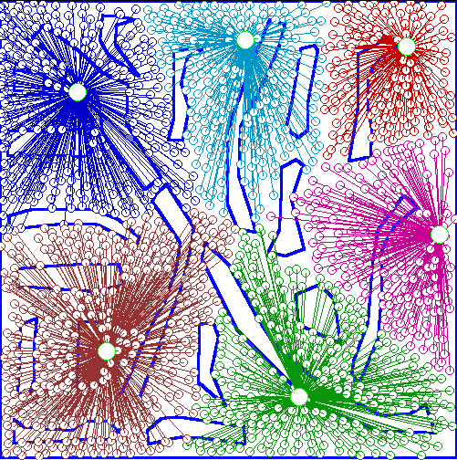

# Clustering with Constraints

Need user feedback: Users know their applications the best.

Less parameters but more user-desired constraints.

A bank manager wishes to locate four ATMs in the area in the figure on the left: obstacle and desired clusters. We want to locate ATMs to serve approximately the same population. Ignoring the obstacles will result in the clusters on the right, approximately we will have the same size of population covered by each ATM.

|Obstacle view|Ignoring the obstacles|
|-|-|
|||

But with C1 people in the other part of the river need to find a bridge to cross the river.

Constraints: presence of the hill and the river.

We have to find clustering algorithms that allow us to fix constraints.

## Categorization of Constraints

### __Constraints on instances__: 
Specifies how a pair or a set of instances should be grouped in the cluster analysis.

#### __Two types__:

-   __must-link(x, y)__: x and y should be grouped into one cluster

-   __cannot-link(x, y)__ are constraints that can be defines if they cannot be linked together, for example if distance(x, y) \> d

If we apply the clustering without taking in consideration constraints, the output is the third.

If we impose constraints, like must-link constraints if some must belong to the same cluster and cannot link constraints if they cannot link together.

### __Constraints on clusters__:
Specify a requirement on the clusters.

E.g., specify the min number of objects in a cluster, the max diameter of a cluster, the shape of a cluster (e.g., a convex), number of clusters (e.g., k).

-   $\delta-constraint$ (Minimum separation):
    
    For any two clusters $S_i$, $S_j$, $∀i, j$ for each two instances $s_p \in S_i$, $s_q \in S_j$, $∀p, q:$ 
    $$
        D(sp,sq) \ge \delta
    $$

    The minimum separation between clusters must be higher than delta.

-   $\varepsilon-constraint$

    For any cluster $S_i, |S_j| > 1$, $∀p, s_p \in S_i, \exists s_q \in S_i:$ 
    
    $$
        \varepsilon \ge D(s_p,s_q), s_p \ne s_q
    $$ 
    
    Takes in consideration the compactness of clusters.

Constraints on clusters can be converted to instance level constraints.

-   $\delta-constraint$ (Minimum separation)

    For every point x, must-link all points y such the $D(x,y) < \delta$, i.e., conjunction of must link (ML) constraints. . 
    
    Can be imposed to instances belonging to the different cluster.

    

-   $\varepsilon-constraint$

    For every point x, must link to at least one point y such that $D(x,y) \le \varepsilon$, i.e. disjunction of ML constraints. 
    
    Can be imposed to instances belonging to the same cluster.

    

Points inside clusters is connected with a point inside the cluster with a distance below epsilon.

Will generate many instance level constraints.

If we impose constraints, considering some instances in clusters, we can arrive to have the clusters we expect.

### __Constraints on similarity measurements__:

Specifies a requirement that the similarity calculation must respect

E.g., to cluster people as moving objects in a plaza, while Euclidean distance is used to give the walking distance between two points, a constraint on similarity measurement is that the trajectory implementing the shortest distance cannot cross a wall.

If we consider only the euclidian distance we are in trouble because we do not consider possible obstacles. We need to reconsider the concept of similarity.

### __Hard vs. soft constraints__:

-   A constraint is __hard__ if a clustering that violates the constraint is unacceptable. If we are not able to satisfies the constraint we won't generate the cluster.

-   A constraint is __soft__ if a clustering that violates the constraint is not preferable but acceptable when no better solution can be found. 

    Soft constraints are also called _preferences_. This is more an optimization problem, if you satisfy it it's better but in any case the cluster is acceptable.

## Clustering with constraints
Partition unlabeled data into clusters and use constraints to aid and bias clustering. Our goal is to have examples in same cluster similar, separate clusters different and constraints are maximally respected.

### Enforcing Constraints:

-   __Strict enforcement__: find best feasible clustering respecting all constraints

-   __Partial enforcement__: find best clustering maximally respecting constraints

These are possible constraints in the data set:

These are not hard or soft, we need to establish it.

__Must-link__ means that the two has to belong to the same cluster while __cannot-link__ the opposite.

We can also use labeled data and create must-link exploiting the class, objects belonging to the same class will be linked. We can exploit this partial knowledge to achieve what we want to obtain.

We will have at the end:

In this situation constraints are respected.

We can also have __Conflicting or redundant constraints.__

For example:

$must-link(x, y)\ if\ dist(x, y) < 5$

$cannot-link(x, y)\ if\ dist(x, y) > 3$

If a data set has two objects, x, y, such that dist(x, y) = 4, then no clustering can satisfy both constraints simultaneously.

if these are hard we are in trouble, if soft we can perform a choice.

### How can we measure the quality and the usefulness of a set of constraints?

-   __Informativeness__: the amount of information carried by the constraints that is beyond the clustering model. Given a data set, D, a clustering method, A, and a set of constraints, C, the informativeness of C with respect to A on D can be measured by the fraction of constraints in C that are unsatisfied by the clustering computed by A on D. 

    We reason on the fraction of constraints that are unsatisfied.

-   __Coherence of a set of constraints__: the degree of agreement among the constraints themselves, which can be measured by the redundancy among the constraints.

Constraints divide the set of all plausible solutions into two sets: feasible and infeasible: $S = S_F \cup S_I$.

Constraints effectively reduce the search space to $S_F$.

$S_F$ all have a common property, respecting the constraints. So it's not unexpected that we find solutions with a desired property and find them quickly, because our search space is reduced focusing only on feasible solutions.

### __Handling hard constraints__: 
Strictly respect the constraints in cluster assignments

The COP-k-means algorithm in which we take in consideration constraints. The idea is to generate super-instances for must-link constraints.

To do this we compute the transitive closure of the must-link constraints and to represent such a subset, we replace all those objects in the subset by the mean.

We consider all objects linked by must-link and instead of considering them separately we create super-instances and in this way we enforce that all instances has to belong to the same cluster.

The super-instances also carries a weight, which is the number of objects it represents. Important because when we apply the k-means that super-instance represents a number of instances, they must attracts more the centroid of cluster than other instances because they represent group of instances.

We conduct modified k-means clustering to respect cannot-link constraints

We modify the center-assignment process in k-means to a nearest feasible center assignment.

An object is assigned to the nearest center so that the assignment respects all cannot-link constraints

We create these super-instances and in terms of cannot-link we modify the center assignment to the nearest center assignment.

We apply this approach when we have a set of unlabeled data but also a set of labeled data.

We are supposing to have a large amount of data but some ara characterized by labels and we create must-links with objects belonging to the same class.

With also cannot-link constraints we can apply it the same.

The output is a set of clusters where constraints are respected.

If the labels are the same we put them in the must-link, otherwise in cannot-link constraints.

In 4 we replace subset of points with a super-point, that is an average of points connected by must-link constraints. We associate a weight corresponding to the points we have in the must-link.

In this way we respect must-link and adjust points to respect cannot-links.

We just replace with an instance the two objects connected by a must-link and the cannot-link remains.

We perform the execution of k-means using the cannot-link to move the membership of points to the cluster which is different than the cluster of the other point.

### __Handling Soft Constraints__

__Treated as an optimization problem__: When a clustering violates a soft constraint, a penalty is imposed on the clustering. If we satisfy them, we are reaching an optimal solution.

__Overall objective__: Optimizing the clustering quality and minimizing the constraint violation penalty.

Ex. CVQE (Constrained Vector Quantization Error) algorithm: Conduct k-means clustering while enforcing constraint violation penalties.

If we have some penalties, we can increase the distance between an object and the centroid, increasing the cost function.

For instance, we can exploit as __objective function__ the sum of distance used in k-means, adjusted by the constraint violation penalties.

-   Penalty of a must-link violation

    If objects x and y must-be-linked but they are assigned to two different centers, c1 and c2, dist(c1, c2) is added to the objective function as the penalty, we increase the cost function.

-   Penalty of a cannot-link violation

    If objects x and y cannot-be-linked but they are assigned to a common center c, dist(c, c′), between c and c′ is added to the objective function as the penalty, where c′ is the closest cluster to c that can accommodate x or y

All solutions are feasible and we just have an optimization problem.

## Speeding Up Constrained Clustering

It is costly to compute some constrained clusteringAn interest application is to perform clustering with obstacle objects: Spatial clustering in the presence of obstacles.

Let's suppose we want to cluster people as moving objects in a plaza. Euclidean distance is used to measure the walking distance. However, constraint on similarity measurement is that the trajectory implementing the shortest distance cannot cross a wall.

If we consider only the Euclidian distance we cannot considerate obstacles.Distance has to be derived by geometric computations: the computational cost is high if a large number of objects and obstacles are involved.

A point p is visible from another point q if the straightline joining p and q does not intersect any obstacles. 

We can create a __visibility graph__ to perform this type of clustering and it is the graph, VG = (V,E), such that each vertex of the obstacles has a corresponding node in V and two nodes, v1 and v2, in V are joined by an edge in E if and only if the corresponding vertices they represent are visible to each other. Let VG' = (V',E') be a visibility graph created from VG by adding two additional points, p and q, in V'. E' contains an edge joining two points in V' if the two points are mutually visible. The shortest path between two points, p and q, will be a subpath of VG'.

We just consider all vertexes visible to each other, so that if we want to compute the shortest path we can create it just considering this graph.

To reduce the cost of distance computation between any two pairs of objects or points, several pre-processing and optimization techniques can be used. One method groups points that are close together into microclusters.

This can be done by first triangulating the region R into triangles, and then grouping nearby points in the same triangle into microclusters, using a method similar to BIRCH or DBSCAN. 

By processing microclusters rather than individual points, the overall computation is reduced. After that, precomputation can be performed to build two kinds of join indices based on the computation of the shortest paths:

1. VV indices, for any pair of obstacle vertices, and

2. MV indices, for any pair of microcluster and obstacle vertex.

Use of the indices helps further optimize the overall performance.

Using such precomputation and optimization strategies, the distance between any two points (at the granularity level of a microcluster) can be computed efficiently.

Thus, the clustering process can be performed in a manner similar to a typical efficient k-medoids algorithm, such as CLARANS, and achieve good clustering quality for large data sets.

This pre-computation is useful to speed-up the computation of similarity between points and then we can apply a clustering algorithm.

Here is the comparison of not taking obstacles into account and taking them.

|__Not__ taking obstacles into account|Taking obstacles into account|
|-|-|
|||
