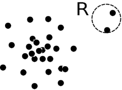
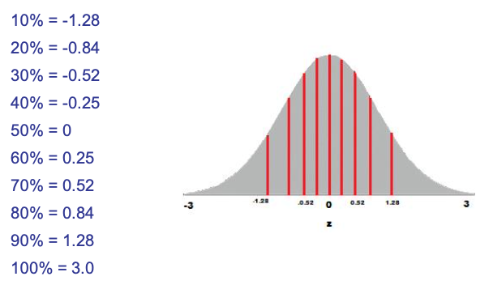
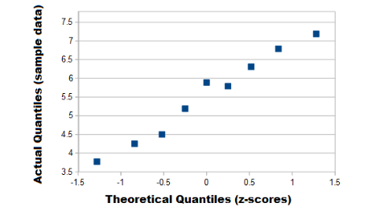
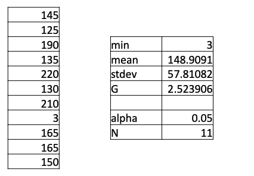
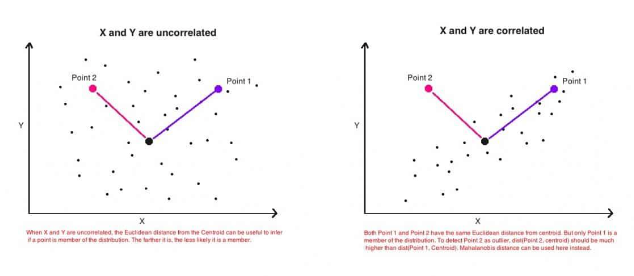
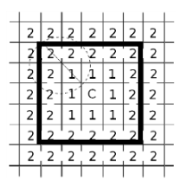
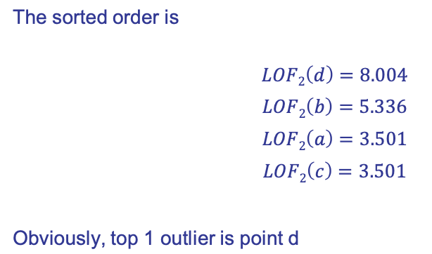
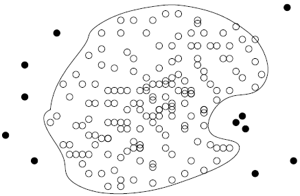

# Outlier Analysis

Maintenance is performed with repetition or in front of some conditions.

Conditional based maintenance is becoming popular, if we realize that somethings are changing we need to predict possible faults.

The first step is to detect faults thinking to achieve possible deviation of the normal behavior so to stop the machine before arriving to the fault.

__Outlier__: A data object that deviates significantly from the normal objects as if it were generated by a different mechanism.

Ex.: Unusual credit card purchase, sports: Michael Jordon, ...

Outliers are different from the noise data.

Noise is random error or variance in a measured variable.

Noise should be removed before outlier detection.

If we use smoothing filter with wide window we have the risk to let an outlier disappear, it can avoid us to find the outlier.

__Outliers are interesting__: They violate the mechanism that generates the normal data

__Outlier detection vs. novelty detection__: early stage, outlier; but later merged into the model. We can have a new trend that starts at the beginning as an outlier but then become a trend. It's needed to understand when this novel start.

## Types of Outliers

__Three kinds of outliers__: global, contextual and collective outliers.

### __Global outlier__ (or point anomaly):

Object is $O_g$ if it significantly deviates from the rest of the data set.

Ex. Intrusion detection in computer networks, fault detection in industry. The behavior is completely different from the normal behavior.

Issue: We need to find an __appropriate measurement of deviation__.

How significantly must it deviates?

### __Contextual outlier__ (or conditional outlier)

Object is $O_c$ if it deviates significantly based on a selected context

Ex. 35o C in Pisa: without telling what is the season it cannot be an outlier (depending on summer or winter?)

#### Attributes of data objects should be divided into two groups.

We have:

-   __Contextual attributes__: defines the context, e.g., time & location.
    

-   __Behavioral attributes__: characteristics of the object, used in outlier evaluation, e.g., temperature. We need to identify what is the context and what is the behavior.

Contextual outliers can be viewed as a generalization of local outliers---whose density significantly deviates from its local area.

Issue: __How to define or formulate meaningful context?__

### __Collective Outliers__

They consist on a subset of data objects collectively deviate significantly from the whole data set, even if the individual data objects may not be outliers.

We consider a cluster of objects that deviates significantly from all other objects.

We have objects with a similar behavior but completely different from the normality.

Applications: E.g., intrusion detection: When a number of computers keep sending denial-of-service packages to each other.

Detection of collective outliers has to consider not only behavior of individual objects, but also that of groups of objects. We need to have the background knowledge on the relationship among data objects, such as a distance or similarity measure on objects.

A dataset may have multiple types of outliers and one object may belong to more than one type of outlier.

## Challenges of Outlier Detection

Challenges of outlier detection are:

-   __Modeling normal objects and outliers properly__ $\rightarrow$ Hard to enumerate all possible normal behaviors in an application. The border between normal and outlier objects is often a gray area, it's not easy to define a threshold in distance to define an object as outlier.

-   __Application-specific outlier detection__ $\rightarrow$ Choice of distance measure among objects and the model of relationship among objects are often application-dependent. E.g., clinic data: a small deviation could be an outlier; while in marketing analysis, we need to have larger fluctuations

-   __Handling noise in outlier detection__ $\rightarrow$ Noise may distort the normal objects and blur the distinction between normal objects and outliers. It may help hide outliers and reduce the effectiveness of outlier detection. This is complex because performing noise reduction we need to balance the reduction of noise and the reduction of outliers.

-   __Understandability__ $\rightarrow$ Understand why these are outliers: Justification of the detection. We should also specify the degree of an outlier: the unlikelihood of the object being generated by a normal mechanism

The result we will obtain will depend on parameters, for example eps and minPts with DBSCAN.

## Outlier Detection

We have two ways to categorize outlier detection methods:

-   Based on __whether user-labeled examples of outliers can be obtained__: Supervised, semi-supervised vs. unsupervised methods. We can use supervision if we have labelled objects.

-   Categorize based on __assumptions about normal data and outliers__: Statistical, proximity-based, and clustering-based methods.

### __Supervised Methods__

Since we have labelled data, we try to modeling outlier detection is considered as a classification problem.Samples are examined by domain experts and used for training & testing.

Methods for Learning a classifier for outlier detection effectively:

-   Model normal objects & report those not matching the model as outliers, or

-   Model outliers and treat those not matching the model as normal

#### __Challenges__:

-   We need to work with __imbalanced classes__, i.e., __outliers are rare__. The number of normal objects is typically higher than the number of outliers. We will boost the outlier class and make up some artificial outliers to avoid the bias

-   __Catch as many outliers as possible__, so recall is more important than accuracy (i.e., not mislabeling normal objects as outliers)

### __Unsupervised Methods__

We assume the normal objects are somewhat clustered into multiple groups, each having some distinct features.

An outlier is expected to be far away from any groups of normal objects. We generate custers and if an object is different than all clusters we can assume it as outliers.Weakness:

-   __Weakness__: Cannot detect collective outlier effectively, we collect clusters

-   Normal objects may not share any strong patterns, but the collective outliers may share high similarity in a small area, and identify them as clusters 

-   __Unsupervised methods may have a high false positive rate__ but still miss many real outliers.

-   __Supervised methods can be more effective__, e.g., identify attacking some key resources 

Many clustering methods can be adapted for unsupervised methods:

-   __Find clusters, then outliers__: not belonging to any cluster

-   __Problem 1__: Hard to distinguish noise from outliers

-   __Problem 2__: Costly since first clustering and then determine outliers: but far less outliers than normal objects.

    -   Newer methods: __tackle outliers directly__, for example DBSCAN 

### __Semi-supervised methods__

In many applications, __the number of labeled data is often small__: labels could be on outliers only, normal objects only, or both.

Semi-supervised outlier detection: Regarded as applications of semi-supervised learning.

We exploit unsupervised methods but also labeled data.

If some labeled normal objects are available.

Use the labeled examples and the proximate unlabeled objects to train a model for normal objects.

Those not fitting the model of normal objects are detected as outliers.

We try to classify only one class, and what's not classified as belonging to the class is considered outlier.

If only some labeled outliers are available, a small number of labeled outliers many do not cover the possible outliers well.

To improve the quality of outlier detection, one can get help from models for normal objects learned from unsupervised methods.

### __Statistical techniques__ (also known as model-based methods) 
__We assume that the normal data follow some statistical model__ (a stochastic model) and the data not following the model are outliers.

We determine the distribution of normal data where we think we have the normal behavior and if objects are in the skew of a gaussian distribution are considered outliers.

Example:

-   First use Gaussian distribution to model the normal data

-   For each object y in region R, estimate gD(y), the probability of y fits the Gaussian distribution

-   If gD(y) is very low, y is unlikely generated by the Gaussian model, thus it is an outlier

Effectiveness of statistical methods:

highly depends on whether the assumption of statistical model holds in the real data.

There are rich alternatives to use various statistical models

E.g., parametric vs. non-parametric

This is parametric, we assume the distribution is gaussian, we compute mean and std with the data available and consider a point as an outlier if it has a low probability to belong to the distribution.

We have also nonparametric methods.

### __Proximity-based methods__

An object is an outlier if the __nearest neighbors of the object are far away__, i.e., the proximity of the object significantly deviates from the proximity of most of the other objects in the same data set

Example: We model the proximity of an object using its 3 nearest neighbors.

Objects in region R are substantially different from other objects in the data set.

Thus the objects in R are outliers.

We consider here 3 neighbors computing the proximity with the 3 nearest neighbors.

The effectiveness of proximity-based methods highly relies on the proximity measure.

In some applications, proximity or distance measures cannot be obtained easily. 

Often have a difficulty in finding a group of outliers which stay close to each other.

Two major types of proximity-based outlier detection are distance-based vs. density-based.

### __Clustering-based methods__

__Normal data belong to large and dense clusters__, whereas outliers belong to small or sparse clusters, or do not belong to any clusters.

Example: two clusters

All points not in R form a large cluster, the two points in R form a tiny cluster, thus are outliers.

Since there are many clustering methods, there are many clustering-based outlier detection methods as well.

We have to determine a threshold, when I consider if a point is a member of the cluster or an outlier.

In k-means all points will belong to one cluster, but when we have an outlier, we expect it will be far away from the center of the cluster.

Executing clustering algorithms is expensive: straightforward adaptation of a clustering method for outlier detection can be costly and does not scale up well for large data sets.

## Statistical approaches

In statistical approaches we assume that the objects in a dataset are generated by a stochastic process (a generative model).

The idea is to learn a generative model fitting the given dataset, and then identify the objects in low probability regions of the model as outliers.

We learn the model using data and consider objects in low probability regions as outliers, they will be far from normal distribution.

Methods are divided into two categories: parametric vs. non-parametric.

-   Parametric method: we assume some distribution and we use the data to determine the parameters of the distribution

    For example we assume that the normal data is generated by a parametric distribution with parameter θ.

    The probability density function of the parametric distribution f(x, θ) gives the probability that object x is generated by the distribution, the smaller this value, the more likely x is an outlier.

-   Non-parametric method: We do not assume an a-priori statistical model and determine the model from the input data. Not completely parameter free but consider the number and nature of the parameters are flexible and not fixed in advance. 
    
    Examples: histogram and kernel density estimation They are not completely parameter free because in an histogram we have to fix the width of the bar, while in kernel we have to choose the kind of kernel to use.

### __Univariate data__ (dataset involving only one attribute or variable)

Often assume that data are generated from a normal distribution, learn the parameters from the input data, and identify the points with low probability as outliers.

How is it possible to determine whether a distribution is normal?

-   __Shapiro-Wilk Test__: test for verifying whether a random sample comes from a normal distribution

-   __Q-Q (Quantile-Quantile) plot__: in general, this plot can be used to estimate whether a random sample comes from a continuous distribution (for instance, a normal distribution) as long as the quantiles can be calculated

#### __Q-Q plot__

Plots of two __quantiles__ against each other.

Recall: a quantile is a fraction where certain values fall below that quantile.

To verify whether a random sample comes from a normal distribution we plot the quantiles corresponding to the random samples against the quantile of a normal distribution.

If the Q-Q plot is along the line the distributions are similar and I can conclude the distribution under test is normal.

#### __An example__

Let's assume that we have to determine whether the following samples from a normal distribution: 7.19, 6.31, 5.89, 4.5, 3.77, 4.25, 5.19, 5.79, 6.79

We have an univariate domain. We adopt the following procedure:

__Step 1__. Sort the values from the smallest to the largest:

3.77, 4.25, 4.50, 5.19, 5.79, 5.89, 6.31, 6.79, 7.19

__Step 2__. Draw a normal distribution curve and divide it into n+1 segments, where n is the number of values. In our example

If this is the distribution we want to analyze if it's similar to a gaussian distribution. We split the normal distribution curve and each segment in this case is 10% of the total area.

__Step 3__. Find the z-value(cut-off point for each segment).Recall the z-value is the number of standard deviations from the mean a data point is:

If we select a value we have x% of the values in that side.

__Step 4__. Plot the dataset values against the normal distribution cut-off points.

A (almost) straight line on the Q-Q plot indicates that the data distribution is approximately normal.

We have a strong correlation between our values and the distribution we obtain using the normal distribution, so an high probability our distribution is close to the normal one.

If we have one point vary far from the mean the probability it is an outlier is higher.

#### __Methods__

__Method 1__: model the normal distribution and consider the probability of the points to belong to this distribution

Ex: Average temperature: {24.0, 28.9, 28.9, 29.0, 29.1, 29.1, 29.2, 29.2, 29.3, 29.4} Use the maximum likelihood method to estimate μ and σ

The probability that a point xi is generated by the model is

$$
    \Large{P(x_i|\sigma^2) = \dfrac{1}{\sqrt{2\pi\sigma^2}}e^{-\dfrac{(x_i-\mu)^2}{2\sigma^2}}}
$$

Consequently, the likelihood that X is generated by the model is

$$
    \Large{L(\mathcal{N}(\mu, \sigma^2):X) = P(X|\mu, \sigma^2) = \prod_{i = 1}^{n}{\frac{1}{\sqrt{2\pi\sigma^2}}e^{-\frac{(x_i-\mu)^2}{2\sigma^2}}}}
$$

We can compute mean and std to fix parameters of our std.

Since we have an univariate distribution the outlier must have max or min value.

For the above data with n = 10, we have

$$
    \large{\hat{\mu} = 28.61 \hspace{2cm} \hat{\sigma} = \sqrt{2.29} = 1.51}
$$

We know that the region between $\mu \pm 3\sigma$ contains 99.7% of data

Then $\dfrac{24 - 28.61}{1.51} = - 3.04 < -3$. Thus, 24 is an outlier since it is far then $3\sigma$, it is in the skew of gaussian distribution.

If the distribution is normal, we use the data to compute mean and std and then we just consider the probability of each point on the distribution or we just subtract mean and divide for std. If we find a value higher/lower our threshold we know that it is an outlier,

__Method 2__: The Grubb\'s test (maximum normed residual test) ─ another statistical method under normal distribution. The test finds whether a minimum value or a maximum value is an outlier. In an univariate we know that an outlier must be there if there is one.

The test checks for outliers by looking for the maximum of the absolute differences between the values and the mean. Basically, the steps are:

1. Find the G test statistic.

    a)  Order the data points from smallest to largest.

    b)  Find the mean ($\overline{Y}$) and standard deviation (s) of the data set.

    c\)  Calculate the G test statistic using one of the following equations: The Grubbs' test statistic for a two-tailed test is:

    $$
        G = \dfrac{\max\limits_{i=1,...,N}{\left|Y_i-\overline{Y}\right|}}{s}
    $$

    We determine the maximum and with it we just consider the following table.

2.  Find the G Critical Value.

    Several tables exist for finding the critical value for Grubbs' test. The table is a partial table for several G critical values and alpha levels (confidence values).

    |N|0.1|0.075|0.05|0.025|0.01|
    |-|---|-----|----|-----|----|
    |3|1.15|1.15|1.15|1.15|1.15|
    |4|1.42|1.44|1.46|1.48|1.49|
    |5|1.6|1.64|1.67|1.71|1.75|
    |6|1.73|1.77|1.82|1.89|1.94|
    |7|1.83|1.88|1.94|2.02|2.1|
    |8|1.91|1.96|2.03|2.13|2.22|
    |9|1.98|2.04|2.11|2.21|2.32|
    |10|2.03|2.1|2.18|2.29|2.41|
    |11|2.09|2.14|2.23|2.36|2.48|
    |12|2.13|2.2|2.29|2.41|2.55|
    |13|2.17|2.24|2.33|2.46|2.61|
    |14|2.21|2.28|2.37|2.51|2.66|
    |15|2.25|2.32|2.41|2.55|2.71|
    |16|2.28|2.35|2.44|2.59|2.75|
    |17|2.31|2.38|2.47|2.62|2.79|
    

    Manually, you can find the G critical value

    $$
        \large{G > \dfrac{N-1}{\sqrt{N}}\sqrt{\dfrac{t^2_{\alpha/2N,N-2}}{N-2+t^2_{\alpha/2N,N-2}}}}
    $$

    Where $t^2_{\alpha/2N,N-2}$ is the __value taken by a t-distribution with (N-2) degrees of freedom at a significance level of α/(2N)__. We consider the confidence level we want to have and N and if the G-value computed is higher than the one in the table, the point is an outlier.

3. Compare the Gtest statistic to the G critical value

    a)  $G_{test} < G_{critical}$: keep the sample in the data set; it is not an outlier for the specific confidence level we set.

    b)  $G_{test} \ge G_{critical}$: reject the sample as an outlier

4. Reject the point as an outlier if the test statistic is greater than the critical value. 

#### Example

In this example we have different values and the summarizing values in the table.

We computed G for the specific dataset and we have alpha and N.

In the table, we find a $G_{crit} = 2.23$. Thus, $G > G_{crit}$ and therefore G is an outlier.

All this with a normal distribution.

### __Multivariate outliers__

Multivariate data is a data set involving two or more attributes or variables.

We have to transform the multivariate outlier detection task into a univariate outlier detection problem

#### __Methods__

__Method 1__. Use the __Mahalanobis distance__

Mahalanobis' distance is the distance between a point and a distribution. And not between two distinct points. It is effectively a __multivariate equivalent of the Euclidean distance__.

Actually, the Euclidean distance work fine as long as the dimensions are equally weighted and are independent of each other.

It weights more some dimensions respect to other.

Equally weighted. The two following tables show the 'area' and 'price' of the same objects. Only the units of the variables change. Nevertheless, the distances between any two rows are different just changing units.

The problem can be overcome by scaling the variables, by computing the $z\textnormal{-}score = \dfrac{x - mean}{\sigma}$ or making it vary within a specific range (for instance, between 0 and 1).

In this way the distance we compute is the same for the two columns.

__Independent of each other__. The Euclidean distance between a point and the center of the points (distribution) can give little or misleading information about how close a point really is to the cluster.

When A and B are correlate the Euclidian distance makes sense, while it doesn't in the second figure. If I consider the center of the center and point 1 and 2 the distance are similar. But differently from the first case point 1 is in the distribution while point 2 is not.

I weight in the same way all dimensions. When the variables X and Y are correlated Point 1 is closer to the cluster than point 2

__How is the Mahalanobis distance different from the Euclidean distance?__

-   Transforms the columns into uncorrelated variables

-   Scale the columns to make their variance equal to 1

-   Finally, it calculates the Euclidean distance

We transform in uncorrelated distances so that the euclidian distance makes sense.

Let ō be the mean vector for a multivariate data set. The Mahalanobis distance for an object o to ō is defined as

$$
    MDist^2(o,\overline{o}) = (o-\overline{o})^TS^{-1}(o-\overline{o})
$$

where $S$ is the __covariance matrix__.

To divide by the covariance matrix is essentially a multivariate equivalent of the regular standardization $z = \dfrac{x - mean}{\sigma}$ , they will vary in all dimensions in the same way.

If the variables are strongly correlated, then the covariance will be high and the distance will be reduced; otherwise, the covariance will be low and the distance will not be reduced.

The multivariate outlier detection problem is transformed as follows.

1. Calculate the mean vector from the multivariate data set.
2. For each object $o$, calculate $MDist(o,\overline{o})$, the Mahalanobis distance from $o$ to $\overline{o}$.
3. Detect outliers  in the transformed univariate data set, {$MDist(o, \overline{o})|o \in D$}.
4. if $MDist(o,\overline{o})$ is determined to be an outlier, then $o$ is regarded as an outlier as well.

The distance involves mean vector of all objects.

We replace a set of objects by considering the set of distances of each object considering the mean vector. In this way we transform the multivariate problem of outlier detection in a univariate problem of outlier detection.

The outlier is the one with the largest distance, it is completely different from others and so it's very far from the mean vector.

With this we replace all objects with the corresponding distances going to an univariate problem from a multivariate one, we can use this distance to pass to univariate outliers.

We can use the __Grubb\'s test__ on this measure to detect outliers now.

If we have a normal distribution we can apply the test seen before.

__Weaknesses__:

-   Computationally heavy (covariance matrix and its inverse)

-   Needs to store the covariance matrix and its inverse

__Method 2__. Use χ2-statistic:

Assumption: the population of O follows a multivariate distribution with the mean vector ō and the covariance matrix S.

The method exploits a distance measure based on the chi-square test statistic

$$
    \chi^2 = \sum_{i=1}^n{\dfrac{(o_i - E_i)^2}{E_i}}
$$

where $o_i$ and $E_i$ are the observed value, and the expected value of the ith variable and $n$ is the number of variables. Using the average values as estimates of the expectation, we have

$$
    X^2 = \sum_{i=1}^n{\dfrac{(X_i-\overline{X_i})^2}{\overline{X_i}}}
$$

According to the __central limit theorem__, when the number of variables is large enough (i.e., greater than 30), $\chi^2$ as the sum of squared differences between the observed and the expected values of those variables has approximately a normal distribution. Since we are interested in detecting significantly large $\chi^2$ values for intrusion detection, we need to set only the upper control limit $\overline{\chi}^2 + 3S_{X^2}$, that is, if the computed $\chi^2$ for an observation is greater than $\overline{\chi}^2 + 3S_{X^2}$ we signal an anomaly, where $X^2$ is the mean. We transform again the multivariate problem to a univariate problem. The expected value is the mean one in the formula, so it's similar to the Mahalaobis distance.

### __Non-parametric methods__

Here, the model of normal data is learned from the input data without any a priori structure.

We don't assume the type of distribution.

Often makes fewer assumptions about the data, and thus can be applicable in more scenarios.

#### Outlier detection using __histogram__

The figure shows the histogram of purchase amounts in transactions.

A transaction in the amount of \$7,500 is an outlier, since only 0.2% transactions have an amount higher than \$5,000.

We can create this histogram because we know the distribution of data. Problem: Hard to choose an appropriate bin size for histogram.

Too small bin size $\rightarrow$ normal objects in empty/rare bins, false positive

Too big bin size $\rightarrow$ outliers in some frequent bins, we will have false negative.

__Solution__: Adopt kernel density estimation to estimate the probability density distribution of the data. If the estimated density function is high, the object is likely normal. Otherwise, it is likely an outlier.

We don't fix any distribution as in parametric methods but we make some assumptions in the size of the bin.

We can also use __Kernel Density Estimation__, where we fix kernel function and we determine the distribution using it.

$$
    \hat f_h(x) = \dfrac{1}{n}\sum_{i=1}^{n}{K_h\left(x-x_i\right)} = \dfrac{1}{nh}\sum_{i=1}^{n}{K_h\left(\dfrac{x-x_i}{h}\right)}
$$

where $K(•)$ is the kernel --- a symmetric but not necessarily positive function that integrates to one --- and $h > 0$ is a smoothing parameter called the bandwidth.

#### __Computational Cost__

The computational cost of statistical methods depends on the models. 

Simple parametric models (e.g., a Gaussian) have linear time. 

More sophisticated models (e.g., mixture models, where the Expectation Maximization (EM) algorithm is used in learning) several iterations.

Each iteration, however, is typically linear considering the data set's size. For kernel density estimation, the model learning cost can be up to quadratic. Once the model is learned, the outlier detection cost is often very small per object. 

## Proximity-Based Approaches

Intuition: __Objects that are far away from the others are outliers__.

Assumption of proximity-based approach: The proximity of an outlier deviates significantly from that of most of the others in the data set.

Two types of proximity-based outlier detection methods:

-   __Distance-based outlier detection__: An object o is an outlier if its neighborhood does not have enough other points, we set this parameter.

-   __Density-based outlier detection__: An object o is an outlier if its density is relatively much lower than that of its neighbors. We reason about proximity in relation with the neighbors.

    Using the idea of density if we hare in a sparse region we cannot expect points are close to each other but it doesn't mean points are outliers. Deciding if a point is an outlier depends on what we have around. Outliers are identified in regions with different densities.

### Distance-Based Outlier Detection

For each object o, we examine the number of o the r objects in the r-neighborhood of o, where r is a user-specified distance threshold

 An object o is an outlier if most (taking $\pi$ as a fraction threshold) of the objects in D are far away from o, i.e., not in the r-neighborhood of o.

An object o is a DB(r,$\pi$) outlier if:

$$
    \dfrac{\|o'|dist(o,o') \le r\|}{\|D\|} \le \pi
$$

We consider an outlier such considering the neighbors of an outlier but we also have two parameters, pi and r.If the number of objects in the neighborhood is lower than a threshold, we have an outlier.

Equivalently, one can check the distance between o and its k-thnearest neighbor ok, where $k = \bigl\lceil \pi\|D\| \bigr\rceil$. o is an outlier if $dist(o, o_k) > r$.

I compute the number of objects we consider in the neighborhood and use their distance.

This approach is quite expensive.

To speed-up computation we adopt a nested loop algorithm.

For any object oi, calculate its distance from other objects, and count the number of other objects in the r-neighborhood.

If $\pi$∙n other objects are within r distance, terminate the inner loop

Otherwise, $o_i$ is a DB(r, $\pi$) outlier.

Instead of calculating distances we limit the computation.

__Efficiency__: Actually, CPU time is not $O(n^2)$ but linear to the data set size since for most non-outlier objects, the inner loop terminates early. With most of the objects this occur, because they're not outliers.

In the outer loop we just count the inner points with a distance lower than a threshold.

If we achieve the number, we stop the loop to save computational time.

The efficiency is still a concern when the complete set of objects cannot be held into main memory, we have the cost I/O swapping.

We have two observations for the major cost

1. each object tests against the whole dataset, why not only its close neighbor? Each objects has to compute the distance with neighbors why not checking only the closer. 
2. check objects one by one, why not group by group?

Grid-based method (CELL): Data space is partitioned into a multi-D grid. Each cell is a hyper cube with diagonal length $\dfrac{r}{2}$.

#### Pruning using the level-1 & level-2 cell properties:

-   __Level-1__: For any possible point x in cell C and any possible point y in a level-1 cell (one cell away from C) $dist(x,y) \le r$. Since we choose the diagonal lenght $\dfrac{r}{2}$ we consider just the first level around C.

-   __Level-2__: For any possible point x in cell C and any point y in a level-2 cell (two cells away from C) $dist(x,y) \ge r$

We compute three values to speed-up the computation.

Let $a$ be the number of objects in cell C, $b_1$ be the total number of objects in the level-1 cells, and $b_2$ be the total number of objects in the level-2 cells. We can apply the following rules.

-   __Level-1 cell pruning rule__: Based on the level-1 cell property, if $a+b_1 > [\pi n]$, then every object o in $C$ is not a DB(r, $\pi$)-outlier because all those objects in $C$ and the level-1 cells are in the r-neighborhood of o, and there are at least $[\pi n]$ such neighbors. We consider the level 1, we know the number of points in $C$ and level-1 cell. Since the diagonal length is $\dfrac{r}{2}$ points in consideration are far at most $r$.

-   __Level-2 cell pruning rule__: Based on the level-2 cell property, if $a+b_1+b_2 < [\pi n] +1$, then all objects in $C$ are DB(r, $\pi$)-outliers because each of their r-neighborhoods has less than $[\pi n]$ other objects.

Thus, we only need to check the objects that cannot be pruned, and even for such an object o, only need to compute the distance between o and the objects in the level-2 cells (since beyond level-2, the distance from o is more than $r$).

We reduce the computation because we can conclude using the two rules when objects in $C$ are certainly and are not outliers.

It reduces the computation of the distance between the object and other objects in the dataset. We have to prepare the structure with grid and compute sum of objects we have in each cell and have for each the first and second level cells.

#### __Problem with different densities__

A problem we may have is that we don't have equal densities in every part of the space, we work with different densities:

Outlier $o_2$ has similar density as elements of cluster $C_1$, but $o_2$ is an outlier.

Solution: approach that __takes in consideration the densities of single points__ in the space.

We can have sparse or very dense zones, and this affect our ability to identify outliers.

$o_1$ is an outlier of course, but it's not so obvious that $o_2$ is an outlier.

It is if we observe the distribution of points but if we fix the number of points in the neighborhood thinking about the sparse zone, we include $o_2$ in the cluster.

If we set parameters thinking about dense zone all $C_1$ points are outliers.

A solution to take in consideration the neighborhood of a points is the concept of __outlierness__.

Is point relatively far away from its neighbors?

Let $N_k(x_i)$ be the k-nearest neighbors of $x_i$.
Let $D_k(x_i)$ be the average distance to k-nearest neighbors

$$
    \large{D_k(x_i) = \dfrac{1}{k}\sum_{j \in N_k(x_i)}{\|x_i - x_j\|}}
$$

We compute the distance between the point and points in its neighborhood, and compute the average.

Outlierness is the ratio of $D_k(x_i)$ to average $D_k(x_i)$ for its neighbors $j$:

$$
    \large{O_k(x_i) = \dfrac{D_k(x_i)}{\dfrac{1}{k}\sum_{j \in N_k(x_i)}{D_k(x_j)}}}
$$

We compare the average of distance with the average of distance I have for the objects in the neighborhood of $x_i$.

If the average distance of the point and its neighbors is higher than the average distance of points in the neighborhood, so if outlierness > 1, $x_i$ is further away from neighbors than expected.

I can deduce that this can be an outlier and we do it just looking at the neighborhood.

In fact, the average distance of $o_1$ and $o_2$ is greater than the one of their neighbors.

We can detect outliers in different part of the space considering the points around it, so their context.

We have to establish a __threshold__; we need to fix the value of outlierness that let us conclude something.

If clusters are close, outlierness gives unintuitive results:

p has an higher outlierness than q and r, because the objects in the neighborhood of p are object in dense zone, one point is not an outlier because it is in a sparse zone but it is close to a dense zone.

We have boundary points close to very dense zone.

The green points are not part of the KNN list of p for small k.

### Density-based Outlier Detection

__Local outliers__: Outliers comparing to their local neighborhoods, instead of the global data distribution.

In figure, $o_1$ and $o_2$ are local outliers to $C_1$, $o_3$ is a global outlier, but $o_4$ is not an outlier, because $o_4$ is in a sparse zone. However, proximity-based clustering cannot find that $o_1$ and $o_2$ are outliers (e.g., comparing with $o_4$).

Intuition (density-based outlier detection): __The density around an outlier object is significantly different from the density around its neighbors__. Instead of exploiting outlierness in which we work with distance we use also density.

__Method__: Use the relative density of an object against its neighbors as the indicator of the degree of the object being outlier.

#### __Definitions__

To exploit this concept we introduce:

-   __k-distance of an object o__, $dist_k(o)$: distance between o and its k-th NN after finding its k nearest neighbors.

-   __k-distance neighborhood of o__, $N_k(o) = \{o'|o'\ in\ D,\ dist(o,o') \le dist_k(o)\}$

    The cardinality of $N_k(o)$ could be bigger than k since multiple objects may have identical distance to o.

#### __Local Outlier Factor__

First, we compute the __reachability distance__ from $o'$ to $o$:
$$
    reachdist_k(o \leftarrow o') = \max\{dist_k(o), dist(o,o')\}
$$
where $k$ is a __user-specified parameter__.

If $dist(o,o')$ is lower than $dist_k(o)$ we exploit this last metric.

__Local reachability density__ of o:

$$
    lrd_k(o) = \dfrac{\|N_k(o)\|}{\sum_{o' \in N_k(o)}{reachdist_k(o' \leftarrow o)}}
$$

This is a density because we consider the number of objects and a sum of distances in the denominator.

The denominator is the distance between $o$ and $o'$, while if we are in dense zone this is equal to $dist_k(o)$ while not in dense zone this distance is really the distance between $o$ and $o'$.

__LOF (Local outlier factor)__ of an object o is the average of the ratio of local reachability of o and those of o's k-nearest neighbors:

$$
    LOF_k(o) = \dfrac{\sum_{o' \in N_k(o)}{\dfrac{lrd_k(o')}{lrd_k(o)}}}{\|N_k(o)\|} = \sum_{o' \in N_k(o)}{lrd_k(o') \cdot \sum_{o' \in N_k(o)}{reachdist_k(o' \leftarrow o)}}
$$

The lower the local reachability density of o, and the higher the local reachability density of the kNN of o, the higher LOF.

If the local density of o is lower than the local reachability density of the KNN of o, this value of LOF is high and this is an indication that probably o is an outlier.

This captures a local outlier whose local density is relatively low comparing to the local densities of its kNN.

We move from the idea of distance to the idea of local density.

We can identify outliers in different zones with different densities.

We have to decide the LOF threshold to consider and also the value of k.

__LOF captures the relative distance of an object__, 
it is __computationally heavy__ but __allow us to find local outliers__.

##### Example

Consider the following 4 data points a(0,0), b(0,1), c(1,1), d(3,0)

Compute the distance between the four points (Manhattan distance)

dist(a,b) = 1 , dist(a,c) = 2, dist(a,d) = 3, dist(b,c) = 1, dist(b,d) = 4 and dist(c,d) = 3.

Let us consider k=2.

Then we compute distk for each object:

dist2(a) = dist(a,c) = 2, the two-nearest neighbor for a is c.

dist2(b) = dist(b,a) = 1

dist2(c) = dist(c,a) = 2

dist2(d) = dist(d,a) = 3

So we have the neighborhood2:

N2(a) = {b,c}

N2(b) = {a,c}

N2(c) = {b,a}

N2(d) = {a,c}

We compute the local reachability distance two for a,b,c and d:

$$
    lrd_2(a) = \dfrac{\|N_2(a)\|}{reachdist_2(b \leftarrow a) + reachdist_2(c \leftarrow a)}
$$
$$
    reachdist_2(b \leftarrow a) = \max\{dist_2(b), dist(b,a)\} = \max\{1,1\} = 1
$$
$$
    reachdist_2(c \leftarrow a) = \max\{dist_2(c), dist(c,a)\} = \max\{2,2\} = 2
$$
Thus
$$
    lrd_2(a) = \dfrac{\|N_2(a)\|}{reachdist_2(b \leftarrow a) + reachdist_2(c \leftarrow a)} = \dfrac{2}{1+2} = 0.667
$$
$$
    lrd_2(b) = \dfrac{\|N_2(b)\|}{reachdist_2(a \leftarrow b) + reachdist_2(c \leftarrow b)} = \dfrac{2}{2+2} = 0.5
$$
$$
    lrd_2(c) = \dfrac{\|N_2(c)\|}{reachdist_2(b \leftarrow c) + reachdist_2(a \leftarrow c)} = \dfrac{2}{1+2} = 0.667
$$
$$
    lrd_2(d) = \dfrac{\|N_2(d)\|}{reachdist_2(a \leftarrow d) + reachdist_2(c \leftarrow d)} = \dfrac{2}{3+3} = 0.33
$$

Now we compute the LOF.

$$
    LOF_2(a) = (lrd_2(b)+lrd_2(c))(reachdist_2(b \leftarrow a) + reachdist_2(c \leftarrow a)) = (0.5 + 0.667)(1 + 2) = 3.501
$$
$$
    LOF_2(b) = (lrd_2(a)+lrd_2(c))(reachdist_2(a \leftarrow b) + reachdist_2(c \leftarrow b)) = (0.667 + 0.667)(2 + 2) = 5.336
$$
$$
    LOF_2(c) = (lrd_2(b)+lrd_2(a))(reachdist_2(b \leftarrow c) + reachdist_2(a \leftarrow c)) = (0.5 + 0.667)(1 + 2) = 3.501
$$
$$
    LOF_2(d) = (lrd_2(a)+lrd_2(c))(reachdist_2(a \leftarrow d) + reachdist_2(c \leftarrow d)) = (0.667 + 0.667)(3 + 3) = 8.004
$$

$LOF_2(d)$ is an outlier corresponding to other LOFs, in fact d is (3,0) quite far from others.

## __Clustering-Based Outlier Detection__

Using clustering an object is an outlier if (1) __it does not belong to any cluster__, (2) there is a __large distance between the object and its closest cluster__, or (3) it __belongs to a small or sparse cluster__.

We need to fix different parameters as we've seen.

__Case 1__: Not belong to any cluster

Example: Identify animals not part of a flock:

We can use a density-based clustering method such as __DBSCAN__

But we need to find the best choices for _eps_ and _minPts_ to define what's dense for us, changing them will change the results.

__Case 2__: Far from its closest cluster

We can use k-means to partition data points into clusters.

For each object o, assign an outlier score based on its distance from its closest center.

If $\dfrac{dist(o,c_o)}{avg\_dist(c_o)}$ is large, likely this point is an outlier.

We need to fix the value of k, and the threshold we need to consider the ratio large.

Example: Intrusion detection $\rightarrow$ Consider the similarity between data points and the clusters in a training data set.

Use a training set to find patterns of "normal" data, e.g., frequent itemsets in each segment, and cluster similar connections into groups.

Compare new data points with the clusters mined---Outliers are possible attacks (TCP connection data example) 

Each of the approaches seen so far __detects only individual objects as outliers__. In a large dataset, some outliers may form a small cluster. In intrusion detection, for example, hackers who use similar tactics to attack a system. For instance, in the following figure C1 and C3 should be regarded as outliers. We have collective outliers.

LOF in fact takes in consideration the density of points in respect to the density of neighbors, with k = 3 we cannot identify outliers because we have a small cluster and so each object have 3 neighbors with similar density respect to the analyzed object.

To identify the physical significance of the definition of an outlier, an outlier factor, namely __CBLOF (Cluster-Based Local Outlier Factor)__ is associated with each object.

CBLOF __measures both the size of the cluster__ the object belongs to and the __distance between the object and its closest cluster__.

Given two parameters $\alpha$ and $\beta$, we define $b$ as the boundary of large and small clusters if one of the following formulas holds

$$
    \bigg \{
        \begin{array}{rl}
            |C_1| + |C_2| + ... + |C_b| \ge |D| \alpha \hspace{1cm} (1)\\
            |C_b|/|C_b+1| \ge \beta \hspace{2cm}(2)\\
        \end{array}  
$$

1. most data points in the dataset are not outliers (for instance $\alpha$ = 90%). The sum of the cardinality of clusters is higher than a percentage of the cardinality of D.

2. large and small clusters should have significant differences in size (for instance $\beta$ = 5). We want to identify small clusters as outliers.

The set of large clusters is defined as $LC=\{C_i|i \le b\}$ and the set of small clusters is defined as $SC=\{C_j|j > b\}$.

We will have a cluster with not outliers and a cluster with outliers.

For each object o, __CBLOF__ (Cluster-Based Local Outlier Factor) is defined as:

$$
    CBLOF(o)\bigg \{
        \begin{array}{rl}
            |C_i| \cdot \min(distance(o,C_j)) \hspace{1cm} o \in C_i,C_j \in SC\ and\ C_j \in LC\\
            |C_j| \cdot \min(distance(o,C_j)) \hspace{2.46cm}o \in C_i\ and\ C_i \in LC\\
        \end{array}  
$$

For the computation of the distance between the object and the cluster, it is sufficient to adopt the similarity measure used in the clustering algorithm.

To find __CBLOF__ we use this algorithm:

-   Cluster the dataset

-   Compute the value of CBLOF for each object

It let us find objects in small cluster and let use understand how far them from large clusters are.

### __Strengths__

-   Detect outliers __without requiring any labeled data__, clusters are unsupervised

-   __Work for many types of data__

-   Clusters can be regarded as __summaries of the data__

-   Once the clusters are obtained, need __only compare any object against the clusters to determine whether it is an outlier__ (fast because we assume that we computed clusters before, but we also have to generate clusters)

### __Weaknesses__

-   __Effectiveness depends highly on the clustering method__ used---they may not be optimized for outlier detection. Depending on the clustering algorithm we can also have different shapes of clusters and it affects our conclusion.

-   __High computational cost__: Need to first find clusters

-   A method to reduce the cost: __Fixed-width clustering__

    -   A point is assigned to a cluster if the center of the cluster is within a pre-defined distance threshold from the point

    -   If a point cannot be assigned to any existing cluster, a new cluster is created, and the distance threshold may be learned from the training data under certain conditions.

## __Classification Approaches__

Idea: __Train a classification model that can distinguish "normal" data from outliers__.

But __the dataset will be imbalanced__, the number of outliers is lower.

A __brute-force approach__ resolves this problem.

We consider a training set that contains samples labeled as "normal" and others labeled as "outlier".

But the training set is typically heavily biased: number of "normal" samples likely far exceeds number of outlier samples. We have the necessity to re-balance by using undersampling or oversampling.

This approach cannot detect unseen anomaly.

### __One-class model__

A classifier is built to describe only the normal class. We learn the normal class, so we learn the decision boundary of the normal class, __it classifies one only class__.

Any samples that do not belong to the normal class (not within the decision boundary) are declared as outliers.

#### Support Vector Data Description

The most popular approach is *Support Vector Data Description* (__SVDD__).

It constructs a hyper-sphere around the positive class data that encompassed almost all points in the data set with the minimum radius.

The SVDD classifier rejects a given test point as outlier if it falls outside the hyper-sphere. However, SVDD __can reject some fraction of positively labelled data when the volume of the hyper-sphere decreases__.

#### Nearest Neighbor Description 

Another approach is the _Nearest Neighbor Description_ (__NN-d__), a variant of the Nearest Neighbor method.

A test object z is accepted as a member of target class provided that its local density is greater than or equal to the local density of its nearest neighbor in the training set. The following __acceptance function__ is used:

$$
    f_{NN^{tr}}(z) = I\left(\dfrac{\|z - NN^{tr}(z)\|}{NN^{tr}(z)-NN^{tr}(NN^{tr}(z))} \right)
$$

which presents that the distance from object z to its nearest neighbor in the training set and $NN^{tr}(z)$ is compared to the distance from its nearest neighbor $NN^{tr}(z)$ to its nearest neighbor.

If this is higher than a threshold, we can reject z.

### __Semi-supervised learning__

__Combining classification-based and clustering-based methods__.

#### Method:

-   Using a clustering-based approach, find a large cluster, $C$, and a small cluster, $C_1$

-   Since some objects in $C$ carry the label "normal", treat all objects in $C$ as normal.

-   Use the one-class model of this cluster to identify normal objects in outlier detection

-   Since some objects in cluster $C_1$ carry the label "outlier", declare all objects in $C_1$ as outliers

-   Any object that does not fall into the model for C (such as $a$) is considered an outlier as well

We exploit clustering but also the ground-truth.

#### Comments on classification-based outlier detection methods

-   __Strength__: Outlier detection is fast, we just need to see if it's out of the boundary

-   __Bottleneck__: Quality heavily depends on the availability and quality of the training set, but often difficult to obtain representative and high-quality training data, we don't have a sufficient number of outliers to train reliable classifiers.

## __Mining Contextual and Collective Outliers__

### Transformation into Conventional Outlier Detection 

If the contexts can be clearly identified, __transform the contextual outlier detection problem to conventional outlier detection__:

-   __Identify the context of the object__ using the contextual attributes

-   Calculate the __outlier score__ for the object in the context using a conventional outlier detection method.

Ex. Detect outlier customers in the context of customer groups

-   __Contextual attributes__: age group, postal code

-   __Behavioral attributes__: number of transations/yr, annual total transations amount

#### Steps: 
1. locate customer's context, 
2. compare c with the other customers in the same group, and 
3. use a conventional outlier detection method.

If the context contains very few customers, we need to __generalize contexts__.

For instance, for a customer c, if the corresponding context contains very few or even no other customers, the evaluation of whether c is an outlier using the exact context is unreliable or even impossible. I found the context but i don't have enough samples to deduce if an object is an outlier.

To overcome this challenge, we can assume that customers of similar age and who live within the same area should have similar normal behavior.

We learn a __mixture model__ $U$ on the contextual attributes, and another __mixture model__ $V$ of the data on the behavior attributes.

We learn a mapping $p(V_i|U_j)$: the probability that a data object o belonging to cluster $U_j$ on the contextual attributes is generated by cluster $V_i$ on the behavior attributes. 

The outlier is determined by using the __outlier score__:

$$
    S(o) = \sum_{U_j}{p(o \in U_j) \sum_{V_i}{p(o \in V_i)p(V_i|U_j)}}
$$

### Modeling Normal Behavior considering Contexts

In some applications, one cannot clearly partition the data into contexts.

Ex. if a customer suddenly purchased a product that is unrelated to those she recently browsed, it is unclear how many products browsed earlier should be considered as the context.

Model the "normal" behavior considering contexts can be performed:

-   Using a training data set, __train a model that predicts the expected behavior attribute values__ considering the contextual attribute values

-   An object is a __contextual outlier__ if its behavior attribute values __significantly deviate from the values predicted__ by the model

If what we have predicted is far from what we observed, we can deduce it is an outlier.

Using a prediction model that links the contexts and behavior, these methods avoid the explicit identification of specific contexts.

Methods: __A number of classification and prediction techniques can be used to build such models__, such as regression, Markov Models, and Finite State Automaton.

### Structured Objects

Collective outliers are identified if objects as a group deviate significantly from the entire data.

Need to examine the __structure of the dataset__, i.e, the relationships between multiple data objects. Each of these structures is inherent to its respective type of data.

- For __temporal data__ (such as time series and sequences), we explore the structures formed by time, which occur in segments of the time series or subsequences. 

- For __spatial data__, explore local areas 

- For __graph and network data__, we explore subgraphs 

Difference from the contextual outlier detection: the __structures are often not explicitly defined__ and have to be discovered as part of the outlier detection process. It strongly depends on types of data and structure.

#### Collective outlier detection methods: two categories.

1. In the first category we reduce the problem to conventional outlier detection.

    We identify structure units, treat each structure unit (e.g., subsequence, time series segment, local area, or subgraph) as a data object, and extract features

    Then outlier detection on the set of "structured objects" constructed as such using the extracted features

2. The second category models the expected behavior of structure units directly. 

Ex. 1. Detect collective outliers in online social network of customers

- Treat each possible subgraph of the network as a structure unit

- Collective outlier: An outlier subgraph in the social network.

    - Small subgraphs that are of very low frequency

    - Large subgraphs that are surprisingly frequent

Ex.2. Detect collective outliers in temporal sequences

-   Learn a Markov model from the sequences

-   A subsequence can then be declared as a collective outlier if it significantly deviates from the model

Collective outlier detection is __subtle__ due to the challenge of __exploring the structures in data__.

- The exploration typically uses heuristics, and thus may be application dependent.

- The computational cost is often high due to the sophisticated mining process.

We have to deal with the specific application domain.

## Outlier Detection in __High Dimensional Data__

We are strongly affected by the __curse of dimensionality__ problem, increasing dimensions the space becomes very sparse. We need techniques to work with sparse data.

Reducing the dimensionality is not a good approach, we need to find the best one.

### Challenges

- __Interpretation of outliers__ is fundamental.

    Detecting outliers without saying why they are outliers is not very useful in high-D due to many features (or dimensions) are involved in a high-dimensional data set.

    E.g., which subspaces that manifest the outliers or an assessment regarding the "outlier-ness" of the objects.

- We need to work with __data sparsity__. Data in high-D spaces are often sparse.

    The distance between objects becomes heavily dominated by noise as the dimensionality increases.

- We can use __data subspaces__. Adaptive to the subspaces signifying the outliers. 

    We can in this way capture the local behavior of data.

- It must be __scalable considering dimensionality__, where the number of subspaces increases exponentially.

### __Approaches to cope with the curse of dimensionality__

__Method 1__: Detect outliers in the full space, we don't reduce the dimensions. e.g., __HilOut Algorithm__

Find distance-based outliers, but use the ranks of distance instead of the absolute distance in outlier detection.

For each object o, find its k-nearest neighbors: $nn_1(o)$, ... , $nn_k(o)$.

The weight of object o:
$$
    \large{w(o) = \sum_{i = 1}^{k}{dist(o,nn_i(o))}}
$$

All objects are ranked in __weight-descending order__.

We just select the top-$l$ objects in weight are output as outliers ($l$: user-specified parameters).

We work in ranks and not in distance and order is established by using distance put we don't put a threshold based on distance. 

__Method 2__: Approach the problem using __dimensionality reduction__.

Works only when in lower-dimensionality, normal instances can still be distinguished from outliers

We can __exploit PCA__: Heuristically, the principal components with low variance are preferred because, on such dimensions, normal objects are likely close to each other and outliers often deviate from the majority.

### Finding Outliers in Subspaces

Then after reduced the space we analyze outliers in the transformed space. 

Extending conventional outlier detection to subspace instead of the original space is __possible but hard for outlier interpretation__, in fact we'll work in subspaces.

Finding outliers in much lower dimensional subspaces is easy to interpret the motivation and to what extent the object is an outlier.

#### Example

Find outlier customers in certain subspace: average transaction amount >> avg. and purchase frequency << avg.

An approach is to exploit __grid-based subspace outlier detection__ method. The idea is to project data onto various subspaces to find an area whose density is much lower than average.

This means we have to discretize the data into a grid with $\varphi$ equi-depth regions.

The equi-depth grid takes in consideration equal frequency.

Using this approach we search for regions that are significantly sparse.

Consider a k-d cube: k ranges on k dimensions, with n objects.

If objects are independently distributed, the expected number of objects falling into a k-dimensional region is $(1/\varphi)^kn = f^kn$, where $1/\varphi$ is the probability to find dense region in our space, and $k$ is the number of dimensions, the standard

deviation is $\sqrt{f^k(1-f^k)n}$

The __sparsity coefficient__ of cube $C$:

$$
    S(C) = \dfrac{n(C)-f^kn}{\sqrt{f^k(1-f^k)n}}
$$

$n(C)$ is the number of objects present in the cell.

$f^kn$ is the probability of having objects multiplied by the number of objects, the number of objects we expect in the cell.

if $n(C) > f^kn$ it contains more objects than expected, few possibility to have outliers. Otherwise, we have density lower than expected and we expect there are outliers.

If $S(C) < 0$, $C$ contains less objects than expected.

The more negative, the sparser $C$ is and the more likely the objects in $C$ are outliers in the subspace. We have a lot less density than expected.

#### __Algorithm__

-   __Find the m grid cells__ (projections) with the __lowest sparsity__ coefficients

-   Brute-force algorithm is in $O(\varphi k)$

-   Evolutionary algorithm (input: m and the dimensionality of the cells). We need to fix m and the dimensionality of the cell.

#### __Discussion__

-   Results need not be the points from the optimal cells

-   __Very coarse model__ (all objects that are in cell with less points than to be expected)

-   __Quality depends on grid resolution and grid position__

-   __Implements a global approach__ (key criterion: globally expected number of points within a cell)

### Modelling High-Dimensional Outliers

Develop new models for high-dimensional outliers directly.

__Avoid proximity measures__ and adopt new heuristics that do not deteriorate in high-dimensional data, that does not depend a lot on distance.

We identify outliers using the idea of __angles__.

Angles are more stable than distances in high dimensional spaces(e.g. the popularity of cosine-based similarity measures for text data).

__Object o is an outlier if most other objects are located in similar directions__.

__Object o is no outlier if many other objects are located in varying directions__.

If I connect a far away object to other objects, angles are very narrow and similar to each other.

If we have an object inside a group of objects, angles we obtain are very different.The intuition is to compute angles between object we are observing and others. If the object is not an outlier, is inside of the cluster, the variation is high between angles and we can obtain angles from 0 to 360.

__Use the variance of angles for a point to determine outlier__.

__Combine angles and distance__ to model outliers.

> Use the distance-weighted angle variance as the outlier score .

> Outliers are at the border of the data distribution.

> Normal points are in the center of the data distribution.

#### __Model__

Consider for a given point p the angle between px and py for any two x y from the database.

We connect p with x and p with y and consider the angles, consider the spectrum of all these angles.

The broadness of this spectrum is a score for the outlierness of a point.

Measure the variance of the angle spectrum weighted by the corresponding distances (for lower dimensional data sets where angles are less reliable).

The __Angle-based outlier factor__(ABOF):

$$
    \Large{ABOF(o) = VAR_{x,y \in D, x \ne o,y \ne o}{\dfrac{\langle \overrightarrow{ox}, \overrightarrow{oy} \rangle}{dist(o,x)^2dist(o,y)^2}}}
$$

The angle is normalized by the distance between $o$ and $x$ and $o$ and $y$.

__Properties__:

- Small ABOF $\Rightarrow$ outlier, the variance is low and points are far from $o$, obtained by the denominator

- High ABOF $\Rightarrow$ no outlier, we are in a center of a group so the variance of angles if high and distance is low. 

__Complexity__ $O(n^3)$ is very high, but we can have efficient approximation computation methods Another aspect is that this approach can be generalized to handle arbitrary types of data.
