# Clustering Graphs and Network Data

Network is a collection of entities that are interconnected with links.

An example is social network where entities are people and links are friendships.

We cannot truly understand a complex system unless we understand the underlying network.

Everything is connected, studying individual entities gives only a partial view of a system.

Two main themes:

-   What are the structural properties of the network?

-   How do processes happen in the network?

In mathematics, networks are called graphs, the entities are nodes, and the links are edges.Networks of thousands, millions, or billions of nodes are impossible to process visually.

Problems become harder and processes are more complex.

Current problems are:

-   Information/Virus Cascade. How do viruses spread between individuals? How does information propagate in social and information networks?

-   Ranking of nodes on the web. We also need algorithms to compute the importance of nodes in a graph. For instance, the PageRank algorithm in Google.

-   Link prediction, that consists in, given a snapshot of a social network at time t, seek to accurately predict the edges that will be added to the network during the interval from time t to a given future time t\'. Applications: Accelerate the growth of a social network, Identify suspect relationships.

-   Network content. Users on online social networks generate content. Mining the content in conjunction with the network can be useful.

It can be useful for social raccomandations.Do friends post similar content on Facebook? Can we understand a user's interests by looking at those of their friends?

-   Social media. Twitter has become a global "sensor" detecting and reporting everything. Automatically detect events using Twitter like Earthquake news propagation or Sentiment mining.

-   Clustering and Finding Communities, which are cohesive subgroups are subsets of actors among whom there are relatively strong, direct, intense, frequent, or positive ties.

-   Community Evolution. People become similar to those they interact with.

-   Bi-partite graphs, clustering customers buying similar products; introducing similarity metrics.

-   Web search engines, where we analyze click through graphs and Web graphs. In click-through information, an edge links a query to a web page if a user clicks the web page when asking the query. Valuable information can be obtained by cluster analyses on the query--web page bipartite graph. In web graph. each web page is a vertex, and each hyperlink is an edge pointing from a source page to a destination page.

-   Social networks, in which the vertices are individuals or organizations, and the links are interdependencies between the vertices, representing friendship, common interests, or collaborative activities. Customers within a cluster may influence one another regarding purchase decision making.

The basic on networks are:

-   Objects: nodes, vertices N

-   Interactions: links, edges E

-   System: network, graph G(N,E)

Graph is a mathematical representation of a network

How can we build the graph? We have to choose of the proper network representation of a given domain/problem determines our ability to use networks successfully. In some cases there is a unique, unambiguous representation, while in other cases, the representation is by no means unique.

The way you assign links will determine the nature of the question you can study.

We can apply standard clustering algorithms by introducing a specific definition of similarity measures:

-   Geodesic distances

-   Distance based on random walk (SimRank)

Graph clustering methods:

-   Minimum cuts

-   Density-based clustering, for example SCAN

If we are able to define similarity we can exploit clustering algorithms to cluster nodes.

Distance between two vertices in a graph: the shortest path between the vertices.

-   **Geodesic distance** (A, B): number of edges (length) of the shortest path between A and B (if not connected, defined as infinite)

Exploiting it we can define:

-   Eccentricity of v, eccen(v): The largest geodesic distance between v and any other vertex u ∈ V − {v}.

E.g., eccen(a) = eccen(b) = 2; eccen(c) = eccen(d) = eccen(e) =3


-   Radius of graph G: The minimum eccentricity of all vertices, i.e., the distance between the "most central point" and the "farthest border"

r = min v∈V eccen(v)

E.g., radius (g) = 2.

-   Diameter of graph G: The maximum eccentricity of all vertices, i.e., the largest distance between any pair of vertices in G

d = max v∈V eccen(v)

> E.g., diameter (g) = 3
>
> A peripheral vertex is a vertex that achieves the diameter.
>
> E.g., Vertices c, d, and e are peripheral vertices

Let us consider the similarity between two vertices in a customer social network.

How well can geodesic distance measure similarity and closeness in a network?

Suppose that Ada and Bob are two customers in the network

The geodesic distance (i.e., the length of the shortest path between Ada and Bob) is the shortest path that a message can be passed from Ada to Bob and viceversa.

Is this information useful? Typically, the company is not interested in how a message is passed from Ada to Bob but in understand if they're reachable.

It can be un-useful for our aim. We need to define what does similarity mean in a social network 

When we deal with similarity measure, we can consider two different meanings.

-   Structural context-based similarity

```{=html}
<!-- -->
```
-   Two customers are considered similar to one another if they have similar neighbors in the social network.

    Two people receiving recommendations from a good number of common friends often make similar decisions: intuitive!

```{=html}
<!-- -->
```
-   Similarity based on random walk

The company sends promotional information to both Ada and Bob in the social network. Ada and Bob may randomly forward such information to their friends (or neighbors) in the network. The closeness between Ada and Bob can then be measured by the likelihood that other customers simultaneously receive the promotional information that was originally sent to Ada and Bob.

These meanings associated with the concept of similarity help us introduce a similarity measure useful for our work.

The structural-context similarity can express what we want.

**SimRank**: structural-context similarity, and it is based on the similarity of its neighbors.

In a directed graph G = (V,E), we define:

-   individual in-neighborhood of v: I(v) = {u \| (u, v) ∈ E}, the edge is incoming

-   individual out-neighborhood of v: O(v) = {w \| (v, w) ∈ E}, the edge is outgoing

Similarity measured in terms in SimRank between two vertices u and v is defined as:

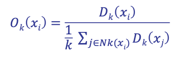

where C is a constant between 0 and 1.

If a vertex does not have any neighbor, we define s(u,v) = 0.

We define a SimRank between two nodes in terms of SimRank between other nodes.

How can compute SimRank? Iteratively, compute the previous equation until a fixed point is reached.

Let n be the number of nodes in graph G.

For each iteration i we can keep n 2 entries si (\*,\*), where si (u,v) gives the score between u and v on iteration i.

We start with s0(\*,\*) where each s0(u,v) is a lower bound on the actual SimRank score s (u,v):

![Immagine che contiene orologio, antenna, calibro Descrizione generata automaticamente]

To compute si +1(u,v) from si (\*,\*) we use :


We iteratively compute and update this, but we have the termination condition when u = v.

In a number of iterations, we have similarity in terms of SimRank for each pair of vertices.

The values si (\*,\*) are non-decreasing as i increases.

Complexity: 

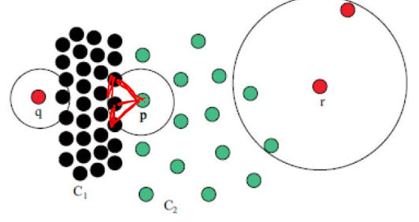 where d2 is the average 

of 

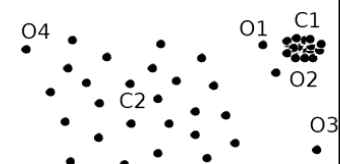

K is the number of iterations and typically is equal to 5.

Given this similarity we can apply any clustering algorithms exploiting it.

We consider similar neighbors as context-base similarity.

The definition is recursive, and we identified that for computing the simRank we can exploit a iterative computation.

(\*,\*) represents each possible node in the graph.

We start with i = 0, we assume that it is 0 or 1 based on the previous formula, and then we calculate si+1, iterative process.

They are not decreasing because we start from 0 if u != v and so we cannot decrease more.

This approach converges after k iterations.

But we have to compute n\^2 similarities so the complexity is high.

At the end of the process we can generate the **G\^2 graph**. G2 represents an ordered pair of nodes of G. A node (a,b) of G2 points to a node (c,d) if, in G, a points to c and b points to d.

The example represents the Web pages of two professors ProfA and ProfB, their students StudentA and StudentB, and the home page of their university Univ

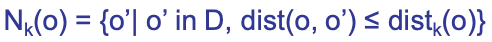

University has a link to ProfA which has a link to StudentA and so on.

Applying the simRank to measure the similarity we generate the G\^2 and we will have a connection in front of that condition. We create paths between pairs.

{Univ, Univ} has simRank equal to 1 because we have same nodes.

{ProfA, ProfB} has a similarity equal to 0.414, because both linked from University, and so on.

We exploited similarity based on the structure of the graph, we considered input edges in our nodes.

Now, we see a similarity definition in which we consider the random walk.

Similarity based on random walk: in a strongly connected graph a path exists between every two nodes).

We define the expected distance from u to v:


The sum is computed over all tours t which start at u and end at v, and do not touch v except at the end.

For a tour  the length l(t) of t is

k-1, the number of edges we travel along the tour.

The probability P(t) of travelling t is:


This is the probbaility to walk along the tour. We make this consideration for each node on the walk.

Note that the case where u = v, for which d (u,v) = 0 is a special case of the formula of the distance: only one tour is in the summation and it has length 0, we remain in the same node.

The expected distance from u to v is exactly the expected number of steps a random surfer, who at each step follows a random out-edge, would take before he first reaches v, starting from u.

Expected meeting distance (**EMD**): the expected meeting distance m(u,v) between u and v is the expected number of steps required before two surfers, one starting at u and the other at v, would meet if they walked (randomly) in lock-step.

The EMD is symmetric by definition.

We have two surfers one starting from u and one from v and we measure just the number of steps requires for obtaining the surfers meet each other.


In the first example, if the two surfers start they will move in parallel.

To define EMD formally in G, we use the derived graph G2 of node-pairs.

Each node (u, v) of V 2 can be thought of as the present state of a pair of surfers in V , where an edge from (u, v) to (c, d) in G2 says that in the original graph G, one surfer can move from u to c while the other moves from v to d.

A tour in G2 of length n represents a pair of tours in G also having length n. Formally, the EMD m(u, v) is simply the expected distance in G2 from (u, v) to any singleton node (x, x) ∈ V2 (where u = v), since singleton nodes in G2 represent states where both surfers are at the same node. More precisely,


The sum is taken over all tours t starting from (u,v) which touch a singleton node at the end and only at the end. Unfortunately, G2 may not always be strongly connected (even if G is), and in such cases there may be no tours t for (u,v) in the summation. In this case, m(u,v) = ∞. This definition would cause problems in defining distances for nodes from which some tours lead to singleton nodes while others lead to (u, v).

Solution: **Expected-f Meeting distance**

Map all distances to a finite interval: instead of computing expected length l(t) of a tour, we can compute the expected f(l(t)), for a nonnegative, monotonic function which is bounded on the domain \[0,∞).


Instead of using directly l(t) we use C\^l(t) and it solves the problem because close nodes have a lower score (meeting distances of 0 go to 1 and distances of ∞ go to 0), matching our intuition of similarity. s'(a,b)=0 -\> when l(t) becomes infinity, no tour from (a,b) to any singleton nodes

s'(a,b)=1 -\> when a=bs'(a,b)∈\[0,1\] -\> for all other values of a,b This transformation avoid us to have infinite, when s(u,v) tended to be infinite s'(u,v) tend to be 0.

Some examples of expected-f meeting distance with C=0.8.


It has been proved that the SimRank score, with parameter C, between two nodes is their expected-f meeting distance traveling back-edges, for .

Structure and expected f-meeting distance have similar results.

In other words, s(u,v) = s'(u,v) for any two vertices u and v. That is, SimRank is based on both structural context and random walk, it implements both intuitions.

How should we conduct **clustering in a graph**?

Intuitively, we should cut the graph into pieces, each piece being a cluster, such that the vertices within a cluster are well connected and the vertices in different clusters are connected in a much weaker way.

Inside a graph we are nodes related to each other because strongly interconnected.

Let G = (V,E) be a direct graph.

A cut C(S,T) is a partitioning of the set of vertices V in G, that is, V = S ∪ 𝑇 and S ∩ 𝑇 = ∅. The cut set of a cut is the set of edges {(u, v) ∈ E \| u ∈ S, v ∈ T}

When we cut the graph in subgraphs we cut edges connecting subgraphs, and cut are set of edges we cut for separating the graph.

Size of the cut: number of edges in the cut set. If the edges are weighted, the value of the cut is the sum of weights. We want to cut the minimum number of edges, the minimum cut set, so that subgraphs are not related to each other.

Minimum cut is good for deriving clusters in graphs, and with it the cut's size is not greater than any other cut's size.

We have a polynomial time algorithms to compute minimum cuts of graphs (Edmonds-Karp algorithm)

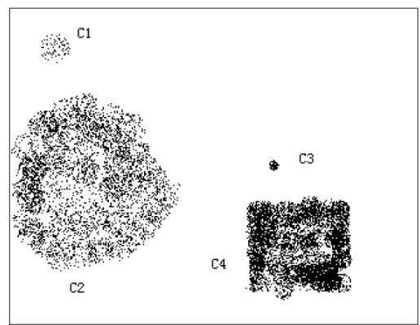

In this graph we can identify some clusters, but if we apply the minimum cut, that corresponds to find the minimum number of edges to cut.

Doing it we separate l from the rest of the graph.

If we apply the minimum cut, it corresponds to find the minimum cut of edges to cut to separate the graph.

We separate l from the rest of the graph, but we can realize that we have two clusters.

Cut C2 = ({a, b, c, d, e, f , l }, {g, h, i, j, k}) leads to a much better clustering than C1. The edges in the cut set of C2 are those connecting the two "natural clusters" in the graph.

Specifically, for edges (d,h) and (e,k) that are in the cut set, most of the edges connecting d, h, e, and k belong to one cluster.

We can exploit this information to introduce a better measure: Sparsity.

Intuition: choose a cut where, for each vertex u that is involved in an edge in the cut set, most of the edges connecting to u belong to one cluster.

The sparsity of a cut C = (S,T) is defined as:

-   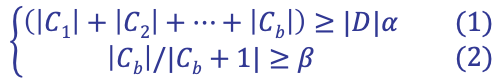

A cut is sparsest if its sparsity is not greater than that of any other cut.

Favors solutions that are both sparse (few edges crossing the cut) and balanced (close to a bisection). We cut the minimum number of edges but separating graph in subgraphs that approximately have the same size.

The problem is known to be NP-Hard, and the best known algorithm is an O(sqrt(log 𝑛)) approximation.Ex. Cut C2 =({a,b,c,d,e,f,l},{g,h,i,j,k}) is the sparsest cut 

After execution we can measure the quality of the result.

For k clusters, the modularity of a clustering assesses the quality of the clustering:


We have the sum of differences of those two. (module = cluster)

li: number of edges between vertices in the i-th clusterdi: the sum of the degrees of the vertices in the i-th cluster where degree of a vertex u: number of edges connecting to u

The modularity of a clustering of a graph is the difference between the fraction of all edges that fall into individual clusters and the fraction that would do so if the graph vertices were randomly connected.

The optimal clustering of graphs maximizes the modularity.

In this way we can measure the quality we obtain with graph-clustering approach.

The sparsest cut problem has:

-   High computational cost

Many graph cut problems are computationally expensive

-   The sparsest cut problem is NP-hard

-   Need to tradeoff between efficiency/scalability and quality

Sophisticated graphs

-   May involve weights and/or cycles.

High dimensionality

-   A graph can have many vertices. In a similarity matrix, a vertex is represented as a vector (a row in the matrix) whose dimensionality is the number of vertices in the graph. With an high number of vertices we have an high number of features.

Sparsity

-   A large graph is often sparse, meaning each vertex on average connects to only a small number of other vertices

-   A similarity matrix from a large sparse graph can also be sparse

There exist two kinds of methods:

-   Clustering methods for high-dimensional data

-   Clustering methods designed specifically for clustering graphs

Clustering methods for high-dimensional data

-   Extract a similarity matrix from a graph using a similarity measure

-   A clustering algorithm for high-dimensional data is therefore applied

Clustering methods are designed specifically for clustering graphs

-   Exploit the peculiarities of the graph for performing the clustering process

**SCAN: Density-based clustering of Networks**

We don't have to fix k, it follows the density but we have to define the concept of density with vertices and edges.

Individuals in a tight social group, or **clique**, know many of the same people, regardless of the size of the group. A clique is a group with strongly interconnected components, it doesn't depend on the size but just on the interconnection.

Individuals who are **hubs** know many people in different groups but belong to no single group. They act as bridge multiple groups.

Individuals who are **outliers** reside at the margins of society. Hermits, for example, know few people and belong to no group To identify them we exploit the SCAN approach.

We define the Neighborhood of a Vertex:

Define Γ(v) as the immediate neighborhood of a vertex (i.e. the set of people that an individual knows ), vertices connected by the edge.


The desired features tend to be captured by a measure, called Structural Similarity:


Ratio between the cardinality of the intersection of the neighborhood of v and w over the square root of the product of cardinalities.

The neighborhood of u:

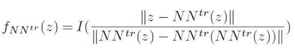

We also have u itself.

If we consider v, we have yellow vertices and v itself.

Structural similarity is large for members of a clique and small for hubs and outliers.

This, because in case of cliques the numerator is high because we expect the neighborhood of it and neighbors has a lot of common edges, the cardinality of the two are approximately similar and the value of denominator is like the value of the numerator.

In the case of an outlier, we expect that the numerator is low because its neighborhood is very limited. The connection between an outlier and another graph is limited.

In the denominator, the neighborhood of the outlier is low, but the neighborhood of connected vertices may not be low.

In the case of a hub, for example 6 in the figure, we have that the numerator is not very high and the denominator the neighborhood of 6 is quite high.

![Immagine che contiene luce Descrizione generata automaticamente]

SCAN uses a similarity threshold 𝜀 to define the cluster membership.

For a vertex v ∈ V, the ɛ-Neighborhood of v is defined as:


set of neighbors such that the structure of similarity is higher or equal to epsilon.

A core vertex is a vertex inside of a cluster.

v is a core vertex if and only if:


where 𝜇 is a popularity threshold.

SCAN grows cluster from core vertices (similar to DBSCAN).

If a vertex v is in the ɛ-Neighborhood of a core u, then v is assigned to the same cluster as u.

We start from a core vertex and we grow the cluster.

The growing process continues until no cluster can be further grown.

Formally, a vertex w can be directly reached from a core v if


v is core and w belong to the eps-neighborhood of v.

Structure reachable: transitive closure of direct structure reachability. A vertex v can be reached from a core vertex u if there exist vertices w1, \..., wn such that w1 can be reached from u, wi can be reached from wi-1, for 1\<i\<=n, and v can be reached from wn.

Structure connected: two vertices v and w, which may or may not be cores, are said connected there exists a core u such that v and w can be reached from u.

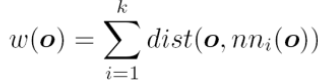

We must identify u such that v and w can be reached from u with the structure reachability we identified before.

Structure-connected cluster C is characterized by:Connectivity:


Maximality:

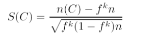

Hubs do not belong to any cluster and bridge to many clusters.

Outliers do not belong to any cluster and connect to less clusters.


The result is strongly dependent on the parameters we use.

We identify possible outliers and hub, and we distinguish between them if we have connections between them and clusters.

An example is the following. We want to define clusters, hubs and outliers. We set:

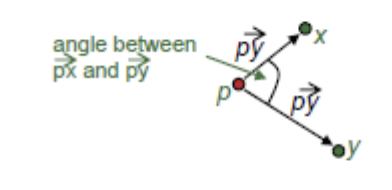

We can start from any vertex; we start from 13.


We compute the structure of similarity to identify if it's a core.

We have to identify to do that the neighborhood of v and w, the neighbors of 13 are 9 and 13.

The neighborhood of 9 has 9, 8, 10, 12, 13.

The cardinality of the neighborhood of 9 is 5, of 13 is 2 and the intersection is composed by 9 and 13.


= 2/sqrt(2\*5) = 0.63.

We have to compare it with epsilon to decide if 13 can be a core and we discover that it is lower, we are sure that 13 is not a core vertex.

The eps-neighborhood of v is empty.

It can be an hub or an outlier.

We extract another vertex to decide if it's a core, repeating the consideration we've seen.

Let's see 8.


We will repeat the computation with 7,9 and 12.

Considering 9, 8 has 4 vertices in the neighborhood, 9 has 5 and the intersection is composed by 8,9 and 12.


= 4/sqrt(20) = 0.67.

In case of 12, we have 6 elements in its neighborhood, 4 vertices in the neighborhood of 8 and the intersection is composed by 4 elements.


= 4/sqrt(24) = 0.82.

The same for 7.


In our case we don't have enough vertices inside the eps-neighborhood.

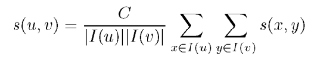

For 12, the structure similarity is quite high.

We can conclude 12 is a core vertex, we start the cluster and we add the neighbors of 12 in the cluster.

We try to understand if we can include also other points.

We have to compute if 6 is really a core point to include in our cluster.


6 is not a core point and cannot be included in the clusters because it acts as a bridge between the two clusters.

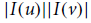

We can continue with 5, and so on.

At the end we will have two clusters, and 13 and 6 non included in the clusters.

But we can elect 6 as hub and 13 as an outlier, because:


Running time = O(\|E\|)For sparse networks = O(\|V\|)

With the increase of the number of vertices the running time is stable.

The results we obtain are still strongly related to the parameters we choose.# Advanced Frequent Pattern Analysis

Before applying some ML algorithms it's useful to apply some analysis.

**Mining Multiple-Level Association Rules**

Items often form hierarchies in our application domain, for example we can have milk specialized in different kinds of milk.

Considering the hierarchy, items at the lower level are expected to have lower support; they are derived items and has of course a lower support than parents.

It should be used different minsup's depending on the level we consider.

In higher levels we could use an higher min\_sup.


Flexible min-support thresholds are also useful for other thigs.

For example, considering that some items are **more valuable** but less frequent.

-   Use non-uniform, group-based min-support.

    E.g., {diamond, watch, camera}: 0.05%; {bread, milk}: 5%;

If we want to analyze this valuable pattern we should use a different minsup.

**Redundancy Filtering**: Some rules may be redundant due to "ancestor" relationships between items.

milk -\> wheat bread \[support = 8%, confidence = 70%\]

2% milk -\> wheat bread \[support = 2%, confidence = 72%\]

The first rule is an ancestor of the second rule.

A rule is redundant if its support and confidence are close to the "expected" value, based on the rule's ancestor.

The support of the derived rule is 2%, while for milk -\> wheat bread is 8%, but this is the relation in terms of percentage of these items in these transactions that we have in terms of milk and 2% milk.This support is what we expect just considering the ratio between the transaction in which we have milk and in which we have 2% milk.

We can avoid to consider the most specialized rule because support and confidence can be derived directly from that association.

**Mining Multi-Dimensional Association**

There's another interesting problem.

If we assume that the predicate is the same, we have single-dimensional rules:

buys(X, "milk") -\> buys(X, "bread")

We can have also multi-dimensional rules, that consider \>= 2 dimensions or predicates.

Inter-dimensional association rules (no repeated predicates): age(X,"19-25") & occupation(X,"student") -\> buys(X, "coke")

‎hybrid-dimensional association rules (repeated predicates): age(X,"19-25") & buys(X, "popcorn") -\> buys(X, "coke")

-   

**Mining Quantitative Association Rules**

There's another interesting problem, which regards quantitative attributes: numeric, implicit ordering among values.

We have to apply some discretization, that can be static discretization (predefined concept hierarchies) or dynamic discretization (binning and clustering).

Techniques to discretize can be categorized by how numerical attributes, such as age or salary are treated:

1.Static discretization based on predefined concept hierarchies(data cube methods)

2.Dynamic discretization based on data distribution

3.Clustering: Distance-based association

4.Deviation: we can express rules working with specific deviation from the standard value.

Sex = female =\> Wage: mean=\$7/hr (overall mean = \$9)

**Static Discretization of Quantitative Attributes**

We try to summarize a number of values using hierarchies,

We can use higher values of the hierarchy as items in frequent pattern analysis.

Discretized prior to mining using concept hierarchy.

Numeric values are replaced by ranges

 In relational database, finding all frequent k-predicate sets will require k table scans.

Data cube is well suited for mining

The cells of an n-dimensional cuboid correspond to the predicate sets

Mining from data cubes can be much faster


**Quantitative Association Rules Based on Statistical Inference Theory**

Finding extraordinary and therefore interesting phenomena, e.g., (Sex = female) =\> Wage: mean=\$7/hr (overall mean = \$9)

LHS: a subset of the population (left part of the rule)

RHS: an extraordinary behavior of this subset (right part)The rule is accepted only if a statistical test confirms the inference with high confidence.

Some subrule can highlights the extraordinary behavior of a subset of the pop. of the super rule

E.g., (Sex = female) \^ (South = yes) =\> mean wage = \$6.3/hr 

Two forms of rules:

-   Categorical=\>quantitative rules

Or

-   Quantitative=\> quantitative rules 

E.g., Education in \[14-18\] (yrs) =\> mean wage = \$11.64/hr 

Open problem is to find efficient methods for LHS containing two or more quantitative attributes.

**Mining Rare Patterns and Negative Patterns**

**Rare patterns** have very low support but interesting.

E.g., buying Rolex watches

We know we have to use a very low minsup.

Mining: Setting individual-based or special group-based support threshold for valuable items

In **negative (correlated) patterns**, since it is unlikely that one buys Ford Expedition (an SUV car) and Toyota Prius (a hybrid car) together, Ford Expedition and Toyota Prius are likely negatively correlated patterns.

Negatively correlated patterns that are infrequent tend to be more interesting than those that are frequent.

We try to define negative correlated patterns.

-   Definition 1 (support-based)

> If itemsets X and Y are both frequent but rarely occur together, i.e., sup(X U Y) \< sup (X) \* sup(Y) then X and Y are negatively correlated.
>
> If the frequency of purchasing together X and Y is lower than the expected frequency (the product, it's like we consider them as independent) we suppose the two items are negatively correlated.
>
> Problem: A store sold two needle 100 packages A and B, only one transaction containing both A and B.
>
> When there are in total 200 transactions, we haves(A U B) = 1/200 = 0.005, s(A) \* s(B) = 100/200 \* 100/200 = 0.25, s(A U B) \< s(A) \* s(B)
>
> When there are 10\^5 transactions, we haves(A U B) = 1/10\^5, s(A) \* s(B) = 100/10\^5 \* 100/10\^5 = 1/10\^3 \* 1/10\^3, s(A U B) \> s(A) \* s(B)
>
> Where is the problem? ---This formula is affected by null transactions, i.e., the support-based definition is not null-invariant! If this number is very high we lose their relation.

-   

```{=html}
<!-- -->
```
-   Definition 2 (negative itemset-based)

> If X and Y are strongly negatively correlated, then
>
> 
>
> Also this definition suffers from the null-variant problem.
>
> Let's consider 200 transactions:
>
> 
>
> Considering 10\^6 transactions:
>
> 

-   Definition 3 (Kulczynski measure-based)

> If itemsets X and Y are frequent, but (P(X\|Y) + P(Y\|X))/2 \< є, where є is a negative pattern threshold, then X and Y are negatively correlated.
>
> Ex. For the same needle package problem, when no matter there are 200 or 105 transactions, if min\_sup = 0.01% and є = 0.02, we have
>
> 
>
> 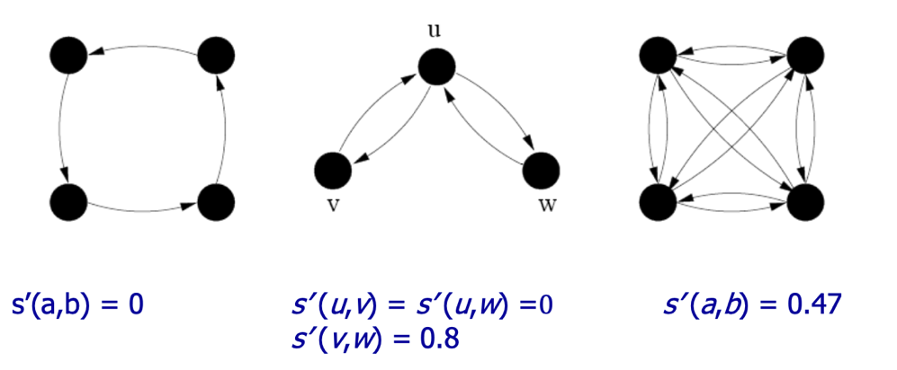

**Constraint-Based Frequent Pattern Mining**

Finding all the patterns in a database autonomously is unrealistic!

The patterns could be too many but not focused!

Data mining should be an interactive process. User directs what to be mined using a data mining query language (or a graphical user interface).

In constraint-based mining we provide constraints on what to be mined (user flexibility) and explores such constraints for efficient mining (pptimization).

Note: still find all the answers satisfying constraints, not finding some answers in "heuristic search"

Constraints in data Mining:

-   Knowledge type constraint: classification, association, etc.

-   Data constraint --- using SQL-like queries: find product pairs sold together in stores in Chicago this year

-   Dimension/level constraint - in relevance to region, price, brand, customer category

-   Rule (or pattern) constraint: small sales (price \< \$10) triggers big sales (sum \> \$200)

-   Interestingness constraint: strong rules: min\_support \>= 3%, min\_confidence \>= 60%, what we used with association rules

**Meta-Rule Guided Mining**

In applying constraints we can exploit metarules.

A metarule forms a hypothesis regarding the relationships that the user is interested in probing or confirming.

Meta-rule can be in the rule form with partially instantiated predicates and constants 

P1(X, Y) \^ P2(X, W) =\> buys(X, "iPad")

We are interested in determining which type of customer buys iPad.

The resulting rule derived can be age(X, "15-25") \^ profession(X, "student") =\> buys(X, "iPad")

Fixing the metarule we are looking for association rules with two predicates in the left side and one in the right side with predicate buys and what to buy.

In general, it can be in the form of P1 \^ P2 \^ \... \^ Pl =\> Q1 \^ Q2 \^ \... \^ Qr

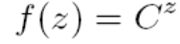Dimension/level constraints and interestingness constraints can be applied after mining to filter out discovered rules, although it is generally more efficient and less expensive to use them during mining to help prune the search space.

We can use them to improve the performance of our analysis.

How can we use rule constraints to prune the search space? More specifically, what kind of rule constraints can be 'pushed' deep into the mining process and still ensure the completeness of the answer returned for a mining query?

We can work in two directions:

-   Pruning pattern search space

The former checks candidate patterns and decides whether a pattern can be pruned using the constraints.

-   Pruning data search space: checks the data set to determine whether the particular data piece will be able to contribute to the subsequent generation of satisfiable patterns (for a particular pattern) in the remaining mining process. We just elaborate data to understand if a data piece contributes to the satisfiable generation.

Pattern space pruning constraints has 4 types:

-   Anti-monotonic: If constraint c is violated, its further mining can be terminated

-   Monotonic: If c is satisfied, no need to check c again

-   Succinct: c must be satisfied, so one can start with the data sets satisfying c

-   Convertible: c is not monotonic nor anti-monotonic, but it can be converted into it if items in the transaction can be properly ordered

Allow us to prune directly eliminate candidate itemset because we are sure that these cannot be satisfied using constraints.

Dataspace pruning constraints:

-   Data succinct: Data space can be pruned at the initial pattern mining process

-   Data anti-monotonic: If a transaction t does not satisfy c, t can be pruned from its further mining

These constraints allow us to reduce the number of transactions.

The idea is to exploit constraints to reduce computational time.

We have constraints on the pattern space and on the data space.

**Pattern Space Pruning with Anti-Monotonicity Constraints**

A constraint C is anti-monotone if the super pattern satisfies C, all of its sub-patterns do so too.

In other words, anti-monotonicity: If an itemset S violates the constraint, so does any of its superset.

Ex. 1. sum(I.price) \<= v is anti-monotone, because adding other elements we cannot reduce the sum

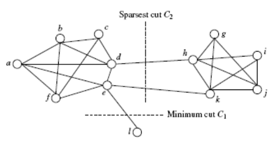Ex. 2. range(I.profit) \<= 15 is anti-monotone, considering in the itemset items in which the range is higher we cannot reduce the range adding items in the itermset.

Itemset ab violates C, the range is 40 and violates the constraint on the range. So does every superset of ab.

Ex. 3. sum(I.price) \>= v is not anti-monotone, because we can have other items and the sum increases but the constraint is satisfied in any case

Ex. 4. support count is anti-monotone: this is the core property used in Apriori.

Another approach we can adopt, is to use the apriori algorithm to generate all possible frequent patterns and them impose the satisfaction of constraints.

This imply that we need time to generate a very high number of patterns and then reduce this number imposing satisfaction of constraints.

With the reasoning we've seen we avoid to generate patterns not able to satisfy constraints, we reduce the computational time.

**Pattern Space Pruning with Monotonicity Constraints**

A constraint C is monotone if the pattern satisfies C, we do not need to check C in subsequent mining.

Alternatively, monotonicity: If an itemset S satisfies the constraint, so does any of its superset.

If we are sure a constraint is satisfied we cannot avoid to verify the verification for super-itemsets.Ex. 1. sum(I.Price) \<= v is monotone If we add other items I can only increase the sum and not decrease, increasing the number of items we enforce the satisfaction.

 Ex. 2. min(I.Price) \<= v is monotone

If the min is lower a threshold, if we add another element the min can decrease but not increase.

Ex. 3. C: range(I.profit) \>= 15.

Itemset ab satisfies C.

So does every superset of ab.

**Pattern Space Pruning with Succinctness**

 We can enumerate all and only those sets that are guaranteed to satisfy the constraint. That is, if a rule constraint is succinct, we can directly generate precisely the sets that satisfy it, even before support counting begins.

the idea is to have possible constraints that allow us to enumerate only sets that are able to satisfy the constraints.

This avoids the substantial overhead of the generate-and- test paradigm (constraints are precounting prunable).

min(I.Price) \>= v is succinct

sum(I.Price) \>= v is not succinct

because we can explicitly and precisely generate all the itemsets that satisfy the constraint (there exists a precise formula, we do not need check the rule constraint).

We can directly enumerate items with property price that can be used in the itemset. All items lower than v cannot be used to satisfy that constraint.

Given A1, the set of items satisfying a succinctness constraint C, then any set I satisfying C is based on A1 , i.e., I contains a subset belonging to A1.

Idea: Without looking at the transaction database, whether an itemset I satisfies constraint C can be determined based on the selection of items.

Optimization: If C is succinct, C is pre-counting pushable

Example of the Apriori Algorithm:


In front of constraints, we use the Naive Algorithm: Apriori + Constraint:

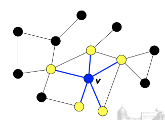

We have the possibility to verify that for an itemset this is not verified.

We reduce the computational time terminating the execution of Apriori algorithm than usual.

The same using succinct.


We can use convertible constraint.

**Convertible Constraints: Ordering Data in Transactions**

The idea is to convert tough constraints into anti- monotone or monotone by properly ordering items.

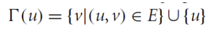Examine C: avg(S.profit) \>= 2

Order items in value-descending order \<a, f, g, d, b, h, c, e\>

If an itemset afb violates C, so does also afbh, afb\*.

In this case we can transform that constraint into an anti-monotone or anti-monotone constraint.

In our case, it becomes anti-monotone!

If afb violates the constraint we can add other items in the lower position and what we can obtain is that this average decreases more, so this constraint is not anti-monotone in origin but if we order items in respect to the property we are testing we can transform it in an anti-monotone constraint.

avg(X) \>= 25 is convertible anti-monotone w.r.t. item value descending order R: \<a, f, g, d, b, h, c, e\>

If an itemset af violates a constraint C, so does every itemset with af as prefix, such as afd.

When we add items, the average decreases because we sorted items in decreasing order with respect to the problem we are testing.

avg(X) \>= 25 is convertible monotone w.r.t. item value ascending order R\^-1: \<e, c, h, b, d, g, f, a\>

If an itemset d satisfies a constraint C, so does itemsets df and dfa, which having d as a prefix. We are using values ascending so values increase. Higher values allow us to satisfy more the constraint we have. Thus, avg(X) \>= 25 is strongly convertible.

Can Apriori Handle Convertible Constraints?

A convertible, not monotone nor anti-monotone nor succinct constraint cannot be pushed deep into the an Apriori mining algorithm.

Within the level wise framework, no direct pruning based on the constraint can be made.

Itemset df violates constraint C: avg(X) \>= 25

Since adf satisfies C, Apriori needs df to assemble adf, df cannot be pruned

But it can be pushed into frequent-pattern growth framework!


C: avg(X) \>= 25, min\_sup=2 are the constraints we want to satisfy.

We list items in every transaction in value descending order R: \<a, f, g, d, b, h, c, e\>

C is convertible anti-monotone w.r.t. R

We scan TDB once, remove infrequent items.

Item h is dropped.

Itemsets a and f are good, because they are frequent.

Projection-based mining:

We project our dataset and imposing an appropriate order on item projection

Many tough constraints can be converted into (anti)-monotone 

Different constraints may require different or even conflicting item-ordering

If there exists an order R s.t. both C1 and C2 are convertible w.r.t. R, then there is no conflict between the two convertible constraints

If there exists conflict on order of items, we try to satisfy one constraint first and then using the order for the other constraint try to mine frequent itemsets in the corresponding projected database.

What Constraints Are Convertible?


If one constraint is convertible anti-monotone and monotone, it is defined as strongly convertible.

**Data Space Pruning with Data Anti-monotonicity**

A constraint c is data anti-monotone if for a pattern p which cannot be satisfied by a transaction t under c, p's superset cannot be satisfied by t under c either.

This means that we can avoid to consider t for verifying the pattern, the superset of p.

The key for data anti-motone is recursive data reduction.


Ex. 1 sum(I.Price) \>= v is data anti-monotone

Ex. 2. min(I.Price) \<= v is data anti-monotone

Ex. 3. C: range(I.profit) \>= 25 is data anti-monotone

If we have Itemset {b, c}'s projected DB,

If we have transactionT10': {d, f, h}, when we project along along {b,c}, the other part of the transaction we have available {d, f, h}.

If we consider the constraint C it cannot be satisgfied by T10'.

The profit for d is -15, for f is -10 and for h is -5.

But the range of b and c is already 20.

If I include d,f and h, this range cannot be increases.

Since C cannot be satisfied by T10', T10' can be pruned.

T20': {d, f, g, h}, T30': {d, f, g}

...

This means that I can just prune T10' because cannot let us to satisfy constraints.

We reduce the transactions I have just to analyze for verifying if the items can be frequent.

We reduce the number of transactions we observe for verifying the frequency in the itemset.

We determine it considering if the transaction can help us to satisfy constrains.


I cannot perform data space pruning at the beginning, but we have to perform during the execution of apriori algorithm. We can eliminate items because not frequent.

This is a list of constraint-based mining:

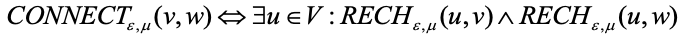

A classification of constraints:


**Mining High-Dimensional Data and Colossal Patterns**

We have many algorithms, but can we mine large (i.e., colossal) patterns? ― such as just size around 50 to 100? Unfortunately, not!

Why not? ― the curse of "downward closure" of frequent patterns is the problem.

1.  The "downward closure" property is the following:

    Any sub-pattern of a frequent pattern is frequent.

    We have to generate all possible subpatterns to generate the colossal pattern.

Example. If (a1, a2, \..., a100) is frequent, then a1, a2, \..., a100, (a1, a2), (a1, a3), \..., (a1, a100), (a1, a2, a3), \... must all be frequent! There are about 2\^100 such frequent itemsets!

No matter using breadth-first search (e.g., Apriori) or depth-first search (FPgrowth), we have to examine so many patterns.

Thus, the downward closure property leads to explosion!


Closed/maximal patterns may partially alleviate the problem but not really solve it: We often need to mine scattered large patterns!

Let the minimum support threshold σ= 20


If we want only to represent the output in any case, we have an explotion of possible output, all possible combination are frequent pattern.

Also, if we have a limited number of transactions, if we have an high number of items and they can generate a lot of frequent itemsets if we provide only closed patterns we have in any case an explotion of closed patterns.

It is often the case that only a small number of patterns are colossal, i.e., of large size.

Colossal patterns are usually attached with greater importance than those of small pattern sizes.


We have no hope for completeness.

If the mining of mid-sized patterns is explosive in size, there is no hope to find colossal patterns efficiently by insisting "complete set" mining philosophy,

It's almost impossible to generate all possible pattern to arrive to generate a colossal pattern.

Jumping out of the swamp of the mid-sized results

What we may develop is a philosophy that may jump out of the swamp of mid-sized results that are explosive in size and jump to reach colossal patterns directly.

We can try to avoid the overall generation of min-size patterns and combine them to jump forward the colossal pattern.

Striving for mining almost complete colossal patterns

The key is to develop a mechanism that may quickly reach colossal patterns and discover most of them.

The risk is that we cannot find them all, we must find a trade-off between computation and optimal results.


Let the min-support threshold σ= 20. Then there are  closed/maximal frequent patterns of size 20

However, there is only one with size greater than 20, (it is the colossal): It is α= {41,42,\...,79} of size 39.

The existing fastest mining algorithms (e.g., FPClose, LCM) fail to complete running, they have to generate all possible pattern to generate the colossal one.

The algorithm we analyze now outputs this colossal pattern in seconds, but this does not guarantee to generate all possible colossal patterns, but we will have a good subset.

**Pattern-Fusion Strategy**

It cannot guarantee to mine them all but can guarantee an approximation with reasonable time.

Pattern-Fusion traverses the tree in a bounded-breadth way.

Always pushes down a frontier of a bounded-size candidate pool.

Only a fixed number of patterns in the current candidate pool will be used as the starting nodes to go down in the pattern tree ― thus avoids the exponential search space. We traverse the tree in such a way to generate only pattern with high elements that allow us to go towards colossal patterns.

Pattern-Fusion identifies "shortcuts" whenever possible.

Pattern growth is not performed by single-item addition but by leaps and bounded: agglomeration of multiple patterns in the pool.

We don't add one item each item, but we combine itemsets using shortcuts to produce the colossal itemsets.

These shortcuts will direct the search down the tree much more rapidly towards the colossal patterns.


We have to understand how to combine them correctly to go towards colossal patterns.


When we eliminate items in the colossal pattern we can assume the support of the subitemset we created is very close to the support of the colossal pattern.

Subpatterns α1 to αk cluster tightly around the colossal pattern α by sharing a similar support. We call such subpatterns core patterns of α.

We go towards the subpatterns of the colossal pattern with support similar to the colossal pattern.

**Core Patterns**

Intuitively, for a frequent pattern α, a subpattern β is a τ-core pattern of α if β shares a similar support set with α, i.e.,

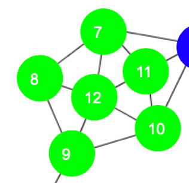

where \|Dα\| is the number of patterns containing α and τ is called the core ratio

alpha is a superpattern of beta.

The number of pattern containing beta is higher than the one containing alpha, because alpha is a superpattern of beta.

We have to fix tau to define them.

**Robustness of Colossal Patterns**

A colossal pattern is robust in the sense that it tends to have much more core patterns than small patterns.

**(d,τ)-robustness**

A pattern α is (d, τ)-robust if d is the maximum number of items that can be removed from α for the resulting pattern to remain a τ-core pattern of α.

For a (d,τ)-robust pattern α, it has

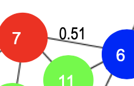(2\^d) core patterns

Colossal patterns tend to have a large number of core patterns

Pattern distance: For patterns α and β, the pattern distance of α and β is defined to be

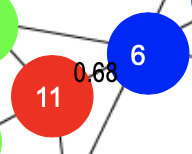

 If two patterns α and β are both core patterns of a same pattern, they would be bounded by a "ball" of a radius specified by their core ratio τ


The distance between alpha and beta will be lower than that.

Once we identify one core pattern, we will be able to find all the other core patterns by a bounding ball of radius r(τ).

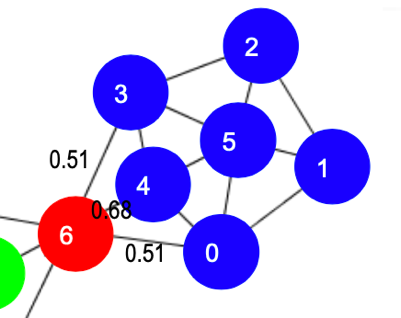


The last thing is quite natural because to achieve these patterns we have to achieve an high number of core patterns.

A colossal pattern has far more core patterns than a small-sized pattern.

A colossal pattern has far more core descendants of a smaller size c.

A random draw from a complete set of pattern of size c would more likely to pick a core descendant of a colossal pattern

A colossal pattern can be generated by merging a set of core patterns 

Due to their robustness, colossal patterns correspond to dense balls

A random draw in the pattern space will hit somewhere in the ball with high probability


In the previous example, the probability of drawing a descendant of abcef is 0.9.

We have an high number of possible sub-items of the larger itemset,

The idea of Pattern-Fusion Algorithm is the following.

-   Generate a complete set of frequent patterns up to a small size, and from this apply an algorithm like apriori.

-   Randomly pick a pattern β, and β has a high probability to be a core-descendant of some colossal pattern α

-   Identify all α's descendants in this complete set, and merge all of them ― This would generate a much larger core-descendant of α

-   In the same fashion, we select K patterns. This set of larger core-descendants will be the candidate pool for the next iteration 

Initialization (Initial pool): Use an existing algorithm to mine all frequent patterns up to a small size, e.g., 3 (for example with the apriori algorithm)

Then, perform a certain number of iterations (Iterative Pattern Fusion):

-   At each iteration, K seed patterns are randomly picked from the current pattern pool

-   For each seed pattern thus picked, we find all the patterns within a bounding ball centered at the seed pattern

-   All these patterns found are fused together to generate a set of super-patterns. All the super-patterns thus generated form a new pool for the next iteration

Termination: when the current pool contains no more than K patterns at the beginning of an iteration


We start with the set of patterns empty.


We aggregate in (9) what we found in the core list.

When the number of such beta exceeds a threshold, which is determined by the system, we resort to a sampling technique to decide the set of beta to retain, reducing computational effort.

This is a bounded-breadth pattern tree traversal.

It avoids explosion in mining mid-sized ones, because randomness comes to help to stay on the right path.

We provide the ability to identify "short-cuts" and take "leaps".

We fuse small patterns together in one step to generate new patterns of significant sizes We reach efficient solution but no one guarantee we will find all possible colossal patterns.

The larger the pattern, the greater the chance it will be generated, because very large pattern have a very large number of subitemsets, so we have an high probability to pickup them.

The more distinct the pattern, the greater the chance it will be generated.

We have to identify how much we are close to the real solution and if we can save time.

With the increase of the size of the metric, the Pattern Fusion approach maintain approximately the same computational time.  

The approximation error of Pattern-Fusion is rather close to uniform sampling (which randomly picks K patterns from the complete answer set).

It can discover almost all real colossal patterns and the computational time is almost constant with the increasing of the minimum support threshold.Of course, it produces an approximation but it's a really good one.

**Mining Compressed or Approximate Patterns**

When we return patterns we can reduce closed patterns but sometimes they are very high.

We can compress patterns.

We introduce the pattern distance measure:

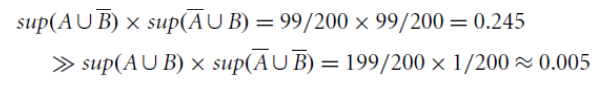

δ-clustering is used to do that. We have that for each pattern P, find all patterns S which can be expressed by(that is, O(S) ⊂ O(P)) and their distance to P are within δ (δ-cover).

All patterns in the cluster can be represented by P


Returning closed frequent pattern, we have to report P1, P2, P3, P4, P5 because support is different. This definition has no kind of compression.

Max-pattern, returns P3 but we have info loss. We lose information about the support of subpatterns.

A desirable output is P2, P3, P4 because if we consider P2 and P1, P2 is a super-itemset and the support is comparable,

The distance we saw is very low.

We decided to compress the output by giving in output just itemsets that contains other itemsets and approximately have similar supports.

Mining the top-k most frequent patterns is a strategy for reducing the number of patterns returned during mining.

However, in many cases, frequent patterns are not mutually independent but often clustered in small regions.

This is somewhat like finding 20 population centers in the world, which may result in cities clustered in a small number of countries rather than evenly distributed across the globe.

Why this observation? Why redundancy-aware top-k patterns?

Desired patterns must be characterized by high significance & low redundancy.

We propose to exploit the MMS (Maximal Marginal Significance) for measuring the combined significance of a pattern set.


The significance of (a) is represented by white-black colors.

Not considering redundancy and just significancy we just pick-up itemsets with highest significancy.

A significance measure S is a function mapping a pattern p ∈ P to a real value such that S(p) is the degree of interestingness (or usefulness) of the pattern p.

Objective measures depend only on the structure of the given pattern and the underlying data used in the discovery process.

Subjective measures are based on user beliefs in the data.

They therefore depend on the users who examine the patterns.

Redundancy R between two patterns p and q is defined as

R(p,q) = S(p)+S(q)-S(p,q)

The ideal redundancy measure R(p,q) is usually hard to obtain. However, we can approximate redundancy using distance between patterns.

The problem of finding redundancy-aware top-k patterns can thus be transformed into finding a k-pattern set that maximizes the marginal significance, which is a well studied problem in information retrieval.

A document has high marginal relevance if it is both relevant to the query and contains minimal marginal similarity to previously selected documents, where the marginal similarity is computed by choosing the most relevant selected document.

We want to select significant itemsets but not redundant with other itemsets we are giving in output.# Sequential Pattern Mining

Frequent pattern mining use itemsets and we don't have any order in items. We would like to investigate now sequences.

__Sequential pattern mining__ discovers frequent subsequences as patterns in a sequence database.

A sequence database stores a number of records, where __all records are sequences of ordered events__, with or without concrete notions of time.

An example sequence database is retail customer transactions or purchase sequences in a grocery store showing, for each customer, the collection of store items they purchased every week for one month but not in the single time, where the order of items bought at once is not useful.

Records are stored as follows:

\[Transaction/Customer ID, \<Ordered Sequence Events\>\]

Examples:

\[T1, \<(bread, milk), (bread, milk, sugar), (milk), (tea, sugar)\>\];

\[T2, \<(bread), (sugar, tea)\>\] Each element in a sequence is an itemset.

__Web Usage Mining__ is an application of sequential pattern mining.

Finding user navigational patterns on the world wide web by extracting knowledge from web logs.

Ordered sequences of events are composed of single items and not sets of items, with the assumption that a web user can physically access only one web page at any given point in time.

Our sequence is a sequence of visits in the single page.

Given a set of events E = {a, b, c, d, e, f}, a web access sequence database for four users may have four records:

\[T1, \<abdac\>\]; 

\[T2, \<eaebcac\>\]; 

\[T3, \<babfaec\>\]; 

\[T4, \<abfac\>\].

A web log pattern mining can find a frequent sequence, abac, indicating that over 90% of users who visit product a's web page also immediately visit product b's web page.

## Web Usage Mining

How can we collect this web log? On the __server-side__, __client-side__ or on a __proxy server__?

-   __Server-side__: reflects the access of a web site by multiple users, is good for mining multiple users' behavior and web recommender systems. But as cons, server logs may not be entirely reliable due to caching, as cached page views are not recorded in a server log. In fact, we have the local cache and the cache on proxy before reaching the server.

-   __Client-side__: requires that a remote agent be implemented or a modified browser be used to collect single-user data in the client, thus eliminating caching and session identification problems, and is useful for web content personalization applications. This cannot be easy and some users can avoid to have this agent.

-   __Proxy server__: reveal the actual HTTP requests from multiple clients to multiple web servers, thus characterizing the browsing behavior of a group of anonymous users sharing a common server.

Data Format of the Log:

137.207.76.120 - \[30/Aug/2009:12:03:24 -0500\] "GET /jdk1.3/docs/relnotes/deprecatedlist.html HTTP/1.0" 200 2781.

Other techniques such as __cookie and sniffer__ may be needed to have a complete analysis.

In most cases, researchers assume that user web visit information is completely recorded in the web server log, which is preprocessed to obtain the transaction database to be mined for sequences.

Let's see it now from a formal point of view.

## Sequential Pattern Mining

An __itemset__ is a set drawn from items in I, and denoted ($i_1$, $i_2$, ... , $i_k$), where $i_j$ is an item or event.

### Problem definition:

__Given__

-   A set of sequential records (called __sequences__) representing a sequential database D

-   A minimum support threshold called __min\_sup__

-   A set of k unique items or events __I={$i_1$,$i_2$, ... , $i_k$}__

We aim to __find__ the set of all frequent sequences S in the given sequence database D of items I at the given min\_sup.

### __Lexicographic Order__ 

A __sequence S__ is denoted as a sequence of elements \<$e_1$,$e_2$,$e_3$, ... , $e_q$\>, where the sequence element $e_j$ is an itemset (e.g., (be) in \<a(be)c(ad)\>, but also (aec) can be, just because it's a part of unique transaction) that __might contain only one item__ (which is also referred to as 1-itemset).

A sequence element is a lexicographically ordered list of items.

Assume an itemset t of distinct items $t = \{i_1, i_2, ... , i_k\}$, and another itemset of distinct items also $t' = \{ j_1, j_2, ... , j_l\}$, where $i_1 \le i_2 \le ··· \le i_k$ and $j_1 \le j_2 \le ··· \le j_l$, such that $\le$ indicates "occurs before" relationship.

Then, for itemsets, $t < t'$ (t is lexicographically less than $t$) if and only if either of the following is true:

1.  for some integer $h$, $0 \le h \le \min\{k, l\}$, we have $i_r = j_r$ for $r < h$, and $i_h < j_h$, or

2. $k < l$, and $i_1 = j_1$, $i_2 = j_2, ... , i_k = j_k$.

Example (1): (abc) \< (abec), because c preceds e, and (af) \< (bf), because a preceds b

Example (2): (ab) \< (abc), because the itemset is longer

#### __Sequences__

A sequence with k elements is called a k-sequence. An item can occur only once in an itemset, but it can occur several times in different itemsets of a sequence.

A sequence $\alpha = < e_{i_1},e_{i_2},e_{i_3}, ... , e_{i_m} >$ is a __subsequence of another sequence__ $\beta = < e_{i_1},e_{i_2},e_{i_3}, ... , e_{i_n} >$, denoted $\alpha \preceq \beta$, if there exist integers $i_1 < i_2 < ... < i_m$ and all events $e_{i_j} \in \alpha$ and $e_i \in \beta$ and $i_1 \ge 1$ and $i_m \le n$, such that $e_{i_j} \subseteq e_i$.

This definition of inclusion is the one we saw for itemsets.

A sequential pattern is maximal if it is not a subsequence of any other sequential pattern.

Example of sequence:


In the sequence database we have 5 sequences, we can interpret them in a way that items in pharentesis are items in itemsets.

If we search for (ae) in the sequence, we need to find an element with a and e inside, together.

The support threshold is the number of sequence in which the subsequence is present.

The problem is complex, we need to use specific algorithms to reduce the computational effort.

#### __Sequence lexicographical ordering__

Assume a lexicographical order $\le$ of items I in the sequential access database, denoted $\le I$.

If an item $i$ occurs before an item $j$, it is denoted $i \le I j$; this order is also extended to sequences and subsequences by defining $S_a \le S_b$ if $S_a$ is a subsequence of $S_b$.

Consider all sequences arranged in a sequence tree T (referred to as a Lexicographical Tree).

-   __The root of the tree is labeled as an empty set {}__.

-   Recursively, if $n$ is a node in the tree T, then $n$'s children are all nodes $n'$ such that $n \le n'$ and $\forall m \in T: n' \le m$ if n ≤ m. Each sequence in the tree can be extended by adding a 1-sequence to its (sequence-extended sequence) end or adding an itemset to its end (itemset-extended sequence), which is not applicable to the case of web log mining.


We start with the root, and starting from the lexicographic order of items we can generate all possible lexicographic ordered sequences.

We should generate all possible sequences, and this is hard to manage.

We have just to impose some threshold for frequency or support of a sequence.

#### __Support of a Sequence__

The __frequency__ or __support__ of a sequence (or subsequence) S, denoted $\sigma(S)$ is the total number of sequences of which S is a subsequence divided by the total number of sequences in the database D, whereas the absolute support (or support count) of a sequence (or subsequence) S is the total number of sequences in D of which S is a subsequence.

A sequence is called __frequent__ if its frequency is not less than a __user-specified threshold__, called __minimum support__ denoted min sup or the greek letter $\xi$. 

A frequent sequence $S_\alpha$ is called a __frequent closed sequence__ if there exists no proper supersequence of $S_\alpha$ with the same support, that is, $S_\beta$ such that $S_\alpha \preceq S_\beta$ and $\sigma(S_\alpha) = \sigma(S_\beta)$ (same support); otherwise it is said that sequence $S_\alpha$ is absorbed by $S_\beta$.

In math language this is the definition: $S_\alpha$ is a frequent closed sequence if
$$
    \nexists S_\beta: S_\alpha \preceq S_\beta \land \sigma(S_\alpha) = \sigma(S_\beta)
$$

Assume the frequent sequence $S_\beta = < beadc >$ is the only superset of the frequent sequence $S_\alpha = < bea >$, if $\sigma(S_\alpha) = \sigma(S_\beta)$, then $S_\alpha$ is not a frequent closed sequence; on the other hand, if $\sigma(S_\alpha) > \sigma(S_\beta)$, then $S_\alpha$ is a frequent closed sequence. Notice that $\sigma(S_\beta)$ cannot be greater than $\sigma(S_\alpha)$, because $S_\alpha \preceq S_\beta$ (is a subsequence of).

Let's see an example.


Let's assume that we have this supermarket, and we want to investigate if we have frequent subsequences.

Note: Use Minsup of 25%

{{30}, {90}} is a frequent sequence because present in 1 and 4. It's also maximal because we don't have supersequences of these sequences. We need to verify if exists supersequences also with lower support.

{(10 20) (30)} does not have minsup (because is only supported by Customer 2)

{(30)}, {(70)}, {(30) (40)} ... are frequent sequences but not maximal.

For {{30}} we have both {{30}{90}} and {{30}{40 70}} as supersequences.

## __The Algorithms__

The problem of frequent sequences mining is approached using algorithms that typically exploits these phases:

-   __Sort Phase__

-   __Litemset Phase__

-   __Transformation Phase__

-   __Sequence Phase__

-   __Maximal Phase__

### __Sort Phase__

We __sort the database__ using the customer ID as the major key. We do it in respect of the time, so using transaction-Time as the minor key.

__Converts the original transaction database into a database of customer sequences__


We need this form to produce the sequence corresponding to the customer.

### __Litemset (Large Itemset) Phase__

We count how many itemsets are large, supported by fraction of customers larger than minsup.

If we don't have frequent itemsets we can't have frequent sequences, so we start from frequent itemsets.

We determine the large itemsets where large means __support $\ge$ minsup__.

__Recall__: each itemset in a large sequence has to be a large itemset

__Support counting__ measures the fraction of customers purchasing items in the itemset.


Each large itemset is then mapped to a set of __contiguous integers__

Transformation used to compare large itemsets in constant time and reduce the time required to check if a sequence is contained in a customer sequence.

This is a mapping to speed-up the computation.

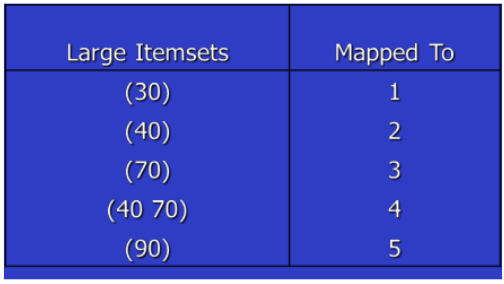

We can realize that some itemsets are not frequent in our example database.

{30} is frequent because appears in different sequences, same for {90}. {10} is not because appears only in that sequence.

In any case it depends on the threshold we choose.

Only considering the large itemsets we reduce the complexity of our problem.

We replace itemsets and we can have one-itemsets but also sets with more items.

We replace them with an integer number, to reduce the time to check if a sequence is contained in a customer sequence.

We have to __eliminate non-large itemsets__ and __replace them with integer numbers__.

### __Transformation Phase__

Need to repeatedly determine __which of a given set of large sequences are contained in a customer sequence__. To make this fast:

-   Replace each transaction with all litemsets contained in the transaction.

-   Transactions with no litemsets are dropped. (still considered for support counts).


The original customer sequence is transformed in the costumer sequence in the second column (eliminating not frequent items and transforming), and after mapping on the sequence on the third column.

Note: (10 20) dropped because of lack of support.

While (40 60 70) is replaced with set of litemsets {(40),(70),(40 70)} (60 does not have min-sup). We can just pickup one of these items and each can be part of the subsequence.

We extracted the database of sequences and we preprocessed it to eliminate not frequent itemsets and cannot generate frequent sequences. We performed those mapping to speed-up the computation.

### __Sequence Phase__

Now, we use the set of large itemsets to __find the desired sequences__.The algorithms we exploit has a similar structure to __Apriori algorithms__ used to find large itemsets.

-   Use seed set to generate candidate sequences.

-   Count support for each candidate.

-   Eliminate candidate sequences which are not large.

#### __Two families__ of algorithms:

-   __Count-all__: count all large sequences including non-maximal sequences (it is careful with respect to the minimum support). This algorithm is _AprioriAll_.

-   __Count-some__: try to avoid counting non-maximal sequences by counting longer sequences first (it is careful with respect to maximality). These algorithms are _AprioriSome_ and _DynamicSome_.

### __Maximal Phase__

Independently of the algorithm we use, to __find maximal sequences__ among large sequences.

Given:

-   __k-sequence__: sequence of length

-   __S__ set of all large sequences

> for ($k=n$; $k>1$; $k--$) do
>
>> foreach k-sequence $s_k$ do
>>
>>> delete from S all subsequences of $s_k$

__We remove all subsequences of a maximal sequence__.

This phase is performed to find maximal sequences.

Data-structures and an algorithm exist to do this efficiently. (_hash trees_)

## __AprioriAll__ (Count-All)

This is based on the same idea of the one saw in frequent pattern analysis.

We start from the large itemsets determined in previous phases.

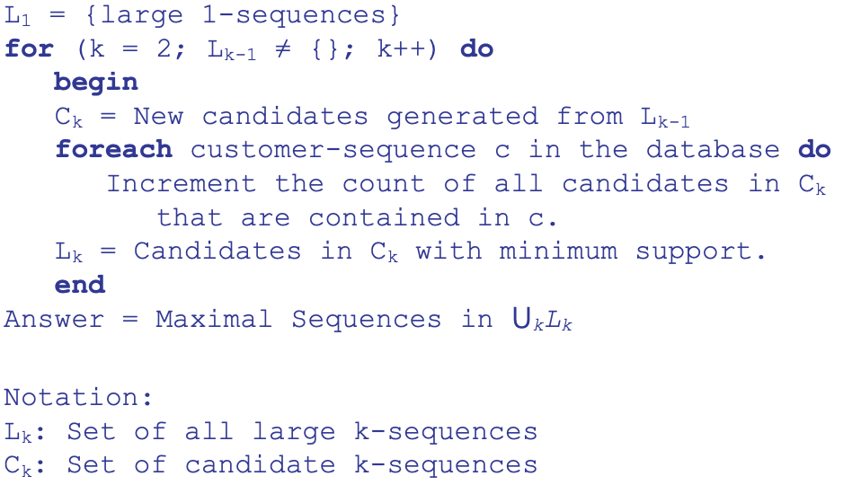

Similiar to apriori algorithm but here we talk about sequences.

The generation of candidates $C_k$ is performed as follows:

-   __Step 1__: Join two sequences in $L_{k-1}$ to generate $C_k$

    For each two sequences in $L_{k-1}$ that have the same from the 1<sup>st</sup> to k-2th itemsets, select the 1 to k-1 itemset from the first sequence, and join with the last itemset from another sequence.

    Example 
    
    $L_3$ = {123}{234}{124}{134}{135}
    
    $C_4$ = {1 2 3 4} {1 3 4 5}{1 3 5 4} {1 2 4 3} (we also have to add the viceversa because the order here is important)

-   __Step 2__: Delete all sequences in $C_k$ if some of their sub-sequences are not in $L_{k-1}

    Example: $C_4$ = {1 2 3 4} $\rightarrow$ 1 2 3 is present, 2 3 4 is present, 1 3 4 is present so we don't eliminate this sequence.

    {1 3 4 5} $\rightarrow$ 1 3 5 is present but 1 4 5 is not present so we are sure that this sequence is not frequent for the apriori property. __We can remove this sequence__.

    {1 3 5 4} $\rightarrow$ can be remove because 3 5 4 is not present

    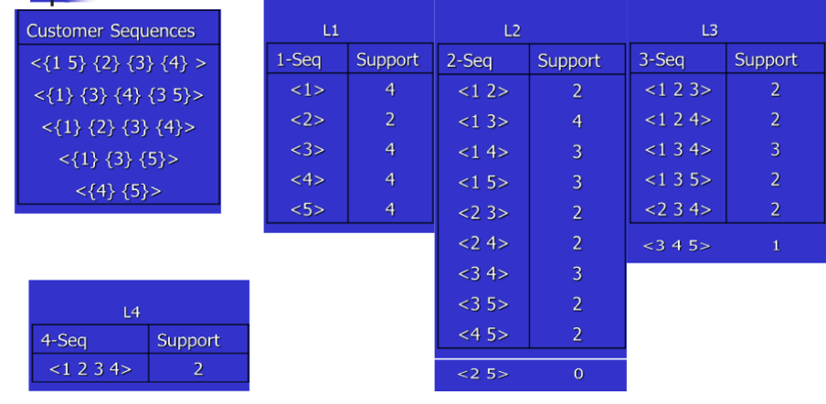

We have all possible sequences minable from the customer sequences using the three phases seen before.

We start from transactions, build the customer sequences using the customer index and then verify how many large itemsets we have.

If we set minsup = 2, they are all frequent.

Then we test $L_2$. The candidates are <1 2> but also <2 1>, and so on.

Then we apply the join between all posssible pairs to generate all possible $L_3$.

Then we use them to generate $L_4$, and we check if they're frequent.

We obtain that the ony $L_4$ frequent sequence is <1 2 3 4>.

But we are interested in all maximum sequences, we start from <1 2 3 4> and we delete all $L_3$ sequences contained in <1 2 3 4>.

We don't delete <1 3 5> because not contained in it.

Now we verify the $L_2$ and so on.

Applying the 3rd phase of the 5 phases, this is our answer.

Answer: __<1 2 3 4>, <1 3 5>, <4 5>__

The problem of this algorithm is similar to the one of the Apriori algorithm, the generation of a very high number of candidates, and then we remove them using the Apriori property or counting the support.

## __AprioriSome__

We have an high number of non maximum sequences generated, that prevents us to count the support scanning the dataset.

We have __AprioriSome__ that tries to avoid counting non-maximal sequences by counting longer sequences first.

__2 phases__:

-   __Forward Phase__ $\rightarrow$ find all large sequences of certain lengths.

-   __Backward Phase__ $\rightarrow$ find all remaining large sequences. For example, we might count sequences of length 1, 2, 4 and 6 in the forward phase and count sequences of length 3 and 5 in the backward phase, we jump sequences 3 and 45

We jump from a __k__-sequence to a __k+n__-sequence.

During the backward phase in fact we just find all remaining large sequences.

We determine which lengths to count using __next()__ function. next() takes in as a parameter the length of the sequence counted in the last pass.

_next(k) = k + 1_ (Same as AprioriAll)

We can improve increasing the value to add, not 1 but an higher one.

__Balances tradeoff__ between:

-   Counting non-maximal sequences

-   Counting extensions of small candidate sequences 


$$
    hit_k = \dfrac{|Lk|}{|Ck|}
$$

Intuition: As $hit_k$ increases, the time wasted by counting extensions of small candidates decreases.

If $hit_k$ is high, most of the candidates we generated are frequent, so we jump in the increase of the number of itemsets in the sequence.

We have an high probability that this candidate sequences are frequents, we jump and just apply the backward.

### __Forward Phase__


$L_{K-1}$ known means that we generated and tested the frequent sequences at the level k-1. We use the apriori algorithm, we use directly the frequent sequences.

In the candidate generation, if the large sequence set $L_{k-1}$ is not available, we use the candidate set $C_{k-1}$ to generate $C_k$.

If k is equal to the output of the function we test.

In the forward phase we generate all k candidates, but some using k-1 frequent sequences, others by k-1 candidate sequences.


Correctness is maintained because $L_{k-1} \subseteq C_{k-1}$ .

### __Backward Phase__

We want to avoid to verify in the sequence database some candidate sequences and since we are interested in the maximum sequences, we generate them, we verify if they are frequent and delete all subsequences of these frequent sequences.

For all lengths which we skipped:

- __Delete sequences__ in candidate set which are __contained in some large sequence__.

- __Count remaining candidates__ and find all sequences with min. support.

- Also __delete large sequences__ found in forward phase __which are non-maximal__.

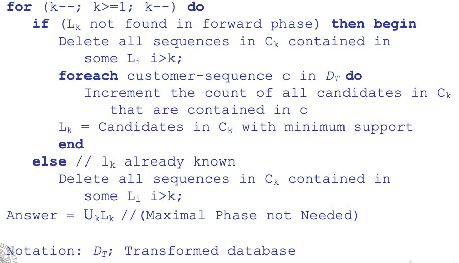

We perform the increment for the candidates remained after the deletion phase.

We are interested in maximum sequences, so we delete all subsequences.


In the forward phase we generated all candidate sequences, sometimes using frequent sequences and sometimes using candidate ones.

In any case we verify if the candidate sequences are frequent.

We start from $L_1$, generate $L_2$ and test if they are frequent.

We generate $C_3$ using $L_2$ and then we generate candidate 4 sequences using $C_3$ and checking if they're frequent.

We start the backward phase.


We start from the maximum-sequence <1 2 3 4> and delete all subsequences contained in it. We are sure they are not maximal.

Other sequences are tested checking if they are frequent.

We remove <1 2 5> and <3 4 5> because they are not frequent scanning the dataset, and we remove all 2-subsequences.

We preserve <4 5> because maximal and frequent.

We eliminate sequences to test in the database, but it doesn't help a lot because it doesn't affect very much the computational effort, even if we have to increase the counter scanning the dataset.

But the cons is that we generate more candidate sequences in any case because sometimes we exploit $C_{k-1}$ instead of $L_{k-1}$.

## __AprioriDynamicSome__

 Like AprioriSome, skip counting candidate sequences of certain lengths in the forward phase.

The candidate sequences that are counted is determined by the variable step.

### __Initialization phase__
All the candidate sequences of length up to and including step are counted.

### __Forward phase__
All sequences whose lengths are multiples of step are counted.

For example, if step = 3, we will count sequences of lengths 1, 2, and 3 in the initialization phase, and 6, 9, 12, ... in the forward phase.

__We can generate sequences of length 6 by joining sequences of length 3__. We can generate sequences of length 9 by joining sequences of length 6 with sequences of length 3, etc. However, to generate the sequences of length 3, we need sequences of lengths 1 and 2, and hence the initialization phase.

We just adopt a step = 3.

### __Backward phase__
Count sequences for the lengths we skipped over during the forward phase. However, unlike in AprioriSome, __these candidate sequences were not generated in the forward phase__.

We use the __intermediate phase__ to generate them.

For example, assume that we count $L_3$ and $L_6$, and $L_9$ turns out to be empty in the forward phase, so we have to stop there. We generate $C_7$ and $C_8$ (intermediate phase), and then count $C_8$ followed by $C_7$ after deleting non-maximal sequences (backward phase). This process is then repeated for $C_4$ and $C_5$.


We don't generate all candidates but just jump.

For each customer sequence we count the support.


We generate sequence sand verify if they are frequent.


We start from the last $k$ and generate $C_k$ after decreasing $k$ from $L_{k-1}$ if exists, otherwise from $C_{k-1} and then we apply the backward phase.

The generation from $L_k$ and Lstep for the $C_{k+step}$, we have:


If we have these sequences:


We compute the end and the start for each sequence.

We join $X_k$ with $X_j$ if $X_k.end < X_j.start$.

The result of the join with the join condition $X_2.end < X_2.start$ (where $X_2$ denotes the set of sequences of length 2) is the single sequence <1 2 3 4> .

We generate the k+step candidate sequences in this way.

### Why do we need otf-generate?

-   The _apriori-generate_ procedure used for AprioriSome __could generate more candidates__ (it however needs to be generalized to generate $C_{k+j}$ from $L_k$. Essentially, the join condition has to be changed to require equality of the first $k-j$ terms, and the concatenation of the remaining terms).

-   In addition, if the size of $|L_k| + |L_{step}|$ is less than the size of $C_{k+step}$ generated by AprioriSome, __it may be faster to find all members of $L_k$ and $L_{step}$ contained in c__ than to find all members of $C_{k+step}$ contained in c.

-   The intuition behind this generation procedure is that if $s_k \in L_k$ and $s_j \in L_j$ are both contained in c, and they don't overlap in c, then $s_k.s_j$ is a candidate $(k + j)$-sequence. 

### Execution of AprioriDynamicSome


In the __forward phase__ we directly generate $C_4$ starting from $L_2$ with step = 2. We check if they're frequent then. We start from $L_4$ to generate $C_6$ which is empty.

In the __intermediate phase__ we generate $C_3$ using $L_2$. We don't have $C_5$.

In the __backward phase__ we verify if $C_3$ is frequent, but we need only to verify the candidate sequences in $C_3$ that we don't delete considering $L_4$. We generate a lower number of candidates and reduce the check of candidate sequences.

## __Performance Comparison__

We use some datasets to evaluate performance.

We consider performances in terms of computational time, not in terms of result because they give the same maximum-sequences.

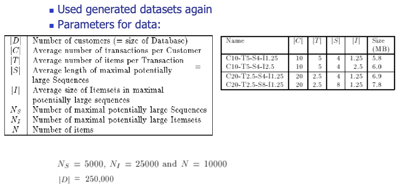

We plot what happens in terms of time using different minsup.

_DynamicSome_ generates too many candidates, therefore we cannot manage a big production of candidates.

_AprioriSome_ does a little better than _AprioriAll_, it avoids counting many non-maximal sequences, but the difference is not relevant.


Advantage of _AprioriSome_ is reduced for 2 reasons:

1. AprioriSome generates more candidates.

2. Candidates remain memory resident even if skipped over.

This is what happens with the relative time:

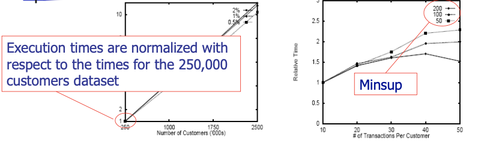

We have stability using the number of transaction per customers.

The solution proposed to reduce the number of candidates do not perform very well, we have some advantages but not that relevant.

### __Bottlenecks of Apriori-like methods__

- A huge set of candidates could be generated

- Many scans of database in mining

- Encounter difficulty when mining long sequential patterns. We have an exponential number of short candidates. A length-100 sequential pattern needs $\dfrac{|D_\alpha|}{|D_\beta|} \ge \tau$ candidates.

## __FreeSpan: FP-growth for sequential pattern mining__

The solution is to use a solution similar to __FPGrowth__.

We had a limitation of scan to the database to 2 with FPGrowth and similar here but we have to adapt it to sequences.

__Can we extend FP-growth to sequential pattern mining?__

-   A straightforward construction of sequential-pattern tree does not work well.

-   A level-by-level project does not achieve high performance either

-   An interesting method is to explore __alternative-level projection__ 

### Alternative-level Projection

The idea is to map the sequence database into projected sequence database.

We find frequent items from database and produce the list of frequent items in support descending order, and is called __f_list__.

All sequential patterns can be divided into several subsets __without overlap__.


We produce the f_list and sort the list in descending order and project the sequence database.

In particular, all sequential patterns will be divided into the 6 subsets indicated.

The complete set of sequential patterns containing item $i$ but no items following $i$ in f_list can be found in the $i$-projected database.

We project the database considering items in f-list and all sequential pattern containing this specific item $i$ can be mined from the projection of the database along the item we consider.

A sequence $s$ is projected as $s_i$ to the $i$-projected database if there is at least an item $i$ in $s$

$s_i$ is a copy of $s$ by removing from $s$ all the infrequent items and any frequent item $j$ following $i$ in f_list

Example: <(ah)(bf)abf> is projected to $f$-projected database as <a(bf)abf> because h is not frequent so is removed and the projection contains only frequent items.

And then to $a$-projected database as \<abab\>, because in the f-list we remove items with the support lowest of $a$ and $b$. And then to $b$-projected database as \<bb\>, because in the f-list we remove items with the support lowest of $b$.

When we project, we can work with parallel or partition projection.

#### __Parallel Projection__

In __parallel projection__ we scan the database once, form all projected dbs at a time. May derive many and rather large projected dbs if sequence on average contains many frequent items.

I can produce an high numer of projected ddatabases that can be crowdebd

Let each transaction contain on average $l$ frequent items. A transaction is then projected to $(l−1)$-projected database. The total size of the projected data from this transaction is $1+2+···+(l−1) = l\dfrac{(l−1)}{2}$. This implies that the total size of the single item-projected databases is about $\dfrac{(l−1)}{2}$ times of that of the original database. We have an __high memory occupation__.

We must store them because we have to work with them.

To avoid such an overhead, partition projection method is proposed.

#### __Partition Projection__

In __partition projection__ we project a sequence to the projected database of the last frequent item in it.

When scanning the database to be projected, a transaction T is projected to the $a_i$-projected database only if $a_i$ is a frequent item in T and there is no any other item after $a_i$ in the list of frequent items appearing in the transaction.

Since a transaction is projected to only one projected database at the database scan, after the scan, the database is partitioned by projection into a set of projected databases, and hence it is called partition projection.

### __Example of Database Projection__

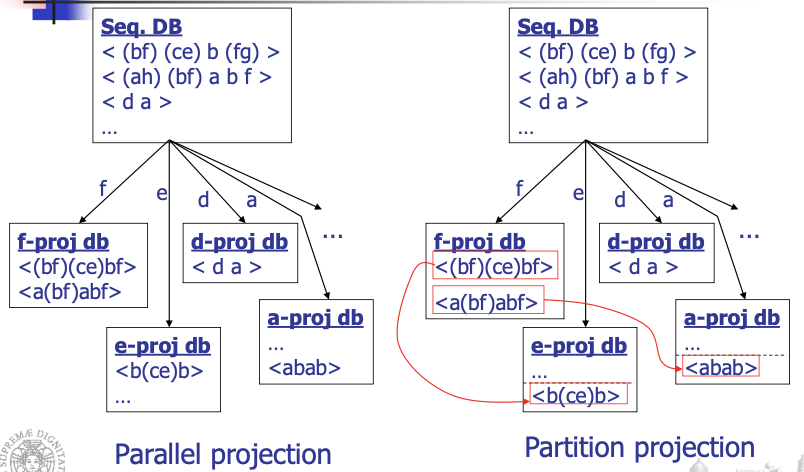

In parallel projection we scan the sequence database and produce the projection along $f,e,d,a$ just scanning the database. When we project along $e$ we consider all sequences where $e$ is present and not $f$, in $d$ where $d$ is present and $e$ and $f$ are not.

But we replicate sequences in several databases.

In partition projection approaches, we scan the database and create this projection, storing the sequence only in the projected database in which we have the frequent item $a_i$ with any item after $a_i$.

When we discover $f$ is present, we insert the sequence into the $f$-projection database but not in others.

We add this sequence also in another database, if scanning the $f$-projected database we find for example $e$ but we store if without $f$.

In this way we can save memory because we don't save all the dataset but we build the projection dynamically.

We have all same sequences of the one we have using the parallel projection.

We save memory in this way.

Each time when a projected database is being processed, to ensure the remaining projected databases obtain the complete information, each transaction in it is projected to the $a_j$-projected database, where $a_j$ is the item in the transaction such that there is no any other item after $a_j$ in the list of frequent items appearing in the transaction.

It's like to "propagate" sequences on-the-fly.

Then we can work with the projected database, and we don't need to scan all the database.

When projecting the $f$-projected DB, we find local freq. items other than $f$ and have sequential pattern of multiple $f$'s.

We scan $f$-projected db once and find sequential pattern containing {$f, b$}, because these are the frequent items that we have in the projection of the database, including multiple $f$'s.

Then we count multiple $b$'s, we perform one more scan finds sequential patterns containing two $b$'s and one $f$.


The only two sequences containing $f$ will be in the $f$-projected database.

The only frequent items we have are $b$ and $f$ and possible sequence we can generate are the ones with $b$ and $f$. We consider $b$, $f$ and their duplication.

We generate frequent sequences containing frequent items for the $f$-projected database.

The advantage is that we perform scans only on the projected databases.

### Mining by __Level by Level__ Projected Databases

#### __Algorithm__:

-   Scan database once, find frequent items and get f\_list

-   Recursively do database projection level by level

__Benefits__: __only need to find frequent items__ in each projected database, instead of exploring candidate sequence generation. We have that the number of combinations is much less than their possible combinations. __Works well in sparse databases__.

__Cost__: partition and projection of databases.

The idea is similar to FPGrowth and we can exploit two kinds of projections.

We use two $b$ because it is the frequency on the $f$-projection.

We repeat this process and at the end we have the maximum frequent patterns.

In parallel projection we use just one scan of the database, but we increase the size of memory occupation.

In partition projection we generate only the projection with the last item<!-- , we have the complete $v$-projection but not the $e$-projection, $e$-projection and so on but we have them when we exploit the sequences in the $f$-projection-->. 

We do not increase the memory occupation in respect to the original database, but we generate these projections when we analyze the previous projections.

At the end we have all the projections with all the sequences inside.

### Mining by __Alternative Level__ Projected Databases

We can improve what we are doing with the projection database because we can work suggesting, for each projected database, the possible sequences.

We can speed-up the process of the identification of candidate sequence, exploiting some heuristic.

#### __Algorithm__

We generate __frequent item matrix__ $\rightarrow$ a triangular matrix $F[j, k]$, where $1 \le j \le m$ and $1 \le k \le j$, $m$ is the number of frequent items.

$F[j, j]$ has only one counter, recording the appearance of sequence \< jj \>

he generic element $F[ j,k ]$ has 3 counters (A, B, C), where:

__A__: number of occurrences that $k$ occurs after $j$ which is \< jk \>

__B__: number of occurrences that $k$ occurs before $j$ which is \< kj \>

__C__: number of occurrences that $j$ occurs concurrently with $k$ \<( jk)\>

This matrix is produced scanning the projection we have, so the first sequence \< bd ) c b (ac) \> increases the first two counters of matrix $F[ b,c ]$ by 1 (because we have just that bc) since two cases , \<b c\> and \<c b\>, but not \<( bc )\> occur here. How can we produce this matrix?

If we have this SDB:


bcdaef in columns and rows that are our items and they're sorted in decreasing order with respect to the frequence. It is a symmetric matrix.

Along the diagonal we have the number of sequences in which we have repetition of the same item, so in this case when we consider the value in diagonal we have to consider if we have two times that sequence. In the sequence database we can see that in the first three and last sequence we have the repetition of b.

We have 4 in the diagonal because 4 sequences out of 5 have this repetition.

For c we have 1 because we just have one sequence with the repetition of c.

For each other item we have a tuple where, for example for (b,c), the items consider the sequences in which we just have b and c, the sequences in which we have c and b and the sequences containing \<bc\>.

This matrix is useful to make considerations for the generation of possible sequences.

Then __the frequent item matrix is used to generate the length 2 sequential patterns__ and a set of projected databases, which are then used to generate length 3 and longer sequential patterns.

We produce a __set of annotations__ to make this work, that indicates which set of items or sequences should be examined in the projection and later mining of level 3 databases.

We have two types of annotations:

-   Annotations of __item repeating patterns__

-   Annotations of __projected databases__

They avoid considering candidate sequences we are sure they are not frequent, and they tell us which to consider with a high probability they are frequent.

To __generate Length-2 Sequential Patterns__, we have the indication of the two-sequential pattern directly but also the indication of the sequence.

We can directly analyze if they are frequent.

For each counter, if the value in the counter is no less than min\_sup, output the corresponding sequential pattern.


We can generate all frequent 2-sequences based on the minsup we fixed.

__Generating Annotations on Item repeating Patterns__

These are annotation in which each item in the pairs can be really repeated.

We want to understand if the item in the 2-sequence can be repeated.

If we can have repetition of items in the pattern, this means we should have $F[j,j]$, we are considering the repetition of $j$ in a sequence.

If $F[j,j] \ge minsup$, then we have the possibility to generate sequences with the repetition of $j$. We have repetition of $j$ that are frequent.

We can consider the repetition of $j$ and we have to analyze the possibility to have repetition of $j$ with other items as possible frequent sequence in our db.

We have to remember that the information on the diagonal is the number of sequences in which we have repetition of the item we are considering.

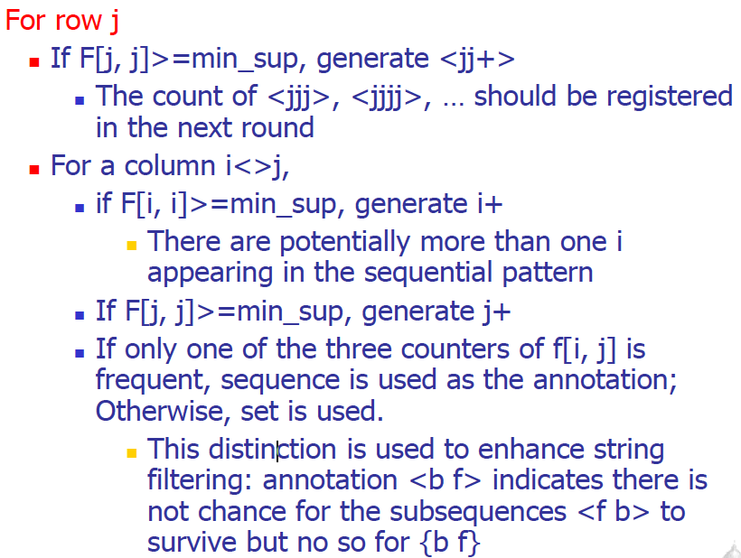

__i+__ means that we could have sequence \<ij\> but we can also have the repetition of i, we can have \<iij\> or \<iji\>.

If $F[j,j] \ge min\_sup$ succeds we have to generate __j+__ for the same reason.


We have sequence \<bf\> in two sequences in the sequence database, we have \<fb\> in two sequences in the sequence database and \<bf\> as itemset in two sequences in the sequence database.

If I consider b, I discover that b is present in 4 sequences, but it is in 4 sequences as \<bb\>. This means that the sequence \<bb\> is frequent.

In conclusion, I have the possibility that for \<bf\> I can have the repetition of b, for example \<bbf\>.

About \<fb\> it appears two times but ff is present in form of repetition two times in the sequences, so I have that \<fb\> is present and also f can be repeated.

For this consideration \<bf\> and \<fb\> are present and frequent, and both b and f can be repeated.

I can generate \<bbf\> or \<bff\>, both are possible because I have this consideration thanks to the matrix.

Also, bf can be repeated because both b and f are frequent in terms of repetition, for example bfbf.

This is why we have __{b+f+}__.

\<be\> separately is frequent because it is present in three sequences, eb is not and e is not frequent.

We can exploit sequences with the repetition of b but not with the repetition of e, we can explore bbe or bbbe but not beee, because e is not frequent, we have \<b\*e\>.

The difference between the two annotations __\<b\*e\>__ and __{b+f+}__, is that in \<b\*e\> we consider __only the sequence be__ while in the {b+f+}, we can consider bf, fb but __also the possible repetition of bf__.

With these annotations we can generate possible candidate sequences that can be frequent.

__Generating Annotations on Projected Databases__

For row $j$

-   For each $i < j$, if $F[ i , j], F[k, j]$ and $F[ i , k]( k < i )$ may form a pattern generating triple (i.e., all the corresponding pairs are frequent), $k$ should be added to $i$'s projected column set

-   If there is a choice between sequence or set, __sequence is preferred__


If we consider \<(ce)\>we have two, so it is frequent as itemset.

be and bc are frequent, so we can have that ce can be combined with b because be and bc are both frequent.

We can generate just this \<(ce)\>:{b} that indicates we can generate a projection along ce and b can form a frequent sequence with ce.

We generate possible projections of the sequence database along specific items.

At the end we have this table:

|Item|Length-2 seq pat.| Ann. on rep. Items|Ann. on proj. DBs|
|----|-----------------|-------------------|-----------------|
|f|\<bf\>:2, \<fb\>:2, \<(bf)\>:2|\<b<sup>+</sup>f<sup>+</sup>\>|None|
|e|\<be\>:3, \<(ce)\>:2|\<b<sup>+</sup>e\>|\<(ce)\>:{b}|
|d|\<bd\>:2, \<db\>:2, \<(bd)\>:2, \<cd\>:2, \<dc\>:2, \<da\>:2|{b<sup>+</sup>d}, \<da<sup>+</sup>\>|\<da\>:{b,c}, {cd}:{b}|
|a|\<ba\>:3, \<ab\>:2, \<ca\>:2, \<aa\>:2|\<aa<sup>+</sup>\>, {a<sup>+</sup>b<sup>+</sup>}, \<ca<sup>+</sup>\>|\<ca\>:{b}|
|c|\<bc\>:4, \<cb\>:3|{b<sup>+</sup>c}|None|
|b|\<bb\>:4|\<bb<sup>+</sup>\>|None|


We have the length-2 sequential patterns, annotations on repeated items and annotations on projected databases.

Starting from this we can generate candidate sequences we can explore.

Based on the annotations for item repeating patterns and projected databases, S is scanned one more time

The set item repeating patterns generated is {\< bbf \>:2,\< fbf \>: 2, \<(bf)b\>:2 , \<(bf)f\>:2, \<(bf)bf\>:2,\<( bd )b\>:2, \<bba \>:2, \<aba\>:2, \<abb \>:2, \<bcb \>:3, \<bbc \>:

There are four projected databases: \<( ce )\>:{b}, \< b,c\> }, {cd}:{b} and \<ca \>:{b}.

For a projected database whose annotation contains exactly three items, its associated sequential patterns can be obtained by a simple scan of the projected database.

For a projected database whose annotation contains more than three items, one can construct frequent item matrix for this projected database and recursively mine its sequential patterns by the alternative level projection technique.

This allows us to reduce the complexity of the problem just guiding the search for frequent sequences.

In fact, we reduce the candidate sequences to test.

We use some datasets and some comparison algorithms.


The _FreeSpan_ with annotations is really faster and decreasing minsup the run-time is almost constant.

The advantages on _FreeSpan_ in respect to the Apriori-like methods is that:

- we project a large sequence database recursively into a set of small projected sequence databases based on the currently mined frequent sets

- the alternatively-level projection in FreeSpan __reduces the cost of scanning multiple projected databases__ and __takes advantages of Apriori-like 3-way candidate filtering__

We can reduce the number of candidate sequences and using annotations we can help to investigate the space.# Data Stream Analysis

We have to analyze data in streaming.

Data stream a potentially unbounded , ordered sequence of instances . A data stream $S$ may be shown as $S = \{ x_1 , x_2 , x_3 , ... , x_N \}$, where $x_i$ is $i$-th data instance, which is a $d$-dimensional feature vector and $N$ goes to infinity.


We theoretically have an infinite quantity of data. We have a time order.

The input is a data stream, we should have a stream processing engine to elaborate then and we want to produce knowledge in output.

In a classification problem we assumed to have a bounded training set. We train the classifier using it and it must be available, here we assume it arrives in streaming.

We have to produce a classifier or a cluster when we start to receive data, we don't have to wait them all.

With new instances we will improve the classifier.

We have to approach this problem providing a new algorithm.

We have to tune the clusters or the classification model,

Traditional Data Mining techniques usually require

-   __Entire dataset to be present__

-   __Multiple scans of the overall dataset__

-   __Random access to instances__

-   __Computationally heavy learning phases__, except in lazy learners

## Challenges of stream mining

-   __Impractical__ (and impossible) to __store the whole dataset__

-   __Impractical__ (and impossible) to __perform multiple scans of the overall dataset__, we have an high number of instances and we receive them in streaming

-   __Random access is expensive__

-   __Simple calculation per data__ due to time and space constraints

## Motivation

A growing number of applications generate streams of data

-   Performance measurements in network monitoring and traffic management

-   Log records generated by Web Servers

-   Tweets on Twitter

-   Transactions in retail chains, ATM operations in banks

-   Sensor network data

Application characteristics

-   Massive volumes of data

-   Records arrive at a rapid rate

## Computational Model

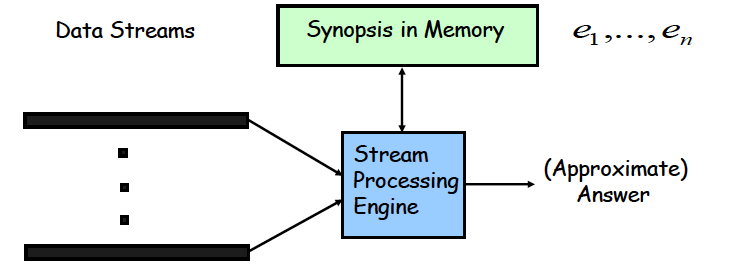

The __SPE__ elaborate the data stream and produce an approximated answer.

### Stream processing requirements

-   __Single pass__: Each record is examined at most once, we don't have time to perform iterations on these instanced

-   __Bounded storage__: Limited Memory (M) for storing synopsis and these are representation of the data streams

-   __Real time__: Per record processing time (to maintain synopsis) must be low

## __Algorithms__

Generally, algorithms __compute approximate answers__, we have to balance time and precision, it's difficult to compute answers accurately with limited memory.

-   Approximate answers - __Deterministic bound__

    Algorithms only compute an approximate answer but bounds on error. These algorithms can provide approximate answers but also guarantee that this approximation provides bounds on error, promising that the error is bounded.

-   Approximate answers - __Probabilistic bound__

    Algorithms compute an approximate answer with high probability

    With probability at least $1-\delta$, the computed answer is within a factor $\varepsilon$ of the actual answer

    We have a limited error with respect to the ideal answer.

These are single pass algorithms for processing streams __also applicable to (massive) terabyte databases__!

### __Concept Drift__
For efficiency problems we just need to perform the single pass.

One of the problems we have is the problem of the __concept drift__ which is the unforeseen change in statistical properties of data stream instances over time.

If new instances have the same statistical property the classifier works properly, nothing is changing, otherwise the model we are implementing do not work well.

It affects the model we generated, the classifier/cluster we generate can't be valide anymore.

We have to adapt the model to the condition we have.

There are __four types__ of concept drift: sudden, gradual, incremental and recurring.

-   __Sudden concept drift__ : Between two consecutive instances, the change occurs at once , and after this time only instances of the new class are received

    

-   __Gradual concept drift__ : The number of instances belonging to the previous class decreases gradually while the number of instances belonging to the new class increases over time. During a gradual concept drift, instances of both previous and new classes are visible. We have a period in which we have __instances of both classes__.

    

-   __Incremental concept drift__ : Data instances belonging to the previous class evolves to a new class step by step. After the concept drift is completed, the previous class disappears. The instances that arrive during the concept drift are of transitional forms and they do not have to belong to either of the classes.

    

-   __Recurring concept drift__ : The data instances change between two or more statistical characteristics several times. Neither of the classes disappears permanently but both of them arrive in turns.

    

    We have an oscillation between the two classes.

We have to model the concept drift.

### __Data Structures__

It is not possible to store and manage the whole input data, only a synopsis of the input stream is stored: special data structures enable to incrementally summarize the input stream.

Four commonly used data structures:

1. __Feature vectors__: summary of the data instances, we had these for example in _BIRCH_

2. __Prototype arrays__: keep only a number of representative instances that exemplify the data

3. __Core set trees__: keep the summary in a tree structure

4. __Grids__: keep the data density in the feature space, we use a grid and we update the density of cells in the grid

They are used to summarize the data.

The ML algorithm will work on this data structure. We receive the data, update the data structure and apply ML algorithms using the data structure, the summarization of instances.

The update should be fast, because when we receive an instance and update the data structure, we have to analyze the instances. With a high rate of receiving instances we need a fast way to update data structure.

### __The Window Model__

Sometimes it is more efficient to process recent data instead of the whole data and sometimes also more robust, we can have the concept drift and we must update our model but forcing more on the recent instances.

We need to give __more importance to the recent instances__.

To exploit this concept, we can use window models.

#### __Damped Window Model__

In __damped window model__ recent data have more weight than the older data: the importance of the instances decreases by time; they will have an higher weight.

We can decide the slope of the red line just to assign more importance to recent instances.

Usually implemented using __decay functions__ which scale down the weight of the instances, depending on the time passed since the instance is received

$$
    \large{f(t) = 2^{-\lambda t}}
$$

For example, we can use this exponential function where lambda is the decay rate. Higher decay rate in the function means a more rapid decrease in the value


We have to use data structure that allow us to store information we need, to generate for example clustering without losing information or losing few of them.

We typically focus on specific windows at the time to generate updates of the structures.

If we create the model at the beginning, if the distribution of data changes we need to change the model, and here is the problem of concept drift.

One possible approach is to retrain periodically the model to tune it on changes on the distribution of data.

In the damped window model, __old data weights almost zero__, they disappear with the increase of the time.

#### __Landmark window model__

The whole data between two landmarks are included in the processing and all of the instances have equal weight.

We work focusing on a window between two landmarks and work on it.

Consecutive windows do not intersect and the new window just begins from the point the previous window ends.

Let $w$ be the window length. Then, data instances belonging to the $m$-th window are calculated using:

$$
    \Large{W_m = [x_{m * w}, ... ,x_{(m+1)*w-1}]} \hspace{1cm}
    m = \left\lfloor \dfrac{i}{w} \right\rfloor
$$


#### __Sliding window model__

__The window swaps one instance at each step__: the older instance moves out of the window, and the most recent instance moves in to the window by FIFO style.

All instances in the window have equal weight and consecutive windows mostly overlap

Let $w$ be the window length.

Then, data instances belonging to the $m$-th window are calculated using

$$
    \Large{W_m = [x_m, ..., x_{(m+w-1)}]}
$$


These are data structure model to preprocess the data.

## __Data Stream Clustering__

Several algorithms were proposed to manage data space.

_BIRCH_ is an example of algorithm that can be used to manage data streams.

It has a data structure to summarize information relative to the data.


We have these 5 kinds of approaches.

In classification we need the label with data and it's not typically common.

In prediction it's different because after some time we can have the ground-truth.

__In most cases, true class labels are not available for stream instances__ and there is no prior knowledge about the number of classes.

Therefore, clustering, being unsupervised is __one of the most suitable data mining and data analysis methods for data streams__.

### __Adaptive Streaming k-Means__

We need to update clusters when we receive data in streaming.


We just use a number of instances at the beginning for initialization, and this is the parameter $l$.

We select the cluster with highest silhouette.

We obtain candidate centroids from that function.

Until we don't have any change we exploit the first centroids computed, while if we have some change we re-inizialize again centroids.

#### __Initialization phase__

The function _determineCentroids()_ finds $k$ and determines candidate centroids.

It estimates the __probability density function__ (PDF) of the data for each feature and determine the directional changes of the PDF curves: each change identifies a new region. The region can be defined as the area between two consecutive directional changes of the PDF curve.


We use this function and we just determine the variation between two different regions in the PDF function.

Number of regions is considered as a candidate $k$ and centers of these regions are considered as candidate initial centroids

We perform this work feature by feature, so we will have a different $k$ for each feature.

Different features generally show different distributions and different centroids, so we have that $k$ can vary:

$$
    \large{k \in [k_{min}, k_{min}+k_{max}]}
$$

The loop 2-5 is executed for these values of $k$ and for candidate centroids, the computations of using the kmeans of clusters.

Clustering results of different $k$ values are __compared according to silhouette coefficient__ and __best $k$ is selected__ with its corresponding centroids.

During the initialization phase we try to do this optimization.

#### __Continuous clustering phase__

We start to receive new instances and can locate them considering the centroids.

function _changeDetected()_:

We compute the standard deviation($\sigma$) and mean($\mu$) of the input data and are stored during the execution

The algorithm tracks how these two values change over time and predicts a concept drift according to the change. We monitor if $\sigma$ and $\mu$ changes along the time, in that case we have concept drift. When a concept drift is predicted, current cluster centroids are no longer valid (we have a change in distribution of data). In such a case the concept drift is realized at line 9 and a re-initialization is triggered at line 10, by using $l$ instances to update the clusters we should have.

We have to perform it feature by feature, and we have to decide the threshold to use.

#### __Complexity Analysis__

Let $l$ be the length of the initial data sequence, and $d$ be the data dimension.

The complexity of estimating $k$ for a single dimension is $O(l)$

Since this estimation is __performed for all dimensions__, total $k$ estimation complexity becomes $O(d \cdot l)$.

After determining initial centroids running k-means takes $O(d \cdot k \cdot cs )$, since no iterations of the algorithm are needed, where $cs$ is the number of different centroid sets.

Assigning a newly received data instance to the nearest cluster during the online phase is $O(k)$, we have to compute the distance of the new instance and $k$ centroids. As a result, __total worst case complexity of the algorithm__ is $O(k) + O(d \cdot l) + O(d \cdot k \cdot cs ) = O(d \cdot l) + O(d \cdot k \cdot cs )$.

We have to spend time in inizialization phase, but __computing the cluster for the new instance is easy__, we just to compute the distance, but it works until the distribution remains the same.

### __MuDi Stream__

MuDi Stream is a __hybrid algorithm__ based on both __density based__ and __grid based__ approaches

Input data instances are clustered in a density based approach and outliers are detected using grids (to reduce the computational time to work with the cell instead of the single instance).

For __Data synopsis, core mini clusters are used__: they are __specialized feature vectors__ which keep __weight, center, radius and the maximum distance__ from an instance to the mean. In the __online phase__ core mini clusters are created and kept up to date for each new data instance, we update the data structure and periodically we have an __offline phase__ to compute clusters. In the offline phase final clustering is executed over the core mini clusters. The online phase should perform very fast because we work at the arrival of the data.

#### __Online Phase__:


Parameters affect the final result.

$cmc$ = core mini cluster

Instances are located in specific cells while arriving, at the beginning not dense and while receiving instances, subcells become dense.

#### __Offline Phase__:


It is similar to _DBSCAN_ working on dense core mini-clusters.

Some $cmc_p$ can be detected as outlier because isolated and not used to create the cluster.

It's hybrid because __we use grids but we exploit density__.

In the offline phase we use DBSCAN but __with core mini-clusters__ and not instances.

Inside a loop, an unvisited core mini-cluster is randomly chosen at line 3 and marked as visited at line 4. If this core mini-cluster has no neighbors, it is marked as noise at line 16.

If it has neighbors, a new final cluster is created with this core mini-cluster and its neighbors, at lines 6-8. After that, each unvisited core mini-cluster in the new created final cluster is marked as visited and its neighbors are added to the same final cluster, at lines 9-14.

This loop continues until all core mini-clusters are marked as visited.

MUDI-stream is __not suitable for high dimensional data__, which makes the processing time longer, because of the grid structure (we would have an high number of cells).

Clustering quality of MuDi-Stream __strongly depends on input parameters density threshold__, decay rate for damped window model and grid granularity.

These parameters require an expert knowledge about the data.

The windows is present because we have a decrease of the weight of the instances in the cells and that's why we can periodically remove low weighted grids and $cmc\textnormal{s}$.

#### __Complexity Analysis__

Complexity of this linear search on core mini-clusters for each new data instance is $O(c)$ where $c$ is the number of core mini clusters

Let $G$ be total density grids for all dimensions, which is exponential to the number of dimensions. Space complexity of the grid is $O(log G)$ because the scattered grid are pruned during the execution.

Moreover, time complexity of mapping a data instance to the grid is $O(log log G)$ because the list of the grids is maintained as a tree During the pruning, all core mini clusters and grids are examined.

This makes time complexity of pruning $O(c)$ for core mini clusters and $O(log G)$ for grids.

As a result, the overall time complexity of MuDi Stream is $O(c) + O(log log G) + O(c) + O(log G) = O(c) + O(log G )$.

### __CEDAS__

Clustering of evolving data streams into __arbitrarily shaped clusters__

_CEDAS_ is a __fully online__ data stream clustering algorithm.

Density based algorithm designed for clustering data streams with concept drifts

__Damped window model__ is employed with a __linear decay function__ instead of an exponential one


Reducing by lambda is the decay which in fact is linear.

Energy decreases from 1 with the time.

#### __Complexity Analysis__

For each new data instance, _CEDAS_ performs a __linear search__ on the micro-clusters.

Complexity of this linear search is $O(c)$ where $c$ is the number of micro-clusters.

After that, energy of each micro-cluster is reduced, which also requires an $O(c)$ complexity.

The last step, which updates the graph structure, is executed only when a new micro-cluster is created or removed. In the worst case, all micro-clusters are visited, so worst case time complexity of this step is again $O(c)$.

Therefore, the overall time complexity of CEDAS is $O(c)$, the number of micro-clusters.

### __Improved Data Stream Clustering Algorithm__

Improved clustering algorithm based on high speed network data stream.

Online phase composed of two main sub phases: __Initialization phase__ and __continuous clustering phase__.

Major micro clusters and critical micro clusters are used

Major microclusters have __high densities__ and will be included in the final clustering process

Critical micro clusters have __low densities__ and treated as __potential outliers__

__Damped window model__ is used and low weighted major and critical micro clusters are removed periodically.

We exploit the decay rate again.

Threshold values of major and critical micro clusters are global parameters in the algorithm, instead of being specific to each micro cluster. However, they are dynamic parameters and continuously updated during the execution.

#### __Online phase__


In initialization we can work with any kind of algorithm, because we work with static data instances.

The OR depends on if $x$ is closer to a major or critical micro-cluster, or far away from both.

The pruning period depending on the decay rate

#### __Offline phase__

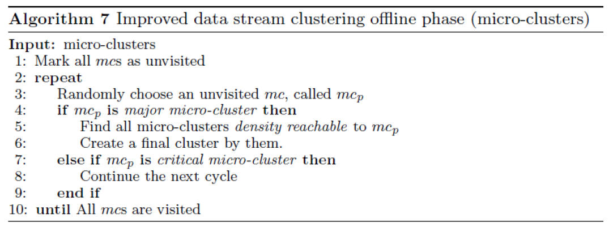

At the end we create clusters starting from the major micro-cluster and adding other micro-clusters.

If the distance between a micro-cluster and another major micro-cluster is less than or equal to the sum of their radii, then they are directly density reachable.

If any adjacent two clusters in a set of micro-clusters are directly density reachable, then the set of micro-clusters is density reachable, so we can add them.

#### __Complexity Analysis__

Let $l$ be the length of the initial data sequence. Complexity of the initialization equals to complexity of _DBSCAN_, which is $O(l \cdot log l)$ in average and $O(l^2)$ in worst case.

In the continuous clustering phase, a linear search is performed on micro-clusters for each new data instance. Complexity of this linear search is $O(c)$ where $c$ is the number of micro-clusters.

When it is pruning period, pruning task is executed for each microcluster one by one and this also requires a complexity of $O(c)$.

Therefore, the total worst-case complexity is $O(c) + O(c) = O(c)$.

### __DBIECM__

DBIECM is an __online, distance-based, evolving__ data stream clustering algorithm

Exploits the __Davies Bouldin Index__ (DBI) which is used as the evaluation criterion, that uses dispersion and separation.

$$
    \large{V_{DB} = \dfrac{1}{k}\sum_{i = 1}^{k}{R_i}}
$$
where $R_i = \max_{i \ne j}{R_{ij}} \hspace{1cm}R_{ij} = \dfrac{S_i + S_j}{D_{ij}}$

$$
    \large{S_i = \left(\dfrac{1}{|C_i|} \sum_{x \in C_i}{D^p}(x,v_i) \right)^{\dfrac{1}{p}}, p > 0 \hspace{1cm}D_{ij} = \left(\sum_{l = 1}^{d}{|v_{il}-v_{jl}|^t} \right)^{\dfrac{1}{d}}, t > 1}
$$
Where:
- $S_i \rightarrow$ Dispersion
- $C_i \rightarrow$ Number of objects in cluster $C_i$
- $v_i \rightarrow$ Centroid of cluster $C_i$
- $D_{ij} \rightarrow$ Separation 

We take again in consideration __compactness and separation__.


We exploit DBI to determine the best cluster to add these instances.

DBIECM requires the __maximum cluster radius as a parameter__, this parameter directly affects the final cluster count and consequently the clustering quality.

Maximum cluster radius strongly depends on the input data and __requires an expert knowledge about the data__. Being distance based, DBIECM can detect __only hyperspherical clusters__.

DBIECM __does not employ any time window model__, thus no input data instance out dates, all input data exist in the final clustering Moreover, no outlier detection mechanism is implemented. However, it is possible to specify an outlier threshold value and mark the clusters with low cardinality as outliers.

We don't use a decay approach.

#### __Complexity Analysis__

When a new data instance is received, a linear search is performed on clusters. Complexity of this linear search is $O(k)$.

Pairwise distances between all clusters are used for DBI calculation, thus DBI calculation requires a complexity proportional to $O(k^2)$.

When there exist more than one candidate cluster for the new data instance, the instance is added to all of them one by one and DBI is calculated accordingly. This requires a complexity proportional to $O(k^3)$.

Therefore, although the average complexity of DBIECM depends on the input data, the __total worst-case complexity__ is $O(k) + O(k^3) = O(k^3)$

__If $k$ is big this complexity can be relevant__.

### __I-HASTREAM__ (IN MY NOTES MARCELLONI SAID THAT WE OVERLOOKED IT)

__Two phases, adaptive, density based, hierarchical__, data stream clustering algorithm.

In the __online phase__, synopsis of the data is created as microclusters.

In the __offline phase__, micro-clusters are maintained in a graph structure as a minimum spanning tree and hierarchical clustering is employed for the final clustering

Main contributions of I-HASTREAM are to perform the final clustering on a minimum spanning tree and to incrementally update the minimum spanning tree according to the changes in the microclusters, instead of generating it from scratch. Both contributions are related to the offline phase.


Because no algorithmic details are specified about the online phase, the __analysis of the complexity of _I-HASTREAM_ was not possible__.

### __Comparison__

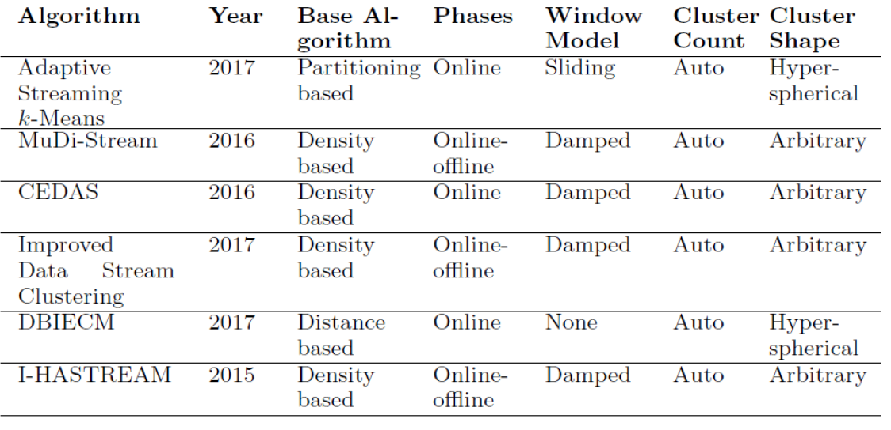

Most of them use a damped window method, so with a decay.

Some exploits only online phase, others exploit both.


They can adapt to concept drift.

In online phase we update data structures and in offline phase we generate periodically clusters, exploiting k-means, DBSCAN or some other algorithm.

It's interesting to understand how clusters modify over time, considering the evolution of clusters, easier with k-means because we have centroids even if simpler information but not with DBSCAN where we consider shape, location and other things.

## __Classification__

### __VFDT__ (Very Fast Decision Tree)

With classification we have to assume to receive streams of labeled data.

The problem here is to learn a classifier with data arriving in streaming, our training set is provided in streaming.

__Classic decision tree learners__ assume all training data can be simultaneously stored in main memory

__Disk based decision tree learners__ repeatedly read training data from disk sequentially

Prohibitively expensive when learning complex trees

We use a modification of decision trees, we learn decision tree while instances arrive assuming they can be infinite.

__Goal__: design decision tree learners that __read each example at most once__, and __use a small constant time to process it__.

In order to find the best attribute at a node, it may be sufficient to consider only a small subset of the training examples that pass through that node.

We want to be sure that the splitting is reliable.

We want to understand if we can approximate the decision with a limited number of instances, being sure that we don't have a high error in taking this decision.

Given a stream of examples, we use the __first ones to choose the root attribute__.

Once the root attribute is chosen, the __successive examples are passed down to the corresponding leaves__, and used to choose the attribute there, and so on recursively.

We have to decide __when to split a leaf to create a new subtree__.

We use the __Hoeffding bound__ to decide how many examples are enough at each node to take a decision.

Warning: the approach analyzed in the subsequent phases has some theoretical problem, but you can find it implemented in several tools which manage data streams.

It works but have a wrong assumption(kek).

#### __Hoeffding Bound__

Let $X$ a random variable varying in a range $R$

Let us assume that we have $n$ observations of $X$

Let $x'$ be the average value of the $n$ observation

The Hoeffding bound states that with probability $1-\sigma$ , the mean $X'$ of $X$ is at least $x' - \varepsilon$ where:

$$
    \large{\varepsilon = \sqrt{\dfrac{R^2ln1/\delta}{2n}}}
$$

It guarantees the error is limited after a number of instances we are able to collect.

We can set $\varepsilon$, determine $n$, the number of observations to be collected to be sure that the error we have is $\varepsilon$ when we approximate the average $x$ computed with the $n$ observation the mean of $X$ with that probability.

If we set the probability and $\varepsilon$, we have the number of instances to collect.

__How do we use the Hoeffding Bound?__

Let $G(X_i)$ be the heuristic measure used to choose test attributes (e.g.

Information Gain, Gini Index)

$X_A$: the attribute with the highest attribute evaluation value after seeing $n$ examples.

$X_B$: the attribute with the second highest split evaluation function value after seeing n examples.

Given a desired $\delta$: if $\Delta\overline{G} = \overline{G}(X_A) - \overline{G}(X_B) > \varepsilon$, with $\varepsilon = \sqrt{\dfrac{R^2ln1/\delta}{2n}}$


and R=lnc, where c is the number of classes, after seeing n examples at a node,

the Hoeffding bound guarantees the true $\Delta G \ge \Delta \overline{G} - \varepsilon > 0$ with probability $1-\delta$

This node can be split using $X_A$ and the succeeding examples will be passed to the new leaves

We can express the number of instances we need to have the possibility to split the node because we can decide that the attribute $X_A$ is the one we can choose for splitting the node.

We can start with the root, collect instances, decide to split the root.

When $\Delta G$, the $G$ computed without splitting and with an attribute, is higher than $\varepsilon$ we are sure, for the Hoeffding Bound of the original paper, that __the approximation is very close to the decision tree__ that we will have collecting all instances.

#### __Problem__:

__Split measures__, like information gain and Gini index, __cannot be expressed as a sum $S$ of elements $Y_i$.__

We have this as a problem because the Hoeffding Bound is defined for this kind of variable so we just expressed in terms of sum of elements, but __the information of gain is not a sum of elements__.

When we just add instances, we don't have that $G$ is a sum of these instances.

This is why the formula we saw is __not correct theoretically__.

Actually, the correct formula is:

$$
    \large{\epsilon = C_{Gain}(K,N)\sqrt{\dfrac{ln(1/\delta)}{2N}}}
$$

where

$$
    C_{Gain}(K,N) = 6(Klog_2eN + log_22N) + 2log_2K
$$

that __changes the number of instances to collect that approximate the decision tree we would have having all instances__.

__Two considerations__:

-   Pre-pruning is carried out by considering at each node a "null" attribute $X_A$ that consists of not splitting the node. Thus __a split will be performed if__, with confidence $1- \delta$, __the best split found is better (according to $G$) than not splitting__

-   The most significant part of the time cost per example is __recomputing $G$.__

It is __inefficient to recompute $G$ for every new example__, because it is unlikely that the decision to split will be made at that specific point, we have to accumulate some points before appreciating the modification. Thus, VFDT (Very Fast Decision Tree) learner __allows the user to specify a minimum number of new examples__ $n_{min}$ that must be accumulated at a leaf before $G$ is recomputed. We recompute $G$ after accumulating that minimum number of instances.

#### __Algorithm__

Calculate the information gain for the attributes and determines the best two attributes

__Pre pruning__: consider a "null" attribute that consists of not splitting the node

At each node, check for the condition:

$$
    \large{\Delta \overline{G} = \overline{G}(X_A) - \overline{G}(X_B) > \varepsilon}
$$

If condition is satisfied, __create child nodes based on the test at the node__

If not, stream in more examples and perform calculations till condition is satisfied

We accumulate instances in the leaf and we have to decide if they can classify correctly instances or we need to split them, to decide if we have to split we have to decide when we accumulate a sufficient number of instances to consider that a reliable decision.

The Hoeffding Bound tells us when we accumulate a sufficient number of instances to take that decision.

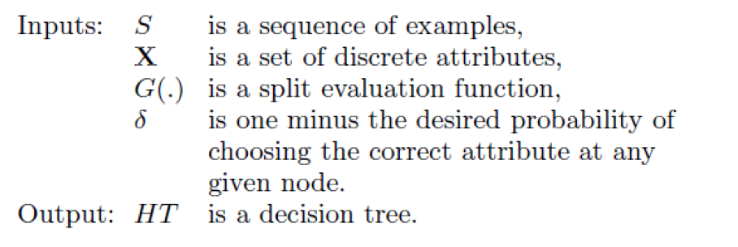


We update the decision tree using each instance and just update the label of the leaves.


We select $X_a$ as the attribute to split.

We set to 0 because we start again to recompute statistics.

#### __Performance Analysis__

$p$ : probability that an example passed through DT to level $i$ will fall into a leaf at that point

The expected disagreement between the tree produced by Hoeffding tree algorithm and that produced using infinite examples at each node is __no greater than__ $\delta/p$, for the Hoeffding bound.

__Required memory__: $O(leaves * attributes * values * classes)$

### __CVFDT__ (Concept adapting Very Fast Decision Tree learner

It __extends VFDT but maintain VFDT's speed and accuracy also dealing with the concept drift__, not managed by VFDT because we decide to split a node if the number of instances guarantees that the decision we are taking is a good approximation of the one using all instances but nothing talks about concept drift, which is managed but alternative subtrees created when we receive instances.

It __detects and responds to changes__ in the example generating process

#### __Observations__

-   With a __time changing concept__, the current splitting attribute of some nodes __may not be the best anymore__.

-   An outdated subtree __may still be better than the best single leaf__, particularly if it is near the root.

    -   Grow an alternative subtree with the new best attribute at its root, when the old attribute seems out of date.

-   Periodically __use a bunch of samples to evaluate qualities of trees__.

    -   Replace the old subtree when the alternate one becomes more accurate.
# MapReduce and Hadoop

With large datasets we need to store data in different servers.

We have these frameworks that can help us to do it.

MapReduce is a programming model Google has used to process big data.

There's the problem to distribute the filesystem and to perform distributed computations.

In this paradigm:

-   Users specify the computation in terms of a map and a reduce function, mappers and reducers are executed in parallel.

-   Underlying runtime system automatically parallelizes the computation across large-scale clusters of machines, and

-   Underlying system also handles machine failures, efficient communications, and performance issues.

Consider a large data collection:

{web, weed, green, sun, moon, land, part, web, green,...}

Problem: Count the occurrences of the different words in the collection.

The parse() analyze the collection and the count will count the occurrences of words in the collection.


We can think they work in sequence, but we can speed-up the process with a multi-thread solution.

If we just maintain a unique result table, we can write only in a lock state.

To solve this, we can create multiple parser and counters, each one having a private table. We don't have need for lock and at the end we will merge the tables.

If we have a very large data collection, we have that this data cannot be maintained in one single machine and we cannot exploit multi-threading.

Each machine will elaborate its own data collection private to the single machie.

Single machine cannot serve all the data: you need a distributed special (file) system.

File system has to be fault-tolerant, Hard disks can fail.

We exploit as solution the replication on several servers and using checksum.

If we have a fire in close servers, we may lose the data if replicas are all in that building.

Using replicas in different locations we have to deal with synchronization, but data transfer bandwidth is critical (location of data).

Critical aspects: fault tolerance + replication + load balancing, monitoring

We have to take care of load balancing because we have also computation on different servers but we need a balance on this computations, considering fast/slow tasks in fast/slow servers.

We want to exploit parallelism afforded by spitting parsing and counting.

We need an automatic solution.

In every server we will have a data collection, a parser and a counter.

Each server manages the private data collection, and we have to synchronize the tables to produce the final result.

The real advantage is that data are characterized with the Write Once Read Many (WORM) characteristics.

This is the case, because we receive data collections, and we just have to read them.

Data with WORM characteristics: yields to parallel processing;

Write-once-read-many: a file once created, written and closed need not be changed --this assumption simplifies coherency

If we change the content of the file, we need to handle the consistency updating replicas.

This file system works very well if we have one write and multiple reads.

Data without dependencies: yields to out of order processing because we can think to process concurrently and to have only in some phases some synchronization.

Parse and count can work in parallel.

Our parse is a mapping operation:

MAP: input -\> \<key, value\> pairs with value equal to 1

Our count is a reduce operation:

REDUCE receives as input \<key, value\> pairs and reduce it increasing the counter for a key producing in output \<key,value\> cumulative.

Runtime adds distribution + fault tolerance + replication + monitoring + load balancing to your base application

 

In MAP we split the data to supply multiple processors, each map read the split of the data collection and analyze if the word is present and output \<word, 1\>.

It goes in input to the reducers that increase the counter.

'combine' combine results of executions in the same server

Considering the MapReduce Programming Model, we have to:

-   determine if the problem is parallelizable and solvable using MapReduce (ex: Is the data WORM?, large data set).

-   design and implement solution as Mapper classes and Reducer class.

-   compile the source code with Hadoopcore.

-   package the code as jar executable.

-   configure the application (job) to the number of mappers and reducers (tasks), input and output streams

-   load the data (or use it on previously available data)

Mappers can be executed in parallel, reducers can be executed in parallel and the only synchronization is between mappers and reducers.

Map and Reduce are the main operations: simple code.

There are other supporting operations such as combine and partition.

All the maps should be completed before the reduce operations start.

Operations are computed where we have the data.

We have special distributed file system.

For example: HadoopDistributed File System and HadoopRuntime.

Hadoop is the framework and MapReduce is the paradigm.

It is scalable, flexible in accepting all data formats, efficient for fault-tolerance and can use commodity inexpensive hardware.

Automatic parallelization & distribution and fault-tolerance & automatic recovery are hidden from the end user that just provides two functions.

**Hadoop** is a software framework for distributed processing of large datasetsacross large clusters of computers.

-   Large datasets →Terabytes or petabytes of data

-   Large clusters →hundreds or thousands of nodes

Hadoop is open-source implementation for Google MapReduce.

Hadoop is based on a simple programming model called MapReduce.

Hadoop is based on a simple data model, any data will fit.

It has a master-slave shared-nothing architecture, used for the distributed file systems and distributed processing.


In the Master we have the filesystem and, in the slaves, we have the actual storage of data.

In the slaves we have the allocation for tasks, the real executions of tasks.

The master has a jobTracker and acts as a sort of synchronizer.

It works well if slaves do not need to share anything.

Hadoop framework consists of two main layers

-   Distributed File System (HDFS)

-   Execution engine (MapReduce), for the execution of tasks

The environment is the following:


While in local file systems we manage blocks of 2K size, in HDFS we manage 128M blocks.

This allows us to have a limited blockmap, we reduce the number of blocks to manage in the master node that contains mapping of each block with the place in which it is stored.

Each block is stored in different slaves.

HDFS is a distributed file system optimized for high throughput.

It leverages unusually large (for a file system) block sizes and use data locality optimizations to reduce network input/output (I/O).

Works very well when reading and writing large files (gigabytes and larger), because we mode large blocks.

It is scalable and reliable.

It replicates files for a configured number of times, it is tolerant of both software and hardware failures and it automatically re-replicates data blocks on nodes that have failed.

**Failure** is the norm rather than exception.

A HDFS instance may consist of thousands of server machines, each storing part of the file system's data.

Since we have huge number of components and that each component has non-trivial probability of failure means that there is always some component that is non-functional.

Detection of faults and quick, automatic recovery from them is a core architectural goal of HDFS.

**Master/slave architecture**

HDFS cluster consists of a single Namenode (master), a master server that manages the file system namespace and regulates access to files by clients.

There are a number of DataNodes (slaves) usually one per node in a cluster.

The DataNodes manage storage attached to the nodes that they run on.

HDFS exposes a file system namespace and allows user data to be stored in files.

A file is split into one or more blocks and set of blocks are stored in DataNodes.

DataNodes: serves read, write requests, performs block creation, deletion, and replication upon instruction from Namenode. Real operations are done in DataNodes but the command come from Namenodes.

**HDFS Architecture**

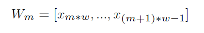

For each file, we have the list of blocks and where they are stored.

The client interacts directly with the NameNode, receive where blocks are present and interacts with DataNodes to retrieve the block.

When we manage the transfer from DataNodes we don't need the interaction with the NameNode.

By default, is 3 but we can increment it if we want to increase the fault tolerance.

We have an **hierarchical file system** with directories and files.

Namenode maintains the file system.

Any meta information changes to the file system recorded by the Namenode.

An application can specify the number of replicas of the file needed: replication factor of the file. This information is stored in the Namenode

HDFS is designed to store very large files across machines in a large cluster.

Each file is a sequence of blocks.

All blocks in the file except the last (depending on the size of the file) are of the same size,

Blocks are replicated for fault tolerance.

Block size and replicas are configurable per file.

The Namenode receives a Heartbeat and a BlockReport from each DataNode in the cluster.

BlockReport contains all the blocks on a Datanode.

The placement of the replicas is critical to HDFS reliability and performance.

If a node fails, we will have to find the replica from another node and give it to another new node.

Optimizing replica placement distinguishes HDFS from other distributed file systems.

Rack-aware replica placement:

Goal: improve reliability, availability and network bandwidth utilization.

Where to store replicas?

Having them in one server is easy and fast to maintain, but we have a SPOF.

Typically we have replicas in different servers in the same rack and other replicas in other locations.

Many racks, communication between racks is through switches.

If something happens in the same location we lose a lot of replicas.

Network bandwidth between machines on the same rack is greater than those in different racks.

Namenode determines the rack id for each DataNode.

Replicas are typically placed on unique racks.

This is simple but non-optimal.

Writes are expensive and replication factor is 3.

Replicas are placed: one on a node in a local rack, one on a different node in the local rack and one on a node in a different rack (possibly in a different location).

1/3 of the replica on a node, 2/3 on a rack and 1/3 distributed evenly across remaining racks.

Replica selection for READ operation: HDFS tries to minimize the bandwidth consumption and latency.

When we perform a read operation, we exploit the closer block.

We execute the code in the server which has the closest block, we don't need to move data.

If there is a replica on the Reader node then that is preferred.

HDFS cluster may span multiple data centers: replica in the local data center is preferred over the remote one.

The HDFS namespace is stored by Namenode.

Namenode uses a transaction log called the EditLog to record every change that occurs to the filesystem meta data.

EditLogis stored in the Namenode's local filesystem

Entire filesystem namespace including mapping of blocks to files and file system properties is stored in a file FsImage, stored in Namenode's local filesystem.

The Namenode keeps image of entire file system namespace and file Blockmap in memory.

4GB of local RAM is sufficient to support the above data structures that represent the huge number of files and directories.

We use large blcoksize to reduce the occupation in the main memory for the NameNode.

When the Namenode starts up it gets the FsImage and Editlog from its local file system, update FsImage with EditLog Information and then stores a copy of the FsImage on the filesystem as a checkpoint.

Periodic checkpointing is done, so that the system can recover back to the last checkpointed state in case of a crash.

Periodically FsImage is updated using the EditLog.

Primary objective of HDFS is to store data reliably in the presence of failures.

Three common failures are: Namenode failure, Datanode failure and network partition.

A **network partition** can cause a subset of Datanodes to lose connectivity with the Namenode.

Namenode detects this condition by the absence of a Heartbeat message, sent from slaves to the master.

Namenode marks Datanodes without Hearbeat and does not send any I/O requests to them.

Any data registered to the failed Datanode is not available to the HDFS.

Also, the death of a Datanode may cause replication factor of some of the blocks to fall below their specified value.

FsImage and EditLog are central data structures of HDFS.

A corruption of these files can cause a HDFS instance to be non-functional.

For this reason, a Namenode can be configured to maintain multiple copies of the FsImage and EditLog.

Multiple copies of the FsImage and EditLog files are updated synchronously.

Meta-data is not data-intensive.

The Namenode could be single point failure: automatic failover is NOT supported!

HDFS support write-once-read-many with reads at streaming speeds.

A typical block size is 64MB, a file is chopped into 64MB chunks and stored.

We move from datanodes to client and to namenode, blocks of 64MB.

**Staging**

A client request to create a file does not reach Namenode immediately.

HDFS client caches the data into a temporary file. When the data reached a HDFS block size the client contacts the Namenode.

Namenode inserts the filename into its hierarchy and allocates a data block for it.

The Namenode responds to the client with the identity of the Datanode and the destination of the replicas (Datanodes) for the block.

Then the client flushes it from its local memory directly to the Datanode.

The client sends a message that the file is closed.

Namenode proceeds to commit the file for creation operation into the persistent store.

If the Namenode dies before file is closed, the file is lost, we don't have this information in the EditLog.

This client side caching is required to avoid network congestion, because it's useless just to open the communication and send few bytes, we use the caching and when we receive the size of a block we start to send it.

**Replication Pipelining**

When the client receives response from Namenode, it flushes its block in small pieces (4K) to the first replica, that in turn copies it to the next replica and so on.

Thus data is pipelined from Datanodeto the next.


The client communicates with the namenode for the creation of the file.

The namenode allocate the file and block names and return the datanode in which it will be stored.

HDFS provides Java API for application to use, and a http browser can be used to browse the files of a HDFS instance.

HDFS organizes its data in files and directories.

It provides a command line interface called the FS shell that lets the user interact with data in the HDFS.

The syntax of the commands is similar to bash and csh.

Example: to create a directory /foodir

/bin/hadoopdfs--mkdir/foodir

There is also DFSAdmin interface available

When a file is deleted by a client, HDFS renames file to a file in be the /trash directory for a configurable amount of time.

A client can request for an undelete in this allowed time.

After the specified time the file is deleted and the space reclaimed.

When the replication factor is reduced, the Namenode selects excess replicas that can be deleted.

Next heartbeat(?) transfers this information to the Datanode that clears the blocks for use.

**Core Hadoop Components: MapReduce**

In MapReduce we have mappers and reducers, and they work very well when we have a batch-based, distributed computing framework.

It allows to parallelize work over a large amount of raw data.

Simplifies parallel processing by abstracting away the complexities involved in working with distributed systems (computational parallelization, work distribution, unreliable software, and hardware, etc.)

It decomposes work submitted by a client into small, parallelized map and reduce workers.

It uses a shared-nothing model: remove any parallel execution interdependencies that could add unwanted synchronization points or state sharing. They could limit our parallel execution.


The MapReduce master divide the job in parts, some for mappers and some for reducers.

They schedule them for remote execution on the slave node.

The role of the programmer is to define map and reduce functions.

Map functions: output key/value tuples

Reduce functions: process the key/value tuples to produce the final output


It elaborates the original file/table and process key/value pairs.

The reducer elaborates this list of key/value pairs and produces a list of other key/value pairs.

The power of MapReduce occurs in between the map output and the reduce input, in the shuffle and sort phases.


The shuffle+sort is managed using the map/reduce support and have the primary duties specified, determine the reducer for the output of the mappers and ensure that for a given reducer the input keys are sorted.

The shuffle knows that the keyword cat is elaborate by reducer 1 and so all outputs are organized to provide this keyword as input to Reducer 1, also merging possible values for the specific key(sort phase).


Shuffle and sort in MapReduce:


Map tasks and reducers tasks are typically executed in different servers.

We need to have similar mapper executions, otherwise we have to wait for the longest one.


**Physical Architecture**

RAID is discouraged on the DataNodes because HDFS has already replication, but it is strongly recommended on the NameNode.

From a network topology perspective with regards to switches and firewalls, all of the master and slave nodes must be able to open connections to each other.

For small clusters, all the hosts would run 1 GB network cards connected to a single, good-quality switch.

For larger clusters look at 10 GB top-of-rack switches that have at least multiple 1 GB uplinks to dual-central switches.

We can use commodity hardware but fast communication network.

**Hadoop Limitations**

-   **HDFS**

Lack of high availability (HA requires shared storage for NameNodemetadata, which may require expensive HA storage), inefficient handling of small files and lack of transparent compression.

-   **MapReduce**

Batch-based architecture --does not lend itself to use cases that need real-time data access

-   **Security**

Hadoop offers a security model, but by default it is disabled. Hadoop can be configured to run with Kerberos (a network authentication protocol, which requires Hadoop daemons to authenticate clients)

We need to have mappers and reducers working in parallel or we lose all our advantages we can have.

One or more chunks from a distributed file systems are given to a Map task.

Map tasks turn the chunk into a sequence of key-value pairs (the way is determined by the code of the Map function).

The key-value pairs from each Map task are collected by a master controller and sorted by key.

The keys are divided among all the Reduce tasks: all key-value pairs with the same key wind up at the same Reduce task.

The Reduce tasks work on one key at a time and combine all the values associated with that key in the way defined by the code written in the Reduce function.


The input files for a Map task consists of elements (a tuple or a document) gathered in chunks. No element is stored across two chunks.

Map function: takes an input element as its argument and produces zero or more key-value pairs.

Keys do not have to be unique: rather Map task can produce several key-value pairs with the same key.

Let's see the map task.

Example: counting the number of occurrences for each word in a collection of documents

Input file: repository of documents and each document is an element

Key: strings

Value: integer

The Map Task reads the document and breaks it into its sequence of words w1, w2, .., wn.

The output of the Map task:


We will have a pair (word, 1).

Note that a single Map task will typically process many documents --all the documents in one or more chunks. Thus, its output will be more than the sequence for the one document suggested above.

The key-value pairs are grouped by key and the values associated with each key are formed into a list of values.

Master controller process knows how many reduce tasks there will be (say r), picks a hash function that applies to keys and produces a bucket number from 0 to r-1.

Each key-value pair output from a Map task is put in one of the rlocal files. Each file is destined for one of the Reduce tasks.

Merges the files from each Map task and feeds the merged file to that process as a sequence of key-list-of-value pairs


where are all the key-value pairs with key k coming from all the Map tasks.

We have as output the key and the set of values corresponding to that key.

Considering the Reduce task, we have:

Input: key and its list of associated values

Output: sequence of zero or more key-value pairs

The Reduce task elaborates the keys and their lists of associated values generated by the grouping process

Example word count: The Reduce function simply adds up all the values.

The output of a reducer consists of the word and the sum

The output of all the Reduce tasks is a sequence of (w,m) pairs, where wis a word that appears at least once among all those documents and m is the total number of occurrences of w among all those documents.

We have a stage of combiners in which we merge the output of the single words to count how many occurrences we have.

Sometimes, a Reduce function is associative and commutative.

The reduce function can be applied within the Map tasks.

Instead of producing (w,1) (w,1) ... the Map task could produce (w,m)

Anyway, it is still necessary to do grouping and aggregation and to pass the result to the Reduce tasks

We have different chunks of the document for each mapper, we produce in output the words with the counter, we combine values considering the same word and with the partitioner and shuffle & sort, the single key is in input to the single reducer.


The combiner helps us to reduce the communication, we combine output with the same key to count the number of occurrences so we can transmit to the reducer the key but already with a combination of values.

The communication happens when we deal with reducers.

When we implement this application we want the maximum parallelism, we have to r educe each possible interaction between reducer and mappers.

Reduce task to execute each reducer, i.e., a single key and its associated value list.

Reduce task at a different compute node.

Problems:

-   Overhead with each task we create

-   More keys than there are compute nodes available

-   We can have significant variation in the lengths of the value lists for different keys (skew --a significant difference in the amount of time each takes)

We should be careful to balance the workload for each node, otherwise we have to synchronize and wait for the longest execution of the task.

**Parallel K-Means**

1.The algorithm arbitrarily selects k points as the initial cluster centers ("means").

2.Each point in the dataset is assigned to the closed cluster, based upon the Euclidean distance between each point and each cluster center.

3.Each cluster center is recomputed as the average of the points in that cluster.

4.Steps 2 and 3 repeat until the clusters converge.

Convergence may be defined differently depending upon the implementation, but it normally means that either no observations change clusters when steps 2 and 3 are repeated or that the changes do not make a material difference in the definition of the clusters.

Each node will have a chunk and we have to think at the execution in terms of map/reduce function being careful to the parallelism.

The most intensive calculation to occur is the calculation of distances. In each iteration, it would require a total of (nk) distance computations where n is the number of objects and k is the number of clusters being created. Distance computations between different objects with centers can be concurrently executed. We work in the chunk, computing the distance in parallel, but we need the centers in the previous iteration.

Map function: performs the procedure of assigning each sample to the closest center

Reduce function: the reduce function performs the procedure of updating the new centers, exploiting what it knows from the Map function

**Map function**

Input dataset: sequence file of \<key, value\> pairs, each of which represents a record in the dataset.

The key is the offset in bytes of this record to the start point of the data file, and the value is a string of the content of this record (features of the object).

The dataset is split and globally broadcast to all mappers. Consequently, the distance computations are concurrently executed.

For each map task, PKMeans constructs a global variant centers which is an array containing the information about centers of the clusters.

Given the information, a mapper can compute the closest center point for each sample.

The intermediate values are then composed of two parts: the index of the closest center point and the sample information.


The global variable centers, offset key and sample value are given in input.

In output we have \<cluster, information relating to the single object belonging to this cluster\>.

key' = index of the cluster closest

value' = list of values corresponding to each feature of the object.

**Combine function**

After each map task, we apply a combiner to combine the intermediate data of the same map task.

The function combines the intermediate data stored in local disk of the host.

The update of the center is obtained averaging the points of a cluster.

We sum the values of the points assigned to the same cluster and their number.

It takes the output of the map function and make this aggregation for all values belonging to the same cluster, before sending that information to the reducer.

The procedure does not require communications.

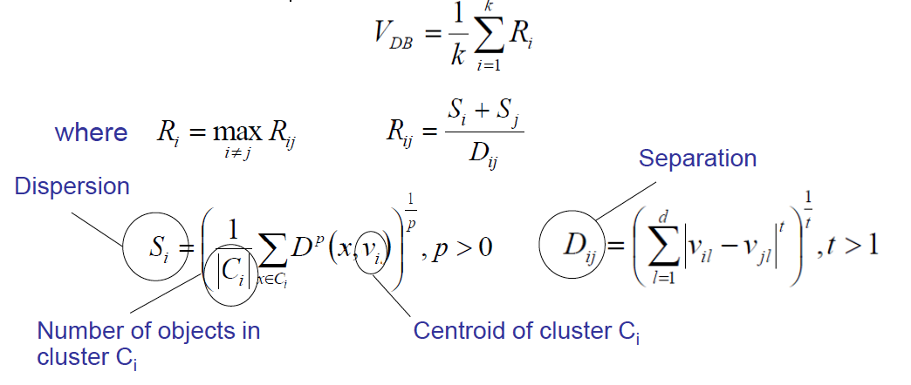

Feature by feature we sum all values of objs belonging to the same cluster and we transmit also the number of objects we consider.

In the reducer we aggregate this information summing all Vi of the same cluster and dividing for the \#objs.

**Reduce Function**

The input of the reduce function is the data obtained from the combine function of each host.

The data includes partial sum of the samples in the same cluster and the sample number.

The reduce function:

-   sum all the samples and compute the total number of samples assigned to the same cluster

-   compute the new centers which are used for the next iteration, dividing for the number of objects in the cluster


The output is the list of centers of the clusters.

All mappers can be executed in parallel because we just compute the distance of the objects in the chunks and centers.

We can execute combiners in parallel, after waiting for the end of the mappers.

Reducers can be executed in parallel because related to different clusters.

The real effort is in the computation of the distance of objs and centers, mappers spend a lot of time while reducers are very fast.

We have the same results as a sequential k-means.

But we have advantages in terms of computational time.

Speedup: measures how much a parallel algorithm is faster than a corresponding sequential algorithm.


With the increase of the number of nodes we are able to increase the speed-up, obtaining a faster execution than the sequential one.

We expect theoretically to have a linear increase, but we have overhead due to the transmission of data, activation of mappers/reducers, reallocation of data structures.

But we can appreciate to be close to the optimal solution, with 8GB of datasets especially.

When coping with large datasets we have a good improvement.

If the dataset is small the overhead weights more in terms of speed-up, because we need a short time to process the dataset and the overhead affects a lot the performance.

Another metric is the Scaleup: holds the number of computers in the system constant and grows the size of the datasets by the factor m. Sizeup measures how much longer it takes on a given system, when the dataset size is m-times larger than the original dataset.


We have a reduction in time when we increase the size of the dataset, and we have available a higher number of nodes.

**Parallel FP-Growth (PFP)**

It shards a large-scale mining task into independent, parallel tasks. PPF then uses MapReduce to take advantage of its recovery model. Empirical study shows that PFP achieves near-linear speedup.

FP-Growth first computes a list of frequent items sorted by frequency in descending order (F-List) during its first database scan.

In its second scan, the database is compressed into a FP-tree. Then FP-Growth starts to mine the FP-tree for each item whose support is larger than minsup by recursively building its conditional FP-tree.

The algorithm performs mining recursively on FP-tree.

The problem of finding frequent itemsets is converted to constructing and searching trees recursively.

We here have several steps in which we use map/reduce functions.

We use map/reduce tasks in several steps.


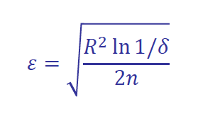
# Data Mining and Machine Learning

We have an explosive growth of data, now we talk about petabytes and a nowadays problem is how to store this data and analyze them.

Most of the algorithms we have today were proposed 40 years ago but today we have a lot of data and the possibility to store and analyze this data, thanks to storage and computational capabilities. This is why today AI is becoming fundamental.

This data comes from different sources and when we analyze them we want to produce value.

# Data Mining and Knowledge Discovery

Data Mining, from a meaning point of view, is the extraction of interesting (non-trivial, implicit, previously unknown and potentially useful) patterns or knowledge from huge amount of data. Alternatives name are knowledge discovery (mining) in databases (KDD), knowledge extraction, data/pattern analysis, data archeology, data dredging, information harvesting, business intelligence, etc.

# Business Intelligence Process

A typical data mining process that can be found in Business Intelligence (analysis in a company) is this one:


We take data from different sources and we preprocess data to remove noise, missing values and we integrate different sources creating the dataset. Results depend on the preprocessing phase.

We do statistical summary, querying and reporting and then start the real data mining process.

We have to visualize the result in a way that are understandable for everyone.

All knowledge extracted are used by management to perform strategical decisions.

# Statistical and Machine Learning Process

From a statistical and machine learning point of view this is the process:


The decision on choosing the right algorithm depend on the specific application, we have to identify the best algorithm for the particular context.

We have to define some metrics to give the possibilities to the designer to identify the best solution. We have to compare the results produced by our data mining algorithms and we need a metric to do that.

When we talk about data we talk about heterogeneous data and we have different types of data that are typically stored in different repositories.

Most of the data mining algorithms are based on the concept of distance. But if objects are described by numerical or nominal attributes is hard to use distance.

# Types of Data and Patterns

We have different kind of knowledge that can be mined, it depends on the specific domain.

What kind of data we can mine? Data stored in databases (relational databases, data warehouse or transactional databases), data streams and sensor data, time series data, temporal data, sequence data, structure data, graphs, social networks, multi linked data, the www, text databases, multimedia databases and so on.

## Patterns that can be mined

We have frequent pattern analysis, for example items frequently purchased together by an high number of customers.
In this case, the dataset to analyze is the transactional dataset, the bill with product's purchases.
The patter in this case is a subset of products.

Once we mine the frequent pattern we can produce association rules, that are used to find correlations between data sets. They are ideally used to explain patterns in data from seemingly independent information repositories.
We observe that an high number of customers bought together Diaper and Beer, this is a frequent pattern and we can investigate the association rule where an item imply another and what's the probability that the second item is purchased buying the first item.
Diaper -> Beer [0.5%, 75%] (support, confidence)
The support is the frequency, express how many transactions support the pattern in all the transactions.
The confidence express how much is the probability that purchasing diaper, the customer will purchase beer.

# Evaluation of results

Between all association rules we need to find the best rules, having some metrics to evaluate the results.
In frequent pattern we want to understand if two items are purchased together.
In frequent sequence we want to understand in different transactions if a sequence is repeated.

# Classification and label prediction

Classification and label prediction is a problem that consists on constructing models based on some training examples, we have to have some samples in which we know the label associated.
Starting from this training set, the classification algorithm learn how to classify other records.
In classification the output is a label, while in prediction the output is a numeric value.

# Unsupervised learning

In unsupervised learning the class label is unknown. In cluster analysis, in particular, we group data to form new categories, cluster houses to find distribution patterns.
Principle: Maximizing intra class similarity & minimizing interclass similarity.

# Outlier analysis

An outlier is a data object that does not comply with the general behavior of the data. Outlier analysis is important to determine outliers.
Useful in fraud detection or rare events analysis.
Sequence, trend and evolution analysis, but also mining data streams are other possible uses.

# Graph Mining and Information network analysis

Graph Mining consists in finding frequent subgraphs, trees or substructures on data.
Information network analysis consists in analyzing social network and web mining consists in analyzing web information networks.

# Post-processing phase

The post-processing phase is used to understand between all knowledge which are relevant for use, not all mined knowledge are interesting.

# Data Mining and multiple disciplines


# High-dimensionality and high-complexity of data

Today we have a tremendous amount of data and we have high-dimensionality data, objects described by a high number of dimensions. With the increase of dimensionality objects appear far from each other.
Most of algorithms are based on the concept of distance.

We can change the algorithm or we can try to reduce the number of dimensions, in high-dimensionality some algorithms do not work properly. We have also high-complexity of data.


# Major issues in data mining

The major issues in data mining are mining methodology, efficiency and scalability, diversity of data types, user interaction and impacts on society.


# Data

We have different types of data sets: relational records, data matrix, numerical matrix, crosstabs (that displays the frequency distribution of the variables), document data (a term-frequency vector that displays the frequency of occurrence of terms in the document) transaction data, graph and networks, video data, temporal data, sequential data, spatial data (maps) and image data.

# Important Characteristics of Structured Data:

-   Dimensionality
-   Sparsity
-   Resolution
-   Distribution

A data object represents an entity. Data objects are described by attributes.

An attribute (feature, dimension, variable) is a data field, representing a characteristic or feature of a data object.

#  Types of attributes

Attributes can be of different types:

- __Nominal or categorical__ attributes, can have as possible values a finite number of labels.

    ```
    Hair_color = {auburn, black, blond, brown, grey, red, white}
    ```

- __Binary attributes__, which are nominal attributes with only two states and can be:

    - __symmetric binary__; both outcomes equally important (ex. Gender)

    - __asymmetric binary__: outcomes not equally important (ex. Medical test, positive can have a more important outcome, we assign 1 to it for convention)

- __Ordinal attributes__ are categorical values that have a meaningful order but magnitude between successive values is not known.

    ```
    Size = { small, medium, large }
    ```

    > In computing the distance in ordinal attributes it is possible to create a graduation, different than nominal attributes.

- Quantity, integer or real-valued, that can be:

    -   Interval, measured on a scale of equal-size units. Values have order. There's no zero point and that implies that division makes no sense. e.g. temperature in C° or F°, calendar dates.

    -   Ratio, they have a zero point and it is possible to perform division.

Another difference is in:

- __discrete attributes__, that have only a finite or countably infinite set of values.

- __continuous attributes__, that has real numbers as attribute values.

# Basic Statistical Descriptions of Data

We can describe in a statistical way our data and visualize the distribution of data to better understand the data, and see if we have some central tendency, some variation and spread.

If we can see similar attributes we can eliminate one of them because it's not relevant in the data mining process.

We have different data dispersion characteristics: median, max, min, quantiles, outliers, variance, etc.

In a summarized way we can see the statistics with the box plot or quantile analysis.

# Measuring the central tendency

- To measure the central tendency we usually use the __mean__, which algebraic definition is:

    $$
        \bar{x} = \frac{1}{N}\sum_{i=1}^{N}x_i
    $$

    where $N$ is sample size.

    This is the mean along a singole attribute.

- the __weighted arithmetic mean__ where we associate a weight to a specific value:

    $$
        \bar{x} = \frac{\sum_{i=1}^{N}w_ix_i}{\sum_{i=1}^{N}w_i}
    $$

- we also have the **trimmed mean**, obtained by chopping out extreme values (for instance the top and bottom 2% before computing the mean, they're outliers).

## median

Another statistic value is the **median**, which is the middle value if odd number of values, or average of the middle two values otherwise.

> It is an holistic measure: it must be computed on the entire dataset as a whole.

It can be heavy from a computational point of view, so sometimes it is estimated by interpolation (for grouped data).

The estimation can be computed in this way:

$$
    median = L_1 + \left(\frac{\frac{N}{2}-\sum{freq_i}}{freq_{median}}\right) width
$$

- $L_1 :=$ lower boundary of the median interval, that is the interval where we expect to have the median value.
- $freq_{median}:=$ is the frequency of the median interval
- $N$ the number of values in each interval on the x-axis.

### procedure

We first identify the interval in which the median value is located by subtracting the total number of values before this interval from N/2.

Then, we divide this result by the frequency of values in the median interval.

This estimation is based on the assumption that the values within the median interval are uniformly distributed.

## mode

Another statistical value to measure the central tendency is the **mode**, the value that occurs most frequently in the data. It can be unimodal, bimodal or trimodal.

The empirical formula is :

$$
    mean - mode = 3 \times (mean - median)
$$

## usage

Using mean, median and mode we can see something about the distribution of data, we can say if it is symmetric or positively/negative skewed.

Watching their order we can see if their distribution is symmetric or skewed.

|positively skewed|symmetric|negatively skewed|
|-|-|-|
||||

# Measuring the Dispersion of Data

## Quartiles

Quantiles are a way to measure the dispersion of data. 

The k-th percentile, such as:
- the 25th percentile (Q1) 
- 75th percentile (Q3) 
- 50th percentile (median) 

are used to divide a set of data into equal groups. 

The Interquartile Range (IQR) is calculated as the difference between the third and first quartile (Q3 - Q1) and represents the range in which 50% of the data falls.

## Boxplot analysis

These quartiles are useful because they allow us to represents the distribution of data with boxplots.

They are a visual representation of the distribution of data and in this we exploit the five number summary of a distribution: Minimum, Q1, Median, Q3, Maximum.


- $IQR:=$ height
- $Whiskers:=$ (the two lines) are the minimun and the maximum

### outliers

We sometimes have marked points in the representation which are __outliers__, points beyond a specified outlier threshold, plotted individually (usually, a value higher/lower than 1.5 x IQR).

### Boxplots allow us to compare distributions.

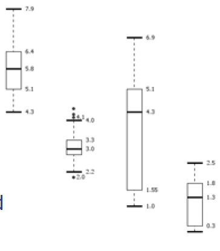

- The second distribution is very concentrated, we can imagine it with a peak.
- The third is more sparse.
- The median value of the third box plot is higher than the second's.


## standard deviation

To measure the dispersion of data we can also use variance and standard deviation.

$$
    Standard deviation := \sigma \\ 
    Variance := \sigma^2 := \frac{1}{N}\sum{x_i -\bar{x}}^2 
$$

# Graphic displays of basic statistical descriptions

We have different graphic displays of basic statistical descriptions:

- __Boxplot__ : graphic display of five number summary
- __Histogram__ : x axis are values, y axis represents frequencies os that values
- __Quantile plot__ : each value xi is paired with fi indicating that approximately 100 fi % of data are lower than or equal to xi (\<= xi)
-   __Quantile quantile (q-q) plot__ : graphs the quantiles of one univariant distribution against the corresponding quantiles of another
-   __Scatter plot__ : each pair of values is a pair of coordinates and plotted as points in the plane

## Histogram Analysis

The Histogram is a graph display of tabulated frequencies, shown as bars.

x axis are values, y axis represents frequencies os that values.

It shows what proportion of cases fall into each of several categories.


Differs from a bar chart in that it is the area of the bar that denotes the value, the frequency corresponding to that interval, not the height as in bar charts, a crucial distinction when the categories are not of uniform width.

If we use the same width, the height corresponds to the value.

The categories are usually specified as non overlapping intervals of some variable. The categories (bars)must be adjacent.

Two distributions may have the same boxplot representation, because they have same values for: min, Q1, median, Q3, max, but they have rather different data distributions.

Histograms often tell more than boxplots.

## Quantile plot

A quantile plot is a graph that shows the distribution of a dataset by plotting quantiles against an axis. 

The x-axis typically represents the quantiles of the data, while the y-axis represents the corresponding observations.


## Quantile-Quantile (Q-Q) Plot

A Quantile-Quantile (Q-Q) plot is a type of quantile plot that compares two probability distributions by plotting their quantiles against each other. It is used to check for similarity between two datasets. It is also known as a probability plot.


## Scatter Plot

The scatter plot provides a first look at bivariate data to see clusters of points, outliers, etc. The point will be displayed with two features. Each pair of values is treated as a pair of coordinates and plotted as points in the plane.


We can deduce some conclusion about the scatter plot, the two variables are positively correlated if we can see scatters like this,

|positively correlated|negatively correlated
|-|-|
|||

|non-linear|uncorrelated|
|-|-|
|| 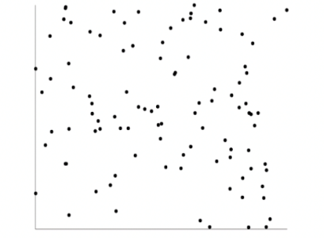|

# Data Visualization

It's important to show in a proper way the results we obtain to:
- gain insight into an information space
- provide qualitative overview of large data sets
- search for patterns, trends, structure, irregularities, relationships among data, 
- help find interesting regions and suitable parameters for further quantitative analysis
- provide a visual proof of computer representations derived from data

If we have only 2 or 3 dimensions is easy to visualize the data but if we have more than 3 dimensions it's really complex.

## Categorization of visualization methods:

- [Pixel oriented](#pixel-oriented-visualization-techniques)
- Geometric projection
- Icon based
- Hierarchical
- Visualizing complex data and relations

## Pixel-Oriented Visualization Techniques

For a data set of $m$ dimensions, create $m$ windows on the screen, one for each dimension. The m dimension values of a record are mapped to m pixels at the corresponding positions in the windows.

Each pixel corresponds to an object and on each window we see the value for each attribute.

The colors of the pixels reflect the corresponding values; if the color corresponds to white the value is lower, otherwise it's greater.


Income and age are not correlated, while income and credit limit have a strong correlation.

## Geometric Projection Visualization Techniques

These are visualization of geometric transformations and projections of the data.

## Scatterplot and scatterplot matrices

We generate a matrix where we consider one attribute in the row of the matrix and we compare it with all others that correspond with the columns of the matrix.

The matrix is symmetric and in the diagonal we're comparing the same attributed so we have lines.

With an high number of attributes this matrix is really complex to analyze.


# Parallel Coordinates

In Parallel Coordinates we have $n$ equidistant axes which are parallel to one of the screen axes and correspond to the attributes.

Every data item corresponds to a polygonal line which intersects each of the axes at the point which corresponds to the value for the attribute.

The axes are scaled to the $[minimum, maximum]$: range of the corresponding attribute.

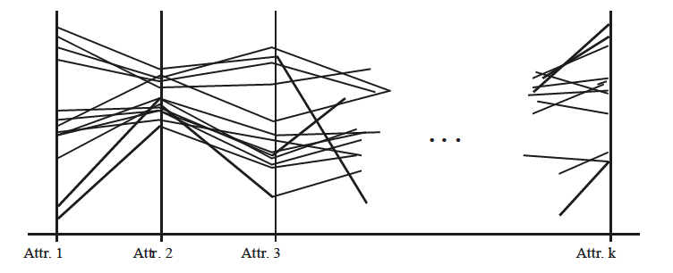

Depending on the dispersion of these polygonal lines we can understand a lot.

## Icon-based Visualization Techniques

Typical visualization methods are Chernoff Faces and Stick Figures.

General techniques are:
- __Shape coding__ : Use shape to represent certain information encoding
- __Color icons__ : Use color icons to encode more information
- __Tile bars__ : Use small icons to represent the relevant feature vectors in document retrieval

### Chernoff Faces

It's a way to display variables on a two-dimensional surface, e.g., let x be eyebrow slant, y be eye size, z be nose length, etc.

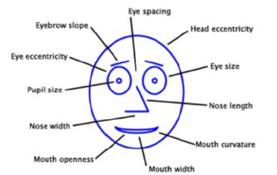

### Stick Figure

It's a very simple type of drawing made of lines and dots, often of the human form or other animals. 

Two attributes of the data are mapped to the display axes and the remaining attributes are mapped to the angle and/or length of the limbs and texture patterns in the visualization how certain data characteristics.


### Tile Bar

uses rectangles corresponding to documents.

The query is specified in terms of k topics, one topic per line, called term sets.

Columns in rectangles correspond to document segments.

A square corresponds to a specific term set in a specific text segment.

The darkness of a square indicates the frequency of terms in the segment from the corresponding TermSet. If the color is white the frequency is zero, while, if it's dark we have an high frequency.

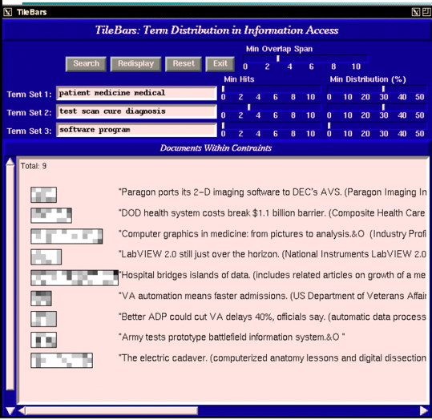

## Hierarchical Visualization Techniques

Visualization of the data using a hierarchical partitioning into subspaces. We have different methods.

### Dimensional Stacking

Partitioning of the n-dimensional attribute space in 2-D subspaces, which are 'stacked' into each other.

Partitioning of the attribute value ranges into classes. The important attributes should be used on the outer levels.

Adequate for data with ordinal attributes of low cardinality, but difficult to display more than nine dimensions.


The idea is to start with the most important attribute and just split the attribute value ranges, identified by bold lines, and inside bold rectangles and doing the same with attribute 2 we have two more attributes inside. The same with the ones inside.

For example the circled one has the highest value for attribute 1, almost the middle value for attribute 2 and then we can go inside and continue the stack.

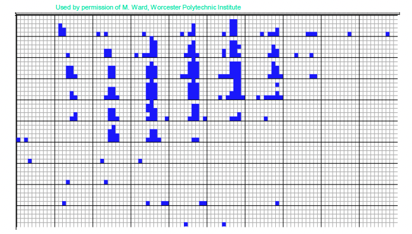

This is an example of visualization with longitude and latitude mapped to the outer x-, y-axes and ore grade and depth mapped to the inner x-, y-axes.

### Tree-Map

This is another hierarchical approach and uses a hierarchical partitioning of the screen into regions depending on the attribute values.

The x and y dimension of the screen are partitioned alternately according to the attribute values classes.

The area represents the portion we have. Example: an overview of the organization of file and directory


### InfoCube

This is a 3D visualization technique where hierarchical information is displayed as nested semi-transparent cubes.

The outermost cubes correspond to the top level data, while the sub-nodes or the lower level data are represented as smaller cubes inside the outermost cubes, and so on.


### Tag Cloud

With non-numerical data, for example text and social networks, we usually use tag cloud.

Depending on the size and color of this tag we can express the frequency of the tag in the document.


# Measuring Data Similarity and Dissimilarity

- __Similarity__ is a numerical measure of how alike two data objects are.

    Value is higher when objects are more alike and often falls in the range \[0,1\].

- __Dissimilarity__ (e.g., distance) is a numerical measure of how different two data objects are.

    The value is lower when objects are more alike.

    Minimum dissimilarity is often 0, while upper limit varies. Distance has like un unlimited maximum value.

- __Proximity__ refers to a similarity or dissimilarity.

    Data could be represented with objects with several features.

## From the data matrix...

The matrix is called **data matrix** and it is composed by n data points with p dimensions.

| <!-- -->  | <!-- -->      |<!-- -->       |<!-- -->   |<!-- -->   |
|-          |-              |-              |-          |-          |
|$x_{11}$   |               |$\dots$        |           |$x_{1p}$   |
|$\vdots$   |               |$\ddots$       |           |$\vdots$   |
|$x_{n1}$   |               |$\dots$        |           |$x_{np}$   |

## ...to the dissimilarity matrix

In a dissimilarity matrix, each cell in the matrix represents the dissimilarity between the two objects corresponding to the row and column of that cell. 

The matrix is symmetric. Additionally, the diagonal of the matrix is filled with 0s as the dissimilarity between an object and itself is always 0.

| <!-- -->  | <!-- -->  |<!-- -->   |<!-- -->   |<!-- -->   |
|-          |-          |-          |-          |-          |
|0          |           |           |           |           |
|$d(2,1)$   |0          |           |           |           |
|$\vdots$   |$\vdots$   |0          |           |           |
|$d(n,1)$   |$d(n,2)$   |$\dots$    |$\dots$    |0          |

It's easy to compute distance with objects represented by numerical attributes.

We also have to be able to measure proximity for nominal attributes.

## dissimilarity matrix for nominal attributes

Nominal attributes can take 2 or more states, without any order.

- __simple matching__

    > Let’s suppose that $p$ is the total number of attributes and $m$ is the number of matches
    $$
        d(i,j) = \frac{p-m}{p}
    $$

    If we don't have matches the distance is always 1, when we have all matches is 0.

- A second method is to __use many binary attributes__ instead of nominal attributes. The number used will be the number of levels of the nominal attributes.

    ```py
    # object described by eye color and hair color

    eyeColor = {"black", "green", "blue"}
    hairColor = {"auburn", "black", ...}

    i = {"eyeBlack", "eyeGreen", "eyeBlue", "hairAuburn", "hairBlack" ...}
    ```

    Then we apply the distance between objects represented by binary attributes.

- You can __use integers__, but you have to be use to not use the integer distance, because it doesn't mean 0 is close to 1 if you assign integers randomly.

    But now we must define how to compute the distance between objects with binary attributes.

    When we have to do with binary attributes, we usually use a **contingency table**, we have two objects, I and j, described with p binary attributes.

    |               ||$object \ j$  |       |       |
    |          -    |-      |-      |-      | -     |
    |               |       |1      |0      |sum    |
    |               |1      |q      |r      |q+r    |
    |$object \ i$   |0      |s      |t      |s+t    |
    |               |sum    |q+s    |r+t    |p      |
    
    Label q is the number of attributes in which we have 1 in the object I and the object j. It is the number of matches of value 1. R represents the number of attributes in which I has value 1 and j has value 0.

    S represents the number of attributes in which I has value 0 and j has value 1.

    T represents the number of attributes in which I and j has value 0.

    If objects are equal the matrix has to be diagonal.

## Distance measure for symmetric binary variables

$$
    d(i,j) = \frac{r+s}{q+r+s+t}
$$

A binary variable is symmetric if both of its states are equally valuable and carry the same weight, if 0s and 1s are frequently equal, the probability to have them is the same.

The numerator of this ratio contains the number of attributes in which we have different values for binary attributes. It is higher more the two objects are distant.

## Distance measure for asymmetric binary variables:

$$
    d(i,j) = \frac{r+s}{q+r+s}
$$

In this case we have that a value is more probably than another value.

T represents the number of attributes in which we have in I and j value 0, but this is the most probably value, so the probability of t is very high.

In case of asymmetric binary value is very high I respect of q, r and s.

The distance could be very small if we use t and we avoid this phenomenon not considering t.

## Jaccard coefficient

a meause for symmetric binary variables

$$
    sim_{Jaccard}(i,j) = \frac{q}{q+r+s}
$$

This is the same as __coherence__, that can be calculated in this way.

The support on I and j is the number of attributes in I and j in which we have value 1, and the same for other supports.

$$
    coherence(i,j) = \frac{sup(i,j)}{sup(i)+sup(j)-sup(i,j)} = \frac{q}{(q+r)+(q+s)-q}
$$

For example:

|Name   |Gender |Fever  |Cough  |Test-1 |Test-2 |Test-3 |Test-4 |
|-      |-      |-      |-      |-      |-      |-      |-      |
|Jack   |M      |Y      |N      |P      |N      |N      |N      |
|Mary   |F      |Y      |N      |P      |N      |P      |N      |
|Jim    |M      |Y      |P      |N      |N      |N      |N      |

Gender is a symmetric attribute, and the remaining attributes are asymmetric binary. Let the values Y and P be 1, and the value N be 0 (use only asymmetric values). We don't consider t.

$$
    D(Jack, Mary) = \frac{0+1}{2+0+1} = 0.33 \\ \ \\
    D(Jack, Jim) = \frac{1+1}{1+1+1} = 0.67 \\ \ \\
    D(Jack, Mary) = \frac{1+2}{1+1+2} = 0.75 
    
$$

# Standardizing Numeric Data

Before computing dissimilarity between numerical data we sometimes try to normalize data. We would like the attributes to vary between similar intervals.

## Euclidean distance (L2 norm) is defined like:

$$
    d(i,j) = \sqrt{(x_{i1}-x_{j1})^2 + \dots (x_{iN}-x_{jN})^2}
$$

It can be applied only on numerical data.

If one feature is in a large interval it will dominate others in the computation of the Euclidian distance.

## The z-score

$$
    z = \frac{x-\mu}{\sigma}
$$

- $x:=$ raw score to be standardized
- $\mu:=$ mean of the population
- $\sigma:=$ standard deviation

We subtract the mean value and we divide by the standard deviation, so that if data is dispersed the standard deviation is large.

It is negative when the raw score is below the mean, "+" when above

## mean absolute deviation

$$
    s_f = \frac{1}{N}(|x_{1f} - m_f| + |x_{2f} - m_f| + \dots + |x_{Nf} - m_f|) \\ \ \\
    m_f = \frac{1}{N} (x_{1f} + \dots + x_{Nf})    
$$

And in that case we calculate the standardized measure (z-score):


$$
    z_f = \frac{x_{if}-m_f}{s_f}
$$

> Using mean absolute deviation is more robust to outliers than using standard deviation.

## Minkowski distance

$$
    d(i,j) = \sqrt[h]{(x_{i1}-x_{j1})^h + \dots (x_{iN}-x_{jN})^h}
$$

Properties:

- $d(i,j) \gt 0$ if $i \neq j$, and $d(i,i) = 0$ (Positive definiteness)
- $d(i,j) = d(j,i)$ (Simmetry)
- $d(i,j) \geq d(i, k) + d(k, j)$ (Triangle Inequality)

A distance that satisfies these properties is a metric from a mathematical point of view.

From it we can derive the 
- __Manhattan distance__ with $h = 1$ (L1 norm):
- __Euclidean distance__ with $h = 2$ (L2 norm):
- __Supremum distance__ with $h \to \infty$ (Lmax norm):


Taking the following example we can see that values change but the relations remain similar.

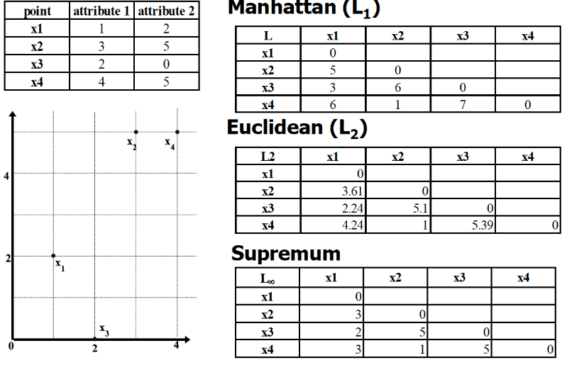

## Ordinal variables

An __ordinal variable__ is similar to a categorical variable. The difference between the two is that there is a clear ordering of the variables.

```
    { small, medium, large } = { 1 , 2 , 3 }
```

It can be treated like interval scaled.

-  we replace each value $x_{if}$ with their rank
-  map the range of each variable onto $[0, 1]$ by replacing $i-th$ object in the $f-th$ variable by

$$
    z_{if} = \frac{r_{if}-1}{M_f-1}
$$

where $M_f$ is the maximum number of rank levels.

```
{ small, medium, large } = { 0 , 0.5 , 1 }
```

And now we can compute the dissimilarity using methods for interval scaled variable. 

## Attributes of Mixed Type

We discussed how to compute the dissimilarity between objects described by attributes of the same type, where these types may be either *nominal*, *sym- metric binary, asymmetric binary*, *numeric*, or *ordinal*. However, in many real databases, objects are described by a *mixture* of attribute types.

One approach to compute the dissimilarity between objects of mixed attribute types is to group each type of attribute together, performing separate data mining.

However, in real applications, it is unlikely that a separate analysis per attribute type will generate compatible results.

A more preferable approach is to process all attribute types together, performing a single analysis. 

Bringing all of the meaningful attributes onto a common scale of the interval $[0.0, 1.0]$.

- Suppose that the data set contains $N$ attributes of mixed type. 
- The dissimilarity $d(i,j)$ between objects is defined as:

$$
    d(i,j) = \frac{\sum_{f=1}^N \delta_{ij}{(f)} \delta_{ij}{(f)}}{\sum_{f=1}^N \delta_{ij}{(f)}}
$$

where the indicator $\delta_{ij}^{(N)} = 0$ if:

- $x_{if}$ or $x_{jf}$ is missing or
- $x_{if} = x_{jf} = 0$ and attribute $f$ is asymmetric binary

otherwise $\delta_{ij}^{(N)} = 1$

<!-- TODO: finish this -->

## cosine similarity

$$
    cos(d_1, d_2) = \frac{d_1 \cdot d_2}{||d_1|| \ ||d_2||} 
$$

ex:

```js
d1 = [5,0,3,0,2,0,0,2,0,0]
d2 = [3,0,2,0,1,1,0,1,0,1]

d1 * d2 = 25
||d1|| = 6.481 
||d2|| = 4.12

cos(d1, d2) = 0.94
```
# Preprocessing

Measures for __data quality__: A multidimensional view

1.   Accuracy: correct or wrong, accurate or not
2.  Completeness: not recorded, unavailable, \...
3.   Consistency: some modified but some not, dangling, ....
-   Timeliness: timely update?
-   Believability: how trustable the data are correct?
-   Interpretability: how easily the data can be understood? 

Major Tasks in __Data Preprocessing__ are:

-   __Data cleaning__: fill in missing values, smooth noisy data, identify or remove outliers, and resolve inconsistencies

-   __Data integration__: integration of multiple sources of data to create a unique dataset.

-   __Data reduction__: reduce the size of data set and the number of dimensions without jeopardizing the data mining results?

    -   __Dimensionality reduction__: data encoding schemes are applied to obtain a compressed representation of the original data. It can be done with different techniques, like Compression techniques, Attribute subset selection or Attribute construction.

    -   __Numerosity reduction__: smaller representations using parametric models (regression models) or nonparametric models (cluster, sampling, ecc.) Reducing the number of objects helps us to reduce the complexity of the problem and speed-up the execution.

-   __Data transformation and data discretization__: Data transformation includes normalization to make attributes value vary on the same interval.Discretizion is needed to transform a numerical value into a nominal value for applying some algorithms proposed in the lecterature. e.g. Age

# Data Cleaning

Data in real world is dirty.

- __Incompleteness__: some values are missing. If we compute a distance with a missing value, the calculation is not reliable, we have a random value.
- __Noise__: containing noise, errors, outlier. For example signals generated by sensor affected by noise. We get a signal with a ripple.
- __Inconsistency__: In some datasets we can have inconsistency, for example we can have an age attribute that is not consistent with the birthday value.
- __Intentional__: we can also have intentional missing data.

## Missing data

For handling __missing data__ we can:

- __ignore the tuple__. This solution is possible only if the % of missing values per attributes is low.
- __fill the missing values manually__, but not possible if you have a big amount of data.

- __fill in it automatically__ with:

    - a global constant, e.g. unknown
    - the attribute mean of all samples
    - the attribute mean for all samples belonging to the same class used when we have to work with classification.
    - the most probable value: to get this, one approach is to infers the missing value.

> But in any case, we need to handle the missing value.

## Noise

Another problem is __noise__: random error or variance in a measured variable. The noise affects the result we can produce with our model, so we have to work with it.

We need to be careful to not remove information when applying techniques.

## Smoothing filters

It performs a smoothing action to the signal. With smoothing the data points of a signal are modified so that individual points that are higher than the immediately adjacent points (presumably because of noise) are reduced, and points that are lower than the adjacent points are increased.

The most popular smoothing algorithm is the __rectangular or unweighted sliding-average smooth__.

We replace each point in the signal with the average of $m$ adjacent points, where $m$ is a positive integer called the smooth width. 

ex:

$$
    S_j = \frac{Y_{j-1}+Y_{j}Y_{j+1}}{3}
$$

We can use another value and the value of the width affects the result. If I consider a very high width, we have a big smooth but the signal becomes flatter, we may change the information in the signal even if we eliminate the noise.

|original|11 points moving| 51 points|
|-|-|-|
|||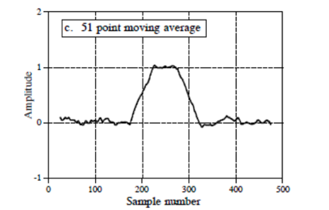|

### considerations

- With 11 we consider 5 points in the left and 5 on the right and the function is smoothed. A first consideration is that we are considering that the signal's frequency is lower of the noise.
- we have to be careful to the width of the rectangular filter.
- if the underlying function is a constant, or is changing linearly with time (increasing or decreasing), then no bias is introduced into the result. A bias is introduced, however, if the underlying function has a nonzero second derivative. At a local maximum, for example, moving window averaging always reduces the function value.

## Savitzky-Golay Smoothing Filter

That is a generalization of the rectangular filter. Instead of using a constant as we made with the rectangular filter we use coefficients.

In general, the simplest type of digital filter (the non-recursive or finite impulse response filter) replaces each data value $Y_j$ by a linear combination $S_j$ of itself and some number of nearby neighbors

$$
    S_j = \sum_{n=-n_L}^{n_R}{c_n Y_{j+n}}
$$

where $_L$ is the number of points used "to the left" of a data point i, i.e., earlier than it, while $n_R$ is the number used to the right, i.e., later.

We compute this weighted sum where n is negative or positive depending on the samples we are considering.

We consider some samples of the right and some on the right and compute this linear combination.If you replace every coefficient with the following, we get exactly the rectangular filter.

$$
    c_n = \frac{1}{n_L + n_R + 1}
$$

where $n_L$ is the number of points used "to the left" of a data point i, i.e., earlier than it, while $n_R$ is the number used to the right, i.e., later.

Using a generic $c_n$ gives us more flexibility.

#### Diffences between Savitzky-Golay and rectangular filters

With the rectangular filter samples inside the window are approximated using a line parallel to the horizontal line.

With the Savitzky-Golay approach we don't use a line but a polynomial function. Inside the window we consider a more complex function.

The idea of Savitzky-Golay filtering is to find filter coefficients cn to approximate the underlying function within the moving window not by a constant (whose estimate is the average), but by a polynomial of higher order, typically quadratic or quartic.

### How can we estimate $c_n$ considering the function we selected?

A typical approach is to apply a __least-square method__, in which we define the function that approximates better the points inside the window.

It's computational heavy to compute for each sample the least-square to find the approximation function.

We have to work in real-time because we receive samples and we have to apply it. We don't have much time to apply the smoothing filters.

But Savitzky-Golay demonstrated that __there's no need to compute the least-square for each sample__ but __coefficients can be computed offline__.

For each point $Y_i$, we least-squares fit a polynomial to all $n_L +n_R + 1$ points in the moving window, and then set $S_i$ to be the value of that polynomial at position $i$.

In the original paper we can find this table:


In this table we see that once fixed $M$ (the degree of the polynomial) $n_L$ and $n_R$, we have the coefficients to be used in the formula.

We just pick up coefficients and apply the filter.


#### results

- this filter reduces the height of the peak.
- the width we use in the window is lower than the width in peak in the first case. In the second case the width of the window is approximately the same as the width of the peak.
- we need to decide the width of the window dependently on the width of the peak.

In the second sample the height is not reduced because we don't use an approximation with a line like in the first example, but we use polynomial and that means we can approximate more the samples inside.

But we have more ripple inside the signal.

The larger the smooth width, the greater the noise reduction, but also the greater the possibility that the signal will be distorted by the smoothing operation.

The optimum choice of smooth width depends upon the width and shape of the signal and the digitization interval.

#### smoothing ratio

For peak-type signals, the critical factor is the *smoothing ratio*, the ratio between the smooth width and the number of points in the half-width of the peak. In general, increasing the smoothing ratio improves the signal-to-noise ratio but causes a reduction in amplitude and an increase in the bandwidth of the peak.

- ex:

    

    We can apply the smoothing filter with a width of 7, where we have a reduction of the noise but the height of the peak is reduced and it is larger.

    We can see that if the ratio increases the amplitude of the peak decreases and the width of the peak increase.

    In general, if the objective of the measurement is to measure the true peak height and width, then smooth ratios below 0.2 should be used.

    While, if the objective of the measurement is to measure the peak position (x-axis value of the peak), much larger smoothing ratios can be employed if desired, because smoothing has no effect at all on the peak position (unless the increase in peak width is so much that it causes adjacent peaks to overlap).

    The position of the peak does not change in fact.

### When should you smooth a signal?

1. for cosmetic reasons, to prepare a nicer-looking graphic of a signal for visual inspection or publication.

2. if the signal will be subsequently processed by an algorithm that would be adversely affected by the presence of too much high-frequency noise in the signal

    > We need to be careful when we have some peaks.

3. In outlier detection it can be used to remove outliers and let them become normal points.

### When should NOT you smooth a signal?

1. Smoothing will not significantly improve the accuracy of parameter measurement by least-squares measurements between separate independent signal samples

2. All smoothing algorithms are at least slightly _lossy_, entailing some change in signal shape and amplitude

3. It is harder to evaluate the fit by inspecting the residuals if the data are smoothed, because smoothed noise may be mistaken for an actual signal

4. Smoothing the signal will seriously underestimate the parameters errors predicted by propagation-of-error calculations and the bootstrap method.

### Binning

Another way to handle noisy data is to use another technique which is __binning__.

It consists in smooth a sorted data value by consulting its neighborhood.

We have to first sort data eand partition into (equal-frequency) bins, intervals with the same number of values, then one can smooth by bin means, smooth by bin median, smooth by bin boundaries, etc.

```py

Sorted_data_for_price = [4,8,15,21,21,24,25,28,34]

# Partition into (equal frequency) bins:
bin_1: [4,8,15]
bin_2: [21,21,24]
bin_3: [25,28,34]

# Smoothing by bin means:
bin_1: [9,9,9]
bin_1: [22,22,22]
bin_1: [29,29,29]

# Smoothing by bin boundaries:
bin_1: [4,4,15]
bin_2: [21,21,24]
bin_3: [25,25,34]
```

By using bin boundaries, we approximate values to the closest boundary.

The effect we obtain is like the effect of smoothing.

## Other smoothing techniques

- __Regression__: smooth by fitting the data into regression functions. Re replace the original values with values along the line that approximate these values.
    -   Linear regression (two attributes)
    -   Multiple linear regression (multiple attributes)
- __Clustering__, but we need to first detect and remove outliers because if they get inside clusters they can change dramatically the result. We need to apply clustering imposing constraints.

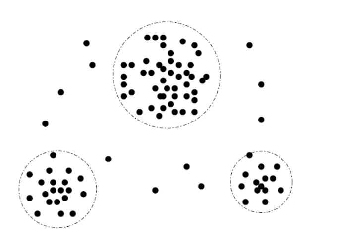

Today most of the data are collected with sensors and it's important to approach the noise reduction. 

We assume that our signal is characterized by a low frequency and our noise by a high frequency and that's why we can use smoothing filters.

# Data cleaning as a process

Tipically we have different sources of data and some of them are real databases.

We have to clean data otherwise using machine learning techniques we find ourself in trouble, otherwise we have strange results and we don't know the reason.

### Detect discrepancies in the data 

- __metadata__, that describe the domain, the range, the dependency and the distribution of the data. We can associate at the value of the attribute these information, in this way we can analyze if we have some values that do not correspond to the domain, for example.

- __check field overloading__, performed by using one of the bits in the representation to get information about other bits. It typically results when developers squeeze new attribute definitions into unused portions of already defined attributes.

- __check__ some rules:
    - *uniqueness rules*, where each value of a given attribute must be different from all other values for that attribute
    - *consecutive rules*, where there can be no missing values between the lowest and the highest values
    - *null rule,* that specifies the use of blanks, question mark, and so on.

We typically have commercial tools:

- Data scrubbing: use simple domain knowledge (e.g., postal code, spell-check) to detect errors and make corrections
- Data auditing: by analyzing data to discover rules and relationship to detect violators (e.g., correlation and clustering to find outliers)

## Data migration and integration

When we have to integrate different sources of data to create a data warehouse, that try to describe the data is organized in such a way to perform operations efficiently in data.

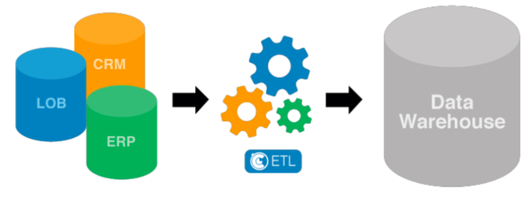

To create this data warehouse we typically use __ETL__ (Extraction/Transformation/Loading) tools, that allow users to specify transformations through a graphical user interface.

- __Extraction__: data is extracted from the source system into the staging area. Transformations if any are done in staging area so that performance of source system in not degraded. We have the need to extract data from the DB when the it is still functional, we can not stop it.

- __Transformation__: Data extracted from source server is raw and not usable in its original form. Therefore it needs to be cleansed, mapped and transformed.

    An example of possible data integration is the following:

    

    __Data integrations problems__

    We can have same data with different names, different data with same name, data only found in a place and different keys for data.

    Some possible data integrity problems

    1. Different spelling of the same person like Jon, John, etc.

    2. There are multiple ways to denote company name like Google, Google Inc.

    3. Use of different names like Cleaveland, Cleveland.

    4. There may be a case that different account numbers are generated by various applications for the same customer.

    5. In some data required files remains blank

    6. Invalid product collected at POS as manual entry can lead to mistakes.

    Validations are performed during this stage: 
    - __filtering__ (select only certain columns to load), character set conversion, conversion of units of measurements (some can be expressed with the english systems while in others you can use inch), data threshold validation check, required fields not blank, and so on.

- __Loading__: We typically have huge volume of data needs to be loaded in a relatively short period. Load process has to be optimized.

    __Types of loading__ :
    
    1. Initial load - where we populate all the Data Warehouse tables

    2. Incremental load - applying ongoing changes as when needed periodically

    3. Full refresh - Sometimes we have it, erasing the contents of one or more tables and reloading with fresh data

    After loading we have to perform *load verification*, verifying that key field data is neither missing nor null, data checks in dimension table as well as history table, and so on.

    We have different several commercial softwares to perform ETL and all the check we need in the process.

# Data Integration

When we perform data integration we can find ourself in __redundancy__.

Redundant data occur often when integration of multiple databases.

- *Object identification*: The same attribute or object may have different names in different databases
- *Derivable data:* One attribute may be a "derived" attribute in another table, e.g., annual revenue

Redundant attributes may be detected by correlation analysis and covariance analysis.

## Correlation Analysis

The first analysis of correlation we see is __$Χ^2$ (chi-square) test__ and can be applied to nominal data.

### $Χ^2$ (chi-square) test

The chi-square independence test is a procedure for testing if two categorical variables A and B are related in some population.

If they are not independent, we assume there must be a correlation.

Suppose we have:

$$

    A = \{a_1 ..., a_c\} \\ \ \\
    B = \{b_1 ..., b_r\}
$$

The data tuples can be represented by a contingency table, that express the frequencies of occurrences in pair of values. The cell corresponds to the number of instances in which we have for a value ai and for b value bj.


If we just consider the last column, we find the sum of instances where we have value $a_i$. The last row allows us to find the number of instances in which we have the value $b_j$.

In the last column and last row, we have the number of all instances we have in our database.

The idea is to start from this table to understand if $a$ and $b$ are independent.

We have to compute `chi-square`, obtained in this way:

$$
    X^2 = \sum{\frac{(Observed-Expected)^2}{Expected}}
$$

- We subtract from the observed value the expected value and we divide the square for the expected value.

- The observed value is what we find in the contingency table, is the number of couple in which we have the pair of two values.

- The expected value is the frequency we expect for that combination value with the assumption that the two variables a and b are independent.

$$
    X^2 = \sum_{i=1}^c\sum_{j=1}^r{\frac{(o_{ij}-e_{ij})^2}{e_{ij}}} \\ \ \\
    e_{ij} = \frac{count(A=a_i) \times count(B=b_j)}{n}
$$

- Counting $A = a_i$ and divided by $n$ is the probability to have $a_i$
- count $B = b_j$ divided by $n$ is the probability to have $b_j$. 

The product corresponds the product of probability to have $a_i$ and $b_j$. We multiply them with the supposing that they are independent.

If I have that $o_{ij}$ is approximately equal to $e_{ij}$, I can deduce that $a$ and $b$ are independent. This imply that the value of $X^2$ is closed to $0$ 

> Lower the value higher our confidence in deducing that the two variables are independent.

#### example

Let's suppose to have a database and we want to understand if there's correlation between reading and playing chess.

|                       |Play chess     |Not play chess |Sum    |
|-                      |-              |-              |-      |
|Likes science          | 250(90)       | 200(360)      | 450   |
|Doesn't like science   | 50(210)       | 1000(840)     | 1050  |
|Sum                    | 300           | 1200          | 1500  |

Values not in parenthesis are observed values, while numbers in parenthesis are expected counts calculated based on the data distribution in the two categories.

To compute the expected value we have, for example, to count the number of instances in which we have people who like science fiction, multiply for the number of instances that play chess and divide by the total number of instances.

$$
    e_{ij} = \frac{count(A=a_i) \times count(B=b_j)}{n}
$$

$$
    x_2 = 300 \cdot 450 / 1500 = 90.
$$

Then we use chi-square formula:

$$
    X^2 = \frac{(250-90)^2}{90} + \frac{(50-210)^2}{210} + \frac{(200-360)^2}{360} +\frac{(1000-840)^2}{840} = 507.93
$$

> Is this value high or low? What kind of information provide us?

When we have to work with statistical test we have two possibilities:

- __Parametric test__: hypothesis test based on the assumption that observed data are distributed according to some distributions of well- known form (normal, Bernoulli, and so on) up to some unknown parameter on which we want to make inference (say the mean, or the success probability). We know the shape but we need to determine the parametric, for example in normal distribution we need to compute the mean and the variance.

- __Nonparametric test__: hypothesis test where it is not necessary (or not possible) to specify the parametric form of the distribution(s) of the underlying population(s).


### We want to verify if two variables are independent.

- We start from the __Null Hypothesis__ (H0), that states that no association exists between the two cross-tabulated variables in the population and therefore the variables are statistically independent.

- If we reject the null hypothesis we have to assume that the two variables are correlated, we have the __Alternative Hypothesis__ (H1) that proposes that the two variables are related in the population.

    > We need to be careful that correlation does not imply casualty.

- The __degrees of Freedom__ are the number of cells in the two-way table of the categorical variables that can vary, given the constraints of the row and column marginal totals. So each \"observation\" in this case is a frequency in a cell.

    - $d_f := 1$ because if I fix the value in $?$, I have also fix automatically the other values.

        |           |Cat    |A      |Total  |
        |-          |-      |-      |-      |
        |__Cat__    |?      |       |6      |
        |__B__      |       |       |15     |
        |__Total__  |10     |11     |21     |
    

    - $d_f = 2$

        |           |Cat    |A      |       |Total  |
        |-          |-      |-      |-      |-      |
        |__Cat__    |?      |       |       |15     |
        |__B__      |       |       |       |15     |
        |__Total__  |10     |11     | 9     |30     |


#### General rule to determine the degree of freedom.

The number of degrees of freedom df is equal to:

$$ 
    d_f = (r-1) (c-1)
$$

where $r$ is the number of rows and $c$ is the number of columns.

> We determine the degree of freedom because we have different chi-square distributions of our problem depending on the degree of freedom.


Probability distributions provide the probability of every possible value that may occur. When we have the value the probability of this value is given of area under the curve starting from the value to the end of the curve.


The $Χ^2$ distribution is a type of probability distribution.

We can determinate the probability calculating the area starting from the chi-square value until the end. To find the probability of a particular value, we find the area under the curve from the value, and it is called the p-value.

This probability indicates also the probability of the null hypothesis.

The shape is always skewed right.

> Many statistical analyses involve using the p-value. However, calculating a portion of the area under the curve can be difficult.

Alternatively, we can use another __curve__, where we have the $X^2$ on an axis and the p-value in another.


If we compute and set the degree of freedom, it picks the curve we must use.

Then we can compute the $X^2$ and we can find the point in the $Χ^2$ table corresponding to our $d_f$ and we can determine the value of $p$.

The probability of the null hypothesis in the example is $0.3$.

### $X^2$ table

In this table, each row represents a different degree of freedom along with several $X^2$ values. The corresponding p-values are listed at the top of each column


The __null hypothesis__ is rejected when the probability of a larger value of $X^2$ is lower than the significance level $\alpha$. 

#### Steps

- compute $X^2$ and with this value we go to this table
- select our degree of freedom
- check the value we obtained for $X^2$ corresponding to the probability we want to have to accept/reject the null hypothesis. 

If $X^2$ is higher than the value in the table, then we know that the probability to have a true __null hypothesis__ is lower than the probability we read in that column.

If the probability of the null hypothesis is low then the probability of two variables being correlated to each other is high.

- ex:

    A scientist wants to know if education level and marital status are related for all people in some country. He collects data on a simple random sample of n = 300 people. He produced this contingency table.

    

    We compute the expected frequencies, and we obtain this contingency table with expected value:

    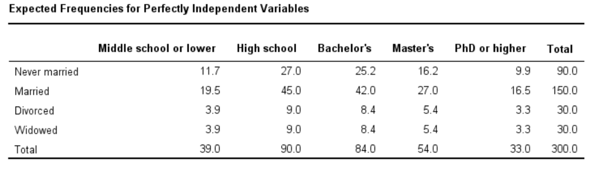

    Now we compute the `chi-square`:

    $$
        X^2 = \frac{(18-11.7)^2}{11.7} + \frac{(36-27)^2}{27} + \dots + \frac{(6-5.4)^2}{6-5.4} = 23.57  
    $$

    Now we have to compute the probability that we obtain this specific value, or we fix the probability, and we see if the null hypothesis can be rejected.

    To compute the probability, we compute the df, which in this case is 12.

    

    We find the probability is $0.023$, it is very low and we can conclude that marital status and education are related in our population. We could find the same conclusion using the table we saw.

We need statistical tests to assume if that the value of `chi-square` is relevant or not.

A limitation is that the `chi-square` is applicable only on nominal attributes, because it is complicated to compute the contingency table and the probability.

## Correlation coefficient

For numeric data we can compute correlation using __correlation coefficient__ or Pearson's product moment coefficient.

$$
    r_{A,B} = \frac{\sum_{i=1}^{n}{(a_i-\bar{A})(b_i -\bar{B})}}{n\sigma_A\sigma_B}
$$

- $r_{A,B} \gt 0$: A and B are positively correlated (A's values increase as B's). The higher, the stronger correlation.
- $r_{A,B} \gt 0$: independent
- $r_{A,B} \lt 0$: negatively correlated

### implications

- If the correlation coefficient is $>>>$ or $<<< 0$, an high value in magnitude, the correlation is strong, and higher the value in magnitude the stronger the correlation.

> We must be careful, if the correlation is equal to 0 it doesn't imply that the two variables are independent, and that's because the Pearson's product moment coefficient only detects linear relationships.

- If variables are independent the correlation will be equal to 0.

    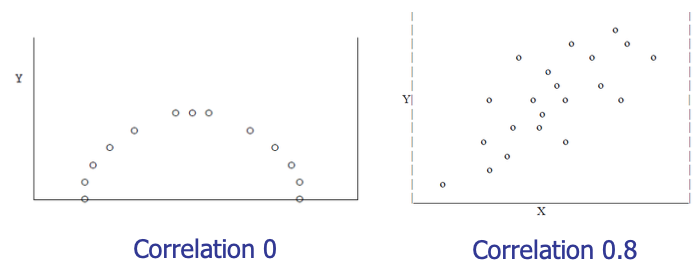

- We can visually evaluate correlation with the scatter plot.

    

### Correlation 

it measures the linear relationship between objects.

To compute correlation, we standardize data objects, A and B, and then take their dot product:

$$
    a_k^{'} = (a_k-mean(A)) / \sigma_A
    \\ \ \\
    b_k^{'} = (b_k-mean(B)) / \sigma_B
    \\ \ \\
    correlation(A,B) = A^{'} \cdot B^{'}
$$

### Covariance 

is similar to correlation:

$$
    Cov(A,B) = E((A-\bar{A})(B-\bar{B})) = \frac{\sum_{i=1}^{n}(a_i-\bar{A})(b_i-\bar{B})}{n}
$$

They relation is given by this, the correlation coefficient:

$$
    r_{A,B} = \frac{Cov(A,B)}{\sigma_A\sigma_B}
$$

- __Positive covariance__: If $Cov(A,B) > 0$, then $A$ and $B$ both tend to be larger than their expected values.

- __Negative covariance__: If $Cov(A,B) < 0$ then if A is larger than its expected value, B is likely to be smaller than its expected value.

- __Independence__ : $Cov(A,B) = 0$ but the converse is not true


The covariance can be simplified in this way:

$$
    Cov(A,B) = E(A\cdot B) - \bar{A}\bar{B}
$$

# Data Reduction

Data reduction consists in obtaining a reduced representation of the data set that is much smaller in volume but yet produces the same (or almost the same) analytical results.

Data reduction strategies:
- __Dimensionality reduction__, e.g., remove unimportant attributes: Wavelet transforms, Principal Components Analysis (PCA), feature subset selection and feature creation
- __Numerosity reduction__ (some simply call it: Data Reduction): Regression and Log-Linear Models, Histograms, clustering, sampling and data cube aggregation
-   __Data compression__

## Dimensionality Reduction

When dimensionality increases, data becomes increasingly sparse.

Density and distance between points, which is critical to clustering, outlier analysis, becomes less meaningful and this obstacle the application of different algorithms.

#### problems

- The possible combinations of subspaces will grow exponentially.
- We will avoid the curse of dimensionality, help eliminate irrelevant features and reduce noise and reduce time and space required in data mining.
- Dimensionality reduction also allow easier visualization.


#### Dimensionality reduction techniques are:

- Wavelet transforms
- Principal Component Analysis
- Supervised and non-linear techniques (e.g. feature selection)

## Principal Component Analysis (PCA)

PCA transforms the original space in a transformed space, find a projection that capture the largest amount of variation in data. We find this transformed space such that the variation of the projection of the data in the transformed axis is higher than what we obtain in the original axis.


Newly projected red points are more widely spread out than in the original dataset, i.e. more variance.

PCA tries to find axes such that the variation is higher.

If I have features in which data vary very much, probably these features contain a lot of information, this is the idea.

If I apply PCA I find that the transformed space has the same number of dimensions of the original space.

Actually, we can select the dimensions in the transformed space because we can have some idea of how much exists variation along transformed dimension. 

### Eigenvectors

To exploit this we use eigenvector of the covariance matrix and we can reduce the size of the transformed space because we can eliminate eigenvectors associated with low eigenvalues.

The original data are projected into a much smaller space, resulting in dimensionality reduction. We find the eigenvectors of the covariance matrix, and these eigenvectors define the new space.

#### steps

Given $N$ data vectors from $f$ dimensions, find $k \leq f$ orthogonal vectors that can be best used to represent data. 

> This work for numeric data only.

1. Normalize input data: Each attribute falls within the same range

2. Compute k orthonormal (unit) vectors, i.e., principal components.

3. Each input data (vector) is a linear combination of the k principal component vectors

The principal components are sorted in order of decreasing "significance" or strength

Since the components are sorted, the size of the data can be reduced by eliminating the weak components (those with low variance).

Given $N$ data vectors from $f$-dimensions, find $k\leq f$ orthogonal vectors (principal components) that can be best used to represent data.

### PCA process

We start from these data vectors, in the row we present the dimension and in the column we represents the samples. We subtract the mean values features by features, because we want to compute the covariance matrix from our dataset.


1. Calculate adjusted_data_set by removing the mean from each feature

    ```py
    # A := adjusted_data_set 
    for f in data.features:
        A[f] = data_set[f] - np.mean(data_set[f])
    ```

2. Calculate the co-variance matrix ($X,Y$ are just two aliases for $A$)

    in theory $C = Cov(X,Y)$ is equal to: 
    
    $$
        Cov(X,Y) = \frac{\sum_{i=1}^{n}(x_i-\bar{X})(y_i-\bar{Y})}{N-1}
    $$

    but since the adjusted_data_set has mean equal to $0$

    $$
        Cov(X,Y) = \frac{(AA^{T})}{N-1}
    $$

    ```py
    # C := coverage_matrix 

    C = np.cov(A, rowvar=False)
    ```

3. Calculate the eigenvectors

    this is done with some `witchcraft` that finds some $f$ `eigenvectors` where $f \leq N$ and $N$ is the number of original features

    ```py
    eigenvalues, eigenvectors = np.linalg.eig(C)
    ```
    
    For each `eigenvectors` there is an `eigenvalues`, we can remove `eigenvectors` with a low `eigenvalue`, by doing this we create a mtrix `E` that contain a subset of eigenvectors.

    We then use the matrix E to transform our data contained in the matrix A.

4. Transform data_set to the new basis

    $$
        F = E^{T} A
    $$

    ```py
    # F := new_data_set 
    F = np.dot(data_set, eigenvectors)
    ```

    The F matrix contain the transformed dataset where each object is defined on the transformed space but using only the dimensions fixed by the eigenvectors we selected.

    We project the data along new axis where we have a high variance of data and we eliminate dimensions where we have few variation.

#### conclusions

the dimensions of $F$ are less than the original dataset, to recover $A$ from $F$

$$
    (E^T)F = (E^T)^{-1}E^TA \\ \ \\
    (E^T)^TF = A \\ \ \\
    EF = A
$$

> In the PCA we use the distribution of data, therefore the PCA is unsupervised.

#### usage

In any type of data mining process this can be used for dimensional reduction, and it is independent of any kind of application.

The reduction of the number of dimensions is performed in the transformed space. 

The transformed space and the new axes are obtained as linear combination of old axes, it's not easy to understand the impact in original features.

# Attribute subset selection

The discussion is different if I use attribute subset selection.

I can work on the original space applying some heuristics.

I can discover to have:
- __Redundant attributes__: like duplicate much or all of the information contained in one or more other attributes
- __Irrelevant attributes__: contain no information that is useful for the data mining task at hand

It's not simple to perform attribute selection because the number possible combination of attributes grows exponentially.

We need to perform this analysis using a greedy approach: 

make what looks to be the best choice at the time. When we apply this algorithm noone can guarantee that the subset we will select is a global optimum, but it's close to the optimum.

### Typical heuristic attribute selection methods:

- __Best single attribute__ under the attribute independence assumption: choose by significance tests

- __Best stepwise feature selection__: The best single-attribute is picked first, then next best attribute condition to the first

- __Step-wise attribute elimination__: Repeatedly eliminate the worst attribute

- __Best combined attribute selection and elimination__

- __Optimal branch and bound__: use attribute elimination and backtracking

    

    In the forward selection the attribute is the best when we select it, but at the end no one can guarantee that.

    In the backward elimination we can make similar considerations.

    A typical problem is the _stopping condition_, sometimes in most approaches we fix the number of dimensions we want to obtain, otherwise we can use specific metrics for selecting the attributes and different metrics as termination condition.

    In the slide we have another approach, the decision tree induction. We use decision tree learning algorithm to perform feature selection.

#### Example of heuristic approach

This approach assumes that we know the classes of the instances, this is a supervised approach, and it works on the original space.

We can eliminate features in the original space.

We're dealing with a classification problem; we have a set of objects described by features and we want a system that can associate classes to these objects.

Correlation here means that if we have a value in an attribute, we tend to have some certain classes.

We want to select features that are strongly correlated with the class.

## Mutual information

If two attributes are equal and strongly correlated with the class, we select both attributes, but this is not a good idea to proceed.

We should also avoid selecting attributes strongly correlated with each other.

We need to transmit these intuitions into formula.

Let's consider two discrete variables X and Y, with alphabets XX and YY, respectively.

The __mutual information__ (I) between $X$ and $Y$ with a joint probability mass function $p(x,y)$ and marginal probabilities $p(x)$ and $p(y)$ is defined as follows:

$$
    I(X,Y) = \sum_{x \in XX} \sum_{y \in YY} p(x,y) \cdot \log{\frac{p(x,y)}{p(x)p(y)}}
$$

This is the sum between the product of the joint probability and the logarithm of the ratio of the joint probability and the product of marginal probabilities, for all values of x and y.

Alphabets XX and YY contain the possible values for X and Y, respectively.

#### considerations

- If $x$ and $y$ are independent the joint probability is the product of marginal probabilities, the ratio is equal to $1$ and the logarithm of one is $0$.

    The mutual information will be 0.

- If we are far from the case of independence the joint probability is higher than the product and the mutual information increases.

#### properties

- The capacity of measuring any kind of relationship between variables
- Its invariance under space transformations (translations, rotations and any transformation that preserve the order of the original elements of the variables)

> Feature selection based on MI is extremely sensitive to the estimation of the pdfs.

If I want to measure if attribute $X$ is correlated with another attribute and not the output $Y$, I can still exploit this formula.

Given an initial set $F$ with $n$ features, find subset $S ⊂ F$ with $k$ features that maximizes the $MI I(C;S)$ between the class variable $C$, and the subset of selected features $S$.

## $NI$ := Normalized MI between $f_i$ and $f_s$:

$$
    NI(f_i, f_s) = \frac{I(f_i;f_s)}{min\{H(f_i), H(f_s)\}}
$$

- We divide by the minimum of the entropy of the two values, to reduce the effect of variables with an high number of values.

- it to varies between 0 and 1.

The selection criterion used in NMIFS consists in selecting the feature that maximizes the measure G.

$$
    G = I(C,f_i)-\frac{1}{S}\sum_{f_s \in S}{NI(f_i;f_s)}
    \\ \ \\
    \text{where } I(C,f_i) = \sum_{c \in CC}\sum_{f_i \in FF} p(c, f_i) \cdot \log{\frac{p(c,f_i)}{p(c)p(f_i)}}
$$

- We want high mutual information between feature and output but also low mutual information between the feature and the already selected feature.

- $f_i$ is the features we are analyzing, and fs is a feature we already selected.

#### algorithm

So, we want to maximize $G$, it implements the intuitions we talked about before. This is the algorithm we can use:

1. Initialization: Set $F = \{f_i \text{with} i = 1,...,N \}$ initial set of $N$ features, and $S = \{\emptyset\}$, empty set of selected features.

2. Calculate the $MI$ with respect to the classes: calculate $I(f_i ;C)$, for each $f_i \in F$, each feature and the output.

3. Select the first feature: Find $i | f_i = \max_{i=1,...,N}{I(f_i; C)}$, maximum $MI$ between the feature and the output. 

    move $f_i$ from $F$ to $S$

4. Greedy Selection: Repeat until $\#S = k$, a prefixed value before the algorithm starts.

    - Calculate the $MI$ between features: Calculate $I(f_i ;f_s )$ for all pairs $(f_i ; f_s)$, with $f_i \in F$ and $f_s \in S$

    - Select next feature: Select feature $f_i \in F$ that maximizes $G$. 

        move $f_i$ from $F$ to $S$

5. Output the set $S$ containing the selected features. 

We don't have metrics to determine the termination condition but we fix the number of features at the beginning.


### Why do we use $NI$ that is $\frac{MI}{entropy}$?

Suppose we want to encode and transmit a long sequence of symbols from the set `{a, c, e, g}` using the __least number of bits__, drawn randomly according to the following probability distribution D:

|Symbol     |a  |c  |e  |g  |
|-          |-  |-  |-  |-  |
|__Prob__   |1/8|1/8|1/4|1/2|

Since there are 4 symbols, one possibility is to use 2 bits per symbol:

|Symbol |Encoding   |
|-      |-          |
|a      |00         |
|c      |01         |
|e      |10         |
|g      |11         |

Because it's possible to use 1.75 bit on average

|Symbol |Encoding   |
|-      |-          |
|a      |000        |
|c      |001        |
|e      |01         |
|g      |1          |

> We must select the shorting encoding for high probably symbols.

$$

    \text{Average\_number\_of\_bits\_per\_symbol} = \frac{1}{8} \cdot 3 + \frac{1}{8} \cdot 3 + \frac{1}{4} \cdot 2 + \frac{1}{2} \cdot 1 = 1.75

$$

## Information entropy

In the information theory they introduced the concept that __optimal length code__ assigns $\log_{2}{1/p} = -\log_2{p}$ bits to a message having probability $p$.

Given a distribution $D$ over a finite set, where $<p_1, p_2, \dots, p_n>$ are the corresponding probabilities, define the __information entropy__, or information, of D by:

$$
    H(D) = -\sum_{i=1}^{n}{p_i \log_2{p_i}}
$$

- For example 

    the entropy of the distribution we just examined, $<1\frac{1}{8},\frac{1}{8}, \frac{1}{4}, \frac{1}{2}>$, is 1.75 (bits)

    If all symbols have the same probability to be transmitted, the number of bits we must use in average is 2, our initial solution.

> The maximum value of entropy can be achieved when we assume all the symbols are equally probable.

### considerations

- We have the lowest value of entropy when just one symbol is characterized by probability 1 and all others are characterized by probability 0.
    
    This corresponds, though, to the assumption that we transmit only one symbol and in that case, entropy is 0, we don't actually transmit anything.

- If we have 5 symbols and the first has probability 1 and all the others 0, the first symbol contributes 0 for the logarithm and all others contributes 0 for the probability.

- If we have a group of objects that belong to the same class, if we want to analyze the entropy of this object referring to the class, we can compute the probability of having the classes inside the group of objects.

    In this case the entropy of the group of objects in term of probability of classes is equal to 0.

    The probability of one class is 1 and others are 0.

## Attribute creation (feature generation)

We can consider the creation of new attributes (features) that can capture the important information in a data set more effectively than the original ones.

There are three general methodologies:
- __Attribute extraction__ that can be domain-specific. Feature selection can be automated, thing that can't be done with feature extraction.

- __Mapping data to new space__ (see: data reduction), for example with Fourier transformation, wavelet transformation, manifold approaches (not covered).

- __Attribute construction__: combining features and data discretization.

## Numerosity Reduction

It helps us to reduce complexity. The problem is not about computational power but it's about storage.

- __Parametric__ methods (e.g., regression): in which we assume the data fits some model, estimate model parameters, we store only the parameters and discard the data (except possible outliers)

- __Non-parametric__ method, in which we do not assume models and try to summarize data using an approach. For instance, histograms, clustering, sampling.

### Regression and log-linear models

- __Linear regression__: in which data is modeled to fit a straight line and it often uses the least-square method to fit the line

- __Multiple regression__: it allows a response variable Y to be modeled as a linear function of multidimensional feature vector

- __Log-linear model:__ in which we approximates discrete multidimensional probability distributions

Used to estimate the probability of each point in a multi- dimensional space for a set of discretized attributes, based on a smaller subset of dimensional combinations.

## Regression analysis

A collective name for techniques for the modeling and analysis of numerical data consisting of values of a dependent variable and of one or more independent variables.

We compute the parameters of the straight line in such a way the distance between the points and the line is minimum.


### Linear regression

Two regression coefficients, $w_1$ and $w_0$, specify the line and are to be estimated by using the data at hand.

We can use the least squares criterion to the known values of $<y_1, y_2, \dots>, <x1, x2, \dots>$


$$
    w_i = \frac{\sum_{i=1}^{\#D}{(x_i-\bar{x})(y_i-\bar{y})}}{\sum_{i=1}^{\#D}{(x_i-\bar{x})^2}}
$$

where $\#D$ is the size of the dataset

- ex: the $x_i$ column shows scores on the aptitude test. Similarly, the $y_i$ column shows statistics grades.

    |<!--  -->|<!--  -->|<!--  -->|
    |-|-|-|
    ||||

    We want to find a straight line to approximate these values.

    - Computation of $w_1$: `w1 = 470 / 730 = 0.644`

    - Computation of $w_0$ : `w0 = 77 - 0.644 * 78 = 26.768`

    - Linear regression equation: `y = 0.644 x + 26.768`

### Multiple linear regression

$$
    y = w_0 + w_1 x_1 + w_2 x_2
$$

Many nonlinear functions can be transformed into the above

$$
    W = (X^T X)^{-1}\  X^T \ Y
$$

### Polynomial regression

$$
    y = w_0 + w_1 x + w_2 x^2 + w_3 x^3
$$

To convert this equation to a linear regression problem, we apply the following transformation:

- $x_1=x$
- $x_2=x^2$
- $x_3=x^3$ 

create a variable for each polynomial degree

### Log-linear models

Mathematical models that take the form of functions whose logarithm is a first-degree polynomial function of the parameters of the model.

Estimate the probability of each point (tuple) in a multi-dimensional space for a set of discretized attributes, based on a smaller subset of dimensional combinations.

Useful for dimensionality reduction and data smoothing.

$$
    exp(c+ \sum_{i}{w_if_i(X)})
$$


## Histogram analysis

In non-parametric case we use other analysis, for example __histograms__.

We divide data into buckets and store average (sum) for each bucket.

We can have different partitioning rules:
-   Equal-width: equal bucket range
-   Equal-frequency (or equal-depth)

__histogran__
```py
# the following data are a list of AllEletronics prices for commonly sold items (sorted)

prrices = [1, 1, 5, 5, 5, 5, 5, 8, 8, 10, 10, 10, 12, 14, 14, 14, 15, 15, 15, 15, 15, 18, 18, 18, 18, 18, 18, 18, 18, 20, 20, 20, 20, 20, 20, 20, 21, 21, 21, 21, 25, 25, 25, 25, 25, 28, 28, 30, 30, 30]
```


- The first histogram is obtained using single buckets.
- In the second case we have equal-width histogram for price. We discretize the domain of the prize.

## Clustering

Another way is __clustering__, in which we partition data set into clusters based on similarity, and store cluster representation (e.g., centroid and diameter) only.

We can have __hierarchical clustering__ and be stored in multi-dimensional index tree structures.

## Sampling

Obtaining a small samples to represent the whole data set.

We want to choose a representative subset of the data. It allows a mining algorithm to run in complexity that is potentially sub-linear to the size of the data.

Key principle: Choose a representative subset of the data.

Sampling techniques can be devided into:

-   __Simple random sampling__: there is an equal probability of selecting any particular item

    - __Sampling without replacement__: once an object is selected, it is removed from the population. We put the object in the selected set and we eliminate the object from the original repository. In this case we change the probability, each time I extract an object and eliminate it from the repository I change the probability in the original repository.

    - __Sampling with replacement__: a selected object is not removed from the population. We can see that like making a copy of the object. 
    
        Each time that we perform sampling we extract an instance with equal probability, we con't change the probability of extracting objects. This has the advantage that in my repository 

-   __Stratified sampling__: partition the data set, and draw samples from each partition.

    Used in conjunction with skewed data (also the smaller group of items will be sure to be represented) I generate this stratification and extract data from each partition I have.

    If I have some skew, I'll dedicate a partition for the skew and be sure that I have representative for the skew.


    In stratified sampling we don't have the risk to have only data from a majority class, if we have majority and minority class. We can be sure that also instances from the minority class will be selected.


When we sample with replacement, the two sample values are independent. 

What we get on the first one doesn't affect what we get on the second. The covariance between the two is zero.

In sampling without replacement, the two sample values aren't independent. What we got on for the first one affects what we can get for the second one. 

The covariance between the two, from a population with variance $\sigma^2$, is:

$$
    \frac{-\sigma^2}{N-1}
$$

In case of SRSWOR we extract three items and we have just the probability to extract the same objects, we don't eliminate the same objects, so we have the probability to extract the same objects.


In stratifies sampling we can partition someway the raw data and we are sure that we extract data from each partition.


In SRSWOR all records are different, in SRSWR in the subset we can have two records equal because we don't eliminate records from the repository.

In stratified sample we have an organization in partition, and we guarantee that we extract an item, at least, from each partition. We try to preserve the distribution that we have for the partition.

## Data Cube Aggregation

A typical representation we have in a data warehouse, useful to perform analysis, is __data cube__.

In a cube of data we can represents different attributes with different granularity.


Instead of representing data in terms of months or weeks or days we can represent them in form of year, to have a summarized version of data.

It's like we have an hierarchy, we can have multiple levels of aggregation in data cubes.

# Data Compression

We can consider them in two groups:

- __lossless__ data compression, we compress data but when we uncompress we obtain the perfect original copy
- __lossy__ data compression, when we uncompress the data we don't recover the same data.


> If we have lossless algorithms, why don't we use always them?
>> When we use lossy compression, we achieve an higher compression ratio, we compress more the data.

# Data Transformation and Data Discretization

__Data transformation__ is a function that maps the entire set of values of a given attribute to a new set of replacement values such that each old value can be identified with one of the new values.

There are different methods:

- __Smoothing__: Remove noise from data

- __Attribute/feature construction__

- __Aggregation__: Summarization, data cube construction

- __Normalization__: Scaled to fall within a smaller, specified range (min-max normalization, z-score normalization, normalization by decimal scaling)

- __Discretization__: Concept hierarchy climbing

## Min-max normalization

We transform all data in a way that they will vary from $[new\_minA, new\_maxA]$.

$v^{'}$ is the new data.

$$
    v^{'} = \frac{v-min_A}{max_A-min_A} (new\_max_A -new\_min_A) + new\_min_A
$$

This normalization suffers for a type of problem. 

> If we have an outlier which is a minimum and it is far away from the others, all points will be mapped in a narrow zone between 0 and 1.

To avoid this problem, we typically exploit another normalization.

## Z-score normalization

We don't use minimum and maximum, but we use μ (mean) and σ (standard deviation).

$$
    v^{'}= \frac{v-\mu}{\sigma_A}
$$

In this normalization values will not vary in a fixed range, but they will vary in similar ranges, thanks to the denominator, which is the std and depends how much data are spread in the original domain.

The `min/max normalization` guarantee us that all features vary in the same range but suffers for the problem of outliers, while `z-score` normalization does not suffer from this problem.

## Normalization by decimal scaling

The new value is obtained by the ratio of the old value and this power of $j$:

$$
    v^{'} = \frac{v}{10^j}
$$

where $j$ is the smallest integer such that $max(|v^{'}|) < 1$.


## Discretization

We apply discretization when we have a continuous value, and we want to discretize it. It consists in dividing the range of a continuous attribute into intervals.

Some `ML` techniques are applicable only on nominal data and not on continuous data. Interval labels can then be used to replace actual data values.

> Finding correct intervals is important and we need to have approaches to discretize in such a way to guarantee good results in term of application of ML techniques.

We also reduce data size by discretization.

### discretization techniques

- __Supervised__, uses information on the class. We try to divide them in such a way that points belonging to the same class are in the same interval.

- __Unsupervised__

It can also be:

-  __Split (top-down)__, we start from a interval and then we split

- __Merge (bottom-up)__, where we try to merge intervals

Discretization can be performed recursively on an attribute.

> Discretization can be applied recursevly

Typical methods (All the methods can be applied recursively):
-  __Binning__: top-down split, unsupervised
-  __Histogram analysis__: top-down split, unsupervised
-  __Clustering analysis__: unsupervised, top-down split or bottom-up merge
-  __Decision-tree analysis__: supervised, top-down split
- __Correlation analysis__: unsupervised, bottom-up merge

### Binning

We have two types of binning:

-   __Equal-width (distance)__ partitioning
    
    We divide the range into $N$ intervals of equal size: uniform grid.

    If $A$ and $B$ are the lowest and highest values of the attribute, the width of intervals will be:

    $$
        W = \frac{(B - A)}{N}. 
    $$

    The most straightforward, but outliers may dominate presentation. Skewed data is not handled well because we have intervals of the same size.

-   __Equal-depth (frequency)__ partitioning

    We divide the range into $N$ intervals, each containing approximately same number of samples.
    
    Good data scaling is possible.
    
    Managing categorical attributes can be tricky because we can just put more label together if we consider the same frequency.

#### Example

```py
# sorted data for price ($)

prices = [4, 8, 9, 15, 21, 21, 24, 25, 26, 26, 29, 34]

eqy_depth_bins = [
    [4, 8, 9, 15]
    [21, 21, 24, 25]
    [26, 18, 29, 34]
]

# smoothing by bin means we obtain
bin_means_smoothed_bins = [
    [9, 9, 9, 9]
    [23, 23, 23, 23]
    [29, 29, 29, 29]
]

# smoothing by bin boundaries we obtain
bin_means_smoothed_bins = [
    [4, 4, 4, 15]
    [21, 21, 25, 25]
    [26, 26, 26, 34]
]
```

Let's see a comparison between different approaches of discretization.


#### conclusions

- With equal width binning we just split the domain in equal-width intervals.
- Points belonging to the same class may be split in different intervals.
- In the case of equal frequency, the situation is similar, we split points belonging to the same class in different intervals.

This situation can improve if we exploit cluster algorithms, that try to include in the same cluster similar points and the similarity is measured considering the distance between points exploiting the fact they're close in the space.

### We can have discretization performed in a supervised way:

- __Classification__

    - Using entropy to determine split point (discretization point)
    - Top-down, recursive split
    - Details to be covered in the following

- __Correlation analysis__ (e.g., Chi-merge: χ2-based discretization)

    - Bottom-up merge: find the best neighboring intervals (those having similar distributions of classes, i.e., low χ2 values) to merge

    - Merge performed recursively, until a predefined stopping condition

## ChiMerge Discretization

It is a statistical approach to data discretization.

We want to create intervals in which we have points belonging to the same class.

It applies the `Chi Square` method to determine the probability of similarity of data between two intervals. Let's suppose we have different features $F$ and two classes $K$.

|<!--  -->|<!--  -->|
|-|-|
|||

We start to sort and order the attributes that we want to group (in this example attribute $F$).

We start with having every unique value in the attribute in its own interval.

This is a bottom-up approach in fact.

The upper boundary is the point in the middle between a value and the next.

We begin calculating the Chi Square test on every interval and see if we can merge close intervals. We compute the chi-square considering merging two intervals.


The values we have in the cell are observed values.


The expected value is obtained by considering the frequency of the sample and the frequency of the class.

We get 0 and 2 for the chi-square. Having 0 means that samples and classes are independent, the value of samples change but the class remain the same.

In the first class we have correlation, if samples change the class change.

We consider a threshold $0.1$ with $d_f = 1$ from `Chi-square` distribution chart and we merge if $X^2 \lt 2.7024$.

We calculate chi-values for all intervals and merge all intervals with the smallest chi-values because we are that we have independence between the classes and the samples.

|<!--  -->|<!--  -->|
|-|-|
|||

Now we repeat the computation and we get:


|<!--  -->|<!--  -->|
|-|-|
|||

And we go on until there's no interval to satisfy the chi-square test.

In most intervals almost all samples belong to the same class.

We merge points inside one interval in a way we have a predominant class of membership of these points. This approach is heavy if we have a large dataset.

## Concept Hierarchy Generation

Concept hierarchy organizes concepts hierarchically and is usually associated with each dimension in a data warehouse.

The concept hierarchies can be used to transform the data into multiple levels of granulaity.

Concept hierarchy formation: Recursively reduce the data by collecting and replacing low level concepts by higher level concepts grouping low level concepts.

Concept hierarchy can be automatically formed for both numeric and nominal data. For numeric data, use discretization methods shown.

We study four methods for the generation of concept hierarchies for nominal data, as follows.

-  __specification of a partial/total ordering__ of attributes explicitly at the schema level by users or experts. A hierarchy can be defined by specifying the total ordering among attributes at the schema level such as:

    street < city < state < country

    > Country is the highest level of hierarchy, that contains the state, that contains the city, that contains the street.

- __specification of a hierarchy__ for a set of values by explicit data grouping. In a large database, it is unrealistic to define an entire concept hierarchy by explicit value enumera- tion. On the contrary, we can easily specify explicit groupings for a small portion of intermediate-level data.

    {Urbana, Champaign, Chicago} \< Illinois

- __specification of only a partial set of attributes__. Sometimes a user can be careless when defining a hierarchy or have only a vague idea about what should be included in a hierarchy. Consequently, the user may have included only a small subset of the relevant attributes in the hierarchy specification.

    ex: only street < city, not others

-   __automatic generation of hierarchies__ (or attribute levels) by the analysis of the number of distinct values, considering the numerosity for each of the values we are considering.

    ex: for a set of attributes: {street, city, state, country}

## Automatic Concept Hierarchy Generation

Some hierarchies can be automatically generated based on the analysis of the number of distinct values per attribute in the data set.

The attribute with the most distinct values is placed at the lowest level of the hierarchy.

Exceptions, e.g., weekday, month, quarter, year


Depending on specific application domain you need to use the best techniques for preprocessing.
# Association Rule

## Mining Frequent Patterns

A pattern is a set of items (milk and bread which appear together in a transaction data set).A subsequence (buy first a PC, then a digital camera and then a memory card) is also a pattern but with a difference, the order is relevant.A substructure is a pattern that refers to different structural forms (subgraphs, subtrees).

A pattern is frequent if it occurs frequently in a data set.

Finding such frequent patterns plays an essential role in mining associations, correlations and other interesting relationships and we talk about frequent pattern analysis.

### Basic concepts

We define:

- __Itemset I__: A set of one or more items {I1, I2, \..., Im}.

- __k-itemset X__ = {x1, x2, \..., xk}, set of k items.

- __(absolute) support__, or, __support count of X__: the frequency or occurrence of an itemset X in the database of transactions, number of transactions in which the itemset appears.

- __(relative) support s__: fraction of transactions that contains X (i.e., the probability that a transaction contains X).

    

    The 1-itemset (one element) beer appear 3/5, the absolute support of this set is 3. The relative support is 3/5. The absolute support of Beer, Diaper is 3. The relative support is 3/5.

    The absolute support for Milk is 2. The relative support is 2/5.

- An itemset X is __frequent__ if X's support is no less than a __minsup threshold__.

    To fix the minsup we need to consider that we are not interested in 1-itemset, we will choose a good number.

### Purpose of Frequent Pattern Analysis

The aim of frequent pattern analysis is to mine itemset. Larger is the cardinality of the itemset and more interesting is what we can discover.

The complexity is exponential, we need specific techniques to reduce complexity.

After fixing the minsup these techniques will give us all frequent patterns.

## Frequent Pattern Matching

When we have a set of many items working on all possible combinations is hard.

We must mine all the possible frequent patterns.

### Transactions

A transaction T is a set of items such that: 

$$
    T \subseteq I
$$

### Association Rule

An association rule is an implication of the form X $\Rightarrow$ Y, where
- $X \subset I$
- $Y \subset I$
- $X \cap Y = \emptyset$

The association rule means that there's an high probability that X will imply Y.

#### Definitions

__The relative support of X $\Rightarrow$ Y in the transaction database D__: percentage of transactions in D that contain $X \cup Y$ (i.e., the union of sets X and Y) 

__Support:__ $Supp (X \Rightarrow Y) = P(X \cup Y) \rightarrow$ probability that a transaction contains $X \cup Y$

__Confidence:__ $Conf (X \Rightarrow Y) = P(Y | X) = \frac{Supp(X \cup Y)}{Supp(X)} \rightarrow$ conditional probability that a transaction having X also contains Y and it is given by this ratio. 

This ratio belongs to the interval \[0,1\], in fact it is a probability, and that's because:

$$
    supp(X \cup Y) \Leftarrow supp(X)
$$

If $Conf(X \Rightarrow Y) = 1$, every time I have X I also have Y.

__All the rules with confidence 1 are optimal for us.__

But a special case there is when Y is always present in the transaction it is not that optimal, it doesn't mean that when we have X we also have Y, it's because Y is always present.

This is the reason why confidence is important, but we need to consider also the probability of Y.

### Implementation

Each item has a boolean variable representing the presence or absence of that item.

Each basket can be represented by a Boolean vector of values assigned to these variables.

We can represent each transaction as boolean vector which is our basket.

Boolean vectors analyzed for buying patterns that reflect items that are frequently associated or purchased together.

Computer $\Rightarrow$ antivirus\_software \[Support=2%,Confidence =60%\] 

__Support reflects the usefulness__ (in the 2% of all transactions, purchased together). __Confidence reflects certainty__ (60% of the customers who purchased a computer also bought the software).

A typical problem we have to solve is that given a database of transactions.

We need to find all the rules X $\Rightarrow$ U with minimum support and confidence, fixed the minimum values.

Let's come back to the previous example.


Let __minsup__ = 50%, __minconf__ = 50%

Freq. itemsets: Beer:3, Nuts:3, Diaper:4, Eggs:3, {Beer, Diaper}:3

They're frequent because we fixed minsup to 50% (3/5 and 4/5 \> 0.5).

Beer is a 1-itemset frequent, {Beer, Diaper} is a 2-itemset frequent, and so on.

We can extract now association rules:

Beer $\Rightarrow$ Diaper (60%, 100%)

Diaper $\Rightarrow$ Beer (60%, 75%)

The __support__ is the same because it is defined as the number of transactions in which we have the two items together.

The __confidence__ is different because obtained by dividing the support for the support of the antecedent.

#### Process
In general, association rule mining can be viewed as a two-step process:

- __Find all frequent itemsets__: By definition, each of these itemsets will occur at least as frequently as a predetermined minimum support count, minsup, once fixed minsup.

- __Generate strong association rules from the frequent itemsets__: By definition, these rules must satisfy minimum support (automatically satisfied because we start from frequent itemsets) and minimum confidence.

A long itemset contains a combinatorial number of sub-itemsets, e.g., we have 100 itemsets {a1, \..., a100}. The number of sub-itemset is:


We need to find a solution to show all frequent patterns we can mine to users by summarizing.

The way to summarize the frequent patterns is showing a subset of frequent pattern we mined.

#### New problem

A long itemset contains a huge number of sub\-items.

__Solution__: Mine closed itemsets and max-itemsets instead

- An itemset X is __closed__ in a dataset D if X is frequent and there exists no super-itemset $Y \supset X$, with the same support as X $\rightarrow$ this means that we can give the customer only 1 itemset specifying that it is closed.

- An itemset X is a __max-itemset__ in a dataset D if X is frequent and there exists no frequent super-itemset $Y \supset X$, but we do not specify nothing about support.

If we have the max-itemset we have all the information we need.

Closed itemset is a lossless compression of freq. patterns, it allow us to reduce the number of patterns and rules

For example, we have two subsets one containing 100 items and the other 50 items.

DB = {\<$a_1$, \..., $a_{100}$\>, \< $a_1$, \..., $a_{50}$\>}

Min\_sup = 1.

- What is the set of closed itemset?

    $<a_1$, \..., $a_{100}>$ closed with support 1

    $<a_1$, \..., $a_{50}>$ closed with support 2

- What is the set of max-itemset?

    $<a_1$, \..., $a_{100}>$: 1

Giving only the max-itemset we lose information, we cannot know that there exists the other itemset with support 2.

The set of closed frequent itemsets contains, instead, complete information regarding the frequent itemsets.

For instance, from the set of closed frequent itemset, we can derive {$a_2$, $a_{45}$ : 2};

From the data set, we can only infer that {$a_2$, $a_{45}$ : 1}

#### Worst-case scenario

Let C be the set of closed frequent itemsets for a data set D satisfying a minimum support threshold, min\_sup.

Let M be the set of maximal frequent itemsets for D satisfying min\_sup.

Suppose that we have the support count of each itemset in C and M. Notice that C and its count information can be used to derive the whole set of frequent itemsets. Thus, we say that C contains complete information regarding its corresponding frequent itemsets.

For the computational complexity it's impossible to generate all possible combinations.

How many itemsets are potentially to be generated in the worst case?

The number of frequent itemsets to be generated is sensitive to the minsup threshold.

When minsup is low, there exist potentially an exponential number of frequent itemsets.The worst case: MN where M is the number of distinct items, and N is the max length of transactions.

Let's see the worst case complexity vs. the expected probability .

Ex. Suppose Walmart has 104 kinds of products.The chance to pick up one product is 10-4.The chance to pick up a particular set of 10 products is \~10-40 because we consider independent products.

We can see that with the increase of M in the transaction the probability to have this itemset frequent decreases.

This is the basis of the most popular algorithm used for frequent pattern mining.

## Apriori Algorithm

__Apriori algorithm__ is an approach in which we have candidate generation-and-test.

The _downward closure property_ of frequent patterns tells us that any nonempty subset of a frequent itemset must also be frequent. (Apriori property) It tells us that if we have that {beer, diaper, nuts} is frequent, so is {beer, diaper} i.e., every transaction having {beer, diaper, nuts} also contains {beer, diaper} .

If we add another item to a frequent itemset we at most have the same support but cannot increase it.This property belongs to a special category of properties called _antimonotonicity_ in the sense that if a set cannot pass a test, all of its supersets will fail the same test as well. Antimonotonicity because the property is monotonic in the context of failing a test.

If a 2-itemset is not frequent it's useless to test a 3-itemset containing the 2-itemset.The reason is the apriori property.

### Apriori Pruning Principle

__Apriori pruning principle__: If there is any itemset which is infrequent, its superset should not be generated/tested!

In fact, we are sure that this super-test is not frequent.

Method:

- Initially, scan DB once to get frequent 1-itemset, in this way for the apriori property if we discover than 1 item is not frequent, we can remove the item for the generation of the higher order itemset.

- __Generate__ length (k+1) __candidate__ itemsets from length k __frequent__ itemsets.

At the beginning we generate the two itemset by combining the 1-itemset.

- __Test__ the candidates against DB, we check if they're frequent

- Terminate when no frequent or candidate set can be generated

We stop certainly because with the increasing of number of items in the itemset, the support decreases.

At the end we will have a value lower than minsup.

The minsup affects a lot this process, if we choose an high minsup the process will terminate fastly, while if it is small we'll generate a lot of itemsets and we have to check a lot of times that they're frequent.

With an high-value the complexity decreases but we may not get what we want.

It has to be chosen not depending on the complexity.

When we start the method the minsup is fixed.


We start from our db that may contain some transactions.

We count the occurrence of the single item to establish if it is frequent or not.

If we assume minsup = 2, D is not a frequent pattern so we can eliminate if from the 1-itemsets frequent. We denote with Lk the frequent k-itemset.

With Ck we denotate the candidate k-itemset.

Now we generate all possible candidate 2-itemset and we consider, for the apriori property, all the 1-itemset frequent.

We consider {A, B} and not {B, A} because we are not interested in the order but only on occurrences.

We scan the DB to realize if these 2-itemsets are frequent.

We continue to discover super-items frequent of the 2-itemset, generating the 3 candidate itemsets, combining the two frequent itemset.

From the first two frequent 2-itemset we can generate {A, B, C} but the support of one subset is equal to 1, and for the apriori property if one of subsets is not frequent also the super-itemset is not frequent. For {A, B, E} and {A, C, E} we can do the same considerations.

The only combination that we are not able to discard is {B, C, E}, it has 2 as support.

### Pseudo Code

```py

# C_k := Candidate itemset of size k
# L_k := frequent itemset of size k

def Apriori(frequent_items : any):
    
    k = 1
    L[k] = frequent_items

    while True:

        C[k+1] = generate_candidates(L[k])

        for transaction in database:
            increment_count(C[k+1], transaction)

        L[k+1] = filter_min_support(C[k+1])

        if IsEmpty(L[k+1]):
            break

        k += 1

    return L
```

This is a summarization of what we analyzed, starting from the set of frequent 1-itemset and generating candidate k-itemset until we have an empty set.

But how can we generate this candidate $C_{k+1}$ itemset?

### How is the Apriori property used in the algorithm?

Let us look at how $L_{k-1} is used to find $L_k$ for k $\geq$ 2. A two-step process, consisting of join and prune actions.

#### __The join step__:

in order to find $L_k$, a set of candidate k- itemsets, denoted $C_k$, is generated by joining $L_{k-1}$ with itself.

- The notation $l_i$\[j\] refers to the jth item in $l_i$ ($l_1$\[k-2\] refers to the second to the last item in $l$).

- For efficient implementation, Apriori assumes that items within a transaction or itemset are sorted in lexicographic order.

- For the (k-1)-itemset, $l_i$ , this means that the items are sorted such that $l_i$\[1\] $<$ $l_i$\[2\] $<$ \... $<$ $l_i$\[k-1\].

We assume that in the transaction dataset the order is this lexicographic order that we impose. We generate the candidate items in this way from this order.

With this order we generate the candidate itemset.

The join, $L_{k-1} \bowtie L_{k-1}$, is performed, where members of $L_{k-1} are joinable if their first (k-2) items are in common:


The resulting itemset formed by the joining is:


We have the k-2 items of $l_1$ and $l_2$\[k-1\] as the k-th item in the k-itemset.

This join allow us to generate automatically all the possible candidate k-itemsets.

#### __The prune step__:
any (k-1)-itemset that is not frequent cannot be a subset of a frequent k-itemset, for the apriori property. Hence, if any (k-1)-subset of a candidate k-itemset is not in $L_{k-1}$, then the candidate cannot be frequent either and so can be removed from $C_k$.

If we discover that one subset itemset is not frequent we can remove directly the candidate itemset generated, like we did before.

For example we can suppose the minsup is 2.


We assume that the items are in lexicographic order, useful for us to check.


First we check if the 1-itemsets are frequent. We generate $C_2$ candidates, we don't apply directly the join because we don't have any k-1 equal items, we directly apply combinations. We could apply the join but the first part is empty.

We only consider $l_1$\[k-1\] $<$ $l_2$\[k-1\] and combine $l_1$\[k-1\] and $l_2$\[k-1\] in the 2-itemset.

We check if they're frequent and now we have to generate the candidate 3-itemsets.


{I1 , I2} and {I1, I3} can be combined, the first element is in common, I2 is lower than I3 and from these two itemsets we generate the 3-itemset {I1, I2, I3}.

{I1, I2} and {I2, I3} cannot join, and so on.

Now we have to perform pruning checking if any of these 3-itemsets contain inside subsets not frequent, if this occur, we can remove the itemset without checking the frequency in the transactional database.

If both 2-itemsets are members of L2 we keep them.

Then we have to check if they are frequent.


$L_1$, $L_2$, $L_3$ are the itemset frequents I can generate.

If we want to return the closed itemsets to the user we should return {I1, I2}, the 2-itemset with support 2, or also {I1} and {I2}, the 1-itemsets with their support.

For the definition of closed itemsets we have to return all them, otherwise we lose information.

### Summary


The last procedure is the pruning step applied after the generation of the candidate itemset; it allows us to remove itemsets without checking if they're frequent.

With a low minsup we have a long process, we stop at a very high value of k.

We generate several k itemsets and we scan several times the database. The complexity can become larger.

Each time we must check if an itemset is frequent we must scan the db.

If the minsup is too high, we have the reduction of generation of candidate itemsets and reduce the number of scans in the db.


Once we have all the frequent itemsets we need to __generate association rules__.

Association rules can be generated by combining all the possible combination of items in the frequent itemsets in the antecedent and the consequent part.

The only constraint is that the itemset in the antecedent and the itemset in the consequent have empty intersection, they don't have items in common.

For each frequent itemset l, we generate all nonempty subsets of l. For every nonempty subset s of l, output the rule "s $\Rightarrow$ (l - s) if $\frac{support\_count(l)}{support\_count(s)} \geq min\_conf$, where min\_conf is the minimum confidence threshold.

$$
    Confidence(A \Rightarrow B) = P(B|A) = \frac{Support\_count(A \cup B)}{Support\_count(A)}
$$

The support of the rule is always higher than minsup because generating using the frequent patterns.

The confidence of an association rule is defined as the ratio of the support of the frequent pattern and the support of A.

We're looking for an high value of confidence because it tells us that when we have the antecedent we have a high probability to have the consequent.

But if the consequent is always present in our transactions, of course the confidence is high, but it doesn't mean A imply B really, that is there because it's always in the transactions.

We don't have a strong real correlation. If we have an high value of confidence, if it doesn't occur, the imply is real.

The choice of minsup can be very important: if we choose a high minsup we cannot discover rare item in the transaction.

The disadvantage of the __support__ is the __rare item problem__.

Items that occur infrequently in the data set are pruned although they would still produce interesting and potentially valuable rules. The rare item problem is important for transaction data which usually have a uneven distribution of support for the individual items.

We must find a value of minsup to extract the rare items.A problem with __confidence__ is that it is __sensitive__ to the frequency of the consequent in the database. Caused by the way confidence is calculated, consequents with higher support will automatically produce higher confidence values even if there exists no association between the items.

### Improving the efficiency of Apriori

The apriori algorithm is quite old, but have some limitations in term of computational effort.

Any itemset that is potentially frequent in DB must be frequent in at least one of the partitions of DB

Scan 1: partition database and find local frequent patterns

Scan 2: consolidate global frequent patterns


We divide the DB in n partitions (with empty intersection) and find frequent itemsets in local partitions.

We combine all local frequent itemsets and then find global frequent itemsets.


The idea is to apply the apriori algorithm in all partition to discover frequent itemsets.

If an itemset is not frequent in any database, the itemset can not be frequent in general.

This is a way to reduce the number of itemsets we need to check.

#### __DHP: Reduce the number of candidates__

Another approach to increase the efficiency of the algorithm is to use an hash table for the itemset.

When scanning each transaction in the database to generate the frequent 1-itemsets, $L_1$, we can generate all the 2-itemsets $C_k$, for each transaction, hash (i.e., map) them into the different buckets of a hash table structure, and increase the corresponding bucket counts.


If a bucket count is lower than minsup we can say that all the contents of the bucket are not frequent. This is a way to reduce the 2-itemsets to consider in the next step.

In this example, {I1, I4} = 1 \* 10 + 4 = 14 mod 7 = 0.

A k-itemset whose corresponding hashing bucket count is below the threshold cannot be frequent

- __Candidates__: I1, I2, I3, I4, I5, I6

- __Hash entries__ : {I1I4, I3I5} , {I1I5} ,...

I1I4 is not a candidate 2-itemset if the sum of count of {I1I4, I3I5} is below support threshold

#### __Sampling for Frequent Patterns__

- Select a sample of the original database

- Mine frequent patterns within sample using Apriori

    - Possibly use a lower support threshold

- Scan database once to verify frequent itemsets found in sample, only borders of closure of frequent patterns are checked

    Example: check abcd instead of ab, ac, \..., etc.

- Scan database again to find missed frequent patterns using the concept of negative border. The negative border contains the "closest" itemsets that could be frequent. Given a collection S in P(R) of sets, closed with respect to the set inclusion relation, the negative border of S consists of the minimal itemsets X in R not in S.

#### __DIC: Reduce Number of Scans__

The Database is partitioned into blocks.

Once both A and D are determined frequent, the counting of AD begins (start point)

Once all length-2 subsets of BCD are determined frequent, the counting of BCD begins

The idea is to anticipate the scanning of the DB for checking if we have 2-itemsets frequent. During the scan of the database we see that A and D are frequent and we also start to scan also the 2-itemset AD.


-------------------------------------------------------------

We can try to improve performances but we always have some __bottlenecks of the apriori algorithm__.

Apriori uses a generate-and-test approach $\rightarrow$ generates candidate itemsets and tests if they are frequent (Breadth-first (i.e., level-wise) search.

Generation of candidate itemsets is expensive (in both space and time)

If there are 104 frequent 1-itemsets, the Apriori algorithm will need to generate more than 107 candidate 2-itemsets and it also has to check them all.

To discover a frequent pattern of size 100, it has to generate at least 2100 -1 candidates in total.

We need to avoid to generate this large amount of candidate itemsets.

Support counting is expensive

- Subset checking (computationally expensive)

- Multiple Database scans (I/O)

- Breadth-first (i.e., level-wise) search: may need to generate a huge number of candidate sets

## FPGrowth Approach: Mining Frequent Patterns Without Candidate Generation

The FPGrowth Approach allows frequent itemset discovery without candidate itemset generation. It is a two step approach:

- __Step 1__: Build a compact data structure called the FP-tree. It is built using only 2 scans over the data-set and it will be a summarization of the DB.

- __Step 2__: Extracts frequent itemsets directly from the FP-tree. We do not need to access the DB. If it is compact and can be stored in main memory we save a lot of effort.

It is a depth-first search algorithm.

The major philosophy is to grow long patterns from short ones using local frequent items only .

If "abc" is a frequent pattern, we get all transactions having "abc", i.e., project DB on abc: DB\|abc. With this projection we can discover others frequent itemsets.

If "d" is a local frequent item in DB\|abc $\rightarrow$ abcd is a frequent pattern.

We work with projections of the DB.

### FP-Tree Approach

- First, it compresses the database representing frequent items into a frequent pattern tree, or FP-tree, which retains the itemset association information. It summarized the DB but without losing information.

- Then divides the compressed database into a set of conditional databases (a special kind of projected database), each associated with one frequent item or "pattern fragment," and mines each database separately. We split the problem in these databases starting from frequent items.

- For each "pattern fragment," only its associated data sets need to be examined. Therefore, this approach may substantially reduce the size of the data sets to be searched, along with the "growth" of patterns being examined.

#### __FP-Tree Construction__

We need to represent the DB with a FP-Tree, which is constructed using 2 passes over the data-set:

__Pass 1__:

- Scan data and find support for each item.

- Discard infrequent items.

- Sort frequent items in decreasing order based on their support.

We use this order when building the FP-Tree, so common prefixes can be shared.


__Pass 2__:

We generate the FP-Tree. Nodes correspond to items and have a counter.

- FP-Growth reads 1 transaction at a time and maps it to a path in the FP-Tree.

- Fixed order is used, so paths can overlap when transactions share items (when they have the same prefix ). In this case, when we add shared paths the counters are incremented

- Pointers are maintained between nodes containing the same item, creating singly linked lists (dotted lines). The more paths that overlap, the higher the compression. FP- tree may fit in memory. It is fundamental because it avoids to have swapping.

- Frequent itemsets are extracted from the FP-Tree.

#### __Step 1: FP-Tree Construction__

Suppose we have this transaction dataset. We generate the FP-Tree using this database.

We start with the first transaction {a,b}.

When we build FP-Tree the root node is null, just a starting point. The first path consists in a and b and we reproduce this transaction as a path of FP-Tree, that has in sequence the most frequent items of the transaction.

The second transaction starts with a different item respect to the first transaction, we need to create another path. The dashed line with the arrow is the link that connects nodes with the same item. We cannot use one single node, we use this link to count how many occurencies of the same item we have in the FP-Tree.


In the third transaction we see that the first item is consistent with the first of the first transaction, we already have a path and we can exploit it.

We generate a path starting from 'a', without duplicating it but simply increasing the counter.

If we navigate the FP-tree we can discover all transactions we have in the original DB.

If we have transactions with different items we have the problem to reproduce the path without any common nodes, we increase the size of the tree and considering we have to create paths and arrows, the occupation of memory is high.

Thanks to the fact that a lot of paths share same nodes we get a more compact representation than the DB.

The FP-Tree usually has a smaller size than the uncompressed data - typically many transactions share items (and hence prefixes).

- Best case scenario: all transactions contain the same set of items: 1 path in the FP-tree

- Worst case scenario: every transaction has a unique set of items (no items in common) In this case the size of the FP-tree is at least as large as the original data. The storage requirements for the FP-tree are higher - need to store the pointers between the nodes and the counters.

The size of the FP-tree depends on how the items are ordered. Ordering by decreasing support, in this way we have most frequent items close to the root, is typically used but it does not always lead to the smallest tree (it\'s a heuristic).

We also are using a parameter, we are talking about frequent patterns, so we are fixing the minsup. If we fix an high minsup we have a compressed tree.

If the value is low we expect that the FP-tree will be larger.

#### __Step 2: Frequent Itemset Generation__

The FP-Growth algorithm extracts frequent itemsets from the FP-tree, doesn't work on the DB.

We need to scan the DB only twice, once to scan frequent items and one to generate the FP-Tree.

It is a bottom-up algorithm, from the leaves towards the root.

It uses a divide and conquer approach: first look for frequent itemsets ending in one item and then itemsets consisting of that item and another, first e, we focus on all FP-Trees including e then de, etc. . . then d, then cd, etc. . .

We first extract prefix path subtress ending in item and then we work directly to discover all frequent patterns including that item locally with the subtree. (use the linked lists)

Suppose we have extracted this FP-Tree:


We start from the item with the lowest frequency and we want to extract all itemsets including e. We extract subtrees with e in the leaves. That is the subtree with prefix 'e'.

We can then extract with prefix d with the same considerations. That will be the subtree for prefix 'd', and so on.

Each prefix path sub-tree is processed recursively to extract the frequent itemsets. Solutions are then merged.

We look for e and we ensure that all itemsets including e are inside in this subtree.

If we want to discover all itemsets including e we can focus only on the subtree.

E.g. we consider first the prefix path sub-tree for e and it will be used to extract frequent itemsets ending in e, then in de, ce, be and ae, then in cde, bde, cde, etc.


We use a divide and conquer approach. We start with the tree including e, we focus then on de and so on.

When we select the sub-tree 'de' it refers all transactions in which we have the pair (d,e).

### Conditional FP-Tree

The __Conditional FP-Tree__ is the FP-Tree that would be built if we only consider transactions containing a particular itemset (and then removing that itemset from all transactions).

Example: FP-Tree conditional on e.


We consider only transactions in which e appears without seeing that in the tree.To extract a FP-Tree conditional to a specific item consists in extracting the part of FP-Tree corresponding to the transactions in the DB in which the prefix is included.

Let minSup = 2 and extract all frequent itemsets containing e.

We want to obtain the prefix path sub-tree for e:


We use the overall complete FP-Tree and we analyze paths ending in 'e'.

1.  Check if e is a frequent item by adding the counts along the linked list (dotted line). If so, extract it. We have to check if e is a frequent item by adding the counters in the link list (with arrow). Yes, count =3 so {e} is extracted as a frequent itemset.

2.  As e is frequent, find frequent itemsets ending in e. i.e. de, ce, be and ae.

3.  Use the conditional FP-tree for e to find frequent itemsets ending in de, ce and ae. Note that be is not considered as b is not in the conditional FP-tree for e. We have that the path bce is only one transaction even if b has two as value of the counter, because e has 1 as value of the counter. be is not frequent.

For each of them (e.g. de), find the prefix paths from the conditional tree for e, extract frequent itemsets, generate conditional FP-tree, etc\... (recursive)

Example: e $\rightarrow$ de $\rightarrow$ ade ({d,e}, {a,d,e} are found to be frequent)


We generate the conditional FP-Tree for de and then for ade. We eliminate c because it cannot generate frequent itemsets with d and e.

We generate conditional FP-Tree only for frequent itemsets.

Example: e $\rightarrow$ ce ({c,e} is found to be frequent)


We can stop there because we don't have a conditional FP-tree for ce.

Frequent itemsets found (ordered by suffix and order in which they are found):


### __Advantages__ of FP-Growth:

- only 2 passes over data-set, independently on the value of the minsup

- "compresses" data-set

- no candidate generation

- much faster than Apriori

### __Disadvantages__ of FP-Growth:

- FP-Tree may not fit in memory, we are obligated to swap-in/swap-out, reducing also the advantage of compression

- FP-Tree is expensive to build

Let\'s see another example.


We have a DB of transactions, we generate this FP-tree and in the structure we also have this table with all items in descending order and from the table we have a link to the first node of the tree, which have links to other nodes with the same item.

We focus on i5 and analyze if we have conditional FP-trees and frequent patterns to generate.

We can generate the conditional FP-tree for i5.

We discard i3 because it is included in only one path in which we have i5.

Then we can generate frequent patterns.

In I4 conditional FP-Tree we discard I1 because we have only one possible path which include I4.

We have I2 with support 4 because we have 2 paths with support 2.

### Algorithm

This is a description of the __algorithm__.


### __Benefits__ for the FP-Tree Structure:

- Completeness. It preserves complete information for frequent pattern mining. It never breaks a long pattern of any transaction.

- Compactness. It reduces irrelevant info---infrequent items are gone. We have items in frequency descending order: the more frequently occurring, the more likely to be shared.It can never be larger than the original database (not count node-links and the count field)

## __The Frequent Pattern Growth Mining Method__

When the database is large, it is sometimes unrealistic to construct a main memory-based FP-tree.

We have an alternative.

- first partition the database into a set of projected databases,

- then construct an FP-tree and mine it in each projected database

- This process can be recursively applied to any projected database if its FP-tree still cannot fit in main memory.

A study of the FP-growth method performance shows that it is efficient and scalable for mining both long and short frequent patterns, and is about an order of magnitude faster than the Apriori algorithm.

### Comparison

This is the comparison of performance in large datasets:


In x we have the value of the support, and when it increases the run time decreases.

If it is high, the run-time value is comparable, also the number of scans performed by apriori is in fact low. Iterations stop really soon.

The apriori algorithm run time with a low value of support is not manageble.

We have this increase because some items were not really frequent with low values of minsup, we have an increase of items becoming frequent.

### Divide-and-conquer:

- Decompose both the mining task and DB according to the frequent patterns obtained so far

- Lead to focused search of smaller databases

Other factors:

- No candidate generation, no candidate test

- Compressed database: FP-tree structure

- No repeated scan of entire database

- Basic ops: counting local freq items and building sub FP-tree, no pattern search and matching

A good open-source implementation and refinement of FPGrowth is FPGrowth+.

We also have further improvements of FPGrowth.

## ECLAT: Frequent Pattern Mining with Vertical Data Format

With the previous algorithms you can find all frequent patterns.

The last approach work with the vertical format.

For now we worked with horizontal format, for each transaction we had the item involved.

In this format for each itemset we store the list of transaction in which we can find the itemset.

We can use the standard apriori approach, consider 1 itemset, compute the set of transaction with the itemset and compute the 2-itemset.

If the 2-itemset is frequent, here we don't have to scan the dataset, we have to compute the cardinality of the intersection between the set of transactions corresponding to the item involved in this itemset and the other, and if is higher than the minsup, the itemset is frequent.

At the end we have the set of transaction supporting the itemset.


When we want to compute the support of {I1, I2} we compute the intersection and discover that it's supported by those transactions.

The cardinality of the itemset decreases with the increase of items in the itemset.

We have to store a lot of data as disadvantage, we need to explore all transaction, but an advantage is that there is no need to scan the overall dataset.

Independently of the algorithm we obtain the same result.

Fixed the minsup we obtain the same frequent patterns.

## Pattern Evaluation Methods

Let's suppose we have 10000 customer transactions analyzed and we realize that:

- 6000 include computer games

- 7500 include videos

- 4000 include computer games and video

$$
    buys(X, "computer\ games") \Rightarrow buys(X, "videos")
$$

$$
    [support = 40\%, confidence = 66\%]
$$

The support is quite high, a lot of transactions support this rule.

This value of confidence says that this rule proves that exists correlation between them.

The rule is misleading because the probability of purchasing videos is 75%, which is even larger than 66%. Computer games and videos are negatively associated because the purchase of one of these items actually decreases the likelihood of purchasing the other.

By purchasing together the product we reduce the probability to reduce the single product separately. They are negatively associated, one purchase of one of these items decrease the purchase of the other.

When the consequent is highly probable, the confidence present an high value but it doesn't mean a correlation between the antecedent and the consequent.

To reduce this problem another metric was introduced, the __lift__.

### __Lift__

$$
    lift(A\rightarrow B) = lift(B\rightarrow A) = \frac{Conf(A\rightarrow B)}{supp(B)} = \frac{Conf(B\rightarrow A)}{supp(A)} = \frac{P(A \cup B)}{(P(A)P(B))}
$$

Lift of A $\rightarrow$ B (A imply B) is defined as the ratio between the confidence of A $\rightarrow$ B (A imply B) and the support of B.

It can be interpreted with that ratio of probabilities.

Lift measures how many times more often X and Y occur together than expected if they were statistically independent.

If we consider the definition in terms of probabilities, we have the joint probabilities between A and B divided by the product of probabilities.

If they are not correlated the lift tend to be 1.

If I'm far from 1, I can assume there's a correlation.

If it's higher than 1 we have a positive correlation, if lower I'm decreasing the probability.

Lift is not down-ward closed and does not suffer from the rare item problem.

Rare itemsets with low counts (low probability) which per chance occur a few times (or only once) together can produce enormous lift values. It is a measure that gives us the possibility to investigate correlation between rare itemsets.

Let's see this example:

||Basketball|Not basketball|Sum (row)|
|-|-|-|-|
|Cereal|2000|1750|3750|
|Not cereal|1000|250|1250|
|Sum (col.)|3000|2000|5000|

Play basketball $\Rightarrow$ Eat cereal \[40%, 66.7%\] is misleading

The overall % of students eating cereal is 75% \> 66.7%. The probability decreases. Play basketball $\Rightarrow$ Not eat cereal \[20%, 33.3%\] is more accurate, although with lower support and confidence.

$$
    lift = \frac{P(A \cup B)}{P(A)P(B)}
$$


The two lifts are close to 1, but the second is more far away than the first.

These two values tell us that there's no strong correlation between the 2 because lift is close to 1.

We can also use another metric, the chi-square metric.


We have a negative correlation because $x^2$ is quite high, negative because we can plot this value and understand that there's a negative correlation.

These metrics suffer from a generic problem: support and confidence 
are not good to indicate correlations.

## Measures used for comparison

Over 20 interestingness measures have been proposed. The best metrics are:

- __All\_confidence \[0,1\]__:

$$
    All\_conf(A,B) = \frac{sup(A \cup B)}{max\{sup(A), sup(B)\}} = min\{P(A|B),P(B|A)\}
$$

- Max\_confidence \[0,1\]:

$$
    Max\_conf(A,B) = max \{P(A|B),P(B|A)\}
$$

- Kulczynski \[0,1\]:

$$
    Kulc(A,B) = \frac{1}{2}(P(A|B)+P(B|A))
$$

- Cosine \[0,1\]:

$$
    cosine(A,B) = \frac{P(A \cup B)}{\sqrt{P(A) \times P(B)}} = \frac{sup(A \cup B)}{\sqrt{sup(A) \times sup(B)}} = \sqrt{P(A|B) \times P(B|A)}
$$

Let's see an example with a contingency table:


Let's take the D1 dataset, $x^2$ is high (strong correlation), lift is high (strong correlation) and the 4 metrics have high value (strong correlation, they vary from 0 and 1). But if we see the transactions with mc, we have 10.000 transactions with milk and coffee of 11.000 with milk. There is a strong correlation.

In $D_2$ we don't change mc, $\overline{m}c$ , $m\overline{c}$ but we change $\overline{mc}$, transactions in which milk and coffee do not appear.

$x^2$ tells us they are independent; life tells us that they are independent but those values tell us we have a strong correlation.

The problem is in $\overline{mc}$, null-transactions as they are called, they affect $x^2$ and lift because they are metrics that are known as null-variant while the others are null-invariant, independently of null transactions the result is the same.

Looking at Kulczynski, in the definition we are computing P(B|A) which is the probability of transaction in which we have AB divided by the total number of transactions of A, plus P(B!A) which is the probability of transaction in which we have AB divided by the total number of transactions of B. If you consider this probability, the total number of transactions, n, is expressed in the numerator and denominator so you can cancel it. This is the reason why the average is not affected on the total number of transactions but only on the transactions in which we have A, in which we have B and in which we have A and B together.

## Is __Lift__ a good measure for correlation?

In the lift we have:

$P(A) = \frac{nA}{n}$, $P(B) = \frac{nB}{n}$, $P(AB) = \frac{nAB}{n}$. When we compute the lift, in the denominator we have $2*n$, this means we cannot simplify it and we have the dependency on n in the lift. This is the reason why the lift is not null-invariant, we have the dependency on the overall number of transactions.

If we want to analyze the correlation between milk and coffee, we should use null-invariant metrics because not affected by null transactions.

But in D3, we analyze form $x^2$ and lift a strong correlation but from the other 4 values we see a value close to 0.

Coffee is present in 1100 transactions but only in 100 transactions they appear together. The correct metrics are the last four.

$x^2$ and lift are not good metrics for understanding the correlation.

These 4 metrics are similar, or we have a more reliable metric?

In D4 we have that a strong correlation for $x^2$ and lift, while we have 0.5 for those metrics. Analyzing the dataset, we can deduce 0.5, we in fact have $\frac{1000}{2000}$.

In D5 we have that those 4 metrics disagree, $Max\_conf$ tells us strong correlation, $All\_conf$ that tells us not correlation, Kulc tells in the middle and cosine low correlation.

If we analyze the data, coffee is present in 1100 and milk in 10100 and milk and coffee together are present in 1000. From the coffee point of view, we see a strong correlation, while form the milk point of view we can see a low correlation.

From the definition of metrics, we have different values. The more reliable index is the Kulc. because give me the information that I cannot decide for correlation.

If we consider D6, again Kulc. is in an intermediate situation. In fact, milk and coffee are in balance. Just one of 2 variables have an high number of transaction in respect to the other.

The last 4 metrics offer us a more reliable conclusion, they are __null-invariant__.

But considering, the last 4 metrics we have just to make consideration when our dataset is imbalanced.

### Imbalance Ratio (IR)

We need to compute the IR (Imbalance Ratio), that measures the imbalance of two itemsets A and B in rule implications:

$$
    IR(A,B) = \frac{|sup(A) - sup(B)|}{sup(A) + sup(B) - sup(A \cup B)}
$$

If IR is high, the reliability of the metrics cannot be guaranteed.

If IR is low and Kulc. indicates 0.5 we really have an intermediate situation, while if IR is high, we cannot really have a reliable conclusion. The IR brings us to not make reliable conclusions.

|Data|$mc$|$\overline{m}c$|$m\overline{c}$|$\overline{mc}$|$All\_conf$|$Max\_conf$|$Kulc$|$cosine$|$IR$|
|-|-|-|-|-|-|-|-|-|-|
|$D_1$|10.000|1.000|1.000|100.000|0.91|0.91|0.91|0.91|0.0|
|$D_2$|10.000|1.000|1.000|100|0.91|0.91|0.91|0.91|0.0|
|$D_3$|100|1.000|1.000|100.000|0.09|0.09|0.09|0.09|0.0|
|$D_4$|1.000|1.000|1.000|100.000|0.5|0.5|0.5|0.5|0.0|
|$D_5$|1.000|100|10.000|100.000|0.09|0.91|0.5|0.29|0.89|
|$D_6$|1.000|10|100.000|100.000|0.01|0.99|0.5|0.10|0.89|

Kulczynski and Imbalance Ratio (IR) together present a clear picture for all the three datasets D4 through D6

- $D_4$ is balanced & neutral

- $D_5$ is imbalanced & neutral

- $D_6$ is very imbalanced & neutral

We can see in fact that when we have an imbalance ratio in Kulczynski we have that one probability tend to be equal to 1 and the other very low and the average is close to 0.5.
# Classification

Classification is a technique in which we predict categorical class labels (discrete or nominal) and the aim is to generate a model that classifies labeled data (constructs a model) based on the training set (set of object with an associated class) and the values (class labels) in a classifying attribute and uses it in classifying new data, unlabeled objects. We learn the model (learning phase) and then we use the model to classify unlabeled data live (classification phase).

Typical applications:

- Spam/non spam emails: based on the number of occurrencies of each word classify if it's spam or not spam

- Credit/loan approval: if a loan applicant is safe or risky

- Medical diagnosis: if a tumor is cancerous or benign

- Fraud detection: if a transaction is fraudulent

- Web page categorization: which category it is

Numeric Prediction models continuous-valued functions, i.e., predicts unknown or missing values.

Classification is a two-step process.

The first step is model construction (learning step or training phase), where a classifier is built describing a set of predetermined classes or concepts by exploiting a set of tuples/samples.

A tuple is represented by an n-dimensional attribute vector (or feature vector) X = (x1, x2, \..., xn).

Each tuple/sample is assumed to belong to a predefined class, as determined by the class label attribute. The set of tuples used for model construction is denoted as training set. The model is represented as classification rules, decision trees, or mathematical formulae.

The second step consists in model usage for classifying future or unknown objects.

We estimate the accuracy of the model, to be sure that it works properly,The known label of test sample is compared with the classified result from the model.

Accuracy rate is the percentage of test set samples that are correctly classified by the model (valid if the dataset is not imbalanced). It's important to know about the distribution of the classes. If we have a strong majority class and a classifier that answers always the majority class, in this way we have a high accuracy but it's not high. We must be able to understand the ability to discriminate between classes. If the dataset is balanced the accuracy, is a good metric. We need to compare the classifiers in an affidable way.

Test set is independent of the training set. We need it to measure the accuracy and find the best model to use, we known the label even for the test set.

We need to see if the classifier can generalize.If the accuracy is acceptable, we can use the model to classify data tuples whose class labels are not known.


In this example the classifier is a rule, which has the characteristic to be interpretable.

Explainable AI is important, people want to understand how the system produces the output. People can believe in AI this way. It's also important for legal aspects, we must understand for a legal point of view if an accident is a choice or a chance.

Tenured is the class we want to predict. We use a trainset of 6 objects, described by 3 attributes.

Typically, the name is not relevant for the classification.

We can generate the rule we see in the right.

This is an easy rule because the number of instances is low and so is the number of classes.


In the classification step we analyze objects consisting of the same description of the training set, but we didn't use them to train the model.

Known the test set, we can compare classes in the test set with classes predicted by our model.

We have different models we can use; we have to test them.

The classification time is fundamental, a user want to have answers in a very short time.

It's preferable to spend shorter time in the second phase rather than the first, in which engineers set parameters.

## Difference Between Classification and Clustering

- __Supervised learning__ (classification)

> In these approaches we exploit the supervision, which is the training data (observations, measurements, etc.), accompanied by labels indicating the class of the observations

New data is classified based on the training set

- __Unsupervised learning__ (clustering)

The class labels of training data is unknown.

> Given a set of measurements, observations, etc. the aim is to establish the existence of classes or clusters in the data. We just exploit some characteristics of these data.

- We also have semi-supervised learning in which we approach characteristic of both approaches.

## Preliminary Step: Preprocessing

Before making use of classification, we need to __prepare data__.

- Data cleaning: preprocessing of data for removing or reducing noise and treating missing values

- Relevance Analysis: many of the attributes may be irrelevant for the classification problem, without losing information, without changing our classification problem.

    - Correlation Analysis

    - Attribute subset selection (or feature subset selection)

> Ideally, the time spent on relevance analysis should be less than the time that would have been spent on learning from the original set of attributes

- Data Transformation and Reduction

    - Normalization: scaling the values for a given attribute so that they fall within a small, specified range

    - Reduction


- Generalization to higher level concepts. For instance, numeric values for attribute income can be generalized as low, medium, and high

    - several methods (wavelet transform, principle component analysis, discretization techniques such as binning, histogram analysis and clustering)


    - Discretization: exploit ground truth for determining an optimal discretization of continuous-valued attributes


- Some learning algorithms proposed in the literature are applicable only to categorical attributed

- Especially when dealing with big data, performing discretization concurrently with learning can be very computationally expensive

- Typically use of heuristic approaches based on specific metrics

> We need to discretize the variables in a way that allow us to improve as much as possible our classification performance.

### Discretization Technique

For discretization we can use the __Fayyad and Irani approach__ (1992).

- Objective: to find an optimal partition for each continuous-valued attribute A. Partitions are determined by a set of cut points.

This approach is supervised, we exploit the knowledge of classes.

- Observation: in the original paper the authors prove that the optimal cut points for the metrics used by them lie always between two examples of different classes in the sequence of sorted values of attribute A.

> 

Along this continuous variable we have several values associated to a specific class.

The optimal cut is in the middle of instances between different classes.

Definition: the potential cut point T is a boundary point b if in the sequence of examples sorted by the value A, there exist two examples, e1 and e2, having different classes, such that A(e1) \< T \< A(e2) and there exists no other example e' such that A(e1) \< A(e') \< A(e2). Let us assume that b is the midpoint value between A(e1) and A(e2).

This potential cut point is in the middle of two points belonging to two different classes.

Let BA be the set of all candidate boundary points for attribute A.

#### __Entropy for the best cutpoint__

The algorithm exploits the entropy as quality measure to find the best boundary cutpoint.

Let S be the set of examples. Let there be k classes C1, \..., Ck.

Let P(Ci,S) be the proportion of examples in S that have the class Ci.

The class entropy of a subset S is defined as:


P(Ci, S) = Probability of having Ci.

If in S we have only one class, k = 1, the Entropy is 0.

For the only class we have the log equals to 0, and for the other the probability is 0.

The worst case is in equal-probability classes, this is the higher level of confusion.

If I select an interval and the probability of having classes is the same for all classes, this interval doesn't allow me to discriminate classes.

We should reach intervals with low value of entropy.

The idea is to split the continuous variable in such a way that each interval is characterized with low entropy, I'm going forward my optimal solution, where I have intervals in which I have only one class, in that case we talk of pure partitions.

Let T a cut points in BA. Set S is partitioned in the subsets S1 and S2, where S1 contains the subset of examples in S with A-values not exceeding T and S2 = S- S1. The class information entropy of the partition induced by T, denoted as EP(A, T; S), is defined as:


The cut point TA for which EP(A, TA; S) is minimal amongst al the candidate cut points is taken as the best cut point

We look for the cutpoint for which the entropy is minimal among all possible cutpoints.

This cutpoint is obtained like in the formula.

When I cut S with TA, S1 is the set in the left of the cutpoint and S2 is the set in the right.

The ratio we have in the formula is given by the cardinality of S1 over the number of points, it gives us the probability of having values inside the set S1, and these two probabilities weight the entropy of S1 and S2.

The algorithm first partition S, find the optimal cutpoint and then repeat the process in S=S1 and S=S2.

The we split again until a stopping condition is met.

The stopping condition is defined as:


(Not important to remember)

This approach has the advantage to have a stopping condition, we don't have to fix anything.

At the end of the approach, we have intervals that discretize our continuous variable, which become an ordinal variable.

Each value in each sub-partition will be replaced with a specific label.

We try to find best intervals thinking about what we want to reach at the end, it is a supervised approach.

# Comparing Classification Methods

- Accuracy: to understand how many records are being classified correctly.

- Speed:

    - time to construct the model (training time)

    - time to use the model (classification/prediction time)

- Robustness: handling noise and missing values. Machine learning models are under attack, if you use specific training sets you can let the classifier to learn wrong models

- Scalability: efficiency in disk-resident databases. Expecially in the learning phase it's important if we have many instances, swapping can be very consuming.

- Interpretability: understanding and insight provided by the model, to convince people.

- Other measures, e.g., goodness of rules, such as decision tree size or compactness of classification rules. Measures specific to specific types of classifiers.

We will analyze in detail accuracy and interpretability.

## Decision Tree

The decision tree: learning of decision trees from class-labeled training tuples

The Decision Tree is a flowchart-like tree structure, where:

- each internal node (non-leaf node) denotes a test on an attribute,

- each branch represents an outcome of the test

- each leaf node (terminal node) holds a class label.

 

During the classification phase, depending on the specific value, we follow one of the branches of the built decision tree.

How decision tree are used for classification? Given a tuple, the attribute values of the tuple are tested

against the decision tree.

### Decision Tree Classifier Advantages

- No domain knowledge, we don't need to know about the specific application

- No parameter setting

- Can manage high-dimensional data. Some attributes are not used in the decision tree if not useful. During the building we also perform attribute selection.

- Representation intuitive and easy to assimilate

### How does Decision Tree Work?

We need to understand why we use a specific attribute on the root and some of the others after.

The choice of these attributes affect the final result and the size of the decision tree.

We need to select the optimal attribute for each deicision node.

The basic algorithm is a __greedy__ algorithm - follows the problem solving heuristic of making the locally optimal choice at each stage with the hope of finding the global optimum. It's not sure that we achieve it but we may achieve a close solution in short time.

- Tree is constructed in a __top-down__ recursive divide-and- conquer manner

- At start, all the training examples are at the root

- __Attributes are categorical__ (if continuous-valued, they are discretized in advance, actually in some approaches It happens on the applying)

- Examples are partitioned recursively based on selected attributes

- Test attributes are selected on the basis of a heuristic or statistical measure (e.g., information gain)

Let's see the __conditions for stopping partitioning:__

- All samples for a given node belong to the same class, we already solved our problem. We do not need to exploit more.

- There are no remaining attributes for further partitioning -- majority voting is employed for classifying the leaf. We explored all attributes, we transform this node in a leaf and we associate the majority class.

- There are no samples left, we classified all samples in the training set

The strategy for selecting the attributes is to select the attributes that guarantee to create partitions at each branch as pure as possible.

A partition is pure whether all the tuples in it belong to the same class.

Let's see the attribute selection measure.

Let D be a training set of class-labeled tuples.

Suppose that the class label attribute has m distinct values defining m distinct classes, Ci (for i=1,..,m).

- Select the attribute with the highest information gain. To define it we need to define the probability (pi) that an arbitrary tuple in D belongs to class Ci, estimated by \|Ci, D\|/\| D \|

#### __Info Gain__

The info gain is based on the computation of the information entropy.

Expected __information__ (__entropy__) needed to classify a tuple in D:

> \
> Observe: pi is the probability of class i in D
>
> When a probability of a class is 1, info(D) is 0. If the entropy is 0 it means that in D we have only instances belonging to the same class.

This is the plot in a two classes problem of the probability from 0 to 1 of one class, the other is just opposite of course.


When the probability of one class is 0 the entropy is 0, the same for 1.

When the probability is 0.5 we have a lot of confusion and the entropy is maximum.

All the training set at the beginning is in the root. We first compute the entropy of the overall training set, if it is equal 0 all the instances in the training set belongs to just one class and the problem is solved.

We have to decide the attribute to put in the root, we should choose it in such a way that we go towards pure partitions.

If we discover that we created only pure partitions we need only this attribute to classify the dataset.

Suppose that we split D into v partitions {D1, \..., Dv} and we choose the attribute A having v distinct values {a1,\...,av}. Information needed (after using A to split D into v partitions) to classify D:


We compute the entropy of Dj where Dj contains all the tuples in D with value aj for A.

\|Dj\| is the cardinality of the set of objects in D with value for A equal to aj.

We compute the entropy of this instances and we weight each Dj with this probability, comuted as number of object in Dj over number of object in D, probability to have value aj for the attribute A.

If A is the optimum attribute, it must be able to split the training set in pure sets, each set contains only instances belonging to the same class.

This situation is reached when Info(Dj) = 0, we have then a pure partition.

We want to select the attribute that split the training set in subsets pure.

We need to weight it because Info(Dj) can be different than 0, and we can have a pure partition with only 1 instance and all others with a lot of instances.

If I just adopt the average without weight, the pure partition have only one instance and we get confused.

We need to test all attributes and we choose the attribute with the highest level of __information gain__:


If Gain(A) = Info(D) we are in the best situation.

#### __Example of Info Gain with Decision Tree__

Let's suppose to have a db of 14 samples and we want to understand if the customer will buy or not the computer.


We need to compute of the overall training set, all the objects inside.

The probability of having class yes is the number of instances in which we have yes, and the probability is 9/14.

We compute the entropy of the overall dataset.


We get a high value of entropy.

We decide to select one attribute to improve this situation. We must test all 4 attributes to decide which is the best.

We analyze the attribute age, that can have 3 different values.

We compute:


We consider the probability for that value \* the information related to the subset identified by value of age = youth.

We have 3 instances with value age = youth with class no and 2 instances with class yes.

The info related to the subset identified corresponds to this application of the entropy:


We apply the same for age = medium and old, and we get the info for this attribute.

We select the attribute with the highest value of gain:


Similarly:


So, we select age as attribute to use in the root.


Age is the best attribute for the root node.

It splits the training set in 3 subsets characterized by the three values of age: youth, middle\_age, and senior.

We can't stop here because if we see the distribution of classes, we don't have pure partitions, we have more than one class.

We have a pure partition for middle\_aged, I have the same class and that's a termination condition, that subset mustn't be split more.

If I discover that value for age, I can conclude that the age is yes.

We will repeat the process for the others with other attributes, stopping conditions aren't satisfied.

We will assume now that D is Dage=youth in the left, we will have a smaller training set.


We will consider only the remaining attributes.

We will follow the decision tree following the values of the attributes.

If we don't have remaining attributes but more classes, we will transform the subset in a leaf associating it the majority class.

### Decision Tree Algorithm

This is the scheme to learn the decision tree:


We do not use any parameters, just like we see in the inputs.


There is also the possibility to apply binary splitting, independently on the values of the attribute we just split two subsets, we may join different attributes.

We can change the splitting criterio, we may have multiple splits, but this is a generic approach.

#### __Computing Information-Gain for Continuous-Valued Attributes__

We have to use categorical attributes but in many cases we have numerical attributes.

The normal approach consists in applying discretization, we saw two supervised approaches, but it was proposed another approach in which we perform discretization during the generation of the tree.

Let attribute A be a continuous-valued attribute.

We must determine the best split point for A.

- we sort the value A in increasing order, the values in the instance on the training set.

- Typically, the midpoint between each pair of adjacent values is considered as a possible split point: (ai+ai+1)/2 is the midpoint between the values of ai and ai+1, this is a possible optimal split point for the attributes.

- The point with the minimum expected information requirement for A is selected as the split-point for A, calculating the info gain.

It works better than discretizing at the beginning but it's time consuming.

> This is why we usually perform the discretization before applying the decision tree approach.
>
> If we perform the discretization in this way, it's like we have discretization thinking about tuning the generation of the decision tree.

In this way we have the best performance, but with a lot of data is not pratical.

Split: D1 is the set of tuples in D satisfying A ≤ split-point, and D2 is the set of tuples in D satisfying A \> split-point.

The info gain we discussed before, suffer of a problem.

Information gain measure is biased towards attributes with a large number of values

For instance, attributes that act as unique identifier, we have only one instance in Dj, the partition Dj is characterized by only one instance, so we have one class and Info(Dj) is equal to 0.

So Infoproduct\_ID(D)=0 and we have a maximum value for Gain(A), so we have a pure partition. But it's not useful for identifying the class, and also when I receive a new object we will have a new value for the id.

The info gain is not reliable if we have an attribute characterized of an high number of possible values.

The C4.5 algorithm do not use the info gain but uses a __gain ratio__ to overcome the problem.

It adopts a normalization to information gain using a "split information":

- 

The value represents the potential information generated by splitting the training data set, D, into v partitions, corresponding to the v outcomes of a test on attribute A.

The cardinality of Dj will be low in case of few instances, the log2 will be negative and high in module, that's why we have the minus.

And at the end we will have:

$GainRatio(A) = \frac{Gain(A)}{SplitInfo(A)}$

Lower the number of instances, higher is the splitInfo and lower is the GainRatio.

In our specific case:


GainRatio(income) = 0.029/1.557 = 0.019

<ins>The attribute with the maximum gain ratio is selected as the splitting attribute.</ins>

### Gini Index

Another metric we can use is the __gini index__.

If a data set D contains examples from m classes, the Gini index, gini(D), is defined as:


where pi is the relative frequency of class i in D

The Gini index considers a binary split for each attribute, and not a multi-way split.

From one decision node we have only two branches.

If A is a discrete variable withv distinct values {a1,\...,av}, all possible subsets that can be formed from A are examined to determine the optimal binary split.

For example, considering three possible values {low, medium, high}, the possible subsets are: {low, medium}, {low, high}, {medium, high}, {low}, {medium} {high}. 

We test all possible combinations and we test the value of the gini index.

If we have just one class in a dataset D, one probability is 1 and others are 0, and the gini value is 0.

For a 2-class problem:


When classes are equally probable, we have the situation with the biggest confusion.

The trend is similar to the entropy, but the value is different.

We can also use a misclassification error as index.

If a dataset D is split on A into two subsets D1 and D2, the gini index giniA(D) is defined as:


For a discrete attribute, each of the possible binary splits is considered.

For a continuous attribute, each possible split-point must be considered.

The Reduction of Impurity is computed similarly:


The attribute that maximizes the reduction of impurity (or equivalently has the minimum Gini index) is selected as the splitting attribute.

For example, D has 9 tuples in buys\_computer = "yes" and 5 in "no"


Let's start with the attribute income and consider each of the possible splitting subsets. Consider the subset {low, medium}. This would result in 10 tuples in D1 and 4 in D2


The Gini values for splits on the remaining subsets are:

Gini{low, high} = Gini{medium} 0.458; Gini{medium, high} = Gini{low} = 0.450. Thus, split on the {low, medium} (and {high}) since it has the lowest Gini index.

We select the combination with the lowest gini index.

The Gini index may need other tools, e.g., clustering, to get the possible split values.

## Comparing Attribute Selection Measures

The three measures, in general, return good results but

- __Information gain__: biased towards multivalued attributes

- __Gain ratio__: tends to prefer unbalanced splits in which one partition is much smaller than the others

- __Gini index__: biased to multivalued attributes, has difficulty when the number of classes is large and tends to favor tests that result in equal-sized partitions and purity in both partitions.

They all suffer from at least one problem, there's no optimal measure.

Typically, we exploit the gain ratio.

There are other attribute selection measures: CHAID, C-SEP, G-statistic, MDL, and CART.

Which attribute selection measure is the best?

Most give good results; none is significantly superior to others. All measures have some bias. However, time complexity of decision tree induction increases exponentially with the tree height, we must test a lot of possible splits. Thus, measures which tend to produce shallower trees may be preferred.On the other hand, shallow trees tend to have many leaves and higher error rates.

Most of times we generate the decision tree, and we work to reduce the overfitting and reducing the size also for interpretability.

# Overfitting and Tree Pruning

We have the problem of overfitting/overtraining that appears when we have too many branches, some may reflect anomalies due to noise or outliers.

In some specific branches we just classify noise or outliers, we overfit.

We achieve high accuracy for the training set, but we get poor accuracy for unseen samples.

The reason is that the decision tree is strongly specialized in the training set and not able to generalize.


Instead of identifying area characterized by specific classes, we try to isolate single or few points, and this is particularly true when we just go towards the deepness of our tree.

The last branches are very specialized on the specific instances.

If we have some point in a red zone but we specialize too much, the noise just determines a decision area in which we associate a wrong class for the area containing the instance.

How can we realize that the tree is affected by overfitting?

1.  Learn the decision model by using the training set

2.  Compute the accuracy (ATraining) of the model by classifying the training set, re-using it.

3.  Compute the accuracy (ATest) of the model by classifying the test set

We expect that the decision tree will perform better in the training set, but if ATest \<\< ATraining, then we have overtraining.


Increasing the number of nodes our decision tree get more specialized in the training set and the difference in performance starts to be relevant.

Our aim at the end is to use the decision tree to generalize.

We generate a high number of nodes, so we have that the decision area is very small. We isolate the decision area in few instances.

The intuition to solve the problem is to prune the tree. The problem is close to the leaves, not at the root, it's there that we have a specialization of the tree.

The idea is to prune but at the bottom and not at the top.

We define:

- Re-substitution errors: error on training set (eTR), when we pick up it again to verify the performance.

- Generalization errors: error on test set (eTS), we use an unused unlabeled dataset.

### Estimating the Error

We can also have some methods for __estimating generalization errors__.

> With an optimistic approach we consider eTS = eTR

With a pessimistic approach:

- For each leaf node eTS = eTR + 0.5, we add a penalization

- Total errors: eTS = eTR + 0.5 x N (N: Number of leaf nodes)

For a tree with 30 leaf nodes and 10 errors on training

> eTR = 10/1000 = 1%
>
> eTS = (10 + 30x0.5)/1000 = 2.5%

To consider that often the performance are worse than the training set.

Another approach is using a reduced error pruning (REP) for estimating it.

We use a pruning data set to estimate generalization error.

We get a part of the training set as a test set. We train by using this part of the training set and we test using the pruning set, we test to understand if we can prune the tree.

Once we pruned the tree, we assess the performance of the tree on the test set.


<ins>We use that part to test if we can reduce the size of the tree.</ins>

Given two models of similar generalization errors, one should prefer the simpler model over the more complex.

For complex models, there is a greater chance that it was fitted accidentally by errors in data.

Therefore, one should include model complexity when evaluating a model, taking in count the generalization.

We select the smaller model with accuracy comparable to the bigger models.

__This rule is called Occam's Razor.__

## Overfitting Prevention

We have two approaches to reduce overfitting, both about pruning the decision tree.

- __Prepruning__: During the learning phase we stop without specializing too much.

Halt tree construction early.

Typical stopping conditions for a node:

- Stop if all the instances belong to the same class

- Stop if all the attribute values are the same

More restrictive conditions:

- Stop if the number of instances is less than some user-specified threshold. We do not split one node if it contains less than several instances.

- ‎Stop if class distribution of instances is independent of the available features (e.g., using Chi-square test).

- Stop if expanding the current node does not improve impurity measures (e.g., information gain or Gini index).

> The problem is that we must choose appropriate thresholds, for example on the number of instances.
>
> The risk is that the threshold is very low we have the problem of outliers and noise, if it's too high we do not split some nodes that we should split.

It is sometimes used when we have to deal with big data but we must fix the threshold.

- __Postpruning__: In the postpruning we generate the decision tree fully grown.

> We then remove branches from a "fully grown" tree --- get a sequence of progressively pruned trees.
>
> So we remove subtrees from a "fully grown" tree. A subtree at a given node is pruned by removing its branches and replacing it with a leaf. The leaf is labeled with the most frequent class among the subtree being replaced.
>
> We can use a set of data different from the training data to decide which is the "best pruned tree". This is why we can use the pruning dataset discussed before.

For example:


If we prune in A5 we replace it with a leaf with the majority class.

We must understand when we can stop in the postpruning phase. We must balance the classification error and the complexity. Increasing the complexity, we typically increase the classification error.

### Reduced Error Pruning

We can use __Reduced Error Pruning (REP)__ where we use pruning set to estimate accuracy of sub-trees and accuracy of individual nodes.


Let T be a sub-tree rooted at node v. The gain from pruning at v can be defined as:

$Gain from pruning = misclassification_T - misclassification_v$

__Repeat:__ prune at node with the largest gain until only negative gain nodes remain

We have a "Bottom/up restriction": T can only be pruned if it does not contain a sub-tree with lower error than T. To perform this approach, we must have a pruning set.

#### __Example:__


We must decide if I maintain the subtree rooted by v2, or prune and replace v2 with a leaf. To decide it we use a pruning set, set not used for learning but part of the training set.

In V4 we have 2 instances belonging to c1 and 2 in c2 in our pruning set.

We associate with a leaf the majority class, considering most of the instances we have in the leaves we will prune.

We have that v4 is labeled as c1 because it is most instances, we have 4 instances belonging to c1 and 2 instances belonging to C2.

When we must classify the pruning set two instances are correctly classified but one doesn't, I have one misclassification.

We then compute the gain from pruning.

We want to understand the error we have when we consider the overall subtree and the error when we consider the pruning.

In case we maintain the subtree, in v4 2 instances are correctly classified while we have 1 misclassification.

In v5 I have 2 misclassifications because I have two instances belonging to c1 but the majority class is c2.

With the tree in this way we have 3 misclassifications.

When we use the pruning, we use a leaf with label c1 because the number of instances is greater than c2 (7 \> 4).

With the postpruning we have 2 misclassifications, while without pruning we have 3 misclassifications.

We accept the prune because we have a gain in misclassification.

We use the same for the right node.

We have 1 misclassification in v7, and 0 in v6.

If we prune the majority class is c2 but it corresponds to have 3 misclassifications which is higher than 1 and the solution in this case is to not prune, we don't have advantages.

This approach works because we use a pruning set, if we use the training set it doesn't work.

### Cost Complexity Method and Postpruning

Another approach, used in CART, without the pruning set is to __balance the resubstitution error and the complexity__ of the tree.

It exploits the cost complexity function, that compares the number of leaves in the tree and the resubstitution error of the tree. The aim is to find a trade-off between them.

$Cost complexity = Resubstitution Error + ß · Number of leaf nodes$

where the Resubstitution error is the misclassification rate computed on the training set and ß is a penalty per additional terminal nodes

Search for the right-sized tree:

- prune or collapse some of the branches of the largest tree from the bottom up, using the cost complexity parameter, and cross-validation or an independent test sample to measure the predictive accuracy of the pruned tree.

- use the resubstitution cost for ranking the subtrees and generating a tree sequence table ordered from the most complex tree at the top to a less complex tree at the bottom

- Identify the minimum-cost tree and pick an optimal tree as the tree within one standard error of the minimum cost tree. An optimal tree should be the one with the smallest terminal nodes among those that lie within one standard error of the minimum-cost tree.

The idea is to use a decision tree with the minimum number of nodes that allow us to achieve reasonable performance in resubstitution error or cross validation error.

We just generate several decision trees by pruning the tree and we compute the resubstitution relative cost.

We order the tree by increasing resubstitution relative cost. Also, in term of number of nodes we have a decreasing order because when we increase the resubstitution cost we increase the number of nodes.


We just pick up a tree that guarantee us the lowest cross-validation and pickup a tree with a cost very close to the lowest cost we have with cross-validation, that guarantee us to have the minimum number of nodes.

This is an approach that tries to select a tree with the lowest number of nodes considering the resubstitution error and the cross-validation error.

Pessimistic pruning is similar to the cost complexity pruning but does not use a pruning set.

It adjusts the error rates obtained by the training set by adding a penalty, computed by adopting a heuristic approach based on statistical theory. If the error rate in the node is lower than the error rate in the subtree originated from the node, then the subtree is pruned. 

In postpruning, pruned trees tend to be more compact than their unpruned counterparts, but can still suffer from two problems.

- __Repetition__ - where an attribute is repeatedly tested along a given branch; this can happen when we have a continuous variable and we split it in two parts. We test the attribute with a threshold lower than 60 and we have two branches because we have binary splitting. We can also have another part of the tree with the same attribute with another split. We can have the same attribute repeated in another part of the tree.

- __Replication__ - duplicate subtrees exist within the tree. We could use the attributes in different part of the tree and this can produce the same subtree.


We can have them because we prune part of the tree.

Repetition and Replication can impede the accuracy and comprehensibility of a decision tree.

The use of multivariate splits (splits based on a combination of attributes) can prevent these problems. Another approach is to use a different form of knowledge representation, such as rules, instead of decision trees.

Indeed rule-based classifier can be constructed by extracting IF-THEN rules from a decision tree.

# Enhancements to Decision Tree and Challanges

We have a few problems:

- __The allow for continuous-valued attributes__ - Dynamically define new discrete-valued attributes that partition the continuous attribute value into a discrete set of intervals, but this is very computational expensive so we discretize before.

- __Handle missing attribute values__ - Typical solutions are assign the most common value of the attribute or assign probability to each of the possible values

- __Attribute construction__ - Where we create new attributes based on existing ones that are sparsely represented. This reduces fragmentation, repetition, and replication.

Classification in large databases has a problem:

- Scalability: Classifying data sets with millions of examples and hundreds of attributes with reasonable speed

<ins>Decision Tree can be executed distributedly.</ins>

Why is decision tree induction popular?

- relatively faster learning speed (than other classification methods)

- convertible to simple and easy to understand classification rules

- can use SQL queries for accessing databases

- comparable classification accuracy with other methods

We may have advantages in interpretability then other classifiers.

It is also one of the first classifiers.

Note: if the training set does not fit in memory, decision tree construction becomes inefficient due to swapping of the training tuples in and out

## RainForest

To make scalable the learning process of the decision trees we can use __RainForest__.

It adapts to the amount of main memory available and applies to any decision tree induction algorithm.

The idea is to use an AVC-set (of an attribute X ), where AVC stands for (Attribute, Value, Class\_label.

We have the projection of training dataset onto the attribute X and class label where counts of individual class label are aggregated.

We have for each value of attributes the distribution on classes.

The method maintains an AVC-set for each attribute at each tree node, describing the training tuples at node.

Dimension of an AVC-set depends on number of distinct values of A and the number of classes.

We will have all information to compute the info gain, we summarize the information to do that.


We scan the DB but after that we can directly work on it.

## BOAT (Bootstrapped Optimistic Algorithm for Tree Construction

Another approach is to use statistical technique called bootstrapping to create several smaller samples (subsets), each fits in memory.

Each subset is used to create a tree, resulting in several trees. These trees are examined and used to construct a new tree T'. It turns out that T' is very close to the tree that would be generated using the whole data set together

Advantages:

- Requires only two scans of DB. Makes one scan over the training database while collecting a small subset of the training database in-memory.

- Compute the final splitting criteria in only one scan over the training database. An incremental algorithm: can be used for incremental updates.

# Bayes Classification

The Bayes classifier is a statistical classifier: performs probabilistic prediction, i.e., predicts class membership probabilities. The foundation is based on Bayes' Theorem.

It predict class and also give us the probability of the prediction. We will have a list with classes and also probabilities to have that class,

Performance: A simple Bayesian classifier, naïve Bayesian classifier, has comparable performance with decision tree and selected neural network classifiers

We have incremental work, each training example can incrementally increase/decrease the probability that a hypothesis is correct --- prior knowledge can be combined with observed data

Standard Naive Classifier, even when Bayesian methods are computationally intractable, they can provide a standard of optimal decision making against which other methods can be measured

Let X be a data tuple ("evidence"): class label is unknown. Let H be a hypothesis that X belongs to class C.

The classification consists of determining P(H\|__X__) (posteriori probability): the probability that the hypothesis holds given the observed data sample X.

We can compute all probabilities for the different classes and use the class with the highest probability.

X is in bold because it represents an instance characterized by a number of attributes. X is a combination of possible values for the attributes. We have to compute an high number of probabilities. We compute for all possible combination of inputs.

Let us suppose that H is the hypothesis that a customer will buy a computer and a customer is characterized by age and income. Then, P(H\|X) is the probability that X will buy a computer given his age and income.

We have to compute probabilities for all possible combination of these three values.

For instance, X is a 35-year-old customer with an income of \$40,000.P(H) is the prior probability of H, and it is the the initial probability. It is the probability that a generic customer will buy a computer, regardless of age, income, \... It is the probability of having a specific class independently of the values.

P(X) is the prior probability of X), it is the probability that sample data is observed

e.g. Probability that a customer is 35 years old and earns \$40,000.

P(X\|H) is the posteriori probability of X conditioned on H, likelyhood. It is the probability of observing the sample X, given that the hypothesis holds.

Given that X will buy computer, the prob. that X is 31..40, and medium income.

Note: P(H), P(X) and P(X\|H) can be estimated from the given data.

P(H\|X) can be computed by the __Bayes' theorem__. Given a training data X:


Informally, this can be written asposteriori = likelihood x prior/evidence

It predicts X belongs to Ci if and only if the probability P(Ci\|X) is the highest among all the P(Ck\|X) for all the k classes. If we have P(H\|X) we compute it for each class and in output we give the class corresponding to the highest probability.

Practical difficulty: requires initial knowledge of many probabilities, significant computational cost

We go towards Naive Bayesian Classifier to solve this problem.

Let D be a training set of tuples and their associated class labels, and each tuple is represented by an n- dimensional attribute vector X = (x1, x2, \..., xn). Suppose there are m classes C1, C2, \..., Cm.Classification objective: to determine the class having the highest posterior probability, i.e., the maximal P(Ci\|X). This can be derived from Bayes' theorem:


Since P(X) is constant for all classes, only:


needs to be maximized.

P(Ci) is easy to be estimated by \|Ci,D\| / \|D\|.

The real problem is to compute P(X\|Ci), we have to compute it for each possible combination of each value of all attributes.

We can do it with this assumption: attributes are conditionally independent (i.e., no dependence relation between attributes). In that case:


This greatly reduces the computation cost. Only counts the class distribution.

We just compute the probability of each value of each attribute given the class.

We don't have any more combination of values.

Ex. P(age = old \| C1) and so on.

This reduces the computational time but we need to have that assumption.

If Ak is categorical, P(xk\|Ci) is the number of tuples in Ci having value xk for Ak divided by \|Ci, D\| (number of tuples of Ci in D).

If Ak is continous-valued, P(xk\|Ci) is usually computed based on Gaussian distribution with a mean μ and standard deviation σ:


and:


where μCi and σCi are the mean value and the standard deviation, respectively, of the values of attribute Ak for training tuples of class Ci.

This is true if we can assume that the distribution is gaussian.

#### __Example:__

Let's use the Naive Bayesian Classifier.


Classes:

C1:buys\_computer = 'yes'

C2:buys\_computer = 'no'

Data sample:

X = (age =youth, Income = medium, Student = yes Credit\_rating = Fair)

First of all we have to compute the probability of classes, we just need to count the number of instances in which we have a class and divide by the number of instances.

$P(Ci): P(buys\_computer = "yes") = 9/14 = 0.643$

$P(buys\_computer = "no") = 5/14= 0.357$

Then we compute $P(X|Ci)$ for each class, this corresponds to compute it for each possible value for each attribute and each class. $P(age = "youth" \| buys\_computer = "yes") = 2/9 = 0.222$

$P(age = "youth" \| buys\_computer = "no") = 3/5 = 0.6P(income = "medium" \| buys\_computer = "yes") = 4/9 = 0.444$

$P(income = "medium" \| buys\_computer = "no") = 2/5 = 0.4$

$P(student = "yes" \| buys\_computer = "yes) = 6/9 = 0.667$

$P(student = "yes" \| buys\_computer = "no") = 1/5 = 0.2$

$P(credit\_rating = "fair" \| buys\_computer = "yes") = 6/9 = 0.667$

$P(credit\_rating = "fair" \| buys\_computer = "no") = 2/5 = 0.4$

We limit the computations for simplyfing the computation. We focus on the instance in which we have that class and we count the number of instance in which we have that value for that attribute.

We obtain all probabilities we need to compute the probability of our customer given a specific class.

X = (age = youth, income = medium, student = yes, credit\_rating = fair)

P(X\|Ci) :

P(X\|buys\_computer = "yes") = 0.222 x 0.444 x 0.667 x 0.667 = 0.044

P(X\|buys\_computer = "no") = 0.6 x 0.4 x 0.2 x 0.4 = 0.019

P(X\|Ci)\*P(Ci) :

P(X\|buys\_computer = "yes") \* P(buys\_computer = "yes") = 0.028

P(X\|buys\_computer = "no") \* P(buys\_computer = "no") = 0.007

Therefore, X belongs to class ("buys\_computer = yes") because this class is characterized by the highest probability.

It's normal to have the low magnitude because we use different products between number less than 1.

## Avoiding the Zero-Probability Problem

Naïve Bayesian prediction requires each conditional probability be non-zero. Otherwise, the predicted probability will be zero:


Ex. Suppose a dataset with 1000 tuples, income=low (0), income= medium (990), and income = high (10)

If we just apply this probability, for low we have 0.

TO avoid it we can use __Laplacian correction__ (or Laplacian estimator) that consists in adding 1 to each case.

Prob(income = low) = 1/1003=0.001

Prob(income = medium) = 991/1003=0.988

Prob(income = high) = 11/1003=0.011

It doesn't affect a lot the second two.

The "corrected" probability estimates are close to their "uncorrected" counterparts.

Advantages:

- Easy to implement

- Good results obtained in most of the cases

Disadvantages

- Assumption: class conditional independence, therefore loss of accuracy because of this assumption

- Practically, dependencies exist among variables E.g., hospitals: patients: Profile: age, family history, etc. Symptoms: fever, cough etc., Disease: lung cancer, diabetes, etc. We have a relation between attributes in this case.

- Dependencies among these cannot be modeled by Naïve Bayesian Classifier If we have dependency in attributes we can't expect to have high performance.

We can deal with these dependencies using __Bayesian Belief Networks__. They are also known as Bayesian networks, probabilistic networks and they allow the representation of dependencies among subsets of attributes (both discrete- and continuous-valued). They are defined by two components: a directed acyclic graph and a set of conditional probability tables. A directed acyclic graphical model of casual relationship represents dependencies among variables, gives a specification of joint probability distribution.


Nodes: random variables

Links: dependency

X and Y are the parents of Z, and Y is the parent of P

No dependency between Z and P

Has no loops/cycles

Nodes may correspond to actual attributes given in the data or to "hidden conditional probability tables variables" believed to form a relationship (e.g., in the case of medical data, a hidden variable may indicate a syndrome, representing a number of symptoms that, together, characterize a specific disease).

__CPT__: Conditional Probability Table for variable LungCancer:


It shows the conditional probability for each possible combination of the values of its parents


If we have LC, we know that it depends on S and fH and the CPT gives us the probability given possible values for the parents, the probability to have LC or not LC

If we have cancer in family history and the patient is smoker we have a probability of 0.8, and so on.

We can use these networks in several scenarios.

## Training a Bayesian Network

Let X=(x1,..,xn) be a data tuple described by the variables or attributes Y1, \..., Yn, respectively.

Note that each variable is conditionally independent of its nondescendants in the network graph, given its parents.

A complete representation of the existing joint probability distribution can be obtained by the following equation:


Just an example. Suppose that we have five variables A, B, C, D and E.


If we do not specify the dependencies explicitly, then all the variables are assumed to be dependent on each other.

It means that:

p(A,B,C,D,E) = p(A\|B,C,D,E)\*p(B\|C,D,E)\*p(C\|D,E)\*p(D\|E)\*P(E) 

If the dependencies are explicitly modeled, we can reduce the computation:

p(A,B,C,D,E) = p(A\|B)\*p(B\|C,E)\*p(C\|D)\*p(D)\*p(E)

This is possible because we modeled explicitly the dependencies.

A node within the network can be selected as an "output" node, representing a class label attribute.

There may be more than one output node.

Rather than returning a single class label, the classification process can return a probability distribution that gives the probability of each class.

Belief networks can be used to answer probability of evidence queries (e.g., what is the probability that an individual will have LungCancer, given that they have both PositiveXRay and Dyspnea) and most probable explanation queries (e.g., which group of the population is most likely to have both PositiveXRay and Dyspnea).

__We have 4 possible scenarios for Bayesian Networks:__

__Scenario 1__: Given both the network structure and all variables observable: compute only the CPT entries.

__Scenario 2__: Network structure known, some variables are hidden; gradient descent (greedy hill-climbing) method, i.e., search for a solution along the steepest descent of a criterion function. Some nodes correspond to actual variables, others do not. We must compute the CPT for all nodes and to perform this we don't have evidence for all variables. We just need to exploit a method.

- Weights (CPT entries) are initialized to random probability values

- At each iteration, it moves towards what appears to be the best solution now, without backtracking

- Weights are updated at each iteration and converge to local optimum

__Scenario 3__: Network structure unknown, all variables observable: search through the model space to reconstruct network topology, because we have all information.

__Scenario 4__: Unknown structure, all hidden variables: No good algorithms known for this purpose.

We focus on the 2nd scenario.

Let wijk be a CPT entry for the variable Yi=yij having the parents: Ui=uik, where wijk=P(Yi=yij\|Ui=uik).

If wijk is the upper leftmost CPT entry in the previous example, then Yi is LungCancer, yij is its value "yes", Ui lists the parent nodes of Yi, namely {FamilyHistory, Smoker} and uik list the values of the parent nodes, namely {"yes", "yes"}.

A gradient descent strategy is used to search for the wijk values that best model the data, based on the assumption that each possible setting of wijk is equally likely.

It searches for a solution along the negative of the gradient of a criterion function.

This function is that we maximize the probability assigned by the network to the observed data when the CPT parameters are set to w. We try to maximize this probability:


This can be done by following the gradient of Pw(D).

The algorithm proceeds as follows:

- Compute the gradients (for each training tuple Xd)


- Take a small step in the direction of the gradient (where l is the learning rate). If l is very low the climb is slow, if large we climb the ill very fast but we may pass-over the peak so we should rule this learning rate so that we approach the peak fast but without passing the peak itself.


- Renormalize the weights (all the weights have to be between 0 and 1 being probabilities and  must equal 1 for all i,k.).

# Rule-based Classification

We have classifiers based on rules.

The knowledge is represented in the form of IF-THEN rules

e.g. IF age = youth AND student = yes THEN buys\_computer = yes

When we receive an unlabeled object we just try if the rule can be fired, we see if the antecedent condition is satisfied and in case the consequent is triggered.

Assessment of a rule: coverage and accuracy

The coverage represents how many instances the rule cover.

ncovers = number of instances covered by rule R

ncorrect = number of instances correctly classified by rule R

coverage(R) = ncovers /\|D\|, where D is the training data set 

accuracy(R) = ncorrect / ncovers

We want to achieve ncorrect = ncovers.

If more than one rule is triggered, we need conflict resolution.

It happens when one instance fire more than ore rule and the consequent is different.

Possible conflict resolution strategies can be achieved fixing orders.

- Size ordering: we assign the highest priority to the triggering rules that has the "toughest" requirement (i.e., with the most attribute tests (rule antecedent size)). We see this rule as very specialized and so trustable.

- Class-based ordering: decreasing order of prevalence (rules for the most frequent class come first) or misclassification cost per class (rules for the class with the highest cost come first)

- Rule-based ordering (decision list): rules are organized into one long priority list, according to some measure of rule quality (accuracy, coverage or size) or based on advice from domain experts.

> Of course, each rule in a decision list implies the negation of the rules that come before it in the list (difficult to interpret). If I'm at the 3rd, the two before weren't fired.

How can we mine rules?

1\. Rule extraction from a decision tree


We can extract rules from a decision tree. We travel each path from the root to the leaves and for each path we generate a rule.

- Rules are easier to understand than large trees

- One rule is created for each path from the root to a leaf

- Each attribute-value pair along a path forms a conjunction: the leaf holds the class prediction

- Rules are mutually exclusive (no rule conflict) and exhaustive (one rule for each possible attribute-value)

Note: one rule per leaf! With decision trees which suffer from repetition and replication, the extracted rule base can be difficult to interpret

For example:


We have 5 leaves so we will have 5 rules. If we have only one branch, we will have only one condition in the antecedent.

## Rule Extraction from a Decision Tree: Pruning the Rules

Let's see how we can prune the rule set.

Each condition which does not improve the estimated accuracy of the rule can be pruned.

C4.5 uses a pessimistic approach for counteracting the bias generated by using the training set. 

We try to generalize the rules. Further, any rule which does not contribute to the overall accuracy is pruned.

After pruning, the rules will no longer be mutually exclusive and exhaustive. 

C4.5 adopts a class-based ordering scheme: groups the rules per class and then determines a ranking of these class rule sets to minimize the number of false-positive errors (the rule predicts a class C, but the actual class is not C). The class rule set with the least number of false positives is examined first.

We also have a default class, the class which contains the highest number of tuples not covered by any rule (the majority class will likely have many rules for its tuples).

If we do not prune, we have mutually exclusiveness and exhaustiveness, if we apply pruning, we lose these characteristic.

Rule Induction: Sequential Covering
Method 

2\. __Heuristic approaches__

They work in a sequential way.

They extract rules directly from training data, using some heuristics.

### Sequential Covering Algorithm

A typical sequential covering algorithm is __FOIL__.

Rules are learned sequentially, each for a given class Ci will cover many tuples of Ci but, ideally, none (or few) of the tuples of other classes 

Steps:

- Rules are learned one at a time

- Each time a rule is learned, the tuples covered by the rules are removed, because we want to focus on the generation of the next rule on other instances.

- The process repeats on the remaining tuples unless termination condition, e.g., when no more training examples or when the quality of a rule returned is below a user-specified threshold. This is a sequential approach, so we need to fix a stopping condition.

In terms of performance, it is similar to decision tree induction but in this case we learn rule by rule.

When we use a decision-tree we learn a set of rules simultaneously.

This is the difference, but in terms of performance we have approximately the same performance.

It is important to think in terms of interpretability.

The sequential covering algorithm works this way:

*while (enough target tuples left)*

*generate a rule*

*remove positive target tuples satisfying this rule*

positive means covered by the rule in the same class.


Formally we have this algorithm:


We start with an empty rule set and for each class and we repeat the three statements until terminating condition.

How is possible to learn one rule?

To generate a rule:

*while(true)*

*find the best predicate p*

*if foil-gain(p) \> threshold then*

*add p to current rule*

*else break*

If this metric is higher than a threashold we add b to the current rule.


We select one attribute with a specific value, this is our condition. If we use just one condition, we cover a number of instances.

Positive examples are example covered by the rule and belong to the same class we used in the consequent.

All other examples belonging to other classes are negative examples.

Using one condition we expect a cover of a lot of instances but there is a higher confusion.

We can then add another condition in the antecedent part, it's like we start from a large subspace, and we reduce it.

Each condition introduces other constraints, we add conditions with the aim of reducing the number of negative examples.

But we reduce also positive examples, because we reduce the instances in which rule is fired.

This is a greedy depth-first strategy, we try to decide the optimal condition step by step. We cannot guarantee the global optimum but adding a condition in the antecedent we are performing an optimization.

- Start with the most general rule possible:

> condition (antecedent part) = empty
>
> This rule is always fired and cover all instances.
>
> Suppose our training set, D, consists of loan application data. Attributes regarding each applicant include their age, income, education level, residence, credit rating, and the term of the loan. 
>
> We start with the rule:
>
> 
>
> Then, we consider each possible attribute that may be added to the rule.
>
> We must use some metric to decide which is the best attribute to add in the rule.


We must choose the metric. The best one should take in consideration accuracy.

We must select the condition that allow us to achieve the highest accuracy, which is the number of positive examples over all examples covered by the rule.

But we could have this situation:


R1 = 95% accuracy

R2 = 100% accuracy

R1 in terms of accuracy is lower but R2 has a very small coverage.

We would like to use accuracy but also, we have to take in consideration the number of instances.

If we have few instances, we also can reach overtraining. If we select rules that cover a limited number of instances, we have the risk to produce a classifier with overtraining.

We must take in consideration accuracy and coverage.

We use a rule-quality measure that is __Foil-gain__, that assesses info\_gain by extending condition (FOIL = First Order Inductive Learner).


where $pos$ $(pos')$ and $neg$ $(neg')$ are the numbers of positive and negative tuples covered by current rule R (new rule R', rule obtained adding one condition).

We compare the rule we are producing adding one condition at the rule we have before the step.

We decide if adding or not using this gain.

Foil-gain favors rules that have high accuracy and cover many positive tuples.

In fact, pos' express the coverage of positive tuples, and in the parenthesis we take in consideration the accuracy we have,

In the algorithm we use it and we stop when we can't add other conditions.

We also have __rule pruning__.

We expect that when we remove instances from training set we expect to create rules very specialized.

This is the reason why we typically have rule pruning.

Learn\_One\_Rule does not employ a test set when evaluating rules. Thus, the evaluation is optimistic. Rule pruning based on an independent set of test tuples.

Pruning is carried out by removing a conjunct, we remove a condition at each step, and we test if we had some gain.

Removing a rule, we enlarge the subspace covered by the rule. By convention, this approach, RIPPER, starts with the most recently added conjunct when considering pruning.

FOIL uses a simple yet effective method:

- 

If FOIL\_Prune is higher for the pruned version of R, prune R.

Conjuncts are pruned one at a time if this results in an improvement.

We are working with a pruning set, not using for the training.

If we would work with the training set, we would not have any advantage.

# Classification by Using Frequent Patterns

At the end of the execution of the algorithms we saw we had frequent patterns, from which we could extract association rules.

We can use frequent patterns for extracting association rules.

In the classification problem, association rules have a specific format, in the consequent part we have the class.

We mine data to find strong associations between frequent patterns (conjunctions of attribute-value pairs) and class labels:

Association rules are generated in the form of:

p1 \^ p2 \... \^ pl =\> "A class = C" (conf, sup)

In this analysis we exploit transactions.

The consequent part is one of the possible classes.

In frequent pattern analysis we exploit transactions. When we talk about classification, we don't have them, but we have instances.

Each item corresponds to a possible value of our attribute.

From this perception we can apply the same algorithms we have

The objects we have in the training set are our transactions, a set of items and the last item is the class.

When we apply this approach, we can generate a high number of rules.

This type of classifiers is very effective because:

- They explore highly confident associations among multiple attributes and may overcome some constraints introduced by decision-tree induction, which considers only one attribute at a time. In this way we explore all conjunctions and we expect higher performances.

- Associative classification has been found to be often more accurate than some traditional classification methods, such as C4.5 (used to learn decision trees).

__CBA (Classification Based on Associations)__ is an approach of classification with association rules.

This approach mine possible association rules in the form of: $cond-set$ (a set of attribute-value pairs) =\> class label

Build the classifier with an heuristic method, where the rules are organized according to decreasing precedence based on confidence and then support

If a set of rules has the same antecedent, then the rule with the highest confidence is selected to represent the set.

Classify a new tuple:

- the first rule satisfying the tuple is used to classify it

- The classifier also contains a default rule, having the lowest precedence

__CMAR (Classification based on Multiple Association)__ is another approach.

Build the classifier: adopts a variant of the FP-growth algorithm to find the complete set of rules satisfying the minimum confidence and minimum support thresholds.

Rule pruning whenever a rule is inserted into the rule base:

- Given two rules, R1 and R2, if the antecedent of R1 is more general than that of R2 and conf(R1) \>= conf(R2), then R2 is pruned

- Prunes rules for which the rule antecedent and class are not positively correlated, based on a χ2 test of statistical significance

When we have to classify a new tuple:

- If the rules matching the new object are not consistent in class label, the tuple we are considering fire rules with different consequent, then statistical analysis on multiple rules are performed.

    - Rules are divided into groups according to class labels

    - Uses a weighted χ2 measure to find the strongest group of rules, based on statistical correlation of rules.

    - The new tuple is assigned to the class label of the strongest group.

CMAR has slightly higher average accuracy and more efficient use of memory than CBA.

__CPAR (Classification based on Predictive Association Rules)__

- Build the classifier: Generation of predictive rules based on a rule generation algorithm (FOIL-like analysis) rather than frequent itemset mining. In FOIL, each time a rule is generated, the positive samples it satisfies are removed. In CPAR, the covered tuples remain under consideration, but reducing their weight.

When we classify a new tuple:

- Rules are divided into groups according to class labels

- The best k rules, based on expected accuracy, of each group are used to predict the class label

High efficiency, accuracy like CMAR.

We can generate standard metrics for generating association rules, like FP\_Growth.

But we have to solve the conflict problem, we have high probability that an unlabeled tuple can fire rules with different consequent.

The strategy we use is to determine how much compact are the group of rules related to the same class activated by the instance.

They tried to use different heuristic to select rules.

They all exploit techniques from rule-based classifiers (FOIL) or frequent pattern analysis but have a different strategy to perform conflict resolution.

There is no best strategy, we have to choose the best for our application.

# Lazy Learners

Lazy vs. eager learning:

- __Lazy learning__ (e.g., instance-based learning): Simply stores training data (or only minor processing), they don't learn a model. They just wait until it is given a test tuple.

- __Eager learning__ (the so far discussed methods): Given a set of training tuples, constructs a classification model before receiving new (e.g., test) data to classify

Lazy learners spend less time in training but more time in predicting. For some sets we spend a lot of time in classification.

We can save learning time, but we spend more in the classification phase.

In terms of accuracy, lazy methods effectively use a richer hypothesis space since it uses many local linear functions to form an implicit global approximation to the target function.

We may have a risk of overtraining.

Eager: must commit to a single hypothesis that covers the entire instance space 

They are Instance-based learning: Store training examples and delay the processing ("lazy evaluation") until a new instance must be classified.

Typical approaches are:

- __k-nearest neighbor__ approach, where instances represented as points in a Euclidean space. We assume that our instances are represented by numerical attributes.

- __Locally weighted regression__: constructs local approximation. We exploit locally the instances in the training set.

- __Case-based reasoning__: uses symbolic representations and knowledge-based inference. We have to understand one case similar to our case.

## K-Nearest Neighbor Algorithm

All instances correspond to points in the n-D space.

The nearest neighbor are defined in terms of Euclidean distance, $dist(X_1, X_2)$.

Target function could be discrete- or real-valued, we can use them for classification or prediction.

For discrete-valued, k-NN returns the most common value among the k training examples nearest to $x_q$, the unlabeled target.

We consider the majority class for these neighbors.

We receive the unlabeled data, we compute the distance between the point and all instances in the training set to determine the K-Nearest Neighbors.

Then, we sort the distances in an increasing order and pickup the first k points.

The complexity is linear with the number of instances in the data set, we have O(n\*f), where f is the number of attributes.

The complexity for the sorting algorithm is O(n\*logn) for some algorithms.

If we fix k at the beginning we can speed-up the computation actually.


The optimal value of k is hard to choose.

How is possible to determine a good value for k?

If we select k = 1, we consider the closest point to the unlabeled point.

But we may have as nearest point one point of another class and classify the point to a wrong class.

We can mitigate the problem using a higher value for k.

Experimentally, we could use increasing values of k and chooses k with the maximum accuracy, using a validation set.

Generally, the larger the number training instances, the larger the value of k. It depends on the distribution of classes; we have to text experimentally.

How can the distance be computed for non-numeric attributes (categorical attributes)?Compare the corresponding values of the attributes: if they are identical, the difference is 0; otherwise, is 1.

What about missing values?

If a value of a given attribute is missing in one of the two tuples, then assume the maximum possible difference.

This difference is 1 for nominal attributes and for numeric attributes when the value is missing in both the tuples.

Choice of the distance: different distances can be used for incorporating attribute weighting and the pruning of noisy data tuples.

Computational efficiency: 1-NN requires O(\|D\|) comparisons.

- By sorting and arranging the tuples into search trees, the number of comparisons can be reduced to O(log(\|D\|))

- Parallel implementations, maybe splitting dataset into subsets, compute in each subset and merge in some way

- Partial distance: use only a subset of the n attributes; if the distance is higher than a threshold, then computation of distance is stopped

- Editing methods: remove training tuples that prove to be useless.

For reducing complexity, we have to reduce the number of instances in the training set and we have to select them in a correct way.

### Editing Methods

__Wilson editing__

Wilson editing cleans interclass overlap regions, thereby leading to smoother boundaries between classes.


breaking ties randomly if we have the same number of neighbors for each class.

This corresponds on eliminating an object that it is in a zone in which most neighbors belong to other classes. We must perform this reduction one time.

We remove objects in zones in where we have objects of other classes and consider them as noise.


It depends on the value of k, in the first case we use k = 1 so we eliminate also the black one.

With this approach we remove instances that may cause misclassifications.

__Multi-Edit__

We have to edit in such a way to maintain the performance of our classifier.

Multi-edit repeatedly applies Wilson editing to N random subsets of the original dataset until no more examples are removed.


We use one of the subsets for training and others for test and we apply all these combinations.

__Citation Editing__

We exploit an analogy here, which is that if a paper cites another article, the paper is related to that article. Similarly, if a paper is cited by an article, the paper is also related to that article. Thus both the citers and references are considered to be related to a given paper.


We use KNN for oi but also the citers, that are objects in o which count oi among its KNN. We use Wilson editing exploiting the views of citers and cited.

__Supervised Clustering__

In this approach we exploit clustering, grouping objects related to each other.

The idea is to use one representative for the cluster, which has to be label, and use it instead of elements in the cluster.

O is replaced by subset Or which consists of cluster representatives that have been selected by the supervised clustering algorithm.


We have the objective to preserve accuracy but reducing the number of instances.

We have to see if these methods reach our aim.

Let's compare the different approaches by using a dataset.

We use two types of datasets.


In the first column we use the overall training set, in the second Wilson editing, and so on.

The Wilson, Citation and SC Editing allow us to improve performances.

The second row give us:


which is the percentage of the dataset we can reduce.

SC Editing guarantee us the highest compression rate, in fact we use representatives.

In the other dataset SC Editing do not guarantee a similar performance but the compression rate is huge. During the classification phase this guarantee us to be very fast.

We can conclude that the first three can typically increase the accuracy but are not able to reduce a lot the instances, while SC editing summarize a lot the instances but we may have loss in terms of accuracy.

Visualization of the application of editing methods on Complex9\_RN323 dataset:


With Citation and Wilson editing we delete points but not so many. With SC Editing we have just few selected points.

### K-Nearest Neighbours for Prediction

k-NN for *real-valued prediction* for a given unknown tuple returns the mean values of the k nearest neighbors.

We can also use distance-weighted nearest neighbor algorithm.In this case it weights the contribution of each of the k neighbors according to their distance to the query xq. We can give greater weight to closer neighbors:


We weight more the points close to Xq.

KNN is quite robust to noisy data by averaging k-nearest neighbors, especially when we increment k.We have a curse of dimensionality because we use distance between neighbors, and it could be dominated by irrelevant attributes.

To overcome it, we can use axes stretch or elimination of the least relevant attributes.

## Case-Based Reasoning (CBR)

Case-based reasoning (CBR) is the process of solving new problems based on the solutions of equal or similar past problems.

The core assumption is that similar problems have similar solutions.

If I found a good solution to that case, I can apply this solution here too.

This is hard to implement because we have to compare cases for their similarity.

We use a database of problem solutions to solve new problems

We store symbolic description (tuples or cases) and not points in a Euclidean space.

Everyday examples of CBR:

- A lawyer who advocates a particular outcome in a trial based on legal precedents or a judge who creates case law.

- An engineer copying working elements of nature (practicing biomimicry) is treating nature as a database of solutions to problems. 

Methodology:

Cases are represented by rich symbolic descriptions (e.g., function graphs).

We search for similar cases, multiple retrieved cases may be combined.

When a new (successful) solution to the new problem is found, a new experience is made, which can be stored in the case-base to increase its competence, thus implementing a learning behavior.

I retrieve old cases, adopt my solution and store my solution with the case.

I increase the possibility to use this solution for other cases.

Tight coupling between case retrieval, knowledge-based reasoning, and problem solving.

The CBR cycle consists of 4 sequential steps:


We receive a new case, we retrieve similar cases, we analyze them, and we reuse the solutions we adopted in those cases, we revise this solution and we test this solution.

Then we save it for the future.

- Retrieve

One or several cases from the case base are selected, based on the modeled similarity. The retrieval task is defined as finding a small number of cases from the case-base with the highest similarity to the query, that can be described in a complex way. We must compare them considering this complexity. This is a k-nearest-neighbor retrieval task considering a specific similarity function. When the case base grows, the efficiency of retrieval decreases. We need to apply methods that improve retrieval efficiency, e.g. specific index structures such as kd-trees, case-retrieval nets, or discrimination networks. 

- Reuse

Reusing a retrieved solution can be quite simple if the solution is returned unchanged as the proposed solution for the new problem.

Otherwise, we have to adapt it to a specific case (if required, e.g. for synthetic tasks). 

We have Several techniques for adaptation in CBR: Transformational adaptation, we transform the solution; Generative adaptation, we generate a specific solution

Most practical CBR applications today try to avoid extensive adaptation for pragmatic reasons. 

- Revise

In this phase, feedback related to the solution constructed so far is obtained. 

This feedback can be given in the form of a correctness rating of the result or in the form of a manually corrected revised case. 

The revised case or any other form of feedback enters the CBR system for its use in the subsequent retain phase. 


- Retain

The retain phase is the learning phase of a CBR system (adding a revised case to the case base).

We add the case with the solution for new specific cases. Explicit competence models have been developed that enable the selective retention of cases (because of the continuous increase of the case-base).

This is a lazy learner because we do not generate a model, but we exploit what we have in the learning set.

Let's take this example:


The first thing to do is to understand if we have similar cases to adopt the solution inside those cases. We search similar cases, and we discover that something is present in our case base but it's not the same problem.

When two cases are similar? We must establish it.

The solution may change depending on the model of the car, we must take care of the complexity of this situation.

If we find a solution, we can adapt it with the symptoms we have in the query.

We have the front light and not the break light, but we can exploit similar solutions.

If we apply the change and it works this is the solution we wanted.

Then we can store the solution in our use-case.


It's difficult to compute similarity.

Challenges with this application are:

Find a good similarity metric

Indexing based on syntactic similarity measure, and when failure, backtracking, and adapting to additional cases

It is a lazy learner because we use the training set without creating a model.

# Model Evaluation and Selection

How can we measure accuracy? Are there other metrics to consider?

We use a test set of class-labeled tuples instead of training set when assessing accuracy.

__Methods for estimating a classifier's accuracy:__

- Holdout method, random subsampling

- Cross-validation

- Bootstrap 

__Comparing classifiers:__

- Confidence intervals

- Cost-benefit analysis and ROC Curves 

A complete information is given by the __confusion matrix__.

## Confusion Matrix

We consider a two-class problem but it can be generalized with more classes.


Given m classes, an entry, $CM_{i,j}$ in a confusion matrix indicates the number of tuples in class i that were labeled by the classifier as class j.

It may have extra rows/columns to provide totals.

True positives are instances belonging to class C1 and classified as class C1, and so on.

The confusion matrix gives us all information to decide if a classifier is working well and give us information about confusion between classes. The best situation is when it is diagonal.

Example of Confusion Matrix:


### Classifier Evaluation Metrics: Accuracy, Error Rate, Sensitivity and Specificity

We can compare classifier in terms of TN or TP, taking in difference the two cases.

By exploiting it we can define some metrics that summarize the confusion matrix:

- __Classifier Accuracy__, or recognition rate: percentage of test set tuples that are correctly classified:

Accuracy = (TP + TN)/All

- __Error rate__: 1 - accuracy, or

Error rate = (FP + FN)/All

Accuracy is a good metric but if a value is good, depends on the distribution of the data in classes.

If we have a class with 95% of data and the other class with only 5% we can have a stupid classifier that always choose the first class and reach a 95% of accuracy.

This is called the __Class Imbalance Problem__.

If I have a high value of TP but low in TN, the classifier is not that useful.

One class may be rare, e.g. fraud, or HIV-positive.

In case of imbalanced problem, we cannot use only the accuracy, we use pair of values.

- __Sensitivity__: True Positive recognition rate

Sensitivity = TP/P

- __Specificity__: True Negative recognition rate

Specificity = TN/N

I should have for 1 in the best case.

Higher their value and better is my classifier.

### Classifier Evaluation Metrics: Precision and Recall, and F-measures


We also have other metrics:

- __Precision__: exactness - what % of tuples the classifier labeled as positive are actually positive.


It expresses the precision of the classifier.

- __Recall__: completeness - what % of positive tuples the classifier labeled as positive


Considering all real positive tuples how many are classifies positive.

We have a perfect precision score of 1.0 when every tuple that the classifier labeled as belonging to class C does indeed belong to class C. However, it does not tell us anything about the number of class C tuples that the classifier mislabeled.

The precision only is not enough to give us all the information we need.

We have a perfect recall score of 1.0 when every item from class C was labeled as such, but it does not tell us how many other tuples were incorrectly labeled as belonging to class C.

Again, it gives us a partial view of the result.

We must use both, especially for imbalanced dataset.

There is an inverse relationship between precision and recall.

A medical classifier may achieve high precision by labeling all cancer tuples that present a certain way as cancer but may have low recall if it mislabels many other instances of cancer tuples.

This means that if we analyze some positive with cancer, they are not classified as positive. If we have a low precision, instead, we should have a high value of FP, which means that we have healthy patients classified as positives.

Which value has to be high depends on the application, if they're not both high.

If we must select the best between different classifier, if the dataset is not imbalanced, we have to use these two values.

We can have a classifier that perform better in recall and the other that perform better in precision.

Precision and recall are combined into a single measure.

- __F measure__ (F1 or F-score): harmonic mean of precision and recall


- __Fß__: weighted measure of precision and recall assigns ß times as much weight to recall as to precision:


Commonly used Fß measures are F2 (weights recall more than precision) and F0.5 (weights precision more than recall).

Let's take this example.

This confusion matrix is given:


Precision = 90/230 = 39.13%

Recall = 90/300 = 30.00%

Let's suppose we don't consider that this is an unbalanced dataset, and we just use accuracy, which is (90+9560)/10000 = 96.4%, which gives us a high value.

But we misclassified a lot of ill patients.

This is an imbalanced dataset in fact, accuracy is not a good metric.

Sensitivity is 30% and specificity is 98.56%. We find out that sensitivity is very low.

For this application this is not good.

Both precision and recall are low, and for unbalanced dataset these are very important values.

When we evaluate the classifier, we can use accuracy if the dataset is balanced, we have approximately the same number of instances for all classes.

We must work with the pairs we saw. If we have different classifiers we use the f-measure.

## Holdout & Cross-Validation Methods

A unique execution of different classifiers cannot allow concluding that one classifier is better than another.

In one trial, by chance one classifier could have an accuracy higher than the other We need to perform different trials. But how? We have only a labelled dataset. 

__Holdout method__

Given data is randomly partitioned into two independent sets:

- Training set (e.g., 2/3) for model construction

- Test set (e.g., 1/3) for accuracy estimation

We perform random sampling: a variation of holdout.

We repeat holdout k times, accuracy = avg. of the accuracies obtained.


For each time we use the left part as training set and the right part as test set.

Only if distribution are independent I can conclude that one classifier is better than another. If two distributions are equal, classifiers are equal in terms of performance.

__Cross-validation__

Is it also called k-fold, where k = 10 is the most popular choice.

We randomly partition the data into k mutually exclusive subsets, folds, each approximately equal size. At i-th iteration, use Di as test set and others as training set.

I repeat until all folds are used as test sets.

With only one dataset we created different trials.

Some variations:

- Leave-one-out: k folds where k = number of tuples, that is, only a sample is left out at a time for the test set. Suitable for small sized data. 

- Stratified cross-validation: folds are stratified so that class dist. in each fold is approx. the same as that in the initial data


## Bootstrap

Bootstrap samples the given training tuples uniformly with replacement.

i.e., each time a tuple is selected, it is equally likely to be selected again and re-added to the training set. It works well with small data sets.

We have several bootstrap methods, and a commonly used is .*632 bootstrap*.

A data set with d tuples is sampled d times, with replacement, resulting in a training set of d samples. The data tuples that did not make it into the training set end up forming the test set. About 63.2% of the original data end up in the bootstrap, and the remaining 36.8% form the test set (since the probability of not being chosen is $(1 - 1/d)^d$ , when d is large results to be ≈ e-1 = 0.368).

Therefore the method has this name.

We repeat the sampling procedure k times. The overall accuracy of the model is obtained as:


## Estimating Confidence Intervals

Suppose we have 2 classifiers, M1 and M2, which one is better than the other?

We use the same dataset and 10-fold cross-validation and use the 10 accuracies to obtain err(M1) and err(M2). These mean error rates are just estimates of error on the true population of future data cases.

What if the difference between the 2 error rates is just attributed to chance?

We also must analyze how accuracies values are distributed.

I could have that the distribution of accuracy are completely distinct.

If we compare the average accuracy, we cannot conclude if one classifier is better than another.

The average value is different, but distributions are almost overlapping.


Considering the average values of accuracy is not sufficient.

We must use a test of statistical significance that allow me to understand if the two distributions are statistically different, if it occurs, we can conclude that the distribution with the higher value of accuracy is better than the other.

We must be sure that the distribution of accuracy is different.

We use 10 because it is a good number to make a reliable statistic.

We fix some confidence that we want to have in the statistical test and we apply it to verify if the hypothesis we are testing is true or not.

Obtain confidence limits for our error estimates. For instance "One model is better than the other by a margin of error of 4%."

### Parametric Statistical Test: t-test

Assumptions: the samples (for instance, classification accuracy) are normally distributed within each group (output of each classifier) and the variances of the two populations are not reliably different.

If we have this assumptions we can apply a popular statistical test, the t-test (or Student's t-test).

We talk about distributions of values of accuracy (or f-measures values) and not of samples anymore when we talk about statistical test.We want to evaluate the __null hypothesis__. Null Hypothesis: the two distributions of accuracy for M1 and M2 are the same If we want to apply this test we need to be sure that the distribution is normal and the variances are not reliably different.

If we can reject null hypothesis, then we conclude that the difference between M1 and M2 is statistically significant.

We will choose the model with lowest error rate. If we used accuracy, the highest value of accuracy.

Let's see how apply the t-test to decide if distributions of accuracy/errors are different.

- We use the same test set used for M1 and M2: pairwise comparison.

- For the ith round of 10-fold cross-validation, we use the same cross partitioning is used to obtain err(M1)i and err(M2)i. We use the same training and test set at each iteration for both classifiers.

- We calculate the average over 10 rounds to get err(M1) and err(M2) and then, t-test computes t-statistic with k-1 degrees of freedom:


If two test sets are available we can use non-paired t-test:


where k1 & k2 are the number of cross-validation samples used for M1 & M2, resp.

We have to decide if M1 and M2 are significantly different.

- Compute t with the before formula and we select a significance level (typically sig = 5%)

- Consult table for t-distribution: Find t value corresponding to k-1 degrees of freedom (in our case, the degree of freedom is 9). Since we have 10 possible values and we know average values we have just 9 degree of freedom because if we fix 9 values the last value can be computed because we have the average. If we don't have two we can't.

- t-distribution is symmetric: typically upper % points of the distribution is shown → look up value for confidence limit z=sig/2 (here, 0.025), ust because we consider half of the t distribution.

- We interpret what we find in the table like follow.

- If t \> z or t \< -z, then t value lies in rejection region, this means that we can reject the null hypothesis that means error rates of M1 and M2 are same. We can conclude that there's statistically significant difference between M1 and M2, and one classifier is better than another.

Otherwise, we conclude that any difference is chance.

In non-paired version, the number of degrees of freedom used is taken as the minimum number of degrees of the two models.

In this example we have different rows depending on the degree of freedom. IN our case we have to focus on df = 9 and we look for the confidence value proposed in the first row and corresponding on the confidence value we have we search for the t-value, the threshold.

If we compute t, and it is t \> threshold, we can reject the null hypothesis.


With the decrease of alpha, the value of t increases, but the decreasing of alpha corresponds to have the higher confidence in the rejection of the hypothesis.

If we have a low value of alpha we have a high probability of differences for classifiers, I'm decreasing the confidence in rejecting the null hypothesis. If we want to be sure we have to choose a high value of alpha. alpha corresponds to the probability of the null hypothesis.

If we search for a high value of confidence, the probability of the null hypothesis is very low.

We compute t, the df = k-1, we arrive at the table and find the value of t to reject the null hypothesis corresponding to the df and the confidence value we want.

To apply the t-test we have to be sure that the distribution is normal and there isn't difference reliable of variances of the two populations.

Typically, errors have a normal distribution.

There are some tests to verify if the distribution is normal.

### Non Parametric Statistical Tests: Wilcoxon Signed Rank Sum Test

We have another statistical approach without having these assumptions.

The Wilcoxon signed rank sum test is an example of non-parametric (we don't assume the distribution is normal) or distribution free test.

The null hypothesis for this test is that the medians of two samples are equal (in other words, we test whether two populations have the same distribution with the same median).

It is generally used:

- As a non-parametric alternative to the one-sample t test or paired t test.

- For ordered (ranked) categorical variables without a numerical scale.

Assumptions we must do are (as in t-test, except for normal distribution):

1.  The two samples are independent of one another

2.  The two populations have equal variance or spread 

__Wilcoxon test for Paired data__

1.  Calculate each paired difference, di = xi - yi, where xi, yi are the pairs of observations. We compute the accuracy for each fold in the first model and we substract the accuracy achieved in the second model with the same test.

2.  We rank the difference di ignoring the signs (i.e. assign rank 1 to the smallest \|di\|, rank 2 to the next one, etc.

3.  We label each rank with its sign, according to the sign of di

4.  We calculate W+, the sum of ranks of the positive differences di and W- the sum of the ranks of the negative differences di. (As a check if they're computed correctly, the total W+ + W- should be equal to n(n+1)/ 2, where n is the number of pairs of observations in the sample).

Under the null hypothesis, we would expect the distribution of the differences to be approximately symmetric around zero and the distribution of positives and negatives to be distributed at random among the ranks. Under this assumption, it is possible to work out the exact probability of every possible outcome for W as follows:

5.  Choose W=min(W+, W-)

6.  Use tables of critical values for the Wilcoxon signed rank sum test to find the probability of observing a value of W or more extreme. Most tables give both one-sided and two-sided p-values. If not, double the one-sided p-value to obtain the two-sided p-value.

If we assume that the number of observations/pairs is such that n(n+1)/2 is large enough (\>20), a normal approximation can be used where the mean value of W and the standard deviation of W:


Dealing with ties:

Observations in the sample may be exactly equal to the median value M (i.e. 0 in the case of paired differences). Ignore such observations and adjust n accordingly. Two or more observations/differences may be equal. If so, average the ranks across the tied observations and reduce the variance by 
 for each group of t tied ranks.

Let's see an example where we use a 12-fold cross-validation.


For the two classifiers we have these errors. We compute the differences that can be positive or negative. Then we rank differences without taking in consideration signs, we just store them:


Calculating W+ and W- gives:

$W^-=1+2+4=7$, summing ranks of negative differences $W^+=3+5.5+5.5+7+8+9+10+11+12=71$, summing ranks of positive differences.

Therefore:


It is greater than 20, so we can adopt the normal approximation and we must consider:


Since we can use a normal approximation. We have one group of 2 tied ranks, so we must reduce the variance by (8-2)/48 = 0.125

We can compute the z-score defined as:


A z-score is a measure of how many standard deviations below or above the population mean a raw score is.

> 

Looking up this score in the z-table\*, we get an area of 0.9880, equal to a two-tailed p-value of 0.012. This is a tiny p-value, a strong indication that the medians are significantly different so we can reject the null hypothesis.

The z-table here is to the right of the mean, so I had to double the actual result I found (.4940). 

We can also work in a different way, fixing apriori a value of p, compute z and see if we have a value of probability higher/lower of this way.

We must refer to the table to decide if this value allow us to reject the null hypotesis with the confidence we fixed.

In this way we can assume statistical independence and assume that one classifier is better than another.

If we have more than two classifiers the solution to choose the best classifier we can compute them in pairs, but it would be better to use some specific statistical test for this aim.

We must use same training and test sets for both classifiers in k-fold cross-validation and store values, then we apply one of the tests we analyzed.

Only if we can reject the null hypothesis, we conclude that a classifier is better or not.

Typically, a confidence of 0.05 is used, we have to take care of this value.

### Statistical Significance

We applied the statistical tests to the accuracy (just one value).

How can we compare two classifiers whether the dataset is imbalanced using statistical tests?

In these cases, we cannot use accuracy but two metrics.

You recall in this case we have the pairs (Recall-Precision) or (sensitivity-specificity).

But the test we analyzed before are test used with accuracy.

Possible solutions are:

- F-measure (combination between recall and precision)

- AUC - Area Under the ROC curve, we can use also this area.

Using this area is another way when we work with imbalanced datasets.

## ROC Curve

The __ROC__ (Receiver Operating Characteristics) curves method is used for visual comparison of classification models.It is originated from signal detection theory.

It shows the trade-off between the true positive rate and the false positive rate.

Vertical axis represents the true positive rate.

Horizontal axis rep. the false positive rate.

The plot also shows a diagonal line.


We can change parameters of a classifier to have different TPR and FPR:

- TPR= TP/P

- FPR= FP/N

TPR and FPR are computed considering the classifier we have trained in the test set.

The optimal classifier in the ROC curve should be located on the (0,1) point.

A model with perfect accuracy will have an area of 1.0.

Each classifier close to this point is a good classifier.

Let's assume that we can vary the parameters of classifiers and obtain the M2 curve and M1 curve.

The area under the ROC curve (AUC) is a measure of the accuracy of the model.

A larger area means the classifier is closer to the optimal classifier, the (0,1) point.


If we have only one possible combination of parameters, we can connect the point (FPR,TPR) corresponding to the classifier to point (0,1) and to point (1,1) and compute the area under the curve.

We pass from having two values for measuring the performance of the two classifiers to have one value, the area under the curve that takes in consideration TPR and FPR.

Instead of f-measure we can use the area under the curve computed in this way.

For each fold we can compute TPR, FPR, the area under the curve and we will have a distribution of 10 values and apply statistical tests.

This is a way to use one value instead of a pair.

The closer to the diagonal line (i.e., the closer the area is to 0.5), the less accurate is the model.


In this eample we use a classifier based on the probability.

We classify an instance as a positive instance if the probability is higher than the threshold we have in the column probability, all others are negative.

If we consider the distribution of the first instances, one is considered positive because probability is higher than 0.9 and all others as negative.

Decreasing the probability threshold, we increase the probability to classify tuples as positive,

Changing the parameters, we can have the curve we discussed, that is represented by the dashed line, obtained decreasing the probability threshold.

Once did this, we can obtain the convex hull, which is the minimal convex set containing the points of the ROC curve. This hull allows us to make the following consideration.

### Model Selection: Cost of a Classifier

We can evaluate the cost of a classifier represented by the point (FPR, TPR).

A positive misclassified for a negative typically has a higher cost tan a negative misclassified for a positive.

Let's assume that we can establish a cost for misclassification.

We can express the cost of the classifier as following.


P(n) and P(p) are the a-priori probabilities of a negative example and a positive example.

C(Y,n) (cost to misclassify a negative for a positive) and C(N,p) (cost to misclassify a positive for a negative) are the false positive cost and false negative cost.

Once fixed the values of P(n), c(Y,n), P(p) and C(N,p), we can obtain a family of parallel lines (called iso-cost lines) with slope:


We fixed the slope and obtained these lines that allow us to minimize the classification cost, which is the tangent point between the ROC curve and the family of parallel lines.

Because this classifier is the one closer to the optimal, we have the lowest value of FPR and FNR.

The points belonging to the same line have the same cost, and the cost decreases as we move to parallel lines closer to the point (0,1), i.e., more north-west.


Once fixed the cost and the probability this allow us to find the best classifier for the specific application.

We can change the parameters to obtain different TPR and FPR, in this way we can compute the slope for iso-cost lines, find the tangent and determine the optimal classifier for this specific application.

We are choosing here:


because the cost of misclassification a positive for a negative is typically higher.

### Comparing Different Classifiers with AUC (case imbalanced datasets)

If we can draw the ROC curve, we can compute the convex hull and determine the best classifier.

The tangent point is in the convex hull; therefore we compute the convex hull.

The ROC curve is the method we use when we deal with imbalanced datasets.

When we have the cost, we can choose if we prefer FP or FN.

If we are able to determine the cost, we can find the correct balance between FP and FN.

# Techniques to Improve Classification Accuracy: Ensemble Methods

One idea is to use a combination of models to increase accuracy.

We combine a series of k learned models $M_1, M_2, ..., M_k$ with the aim of creating an improved model $M^*$.


We aggregate their results to improve accuracy.

Popular ensemble methods are:

- __Bagging__: averaging the prediction over a collection of classifiers

- __Boosting__: we give a weighted vote with a collection of classifiers

- __Ensemble__: combining a set of heterogeneous classifiers 

## Bagging (Bootstrap Aggregation)

Analogy: Diagnosis are based on multiple doctors' majority vote

Training:

- Given a set $D$ of $d$ tuples, at each iteration $i$, a training set $D_i$ of $d$ tuples is sampled with replacement from $D$ (i.e., bootstrap).

- A classifier model $M_i$ is learned for each training set $D_i$

We generated a different dataset with $d$ tuples for each model we generated.

Classification: classify an unknown sample $X$

- Each classifier $M_i$ returns its class prediction

- The bagged classifier $M^*$ counts the votes and assigns the class with the most votes to $X$

In this way we generate different models, and we change the training set, this is why we expect to improve accuracy.


It's possible to use it for the prediction of continuous values by taking the average value of each prediction for a given test tuple.

Accuracy of bagging is often significantly better than a single classifier derived from $D$. For noise data: not considerably worse, and typically more robust.

We typically have a proved improved accuracy in prediction.

To help illustrate the power of an ensemble, consider a simple two-class problem described by two attributes, $x_1$ and $x_2$. The problem has a linear decision boundary.


Figure (a) shows the decision boundary of a decision tree classifier on the problem.

Figure (b) shows the decision boundary of an ensemble of decision tree classifiers on the same problem. We combine different boundaries and we obtain a different form, more adapted.

## Boosting

Analogy: Consult several doctors, based on a combination of weighted diagnoses; the weight is assigned based on the previous diagnosis accuracy.

How boosting works?

- Weights are assigned to each training tuple

- A series of $k$ classifiers is iteratively learned

- After a classifier $M_i$ is learned, the weights associated with each tuple are updated to allow the subsequent classifier, $M_{i+1}$, to pay more attention to the training tuples that were misclassified by $M_i$.

- The final $M^*$ combines the votes of each individual classifier, where the weight of each classifier\'s vote is a function of its accuracy.

A classifier with a higher accuracy is considered more reliable.

Each classifier has its own weight too.

Boosting algorithm can be extended for numeric prediction. Comparing with bagging, Boosting tends to have greater accuracy, but it also risks overfitting the model to misclassified data. 

We start to assign the same weights to all instances.


The approach just generates $k$ classifiers but at each round tuples from $D$ are sampled with replacements to form a training set, but the chance to select a tuple is based on its weight.

Higher the weight and higher is the probability of selection.

At the beginning all instances have the same probability, we generate the training set for the first classifier and let's assume it classifies correctly the instances not circled. We increase the weight for he circled instances because the next classifier must focus on them.

For the subsequent classifier we will have other instances misclassified and so on.


At the end we have a set of classifiers, each able to focus on specific instances and specific zones of the space.


When we put them together we expect higher performances.

### Adaboost Algorithm

Given a set of $d$ class-labeled tuples, $(X_1, y_1), ..., (X_d, y_d)$.

Initially, all the weights of tuples are set to the same $1/d$.

Generate $k$ classifiers in $k$ rounds.

At round $i$,

- Tuples from $D$ are sampled (with replacement) to form a training set $D_i$ of the same size

- Each tuple's chance of being selected is based on its weight

- A classification model $M_i$ is derived from $D_i$

- Its error rate is calculated using $D_i$ as a test set

- Classifier $M_i$ error rate is the sum of the weights of the misclassified tuples: 

where $err(X_j)$ is the misclassification error of tuple $X_j$.

- If a tuple $(X_j, y_j)$, is correctly classified, then the weight is updated as follows:


We decrease the weight of correct classifier's instances.

- Once the weights are updated, the weights for all the tuples (both correctly and incorrectly classified) are normalised so that their sum remains the same it was before. If we normalize and decrease the weight for correctly classified instances it's like we increase it for misclassified instances.

- ‎The normalization is performed by multiplying the weight by the sum of the old weights and dividing it by the sum of the new weights (the weights of misclassified tuples are increased!)

Once the boosting is complete, how is the ensemble of classifiers used to predict the class label of a tuple?

Boosting assigns a weight to each classifier's vote, based on how well the classifier performed.

The lower a classifier's error rate, the more accurate it is and therefore the higher its weight for voting should be

The weight of classifier $M_i$'s vote is:


For each class $c$ we sum the weights of each classifier that assigned class $c$ to $X$. The class with the highest sum is the "winner" and is returned as the class prediction for tuple $X$.

This is the Adaboost algorithm:


Boosting vs Bagging:


## Random Forest

The idea is to have a large ensemble of decision trees. Each classifier is a decision tree classifier and is generated using a random selection of attributes at each node to determine the split.

Each tree votes and the most popular class is returned.


If I have a training set and I learn a lot of trees we obtain always the same decision tree. We have to consider another approach to learn decision trees.

__Classical Algorithm:__

Let $N$ and $M$ be the number of training instances and attributes, respectively. Let $m$ be the number of attributes to be used for choosing the decision attribute at any node.

1. Choose a training set by randomly extracting $N$ samples with replacement from all available training instances (i.e. take a bootstrap sample), for each decision tree (the number of samples will be still the same). Use the rest of the instances to estimate the error of the tree.

2. For each node of the tree, randomly choose $m$ attributes on which to base the decision at that node, then we determine the optimal attribute between the set of selected attributes. Calculate the best split based on these $m$ variables in the training set.

3. Each tree is fully grown and not pruned (as may be done in constructing a normal tree classifier). We don't need a pruning phase because with the second step when we use randomly some attributes, we just create a variation to the classical approach and when we combine different trees we take the peculiarity of each tree and this avoid overtraining.

Classification: Each tree assigns a class to the unlabeled instance. The most popular class is returned.

__Advantages:__

- RF is one of the most accurate learning algorithms available. For many data sets, it produces a highly accurate classifier.

- RF runs efficiently on large databases.

- RF can handle thousands of input variables without variable deletion.

- RF gives estimates of what variables are important in the classification.

- RF generates an internal unbiased estimate of the generalization error as the forest building progresses.

- RF has an effective method for estimating missing data and maintains accuracy when a large proportion of the data are missing.

__Disadvantages:__

- RFs have been observed to overfit for some datasets with noisy classification/regression tasks. We still have problems of overtraining.

- For data including categorical variables with different number of levels, RFs are biased in favor of those attributes with more levels. Therefore, the variable importance scores from random forest are not reliable for this type of data.

- Another disadvantage is that the interpretability of random forest is lower than decision trees. Each decision tree has a rule activated and at the end we just exploit the majority, combining information from different trees.

# Classification of Class-Imbalanced Data Sets

When we work with imbalanced datasets we can't work with accuracy.

When we work with imbalanced datasets, we have problems in terms of learning. In classifiers where we reduce the error between the prediction and the ground-truth, misclassification of majority classes weight more and that's why they tend to learn more about majority classes, they tend to reduce the misclassifications of those classes.

In decision tree learning we don't minimize the error but increasing the info\_gain, that's why it works quite good with imbalanced datasets.

But in learning classifiers which minimize misclassification errors, we have to try to rebalance the training set.

Class-imbalance problem: Rare positive example but numerous negative ones, e.g., medical diagnosis, fraud, oil-spill, fault, etc.

Traditional methods assume a balanced distribution of classes and equal error costs: not suitable for class-imbalanced data

Typical methods for imbalance data in 2-class classification:

- Oversampling: re-sampling of data from positive class, we assume the positive class is the minority class

- Under-sampling: randomly eliminate tuples from negative class (majority class)

- Threshold-moving: moves the decision threshold, t, so that the rare class tuples are easier to classify, and hence, less chance of costly false negative errors

- Ensemble techniques: We use ensemble multiple classifiers introduced above and in this way we reduce this problem.

Still difficult for class imbalance problem on multiclass tasks, in that case this is more complex.

When we want to rebalance a dataset, we apply it only for the training set. In reality, in fact, we don't have the test set is available.

__SMOTE: Synthetic Minority Over-sampling Technique__

It is an example of oversampling in which the minority class is over-sampled by creating "synthetic" examples rather than by over-sampling with replacement.


In the ROC curve we want to have TPR close to 1 and FRP close to 0, with oversampling or under sampling our aim is learn a classifier quite close to the ideal point.

The minority class is over-sampled by taking each minority class sample and introducing synthetic examples along the line segments joining any/all of the k minority class nearest neighbors.

We randomly exploit a point along the line.

Depending upon the amount of over-sampling required, neighbors from the k nearest neighbors are randomly chosen.

For instance, if the amount of over-sampling needed is 200%, only two neighbors from the five nearest neighbors are chosen and one sample is generated in the direction of each.

Synthetic samples are generated in the following way:

- Take the difference between the feature vector (sample) under consideration and its nearest neighbor.

- Multiply this difference by a random number between 0 and 1, and add it to the feature vector under consideration.

- ‎This causes the selection of a random point along the line segment between two specific features. This approach effectively forces the decision region of the minority class to become more general.


In case of imbalanced dataset, we must rebalance the training set.

When we apply 10-cross validation, first we select 9 folds and then rebalance this training set, learn the classifier and measure the performance on the remaining.# Cluster Analysis

A cluster is a collection of data objects characterized by similarity.

We have to achieve similar (or related) objects belonging to the same group and dissimilar (or unrelated) to the objects in other groups.

Cluster analysis consists on finding similarities between data according to the characteristics found in the data and grouping similar data objects into clusters.

This is an __unsupervised learning approach__: no predefined classes

## Typical applications:

- As a stand-alone tool to get insight into data distribution
- As a preprocessing step for other algorithms, like k-nearest neighbors

### Possible applications are:

- Biology: taxonomy of living things: kingdom, phylum, class, order, family, genus and species

-  Information retrieval: document clustering

-  Land use: Identification of areas of similar land use in an earth observation database

- Marketing: Help marketers discover distinct groups in their customer bases, and then use this knowledge to develop targeted marketing programs

- City-planning: Identifying groups of houses according to their house type, value, and geographical location  

- Earth-quake studies: Observed earth quake epicenters should be clustered along continent faults

- Climate: understanding earth climate, find patterns of atmospheric and ocean

- Economic Science: market research

### We can use clustering as a preprocessing tool:

- Summarization: Preprocessing for regression, PCA, classification, and association analysis

- Compression: Image processing: vector quantization

- Finding K-nearest Neighbor: Localizing search to one or a small number of clusters

- Outlier detection: Outliers are often viewed as those "far away" from any cluster

### Clustering evalutation

A good clustering method will produce high quality clusters, which means:

- high intra-class similarity: cohesive within clusters

- low inter-class similarity: distinctive between clusters

The quality of a clustering method depends on

- the similarity measure used by the method

- its implementation, and

- its ability to discover some or all of the hidden patterns

__Similarity__ is expressed in terms of a distance function, typically metric: d(i, j).

The definitions of __distance__ functions are usually rather different for interval-scaled, boolean, categorical, ordinal ratio, and vector variables.

### Considerations for Cluster Analysis

- Partitioning criteria

    - It can be __single level__, we just group objects in cluster

    - __hierarchical partitioning__, where we create an hierarchy of clusters

- Separation of clusters
    
    - It can be __exclusive__ (e.g. one customer belongs to only one 
    - __non-exclusive__ (e.g., one document may belong to more than one class with different membership degree)

- Similarity measure.

    Most of them are distance-based (e.g., Euclidian, road network, vector), while others are connectivity-based (e.g., density or contiguity).

- Clustering space.

    We can cluster considering: Full space (often when low dimensional) vs. subspaces (often in high-dimensional clustering)

- Scalability

    Clustering all the data instead of only on samples. When we have a high number of samples we can reduce the number of data in which we apply clustering.

- Ability to deal with different types of attributes, which can be numerical, binary, categorical, ordinal, linked, and mixture of these.

- Constraint-based clusteringUser may give inputs on constraintsUse domain knowledge to determine input parameters

- Interpretability and usability

- Others

    - Discovery of clusters with arbitrary shape

    - Ability to deal with noisy data

    - Incremental clustering and insensitivity to input order. Most of algorithms are not updatable if we receive other instances, while in incremental clustering approaches it is possible.

    - When we have high dimensionality we have the curse of dimensionality, instances appear far from each other. We have to use suitable distances, for example the cosine similarity.

## Major clustering approaches are:

- __Partitioning approach__
    
    Construct various partitions and then evaluate them by some criterion, ex:

    - minimizing the sum of square errors
    - optimizing a cost function.

    <br>    

    A typical approach given the number $k$ of partitions to construct, the partitioning method uses an iterative relocation technique that attempts to improve the partitioning by moving objects from one group to another (`k-means`, `k-medoids`, `CLARANS`)

- __Hierarchical approach__

    Create a hierarchical decomposition of the set of data (or objects) using some criterion. We have two approaches: Agglomerative and Divisive approaches.

    They suffer from the fact that once a step (merge or split) is done, it can never be undone.

    Typical methods: `Diana`, `Agnes`, `BIRCH`, `CHAMELEON`

- __Density-based approach__
    
    Based on connectivity and density functions. The idea is to create clusters following dense regions. Typical methods: DBSCAN, OPTICS, DenClue

- __Grid-based approach__
    
    based on a multiple-level granularity structure.

    All the clustering operations are performed on the grid structure. It has fast processing time.

    Typical methods: `STING`, `WaveCluster`, `CLIQUE`

### Recap


- Partitioning methods have prefix shape of clusters beacuse they have to fix a distance to use. In k-means it is spherical because we use euclidian distance.

- Hierarchical methods are a sort of pre-clustering.

- Density methods follow dense regions, that gives them the ability to use an arbitrary shape. The problem is to define a concept of dense, that consists on a number of points for considering it dense.

    Outliers depend on how we define dense.

### We have other approaches:

- __Model-based__: A model is hypothesized for each of the clusters and tries to find the best fit of that model to each other.

- __Frequent pattern-based__: Based on the analysis of frequent patterns.

- __User-guided or constraint-based__: Clustering by considering user-specified or application-specific constraints.

- __Link-based clustering__: Objects are often linked together in various ways. Massive links can be used to cluster objects: SimRank, LinkClus 

## Assessing Clustering Tendency

Given a dataset, we must consider if it has some clustering tendency.

Applying a clustering algorithm, we obtain cluster, but we can't be sure if they're natural clusters.

Before applying any clustering method on your data, it's important to evaluate whether the data sets contain meaningful clusters or not.

If we apply k-means to the left example, we produce two clusters also if natural clusters are not present.


Clustering tendency assessment determines whether a given data set has a non-random structure, which may lead to meaningful clusters.


# Hopkins statistic

The intuition is to understand if our dataset is uniformly distributed in a data space. In this case clusters we discover are clusters without any meaning.

__Hopkins statistic__ tests the spatial randomness of a variable as distributed in a space. It is used to assess the clustering tendency of a data set by measuring the probability that a given data set is generated by a uniform data distribution. In the example seen before we don't have tendency in clusters.

> In other words, it tests the spatial randomness of the data.

## Algorithm

Given a dataset $D$ which is regarded as a sample of a random variable $X$, we want to determine how far away $X$ is from being uniformly distributed in the data space.

It works in this way:

1. Sample $n<<N$ points $<p_1, \dots, p_n>$, uniformly from $D$. 

    For each point $p_i$, we find its nearest neighbor in $D$. 
    
    Let $x_i$ the distance between $p_i$ and its nearest neighbor in $D$.
    
    We find the minimum of the distance of $p_i$ and the nearest neighbor:

    $$
        x_i = \min_{V\in D}{\{dist(p_i, V)\}}
    $$

    > the minimum distance, between $n$ random points and their nearest neighbor

<br>

2. Generate a simulated data set ($random_D$) drawn from a random uniform distribution with $n$ points $<q1, \dots, qn>$ and the same variation as the original dataset $D$. 

    For each point $q_i$, find the nearest neighbor of $q_i$ in $D$.
    
    Let $y_i$ the distance between $q_i$ and its nearest neighbor in $D$

    $$
        y_i = \min_{V\in D, V \neq Q}{\{dist(q_i, V)\}}
    $$

    ex:

    

    In the first case we compute the distance between the points we selected and the points in $D$, in the second case the fictitious point and the closest point in $D$.

3. Calculate the Hopkins Statistic


    $$
        H = \frac{\sum_{i=1}^{n}{y_i}}{\sum_{i=1}^{n}{x_i} + \sum_{i=1}^{n}{y_i}}
    $$

    If $D$ were uniformly distributed, then the two terms at the denominator would be close to each other and therefore H would be about $0.5$.

    Picking up samples from the distribution of data and the space approximately gives similar points.

## Considerations

In presence of clustering tendency, then the first term at the denominator would be smaller than the second and then $H$ will increase.

The sum of $x_i$ is lower than the sum of $y_i$.

The minimum value of $0.5$ in case of uniform distributed point, while $H$ tends to be equal to $1$ when we have a tendency to have a cluster.

The null and alternative hypotheses are defined as follows:

- __Null hypothesis__: the data set D is uniformly distributed (i.e., no meaningful clusters)

- __Alternative hypothesis__: the data set D is not uniformly distributed (i.e., contains meaningful clusters)

The Hopkins statistic is computed for several random selection of points and the average of all results for $H$ is used for a decision: 

- we can heuristically conclude that if $H$ is larger than $0.75$, it indicates a clustering tendency at the $90%$ confidence level.

> Before applying clustering algorithms, we should understand if exists clustering tendency or we could find non-natural clusters.

# Partitioning Methods

First group of clustering algorithms are partitioning algorithms.

A partitioning method consists in partitioning a database $D$ of $n$ objects into a set of $k$ clusters, such that the sum of squared distances is minimized (where $c_i$ is the centroid or medoid of cluster $C_i$).

The cost function we minimize if the following:

$$
    E = \sum_{i=1}^{k}{\sum_{p\in C_i}{(p-C_i)^2}}
$$

We have the difference between each point belonging to a cluster and the representative of the cluster.

We tend to minimize this difference for all point belonging to the different clusters.

## Fixed $k$

Given $k$ find a partition of $k$ clusters that optimizes the chosen partitioning criterion.

This method forces us to fix the number of clusters we want to obtain before the execution of the algorithm. This constraint is strong because we don't know very much of our dataset and how many clusters we can find there. We have to fix $k$ arbitrarly.

This approach try to optimize clusters minimizing the cost function.

One solution to do that is to try all possible partitions but this solution is not possible, with an high number of objects we have an high number of combinations.

Global optimal: exhaustively enumerate all partitions!

We have to find heuristic methods to find an optimum of this cost function.

Heuristic methods are `k-means` and `k-medoids` algorithms.

- __k-means__: Each cluster is represented by the center of the cluster, $c_i$ is the center of the cluster (we average feature be feature all points belonging to the cluster). This means that k-means can be applied if we have all objects described by numerical features.

- __k-medoids or PAM__ (Partition around medoids) : Each cluster is represented by one of the objects in the cluster. In this approach we can have different types of features.

## K-means clustering method

The centroid is defined as the mean value of the points within the cluster.

### pseudocode

```py

def kmeans(data, k):
    
    # initialize k centroids randomly from data points
    centroids = randomly_initialize_centroids(data, k)

    while True:
        
        # assign each data point to the most similar to the centroid
        clusters = assign_data_to_clusters(data, centroids)

        # calculate new centroids
        new_centroids = mean(clusters)

        # check for convergence
        if centroids_have_converged(new_centroids, centroids):
            return clusters
        
        centroids = new_centroids
```

> We will converge to have optimal clusters because we move objects in clusters and recompute means.


### Example


- Let's suppose K = 2, we re-assing each object to clusters by computing distance between each object and the center of the cluster and re-assing each object and then update cluster centroids.

- We can also have other termination conditions, for example if the center moves from one iteration to another and so on.

### Consideations

- This approach, as we can see, is really sensitive to the initialization phase. We have the risk to fall in a local minimum instead of a maximum.

- These clusters are clusters with spherical shape. The reason is that in k-means we assess the similarity between each point and the center of the cluster using the euclidian distance.

#### Strengths

- __Efficient__: $O(tkn)$ where
 
    - $n$ is the number of objects 
    - $k$ is the number of clusters
    - $t$ is the number of iterations. 

    Normally, $k, t << n$. We don't need a lot of iterations typically and this is why we could fall into a local minimum.

    Comparing: 
        - PAM: $O(k(n-k)2)$
        - CLARA: $O(ks2 + k(n-k))$ ($s$ is the size of the data sample)

Comment: Often terminates at a local optimal.

In fact, we can use k-means several times using different initializations and use the result of the execution that achieve the minimum value of the cost function.

#### Weakness

- Applicable only to objects in a __continuous n-dimensional space__. 

    This is not because we determine the distance, but because we have to __compute the center of the clusters__, obtained averaging features' values. 

    We can also use the k-modes method for categorical data.

    The modes are the most probable values, and we don't need to compute the average. In comparison, `k-modes` in k-medoids can be applied to a wide range of data, but we have problems of complexity.

- __Need to specify $k$__, the number of clusters, in advance. 
    
    But there are ways to automatically determine the best $k$. 
    
    We could think to execute k-means a number of times by increasing the value of k and use the value of k that guarantees us to have the minimum value of the cost function. 
    
    The minimum value is achieved when $k = n$, we only have one point in the cluster and $p - c_i = 0$, with the increasing of the number of clusters we have the decreasing of $E$. 
    
    This is why this approach is not correct. I cannot use the minimum value of the cost function to determine the value of $k$. But we will se an approach to do that.

- __Sensitive to noisy data and outliers__. 

    If we have an outlier, for how the algorithm works, the outlier has to be located in one cluster. 
    
    The effect that we have is attracting the center of the cluster, moving it form the natural position. 
    
    `k-means` is sensitive to outliers because each object has to be place in one cluster. 
    
    > The sensitivity to noise can be defeated with `k-memoids`, in which we use as representative directly one point on the cluster. Instead of computing the mean, we choose some point in the cluster, limiting the effect.

- __Not suitable for discovering clusters with non-convex shapes__ 

    it derives from the use of euclidian distance but also with other types of distances. We can determine only convex shapes, in particular with the euclidian we have a spheric shape.

### k-means variants

Most of the variants of the k-means differ in:

- Selection of the initial k means

- Dissimilarity calculations

- Strategies to calculate cluster means

If we want to handle categorical data, we can use __k-medoids__, replacing means of clusters with modes.

We will use new dissimilarity measures to deal with categorical objects and a frequency-based method to update modes of clusters.

We can also use a mixture of categorical and numerical data, the `k-prototype method`.

### What Is the Problem of the K-Means method ?

> The k-means method is sensitive to outliers!

the k-medoids solve this problem by choosing the most centrally located object in a cluster. Ex:


## K-medoids

### The idea

- Initial representatives are chosen randomly

- The iterative process of replacing representative objects by no representative objects continues as long as the quality of the clustering is improved
    - For each representative `Object O` (medoid) and `object R` non-representative swap `O` and `R`

    - Choose the configuration with the lowest cost
    
    - Cost function is the difference in absolute error-value if a current representative object is replaced by a non-representative object

> The cost function is the difference in absolute error-value if a current representative object is replaced by a non- representative object

### PAM (typical K-Medoids Algorithm)


We assume we want to determine $k = 2$ clusters, choose arbitrarily k-object as medoids, and assign each remaining object to the nearest medoid.

We select a non-medoid object and compute the total cost of swapping, if it improves the quality of the cluster (reduce the cost function) we will accept swapping, otherwise we will select another non-medoid object.


We ask if we can replace the medoid $8$ with another medoid to decrease the cost function.

First, we compute the cost function for the current situation we have, for medoids $2$ and $8$. We find out that the cost is $20$.


$$
    E = \sum_{i=1}^{k}{\sum_{p\in C_i}{|p-o_i|}} =  |o_1-o_2| + |o_3-o_2| + |o_4-o_2| \\ 
    
    + \ |o_5-o_8| + |o_6-o_8| + |o_7-o_8| + |o_9-o_8| + |o_{10}-o_8| = \\ \ \\

    = (3+4+4) + (3+1+1+2+2) = 20
$$

We extract randomly the object 7 to replace object 8.

We must be sure that this gives benefits.

$$
    S = newE - E = 22 - 20 = 2 \\ \ \\

    S > 0 \implies \text{no replacement} 
$$

## 4 different cases


Let's assume we have the two classes at the beginning.

If we change the representative for the cluster 2, from that B to the other, the situation do not change.

In the second case, B is replaced from another B and the cluster changes, and P that initially was in cluster 2, will belong to cluster 1, just because is closer to medoid A than medoid 2.


In this other case we have just a change in B but P remains.

In the fourth, P is reassigned to B instead of A.

The cluster can change because the point can be attracted by another cluster.

Partitioning Around Medoids (PAM) approach has this pseudo-code:

### Current PAM pseudocde

```py

def PAM(data, k):

    medoids = randomly_initialize_medoids(data, k)

    while True:

        # assign each data point to the closest medoid
        clusters = assign_data_to_clusters(data, medoids)

        # calculate the total cost of the current medoids
        current_cost = calculate_total_cost(clusters, medoids)

        # initialize variables to track new medoids and lowest cost
        new_medoids = []
        lowest_cost = current_cost

        for i in range(k):

            # select a random medoid for each current medoid 
            temp_medoids[i] = random.sample(data, k)

            # assign data points to clusters with new medoids
            temp_clusters = assign_data_to_clusters(data, temp_medoids)

            # calculate the total cost of the new medoids
            temp_cost = calculate_total_cost(temp_clusters, temp_medoids)

            # if new medoids result in lower cost, update new medoids and lowest cost
            if temp_cost < lowest_cost:
                new_medoids = temp_medoids
                lowest_cost = temp_cost

        # check for convergence by comparing new and old medoids
        if medoids_have_converged(medoids, new_medoids):
            return clusters

        medoids = new_medoidss
```

### Original PAM pseudocde


This version constructs the initial medoid $m_1$ as the minimum of the distance of each object on the dataset and the medoid we are considering.

The complexity is high just for the initial construction.

In second step we use pairs where $i$ are the k-medoids and $j$ are the other objects, We have to consider all other objects to decrease the objective cost.

When the number of objects is high, this algorithm is not applicable.

The original PAM is computationally very heavy.

### PAM vs K-means

- Pam is more robust than k-means in the presence of noise and outliers because a medoid is less influenced by outliers or other extreme values than a mean.

- Pam works efficiently for small data sets but does not scale well for large data sets. The complexity is $O(k(n-k)^2)$ for each iterationwhere n is the number of data and k is the number of clusters.

In the literature were proposed approaches to have efficiency improvement on PAM.


## CLARA

__CLARA__ draw a sample of the dataset and applies PAM on the sample to find the medoids.

We reduce computational effort reducing number of objects, using sampling.

If the sample is representative the medoids of the sample should approximate the medoids of the entire dataset.

Medoids are chosen from the sample.

Note that the algorithm cannot find the best solution if one of the best k‐medoids is not among the selected sample.

We can have a good approximation anyway.

To improve the approximation, multiple samples are drawn and the best clustering is returned as the output.The clustering accuracy is measured by the average dissimilarity of all objects in the entire dataset. 

We start from the overall dataset, generate samples and apply PAM on each sample and then we just the best clustering we have from the different outputs


### Idea

For $i$ from 1 to $R$, repeat the following steps

1. Draw a sample of objects randomly from the entire data set and call the algorithm PAM to find k medoids of the sample.

2. For each object in the entire data set, determine which of the k medoids is the most like it.

3. Calculate the average dissimilarity ON THE ENTIRE DATASET of the clustering obtained in the previous step. If this value is less than the current minimum, use this value as the current minimum, and retain the k medoids found in Step (b) as the best set of medoids obtained so far.

### Strength:

- deals with larger data sets than PAM, the complexity is squared but with the size of the sample and linear with the total number of objects. It is $O(ks^2 + k(n-k))$, where s is the size of the sample, k the number of clusters and n the number of objects.

### Weakness:

- Efficiency depends on the sample size

- A good clustering based on samples will not necessarily represent a good clustering of the whole data set if the sample is biased

## CLARANS

To improve its quality was proposed `CLARANS` (A Clustering Algorithm based on Randomized Search).

The clustering process can be presented as searching a graph where every node is a potential solution, that is, a set of k medoids.

Two nodes are neighbors if their sets differ by only one medoid.


Each node is associated with a cost that is defined to be the total dissimilarity between every object and the medoid of its cluster.

The problem corresponds to search for a minimum on the graph.

At each step, all neighbors of `current_node` are searched; the neighbor who corresponds to the deepest descent in cost is chosen as the next solution.

We start from a node that consists of a set of medoid and we investigate changing of one medoid if we can improve the cost function. In that case we move to the node that improves the cost function and we investigate all directly connected nodes with one medoid different.

For large values of $n$ and $k$, examining $k(n‐k)$ neighbors is time consuming. 

At each step, `CLARANS` draws sample of neighbors to examine. 

We initialize a sample of neighbors instead of all possible.

Note that `CLARA` draws a sample of nodes at the beginning of search; therefore, `CLARANS` has the benefit of not confining the search to a restricted area. 

If the local optimum is found, `CLARANS` starts with a new randomly selected node in search for a new local optimum. The number of local optimums to search for is a parameter.


It is more efficient and scalable than both PAM and CLARA; returns higher quality clusters.

Complexity is $O(n)$


We must fix numlocal and maxneighbor.

Each node in $G_{n,k}$ is represented by a set of k objects

Two nodes are neighbors if their sets differ by only one object. More formally, two nodes $S_1=\{O_{m1}, \dots, O_{mk}\}$ and $S_2 = \{O_{w1},\dots, O_{wk}\}$ are neighbors if and only if the cardinality of the intersection of $S_1, S_2$ is $k-1$.

## Differences between `CLARA` and `CLARANS`


In CLARA we draw a sample of nodes at the beginning of the source, neighbors are from chosen sample and we are confining this way the area.


Here we work with all original dataset.

In conclusion, the clustering process can be presented as searching a graph where every node is a potential solution, that is, a set of k medoids. Two nodes are neighbors in the graph if their sets differ by only one object.

## Conclusions on K-medois methods

- `PAM` examines all the neighbors of the current node in its search for a minimum cost

- `CLARA` draws a sample of nodes at the beginning of a search and apply PAM to the subsets

- `CLARANS` dynamically draws a random sample of neighbors in each step of a search. We explore neighbors of nodes to investigate if we can reduce the cost function.

> At the end we have the partition with `k-medoids`.

> `k` must be fixed and only convex shapes can be found.

# Hierarchical methods

In these approaches we determine a hierarchy of clusters. Some clusters are included in clusters at higher level.

They use distance matrix as clustering criteria. These methods do not require the number of clusters $k$ as an input, but needs a termination condition.

We have two approaches to generate hierarchies:

- __agglomerative approach__ that starts from one cluster for each object, and creates the hierarchy joining clusters.

- __divisive approach__ that starts with all objects in one cluster and tries to split clusters in sub-clusters. At each level it splits clusters creating this hierarchy.


We don't have the view we have before, we have a tridimensional view, at each level we have different partitions.

We will cut the hierarchy at some level and exploit the partition I have at some specific level.

In some applications we can exploit the relation between a cluster and its descendent. We use the hierarchy because the cluster is a generalization of what I can have at the lower levels.

### Strategies for joining/dividing clusters


In `Diana` if we realize that we realize that some objects are far away from others, we probably must split.

#### Connectivity matrix

Hierarchical clustering frequently deals with the matrix of distances (dissimilarities) or similarities between training samples, and not with the matrix of objects.

It can speed-up the computation. We can compute it from the matrix of objects.

It is sometimes called connectivity matrix.

To merge or split subsets of points rather than individual points, the distance between individual points must be generalized to the distance between subsets.


#### Linkage metrics

I cannot reason on distance between objects, but we have to generalize the concept of distance defining distance between clusters.

Such derived proximity measure is called a __linkage metric__.

Linkage metrics are constructed from elements of the connectivity matrix. The type of the linkage metric used significantly affects hierarchical algorithms, since it reflects the concept of closeness and connectivity.

If we change the linkage metric, we use the results change.

These are metrics to measure distances between sets, major inter-cluster linkage metrics include __single link__, __average link__, and __complete link__.

We exploit the dissimilarity matrix to compute them.

> The underlying dissimilarity measure (usually, distance) is computed for every pair of points with one point in the first set and another point in the second set. A specific operation such as minimum (single link), average (average link), or maximum (complete link) is applied to pair-wise dissimilarity measures:

$$  
    
    d = \underset{x \in C_i, y \in C_2}{operation}(d(x,y))
$$

- __Single__ link (nearest neighbor). The distance between two clusters is determined by the distance of the two closest objects (nearest neighbors) in the different clusters.

    This rule will, in a sense, string objects together to form clusters, and the resulting clusters tend to represent long chains.

    

    I must compute the distance between each object of the first and second cluster and select the minimum distance. It corresponds to the distance of nearest neighbors.

- __Complete link__ (furthest neighbor). The distance between two clusters is determined by the greatest distance between any two objects (furthest neighbors) in the different clusters.

    This method usually performs quite well in cases when the objects form naturally distinct \"clumps.\" If the clusters tend to be somehow elongated or of a \"chain\" type nature, then this method is inappropriate.

    

    I must compute the distance between each object of the first and second cluster and select the largest distance.

- __Pair-group average__. The distance between two clusters is calculated as the average distance between all pairs of objects in the two different clusters. This method is also very efficient when the objects form natural distinct \"clumps,\" however, it performs equally well with elongated, \"chain\" type.

    


### Considerations

These metrics correspond to this type of scenario.


- In case of single link, we just put these two clusters together.

- In case of complete link, we connect the two clusters in the picture, the distance between the two horizontal clusters is higher than verticals.

If we change linkage metrics, we change results we have in case of hierarchies.

### Represent the output

To represent the output, we use a tree structure.

A tree structure called a dendogram is commonly used to represent the process of hierarchical clustering

It represents at each level the merging of clusters.

A clustering of the data objects is obtained by cutting the dendogram at the desired level, then each connected component forms a cluster


If we cut the dendogram at level 2 the partition we obtain:

```py   
clusters = [
    [a, b],
    [c],
    [d,e],
] 
```

It allows us to have this relation from course clusters and fine clusters in the hierarchy.

### Measures for distance between clusters 

- __minimum distance__

    $$
        dist_{min}(C_i, C_j) = \min_{p \in C, p' \in C_J}{|p-p'|}
    $$

- __maximum distance__

    $$
        dist_{min}(C_i, C_j) = \max{p \in C, p' \in C_J}{|p-p'|}
    $$
    
- __mean distance__

    $$
        dist_{min}(C_i, C_j) = |m_i-m_j|
    $$
    
- __average distance__

    $$
        dist_{min}(C_i, C_j) = \frac{1}{n_i n_j} \sum_{p \in C, p' \in C_J}{|p-p'|}
    $$

## Algorithms

- __Nearest-neighbor clustering algorithm__ 
    
    the minimum distance to measure the distance between clusters. 
    
- __Single-linkage algorithm__ 
    
    The clustering process is terminated when the minimum distance between the nearest clusters exceeds a user-defined threshold.

    If we view the data points as nodes of a graph, with edges forming a path between the nodes in a cluster, then the merging of two clusters, Ci and Cj, corresponds to adding an edge between the nearest pair of nodes in Ci and Cj. We just connect the closest points.The resulting graph will generate a tree.Agglomerative hierarchical clustering algorithm that uses the minimum distance measure is also called minimal spanning tree algorithm.

- __Farthest-neighbor clustering algorithm__

    when an algorithm uses the maximum distance to measure the distance between clusters

- __Complete-linkage algorithm__, the clustering process is terminated when the maximum distance between nearest clusters exceeds a user-defined threshold.

    By viewing data points as nodes of a graph, with edges linking nodes, we can think of each cluster as a complete subgraph, that is, with edges connecting all the nodes in the clusters. It tends to minimize the increase in diameter of the clusters at each iteration.High quality in case of clusters compact and of approximately equal size.

### Considearations

When we use single link we don't care about the diameter of clusters (maximum distance between objects), we just merge them considering the nearest neighbors.

In case of complete link we take the diameter in consideration.

This is the real difference between the two approaches.

If we use different types of linkage metrics, we will have different dendograms.

### Example

We want to apply a hierarchical clustering approach using two different linkage metrics: single-linkage (b), complete-linkage(c)


1. __Single linkage__ 

    - At the beginning, we have one cluster for each object and we start to merge them.

    - We have to find the minimum distance between clusters, at the beginning corresponds to compute distance between points, we have a point in each cluster.

    - We merge A,B then C,D then F,G then H,J.

    - At the second level of the dendrogram we have to decide which cluster have to be merged.

    - If we analyze distances between clusters, for example the distance between F,G and H,J is the distance between G and H.

    - We choose to merge E with F,G we assume E is closer to F than D and we create a cluster with three elements.

    - At the next level we merge clusters closest considering the single-linkage and so on. Cluster E,F,G is close to C,D.

    - A,B is closer to C,D,E,F,G rather than H,J.

    - In the last level we just merge the two remaining clusters.

    - I can cut at some level the dendrogram and obtain a flat partition.

2. __complete-linkage__ 

    - we have no differences at the first level, because when we consider each point in each clusters we compute the distance between points.

    - From the second level we consider the maximum distance between objects belonging to each class.

    - We are considering the maximum distance between clusters and we select the minimum between these maximum distances,

    - The maximum distance between E and F,G is the distance between E and G.

    - There are differences between the two dendrograms, due to the different kind of linkage metrics we are using. The process is the same.

## AGNES (Agglomerative Nesting)

In this strategy we start from one point for each cluster and we agglomerate.

We use the single-link method and the dissimilarity matrix, not directly the objects.

Initially, each object is placed into a cluster. Clusters are merged according to some criteria.

For instance, if the distance between two objects belonging to two different clusters is the minimum distance between any two objects from different clusters (single-linkage approach).

The cluster merging process repeats until all of the objects are eventually merged to form one cluster.

We can enforce a stopping condition, for example the maximum number of objects inside a cluster

__Single-linkage approach__: each cluster is represented by all of the objects in the cluster, and the similarity between two clusters is measured by the similarity of the closest pair of data points belonging to different clusters.


### Example using single-linkage approach

Let's consider $5$ objects and in particular the dissimilarity metric.

#### steps

Each value represents the distance between the object in the row and in the column.

We start from one object for each cluster, so if we have to merge clusters we have to merge objects. We don't consider the diagonal, of course.

- __d = 1__
    
    given the distance matrix

    |       |A      |B      |C      |D      |E      |
    |-      |-      |-      |-      |-      |-      |
    |__A__  |0      |1      |2      |2      |3      |
    |__B__  |1      |0      |2      |4      |3      |
    |__D__  |2      |2      |0      |1      |3      |
    |__C__  |2      |4      |1      |0      |3      |
    |__E__  |3      |3      |5      |3      |0      |

    we merge

    $$
        A \cup B    \\
        C \cup D    
    $$


- __d = 2__ 

    We create two clusters and recompute the distance matrix.

    |       |AB     |CD     |E      |
    |-      |-      |-      |-      |
    |__AB__ |0      |2      |3      |
    |__CD__ |2      |0      |3      |
    |__E__  |3      |3      |0      |

    the minimum is 2 and so we merge

    $$
        (AB) \cup (CD)    
    $$

- __d = 3__

    given the distance matrix
    
    |           |ABCD   |E      |
    |-          |-      |-      |
    |__ABCD__   |0      |3      |
    |__E__      |3      |0      |

    we merge

    $$
        (ABCD) \cup (E)    
    $$


## DIANA (Divisive Analysis)

`DIANA` uses the inverse order of `AGNES`. We start from all objects inside the cluster and we terminate when we have one object for each cluster.


- The algorithm constructs a hierarchy of clusters, starting with one large cluster containing all $n$ samples. Clusters are divided until each cluster contains only a single sample.

- At each stage, the cluster with the largest dissimilarity between any two of its samples is selected.

- To divide the selected cluster, the algorithm first looks for its most disparate sample. 

    This observation initiates the `splinter group`. 
    
    In subsequent steps, the algorithm reassigns observations that are closer to the `splinter group` than to the `old party`. 
    
    When we split clusters we start from the most different point and verify if the points in the old cluster belongs to the new cluster or have to remain in the old cluster. 
    
    We have to compute the distance between this new cluster and the cluster we had before and we move points to the new cluster if the distance is smaller with it then the old cluster. The result is a division of the selected cluster into two new clusters.

### The algorithm

1. We start from objects in one single cluster. Find the object, which has the highest average dissimilarity to all other objects. 
    
    This object initiates a new cluster a sort of a splinter group.

2. For each object $i$ outside the splinter group compute 
    
    $$
        D_i = [ average d(i,j),  j \notin R_{splinter group} ]  \\ 
        - [ average d(i,j), j \in R_{splinter group} ]
    $$

3. Find an object $h$ for which the difference $D_h$ is the largest. 
    
    If $D_h$ is positive, then $h$ is, on the average close to the splinter group.

4. Repeat Steps 2 and 3 until all differences $D_h$ are negative. The data set is then split into two clusters.

5. Select the cluster with the largest diameter. The diameter of a cluster is the largest dissimilarity between any two of its objects. 
    
    Then divide this cluster, following steps 1-4.

6. Repeat Step 5 until all clusters contain only a single object.

### Considerations

- When we split the initial cluster, we have to decide which is the cluster to which we have to work to generate the splinter group. 
We select one cluster among all available, and it will be the cluster with the largest diameter.

- The diameter is the largest dissimilarity between any two objects belonging to the cluster.

### Example

Let's suppose to have $8$ data objects and that each object is described by only one attribute.


We generate. starting from the dataset, the dissimilarity matrix.

We compute the distance between pairs of objects.

Let's assume all objects are contained in the same cluster.

We want to decide how to split this cluster.


The mean for each row is the mean of distances between the object in the row and all others.

If it's very high, this is quite different from the other objects.

We compute this mean from all objects and we start the splinter group with objects with the highest mean dissimilarity.


All other points remain in the old cluster.

Now we have to decide if objects belonging to the old cluster have to remain there or pass to the new cluster, established by the dissimilarity between each point and the other points in the cluster and the points in the new cluster we found.


We obtain that the maximum mean distance for A1 is obtained by X2, so we compute how much is dissimilar from A1 and B1.

The mean dissimilarity between X2 and B1 is lower, so we can decide that X2 is closer to the new cluster than the old one.

Now we consider the most dissimilar in A2, X3, and compute the distance between it and the new cluster.


Again, we conclude that X3 has to be moved to the new cluster.


X5 remains in the old cluster.

We have two clusters now, to choose which cluster to divide:


We have to choose the cluster by considering the diameter, the maximum distance between objects belonging to the same cluster.

Diam B4\>diam A4, thus we are going to divide the cluster B4

The most dissimilar point is X4 and so we start a new splinter group with it.


We need to consider if other points can belong to the splinter group.

In B5 the most dissimilar point is X3, we compute the mean dissimilarity.


We repeat until we get one cluster for each object.


If we store at each step the partition, we generate we get the dendogram.

### weaknessesof hierarchical clustering

- Can never undo what was done previously

- Do not scale well: time complexity of at least $O(n^2)$, where $n$ is the number of total objects, each time we split we have to reconsider if we have to move objects between clusters.

### Major strengths

- It's nice that you get a hierarchy instead of an amorphous collection of groups

- Don't need to specify k, because at each level we have a different k.If you want k groups, just cut the (k‐1) longest links. We just must decide the cutting condition and implicitly we fix it implicitly. But we do not use parameters.

- In general, give better quality clusters than k‐means' like methods. The shape of clusters is convex

### Conslusions

To manage the complexity of this algorithm, several approaches to reduce it have been proposed.

- `BIRCH` (1996): uses CF-tree and incrementally adjusts the quality of sub-clusters

- `CHAMELEON` (1999): hierarchical clustering using dynamic modeling


## BIRCH: Balanced Iterative Reducing and Clustering Using Hierarchies

This is an agglomerative clustering designed for clustering a large amount of numerical data. 

### What does BIRCH algorithm try to solve?

- Most of the existing algorithms DO NOT consider the case that datasets can be too large to fit in main memory, we try to work with a description of the dataset in the main memory

- They DO NOT concentrate on minimizing the number of scans of the dataset

- I/O costs are very high, it tries to reduce it

The complexity of `BIRCH` is $O(n)$ where $n$ is the number of objects to be clustered.

__BIRCH works with sequence of objects.__

### Idea

At the beginning we are at the first object; we receive the second and if the cluster of the first is too large adding the object 2 we split the cluster.

Being too large means fixing the diameter of the cluster, and if it is larger, we split the cluster into two clusters.

This decision of splitting or not is taken by considering the diameter of the cluster obtained by adding the new object.


In our data structure we have a data structure where an entry identifies the first cluster and another identify the second,


When we analyze the third object, we must decide if it has to be included in the first or second cluster.

It is closer to object 1 than 2, we try to add it to cluster 1, if it becomes too large by adding it we split the cluster.


We add another entry that identify the new cluster we added.


Analyzing the fourth we discover it is closest to the entry 3.


For entry 3 we have a cluster with two elements, the cluster 2 remains compact when adding it.


Cluster 3 becomes too larger, and we split it.

We have a limit to the number of entries a node can have; we do not split only the cluster but also the node.

We create two leaf-node, one for cluster 1 and 3 and the other with cluster 2 and 4. And we create another node, a non-leaf node that contains links to the leaf nodes.

Entry 1 will contain links to entry 1.1 and entry 1.2 and entry 2 will have links to entry 2.1 and entry 2.2.


When we receive object 6, it is closest to entry 1.2 and we verify that the diameter of cluster 3 can be acceptable.


We generate clusters but also a tree that helps us to store all information we need to manage clusters. Each node contains a description named Clustering Feature that consists of three numbers, ($CF = (N,LS,SS)$).They store the summary of the statistics for a given cluster: the 0-th, 1st and 2nd moments of the cluster from the statistical point of view.

They are used to compute centroids of clusters and measure the compactness and distance of clusters.

The three values we store are:

- N: number of data points

- LS: linear sum of N points

    $$
        LS = \sum_{i=1}^{n}{x_i}
    $$

- SS: square sum of N points

    $$
        SS = \sum_{i=1}^{n}{x_i^2}
    $$


### Example


Cluster 1 is characterized by CF1, 3 because 3 are the points contained on each cluster, the linear sum of the first feature of points, and the second features' sum.

Then we have for the third value the sum of squared valued for first and second feature.

The CF of cluster 3 can be obtained by the sum of the clustering feature of the two inner clusters. When we update CF1 and CF2 we also update CFs of levels toward the root.

CF entry is a summary of statistics of the cluster and has sufficient information to calculate the centroid, radius, diameter and many other measures:

- __Centroid__: is obtained as:

    $$
        x_0 = \frac{\sum_{i=1}^{n}{x_i}}{n} = \frac{LS}{n}
    $$

- __Radius__: square root of average distance from any point of the cluster to its centroid:

    $$
        R = \sqrt{\frac{\sum_{i=1}^{n}{(x_i-x_0)^2}}{n}} = \sqrt{\frac{\sum_{i=1}^{n}{nSS -  2LS^2 + nLS^2}}{n^2}}
    $$

- __Diameter__: square root of average mean squared distance between all pairs of points in the cluster:

    $$
        R = \sqrt{\frac{\sum_{i=1}^{n}\sum_{k=1}^{n}{(x_i-x_j)^2}}{n(n-1)}} = \sqrt{\frac{2nSS -2LS^2}{n(n-1)}}
    $$

By using three values we can determine parameters to define our cluster.

In this approach we can produce these metrics receiving data in streaming, we process each object each time and update $CFs$.

> We don't need to store data but each time we receive an object, we update CFs, and discard objects.

The data structure we use is the CF-Tree, which is an height-balance tree (exploiting parameters we preserve the balance of the tree).

We use two parameters:

- __Number of entries in each node__, we fix this number of entries and when the number of entries is higher of the one we fix we have to split the node, and this is why we create a balanced tree.

- The __diameter of all entries in a leaf node__, we put in the same cluster objects which the length of the diameter is lower than a prefixed threshold.

We need to fix parameters.

Leaf nodes are connected via prev and next pointers just to create this data structure.

A CF-tree is a height-balanced tree that stores the clustering features CFs for a hierarchical clustering,


At each level we have the description of cluster including the clusters at the subsequent level, and that's why it's hierarchical. $Cf1$ is a description of a cluster that contains all clusters identified by the CF you have in the descendants.

Parameters:

- `B` = Branching factor specifies the maximum number of children per nonleaf node.

- `T` = Threshold parameter specifies the maximum diameter of subclusters stored at the leaf nodes of the tree.

Sometimes we can also use:

- `L` = Max. number of entries in a leaf

We deal with non-leaf nodes and leaf nodes in different ways.

CF entry in parent corresponds to the sum of CF entries of a child of that entry. This is useful because we have all the information that we need to define this super cluster exploiting the CF without accessing to the raw data in the disc.

Splitting and splitting we have that the clusters in the same leaf-node are close to each other.


A Leaf node represents a cluster.

A sub‐cluster in a leaf node must have a diameter no greater than a given threshold `T`.

A point is inserted into the leaf node (cluster) to which is closer.

When one item is inserted into a cluster at the leaf node, the restriction `T` must be satisfied. The corresponding `CF` must be updated and we have to update `CFs` in the chain from the leaf to the root. If there is no space on the node the node is split. 

The `BIRCH` algorithm incrementally construct a `CF tree`, a hierarchical data structure for multiphase clustering.

### Steps

- __Phase 1__: scan DB to build an initial in‐memory CF tree

    We pickup an object each time and travel the tree to identify if we can add this point to a cluster or we have to split the cluster and recompute CFs from the leaves to the root.

    Check if threshold condition is violated:
    
    - If there is room to insert $\to$ Insert point as a single cluster
    
    - If not

        - Leaf node split: take two farthest CFs and create two leaf nodes, put the remaining CFs (including the new one) into the closest node

        - Update CF for non‐leafs. Insert new non‐leaf entry into parent node.

        - We may have to split the parent as well. Spilt the root increases tree height by one. If not we insert point into the closest cluster

- __Phase 2__: use an arbitrary clustering algorithm to cluster the leaf nodes of the CF‐tree,

    The cluster we have in the leaf-node can be used as cluster or we can use another clustering algorithm, exploiting the clusters we have in the leaf node just to create some cluster with a number of clusters in the leaf node.

    We repeat the partition starting form clusters in the leaf-node.

These 2 phases are the main one, but if we analyze more the `BIRCH` algorithm we have phases to manage trees not included in the main memory.


### Summary

- __Phase 1__: Choose an initial value for threshold, start inserting the data points one by one into the tree as per the insertion algorithm.If, in the middle of the above step, the size of the CF tree exceeds the size of the available memory, increase the value of threshold.Convert the partially built tree into a new tree.

    - The rebuild process is performed by building a new tree from the leaf nodes of the old tree.

    - But there's no need of rereading all the objects, we have all information in CFs.Repeat the above steps until the entire dataset is scanned and a full tree is built.

    We can also have Outlier Handling, because we fix the diameter and we manage them because we will have one outlier in one single clusters. This outlier will not be added to other clusters because the diameter will become too large.

    Depending on how we set the parameters we will handle this.

    If we set a big diameter this may not be true.

- __Phase 2__: A bridge between phases 1 and 3.

    Builds a smaller CF tree by increasing the threshold.

- __Phase 3__: Apply global clustering algorithm to the sub-clusters given by leaf entries of the CF tree.

    This improves clustering quality.

- __Phase 4__: Scan the entire dataset to label the data points and we can do outlier handling.

### Strengths

- finds a good clustering with a single scan and improves the quality with a few additional scans
- Complexity is $O(n)$

### Weakness

- Handles only numeric data, and sensitive to the order of the data record. because we must calculate sum and mean.

- Sensitive to insertion order of data points, if I change the order of data the tree can change because the construction of the tree depends on this order.

- Since we fix the size of leaf nodes, so clusters may not be so natural

- Clusters tend to be spherical given the radius and diameter measures. Again, we can discover convex clusters, this is a limitation.

## CHAMELEON

This clustering algorithm takes in consideration different zones in the space in which we have different densities, by building this sparse graph, obtained by data objects.

For each data object $p$ another data object $q$ is connected to $p$ if $q$ is among the top $k$ closest neighbors of $p$.


We generate this graph taking in consideration the `k nearest neighbors` of each object.

`CHAMELEON` build this graph by using this definition then apply a partition of the graph by generating the subgraph, and then, as final step, this subgraphs are merged to generate the final clusters.

The merging phase is performed by exploiting the concept of relative interconnectivity and relative closeness.

In terms of relative interconnectivity, two clusters $c_1$ and $c_2$ are merged if we have that the relative interconnectivity of each other is almost the same of the interconnectivity we have inside $c_1$ and $c_2$.

In terms of relative closeness, the closeness of $c_1$ and $c_2$ is considered over the internal closeness. We put them together if the clusters we are able to generate is characterized by a closeness similar to the closeness we have inside $c_1$ and $c_2$.

> We're looking for natural clusters and this is the approach we follow.

The value of $k$ is used to generate the initial graph and we exploit $k$ because we connect two objects if one of them is among the $k$ closest neighbors.

We connect two objects if we have a node among the $k$ nearest neighbors in fact.


- With $k = 1$ we have a sparse graph.

- With the increase of $k$ this graph is less sparse, we are considering more objects that can be connected and so we are increasing the possibility of interconnectivity.

> Each time we have to apply this algorithm we need to fix this parameter and the results will strongly depend on this parameter.

The ``k-nearest`` neighbor captures the concept of neighborhood dynamically. The density of the region is recorded as __the weight of the edges__: the edges of a dense region tend to weigh more than those of a sparse region.

I compute the k nearest neighbors but this __connection__ between $p$ and $q$ is __characterized by a weight__, that will be higher if the distance is lower.

> When we partition the graph we have to take in consideration dense and sparse regions, we cut graphs in such a way to isolate dense regions so to preserve these natural clusters.

> The weight of each edge represents the closeness between two samples, that is, an edge will weigh more whether the two data samples are closer to each other. This allow us to generate natural clusters and they are more natural clusters than `DBSCAN`.

### Graph-partitioning algorithm

- A cluster $C$ is partitioned into subclusters $C_i$ and $C_j$ so as to minimize the sum of the weight of the edges that would be cut should $C$ be bisected into $C_i$ and $C_j$. 
    
    We partition the graph cutting where we have a lowest edge, that means we are separating obejcts far to each other.

- Each one of these sub-clusters contains at least 25% of the nodes in $C$. This is a constraint we enforce, we want to cut in a way we have subclusters.

- Edge cut $EC_{\{C_i,C_j\}}$ assesses the absolute interconnectivity between subclusters $C_i$ and $C_j \ $:
     
    the sum of the weight of the edges that connect vertices in $C_i$ to vertices in $C_j$. 
    
    > We want to cut in such a way to limit this sum. 
    
    Each edge is characterized by a weight that measures the closeness and we want to avoid to cut several edges and edge characterized by a high weight.

`CHAMELEON` obtains the initial set of sub-clusters as follows.

- Starts with all the points belonging to the same cluster.

- Then repeatedly selects the largest sub-cluster among the current set of sub-clusters and uses the graph-partitioning algorithm to bisect it.

- This process terminates when the larger sub-cluster contains fewer than a specified number of vertices (typically 1% to 5% of the overall number of data). In other words we start from the overall graph and we repeteatedly partition the graph to arrive at the termination condition we mentioned.Then we perform the agglomerative hierarchical clustering algorithm merges subclusters based on their similarity.

The similarity is determined according to their __relative interconnectivity__, $RI(C_i,C_j)$ and their relative closeness, $RC(C_i, C_j)$. Relative interconnectivity is defined as:

$$
    RI(C_i. C_j) = \frac{|EC_{\{C_i,C_j\}}|}{\frac{1}{2}(|EC_{C_i}| + |EC_{C_j}|}
$$

- $EC_{C_i}$ is the internal inter-connectivity of a cluster $C_i$ 

- We have $C_i$ and if we assume to cut it by partitioning $C_i$ into roughly equal parts and compute the minimal sum of weights this corresponds to this interconnectivity.

If we have that the relative interconnectivity is greater than a specified threshold, that means that if the interconnectivity is comparable of the interconnectivity inside $C_i$ and inside $C_j$, we can consider that they can be merged.

We want to consider also the __relative closeness__ $RC(C_i, C_j)$ is defined as:

$$
    RC(C_i, C_j) = \frac{\bar{S}_{EC_{\{C_i,C_j\}}}}{\frac{|C_i|}{|C_i| + |C_j|} \bar{S}_{EC_{C_i}} + \frac{|C_j|}{|C_i| + |C_j|} \bar{S}_{EC_{C_j}}}
$$

- $\bar{S}_{EC_{\{C_i,C_j\}}}$ is the average weight of the edges that connect vertices in $C_i$ to vertices in $C_j$

- $\bar{S}_{EC_{C_i}}$  is the average weight of the edges that belong to the min-cut bisector of cluster $C_i$. 

Also in this case we are considering if the connection between nodes when we put together $C_i$ and $C_j$ is comparable to the connection we have inside $C_i$ and inside $C_j$.

> The agglomerative hierarchical clustering merges only those pairs of clusters whose relative inter-connectivity and relative closeness are both above some user specified threshold $T_{RI}$ and $T_{RC}$, respectively.

`CHAMELEON` visits each cluster $C_i$, and checks to see if any one of its adjacent clusters $C_j$ satisfy the following two conditions:

If more than one of the adjacent clusters satisfy the conditions, then `CHAMELEON` selects to merge $C_i$ with the cluster that it is most connected to; i.e., it selects the cluster $C_j$ such that the absolute inter-connectivity between these two clusters is the highest.

$$
    RI(C_i, C_j) \geq T_{RI} \quad \land \quad RC(C_i, C_j) \geq T_{RC}
$$

### Conclusions

`CHAMELEON` works well because it takes in consideration different density region, but it depends on k and the two thresholds.

It also has a complexity $O(n^2)$ (in the worst case) where $n$ is the number of objects.

We can produce clusters with different shapes. It has the power at discovering arbitrarily shaped clusters of high quality, because we take in consideration different density zones.


They are not modellable form partitioning algorithms because they can just find convex clusters.

It takes in consideration different zones with different densities, but the approach is quite complex.

# Density-based methods

Approaches analyzed so far are based on the concept of distance, `CHAMELEON` too because it computes the k-nearest neighbors.

These clustering methods are based on density, such as density-connected points, to decide if instances belong to the same cluster.

We will have different clusters when we met low dense regions, sparse regions.

### Major features:

- Discover clusters of arbitrary shape, the reason is because we identify the cluster identifying dense regions connected.

- Handle noise

- They determine clusters just using one scan of the dataset

- But they need density parameters as termination condition. In these methods we do not need to fix the number of clusters we want to achieve but we need to set our definition of density, we have to define what's dense for us and this will implicitly determine the number of clusters.

We have to give as input our definition of dense regions. This is given by using two parameters:

- __Eps__: Maximum radius of the neighborhood. Given one object we fix a radius that determine the neighborhood we are considering around one object.

- __MinPts__: Minimum number of points in an Eps-neighborhood of that point.

> Density is the number of points we have in a volume. By specifying Eps and MinPts we are implying the density.

If the Eps-neighborhood (neighborhood within radius Eps - NEps) of an object contains at least a minimum number, MinPts, of objects then the object is called core object.

### Examples

- ex 1
 
    

    Eps = 1 cm, MinPts=3

    We have that $m$ and $p$ are core objects, $q$ is not because in the neighborhood we don't have 3 objects.

    We define an object p as __directly density-reachable__ from an object $1$ (respect to `Eps`, `MinPts`) if $p$ belongs to $N_{Eps}(q)$ (Neighborhood of q), $q$ is a core object, that is:

    $$
        N_{Eps}(q)| \geq MinPts
    $$

    (cardinality of neighborhood of q is greater or equal than minPts).


- ex 2 
 
    
    
    $q$ is directly density-reachable from $m$, because $m$ is a core point and $q$ belongs to the neighborhood of $m$. 
    
    The viceversa is not true because $q$ is not a core object. $m$ is directly density-reachable from $p$ and vice versa.

    An object $p$ is __density-reachable__ from an object $q$, with respect to $Eps$, $MinPts$, if there is a chain of objects $p_1, \dots, p_n$, such that $p_1 = q, p_n = p$ such that $p_i+1$ is directly density-reachable from $p_i$.

    

- ex 3:
    
    q is density-reachable from p because q is directly density-reachable from m and m is directly density-reachable from p.

    p is not density-reachable from q because q is not a core object. 

    An object p is __density-connected__ to an object q w.r.t. Eps, MinPts if there is an object o such that both p and q are density-reachable from o (w.r.t. Eps and MinPts).

    

- ex 4:

    p, q and m are all density-connected, because we have m for which q is density reachable and also p is density reachable.

    We want to determine cluster characterized by having objects inside density-connected.

    Object q is (indirectly) density-reachable from p because q is directly density reachable from m and m is directly density-reachable from p. However, p is not density reachable from q because q is not a core object. Similarly, r and s are density-reachable from o and o is density- reachable from r. Thus, o, r, and s are all density-connected.

    

## DBSCAN

__Density-Based Spatial Clustering of Applications with Noise__ relies on a density-based notion of cluster: A cluster is defined as a maximal set of density-connected points.

We determine the cluster once we fix Eps and MinPts using this definition.

The final cluster is just to have clusters of density connected points.

This algorithm is able to discover clusters of arbitrary shape in spatial databases with noise.


They can determine outliers, objects that do not belong to any cluster.

We have objects classified in
- core objects
- outliers
- border objects (objects that belong to a cluster but aren't core objects).

We have them when they belong to a neighborhood of a core object without being a core object. It determines the border of the cluster we are determining.

It searches for clusters by checking the `Eps-neighborhood` of each object in the database.

If the `Eps-neighborhood` of an object $p$ contains more than $MinPts$, a new cluster with a core object is created.

`DBSCAN` iteratively directly collects density reachable objects from these core objects: this may involve the merge of a few density-reachable clusters.

The process terminated when no new point can be added to any cluster.

`DBSCAN` adopts the closure of density-connectedness to find connected dense regions as clusters. Each closed set is a density-based cluster.

A subset $C$ in $D$ is a cluster if

- For any two objects $o_1, o_2$ in $C$, $o_1$ and $o_2$ are density-connected,
- There does not exist an object $o_i$ in $C$ and another object $o_j$ in $(D-C)$ such that $o_i$ and $o_j$ are density-connected

The complexity is $O(n^2)$.

### Algoritm


We have to fix those two parameters because we are proposing our definition of dense region and depending on them, we can identify an object as outlier or not.

If `Eps` is smaller, more points will be considered as outliers.

> The problem is to find the optimal value for `Eps` and `minPts`.

> If it doesn't contain at least MinPts objects we mark it as outlier, but it can become a border object of an object. The fact that we denote it as noise do not mean it is an outlier surely.

### CLARANS vs DBSCAN


Since the shape is spherical, for how this algorithm works we obtain those clusters, the clusters found are not really natural because when we fix the number of clusters, we cannot tell the algorithm that one is big and others small. If we fix 4 we obtain those results because clusters are spherical. The distance fix the shape of the clusters.

In the third case outliers are also included.

With DBSCAN we follow dense regions, and if we fix the right Eps and minPts we can identify correctly these clusters. Here the density is important.

We are also able to find outliers in the last example.

It works well here because we have that density of clusters are similar to each other.

If we have clusters of different densities, we are not able to find them, because if we set Eps and minPts they may be good for a particular density.

It works very well if clusters have same densities.

### CLUSTER WITH DIFFERENT DENSITIES


When we use `DBSCAN`, if we set minPts and we vary Eps:


Using large values, we determine clusters characterized by low level of density, we consider very dense small clusters as part of the big cluster.

If Eps is small we are able to identify dense clusters but in clusters with sparse densities we have all outliers now.

If we have similar densities, it is also difficult to find the exact pair of values.

> The algorithm is really sensitive on how we set the parameters.


In general cases, when we have high-dimensional data, we have no visual feedback, we have to experiment.

Using Eps=0.5 and Eps=0.4 we have a big difference.

By decreasing Eps of 0.1 we have that big clusters, characterized by not very dense regions, allow us to find a lot of clusters instead of just one.

In the second example we have just one cluster but depending on the value of parameters we can have different situations.

In the first case we determine one cluster because the connection between the two square is considered as dense region and the points there are considered density connected.

A cluster is separated later because we are reducing minPts.

We have to try to set them using an heuristic approach or with an input of the internal domain if we have a lot of dimensions.

### heuristic approach to set `Eps` and `minPts`

For a given $k$ (that corresponds to minPts) we define a function k-dist, mapping each point to the distance from its k-th nearest neighbor.


If we set $k = 4$, the k-distance corresponds to the distance between the point we are considering and the fourth nearest neighbor. Lower this distance, higher the probability that the points will belong to a dense region.

We sort the points in descending order of their k-dist values: the graph of this function gives some hints concerning the density distribution.


If I set the distance of the kth nearest neighbor to `Eps` I obtain that this point is a core point, we have $k$ minPts inside the `Eps` neighborhood.

The points in the top have a high 4-dist, which means that they have the 4th nearest neighbors quite far and they're probably not in a dense region.

Outliers, in fact, probably have a large k-dist.

We have also a large number of points belonging to dense regions (the k-nearest neighbors are quite close).

If we choose an arbitrary point p, set the parameter Eps to k-dist(p) and set the parameter MinPts to k, all points with an equal or smaller k-dist value will be core points.

If we choose the value indicated by the arrow and we are sure all points in the right will be core points, while other in the left can be outliers or borders.

If we set k-dist to that point all points in the right will be core point.

If we choose a certain Eps, we will have few outliers in the left, not all of them.

The threshold point is the first point in the first "valley" of the sorted k-dist graph.

This is heuristic but it is a way to set Eps and minPts.

Changing very few Eps we can have completely different results in terms of clusters.

> We have the problem that the intrinsic cluster structure cannot be characterized by global density parameters. It affects DBSCAN but also all density-based algorithms.

### Alternatives for determine the cluster structures


- The first alternative we can use is to use a __hierarchical clustering algorithm__, for instance the single-link method.

    Drawbacks:

    - single-link effect, i.e. clusters which are connected by a line of few points having a small inter-object distance are not separated. We can put together clusters linked by this line.

    - the results, i.e. the dendrograms, are hard to understand for more than a few hundred objects. With an high number of objects is hard to understand the final result.

- The second alternative is to use a __density-based partitioning algorithm with different parameter settings__.

    Drawbacks:

    - there are an infinite number of possible parameter values.

    - Even if we use a very large number of different values - which requires a lot of secondary memory to store the different cluster memberships for each point - it is not obvious how to analyze the results (we don't have groung-truth) and we may still miss the interesting clustering levels.

The __solution__ is to run __an algorithm which produces a special order of the database__ with respect to its density-based clustering structure containing the information about every clustering level of the data set.

If we are able to produce this ordering, we can apply DBSCAN with different densities with specific parts of the space.

The idea is to adopt an ordering algorithm that orders object respect to their density area.

Determining the parameters of DBSCAN is quite hard. If we have a lot of dimensions we don't have a visual feedback.

When we set two parameters, also, we set them for all the space. We enforce the same definition of density for all the space, but in some parts we can have dense regions and in others we don't.

If we choose the pair in such a way to choose dense regions, points in which we don't have dense zones are considered outliers.

If we set them to identify not dense clusters, all points will belong to the same class at the end.

We saw an approach to plot the k-dist on the values,

##  OPTICS: Ordering Points To Identify the Clustering Structure

It will give us __an idea to work with different regions__ with __different densities__ and allow us to set parameters to investigate this specific zone.

We won't have clusters after the execution, we will have an ordering of points that allow us to know the combination of values to obtain good clusters.

This cluster-ordering contains info equivalent to the density-based clustering corresponding to a broad range of parameter settings. 

It is good for both automatic and interactive cluster analysis, including finding intrinsic.

The result can be represented graphically or using visualization techniques.

We start with this observation: density-based clusters are monotonic with respect to the neighborhood threshold.

__DBSCAN__: for a constant `MinPts` value, density-based clusters with respect to a higher density are completely contained in density-connected sets obtained with respect to a lower density.

#### Example

$C_1$ and $C_2$ are density-based clusters with respect to $Eps_2 \leq eps_1$ and $C$ is a density-based cluster with respect to $Eps_1$ completely containing the sets $C_1$ and $C_2$.


$Eps_1 \leq Eps_2$ and that means that when we find $C_1$ and $C_2$ we are imposing the higher density. It tells us that clusters with lower density contains clusters with higher density. $C$ contains $C_1$ and $C_2$.

The idea for `OPTICS` is to process a set of distance parameter values at the same time. In practice, to use `DBSCAN` for an infinite number of distance parameters $Eps_i$ which are smaller than a "generating distance $Eps$".

Unlike `DBSCAN`, `OPTICS` does not assign cluster memberships. 

Instead, it stores the order in which the objects are processed and the information which would be used by an extended `DBSCAN` algorithm to assign cluster memberships. This information consists of only two values for each object: 
    - the core-distance
    - a reachability-distance. 

We don't obtain at the end a partition but an ordering.

### Definitions

- __Core-distance of an object p__ is the smallest `Eps` value that makes $p$ a core object. If $p$ is not a core object, the core-distance is undefined.

- __Reachability-distance of an object q from p__ is the minimum radius value that makes $q$ directly density-reachable from $p$.

> $p$ has to be a core object and $q$ must be in the neighborhood of $p$. Therefore, the reachability-distance from $p$ to $q$ is max (core distance(p), dist(p, q)). 

> If $p$ is not a core object, the reachability-distance is undefined.

#### Example


Here, the core distance of $p$ is the distance for which we include in the neighborhood the minPts that we need for the execution of DBSCAN.

- The reachability-distance $(p,q_1)$ is $\varepsilon^{'}$, because $q_1$ is lower than the core distance.

- The reachability-distance $(p,q_1)$ is really the distance because the core distance is lower.

We use the second definition for the ordering.

To construct the different partitions simultaneously, the objects have to be processed in a specific order:

- `OPTICS` begins with an arbitrary object from the input database as the current object, $p$. It retrieves the $Eps-neighborhood$ of $p$, determines the core-distance, and sets the reachability-distance to undefined.

- If $p$ is not a core object, `OPTICS` simply moves on to the next object in the `OrderSeeds` list.

- If $p$ is a core object, then for each object $q$ in the `Eps-neighborhood` of $p$, `OPTICS` updates its reachability-distance from $p$ and inserts $q$ into `OrderSeeds` if q has not yet been processed.

his `Eps-neighborhood` is not the `Eps` we use in the `DBSCAN`, but it's just the larger distance that leads the search for points from the `OPTICS`.

The objects contained in `OrderSeeds` are sorted by their reachability-distance to the closest core object from which they have been directly density reachable. In each step of the WHILE- loop, an object currentObject having the smallest reachability-distance in the seed-list is selected by the method `OrderSeeds:next()`.

- The Eps-neighborhood of this object and its core-distance are determined. Then, the object is simply written to the file OrderedFile with its core distance and its current reachability- distance.

- The iteration continues until the input is fully consumed and `OrderSeeds` is empty. 

### Conclusions

At the end of the execution of `OPTICS`, we have the list of objects in the order in which the objects themselves are processed. 

We have an ordering based on the reachability distance. These objects are processed considering the smallest reachability distance from the point we are considering and the next point.

Complexity: in the worst case, $O(n^2)$, where $n$ is the number of objects to be clustered.

We have an ordered list, and we have an order of the points and we can plot the reachability distance. The Eps we see there is the Eps we use in `OPTICS` and limits the number of points we have to consider.


After the execution of `OPTICS` I have this profile:

- Objects in the x-axis selected in such a way that close object are really close in terms of reachability distance, because when we select the next object we select the one with the smallest reachability distance with respect to t he current object. Considering two consecutive points they're the closest in terms of reachability distance.

- If I consider two consecutive points, we are considering closest points in terms of reachability distance.

- The valley corresponds to the number of points really close to each other, because characterized by having the smallest reachability distance respect to all other points.

### Usage

This plot can be useful to select `Eps` and `minPts` for `DBSCAN` or other density-based algorithms.

Here `minPts` is fixed, when we defined the reachability distance, we start from the definition of core distance and to do that we have to fix `minPts`.

This profile tells us what the reachability distance is. If we fix $\varepsilon^{'}$ and use it for the `DBSCAN` we can see that with this, we can identify the clusters corresponding to valleys.

The reachability distance for points in the valley are lower than the threshold $\varepsilon^{'}$.

#### Examples of usage

- ex 1

    

    `OPTICS` produces the type of plot for that dataset. The deepest valley corresponds to very dense regions in our dataset.

    With that plot we can also decide different values for Eps and minPts depending on specific parts of the space.

- ex 2
    
    

    By analyzing the graph, we can understand if we have natural clusters in the dataset and their level of density.

    In very dense region like the cluster on the top, the valley is really deep. In the bottom we have not very dense cluster, we have a valley with the bottom level higher than other valleys.


### Example

On a 2 dimensional database with 16 points, starting with:

$$
    \varepsilon = 44, \quad MinPts = 3
$$)

|<!--  -->|<!--  -->|
|-|-|
|||

1. OPTICS tells us to select one object randomly, let's select `A`.

    It has three points and in the seed list we add points in the neighborhood.
    
    |<!--  -->|<!--  -->|
    |-|-|
    |||

    

2. Now we consider `B`, and for `B` in its core distance we just have `C` with reachability distance $40$.

    |<!--  -->|<!--  -->|
    |-|-|
    |||

    

    We include `I` because we just select the points with the minimum reachability distance respect to the current object, `B`, and we just choose `I`.

3. We consider `I` as current object and we determine all objects in the neighborhood.
   
    |<!--  -->|<!--  -->|
    |-|-|
    |||

    

    When we consider as current object `I` we add in the seed-list these objects.

4. We consider the object in the seed List with the minimum reachability distance, J, which becomes current.

    |<!-- -->|<!-- -->|
    |-|-|
    |||

    

5. We then select L.

    

6. At the end we have this situation:

    

### Conclusion

If we analyze this profile, we can realize that some points are in a valley.


If we cut choosing $Eps=44$ we obtain two clusters.

If we choose it higher we obtain just one cluster.

## DENCLUE: Using Statistical Density Functions

This is another density-based algorithm quite different from the others.

The problem of DBSCAN and OPTICS is that __density__ is calculated by __counting the number of objects__ in a neighborhood defined by `Eps`. Such density estimates can be highly sensitive to the radius value used.

A clustering method based on a set of density distribution functions is the solution provided by DENCLUE.

Each observed object is treated as an indicator of high-probability density in the surrounding region. The probability density at a point depends on the distances from this point to the observed objects.

If we have this dataset:


`DENCLUE` propose to assign to each object a function, typically a gaussian one, with center of the gaussian corresponding to the point.

If we have points close to each other, each gaussian start to be overlapped. The sum of overlapping gaussians we obtain produces mountains. Higher the mountains and higher the probability to have dense regions.

In far points we use the gaussian profile, while in dense regions the sum of these accumulates gaussians.

|<!--  -->|<!--  -->|
|-|-|
|||

We have to decide:
- how to cut hills to determine clusters, we need to set a parameter.
- how much the gaussian function is wide.

### Example

Let $<x_1, \dots, x_n$ be an independent and identically distributed sample of a random variable $f$. The kernel density approximation of the probability density function is:

$$
    \hat{f_h} = \frac{1}{nh}\sum_{i=1}^n{K\frac{(x-x_i)}{h}}
$$

Kernel K() is a non-negative real-valued integrable function that should satisfy two requirements for all values of $u$:

$$
    \int_{-\infty}^{+\infty} K(u) du = 1 \text{ and } K(-u) = K(u)
$$

We have different types of kernel function, an example of kernel function is the gaussian function:

$$
    K(\frac{x-x_i}{h}) = \frac{1}{\sqrt{2\pi}} e^{-\frac{(x-x_i)^2}{2h^2}}
$$

$h$ is the standard deviation and $x_i$ is the point we are considering where we are putting the kernel function.

These are two examples of kernel functions:


If we use squares, hills are not smoothing but dolomites,

Clusters can be determined mathematically by identifying density attractors. We have to find the peaks of the mountains and are attractor for all points around the peak.

To avoid trivial local maximum points, `DENCLUE` uses a noise threshold $\xi$ and only considers those density attractors $x^*$ such that:

$$
    \hat{f}(x^*) \geq \xi
$$

We introduce it because we select as attractor also the peak of a gaussian for example, and if we don't want it as local maxima we can exploit it.

These attractors are the centers of clusters.

Objects are assigned to clusters through density attractors using a step-wise hill-climbing procedure.

If we consider a profile, we can realize that we have to perform an hill-climbing.

### Algorithm

- Until there exist samples in the data set,

- Select a sample $x$. The density attractor for $x$ is computed by using the hill-climbing procedure.

    $$
        x^0 = x \qquad x^{j+1} = x^j + \delta \frac{\nabla \hat{f}(x^j)}{|\nabla \hat{f}(x^j)|}
    $$

- We add to $x_i$ a delta multiplicated by the gradient, 

    - where $\delta$ is a parameter to control the speed of convergence and $\delta$ rules the speed for which we climb the speed. If it is too large, we have the risk to not identify the peak, jumping over it. If it is too small we need to spend a lot of time to identify the hill.

    - and the gradient is

        $$
            \nabla \hat{f}(x) = \frac{1}{h^{d+2}\sum_{i=1}^n{K\frac{x-x_i}{h}(x-x_i)}}
        $$    

        where $d$=space dimension and $K$ is a Gaussian.

- The hill-climbing procedure stops at step $k>0$ if $\hat{f}(x^{k+1}) < \hat{f}(x^{k}$ and assigns $x$ to the density attractor
    
    $$
        x^* = x^k
    $$

Each time we calculate $x$ we will have a higher of function higher than the previous value, because we are climbing the hill. We stop when we find a lower value.

We have to find all possible attractors; we could start for each point in the dataset and try to apply the hill-climbing of procedure.

But some groups of objects are attracted by the same attractor. If we start from any of those points, we find the same attractors.

Instead of repeating the algorithm for each object, for efficiency reasons, the algorithm stores all points $x^{'}$ with $d(x_j, x^{'}) \leq = h/2$ for any step $0 < j < k$ during the hill-climbing procedure and attaches these points to the cluster of $x^*$ as well.

We select $x$ and we consider if around we have other points, if we have them we consider those attracted by the attractor we are finding.

Using these heuristics, all points which are located close to the path from $x$ to its density-attractor can be classified without applying the hill-climbing procedure to them.

### Outliers

DANCLUE is also able to determine outliers.

An object x is an outlier or noise if it converges in the hill- climbing procedure to a local maximum $x^*$ with

$$
    \hat{f}(x^*) < \xi
$$

Probably single points will be considered outliers because the value of $f$ may be lower than $\xi$.

### Example 

Density attractors in a one-dimensional space


When we sum we have these kinds of profile. We have some hills.

Given attractors, that will be center of clusters, we must understand if we can merge clusters belonging to different attractors. 

We determined the attractors and to determine cluster we merge density attractors that are connected through paths of high density ($> threshold$). 

An arbitrary-shape cluster (with respect to two constants h and $\xi$) for the set of density attractors $X$ is a subset $C \subseteq D$, where:
$$
    \forall x \in C \ \exists \ x^* \in X \ | \ \hat{f}(x^*) \geq \xi
    
    \\ \ \\

    \forall x_1^*, x_2^* \in X \ \exists \text{ a path } P \in F^d \text{ from } x_1^* \text{ to } x_2^* \text{ with }  \hat{f}(p) \geq \xi \ \forall p \in P  
$$

We pickup two attractors and follow $f$ in such a value we have always the value of $f$ higher than $\xi$.

### Parameters

We have $h$ and $\xi$ as parameters: 


- $h$ is the standar deviation of the gaussian function and depending on it the gaussian will be wide or narrow.


    The wideness of the gaussian impact the number of points that we include when we apply the hill-climbing in determining the attractors.

    h = 0.2 means a narrow kernel function, we have a number of peaks because we can't attract points in wide regions. With the increase of h this phenomenon decreases, we attract an higher number of points.

- $\xi$ fix the cut point of our hills, and depending on it we can have different clusters because if we select a high $\xi$ we select only points close to the peak.
    
    When we select lower value of $\xi$, we just consider higher number of points included in clusters.
    
    Increasing the value of $\xi$ we cannot easily connect different attractors.

We have a strong dependence in the two parameters in any case.

> Fixing these two values we determine the number of clusters we obtain and the possible outliers.

### Major features

- Solid mathematical foundation

- Good for data sets with large amounts of noise

- Allows a compact mathematical description of arbitrarily shaped clusters in high-dimensional data sets

- Significant faster than existing algorithm (e.g., faster than DBSCAN by a factor of up to 45)

- Complexity (with some optimization) $O(N \log(N))$

But needs an accurate choice of the parameters h and $\xi$.

- $h$ determines the influence of a point in its neighborhood and implicitly how many points relate to a specific attractor

- $\xi$ describes whether a density-attractor is significant, allowing a reduction of the number of density-attractors and helping to improve how the parameters should be chosen to obtain good results

### How to find the parameters

To determine the value of $h$ we consider different $h$ and determine the largest interval between hmax and hmin where the number of density attractors $m(h)$ remains constant.

We use increasing value of $h$ and we select $h$ that is in the interval where the number of density attractors remain constant. This is the suggested choice for $h$.


Suggested choice for $\xi$: if the database is noise free, all density attractors of $D$ are significant and $\xi$ should be chosen in

$$
    0 \leq \xi \leq \min_{x^* \in X}{\{f^{D_C}(x^*)\}}
$$

If the database has noise as attractors we identify single objects.

We have a possible optimization to speed-up the execution.

### DENCLUE implementation

Two steps:

1. Step 

    Initial pre-clustering based on a grid to speed up the calculation of the density function

    - We introduce the minimal bounding (hyper-)rectangle of the data set, and we divide it into d-dimensional hypercubes, with an edge length of 2h. We create a grid in our dataset.

    - Only hypercubes which actually contain data points are determined. We reduce the exploration of the space focusing in hypercubes containing objects.

    - The hypercubes are numbered depending on their relative position from a given origin. The keys of the populated cubes can be efficiently stored in a randomized search-tree or a B+ tree.

    

    Instead of considering all hypercubes we focus on the ones in which we have objects.

    - For each populated cube c, in addition to the key, the number of points (Nc) which belong to c, pointers to those points, and the linear sum $\sum_{x \in C} x$ are stored.

    - This information is used in the clustering step for a fast calculation of the mean of a cube ($mean(c)$). Since clusters can spread over more than one cube, neighboring cubes which are also populated have to be accessed.

    - To speed up this access, we connect neighboring populated cubes. 
        
        More formally, two cubes $c_1, c_2 \in C_p$ are connected if $d(mean(c_1), mean(c_2)) < 4 \sigma$ (we use a Gaussian kernel function and therefore $h=\sigma$).

2. Step : the actual clustering step

    - We consider only the highly populated cubes $C_{sp}$ and cubes which are connected to a highly populated cube are considered in determining clusters. We speed-up the process limiting our search to cubes highly populated and cubes connected to them

    With this implementation the computational time in terms of CPU is lower than the one of standard DENCLUE and DBSCAN.

    

    It is almost constant with the size of the database. We can find clusters of different shapes in a reasonable time.

### Attention

- All the density based clustering methods are not fully effective when clustering high dimensional data, for the curse of dimensionality and objects appear far to each other.

- Methods that rely on near or nearest neighbor information do not work well on high dimensional spaces.

- In high dimensional data sets, it is very unlikely that data points are nearer to each other than the average distance between data points because of sparsely filled space. As a result, as the dimensionality of the space increases, the difference between the distance to the nearest and the farthest neighbors of a data object goes to zero. The solution is to apply attribute selection before using these algorithms or use different algorithms.

- We have to set parameters and if we choose in a bad way we are in trouble, we have a lot of differences with small changes. This is true independently on the density-based method. But we don't have to choose the number of clusters we want to obtain, even if the pairs of parameters implicitly choose this number.

# Grid-Based Clustering Method

These methods use multi-resolution grid data structure.

there are several interesting methods, with the characteristic of low computational cost, even if the results we obtain are less performing than other algorithms.

We will analyze:

- `STING` (a STatistical INformation Grid approach)

- `CLIQUE`: which is both grid-based and subspace clustering

## STING

The spatial area is divided into rectangular cells.

There are several levels of cells corresponding to different levels of resolution.


Each cell at a high level is partitioned into a number of smaller cells in the next lower level.

Statistical info of each cell is calculated and stored beforehand and is used to answer queries

Parameters of higher-level cells can be easily calculated from parameters of lower level cell

Parameters include:

- count, mean, standard deviation, min, max

- type of distribution---normal, uniform, exponential or none (if the distribution is unknown) -- obtained by the user or by hypothesis tests

Use a top-down approach to answer spatial data queries. We have an hierarchical structure with higher level with all information corresponding to the lower level.


Statistical information regarding the attributes in each grid cell, for each layer are pre-computed and stored beforehand.

### Idea

The statistical parameters for the cells in the lowest layer is computed directly from the values that are present in the table, when data are loaded into the database.

The statistical parameters for the cells in all the other levels are computed from their respective children's cells that are in the lower level. We start with the lowest level corresponding to the value we have and we split it in cells, we compute the statistics for each cell and when we just go to the next level we have a mapping from the cell in higher level with respect to the cell in the lower level, so that we compute statistics for cell at higher levels.

Query types:

- SQL like language used to describe queries
- Two types of common queries found: one is to find region specifying certain constraints and other take in a region and return some attribute of the region

We use a top-down approach to answer spatial data queries starting from a pre-selected layer-typically with a small number of cells.

The pre-selected layer does not have to be the top most layer.

For each cell in the current layer compute the confidence interval reflecting the cell's relevance to the given query. The confidence interval is calculated by using the statistical parameters of each cell.

From the interval calculated we label the cells as relevant or irrelevant for this query We remove the irrelevant cells from further consideration.

When finished with the current layer, proceed to the next lower level.

Processing of the next lower layer examines only the remaining relevant cells.

Repeat this process until the bottom layer is reached.

At this time if query specifications are met, the regions of relevant cells that satisfy the query are returned.

Otherwise, the data that fall into the relevant cells are retrieved and further processed until they meet the requirement of the query.

We speed-up the query processing so that we can concentrate on the data relevant to the specific query. This corresponds to have clusters inside specific grids.

A typical query is the following:

```sql
-- Select the maximal regions that have at least 100 houses per unit area and at least 70% of the house prices are abobe $400k and with total area at least 100 units with 90% confidence

SELECT region
FROM house-map
WHERE density IN (100, ∞)
    AND price RANGE (400000, ∞)
        WITH percent (0.7,1)
    AND area (100, ∞)
    AND WITH confidence = 0.9
```

We can apply the query exploiting the previous approach that allow us to consider only cells relevant to each level.


At the beginning we isolate some area, then we redefine are at the second level and then at the third level.

From a region we explore the subsequent level and so on.

At the end it's like we determined a cluster putting together cells close to each other, and so it's considered a clustering method.

### Advantages

- Query-independent, easy to parallelize, incremental update

- Generation of the clusters complexity $O(n)$

- Query processing time $O(g)$, where $g$ is the number of grid cells at the lowest level

### Disadvantages

- All the cluster boundaries are either horizontal or vertical, and no diagonal boundary is detected, because we build our hierarchy in this way

### Considerations

The regions returned by `STING` are an approximation of the result by `DBSCAN`. As the granularity approaches zero, the regions returned by `STING` approach the result of `DBSCAN`


## CLIQUE (Clustering In QUEst)

`CLIQUE` automatically identify subspaces of a high dimensional data space that allow better clustering than original space. 

`CLIQUE` can be considered as both density-based and grid-based.

It is density based because we try to identify clusters basing on idea of density but density based too because we work with grid.

It partitions each dimension into the same number of equal length intervals.

Then it partitions an m-dimensional data space into non-overlapping rectangular units.

A unit is dense if the fraction of total data points contained in the unit exceeds the input model parameter.

### Idea

We generate a number of cells and consider they're dense computing the number of data points we have inside the unit.


The parameter we have here is present and allow us to determine density.

A cluster is a maximal set of connected dense units within a subspace.


We look for connection between dense units and generate clusters considering the maximum set of connected dense units.

Partition the data space and find the number of points that lie inside each cell of the partition, is performed in this way:

- Identify the subspaces that contain clusters using the __Apriori principle__ 

    In particular, if a k-dimensional unit is dense, then so are its projections in $(k-1)$ dimensional space. 
    
    If a square is dense if we project it on $x$ and $y$ axis, the intervals we get are dense. Therefore, the candidate dense units in the k-th dimensional space are generated by the dense units found in $(k-1)$ dimensional space

- To identify clusters we determine dense units in all subspaces of interest and determine connected dense units in all subspaces of interests.

- Generate minimal description for the clusters. We determine maximal regions that cover a cluster of connected dense units for each cluster.In this way we determine the minimal cover for each cluster.

### Clustering steps


1. Step 

    partitions the $d-dimensional$ data space into non-overlapping rectangular units, identifying the dense units among these.

    In particular, `CLIQUE` partitions every dimension into intervals, and identifies intervals containing at least $l$ points, where $l$ is the density threshold.

    `CLIQUE` then iteratively joins two $k-dimensional$ dense cells, $c_1$ and $c_2$, in subspaces $(D_{i1} , \dots , D_{ik})$ and $(D_{j1} , \dots , D_{jk})$. 
    
    If $D_{i1} = D_{j1} , \dots , D_{ik} = D_{jk}$, and $c_1$ and $c_2$ share the same intervals in those dimensions. The join operation generates a new $(k+1)-dimensional$ candidate cell $c$ in space $(D_{i1}, \dots, D_{ik} ,D_{jk})$.

    `CLIQUE` checks whether the number of points in $c$ passes the density threshold. The iteration terminates when no candidates can be generated, or no candidate cells are dense.

    When we reach the join operation, we are sure that units we are joining are dense but the result is not sure to be dense, we have to count the number of instances we have in the $(k+1)$ cell we have generated.

2. Step
    
    `CLIQUE` uses the dense cells in each subspace to assemble clusters, which can be of arbitrary shape. 
    
    Each cluster can have an arbitrary shape beacause we follow the density referring to dense units. The only limitation we have is that the boundary of the cluster is rectangular because follow the shape of the unit.

    __Minimum Description Length (`MDL`) principle__: use the maximal regions to cover connected dense cells, where a maximal region is a hyper-rectangle where every cell falling into this region is dense, and the region cannot be extended further in any dimension in the subspace.

    This is the idea we exploited in the `DBSCAN`, here we put together dense cells.

    Finding the best description of a cluster in general is NP-Hard, we should combine all possible cells. Thus, __CLIQUE adopts a simple greedy approach__. It starts with an arbitrary dense cell, finds a maximal region covering the cell, and then works on the remaining dense cells that have not yet been covered.

    The greedy method terminates when all dense cells are covered.

### Example


The CLIQUE algorithm is used to cluster a set of records that have three attributes: salary, vacation, and age. 


__steps__:

- The first step is to split each attribute into intervals of equal length, creating a 3-dimensional grid on the space. 

> The goal is to find the dense 3-dimensional rectangular units within this grid. 

- To do this, the algorithm looks at:

    |salary-age plane|Vacation-age plane|
    |-|-|
    |the salary-age plane and finds all the 2-dimensional rectangular units that are dense.|It also finds the dense 2-dimensional units for the vacation-age plane.|

    

- The next step is to find the dense units in the salary-vacation plane

- Now, we perform an intersection of the candidate search space with the extension of the dense units of the salary-vacation plane, in order to get all the 3-d dense units

    

After finding the dense units, it is very easy to find clusters

### Strength

- automatically finds subspaces of the highest dimensionality such that high density clusters exist in those subspaces

- insensitive to the order of records in input and does not presume some canonical data distribution

- scales linearly with the size of input and has good scalability as the number of dimensions in the data increases. The reason is that we work using a grid and it scales good when the number of dimensions increase.

### Weakness

- Obtaining a meaningful clustering is dependent on proper tuning of the grid size and the density threshold. It also depends on the size, the granularity we use in the grid, if we use small intervals we have precise clusters but we need more time

- The accuracy of the clustering result may be degraded at the expense of simplicity of the method

### Conclusions

The main advantage is the computational effort, typically we execute in reasonable time, but this is a trade-off between precision and speed. If we are interested in a curse clustering we can use a curse grid, intervals quite large, but we have curse boundaries.

In many applications we may not be interested in precise clusters.

# Evaluation of Clustering

We can evaluate our clustering result focusing on:

- __Determining the number of clusters in a dataset__, when we apply partition method

- __Measuring clustering quality__: measures to assess how well the clusters fit the dataset. We want measures that score clustering and thus can compare two sets of clustering results on the same dataset.

- __Assessing clustering tendency__: clustering analysis on a data set is meaningful only when there is a nonrandom structure in the data. It was the process we followed when we talked about measuring the tendency of clustering on the dataset. We need to evaluate if data has really some natural tendencies to clusters.

Here we don't have the ground-truth so it's hard to introduce metrics.

## Determining the number of clusters

Determining the number of clusters is important, we need to set them before executing the algorithm.

We don't know how many natural clusters we have in the dataset typically, so we typically set a generic value for $k$ and find $k$ clusters.

If we consider the cost function of `k-means` we can't exploit the cost function to determine $k$, because the minimum of the cost function is $0$ when we have $k = $ number of points.

### Elbow method

We can use the __Elbow method__ which says that increasing the number of clusters can help to reduce the sum of within-cluster variance of each cluster. The marginal effect of reducing the sum of within-cluster variances may drop if too many clusters are formed, because splitting a cohesive cluster into two gives only a small reduction.

- If I increase $k$ until I don't find natural clusters I have considerable decrease in the cost of function

- if I find a value for $k$ for which we have natural clusters I won't have a strong reduction. 

- If I split a natural cluster in two I don't have a lot of advantages, because the distribution in the points in the cluster is the same that we have in the two clusters separated.

We use the turning point in the curve of sum of within cluster variance with respect to the the number of clusters.

I plot the cost function with the increasing of $k$ and I determine the biggest variation for which we have the turning point that give us the optimal value of $k$.


This method can work if I have separated clusters, if I don't have separated and well-identifiable clusters the cost function decreases and I can't identify the turning point, I don't have natural clusters.

#### Steps

given a number $k > 0$

- Form $k$ clusters on the data set in question using a clustering algorithm like `k-means`, and

- Calculate the sum of within-cluster variances, $var(k)$, but we can use also the cost function.

- Plot the curve of $var$ with respect to $k$.

- Choose $k$ as the first or most significant turning point of the curve.

### Cross-validation method

It divides a given data set into $m$ parts and use $m - 1$ parts to obtain a clustering model.

We then use the remaining part to test the quality of the clustering.

#### Example

- For each point in the test set, we find the closest centroid, and use the sum of squared distance between all points in the test set and the closest centroids to measure how well the model fits the test set.

- For any $k > 0$, repeat it $m$ times, compare the overall quality measure different $k$'s, and find the number of clusters that fits the data the best.

## Measuring Clustering Quality

This is not easy because we don't have the ground-truth, and also with a lot of dimensions it's not possible to do it graphically.

We have two types of methods we can use: extrinsic vs. intrinsic.

- __Extrinsic__ are supervised, i.e., the ground truth is available.   
    
    They are useful when we want to compare a clustering against the ground truth, using certain clustering quality measure. We can show that our algorithm works properly.

    Ex. BCubed precision and recall metric.

- __Intrinsic__ are unsupervised, i.e., the ground truth is unavailable. 
    
    It evaluates the goodness of a clustering by considering how well the clusters are separated, and how compact the clusters are.
    
     The evaluation of the result is based on clusters' characteristics, compactness and separation.

    Ex. Silhouette coefficient

### Extrinsic Methods

Let's consider a clustering quality measure $Q(C, Cg)$, for a clustering $C$ given the ground truth $Cg$. 

$Q$ is good if it satisfies the following 4 essential criteria:

- __Cluster homogeneity__: the purer, the better. We can consider purity because we know the ground truth, the idea is to have clusters that group instances belonging to the same class.

- __Cluster completeness__: should assign objects belong to the same category in the ground truth to the same cluster.

- __Rag bag__: putting a heterogeneous object into a pure cluster should be penalized more than putting it into a rag bag (i.e., "miscellaneous" or "other" category). The idea is that it's better to have objects in miscellaneous cluster rather than others.

- __Small cluster preservation__: splitting a small category into pieces is more harmful than splitting a large category into pieces.


#### Bcubed precision and recall 

It is an extrinsic method that evaluates the precision and recall for every object in a clustering on a given data set according to ground truth. The precision of an object indicates how many other objects in the same cluster belong to the same category as the object. 

Ideally we want clusters containing only objects belonging to the same class. The recall of an object reflects how many objects of the same category are assigned to the same cluster.

They're defined because we would like to have each cluster corresponding to one class, this is the ideal situation.


$L$ identify the class of $o_i$. If the two objects belong to the same class and cluster the correctness is equal to $1$.


If we put in the same cluster all objects belonging to the same class our precision and recall will assume the highest value, being close to 1. 

The algorithm with highest precision and recall is considered as the best. 

### Intrinsic Methods

Intrinsic methods evaluate a clustering by examining how well the clusters are separated and how compact the clusters are, we exploit the definition of good clusters; we have no other possibility.

#### Silhouette coefficient

For each object $o$ in $D$, we compute $a(o)$ as the average distance between $o$ and all the other objects in the cluster to which $o$ belongs to.

$$
    a(o) = \frac{\sum_{o^{'}\in C_i, o \neq o^{'}}{dist(o,o^{'})}}{|C_i| - 1}
$$

It measures compactness of the cluster in which $o$ is located. Low value is preferable, in that case the compactness is higher.

Compute $b(o)$ as the minimum average distance from o to all clusters to which o does not belong to.

$$
    b(o) = \min_{c_j | 1 \leq j \leq k, j\neq i}{\{\frac{\sum_{o^{'}\in C_j}{dist(o, o^{'})}}{|C_j|}\}}
$$

We would like to have $b$ high, because it is a measure of the separation between clusters.

The __silhouette coefficient__ of $o$ will be:

$$
    s(o) = \frac{b(o)-a(o)}{\max{\{a(o), b(o)\}}}
$$

The value of the silhouette coefficient is between $-1$ and $1$. The smaller the value of $a(o)$, the more compact the cluster.

#### Conclusions

- When $s(o)$ approaches $1$, the cluster containing $o$ is compact and $o$ is far away from other clusters, which is the preferable case. 

    $a(o)$ will be low and $b(o)$ will be high, $\max{\{a(o), b(o)\}} = b(o)$ and then the coefficient will be close to 1.

- When the silhouette coefficient value is negative $ b(o) < a(o)$, this means that, in expectation, $o$ is closer to the objects in another cluster than to the objects in the same cluster as $o$. 
    
    This is a bad situation and should be avoided. 

    > The worst situation is $-1$.
    
To measure a cluster's fitness within a clustering, we can compute the average silhouette coefficient value of all objects in the cluster. 
    
To measure the quality of a clustering, we can use the average  silhouette coefficient value of all objects in the data set.

With this value we can evaluate if this is a good clustering in terms of compactness and separation.

This coefficient was defined for partitioning clustering and works very well if our clusters are convex.

In the situation below it doesn't work very well, these clusters are closer than the average distance we have in the cluster.


It cannot be applied for measuring the quality of density-based algorithms.# Clustering of high-dimensional data

The traditional distance measures which are frequently used in low-dimensional cluster analysis aren't also effective on high-dimensional data. We have the problem of curse of dimensionality, objects appear very sparse.

If we consider a problem of customers and products purchased:

|Customer   |$P_1$|$P_2$|$P_3$|$P_4$|$P_5$|$P_6$|$P_7$|$P_8$|$P_9$|$P_{10}$ |
|-          |-    |-    |-    |-    |-    |-    |-    |-    |-    |-        |
|Ada        |1    |0    |0    |0    |0    |0    |0    |0    |0    |0        |
|Bob        |0    |0    |0    |0    |0    |0    |0    |0    |0    |1        |
|Cathy      |1    |0    |0    |0    |1    |0    |0    |0    |0    |1        |

We can represent each customer with a vector of 1 if he purchased the corresponding product, 0 otherwise. 

If we compute the euclidian distance, we realize that distances are all the same.

Most of the clustering algorithms are based on the concept of distance or density, but these have problems with an high number of features, they suffer for the curse of dimensionality problem. Also densities because we consider in it closeness of objects. We have to find a way to apply clustering dealing with curse of dimensionality.

Major challenges:

- Many irrelevant dimensions may mask clusters

- Distance measure becomes meaningless---due to equi-distance, they may appear at the same distance

- Clusters may exist only in some subspaces

Two major __kinds of methods__ to deal with high-dimensional clustering:

- _Subspace-clustering_: Search for clusters existing in subspaces of the given high dimensional data space. We don't consider all dimensions but we identify clusters in subspaces.

- _Dimensionality reduction approaches_: Construct a much lower dimensional space and search for clusters there (may construct new dimensions by combining some dimensions in the original data). We have to create them in a reasonable way.

# The curse of dimensionality

Data in only one dimension is relatively packed. Adding a dimension "stretch" the points across that dimension, making them further apart. Adding more dimensions will make the points further apart---high dimensional data is extremely sparse.

Distance measure becomes meaningless due to equi-distance.

|<!--  -->|<!--  -->|
|-|-|
|||

## Subspace Clustering

Clusters may exist only in some subspaces. Subspace-clustering consists in finding clusters in all the subspaces. Some dimensions can act as noise, but we may have some projection of subspaces in which we identify natural clusters.

In 3 dimensions it's not easy to identify clusters:


If I project data objects along dimensions:


We have that projecting on dimension b two clusters are merged.

If we project along two dimensions, we can isolate some clusters, in the first case red and green, in the second violet and blue, and so on. When we have an high number of dimensions we shouldn't try to discover clusters with the original space but it's more suited to consider subspaces. We have subspace search methods that search various subspaces to find clusters.

# Subspace Clustering Methods
They can be Bottom-up approaches or Top-down approaches. An approach is correlation-based clustering methods (E.g., PCA based approaches). Another approach are Bi-clustering methods, they perform subspace selection and clustering concurrently. We have two types of approaches:

- _Optimization-based methods_

- _Enumeration methods_

## Subspace Search Methods

Search various subspaces to find clusters:

-  __Bottom-up approaches__
    
    Start from low-D subspaces and search higher-D subspaces only when there may be clusters in such subspaces.
    
    Various pruning techniques to reduce the number of higher-D subspaces to be searched.
    
    Ex. CLIQUE

- __Top-down approaches__ 

    Start from full space and search smaller subspaces recursively Effective only if the locality assumption holds: restricts that the subspace of a cluster can be determined by the local neighborhood.
    
    Ex. PROCLUS: a k-medoid-like method

## Correlation-Based Methods

Subspace search method can be __similarity based on distance or density__. Correlation-based method are based on __advanced correlation models__.

Ex. PCA based approach: We apply PCA (for Principal Component Analysis) to derive a set of new, uncorrelated dimensions, then mine clusters in the new space or its subspaces. We can do it using eigenvectors associated with high eigenvalues.

## Bi-Clustering Methods
__Bi-clustering__ approaches cluster both objects and attributes simultaneously (we treat objects and attributes in symmetric way). We have clusters of attributes and clusters of objects.


We want to obtain a cluster of objects in a cluster of attributes. At the end we will have clusters of objects described by a subset of attributes.

Four requirements:

- Only a small set of objects participate in a cluster

- A cluster only involves a small number of attributes

- An object may participate in multiple clusters, or does not participate in any cluster at all. This because one object can belong to different clusters in different subspaces.

- An attribute may be involved in multiple clusters, or is not involved in any cluster at all

### Types of Bi-clusters

We have to define the type of bi-cluster when we apply it.

Ex 1. Gene expression or microarray data: a gene sample/condition matrix.

Each element in the matrix, a real number, records the expression level of a gene under a specific condition
Let $A = {a_1, \dots, a_n}$ be a set of genes, $B = {b_1, \dots, b_n}$ a set of conditions. Let $E=[e_{ij}]$ be a gene expression data matrix.

A bi-cluster is a submatrix where genes and conditions follow some consistent patterns, a __submatrix where objects and attributes follow consistent patterns__.

|         |$\dots$    |$b_6$  |$\dots$|$b_{12}$|$\dots$|$b_{36}$ |
|-        |-          |-      |-      |-       |-      |-        |   
|$a_1$    |$\dots$    |60     |$\dots$|60      |$\dots$|60       |    
|$\dots$  |$\dots$    |$\dots$|$\dots$|$\dots$ |$\dots$|$\dots$  |  
|$a_{33}$ |$\dots$    |60     |$\dots$|60      |$\dots$|60       |   
|$\dots$  |$\dots$    |$\dots$|$\dots$|$\dots$ |$\dots$|$\dots$  |   
|$a_{86}$ |$\dots$    |60     |$\dots$|60      |$\dots$|60       |   


We have 4 types of bi-clusters patterns (ideal cases):

- __Bi-clusters with constant values__:

    for any $i$ in $I$ and $j$ in $J$, $e_{ij} = c$

    We have a subset of objects and a subset of dimensions for which we have a constant value.

    We have to find a set of objects and attributes for which we have the same value.

- __Bi-clusters with constant values on rows:__

    We have constant values along the single row. This means that:

    $$
        e_{ij}=c + \alpha_i
    $$
    
    where αi is the adjustment for row i. Also, it can be constant values on columns

    We start with a constant value and for each row we have just a difference due to this ai.

    |<!--  -->|<!--  -->|<!--  -->|<!--  -->|<!--  -->|
    |-        |-        |-        |-        |-        |
    |10       |10       |10       |10       |10       |
    |20       |20       |20       |20       |20       |
    |50       |50       |50       |50       |50       |

    We could have also constant values on columns.

- __Bi-clusters with coherent values__ (aka. pattern-based clusters). 

    Rows change in a synchronized way with respect to the columns and vice versa

    $e_{ij} = c + \alpha_i + \Beta j$

    We have an adjustment for the row and an adjustment for the column. $A $I \times J$$ is a bi-cluster with coherent values if and only if for any:

    $$
        i_1, i_2 \in I \text{ and } j_1, j_2 \in J \text{, then } e_{i_1 j_1} - e_{i_2 j_2} = e_{i_2 j_1} e_{i_1 j_2}  
    $$

    |<!--  -->|<!--  -->|<!--  -->|<!--  -->|<!--  -->|
    |-        |-        |-        |-        |-        |
    |10       |50       |30       |70       |20       |
    |20       |60       |40       |80       |30       |
    |50       |90       |70       |110      |60       |
    |0        |40       |20       |60       |10       |
    
    with $I$ a set of rows and $J$ a set of attributes.

    For any pairs of rows and columns we have that those differences are equal, difference between elements in the same row and different coumn must be equal to the difference between different row but same column.

    We have the same variation for each attribute we consider in the cluster, as we can see in the example.

- __Bi-clusters with coherent evolutions on rows__ i.e., only interested in the up- or down- regulated changes across genes or conditions without constraining on the exact values. We want to observe the tendency and not precise values.

    |<!--  -->|<!--  -->|<!--  -->|<!--  -->|<!--  -->|
    |-        |-        |-        |-        |-        |
    |10       |50       |30       |70       |20       |
    |20       |100      |50       |1000     |30       |
    |50       |100      |90       |120      |80       |
    |0        |80       |20       |100      |10       |
    
    The tendency is the same but the values are different.

    $$
        \forall \ i_1, i_2 \in I \text{ and } j_1, j_2 \in J \text{, then } (e_{i_1 j_1} - e_{i_2 j_2}) (e_{i_2 j_1} e_{i_1 j_2}) \geq 0  
    $$

    Pairs of rows and columns we have that the difference between elements with same column multiplied for the difference between elements in the same row, is positive.
    
    The tendency is always the same, if the differences are both positive/negative the product will be positive.

# Bi-Clustering Methods

These are ideal definitions of bi-clusters, but real-world data is noisy. We try to find approximate bi-clusters.

We have two types of Methods: _Optimization-based methods_ vs. _enumeration methods_.

- __Optimization-based methods__

    Try to find a submatrix at a time that achieves the best significance as a bi-cluster. Due to the cost in computation, greedy search is employed to find local optimal bi-clusters.

    One example is the $\delta$-Cluster Algorithm.

- __Enumeration methods__ 

    Use a tolerance threshold to specify the degree of noise allowed in the bi-clusters to be mined, then try to enumerate all submatrices as bi-clusters that satisfy the requirements.

    We start from attributes 2 by 2 submatrix and we try increase this submatrix.

    Ex. $\delta$-pCluster Algorithm.

## Bi-Clustering for Micro-Array Data Analysis

Let's consider the three objects in the left characterized by three features. Left figure: Micro-array "raw" data shows 3 genes and their values in a multi-D space: It's difficult to find their patterns. I conclude that I don't have any pattern. The reason is that we have some attributes acting as noise.

If we focus on some attributes and consider their subspace (second plot), we find out that these three objects in that subspace are in a bi-cluster with coherent values, because the difference between corresponding values in the attributes are the same.

If I analyze my objects in the overall space I cannot realize it but focusing on a subspace I realize a pattern for the three objects. In the third subspace I'm considering f,d,a,g,i and we can discover I have a bi-cluster with coherent evolution on rows, for each object we have the same tendency in the attributes of the bi-cluster.


### $\delta$-Bi-Cluster

We work using an optimization method.


If we are in the case of coherent values, H tends to be very small.

A submatrix $I \times J$ is __$\delta$-bi-cluster__ if $H(I \times J) \leq \delta$ where $\delta \geq 0$ is a threshold fixed by the user.

When $\delta = 0$, $I \times J$ is a perfect bi-cluster with coherent values. By setting $\delta > 0$, a user can specify the tolerance of average noise per element against a perfect bi-cluster. 

$$
    residue(e_{ij}) = e_{ij} − e_{iJ} − e_{Ij} + e_{IJ} 16
$$

When we increase the size of $I$ and the size of $J$ we want to obtain on average a bi-cluster with this H value, lower than or equal to delta. This delta is a tolerance that each bi-cluster we generate on average.

### The $\delta$-Cluster Algorithm

Maximal $\delta$-bi-cluster is a $\delta$-bi-cluster $I \times J$ such that there does not exist another $\delta$-bi-cluster $I^{'} \times J^{'}$ which contains $I \times J$.

Two phase computation: _deletion phase_ and _additional phase_.

- __Deletion phase:__ 

    Start from the whole matrix, iteratively remove rows and columns while the mean squared residue of the matrix is over $\delta$. At each iteration, for each row/column, compute the mean squared residue: 
    
    

	and we remove the row or column of the largest mean squared residue, it is the residual that impact more on the computation.

- __Addition phase:__

    Expand iteratively the $\delta$-bi-cluster $I \times J$ obtained in the deletion phase as long as the $\delta$-bi-cluster requirement is maintained. Consider all the rows/columns not involved in the current bi-cluster Ix J by calculating their mean squared residues. A row/column of the smallest mean squared residue is added into the current $\delta$-bi-cluster. 
    This approach finds only one $\delta$-bi-cluster, thus needs to run multiple times: replacing the elements in the output bi-cluster by random numbers.
    We can have different clusters of objects in different subspaces, so we need to apply this approach multiple times, but if we execute the approach without changing anything we find the same cluster.
    This technique allows us to find a number of bi-clusters. That approach doesn't guarantee to find the local optimum.

### $\delta$-pCluster

It consists in enumerating all bi-clusters ($\delta$-pClusters). Since a submatrix $I \times J$ is a bi-cluster with (perfect) coherent values if $e_{i_1 j_1} − e_{i_2 j_1} = e_{i_1 j_2} − e_{i_2 j_2}$.

For any 2 x 2 submatrix of $I \times J$, define _p-score_:


It's the difference between the pairs between two rows in the first column and the pairs between two rows in the second column. When we have perfect coherent values this p-score is equal to 0.

A submatrix $I \times J$ is a __$\delta$-pCluster__ (pattern-based cluster) if the p-score of every 2 x 2 submatrix of $I \times J$ is at most $\delta$, where $\delta$ ≥ 0 is a threshold specifying a user\'s tolerance of noise against a perfect bi-cluster. We fix delta and compute the p-score.

The p-score controls the noise on every element in a bi-cluster, while the mean squared residue captures the average noise.

For the __monotonicity__: If $I \times J$ is a $\delta$-pClusters, every x x y (x,y ≥ 2) submatrix of $I \times J$ is also a $\delta$-pClusters. 
A $\delta$-pCluster is __maximal__ if no more row or column can be added into the cluster and retain $\delta$-pCluster: We only need to compute all maximal $\delta$-pClusters. We increase the 2x2 submatrix adding one row or column verifying the p-score is under the threshold we fixed.

__MaPle: Efficient Enumeration of $\delta$-pClusters__

For each condition combination $J$, find the maximal subsets of genes $I$ such that $I \times J$ is a $\delta$-pClusters.

If $I \times J$ is not a submatrix of another $\delta$- pClusters then $I \times J$ is a maximal $\delta$-pCluster. The algorithm is very similar to mining frequent closed itemsets.

We are determining bi-clusters with approximatively coherent values, approximate for the tollerance we have.

## Dimensionality-Reduction Methods

Another approach we have tries to reduce the dimensions. We construct a new space of the original space and try to identify clusters in the new space.

Dimensionality reduction: __In some situations, it is more effective to construct a new space instead of using some subspaces of the original data.__

Ex. To cluster the points in the figure, any subspace of the original one, X and Y, cannot help, since all the three clusters will be projected into the overlapping areas in X and Y axes.


If we construct a new dimension as the dashed one, if we project along this new dimension we can identify the cluster very easily, the three clusters become apparent when the points projected into the new dimension.

We have different __dimensionality reduction methods__:

- _Feature selection and extraction_: But may not focus on clustering structure finding. When we transform the space with PCA we find a dimension for which we have high variability, while for clustering it's useful to use the spectrum of the similarity matrix of the data.

- _Spectral clustering_: Combining feature extraction and clustering (i.e., use the spectrum of the similarity matrix of the data to perform dimensionality reduction for clustering in fewer dimensions)

### Spectral Clustering(The Ng-Jordan-Weiss (`NJW`) Algorithm)

We generate the affinity matrix that takes in consideration the affinity between objects.

Given a set of objects $o_1, \dots, o_n$, and the distance between each pair of objects, $dist(o_i, o_j)$, find the desired number $k$ of clusters Calculate an affinity matrix $W$, where $\sigma$ is a scaling parameter that controls how fast the affinity $W_{ij}$ decreases as $dist(o_i, o_j)$ increases.

Each element $i,j$ in this matrix corresponds to:

$$
    W_{ij} = e^{-\frac{dist(o_i, o_j)}{\sigma^2}}
$$

It takes in consideration the affinity, the closeness between objects.

In `NJW`, set $W_{ii} = 0$.

Then we derive a matrix $A = f(W)$, generated as following.

`NJW` defines a matrix, $D$, as a diagonal matrix such that $D_{ii}$ is the sum of the i-th row of $W$, that is:

$$
    D_{ii} = \sum_{j=1}^n{W_{ij}}
$$

Then, $A$ is set to:

$$
    A = D^{-\frac{1}{2}}W D^{-\frac{1}{2}}
$$

The we find the $k$ leading eigenvectors of $A$ and we project the original data into the new space defined by these k eigen-vectors.

A vector $v$ is an eigenvector of matrix $A$ if $Av = \lambda v$, where $\lambda$ is the corresponding eigen-value  Using the k leading eigenvectors, project the original data into the new space defined by the k leading eigenvectors, and run a clustering algorithm, such as k-means, to find k clusters on the transformed space formed by the k-leading eigenvectors.Assign the original data points to clusters according to how the transformed points are assigned in the clusters obtained.


We reduce the dimensions, apply the clustering in the new space and project back to cluster the original data.

### Example

An example of application: 200 data in each half moon.


- If I apply the classical k-means we don't obtain this type of clusters.

    The similarity is:

    

    K = 2

- Spectral embedding given by the first two eigenvectors:

    

- We can determine clusters in this way.

    Partition obtained by NJW:

    

    There are examples where Spectral Clustering result is really different from the optimal one.

    

- The solution given by NJW with three classes, its normalized cut is 0.16.

    We find a higher number of clusters, if we change the parameters of cutting we find in any case different results than the original.# Clustering with Constraints

Need user feedback: Users know their applications the best.

Less parameters but more user-desired constraints.

A bank manager wishes to locate four ATMs in the area in the figure on the left: obstacle and desired clusters. We want to locate ATMs to serve approximately the same population. Ignoring the obstacles will result in the clusters on the right, approximately we will have the same size of population covered by each ATM.

|Obstacle view|Ignoring the obstacles|
|-|-|
|||


But with C1 people in the other part of the river need to find a bridge to cross the river.

Constraints: presence of the hill and the river.

We have to find clustering algorithms that allow us to fix constraints.

## Categorization of Constraints

### __Constraints on instances__: 
Specifies how a pair or a set of instances should be grouped in the cluster analysis.

#### __Two types__:

-   __must-link(x, y)__: x and y should be grouped into one cluster

-   __cannot-link(x, y)__ are constraints that can be defines if they cannot be linked together, for example if distance(x, y) \> d

If we apply the clustering without taking in consideration constraints, the output is the third.


If we impose constraints, like must-link constraints if some must belong to the same cluster and cannot link constraints if they cannot link together.

### __Constraints on clusters__:
Specify a requirement on the clusters.

E.g., specify the min number of objects in a cluster, the max diameter of a cluster, the shape of a cluster (e.g., a convex), number of clusters (e.g., k).

-   $\delta-constraint$ (Minimum separation):
    
    For any two clusters $S_i$, $S_j$, $∀i, j$ for each two instances $s_p \in S_i$, $s_q \in S_j$, $∀p, q:$ 
    $$
        D(sp,sq) \ge \delta
    $$

    The minimum separation between clusters must be higher than delta.

-   $\epsilon-constraint$

    For any cluster $S_i, |S_j| > 1$, $∀p, s_p \in S_i, \exists s_q \in S_i:$ 
    
    $$
        \epsilon \ge D(s_p,s_q), s_p \ne s_q
    $$ 
    
    Takes in consideration the compactness of clusters.


Constraints on clusters can be converted to instance level constraints.

-   $\delta-constraint$ (Minimum separation)

    For every point x, must-link all points y such the $D(x,y) < \delta$, i.e., conjunction of must link (ML) constraints. . 
    
    Can be imposed to instances belonging to the different cluster.

    

-   $\epsilon-constraint$

    For every point x, must link to at least one point y such that $D(x,y) \le \epsilon$, i.e. disjunction of ML constraints. 
    
    Can be imposed to instances belonging to the same cluster.

    

Points inside clusters is connected with a point inside the cluster with a distance below epsilon.

Will generate many instance level constraints.

If we impose constraints, considering some instances in clusters, we can arrive to have the clusters we expect.

### __Constraints on similarity measurements__:

Specifies a requirement that the similarity calculation must respect

E.g., to cluster people as moving objects in a plaza, while Euclidean distance is used to give the walking distance between two points, a constraint on similarity measurement is that the trajectory implementing the shortest distance cannot cross a wall.

If we consider only the euclidian distance we are in trouble because we do not consider possible obstacles. We need to reconsider the concept of similarity.

### __Hard vs. soft constraints__:

-   A constraint is __hard__ if a clustering that violates the constraint is unacceptable. If we are not able to satisfies the constraint we won't generate the cluster.

-   A constraint is __soft__ if a clustering that violates the constraint is not preferable but acceptable when no better solution can be found. 

    Soft constraints are also called _preferences_. This is more an optimization problem, if you satisfy it it's better but in any case the cluster is acceptable.

## Clustering with constraints
Partition unlabeled data into clusters and use constraints to aid and bias clustering. Our goal is to have examples in same cluster similar, separate clusters different and constraints are maximally respected.

### Enforcing Constraints:

-   __Strict enforcement__: find best feasible clustering respecting all constraints

-   __Partial enforcement__: find best clustering maximally respecting constraints

These are possible constraints in the data set:


These are not hard or soft, we need to establish it.

__Must-link__ means that the two has to belong to the same cluster while __cannot-link__ the opposite.

We can also use labeled data and create must-link exploiting the class, objects belonging to the same class will be linked. We can exploit this partial knowledge to achieve what we want to obtain.

We will have at the end:


In this situation constraints are respected.

We can also have __Conflicting or redundant constraints.__

For example:

$must-link(x, y)\ if\ dist(x, y) < 5$

$cannot-link(x, y)\ if\ dist(x, y) > 3$

If a data set has two objects, x, y, such that dist(x, y) = 4, then no clustering can satisfy both constraints simultaneously.

if these are hard we are in trouble, if soft we can perform a choice.

### How can we measure the quality and the usefulness of a set of constraints?

-   __Informativeness__: the amount of information carried by the constraints that is beyond the clustering model. Given a data set, D, a clustering method, A, and a set of constraints, C, the informativeness of C with respect to A on D can be measured by the fraction of constraints in C that are unsatisfied by the clustering computed by A on D. 

    We reason on the fraction of constraints that are unsatisfied.

-   __Coherence of a set of constraints__: the degree of agreement among the constraints themselves, which can be measured by the redundancy among the constraints.

Constraints divide the set of all plausible solutions into two sets: feasible and infeasible: $S = S_F \cup S_I$.

Constraints effectively reduce the search space to $S_F$.

$S_F$ all have a common property, respecting the constraints. So it's not unexpected that we find solutions with a desired property and find them quickly, because our search space is reduced focusing only on feasible solutions.

### __Handling hard constraints__: 
Strictly respect the constraints in cluster assignments

The COP-k-means algorithm in which we take in consideration constraints. The idea is to generate super-instances for must-link constraints.

To do this we compute the transitive closure of the must-link constraints and to represent such a subset, we replace all those objects in the subset by the mean.

We consider all objects linked by must-link and instead of considering them separately we create super-instances and in this way we enforce that all instances has to belong to the same cluster.

The super-instances also carries a weight, which is the number of objects it represents. Important because when we apply the k-means that super-instance represents a number of instances, they must attracts more the centroid of cluster than other instances because they represent group of instances.

We conduct modified k-means clustering to respect cannot-link constraints

We modify the center-assignment process in k-means to a nearest feasible center assignment.

An object is assigned to the nearest center so that the assignment respects all cannot-link constraints

We create these super-instances and in terms of cannot-link we modify the center assignment to the nearest center assignment.


We apply this approach when we have a set of unlabeled data but also a set of labeled data.

We are supposing to have a large amount of data but some ara characterized by labels and we create must-links with objects belonging to the same class.

With also cannot-link constraints we can apply it the same.

The output is a set of clusters where constraints are respected.

If the labels are the same we put them in the must-link, otherwise in cannot-link constraints.

In 4 we replace subset of points with a super-point, that is an average of points connected by must-link constraints. We associate a weight corresponding to the points we have in the must-link.

In this way we respect must-link and adjust points to respect cannot-links.


We just replace with an instance the two objects connected by a must-link and the cannot-link remains.


We perform the execution of k-means using the cannot-link to move the membership of points to the cluster which is different than the cluster of the other point.


### __Handling Soft Constraints__

__Treated as an optimization problem__: When a clustering violates a soft constraint, a penalty is imposed on the clustering. If we satisfy them, we are reaching an optimal solution.

__Overall objective__: Optimizing the clustering quality and minimizing the constraint violation penalty.

Ex. CVQE (Constrained Vector Quantization Error) algorithm: Conduct k-means clustering while enforcing constraint violation penalties.

If we have some penalties, we can increase the distance between an object and the centroid, increasing the cost function.

For instance, we can exploit as __objective function__ the sum of distance used in k-means, adjusted by the constraint violation penalties.

-   Penalty of a must-link violation

    If objects x and y must-be-linked but they are assigned to two different centers, c1 and c2, dist(c1, c2) is added to the objective function as the penalty, we increase the cost function.

-   Penalty of a cannot-link violation

    If objects x and y cannot-be-linked but they are assigned to a common center c, dist(c, c′), between c and c′ is added to the objective function as the penalty, where c′ is the closest cluster to c that can accommodate x or y

All solutions are feasible and we just have an optimization problem.

## Speeding Up Constrained Clustering

It is costly to compute some constrained clusteringAn interest application is to perform clustering with obstacle objects: Spatial clustering in the presence of obstacles.

Let's suppose we want to cluster people as moving objects in a plaza. Euclidean distance is used to measure the walking distance. However, constraint on similarity measurement is that the trajectory implementing the shortest distance cannot cross a wall.

If we consider only the Euclidian distance we cannot considerate obstacles.Distance has to be derived by geometric computations: the computational cost is high if a large number of objects and obstacles are involved.

A point p is visible from another point q if the straightline joining p and q does not intersect any obstacles. 

We can create a __visibility graph__ to perform this type of clustering and it is the graph, VG = (V,E), such that each vertex of the obstacles has a corresponding node in V and two nodes, v1 and v2, in V are joined by an edge in E if and only if the corresponding vertices they represent are visible to each other. Let VG' = (V',E') be a visibility graph created from VG by adding two additional points, p and q, in V'. E' contains an edge joining two points in V' if the two points are mutually visible. The shortest path between two points, p and q, will be a subpath of VG'.


We just consider all vertexes visible to each other, so that if we want to compute the shortest path we can create it just considering this graph.

To reduce the cost of distance computation between any two pairs of objects or points, several pre-processing and optimization techniques can be used. One method groups points that are close together into microclusters.

This can be done by first triangulating the region R into triangles, and then grouping nearby points in the same triangle into microclusters, using a method similar to BIRCH or DBSCAN. 


By processing microclusters rather than individual points, the overall computation is reduced. After that, precomputation can be performed to build two kinds of join indices based on the computation of the shortest paths:

1. VV indices, for any pair of obstacle vertices, and

2. MV indices, for any pair of microcluster and obstacle vertex.

Use of the indices helps further optimize the overall performance.

Using such precomputation and optimization strategies, the distance between any two points (at the granularity level of a microcluster) can be computed efficiently.

Thus, the clustering process can be performed in a manner similar to a typical efficient k-medoids algorithm, such as CLARANS, and achieve good clustering quality for large data sets.

This pre-computation is useful to speed-up the computation of similarity between points and then we can apply a clustering algorithm.

Here is the comparison of not taking obstacles into account and taking them.


|__Not__ taking obstacles into account|Taking obstacles into account|
|-|-|
|||
# Outlier Analysis

Maintenance is performed with repetition or in front of some conditions.

Conditional based maintenance is becoming popular, if we realize that somethings are changing we need to predict possible faults.

The first step is to detect faults thinking to achieve possible deviation of the normal behavior so to stop the machine before arriving to the fault.

__Outlier__: A data object that deviates significantly from the normal objects as if it were generated by a different mechanism.

Ex.: Unusual credit card purchase, sports: Michael Jordon, ...

Outliers are different from the noise data.

Noise is random error or variance in a measured variable.

Noise should be removed before outlier detection.

If we use smoothing filter with wide window we have the risk to let an outlier disappear, it can avoid us to find the outlier.

__Outliers are interesting__: They violate the mechanism that generates the normal data

__Outlier detection vs. novelty detection__: early stage, outlier; but later merged into the model. We can have a new trend that starts at the beginning as an outlier but then become a trend. It's needed to understand when this novel start.

## Types of Outliers

__Three kinds of outliers__: global, contextual and collective outliers.

### __Global outlier__ (or point anomaly):

Object is $O_g$ if it significantly deviates from the rest of the data set.

Ex. Intrusion detection in computer networks, fault detection in industry. The behavior is completely different from the normal behavior.

Issue: We need to find an __appropriate measurement of deviation__.

How significantly must it deviates?

### __Contextual outlier__ (or conditional outlier)

Object is $O_c$ if it deviates significantly based on a selected context

Ex. 35<sup>o</sup> C in Pisa: without telling what is the season it cannot be an outlier (depending on summer or winter?)

#### Attributes of data objects should be divided into two groups.

We have:

-   __Contextual attributes__: defines the context, e.g., time & location.
    

-   __Behavioral attributes__: characteristics of the object, used in outlier evaluation, e.g., temperature. We need to identify what is the context and what is the behavior.

Contextual outliers can be viewed as a generalization of local outliers---whose density significantly deviates from its local area.

Issue: __How to define or formulate meaningful context?__


### __Collective Outliers__

They consist on a subset of data objects collectively deviate significantly from the whole data set, even if the individual data objects may not be outliers.

We consider a cluster of objects that deviates significantly from all other objects.

We have objects with a similar behavior but completely different from the normality.

Applications: E.g., intrusion detection: When a number of computers keep sending denial-of-service packages to each other.

Detection of collective outliers has to consider not only behavior of individual objects, but also that of groups of objects. We need to have the background knowledge on the relationship among data objects, such as a distance or similarity measure on objects.


A dataset may have multiple types of outliers and one object may belong to more than one type of outlier.

## Challenges of Outlier Detection

Challenges of outlier detection are:

-   __Modeling normal objects and outliers properly__ $\rightarrow$ Hard to enumerate all possible normal behaviors in an application. The border between normal and outlier objects is often a gray area, it's not easy to define a threshold in distance to define an object as outlier.

-   __Application-specific outlier detection__ $\rightarrow$ Choice of distance measure among objects and the model of relationship among objects are often application-dependent. E.g., clinic data: a small deviation could be an outlier; while in marketing analysis, we need to have larger fluctuations

-   __Handling noise in outlier detection__ $\rightarrow$ Noise may distort the normal objects and blur the distinction between normal objects and outliers. It may help hide outliers and reduce the effectiveness of outlier detection. This is complex because performing noise reduction we need to balance the reduction of noise and the reduction of outliers.

-   __Understandability__ $\rightarrow$ Understand why these are outliers: Justification of the detection. We should also specify the degree of an outlier: the unlikelihood of the object being generated by a normal mechanism

The result we will obtain will depend on parameters, for example eps and minPts with DBSCAN.

## Outlier Detection

We have two ways to categorize outlier detection methods:

-   Based on __whether user-labeled examples of outliers can be obtained__: Supervised, semi-supervised vs. unsupervised methods. We can use supervision if we have labelled objects.

-   Categorize based on __assumptions about normal data and outliers__: Statistical, proximity-based, and clustering-based methods.

### __Supervised Methods__

Since we have labelled data, we try to modeling outlier detection is considered as a classification problem.Samples are examined by domain experts and used for training & testing.

Methods for Learning a classifier for outlier detection effectively:

-   Model normal objects & report those not matching the model as outliers, or

-   Model outliers and treat those not matching the model as normal

#### __Challenges__:

-   We need to work with __imbalanced classes__, i.e., __outliers are rare__. The number of normal objects is typically higher than the number of outliers. We will boost the outlier class and make up some artificial outliers to avoid the bias

-   __Catch as many outliers as possible__, so recall is more important than accuracy (i.e., not mislabeling normal objects as outliers)

### __Unsupervised Methods__

We assume the normal objects are somewhat clustered into multiple groups, each having some distinct features.

An outlier is expected to be far away from any groups of normal objects. We generate custers and if an object is different than all clusters we can assume it as outliers.Weakness:

-   __Weakness__: Cannot detect collective outlier effectively, we collect clusters

-   Normal objects may not share any strong patterns, but the collective outliers may share high similarity in a small area, and identify them as clusters 

-   __Unsupervised methods may have a high false positive rate__ but still miss many real outliers.

-   __Supervised methods can be more effective__, e.g., identify attacking some key resources 

Many clustering methods can be adapted for unsupervised methods:

-   __Find clusters, then outliers__: not belonging to any cluster

-   __Problem 1__: Hard to distinguish noise from outliers

-   __Problem 2__: Costly since first clustering and then determine outliers: but far less outliers than normal objects.

    -   Newer methods: __tackle outliers directly__, for example DBSCAN 


### __Semi-supervised methods__

In many applications, __the number of labeled data is often small__: labels could be on outliers only, normal objects only, or both.

Semi-supervised outlier detection: Regarded as applications of semi-supervised learning.

We exploit unsupervised methods but also labeled data.

If some labeled normal objects are available.

Use the labeled examples and the proximate unlabeled objects to train a model for normal objects.

Those not fitting the model of normal objects are detected as outliers.

We try to classify only one class, and what's not classified as belonging to the class is considered outlier.

If only some labeled outliers are available, a small number of labeled outliers many do not cover the possible outliers well.

To improve the quality of outlier detection, one can get help from models for normal objects learned from unsupervised methods.

### __Statistical techniques__ (also known as model-based methods) 

__We assume that the normal data follow some statistical model__ (a stochastic model) and the data not following the model are outliers.

We determine the distribution of normal data where we think we have the normal behavior and if objects are in the skew of a gaussian distribution are considered outliers.

Example:

-   First use Gaussian distribution to model the normal data

-   For each object y in region R, estimate g<sub>D</sub>(y), the probability of y fits the Gaussian distribution

-   If $g_{\text{D}}(y)$ is very low, y is unlikely generated by the Gaussian model, thus it is an outlier

Effectiveness of statistical methods:

highly depends on whether the assumption of statistical model holds in the real data.

There are rich alternatives to use various statistical models

E.g., parametric vs. non-parametric

This is parametric, we assume the distribution is gaussian, we compute mean and std with the data available and consider a point as an outlier if it has a low probability to belong to the distribution.

We have also nonparametric methods.

### __Proximity-based methods__

An object is an outlier if the __nearest neighbors of the object are far away__, i.e., the proximity of the object significantly deviates from the proximity of most of the other objects in the same data set


Example: We model the proximity of an object using its 3 nearest neighbors.

Objects in region R are substantially different from other objects in the data set.

Thus the objects in R are outliers.

We consider here 3 neighbors computing the proximity with the 3 nearest neighbors.

The effectiveness of proximity-based methods highly relies on the proximity measure.

In some applications, proximity or distance measures cannot be obtained easily. 

Often have a difficulty in finding a group of outliers which stay close to each other.

Two major types of proximity-based outlier detection are distance-based vs. density-based.

### __Clustering-based methods__

__Normal data belong to large and dense clusters__, whereas outliers belong to small or sparse clusters, or do not belong to any clusters.

Example: two clusters


All points not in R form a large cluster, the two points in R form a tiny cluster, thus are outliers.

Since there are many clustering methods, there are many clustering-based outlier detection methods as well.

We have to determine a threshold, when I consider if a point is a member of the cluster or an outlier.

In k-means all points will belong to one cluster, but when we have an outlier, we expect it will be far away from the center of the cluster.

Executing clustering algorithms is expensive: straightforward adaptation of a clustering method for outlier detection can be costly and does not scale up well for large data sets.

## Statistical approaches

In statistical approaches we assume that the objects in a dataset are generated by a stochastic process (a generative model).

The idea is to learn a generative model fitting the given dataset, and then identify the objects in low probability regions of the model as outliers.

We learn the model using data and consider objects in low probability regions as outliers, they will be far from normal distribution.

Methods are divided into two categories: parametric vs. non-parametric.

-   Parametric method: we assume some distribution and we use the data to determine the parameters of the distribution

    For example we assume that the normal data is generated by a parametric distribution with parameter θ.

    The probability density function of the parametric distribution f(x, θ) gives the probability that object x is generated by the distribution, the smaller this value, the more likely x is an outlier.

-   Non-parametric method: We do not assume an a-priori statistical model and determine the model from the input data. Not completely parameter free but consider the number and nature of the parameters are flexible and not fixed in advance. 
    
    Examples: histogram and kernel density estimation They are not completely parameter free because in an histogram we have to fix the width of the bar, while in kernel we have to choose the kind of kernel to use.

### __Univariate data__ (dataset involving only one attribute or variable)

Often assume that data are generated from a normal distribution, learn the parameters from the input data, and identify the points with low probability as outliers.

How is it possible to determine whether a distribution is normal?

-   __Shapiro-Wilk Test__: test for verifying whether a random sample comes from a normal distribution

-   __Q-Q (Quantile-Quantile) plot__: in general, this plot can be used to estimate whether a random sample comes from a continuous distribution (for instance, a normal distribution) as long as the quantiles can be calculated

#### __Q-Q plot__

Plots of two __quantiles__ against each other.

Recall: a quantile is a fraction where certain values fall below that quantile.

To verify whether a random sample comes from a normal distribution we plot the quantiles corresponding to the random samples against the quantile of a normal distribution.

If the Q-Q plot is along the line the distributions are similar and I can conclude the distribution under test is normal.

#### __An example__

Let's assume that we have to determine whether the following samples from a normal distribution: 7.19, 6.31, 5.89, 4.5, 3.77, 4.25, 5.19, 5.79, 6.79

We have an univariate domain. We adopt the following procedure:

__Step 1__. Sort the values from the smallest to the largest:

3.77, 4.25, 4.50, 5.19, 5.79, 5.89, 6.31, 6.79, 7.19

__Step 2__. Draw a normal distribution curve and divide it into n+1 segments, where n is the number of values. In our example


If this is the distribution we want to analyze if it's similar to a gaussian distribution. We split the normal distribution curve and each segment in this case is 10% of the total area.

__Step 3__. Find the z-value(cut-off point for each segment).Recall the z-value is the number of standard deviations from the mean a data point is:


If we select a value we have x% of the values in that side.

__Step 4__. Plot the dataset values against the normal distribution cut-off points.


A (almost) straight line on the Q-Q plot indicates that the data distribution is approximately normal.

We have a strong correlation between our values and the distribution we obtain using the normal distribution, so an high probability our distribution is close to the normal one.

If we have one point vary far from the mean the probability it is an outlier is higher.

#### __Methods__

__Method 1__: model the normal distribution and consider the probability of the points to belong to this distribution

Ex: Average temperature: {24.0, 28.9, 28.9, 29.0, 29.1, 29.1, 29.2, 29.2, 29.3, 29.4} Use the maximum likelihood method to estimate μ and σ

The probability that a point xi is generated by the model is

$$
    \Large{P(x_i|\sigma^2) = \dfrac{1}{\sqrt{2\pi\sigma^2}}e^{-\dfrac{(x_i-\mu)^2}{2\sigma^2}}}
$$

Consequently, the likelihood that X is generated by the model is

$$
    \Large{L(\mathcal{N}(\mu, \sigma^2):X) = P(X|\mu, \sigma^2) = \prod_{i = 1}^{n}{\frac{1}{\sqrt{2\pi\sigma^2}}e^{-\frac{(x_i-\mu)^2}{2\sigma^2}}}}
$$

We can compute mean and std to fix parameters of our std.

Since we have an univariate distribution the outlier must have max or min value.

For the above data with n = 10, we have

$$
    \large{\hat{\mu} = 28.61 \hspace{2cm} \hat{\sigma} = \sqrt{2.29} = 1.51}
$$

We know that the region between $\mu \pm 3\sigma$ contains 99.7% of data


Then $\dfrac{24 - 28.61}{1.51} = - 3.04 < -3$. Thus, 24 is an outlier since it is far then $3\sigma$, it is in the skew of gaussian distribution.

If the distribution is normal, we use the data to compute mean and std and then we just consider the probability of each point on the distribution or we just subtract mean and divide for std. If we find a value higher/lower our threshold we know that it is an outlier,

__Method 2__: The Grubb\'s test (maximum normed residual test) ─ another statistical method under normal distribution. The test finds whether a minimum value or a maximum value is an outlier. In an univariate we know that an outlier must be there if there is one.

The test checks for outliers by looking for the maximum of the absolute differences between the values and the mean. Basically, the steps are:

1. Find the G test statistic.

    a)  Order the data points from smallest to largest.

    b)  Find the mean ($\overline{Y}$) and standard deviation (s) of the data set.

    c\)  Calculate the G test statistic using one of the following equations: The Grubbs' test statistic for a two-tailed test is:

    $$
        G = \dfrac{\max\limits_{i=1,...,N}{\left|Y_i-\overline{Y}\right|}}{s}
    $$

    We determine the maximum and with it we just consider the following table.

2.  Find the G Critical Value.

    Several tables exist for finding the critical value for Grubbs' test. The table is a partial table for several G critical values and alpha levels (confidence values).

    |N|0.1|0.075|0.05|0.025|0.01|
    |-|---|-----|----|-----|----|
    |3|1.15|1.15|1.15|1.15|1.15|
    |4|1.42|1.44|1.46|1.48|1.49|
    |5|1.6|1.64|1.67|1.71|1.75|
    |6|1.73|1.77|1.82|1.89|1.94|
    |7|1.83|1.88|1.94|2.02|2.1|
    |8|1.91|1.96|2.03|2.13|2.22|
    |9|1.98|2.04|2.11|2.21|2.32|
    |10|2.03|2.1|2.18|2.29|2.41|
    |11|2.09|2.14|2.23|2.36|2.48|
    |12|2.13|2.2|2.29|2.41|2.55|
    |13|2.17|2.24|2.33|2.46|2.61|
    |14|2.21|2.28|2.37|2.51|2.66|
    |15|2.25|2.32|2.41|2.55|2.71|
    |16|2.28|2.35|2.44|2.59|2.75|
    |17|2.31|2.38|2.47|2.62|2.79|
    

    Manually, you can find the G critical value

    $$
        \large{G > \dfrac{N-1}{\sqrt{N}}\sqrt{\dfrac{t^2_{\alpha/2N,N-2}}{N-2+t^2_{\alpha/2N,N-2}}}}
    $$

    Where $t^2_{\alpha/2N,N-2}$ is the __value taken by a t-distribution with (N-2) degrees of freedom at a significance level of α/(2N)__. We consider the confidence level we want to have and N and if the G-value computed is higher than the one in the table, the point is an outlier.

3. Compare the Gtest statistic to the G critical value

    a)  $G_{test} < G_{critical}$: keep the sample in the data set; it is not an outlier for the specific confidence level we set.

    b)  $G_{test} \ge G_{critical}$: reject the sample as an outlier

4. Reject the point as an outlier if the test statistic is greater than the critical value. 

#### Example


In this example we have different values and the summarizing values in the table.

We computed G for the specific dataset and we have alpha and N.

In the table, we find a $G_{crit} = 2.23$. Thus, $G > G_{crit}$ and therefore G is an outlier.

All this with a normal distribution.

### __Multivariate outliers__

Multivariate data is a data set involving two or more attributes or variables.

We have to transform the multivariate outlier detection task into a univariate outlier detection problem

#### __Methods__

__Method 1__. Use the __Mahalanobis distance__

Mahalanobis' distance is the distance between a point and a distribution. And not between two distinct points. It is effectively a __multivariate equivalent of the Euclidean distance__.

Actually, the Euclidean distance work fine as long as the dimensions are equally weighted and are independent of each other.

It weights more some dimensions respect to other.


Equally weighted. The two following tables show the 'area' and 'price' of the same objects. Only the units of the variables change. Nevertheless, the distances between any two rows are different just changing units.

The problem can be overcome by scaling the variables, by computing the $z\textnormal{-}score = \dfrac{x - mean}{\sigma}$ or making it vary within a specific range (for instance, between 0 and 1).

In this way the distance we compute is the same for the two columns.

__Independent of each other__. The Euclidean distance between a point and the center of the points (distribution) can give little or misleading information about how close a point really is to the cluster.


When A and B are correlate the Euclidian distance makes sense, while it doesn't in the second figure. If I consider the center of the center and point 1 and 2 the distance are similar. But differently from the first case point 1 is in the distribution while point 2 is not.

I weight in the same way all dimensions. When the variables X and Y are correlated Point 1 is closer to the cluster than point 2

__How is the Mahalanobis distance different from the Euclidean distance?__

-   Transforms the columns into uncorrelated variables

-   Scale the columns to make their variance equal to 1

-   Finally, it calculates the Euclidean distance

We transform in uncorrelated distances so that the euclidian distance makes sense.

Let ō be the mean vector for a multivariate data set. The Mahalanobis distance for an object o to ō is defined as

$$
    MDist^2(o,\overline{o}) = (o-\overline{o})^TS^{-1}(o-\overline{o})
$$

where $S$ is the __covariance matrix__.

To divide by the covariance matrix is essentially a multivariate equivalent of the regular standardization $z = \dfrac{x - mean}{\sigma}$ , they will vary in all dimensions in the same way.

If the variables are strongly correlated, then the covariance will be high and the distance will be reduced; otherwise, the covariance will be low and the distance will not be reduced.

The multivariate outlier detection problem is transformed as follows.

1. Calculate the mean vector from the multivariate data set.
2. For each object $o$, calculate $MDist(o,\overline{o})$, the Mahalanobis distance from $o$ to $\overline{o}$.
3. Detect outliers  in the transformed univariate data set, {$MDist(o, \overline{o})|o \in D$}.
4. if $MDist(o,\overline{o})$ is determined to be an outlier, then $o$ is regarded as an outlier as well.


The distance involves mean vector of all objects.

We replace a set of objects by considering the set of distances of each object considering the mean vector. In this way we transform the multivariate problem of outlier detection in a univariate problem of outlier detection.

The outlier is the one with the largest distance, it is completely different from others and so it's very far from the mean vector.

With this we replace all objects with the corresponding distances going to an univariate problem from a multivariate one, we can use this distance to pass to univariate outliers.

We can use the __Grubb\'s test__ on this measure to detect outliers now.

If we have a normal distribution we can apply the test seen before.

__Weaknesses__:

-   Computationally heavy (covariance matrix and its inverse)

-   Needs to store the covariance matrix and its inverse

__Method 2__. Use χ2-statistic:

Assumption: the population of O follows a multivariate distribution with the mean vector ō and the covariance matrix S.

The method exploits a distance measure based on the chi-square test statistic

$$
    \chi^2 = \sum_{i=1}^n{\dfrac{(o_i - E_i)^2}{E_i}}
$$

where $o_i$ and $E_i$ are the observed value, and the expected value of the ith variable and $n$ is the number of variables. Using the average values as estimates of the expectation, we have

$$
    X^2 = \sum_{i=1}^n{\dfrac{(X_i-\overline{X_i})^2}{\overline{X_i}}}
$$

According to the __central limit theorem__, when the number of variables is large enough (i.e., greater than 30), $\chi^2$ as the sum of squared differences between the observed and the expected values of those variables has approximately a normal distribution. Since we are interested in detecting significantly large $\chi^2$ values for intrusion detection, we need to set only the upper control limit $\overline{\chi}^2 + 3S_{X^2}$, that is, if the computed $\chi^2$ for an observation is greater than $\overline{\chi}^2 + 3S_{X^2}$ we signal an anomaly, where $X^2$ is the mean. We transform again the multivariate problem to a univariate problem. The expected value is the mean one in the formula, so it's similar to the Mahalaobis distance.

### __Non-parametric methods__

Here, the model of normal data is learned from the input data without any a priori structure.

We don't assume the type of distribution.

Often makes fewer assumptions about the data, and thus can be applicable in more scenarios.

#### Outlier detection using __histogram__


The figure shows the histogram of purchase amounts in transactions.

A transaction in the amount of \$7,500 is an outlier, since only 0.2% transactions have an amount higher than \$5,000.

We can create this histogram because we know the distribution of data. Problem: Hard to choose an appropriate bin size for histogram.

Too small bin size $\rightarrow$ normal objects in empty/rare bins, false positive

Too big bin size $\rightarrow$ outliers in some frequent bins, we will have false negative.

__Solution__: Adopt kernel density estimation to estimate the probability density distribution of the data. If the estimated density function is high, the object is likely normal. Otherwise, it is likely an outlier.

We don't fix any distribution as in parametric methods but we make some assumptions in the size of the bin.

We can also use __Kernel Density Estimation__, where we fix kernel function and we determine the distribution using it.

$$
    \hat f_h(x) = \dfrac{1}{n}\sum_{i=1}^{n}{K_h\left(x-x_i\right)} = \dfrac{1}{nh}\sum_{i=1}^{n}{K_h\left(\dfrac{x-x_i}{h}\right)}
$$

where $K(•)$ is the kernel --- a symmetric but not necessarily positive function that integrates to one --- and $h > 0$ is a smoothing parameter called the bandwidth.


#### __Computational Cost__

The computational cost of statistical methods depends on the models. 

Simple parametric models (e.g., a Gaussian) have linear time. 

More sophisticated models (e.g., mixture models, where the Expectation Maximization (EM) algorithm is used in learning) several iterations.

Each iteration, however, is typically linear considering the data set's size. For kernel density estimation, the model learning cost can be up to quadratic. Once the model is learned, the outlier detection cost is often very small per object. 

## Proximity-Based Approaches

Intuition: __Objects that are far away from the others are outliers__.

Assumption of proximity-based approach: The proximity of an outlier deviates significantly from that of most of the others in the data set.

Two types of proximity-based outlier detection methods:

-   __Distance-based outlier detection__: An object o is an outlier if its neighborhood does not have enough other points, we set this parameter.

-   __Density-based outlier detection__: An object o is an outlier if its density is relatively much lower than that of its neighbors. We reason about proximity in relation with the neighbors.

    Using the idea of density if we hare in a sparse region we cannot expect points are close to each other but it doesn't mean points are outliers. Deciding if a point is an outlier depends on what we have around. Outliers are identified in regions with different densities.

### Distance-Based Outlier Detection

For each object o, we examine the number of o the r objects in the r-neighborhood of o, where r is a user-specified distance threshold

 An object o is an outlier if most (taking $\pi$ as a fraction threshold) of the objects in D are far away from o, i.e., not in the r-neighborhood of o.

An object o is a DB(r,$\pi$) outlier if:

$$
    \dfrac{\|o'|dist(o,o') \le r\|}{\|D\|} \le \pi
$$

We consider an outlier such considering the neighbors of an outlier but we also have two parameters, pi and r.If the number of objects in the neighborhood is lower than a threshold, we have an outlier.

Equivalently, one can check the distance between o and its k-thnearest neighbor ok, where $k = \bigl\lceil \pi\|D\| \bigr\rceil$. o is an outlier if $dist(o, o_k) > r$.

I compute the number of objects we consider in the neighborhood and use their distance.

This approach is quite expensive.

To speed-up computation we adopt a nested loop algorithm.

For any object oi, calculate its distance from other objects, and count the number of other objects in the r-neighborhood.

If $\pi$∙n other objects are within r distance, terminate the inner loop

Otherwise, $o_i$ is a DB(r, $\pi$) outlier.

Instead of calculating distances we limit the computation.

__Efficiency__: Actually, CPU time is not $O(n^2)$ but linear to the data set size since for most non-outlier objects, the inner loop terminates early. With most of the objects this occur, because they're not outliers.


In the outer loop we just count the inner points with a distance lower than a threshold.

If we achieve the number, we stop the loop to save computational time.

The efficiency is still a concern when the complete set of objects cannot be held into main memory, we have the cost I/O swapping.

We have two observations for the major cost

1. each object tests against the whole dataset, why not only its close neighbor? Each objects has to compute the distance with neighbors why not checking only the closer. 
2. check objects one by one, why not group by group?

Grid-based method (CELL): Data space is partitioned into a multi-D grid. Each cell is a hyper cube with diagonal length $\dfrac{r}{2}$.


#### Pruning using the level-1 & level-2 cell properties:

-   __Level-1__: For any possible point x in cell C and any possible point y in a level-1 cell (one cell away from C) $dist(x,y) \le r$. Since we choose the diagonal lenght $\dfrac{r}{2}$ we consider just the first level around C.

-   __Level-2__: For any possible point x in cell C and any point y in a level-2 cell (two cells away from C) $dist(x,y) \ge r$

We compute three values to speed-up the computation.

Let $a$ be the number of objects in cell C, $b_1$ be the total number of objects in the level-1 cells, and $b_2$ be the total number of objects in the level-2 cells. We can apply the following rules.

-   __Level-1 cell pruning rule__: Based on the level-1 cell property, if $a+b_1 > [\pi n]$, then every object o in $C$ is not a DB(r, $\pi$)-outlier because all those objects in $C$ and the level-1 cells are in the r-neighborhood of o, and there are at least $[\pi n]$ such neighbors. We consider the level 1, we know the number of points in $C$ and level-1 cell. Since the diagonal length is $\dfrac{r}{2}$ points in consideration are far at most $r$.

-   __Level-2 cell pruning rule__: Based on the level-2 cell property, if $a+b_1+b_2 < [\pi n] +1$, then all objects in $C$ are DB(r, $\pi$)-outliers because each of their r-neighborhoods has less than $[\pi n]$ other objects.

Thus, we only need to check the objects that cannot be pruned, and even for such an object o, only need to compute the distance between o and the objects in the level-2 cells (since beyond level-2, the distance from o is more than $r$).

We reduce the computation because we can conclude using the two rules when objects in $C$ are certainly and are not outliers.

It reduces the computation of the distance between the object and other objects in the dataset. We have to prepare the structure with grid and compute sum of objects we have in each cell and have for each the first and second level cells.

#### __Problem with different densities__

A problem we may have is that we don't have equal densities in every part of the space, we work with different densities:


Outlier $o_2$ has similar density as elements of cluster $C_1$, but $o_2$ is an outlier.

Solution: approach that __takes in consideration the densities of single points__ in the space.

We can have sparse or very dense zones, and this affect our ability to identify outliers.

$o_1$ is an outlier of course, but it's not so obvious that $o_2$ is an outlier.

It is if we observe the distribution of points but if we fix the number of points in the neighborhood thinking about the sparse zone, we include $o_2$ in the cluster.

If we set parameters thinking about dense zone all $C_1$ points are outliers.

A solution to take in consideration the neighborhood of a points is the concept of __outlierness__.

Is point relatively far away from its neighbors?

Let $N_k(x_i)$ be the k-nearest neighbors of $x_i$.
Let $D_k(x_i)$ be the average distance to k-nearest neighbors


$$
    \large{D_k(x_i) = \dfrac{1}{k}\sum_{j \in N_k(x_i)}{\|x_i - x_j\|}}
$$


We compute the distance between the point and points in its neighborhood, and compute the average.

Outlierness is the ratio of $D_k(x_i)$ to average $D_k(x_i)$ for its neighbors $j$:

$$
    \large{O_k(x_i) = \dfrac{D_k(x_i)}{\dfrac{1}{k}\sum_{j \in N_k(x_i)}{D_k(x_j)}}}
$$

We compare the average of distance with the average of distance I have for the objects in the neighborhood of $x_i$.

If the average distance of the point and its neighbors is higher than the average distance of points in the neighborhood, so if outlierness > 1, $x_i$ is further away from neighbors than expected.

I can deduce that this can be an outlier and we do it just looking at the neighborhood.


In fact, the average distance of $o_1$ and $o_2$ is greater than the one of their neighbors.

We can detect outliers in different part of the space considering the points around it, so their context.

We have to establish a __threshold__; we need to fix the value of outlierness that let us conclude something.

If clusters are close, outlierness gives unintuitive results:


p has an higher outlierness than q and r, because the objects in the neighborhood of p are object in dense zone, one point is not an outlier because it is in a sparse zone but it is close to a dense zone.

We have boundary points close to very dense zone.

The green points are not part of the KNN list of p for small k.

### Density-based Outlier Detection

__Local outliers__: Outliers comparing to their local neighborhoods, instead of the global data distribution.


In figure, $o_1$ and $o_2$ are local outliers to $C_1$, $o_3$ is a global outlier, but $o_4$ is not an outlier, because $o_4$ is in a sparse zone. However, proximity-based clustering cannot find that $o_1$ and $o_2$ are outliers (e.g., comparing with $o_4$).

Intuition (density-based outlier detection): __The density around an outlier object is significantly different from the density around its neighbors__. Instead of exploiting outlierness in which we work with distance we use also density.

__Method__: Use the relative density of an object against its neighbors as the indicator of the degree of the object being outlier.

#### __Definitions__

To exploit this concept we introduce:

-   __k-distance of an object o__, $dist_k(o)$: distance between o and its k-th NN after finding its k nearest neighbors.

-   __k-distance neighborhood of o__, $N_k(o) = \{o'|o'\ in\ D,\ dist(o,o') \le dist_k(o)\}$

    The cardinality of $N_k(o)$ could be bigger than k since multiple objects may have identical distance to o.

#### __Local Outlier Factor__

First, we compute the __reachability distance__ from $o'$ to $o$:
$$
    reachdist_k(o \leftarrow o') = \max\{dist_k(o), dist(o,o')\}
$$
where $k$ is a __user-specified parameter__.

If $dist(o,o')$ is lower than $dist_k(o)$ we exploit this last metric.

__Local reachability density__ of o:

$$
    lrd_k(o) = \dfrac{\|N_k(o)\|}{\sum_{o' \in N_k(o)}{reachdist_k(o' \leftarrow o)}}
$$

This is a density because we consider the number of objects and a sum of distances in the denominator.

The denominator is the distance between $o$ and $o'$, while if we are in dense zone this is equal to $dist_k(o)$ while not in dense zone this distance is really the distance between $o$ and $o'$.

__LOF (Local outlier factor)__ of an object o is the average of the ratio of local reachability of o and those of o's k-nearest neighbors:

$$
    LOF_k(o) = \dfrac{\sum_{o' \in N_k(o)}{\dfrac{lrd_k(o')}{lrd_k(o)}}}{\|N_k(o)\|} = \sum_{o' \in N_k(o)}{lrd_k(o') \cdot \sum_{o' \in N_k(o)}{reachdist_k(o' \leftarrow o)}}
$$

The lower the local reachability density of o, and the higher the local reachability density of the kNN of o, the higher LOF.

If the local density of o is lower than the local reachability density of the KNN of o, this value of LOF is high and this is an indication that probably o is an outlier.

This captures a local outlier whose local density is relatively low comparing to the local densities of its kNN.

We move from the idea of distance to the idea of local density.

We can identify outliers in different zones with different densities.

We have to decide the LOF threshold to consider and also the value of k.

__LOF captures the relative distance of an object__, 
it is __computationally heavy__ but __allow us to find local outliers__.

##### Example

Consider the following 4 data points a(0,0), b(0,1), c(1,1), d(3,0)

Compute the distance between the four points (Manhattan distance)

dist(a,b) = 1 , dist(a,c) = 2, dist(a,d) = 3, dist(b,c) = 1, dist(b,d) = 4 and dist(c,d) = 3.

Let us consider k=2.

Then we compute distk for each object:

dist2(a) = dist(a,c) = 2, the two-nearest neighbor for a is c.

dist2(b) = dist(b,a) = 1

dist2(c) = dist(c,a) = 2

dist2(d) = dist(d,a) = 3

So we have the neighborhood2:

N2(a) = {b,c}

N2(b) = {a,c}

N2(c) = {b,a}

N2(d) = {a,c}

We compute the local reachability distance two for a,b,c and d:

$$
    lrd_2(a) = \dfrac{\|N_2(a)\|}{reachdist_2(b \leftarrow a) + reachdist_2(c \leftarrow a)}
$$
$$
    reachdist_2(b \leftarrow a) = \max\{dist_2(b), dist(b,a)\} = \max\{1,1\} = 1
$$
$$
    reachdist_2(c \leftarrow a) = \max\{dist_2(c), dist(c,a)\} = \max\{2,2\} = 2
$$
Thus
$$
    lrd_2(a) = \dfrac{\|N_2(a)\|}{reachdist_2(b \leftarrow a) + reachdist_2(c \leftarrow a)} = \dfrac{2}{1+2} = 0.667
$$
$$
    lrd_2(b) = \dfrac{\|N_2(b)\|}{reachdist_2(a \leftarrow b) + reachdist_2(c \leftarrow b)} = \dfrac{2}{2+2} = 0.5
$$
$$
    lrd_2(c) = \dfrac{\|N_2(c)\|}{reachdist_2(b \leftarrow c) + reachdist_2(a \leftarrow c)} = \dfrac{2}{1+2} = 0.667
$$
$$
    lrd_2(d) = \dfrac{\|N_2(d)\|}{reachdist_2(a \leftarrow d) + reachdist_2(c \leftarrow d)} = \dfrac{2}{3+3} = 0.33
$$

Now we compute the LOF.

$$
    LOF_2(a) = (lrd_2(b)+lrd_2(c))(reachdist_2(b \leftarrow a) + reachdist_2(c \leftarrow a)) = (0.5 + 0.667)(1 + 2) = 3.501
$$
$$
    LOF_2(b) = (lrd_2(a)+lrd_2(c))(reachdist_2(a \leftarrow b) + reachdist_2(c \leftarrow b)) = (0.667 + 0.667)(2 + 2) = 5.336
$$
$$
    LOF_2(c) = (lrd_2(b)+lrd_2(a))(reachdist_2(b \leftarrow c) + reachdist_2(a \leftarrow c)) = (0.5 + 0.667)(1 + 2) = 3.501
$$
$$
    LOF_2(d) = (lrd_2(a)+lrd_2(c))(reachdist_2(a \leftarrow d) + reachdist_2(c \leftarrow d)) = (0.667 + 0.667)(3 + 3) = 8.004
$$

$LOF_2(d)$ is an outlier corresponding to other LOFs, in fact d is (3,0) quite far from others.


## __Clustering-Based Outlier Detection__

Using clustering an object is an outlier if (1) __it does not belong to any cluster__, (2) there is a __large distance between the object and its closest cluster__, or (3) it __belongs to a small or sparse cluster__.

We need to fix different parameters as we've seen.

__Case 1__: Not belong to any cluster

Example: Identify animals not part of a flock:

We can use a density-based clustering method such as __DBSCAN__


But we need to find the best choices for _eps_ and _minPts_ to define what's dense for us, changing them will change the results.

__Case 2__: Far from its closest cluster

We can use k-means to partition data points into clusters.

For each object o, assign an outlier score based on its distance from its closest center.

If $\dfrac{dist(o,c_o)}{avg\_dist(c_o)}$ is large, likely this point is an outlier.


We need to fix the value of k, and the threshold we need to consider the ratio large.

Example: Intrusion detection $\rightarrow$ Consider the similarity between data points and the clusters in a training data set.

Use a training set to find patterns of "normal" data, e.g., frequent itemsets in each segment, and cluster similar connections into groups.

Compare new data points with the clusters mined---Outliers are possible attacks (TCP connection data example) 

Each of the approaches seen so far __detects only individual objects as outliers__. In a large dataset, some outliers may form a small cluster. In intrusion detection, for example, hackers who use similar tactics to attack a system. For instance, in the following figure C1 and C3 should be regarded as outliers. We have collective outliers.


LOF in fact takes in consideration the density of points in respect to the density of neighbors, with k = 3 we cannot identify outliers because we have a small cluster and so each object have 3 neighbors with similar density respect to the analyzed object.

To identify the physical significance of the definition of an outlier, an outlier factor, namely __CBLOF (Cluster-Based Local Outlier Factor)__ is associated with each object.

CBLOF __measures both the size of the cluster__ the object belongs to and the __distance between the object and its closest cluster__.

Given two parameters $\alpha$ and $\beta$, we define $b$ as the boundary of large and small clusters if one of the following formulas holds

$$
    \bigg \{
        \begin{array}{rl}
            |C_1| + |C_2| + ... + |C_b| \ge |D| \alpha \hspace{1cm} (1)\\
            |C_b|/|C_b+1| \ge \beta \hspace{2cm}(2)\\
        \end{array}  
$$


1. most data points in the dataset are not outliers (for instance $\alpha$ = 90%). The sum of the cardinality of clusters is higher than a percentage of the cardinality of D.

2. large and small clusters should have significant differences in size (for instance $\beta$ = 5). We want to identify small clusters as outliers.

The set of large clusters is defined as $LC=\{C_i|i \le b\}$ and the set of small clusters is defined as $SC=\{C_j|j > b\}$.

We will have a cluster with not outliers and a cluster with outliers.

For each object o, __CBLOF__ (Cluster-Based Local Outlier Factor) is defined as:

$$
    CBLOF(o)\bigg \{
        \begin{array}{rl}
            |C_i| \cdot \min(distance(o,C_j)) \hspace{1cm} o \in C_i,C_j \in SC\ and\ C_j \in LC\\
            |C_j| \cdot \min(distance(o,C_j)) \hspace{2.46cm}o \in C_i\ and\ C_i \in LC\\
        \end{array}  
$$

For the computation of the distance between the object and the cluster, it is sufficient to adopt the similarity measure used in the clustering algorithm.

To find __CBLOF__ we use this algorithm:

-   Cluster the dataset

-   Compute the value of CBLOF for each object

It let us find objects in small cluster and let use understand how far them from large clusters are.

### __Strengths__

-   Detect outliers __without requiring any labeled data__, clusters are unsupervised

-   __Work for many types of data__

-   Clusters can be regarded as __summaries of the data__

-   Once the clusters are obtained, need __only compare any object against the clusters to determine whether it is an outlier__ (fast because we assume that we computed clusters before, but we also have to generate clusters)

### __Weaknesses__

-   __Effectiveness depends highly on the clustering method__ used---they may not be optimized for outlier detection. Depending on the clustering algorithm we can also have different shapes of clusters and it affects our conclusion.

-   __High computational cost__: Need to first find clusters

-   A method to reduce the cost: __Fixed-width clustering__

    -   A point is assigned to a cluster if the center of the cluster is within a pre-defined distance threshold from the point

    -   If a point cannot be assigned to any existing cluster, a new cluster is created, and the distance threshold may be learned from the training data under certain conditions.


## __Classification Approaches__

Idea: __Train a classification model that can distinguish "normal" data from outliers__.

But __the dataset will be imbalanced__, the number of outliers is lower.

A __brute-force approach__ resolves this problem.

We consider a training set that contains samples labeled as "normal" and others labeled as "outlier".

But the training set is typically heavily biased: number of "normal" samples likely far exceeds number of outlier samples. We have the necessity to re-balance by using undersampling or oversampling.


This approach cannot detect unseen anomaly.

### __One-class model__

A classifier is built to describe only the normal class. We learn the normal class, so we learn the decision boundary of the normal class, __it classifies one only class__.

Any samples that do not belong to the normal class (not within the decision boundary) are declared as outliers.


#### Support Vector Data Description

The most popular approach is *Support Vector Data Description* (__SVDD__).

It constructs a hyper-sphere around the positive class data that encompassed almost all points in the data set with the minimum radius.

The SVDD classifier rejects a given test point as outlier if it falls outside the hyper-sphere. However, SVDD __can reject some fraction of positively labelled data when the volume of the hyper-sphere decreases__.

#### Nearest Neighbor Description 

Another approach is the _Nearest Neighbor Description_ (__NN-d__), a variant of the Nearest Neighbor method.

A test object z is accepted as a member of target class provided that its local density is greater than or equal to the local density of its nearest neighbor in the training set. The following __acceptance function__ is used:

$$
    f_{NN^{tr}}(z) = I\left(\dfrac{\|z - NN^{tr}(z)\|}{NN^{tr}(z)-NN^{tr}(NN^{tr}(z))} \right)
$$

which presents that the distance from object z to its nearest neighbor in the training set and $NN^{tr}(z)$ is compared to the distance from its nearest neighbor $NN^{tr}(z)$ to its nearest neighbor.


If this is higher than a threshold, we can reject z.

### __Semi-supervised learning__

__Combining classification-based and clustering-based methods__.

#### Method:

-   Using a clustering-based approach, find a large cluster, $C$, and a small cluster, $C_1$

-   Since some objects in $C$ carry the label "normal", treat all objects in $C$ as normal.

-   Use the one-class model of this cluster to identify normal objects in outlier detection

-   Since some objects in cluster $C_1$ carry the label "outlier", declare all objects in $C_1$ as outliers

-   Any object that does not fall into the model for C (such as $a$) is considered an outlier as well

We exploit clustering but also the ground-truth.


#### Comments on classification-based outlier detection methods

-   __Strength__: Outlier detection is fast, we just need to see if it's out of the boundary

-   __Bottleneck__: Quality heavily depends on the availability and quality of the training set, but often difficult to obtain representative and high-quality training data, we don't have a sufficient number of outliers to train reliable classifiers.

## __Mining Contextual and Collective Outliers__

### Transformation into Conventional Outlier Detection 

If the contexts can be clearly identified, __transform the contextual outlier detection problem to conventional outlier detection__:

-   __Identify the context of the object__ using the contextual attributes

-   Calculate the __outlier score__ for the object in the context using a conventional outlier detection method.

Ex. Detect outlier customers in the context of customer groups

-   __Contextual attributes__: age group, postal code

-   __Behavioral attributes__: number of transations/yr, annual total transations amount

#### Steps: 
1. locate customer's context, 
2. compare c with the other customers in the same group, and 
3. use a conventional outlier detection method.

If the context contains very few customers, we need to __generalize contexts__.

For instance, for a customer c, if the corresponding context contains very few or even no other customers, the evaluation of whether c is an outlier using the exact context is unreliable or even impossible. I found the context but i don't have enough samples to deduce if an object is an outlier.

To overcome this challenge, we can assume that customers of similar age and who live within the same area should have similar normal behavior.

We learn a __mixture model__ $U$ on the contextual attributes, and another __mixture model__ $V$ of the data on the behavior attributes.

We learn a mapping $p(V_i|U_j)$: the probability that a data object o belonging to cluster $U_j$ on the contextual attributes is generated by cluster $V_i$ on the behavior attributes. 

The outlier is determined by using the __outlier score__:

$$
    S(o) = \sum_{U_j}{p(o \in U_j) \sum_{V_i}{p(o \in V_i)p(V_i|U_j)}}
$$

### Modeling Normal Behavior considering Contexts

In some applications, one cannot clearly partition the data into contexts.

Ex. if a customer suddenly purchased a product that is unrelated to those she recently browsed, it is unclear how many products browsed earlier should be considered as the context.

Model the "normal" behavior considering contexts can be performed:

-   Using a training data set, __train a model that predicts the expected behavior attribute values__ considering the contextual attribute values

-   An object is a __contextual outlier__ if its behavior attribute values __significantly deviate from the values predicted__ by the model

If what we have predicted is far from what we observed, we can deduce it is an outlier.

Using a prediction model that links the contexts and behavior, these methods avoid the explicit identification of specific contexts.

Methods: __A number of classification and prediction techniques can be used to build such models__, such as regression, Markov Models, and Finite State Automaton.

### Structured Objects

Collective outliers are identified if objects as a group deviate significantly from the entire data.

Need to examine the __structure of the dataset__, i.e, the relationships between multiple data objects. Each of these structures is inherent to its respective type of data.

- For __temporal data__ (such as time series and sequences), we explore the structures formed by time, which occur in segments of the time series or subsequences. 

- For __spatial data__, explore local areas 

- For __graph and network data__, we explore subgraphs 

Difference from the contextual outlier detection: the __structures are often not explicitly defined__ and have to be discovered as part of the outlier detection process. It strongly depends on types of data and structure.

#### Collective outlier detection methods: two categories.

1. In the first category we reduce the problem to conventional outlier detection.

    We identify structure units, treat each structure unit (e.g., subsequence, time series segment, local area, or subgraph) as a data object, and extract features

    Then outlier detection on the set of "structured objects" constructed as such using the extracted features

2. The second category models the expected behavior of structure units directly. 

Ex. 1. Detect collective outliers in online social network of customers

- Treat each possible subgraph of the network as a structure unit

- Collective outlier: An outlier subgraph in the social network.

    - Small subgraphs that are of very low frequency

    - Large subgraphs that are surprisingly frequent

Ex.2. Detect collective outliers in temporal sequences

-   Learn a Markov model from the sequences

-   A subsequence can then be declared as a collective outlier if it significantly deviates from the model

Collective outlier detection is __subtle__ due to the challenge of __exploring the structures in data__.

- The exploration typically uses heuristics, and thus may be application dependent.

- The computational cost is often high due to the sophisticated mining process.

We have to deal with the specific application domain.

## Outlier Detection in __High Dimensional Data__

We are strongly affected by the __curse of dimensionality__ problem, increasing dimensions the space becomes very sparse. We need techniques to work with sparse data.

Reducing the dimensionality is not a good approach, we need to find the best one.

### Challenges

- __Interpretation of outliers__ is fundamental.

    Detecting outliers without saying why they are outliers is not very useful in high-D due to many features (or dimensions) are involved in a high-dimensional data set.

    E.g., which subspaces that manifest the outliers or an assessment regarding the "outlier-ness" of the objects.

- We need to work with __data sparsity__. Data in high-D spaces are often sparse.

    The distance between objects becomes heavily dominated by noise as the dimensionality increases.

- We can use __data subspaces__. Adaptive to the subspaces signifying the outliers. 

    We can in this way capture the local behavior of data.

- It must be __scalable considering dimensionality__, where the number of subspaces increases exponentially.

### __Approaches to cope with the curse of dimensionality__

__Method 1__: Detect outliers in the full space, we don't reduce the dimensions. e.g., __HilOut Algorithm__

Find distance-based outliers, but use the ranks of distance instead of the absolute distance in outlier detection.

For each object o, find its k-nearest neighbors: $nn_1(o)$, ... , $nn_k(o)$.

The weight of object o:
$$
    \large{w(o) = \sum_{i = 1}^{k}{dist(o,nn_i(o))}}
$$

All objects are ranked in __weight-descending order__.

We just select the top-$l$ objects in weight are output as outliers ($l$: user-specified parameters).

We work in ranks and not in distance and order is established by using distance put we don't put a threshold based on distance. 

__Method 2__: Approach the problem using __dimensionality reduction__.

Works only when in lower-dimensionality, normal instances can still be distinguished from outliers

We can __exploit PCA__: Heuristically, the principal components with low variance are preferred because, on such dimensions, normal objects are likely close to each other and outliers often deviate from the majority.

### Finding Outliers in Subspaces

Then after reduced the space we analyze outliers in the transformed space. 

Extending conventional outlier detection to subspace instead of the original space is __possible but hard for outlier interpretation__, in fact we'll work in subspaces.

Finding outliers in much lower dimensional subspaces is easy to interpret the motivation and to what extent the object is an outlier.

#### Example

Find outlier customers in certain subspace: average transaction amount >> avg. and purchase frequency << avg.

An approach is to exploit __grid-based subspace outlier detection__ method. The idea is to project data onto various subspaces to find an area whose density is much lower than average.

This means we have to discretize the data into a grid with $\varphi$ equi-depth regions.

The equi-depth grid takes in consideration equal frequency.

Using this approach we search for regions that are significantly sparse.

Consider a k-d cube: k ranges on k dimensions, with n objects.

If objects are independently distributed, the expected number of objects falling into a k-dimensional region is $(1/\varphi)^kn = f^kn$, where $1/\varphi$ is the probability to find dense region in our space, and $k$ is the number of dimensions, the standard

deviation is $\sqrt{f^k(1-f^k)n}$

The __sparsity coefficient__ of cube $C$:

$$
    S(C) = \dfrac{n(C)-f^kn}{\sqrt{f^k(1-f^k)n}}
$$


$n(C)$ is the number of objects present in the cell.

$f^kn$ is the probability of having objects multiplied by the number of objects, the number of objects we expect in the cell.

if $n(C) > f^kn$ it contains more objects than expected, few possibility to have outliers. Otherwise, we have density lower than expected and we expect there are outliers.

If $S(C) < 0$, $C$ contains less objects than expected.

The more negative, the sparser $C$ is and the more likely the objects in $C$ are outliers in the subspace. We have a lot less density than expected.


#### __Algorithm__

-   __Find the m grid cells__ (projections) with the __lowest sparsity__ coefficients

-   Brute-force algorithm is in $O(\varphi k)$

-   Evolutionary algorithm (input: m and the dimensionality of the cells). We need to fix m and the dimensionality of the cell.

#### __Discussion__

-   Results need not be the points from the optimal cells

-   __Very coarse model__ (all objects that are in cell with less points than to be expected)

-   __Quality depends on grid resolution and grid position__

-   __Implements a global approach__ (key criterion: globally expected number of points within a cell)

### Modelling High-Dimensional Outliers

Develop new models for high-dimensional outliers directly.

__Avoid proximity measures__ and adopt new heuristics that do not deteriorate in high-dimensional data, that does not depend a lot on distance.

We identify outliers using the idea of __angles__.

Angles are more stable than distances in high dimensional spaces(e.g. the popularity of cosine-based similarity measures for text data).

__Object o is an outlier if most other objects are located in similar directions__.

__Object o is no outlier if many other objects are located in varying directions__.


If I connect a far away object to other objects, angles are very narrow and similar to each other.

If we have an object inside a group of objects, angles we obtain are very different.The intuition is to compute angles between object we are observing and others. If the object is not an outlier, is inside of the cluster, the variation is high between angles and we can obtain angles from 0 to 360.

__Use the variance of angles for a point to determine outlier__.

__Combine angles and distance__ to model outliers.

> Use the distance-weighted angle variance as the outlier score .

> Outliers are at the border of the data distribution.

> Normal points are in the center of the data distribution.

#### __Model__

Consider for a given point p the angle between px and py for any two x y from the database.

We connect p with x and p with y and consider the angles, consider the spectrum of all these angles.

The broadness of this spectrum is a score for the outlierness of a point.


Measure the variance of the angle spectrum weighted by the corresponding distances (for lower dimensional data sets where angles are less reliable).

The __Angle-based outlier factor__(ABOF):

$$
    \Large{ABOF(o) = VAR_{x,y \in D, x \ne o,y \ne o}{\dfrac{\langle \overrightarrow{ox}, \overrightarrow{oy} \rangle}{dist(o,x)^2dist(o,y)^2}}}
$$

The angle is normalized by the distance between $o$ and $x$ and $o$ and $y$.

__Properties__:

- Small ABOF $\Rightarrow$ outlier, the variance is low and points are far from $o$, obtained by the denominator

- High ABOF $\Rightarrow$ no outlier, we are in a center of a group so the variance of angles if high and distance is low. 

__Complexity__ $O(n^3)$ is very high, but we can have efficient approximation computation methods Another aspect is that this approach can be generalized to handle arbitrary types of data.